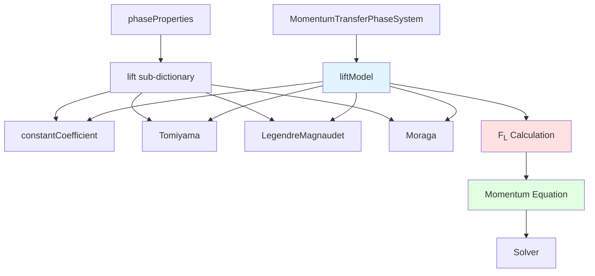
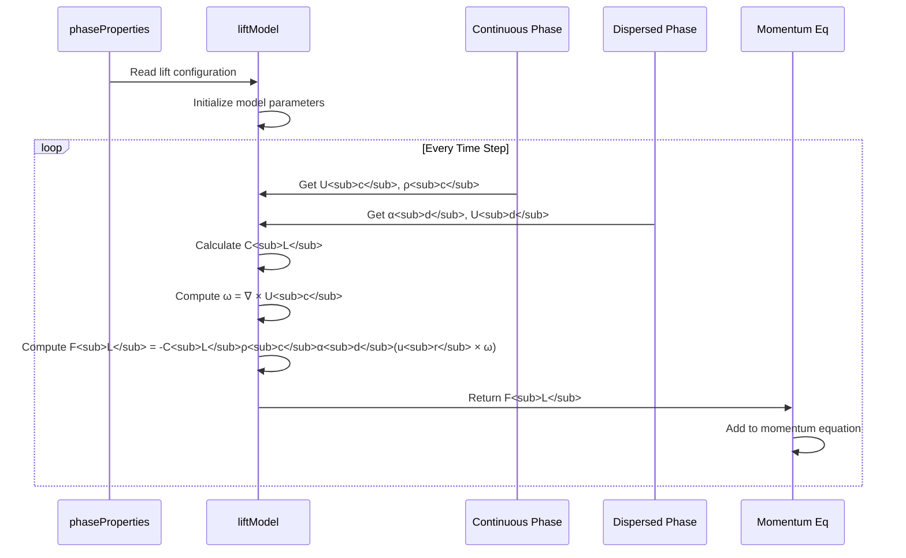
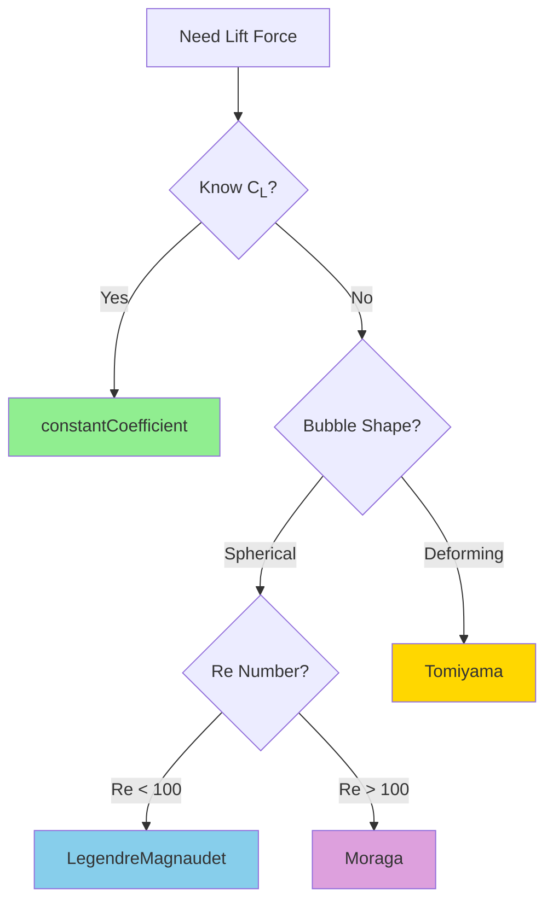
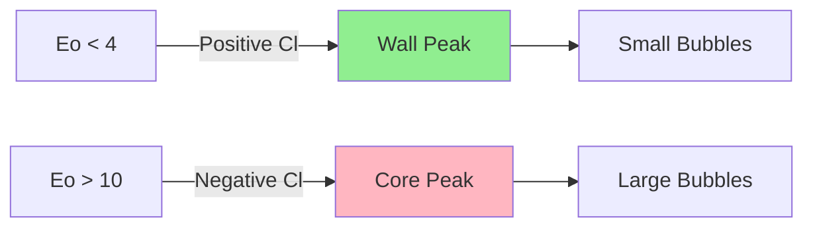
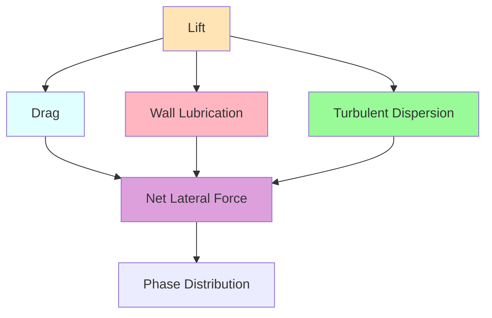

# Lift Force - OpenFOAM Implementation

การนำ Lift Models ไปใช้ใน OpenFOAM: Implementation Details, Configuration, and Troubleshooting

---

## Learning Objectives

หลังจากอ่านบทนี้ คุณจะสามารถ:
- กำหนดค่า lift models ใน OpenFOAM ได้อย่างถูกต้อง
- ทำความเข้าใจ source code structure และ implementation mechanism
- แก้ปัญหา numerical instability ที่เกิดจาก lift forces
- ตรวจสอบและ verify การทำงานของ lift models
- เลือก model ที่เหมาะสมกับสถานการณ์ที่แตกต่างกัน

---

## Prerequisites

- **ข้อกำหนดเบื้องต้น:**
  - ความเข้าใจพื้นฐานเกี่ยวกับ multiphase flow ใน OpenFOAM
  - ประสบการณ์ในการตั้งค่า `interfacialModels` ใน `constant/phaseProperties`
  - ความรู้เกี่ยวกับ C++ syntax และ OpenFOAM programming (สำหรับ custom implementation)
  - ความเข้าใจเกี่ยวกับ vorticity และ shear flows

---

## 1. Overview

### 1.1 Implementation Architecture



### 1.2 Force Calculation Flow



### 1.3 What This File Covers

| File | Scope |
|------|-------|
| `00_Overview.md` | Physical concepts, when lift matters, one example |
| `01_Fundamental_Lift_Concepts.md` | Mathematical derivation, vorticity fundamentals |
| `02_Specific_Lift_Models.md` | Detailed model formulations, theory |
| **`03_OpenFOAM_Implementation.md`** | **ALL implementation details, complete configuration, troubleshooting** |

---

## 2. Core Implementation

### 2.1 Mathematical Foundation in OpenFOAM

The lift force in OpenFOAM is implemented as:

$$\mathbf{F}_{lift} = -C_L \rho_c \alpha_d \left[ (\mathbf{u}_d - \mathbf{u}_c) \times (\nabla \times \mathbf{u}_c) \right]$$

Where:
- $C_L$ = lift coefficient (model-dependent)
- $\rho_c$ = continuous phase density
- $\alpha_d$ = dispersed phase volume fraction
- $\mathbf{u}_r = \mathbf{u}_d - \mathbf{u}_c$ = relative velocity
- $\nabla \times \mathbf{u}_c$ = vorticity of continuous phase

### 2.2 Base Class Structure

```cpp
// src/phaseSystemModels/liftModel/liftModel.H

template<class Pair>
class liftModel
:
    public interfacialModel
{
protected:
    // Pair data
    const Pair& pair_;
    
    // Dispersed phase
    const phaseModel& phase1_;
    
public:
    // Runtime type information
    TypeName("liftModel");
    
    // Constructors
    liftModel
    (
        const dictionary& dict,
        const Pair& pair
    );
    
    // Destructor
    virtual ~liftModel() = default;
    
    // Force calculation
    virtual tmp<volVectorField> F() const = 0;
    
    // Coefficient calculation
    virtual tmp<volScalarField> Cl() const = 0;
    
    // Field coefficients
    virtual tmp<volScalarField> Cl(const volScalarField& Re) const
    {
        return Cl();
    }
};
```

### 2.3 Default Force Calculation

```cpp
// src/phaseSystemModels/liftModel/liftModel.C

template<class Pair>
tmp<volVectorField> Foam::liftModel<Pair>::F() const
{
    // Calculate lift coefficient
    tmp<volScalarField> tCl = this->Cl();
    const volScalarField& Cl = tCl();
    
    // Get continuous phase properties
    const volScalarField& rhoc = pair_.continuous().rho();
    
    // Get dispersed phase volume fraction
    const volScalarField& alphaD = phase1_;
    
    // Calculate relative velocity: u_d - u_c
    const volVectorField Ur = pair_.Ur();
    
    // Calculate vorticity: curl(U_c)
    const volVectorField curlUc = fvc::curl(pair_.continuous().U());
    
    // Calculate lift force
    // F_L = -Cl * rho_c * alpha_d * (Ur x curlUc)
    return (-Cl * rhoc * alphaD * (Ur ^ curlUc));
}
```

### 2.4 Integration with Momentum Equation

```cpp
// In MomentumTransferPhaseSystem.C

template<class BasePhaseSystem>
void Foam::MomentumTransferPhaseSystem<BasePhaseSystem>::
addPhaseInterfaceForces
(
    const volVectorField& U,
    const PtrList<volScalarField>& rAUs,
    const PtrList<volScalarField>& rAUfs,
    const surfaceScalarField& rAUf,
    const PtrList<surfaceScalarField>& alphaPhis,
    const surfaceScalarField& alphaPhi,
    const PtrList<surfaceScalarField>& alphafs,
    const surfaceScalarField& alphaf,
    autoPtr<phaseSystem::momentumTransferTable>&
        momentumTransferPtr
) const
{
    // ... drag force ...
    
    // Add lift force
    if (this->interfacialModels_.found("lift"))
    {
        const phasePair& pair = this->phasePairs_[0];
        
        if (this->lift_.found(pair))
        {
            const liftModel& lift = this->lift_[pair];
            
            // Calculate lift force
            tmp<volVectorField> tLiftForce = lift.F();
            const volVectorField& liftForce = tLiftForce();
            
            // Add to momentum transfer table
            momentumTransfer().insert
            (
                pair.phase1().name(),
                pair.phase2().name(),
                liftForce
            );
        }
    }
}
```

---

## 3. Available Models in OpenFOAM

### 3.1 Model Selection Guide



### 3.2 Complete Configuration Reference

#### Configuration File Location
```
constant/phaseProperties
```

#### Complete Template

```cpp
// constant/phaseProperties

phases
(
    water
    {
        // Water properties
    }
    air
    {
        // Air properties
    }
);

// Lift force configuration
lift
{
    // Pair specification
    (air in water)
    {
        // Model selection
        type    <modelType>;  // Options: constantCoefficient, Tomiyama, 
                              //          LegendreMagnaudet, Moraga
        
        // Model-specific parameters (if any)
        // See below for each model
    }
}
```

---

## 4. Model-Specific Implementation

### 4.1 constantCoefficient Model

#### Purpose
Simple constant lift coefficient for well-characterized systems.

#### Configuration

```cpp
lift
{
    (air in water)
    {
        type    constantCoefficient;
        Cl      0.5;              // Constant lift coefficient
        // Optional: field specification for spatially varying Cl
        // ClField    <word>;       // Name of volScalarField with Cl values
    }
}
```

#### Source Code

```cpp
// liftModels/constantCoefficient/constantCoefficient.C

template<class Pair>
Foam::tmp<Foam::volScalarField>
Foam::liftModels::constantCoefficient<Pair>::Cl() const
{
    // Return constant coefficient
    return tmp<volScalarField>
    (
        new volScalarField
        (
            IOobject
            (
                "Cl",
                this->mesh_.time().timeName(),
                this->mesh_,
                IOobject::NO_READ,
                IOobject::NO_WRITE
            ),
            this->mesh_,
            dimensionedScalar("Cl", dimless, Cl_)
        )
    );
}
```

#### When to Use
- Well-documented systems with known $C_L$
- Validation studies
- Comparison with literature data
- When other models are unavailable or unstable

#### Typical $C_L$ Values

| System | $C_L$ | Source |
|--------|-------|--------|
| Small bubbles in water | 0.01 - 0.1 | Experimental |
| Droplets in gas | -0.2 to -0.5 | Literature |
| Solid particles | 0.2 - 0.5 | Empirical |

---

### 4.2 Tomiyama Model

#### Purpose
Most widely used model for deformable bubbles. Automatically accounts for Eötvös number effects.

#### Configuration

```cpp
lift
{
    (air in water)
    {
        type    Tomiyama;
        
        // Optional: override automatic calculation
        // Eo       <word>;     // Eötvös number field name
        // Re       <word>;     // Reynolds number field name
    }
}
```

#### Implementation Details

```cpp
// liftModels/Tomiyama/Tomiyama.C

template<class Pair>
Foam::tmp<Foam::volScalarField>
Foam::liftModels::Tomiyama<Pair>::Cl() const
{
    // Get dimensionless numbers from pair
    const volScalarField& Eo = pair_.Eo();     // Eötvös number
    const volScalarField& Re = pair_.Re();     // Reynolds number
    
    // Calculate Cl for spherical bubbles (function of Re)
    const volScalarField Cl_spherical
    (
        min
        (
            0.288 * tanh(0.121 * Re),
            0.00105 * pow3(Eo)
          - 0.0159 * sqr(Eo)
          - 0.0204 * Eo
          + 0.474
        )
    );
    
    // For large Eo (deformed bubbles), Cl approaches -0.288
    const volScalarField Cl_deformed(-0.288);
    
    // Smooth transition
    const volScalarField Eo_critical(4.0);
    
    return 
        pos(Eo_critical - Eo) * Cl_spherical
      + neg(Eo_critical - Eo) * Cl_deformed;
}
```

#### Sign Change Behavior

| Eötvös Number | Bubble Shape | $C_L$ | Lateral Force Direction |
|---------------|--------------|-------|------------------------|
| $Eo < 4$ | Nearly spherical | $> 0$ | Toward wall (upward gradient) |
| $4 < Eo < 10$ | Transition | Variable | Depends on local Eo |
| $Eo > 10$ | Deformed/spherical-cap | $\approx -0.29$ | Toward pipe center |

#### Physical Interpretation



#### When to Use
- **Default choice for most bubbly flows**
- Bubbles with $1 < Eo < 20$
- Pipe and channel flows
- Systems with bubble size distribution
- When bubble deformation is significant

#### Verification Test Case

```cpp
// Test: 2D bubble in linear shear flow
// Expected: Cl ≈ 0.01 for Eo ≈ 1, Re ≈ 1
// Expected: Cl ≈ -0.29 for Eo ≈ 20, Re ≈ 100

// System/controlDict
functions
{
    liftCoeff
    {
        type        sets;
        libs        ("libsampling.so");
        
        setFormat   raw;
        
        sets
        (
            bubbleLine
            {
                type        uniform;
                axis        y;
                start       (0 0 0);
                end         (0 0.1 0);
                nPoints     100;
            }
        );
        
        fields
        (
            Cl.air
            alpha.air
            U.water
        );
    }
}
```

---

### 4.3 Legendre-Magnaudet Model

#### Purpose
For spherical bubbles at low to moderate Reynolds numbers.

#### Configuration

```cpp
lift
{
    (air in water)
    {
        type    LegendreMagnaudet;
        
        // Optional: specific parameter names
        // Sr       <word>;     // Shear Reynolds number field
    }
}
```

#### Implementation

```cpp
// liftModels/LegendreMagnaudet/LegendreMagnaudet.C

template<class Pair>
Foam::tmp<Foam::volScalarField>
Foam::liftModels::LegendreMagnaudet<Pair>::Cl() const
{
    // Get Reynolds and shear Reynolds numbers
    const volScalarField Re = pair_.Re();
    const volScalarField Sr = pair_.Sr();  // Shear Reynolds: Sr = Re*du/dr
    
    // Potential flow contribution (high Re limit)
    volScalarField Cl_potential
    (
        6.0
      * sqrt(2.0*Re/(15.0*(1.0 + 0.2*Re)))
    );
    
    // Stokes flow contribution (low Re limit)
    volScalarField Cl_stokes
    (
        (2.0/3.0) * Sr
    );
    
    // Interpolation function
    volScalarField f_interpolate
    (
        1.0 / (1.0 + 0.2*Re)
    );
    
    return f_interpolate * Cl_stokes + (1.0 - f_interpolate) * Cl_potential;
}
```

#### Model Characteristics

| Reynolds Range | Dominant Term | $C_L$ Magnitude |
|----------------|---------------|-----------------|
| $Re < 1$ | Stokes | $\propto Sr$ (small) |
| $1 < Re < 100$ | Both | Intermediate |
| $Re > 100$ | Potential | $\sim 1.0$ |

#### When to Use
- Clean spherical bubbles
- $Re < 100$
- Well-defined shear flows
- High-fidelity simulations with resolved bubble interfaces

---

### 4.4 Moraga Model

#### Purpose
Accounts for near-wall effects and small bubble behavior.

#### Configuration

```cpp
lift
{
    (air in water)
    {
        type    Moraga;
        
        // Optional parameters
        // wallDistance   <word>;     // Wall distance field
        // yPlusCrit      5.0;        // Critical y+ for wall effect
    }
}
```

#### Implementation

```cpp
// liftModels/Moraga/Moraga.C

template<class Pair>
Foam::tmp<Foam::volScalarField>
Foam::liftModels::Moraga<Pair>::Cl() const
{
    const volScalarField Re = pair_.Re();
    
    // Base coefficient
    volScalarField Cl_base
    (
        0.2 * tanh(0.1 * Re)
    );
    
    // Wall effect (if wallDistance available)
    if (this->mesh_.foundObject<volScalarField>("wallDistance"))
    {
        const volScalarField& y = 
            this->mesh_.lookupObject<volScalarField>("wallDistance");
        
        scalar yPlusCrit = this->dict_.getOrDefault<scalar>("yPlusCrit", 5.0);
        
        volScalarField yPlus = y * this->pair_.continuous().U().magnitude()
                             / this->pair_.continuous().nu();
        
        // Reduce lift near walls
        Cl_base *= tanh(yPlus / yPlusCrit);
    }
    
    return Cl_base;
}
```

#### When to Use
- Small bubbles ($d < 2$ mm)
- Near-wall region important
- Wall-bounded turbulent flows
- When bubble migration to/from walls is critical

---

## 5. Complete Working Example

### 5.1 Case Structure

```
bubbleColumn/
├── 0/
│   ├── air
│   │   ├── alpha           # Volume fraction
│   │   └── U               # Velocity
│   └── water
│       ├── alpha
│       └── U
├── constant/
│   ├── phaseProperties     # Lift model configuration
│   ├── transportProperties
│   └── turbulenceProperties
└── system/
    ├── controlDict
    ├── fvSchemes
    └── fvSolution
```

### 5.2 phaseProperties (Complete)

```cpp
// constant/phaseProperties

// Phase definitions
phases
(
    water
    {
        // Continuum phase
        transportModel  Newtonian;
        nu              1e-06;          // [m²/s]
        rho             1000;           // [kg/m³]
        
        // Turbulence model
        turbulenceModel  kEpsilon;
        
        // Optional: thermal properties
        Cp              4181;           // [J/kg/K]
        kappa           0.6;            // [W/m/K]
    }
    
    air
    {
        // Dispersed phase
        transportModel  Newtonian;
        nu              1.48e-05;       // [m²/s]
        rho             1.2;            // [kg/m³]
        
        // Bubble diameter (for Eo, Re calculation)
        d               0.003;          // [m] = 3 mm bubbles
        
        // Turbulence
        turbulenceModel  laminar;
    }
);

// Interfacial models configuration
// ====================================

// Drag model
drag
{
    (air in water)
    {
        type    SchillerNaumann;
    }
}

// Lift model
lift
{
    (air in water)
    {
        type    Tomiyama;
        
        // Optional: spatially varying bubble size
        // If specified, overrides d in phase definition
        // dField       bubbleDiameter;
    }
}

// Virtual mass (optional)
virtualMass
{
    (air in water)
    {
        type    constantCoefficient;
        Cvm     0.5;
    }
}

// Wall lubrication (optional - often used with lift)
wallLubrication
{
    (air in water)
    {
        type    Antal;
    }
}

// Turbulent dispersion (optional)
turbulentDispersion
{
    (air in water)
    {
        type    Burns;
    }
}

// Surface tension (optional)
surfaceTension
{
    (air in water)
    {
        type    constant;
        sigma   0.072;          // [N/m] for air-water at 20°C
    }
}
```

### 5.3 Solver Configuration

#### system/controlDict

```cpp
// system/controlDict

application     interFoam;

startFrom       startTime;
startTime       0;

stopAt          endTime;
endTime         10.0;          // [s]

deltaT          0.001;         // Initial time step

writeControl    timeStep;
writeInterval   100;

// Adaptive time stepping for lift force stability
adjustTimeStep  yes;

maxCo           0.5;           // Courant number limit
maxAlphaCo      0.5;           // Phase fraction Courant limit

maxDeltaT       0.01;          // Maximum time step

// Functions for lift force analysis
functions
{
    // Calculate lift coefficient field
    liftCoeffField
    {
        type            coded;
        libs            ("libutilityFunctionObjects.so");
        
        name            liftCalc;
        writeControl    writeTime;
        
        codeWrite
        #{
            const fvMesh& mesh = this->mesh();
            
            // Get phases
            const volVectorField& U_water = 
                mesh.lookupObject<volVectorField>("U.water");
            const volVectorField& U_air = 
                mesh.lookupObject<volVectorField>("U.air");
            const volScalarField& alpha_air = 
                mesh.lookupObject<volScalarField>("alpha.air");
            const volScalarField& rho_water = 
                mesh.lookupObject<volScalarField>("rho.water");
            
            // Calculate relative velocity
            volVectorField Ur = U_air - U_water;
            
            // Calculate vorticity
            volVectorField vorticity = fvc::curl(U_water);
            
            // Calculate lift force per unit volume (assuming Cl = 0.3)
            dimensionedScalar Cl("Cl", dimless, 0.3);
            volVectorField F_lift
            (
                IOobject
                (
                    "F_lift",
                    mesh.time().timeName(),
                    mesh,
                    IOobject::NO_READ,
                    IOobject::AUTO_WRITE
                ),
                -Cl * rho_water * alpha_air * (Ur ^ vorticity)
            );
            
            F_lift.write();
        #};
    }
    
    // Radial distribution of phase fraction
    radialProfile
    {
        type            sets;
        libs            ("libsampling.so");
        
        setFormat       csv;
        
        sets
        (
            radialLine
            {
                type            uniform;
                axis            y;
                start           (0 0 0);
                end             (0 0.1 0);
                nPoints         100;
            }
        );
        
        fields
        (
            alpha.air
            alpha.water
            U.air
            U.water
            F_lift
        );
    }
    
    // Force statistics
    forceStats
    {
        type            volFieldValue;
        libs            ("libfieldFunctionObjects.so");
        
        writeControl    writeTime;
        
        operation       volAverage;
        
        fields
        (
            alpha.air
            F_lift
        );
    }
}
```

#### system/fvSolution

```cpp
// system/fvSolution

solvers
{
    // Pressure
    p_rgh
    {
        solver          GAMG;
        tolerance       1e-08;
        relTol          0.01;
        
        smoother        GaussSeidel;
        nPreSweeps      0;
        nPostSweeps     2;
        cacheAgglomeration true;
        nCellsInCoarsestLevel 10;
        agglomerator    faceAreaPair;
        mergeLevels     1;
    }
    
    // Velocity
    "(U|k|epsilon|omega|nuTilda)"
    {
        solver          smoothSolver;
        smoother        GaussSeidel;
        tolerance       1e-06;
        relTol          0.1;
        nSweeps         1;
    }
    
    // Volume fraction
    "alpha.*"
    {
        nAlphaCorr      2;
        nAlphaSubCycles 2;
        
        alphaApplyPrevCorr yes;
        
        MULESCorr       yes;
        
        solver          smoothSolver;
        smoother        GaussSeidel;
        tolerance       1e-08;
        relTol          0;
    }
}

// PIMPLE algorithm
PIMPLE
{
    // Corrector loops (more for lift force stability)
    nCorrectors     3;
    
    nNonOrthogonalCorrectors 1;
    
    // Pressure-velocity coupling
    nAlphaCorr      2;
    nOuterCorrectors 2;
    
    // Momentum predictor
    momentumPredictor yes;
    
    // Transient options
    transonic       no;
    consistent      yes;
}

// Relaxation factors (CRITICAL for lift force stability)
relaxationFactors
{
    fields
    {
        p_rgh           0.3;
    }
    
    equations
    {
        U               0.5;    // Lower for strong lift forces
        "(U|k|epsilon|omega|nuTilda)"  0.5;
        "alpha.*"       0.3;    // Very low for multiphase stability
    }
}
```

#### system/fvSchemes

```cpp
// system/fvSchemes

ddtSchemes
{
    default         Euler;
}

gradSchemes
{
    default         Gauss linear;
    
    // Second order for vorticity accuracy (important for lift)
    grad(U)         Gauss linear;
    grad(alpha)     Gauss linear;
}

divSchemes
{
    default         none;
    
    // Convection schemes
    div(phi,U)      Gauss upwind;          // Start with upwind
    div(phi,k)      Gauss upwind;
    div(phi,epsilon) Gauss upwind;
    
    // Sharpen interface
    div(phi,alpha)  Gauss vanLeer;         // Interface compression
    div(phirb,alpha) Gauss interfaceCompression 1.0;
    
    // Laplacian schemes
    laplacian(nu,U) Gauss linear corrected;
    laplacian((1|A(U)),p_rgh) Gauss linear corrected;
    
    // Interpolation schemes
    interpolate(U)  linear;
}

laplacianSchemes
{
    default         Gauss linear corrected;
}

interpolationSchemes
{
    default         linear;
}

snGradSchemes
{
    default         corrected;
}

// Wall functions for near-wall treatment
wallDist
{
    method meshWave;
}
```

---

## 6. Troubleshooting Guide

### 6.1 Common Issues and Solutions

#### Issue 1: Simulation Divergence

**Symptoms:**
```
Time = 0.45

smoothSolver:  Solving for U.air, Initial residual = 0.0012, Final residual = 145.3, No Iterations 1000
--> FOAM FATAL ERROR:
Maximum number of iterations exceeded
```

**Causes:**
1. Too large lift coefficient
2. Strong vorticity causing large lateral forces
3. Insufficient mesh resolution
4. Time step too large

**Solutions:**
```cpp
// 1. Reduce relaxation factor
relaxationFactors
{
    equations
    {
        U       0.3;    // Reduced from 0.5
    }
}

// 2. Limit time step via maxCo
maxCo           0.3;    // Reduced from 0.5

// 3. Use first-order schemes temporarily
div(phi,U)      Gauss upwind;

// 4. Add numerical damping
divSchemes
{
    div((phi*interpolate(rho)),U)  Gauss linearUpwindV grad(U);
}
```

#### Issue 2: Unphysical Phase Distribution

**Symptoms:**
- All bubbles accumulate at walls
- Bubbles concentrate in center regardless of size

**Diagnosis:**
```cpp
// Add to controlDict to check
functions
{
    checkCl
    {
        type            coded;
        libs            ("libutilityFunctionObjects.so");
        
        name            ClCheck;
        writeControl    timeStep;
        writeInterval   1;
        
        codeExecute
        #{
            const fvMesh& mesh = this->mesh();
            const volScalarField& Cl = 
                mesh.lookupObject<volScalarField>("Cl.air");
            
            Info<< "Cl range: " 
                << "min = " << min(Cl).value() 
                << ", max = " << max(Cl).value() 
                << ", avg = " << average(Cl).value() << endl;
        #};
    }
}
```

**Fixes:**

| Problem | Fix |
|---------|-----|
| $C_L$ always positive | Check Eo calculation, use Tomiyama |
| $C_L$ wrong magnitude | Verify bubble diameter in phaseProperties |
| No size-dependent distribution | Implement size distribution or use constant |

#### Issue 3: Vorticity Calculation Problems

**Symptoms:**
- Spikes in lift force
- Checkerboard patterns in $C_L$ field

**Causes:**
- Poor mesh quality
- Inconsistent gradient schemes

**Solutions:**
```cpp
// 1. Check mesh quality
checkMesh -allGeometry -allTopology

// 2. Improve gradient calculation
gradSchemes
{
    grad(U)     Gauss linear;  // Or cellLimited for stability
}

// 3. Add vorticity damping
// In fvSolution
PIMPLE
{
    // Add extra correctors
    nCorrectors     4;  // Increased from 2
}
```

#### Issue 4: Wrong Lift Direction

**Symptoms:**
- Small bubbles move to center instead of wall
- Large bubbles move to wall instead of center

**For Tomiyama Model:**

```cpp
// Check Eo number
functions
{
    checkEo
    {
        type            coded;
        libs            ("libutilityFunctionObjects.so");
        
        name            EoCheck;
        writeControl    writeTime;
        
        codeExecute
        #{
            const fvMesh& mesh = this->mesh();
            
            // Get phase properties
            const phasePair& pair = /* get pair */;
            const volScalarField& Eo = pair.Eo();
            
            Info<< "Eo range: " 
                << min(Eo).value() << " - " 
                << max(Eo).value() << endl;
            
            // Count bubbles in each regime
            scalar nSmall = sum(pos(4.0 - Eo)).value();
            scalar nLarge = sum(neg(4.0 - Eo)).value();
            
            Info<< "Small bubbles (Eo < 4): " << nSmall << endl;
            Info<< "Large bubbles (Eo > 4): " << nLarge << endl;
        #};
    }
}
```

**Fix:**
- Verify bubble diameter in `phaseProperties`
- Check surface tension value
- Confirm density difference

### 6.2 Best Practices

#### Mesh Requirements

```cpp
// Minimum resolution
yPlus          1;      // For near-wall lift effects

// For accurate vorticity
// At least 10 cells across bubble diameter
// For pipe flow: 20-30 cells across radius for profile
```

#### Solver Stability

```cpp
// Recommended progression
// Step 1: Without lift
// lift  { }

// Step 2: Small constant lift
// lift
// {
//     (air in water)
//     {
//         type    constantCoefficient;
//         Cl      0.01;
//     }
// }

// Step 3: Target model
// lift
// {
//     (air in water)
//     {
//         type    Tomiyama;
//     }
// }
```

#### Convergence Monitoring

```cpp
// In controlDict
functions
{
    residuals
    {
        type            residuals;
        libs            ("libutilityFunctionObjects.so");
        
        fields
        (
            p_rgh
            U.air
            U.water
            alpha.air
        );
        
        tolerance       1e-05;
        absTolerances   1e-10;
    }
    
    // Monitor lift force
    liftForceMagnitude
    {
        type            volIntegrate;
        libs            ("libfieldFunctionObjects.so");
        
        writeControl    timeStep;
        
        operation       mag;
        
        fields
        (
            F_lift
        );
    }
}
```

---

## 7. Verification and Validation

### 7.1 Analytical Test Cases

#### Test 1: Linear Shear Flow

**Setup:**
- Single bubble in linear shear
- $u_c(y) = \dot{\gamma} y$
- $\omega = \dot{\gamma}$ (constant)

**Expected:**
$$F_L = C_L \rho_c \alpha_d U_r \dot{\gamma}$$

**Verification:**
```cpp
// Create 2D channel
// u_water = (shearRate * y, 0, 0)
// u_air = (0, 0, 0)
// Measure F_lift
```

#### Test 2: Pipe Flow Comparison

**Literature Data:**
- Tomiyama et al. (2002)
- Pipe diameter: 50 mm
- Air bubbles in water

**Expected Distribution:**

| Bubble Size | Peak Location |
|-------------|---------------|
| $d < 3$ mm | Near wall ($r/R \approx 0.8$) |
| $d > 4$ mm | Core ($r/R \approx 0$) |

**Validation:**
```cpp
// Extract radial profile
// Compare with experimental data
```

### 7.2 Code-Based Verification

```cpp
// system/controlDict

functions
{
    // Lift force balance check
    liftBalance
    {
        type            coded;
        libs            ("libutilityFunctionObjects.so");
        
        name            liftCheck;
        writeControl    writeTime;
        
        codeWrite
        #{
            const fvMesh& mesh = this->mesh();
            const Time& time = mesh.time();
            
            // Get lift force
            const volVectorField& F_lift = 
                mesh.lookupObject<volVectorField>("F_lift");
            
            // Integrate over domain
            vector totalLift = gSum(F_lift * mesh.V());
            
            Info<< "Total lift force: " << totalLift << endl;
            
            // Should be approximately zero in closed system
            if (mag(totalLift) > 1e-10)
            {
                WarningInFunction
                    << "Non-zero net lift force: " << totalLift
                    << " (possible error)" << endl;
            }
        #};
    }
}
```

---

## 8. Advanced Topics

### 8.1 Spatially Varying Bubble Size

For polydisperse systems:

```cpp
// In phaseProperties
air
{
    // Instead of constant d:
    dField  bubbleDiameter;
}

// Pre-calculate bubbleDiameter field
// Using separate field calculation or population balance
```

### 8.2 Custom Lift Model

```cpp
// Create new model: $MY_LIFT_MODEL/liftModels/myModel/

// myModel.H
#ifndef myModel_H
#define myModel_H

#include "liftModel.H"

// * * * * * * * * * * * * * * * * * * * * * * * * * * * * * * * * * * * * * //

namespace Foam
{
namespace liftModels
{

class myModel
:
    public liftModel
{
    // Private data
    
    scalar Cl_;
    
public:
    
    TypeName("myModel");
    
    myModel
    (
        const dictionary& dict,
        const phasePair& pair
    );
    
    virtual ~myModel() = default;
    
    virtual tmp<volScalarField> Cl() const;
};

} // namespace liftModels
} // namespace Foam

// * * * * * * * * * * * * * * * * * * * * * * * * * * * * * * * * * * * * * //

#endif

// * * * * * * * * * * * * * * * * * * * * * * * * * * * * * * * * * * * * * //
```

```cpp
// myModel.C

#include "myModel.H"

// * * * * * * * * * * * * * * * * Member Functions * * * * * * * * * * * * * //

template<class Pair>
Foam::liftModels::myModel::myModel
(
    const dictionary& dict,
    const Pair& pair
)
:
    liftModel(dict, pair),
    Cl_(dict.get<scalar>("Cl"))
{}


template<class Pair>
Foam::tmp<Foam::volScalarField>
Foam::liftModels::myModel::Cl() const
{
    // Your custom implementation
    return tmp<volScalarField>
    (
        new volScalarField
        (
            IOobject
            (
                "Cl",
                this->mesh_.time().timeName(),
                this->mesh_,
                IOobject::NO_READ,
                IOobject::NO_WRITE
            ),
            this->mesh_,
            dimensionedScalar("Cl", dimless, Cl_)
        )
    );
}
```

### 8.3 Interaction with Other Forces



**Typical Magnitudes:**

| Force | Typical Magnitude (N/m³) |
|-------|--------------------------|
| Drag | $O(10-1000)$ |
| Lift | $O(1-100)$ |
| Wall Lubrication | $O(0.1-10)$ |
| Turbulent Dispersion | $O(0.1-10)$ |

---

## 9. Source Code Reference

### 9.1 File Structure

```
$FOAM_SRC/
└── phaseSystemModels/
    └── interfacialModels/
        └── liftModels/
            ├── liftModel.H                      # Base class header
            ├── liftModel.C                      # Base class implementation
            │
            ├── constantCoefficient/
            │   ├── constantCoefficient.H
            │   └── constantCoefficient.C
            │
            ├── Tomiyama/
            │   ├── Tomiyama.H
            │   ├── Tomiyama.C
            │   └── TomiyamaNew.C
            │
            ├── LegendreMagnaudet/
            │   ├── LegendreMagnaudet.H
            │   └── LegendreMagnaudet.C
            │
            ├── Moraga/
            │   ├── Moraga.H
            │   └── Moraga.C
            │
            └── newLiftModel/                   # Template for custom models
                ├── newLiftModel.H
                └── newLiftModel.C
```

### 9.2 Key Code Locations

| Component | File Location | Lines (approx.) |
|-----------|---------------|-----------------|
| Base class declaration | `liftModel.H` | 50-120 |
| Base force calculation | `liftModel.C` | 30-80 |
| Tomiyama implementation | `Tomiyama/Tomiyama.C` | 40-150 |
| Integration in solver | `MomentumTransferPhaseSystem.C` | 200-300 |
| PhaseProperties reading | `phaseSystem.C` | 150-250 |

### 9.3 Compilation

```bash
# To add custom lift model
cd $WM_PROJECT_USER_DIR/src/phaseSystemModels/liftModels/myModel

wmake
```

```makefile
# Make/files
myModel.C

LIB = $(FOAM_USER_LIBBIN)/libcustomLiftModels
```

```makefile
# Make/options
EXE_INC = \
    -I$(LIB_SRC)/finiteVolume/lnInclude \
    -I$(LIB_SRC)/meshTools/lnInclude \
    -I$(LIB_SRC)/phaseSystemModels/lnInclude

LIB_LIBS = \
    -lfiniteVolume \
    -lmeshTools
```

---

## 10. Key Takeaways

### Essential Points

1. **Model Selection**
   - Tomiyama is the default choice for most bubbly flows
   - Use constantCoefficient for validation or well-characterized systems
   - Consider Eötvös number when selecting models

2. **Configuration**
   - Define in `constant/phaseProperties` under `lift` sub-dictionary
   - Specify model type with `type` keyword
   - Check bubble diameter for Eo calculation

3. **Numerical Stability**
   - Reduce relaxation factors (U to 0.3-0.5)
   - Use smaller time steps (maxCo < 0.3)
   - Consider starting with first-order schemes

4. **Verification**
   - Check $C_L$ field for expected range
   - Verify Eo number for appropriate sign
   - Monitor radial phase distribution

5. **Common Pitfalls**
   - Wrong lift direction → Check Eo calculation
   - Instability → Reduce relaxation or time step
   - Unphysical distribution → Verify bubble diameter

### Quick Reference Card

```
┌─────────────────────────────────────────────────────────────┐
│                  LIFT FORCE QUICK REFERENCE                  │
├─────────────────────────────────────────────────────────────┤
│ File: constant/phaseProperties → lift sub-dictionary        │
│                                                              │
│ Models:                                                      │
│   • constantCoefficient  → Cl = constant                    │
│   • Tomiyama            → Cl(Eo, Re) [DEFAULT]              │
│   • LegendreMagnaudet    → Cl(Re, Sr)                        │
│   • Moraga              → Cl(Re, wallDist)                  │
│                                                              │
│ Stability:                                                   │
│   relaxationFactors.equations.U  = 0.3-0.5                   │
│   maxCo                        = 0.3                        │
│                                                              │
│ Troubleshooting:                                             │
│   Divergence        → ↓ relaxation, ↑ under-relaxation      │
│   Wrong direction   → Check Eo, verify d in phaseProperties │
│   Oscillations      → Refine mesh, use limiter schemes      │
└─────────────────────────────────────────────────────────────┘
```

---

## 11. Further Reading

### OpenFOAM Documentation

- **User Guide:** Chapter 4 - Multiphase Flows
- **Programmer's Guide:** Section 6.3 - Interfacial Models
- **Doxygen:** `liftModel` class documentation

### Key References

1. **Tomiyama, A. et al. (2002)**
   - "Transverse migration of single bubbles in simple shear flow"
   - *Chemical Engineering Science*, 57, 1849-1858
   - DOI: 10.1016/S0009-2509(02)00085-2

2. **Legendre, D. & Magnaudet, J. (1998)**
   - "The lift force on a spherical bubble in a viscous linear shear flow"
   - *Journal of Fluid Mechanics*, 368, 81-126
   - DOI: 10.1017/S0022112098001629

3. **Moraga, F.J. et al. (2006)**
   - "Lift forces in bubbly flows"
   - *International Journal of Multiphase Flow*, 32, 856-878
   - DOI: 10.1016/j.ijmultiphaseflow.2006.04.006

### Related OpenFOAM Models

- **Wall Lubrication:** Prevents bubble accumulation at walls
- **Turbulent Dispersion:** Spreads bubbles via turbulence
- **Virtual Mass:** Accounts for added mass effects

### Related Documentation Files

- **[00_Overview.md](00_Overview.md)** - Physical concepts and when lift matters
- **[01_Fundamental_Lift_Concepts.md](01_Fundamental_Lift_Concepts.md)** - Mathematical derivation and vorticity
- **[02_Specific_Lift_Models.md](02_Specific_Lift_Models.md)** - Detailed model formulations
- **[../04_INTERPHASE_FORCES/00_Overview.md](../04_INTERPHASE_FORCES/00_Overview.md)** - All interphase forces

---

## Concept Check

<details>
<summary><b>1. ทำไม Tomiyama model ถึงเป็นตัวเลือก default สำหรับ bubbly flows ส่วนใหญ่?</b></summary>

เพราะ Tomiyama model **automatically accounts for Eötvös number effects**:
- ไม่ต้องกำหนด $C_L$ เองแบบ constantCoefficient
- **Handles sign change** เมื่อ bubble deforms ($Eo > 4$)
- Validated กับ experimental data ที่หลากหลาย
- Suitable สำหรับ bubble size distributions

**Key advantage:** เดียว model เดียว cover ทั้ง small bubbles (positive $C_L$) และ large bubbles (negative $C_L$)
</details>

<details>
<summary><b>2. curl(U) ใน lift equation หมายถึงอะไร และทำไมสำคัญ?</b></summary>

**curl(U) = vorticity ($\omega$)** คือ local rotation ของ flow

**ความสำคัญ:**
- **Indicates shear:** Vorticity = การมี velocity gradient
- **Determines lift direction:** $\mathbf{F}_L \propto (\mathbf{u}_r \times \omega)$
- **Causes lateral migration:** Bubbles move ขึ้นมุมฉากกับ vorticity vector

**Physical interpretation:**
- ใน pipe flow: vorticity สูง near walls → strong lift forces
- ใน core region: vorticity ต่ำ → weak lift forces

**Numerical concern:**
- Poor gradient schemes → inaccurate vorticity → wrong lift
- Need adequate mesh resolution for $\nabla \times U$
</details>

<details>
<summary><b>3. ทำไม lift force ถึงทำให้ solver unstable และแก้ไขอย่างไร?</b></summary>

**Causes of instability:**

1. **Coupling mechanism:**
   - Lift **couples velocity fields ของทั้งสองเฟส** ผ่าน vorticity
   - Increases off-diagonal terms ใน system matrix
   - Makes system less diagonally dominant

2. **Non-linearity:**
   - $F_L \propto (\mathbf{u}_r \times \nabla \times \mathbf{u}_c)$
   - Product ของ two velocity fields → highly nonlinear

3. **Spatial variations:**
   - Vorticity แปรเปลี่ยนอย่างรวดเร็ว near walls
   - Can cause force spikes

**Solutions:**

```cpp
// 1. Under-relaxation (MOST IMPORTANT)
relaxationFactors
{
    equations
    {
        U       0.3;    // Reduce from default
    }
}

// 2. Time step control
maxCo           0.3;    // Stricter limit

// 3. Numerical schemes
gradSchemes
{
    grad(U)     Gauss limitedLinear 1;  // Limiters
}

// 4. Gradual activation
// Step 1: Run without lift
// Step 2: Add small constant Cl
// Step 3: Switch to Tomiyama
```

**Rule of thumb:** Start with **low relaxation + small time step**, gradually increase
</details>

<details>
<summary><b>4. ต้อง check อะไรบ้างหลังจาก setup lift model?</b></summary>

**Essential checks:**

**1. Configuration check:**
```bash
# Verify model is loaded
grep -r "lift" constant/phaseProperties

# Check if solver recognizes it
solverName -listSwitches
```

**2. Field check:**
```cpp
// Add to controlDict
functions
{
    liftDiag
    {
        type            volFieldValue;
        operation       volAverage;
        
        fields
        (
            Cl.air          // Should exist if model works
            alpha.air
        );
    }
}
```

**3. Physical check:**
- Small bubbles → accumulate near walls ($C_L > 0$)
- Large bubbles → accumulate in center ($C_L < 0$)
- If wrong, check Eo calculation

**4. Numerical check:**
- Monitor residuals for `U.air`, `U.water`
- Check time step continuity
- Look for force spikes

**5. Convergence check:**
```bash
# Plot lift force magnitude vs time
awk '/Total lift force/ {print $NF}' log.* > lift_history.dat
```

**Critical check:** If Cl field is missing or NaN → model not loaded correctly
</details>

<details>
<summary><b>5. ควรใช้ model ไหนเมื่อไร? (Decision flow)</b></summary>

```
Need lift force in OpenFOAM?
    │
    ├─ Known Cl from experiments?
    │  └─ YES → constantCoefficient (validation, comparison)
    │
    ├─ Bubbly flow (air in water, etc.)?
    │  └─ YES → Tomiyama [DEFAULT CHOICE]
    │           - Handles deformation
    │           - Auto sign change
    │           - Most validated
    │
    ├─ Clean, spherical bubbles only?
    │  └─ YES → LegendreMagnaudet
    │           - Re/Sr dependent
    │           - Low to moderate Re
    │
    ├─ Near-wall effects critical?
    │  └─ YES → Moraga
    │           - Accounts for wall proximity
    │           - Small bubbles
    │
    └─ None of the above?
       └─ Start with Tomiyama, verify with experimental data
```

**Quick reference:**

| Situation | Model | Reason |
|-----------|-------|--------|
| Production simulation | Tomiyama | Robust, widely validated |
| Validation study | constantCoefficient | Direct comparison |
| Fundamental research | LegendreMagnaudet | Accurate for ideal conditions |
| Wall-bounded flows | Moraga | Captures near-wall physics |
| Unknown system | Tomiyama → experiment | Validate then refine |

**Tip:** Always verify model choice against experimental data when available!
</details>

---

## Related Documents

### Module 04: Multiphase Fundamentals

- **[00_Overview.md](00_Overview.md)** - Overview of interphase forces in multiphase flow
- **[01_Fundamental_Lift_Concepts.md](01_Fundamental_Lift_Concepts.md)** - Physical mechanisms and mathematical derivation
- **[02_Specific_Lift_Models.md](02_Specific_Lift_Models.md)** - Detailed model formulations

### Module 04: Interphase Forces

- **[../04_INTERPHASE_FORCES/00_Overview.md](../04_INTERPHASE_FORCES/00_Overview.md)** - All interphase forces overview
- **[../04_INTERPHASE_FORCES/01_DRAG/03_OpenFOAM_Implementation.md](../04_INTERPHASE_FORCES/01_DRAG/03_OpenFOAM_Implementation.md)** - Drag force implementation
- **[../04_INTERPHASE_FORCES/02_LIFT/03_OpenFOAM_Implementation.md](../04_INTERPHASE_FORCES/02_LIFT/03_OpenFOAM_Implementation.md)** - This file

### Module 03: Single Phase Flow

- **[../../MODULE_03_SINGLE_PHASE_FLOW/CONTENT/03_TURBULENCE_MODELING/00_Overview.md](../../MODULE_03_SINGLE_PHASE_FLOW/CONTENT/03_TURBULENCE_MODELING/00_Overview.md)** - Turbulence modeling for continuous phase

### Practical Applications

- **[../../MODULE_03_SINGLE_PHASE_FLOW/CONTENT/05_PRACTICAL_APPLICATIONS/02_Internal_Flow_and_Piping.md](../../MODULE_03_SINGLE_PHASE_FLOW/CONTENT/05_PRACTICAL_APPLICATIONS/02_Internal_Flow_and_Piping.md)** - Internal flow applications where lift is important