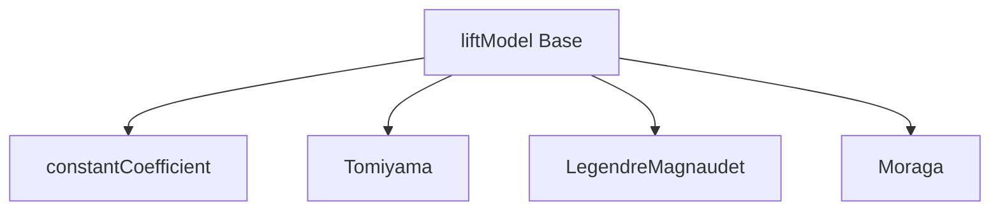

# Lift Force - OpenFOAM Implementation

การนำ Lift Models ไปใช้ใน OpenFOAM

---

## Overview



---

## 1. Lift Force Implementation

$$\mathbf{F}_L = -C_L \rho_c \alpha_d (\mathbf{u}_r) \times (\nabla \times \mathbf{u}_c)$$

### Class Structure

```cpp
class liftModel
{
public:
    virtual tmp<volVectorField> F() const = 0;
    virtual tmp<volScalarField> Cl() const = 0;
};
```

### Force Calculation

```cpp
tmp<volVectorField> liftModel::F() const
{
    return
        Cl()
       *phase1_.rho()
       *(pair_.Ur() ^ fvc::curl(pair_.continuous().U()));
}
```

---

## 2. Available Models

### constantCoefficient

```cpp
lift
{
    (air in water)
    {
        type    constantCoefficient;
        Cl      0.5;
    }
}
```

**Use:** Simple cases, known $C_L$

### Tomiyama

```cpp
lift
{
    (air in water)
    {
        type    Tomiyama;
    }
}
```

**Use:** General bubbles, accounts for deformation

### LegendreMagnaudet

```cpp
lift
{
    (air in water)
    {
        type    LegendreMagnaudet;
    }
}
```

**Use:** Spherical bubbles, function of Re and Sr

### Moraga

```cpp
lift
{
    (air in water)
    {
        type    Moraga;
    }
}
```

**Use:** Small bubbles, near-wall effects

---

## 3. Tomiyama Implementation

### Coefficient Calculation

```cpp
tmp<volScalarField> Tomiyama::Cl() const
{
    volScalarField Eo = pair_.Eo();
    volScalarField Re = pair_.Re();

    return min
    (
        0.288*tanh(0.121*Re),
        0.00105*pow3(Eo) - 0.0159*sqr(Eo) - 0.0204*Eo + 0.474
    );
}
```

### Sign Change

| Eo Range | $C_L$ | Direction |
|----------|-------|-----------|
| < 4 | Positive | Toward wall |
| 4-10 | Transition | — |
| > 10 | -0.29 | Toward center |

---

## 4. Source Code Locations

| Component | Path |
|-----------|------|
| Base class | `src/phaseSystemModels/interfacialModels/liftModels/` |
| Tomiyama | `liftModels/Tomiyama/Tomiyama.C` |
| LegendreMagnaudet | `liftModels/LegendreMagnaudet/` |

---

## 5. Adding to Momentum

```cpp
// In MomentumTransferPhaseSystem
tmp<volVectorField> liftForce = liftModel_->F();

// Add to momentum equation
UEqn += liftForce;
```

---

## 6. Numerical Stability

### Under-Relaxation

```cpp
// system/fvSolution
relaxationFactors
{
    equations
    {
        U       0.6;    // Lower when lift is strong
    }
}
```

### Common Issues

| Problem | Cause | Solution |
|---------|-------|----------|
| Oscillations | Strong lift | Reduce $C_L$ or relax U |
| Wrong distribution | Sign error | Check Eo, use Tomiyama |
| Divergence | Large $\nabla \times U$ | Refine mesh |

---

## 7. Verification

### Check Lift Force Field

```cpp
// system/controlDict
functions
{
    liftForce
    {
        type    coded;
        libs    (utilityFunctionObjects);
        name    liftCheck;
        executeControl  writeTime;
        codeExecute
        #{
            const fvMesh& mesh = refCast<const fvMesh>(obr_);
            // Calculate and write lift force
        #};
    }
}
```

### Expected Behavior

| Pipe Flow | Wall Region | Core Region |
|-----------|-------------|-------------|
| Small bubbles | Higher α | Lower α |
| Large bubbles | Lower α | Higher α |

---

## Quick Reference

| Model | Keyword | Best For |
|-------|---------|----------|
| Constant | `constantCoefficient` | Simple, known $C_L$ |
| Tomiyama | `Tomiyama` | General bubbles |
| Legendre | `LegendreMagnaudet` | Spherical, Re/Sr dependent |
| Moraga | `Moraga` | Small, near-wall |

---

## Concept Check

<details>
<summary><b>1. ทำไม Tomiyama model ถึงนิยม?</b></summary>

เพราะ **accounts for Eo automatically** — ไม่ต้องกำหนด $C_L$ เอง และ handles sign change เมื่อ bubble deforms
</details>

<details>
<summary><b>2. curl(U) ใน lift equation หมายถึงอะไร?</b></summary>

**Vorticity** ($\omega = \nabla \times U$) — แสดง local rotation ของ flow ซึ่ง cause lift force
</details>

<details>
<summary><b>3. ทำไม lift ทำให้ solver unstable?</b></summary>

เพราะ **couples velocity fields ของทั้งสองเฟสผ่าน vorticity** — เพิ่ม off-diagonal terms ใน matrix
</details>

---

## Related Documents

- **ภาพรวม:** [00_Overview.md](00_Overview.md)
- **Lift Mechanisms:** [01_Lift_Mechanisms.md](01_Lift_Mechanisms.md)
- **Specific Models:** [02_Specific_Models.md](02_Specific_Models.md)