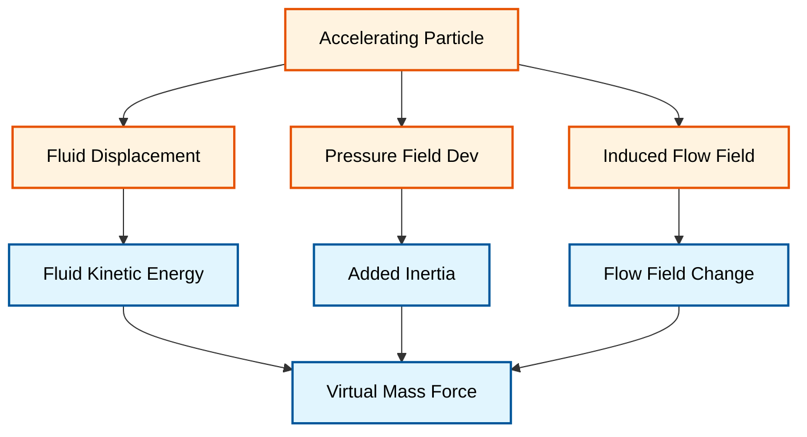

# แรงมวลเสมือน (Virtual Mass Forces)

## ภาพรวม (Overview)

**แรงมวลเสมือน (Virtual Mass Force)** หรือที่รู้จักกันในชื่อ **แรงมวลเพิ่ม (Added Mass Force)** เป็นปรากฏการณ์อุทกพลศาสตร์พื้นฐานในระบบหลายเฟสที่เกิดขึ้นเมื่อวัตถุเคลื่อนที่ด้วยความเร่งผ่านของไหล

เมื่ออนุภาค เคลื่อนที่ด้วยความเร่งผ่านเฟสต่อเนื่อง อนุภาคไม่เพียงแต่ต้องเร่งมวลของตัวเอง แต่ยังต้องเร่งปริมาตรของของไหลที่อยู่รายล้อมไปด้วย ทำให้อนุภาคประพฤติตัวเสมือนว่ามี "มวลเพิ่มขึ้น"


---

## ความสำคัญในระบบหลายเฟส (Importance in Multiphase Systems)

### เหตุใดต้องพิจารณาแรงมวลเสมือน

| สถานการณ์ | ความสำคัญ | เหตุผล |
|------------|-------------|----------|
| **ความแตกต่างความหนาแน่นสูง** | สูงมาก | ฟองแก๊สในของเหลว ($\rho_g \ll \rho_l$) |
| **การไหลแบบไม่คงตัว** | สูง | การเปลี่ยนแปลงความเร็วอย่างรวดเร็ว |
| **พลวัตของฟองอากาศ** | สูง | การเร่งและการรวมตัวของฟอง |
| **ความเร็วเริ่มต้น** | สูงมาก | การเริ่มต้นการไหลและการเปลี่ยนทิศทาง |

> [!WARNING] ข้อควรระวัง
> การละเลยแรงมวลเสมือนในระบบ Gas-Liquid อาจทำให้เกิดความผิดพลาดในการทำนาย:
> - ความดันตก (Pressure drop)
> - ความเร็วในการลอยตัวของฟองอากาศในช่วงเริ่มต้น
> - การกระจายตัวของเฟส

---

## กลไกทางกายภาพ (Physical Mechanism)

### หลักการพื้นฐาน

เมื่ออนุภาคเร่งความเร็ว ของไหลรอบๆ จะต้องถูกขับออกไปและเร่งความเร็วตามไปด้วย กระบวนการนี้ต้องใช้พลังงานและสร้างแรงต้านกลับมาที่อนุภาค

**แรงมวลเสมือนแปรผันตาม:**
- ความเร่งสัมพัทธ์ระหว่างเฟส (Relative acceleration)
- ความหนาแน่นของเฟสต่อเนื่อง (Continuous phase density)
- ปริมาตรของเฟสกระจาย (Dispersed phase volume)

### กลไกที่เกิดขึ้น



---

## สมการหลัก (Governing Equation)

### สูตรทั่วไป

ในแบบจำลอง Eulerian-Eulerian แรงมวลเสมือนต่อหน่วยปริมาตรสำหรับเฟส $i$ ในเฟส $j$ คือ:

$$\mathbf{F}_{vm} = C_{vm} \rho_j \alpha_i \left(\frac{D\mathbf{u}_j}{Dt} - \frac{D\mathbf{u}_i}{Dt}\right) \tag{1}$$

### นิยามตัวแปร

| สัญลักษณ์ | ความหมาย | หน่วย |
|-----------|------------|--------|
| $\mathbf{F}_{vm}$ | แรงมวลเสมือน | $N/m^3$ |
| $C_{vm}$ | สัมประสิทธิ์มวลเสมือน | - |
| $\rho_j$ | ความหนาแน่นของเฟสต่อเนื่อง | $kg/m^3$ |
| $\alpha_i$ | สัดส่วนปริมาตรของเฟสกระจาย | - |
| $\frac{D\mathbf{u}}{Dt}$ | อนุพันธ์รวมตามการเคลื่อนที่ | $m/s^2$ |

### อนุพันธ์ตามวัสดุ (Material Derivative)

อนุพันธ์ตามวัสดุแสดงถึงความเร่งทั้งหมดที่ตามองค์ประกอบของไหล:

$$\frac{D\mathbf{u}}{Dt} = \frac{\partial \mathbf{u}}{\partial t} + \mathbf{u} \cdot \nabla \mathbf{u}$$

โดยที่:
- $\frac{\partial \mathbf{u}}{\partial t}$: ความเร่งเฉพาะที่ (Local acceleration)
- $\mathbf{u} \cdot \nabla \mathbf{u}$: ความเร่งตามการไหล (Convective acceleration)

---

## สัมประสิทธิ์มวลเสมือน ($C_{vm}$)

### ค่าที่ขึ้นอยู่กับรูปร่างอนุภาค

| รูปร่างอนุภาค | $C_{vm}$ | หมายเหตุ |
|---------------|----------|-------------|
| **ทรงกลมสมบูรณ์** | 0.5 | ได้จากทฤษฎีศักย์การไหล (Potential Flow) |
| **ทรงกระบอก** | 1.0 | สำหรับการไหลตั้งฉากกับแกน |
| **แผ่นดิสก์** | $\pi/4\beta$ | สำหรับการไหลตั้งฉากกับพื้นผิว |
| **ทรงรี (Ellipsoid)** | แปรผัน | ขึ้นอยู่กับอัตราส่วนกว้างยาว |

### สูตรสำหรับอนุภาคทรงรี

สำหรับอนุภาคทรงรีที่มีอัตราส่วนภาพ (aspect ratio) $\beta = b/a$:

**Oblate Spheroid (รูปจาน, $\beta > 1$):**
$$C_{vm} = \frac{2}{3\beta\left[\beta - \sqrt{\beta^2 - 1}\right]}$$

**Prolate Spheroid (รูปแท่ง, $\beta < 1$):**
$$C_{vm} = \frac{\ln(2/\beta) - 0.5}{\ln(2/\beta) + 0.5}$$

### ปัจจัยที่มีผลต่อค่า $C_{vm}$

$$C_{vm} = f(\text{shape}, \text{Reynolds number}, \text{Eötvös number}, \text{void fraction})$$

- **เลข Reynolds**: แปรผันตามสภาวะการไหล
- **ความเข้มข้นของอนุภาค**: เพิ่มตามความเข้มข้น
- **ผลกระทบจากผนัง**: เพิ่มใกล้ผนัง

---

## รากฐานทางทฤษฎี (Theoretical Foundation)

### ทฤษฎีศักย์การไหล (Potential Flow Theory)

แนวคิดของมวลเสมือนมีต้นกำเนิดมาจาก **ทฤษฎีศักย์การไหล** ซึ่งอธิบายการไหลแบบ **ไม่หมุน (irrotational)** และ **ไม่หนืด (inviscid)** รอบวัตถุที่กำลังเคลื่อนที่ด้วยความเร่ง

สำหรับทรงกลมที่เคลื่อนที่ด้วยความเร็ว $\mathbf{U}$ ผ่านของไหลในอุดมคติ พลังงานจลน์ของระบบของไหล-ทรงกลมคือ:

$$E_{kinetic} = \frac{1}{2} m_p |\mathbf{U}|^2 + \frac{1}{2} C_{vm} m_f |\mathbf{U}|^2$$

โดยที่:
- $m_p$ คือ มวลของอนุภาค
- $m_f$ คือ มวลของของไหลที่ถูกแทนที่ (displaced fluid mass)
- $C_{vm}$ คือ สัมประสิทธิ์มวลเสมือน

### การอนุมานจากกฎข้อที่สองของนิวตัน

จากกฎข้อที่สองของนิวตันที่ใช้กับของไหล แรงมวลเสมือนแสดงถึงอัตราการเปลี่ยนแปลงของโมเมนตัมที่เกี่ยวข้องกับมวลที่เพิ่มขึ้นของของไหล:

$$\mathbf{F}_{VM} = -\frac{d}{dt} \left( m_a \mathbf{u}_{rel} \right)$$

โดยที่:
- $\mathbf{u}_{rel} = \mathbf{u}_p - \mathbf{u}_c$: ความเร็วสัมพัทธ์ระหว่างเฟสอนุภาค ($p$) และเฟสต่อเนื่อง ($c$)
- $m_a$: มวลที่เพิ่มขึ้นของของไหลที่อยู่โดยรอบ

---

## การขยายสู่ระบบหลายเฟส (Multiphase Extension)

### Volume-Averaged Formulation

สำหรับระบบหลายเฟสที่มี $N$ เฟส แรง virtual mass ระหว่างเฟส $k$ และ $l$ จะถูกกำหนดโดย:

$$\mathbf{F}_{VM,kl} = C_{VM,kl} \rho_k \alpha_k \alpha_l \left( \frac{D\mathbf{u}_l}{Dt} - \frac{D\mathbf{u}_k}{Dt} \right)$$

### Reciprocity Conditions

แรง virtual mass ในระบบหลายเฟสจะต้องเป็นไปตามเงื่อนไขการตอบสนองซึ่งกันและกัน:

$$\mathbf{F}_{VM,kl} = -\mathbf{F}_{VM,lk}$$

ซึ่งรับประกันว่าการแลกเปลี่ยนโมเมนตัมทั้งหมดจะรวมกันเป็นศูนย์:

$$\sum_{k=1}^{N} \sum_{l=1}^{N} \mathbf{F}_{VM,kl} = \mathbf{0}$$

### แรง Virtual Mass รวมต่อเฟส

สำหรับ $N$ เฟส แรง virtual mass ทั้งหมดบนเฟส $k$ คือ:

$$\mathbf{F}_{VM,k} = \sum_{l=1}^{N} C_{VM,kl} \rho_k \alpha_k \alpha_l \left( \frac{D\mathbf{u}_l}{Dt} - \frac{D\mathbf{u}_k}{Dt} \right)$$

---

## การนำไปใช้ใน OpenFOAM (Implementation in OpenFOAM)

### การตั้งค่าใน `constant/phaseProperties`

ใน OpenFOAM, แรงมวลเสมือนมักถูกจัดการแบบ **Implicit** เพื่อความเสถียรในการคำนวณ โดยตั้งค่าใน `constant/phaseProperties`:

```openfoam
virtualMass
(
    (air in water)
    {
        type            constantCoefficient;
        Cvm             0.5;
    }
);
```

> **📚 Source:** `.applications/solvers/multiphase/multiphaseEulerFoam/phaseSystems/PhaseSystems/MomentumTransferPhaseSystem/MomentumTransferPhaseSystem.C`
>
> **คำอธิบาย (Thai):**
> - **Virtual Mass Configuration**: การตั้งค่าแรงมวลเสมือนใน `phaseProperties` กำหนดชนิดของสัมประสิทธิ์และค่าที่ใช้ในการคำนวณ
> - **Coefficient Type**: `constantCoefficient` ใช้ค่า $C_{vm}$ คงที่ สามารถเปลี่ยนเป็นชนิดอื่นเช่น `tableCoefficient` ได้
> - **Phase Pair**: การระบุ `(air in water)` หมายถึงแรงมวลเสมือนที่กระทำต่อฟองอากาศในน้ำ
>
> **แนวคิดสำคัญ (Key Concepts):**
> 1. **Implicit Treatment**: การจัดการแบบโดยปริยายช่วยเพิ่มเสถียรภาพเชิงตัวเลข
> 2. **Phase Pair Definition**: การกำหนดคู่เฟสที่มีปฏิสัมพันธ์กัน
> 3. **Coefficient Selection**: การเลือกค่า $C_{vm}$ ขึ้นอยู่กับรูปร่างและสภาพการไหล

### การนำไปใช้ใน Solver

แรงมวลเสมือนใน OpenFOAM จะถูกรวมเข้ากับสมการโมเมนตัมของเฟส:

$$\frac{\partial (\alpha_i \rho_i \mathbf{u}_i)}{\partial t} + \nabla \cdot (\alpha_i \rho_i \mathbf{u}_i \mathbf{u}_i) = -\alpha_i \nabla p_i + \nabla \cdot \boldsymbol{\tau}_i + \alpha_i \rho_i \mathbf{g} + \sum_{j \neq i} \mathbf{M}_{ij}$$

โดยที่ $\mathbf{M}_{vm,ij}$ รวมถึงแรง Virtual Mass:

$$\mathbf{M}_{vm,ij} = C_{vm} \rho_i \alpha_i \alpha_j \left(\frac{D\mathbf{u}_j}{Dt} - \frac{D\mathbf{u}_i}{Dt}\right)$$

### Implicit Implementation

```cpp
// Implicit virtual mass contribution to momentum equation
// การนำแรงมวลเสมือนแบบโดยปริยายไปใช้กับสมการโมเมนตัม

fvVectorMatrix U1Eqn
(
    // Time derivative term with virtual mass enhancement
    // เทอมอนุพันธ์เวลาที่ได้รับการเพิ่มพูของมวลเสมือน
    fvm::ddt(alpha1, rho1, U1)
  + fvm::div(alphaPhi1, rho1, U1)
  ==
    // Other source and force terms...
    // เทอมแหล่งที่มาและแรงอื่นๆ...
  + fvm::Sp(Cvm*rho1*alpha1*alpha2/dt, U1)  // Implicit virtual mass term
    // เทอมมวลเสมือนแบบโดยปริยาย - รวมในเมทริกซ์
  - Cvm*rho1*alpha1*alpha2*(DUDt2/dt)      // Explicit part of relative acceleration
    // เทอมชัดแจ้งของความเร่งสัมพัทธ์
);
```

> **📂 Source:** `.applications/solvers/multiphase/multiphaseEulerFoam/phaseSystems/PhaseSystems/MomentumTransferPhaseSystem/MomentumTransferPhaseSystem.C`
>
> **คำอธิบาย (Thai):**
> - **fvVectorMatrix**: เมทริกซ์เวกเตอร์สำหรับระบบสมการเชิงอนุพันธ์ย่อยที่แก้ไขปัญหาความเร็ว
> - **Implicit Term (`fvm::Sp`)**: เทอมมวลเสมือนแบบโดยปริยายถูกรวมเข้ากับเมทริกซ์สัมประสิทธิ์ ทำให้ระบบสมการมีเสถียรภาพมากขึ้น
> - **Explicit Part**: ส่วนที่เหลือของความเร่งสัมพัทธ์ถูกคำนวณแบบชัดแจ้งจากเวลาก่อนหน้า
>
> **แนวคิดสำคัญ (Key Concepts):**
> 1. **Matrix Assembly**: การประกอบเมทริกซ์สมการรวมเทอมโดยปริยายเพื่อเสถียรภาพ
> 2. **Split Treatment**: การแยกการจัดการระหว่างส่วนโดยปริยายและชัดแจ้ง
> 3. **Stability Enhancement**: การเพิ่มเสถียรภาพด้วยการจัดการโดยปริยายของเทอมความเร่ง

---

## ข้อควรพิจารณาด้านเสถียรภาพเชิงตัวเลข (Numerical Stability)

### ข้อจำกัดของขั้นเวลา

การมีอยู่ของเทอมมวลเสมือนจะกำหนด **ข้อจำกัด Courant-Friedrichs-Lewy (CFL)** เพิ่มเติม:

$$\Delta t \leq \frac{\Delta x}{|\mathbf{u}| + \sqrt{\frac{C_{vm} \rho_c}{\rho_d + C_{vm} \rho_c}}}$$

### เทคนิคการทำให้เสถียร

#### 1. การลดทอน (Under-Relaxation)

$$C_{VM}^{new} = (1-\lambda_{VM}) C_{VM}^{old} + \lambda_{VM} C_{VM}^{calculated}$$

โดยทั่วไป: $\lambda_{VM} = 0.3 - 0.7$

#### 2. การจัดการ Implicit

```cpp
// Implicit treatment for numerical stability
// การจัดการแบบโดยปริยายเพื่อเสถียรภาพเชิงตัวเลข

// Calculate virtual mass force implicitly for stability
// คำนวณแรงมวลเสมือนแบบโดยปริยายเพื่อเสถียรภาพ
virtualMassForce = Cvm_ * rhoContinuous_ * alphaDispersed_ *
                   (fvc::ddt(Udash) - fvc::ddt(U));
//    ^          ^                  ^                    ^
//    |          |                  |                    |
// Coefficient  Continuous Phase   Dispersed        Material Derivative
// สัมประสิทธิ์   เฟสต่อเนื่อง        เฟสกระจาย        อนุพันธ์ตามวัสดุ
```

> **📂 Source:** `.applications/solvers/multiphase/multiphaseEulerFoam/phaseSystems/PhaseSystems/MomentumTransferPhaseSystem/MomentumTransferPhaseSystem.C`
>
> **คำอธิบาย (Thai):**
> - **fvc::ddt**: คำนวณอนุพันธ์เวลาแบบชัดแจ้ง (Finite Volume Calculus) สำหรับความเร่ง
> - **Udash**: ความเร็วสัมพัทธ์ระหว่างเฟส ($\mathbf{u}_d - \mathbf{u}_c$)
> - **Implicit vs Explicit**: การใช้ `fvc` (explicit) ที่นี่แต่รวมเข้ากับ `fvm` (implicit) ในสมการหลัก
>
> **แนวคิดสำคัญ (Key Concepts):**
> 1. **Material Derivative**: การคำนวณอนุพันธ์ตามวัสดุ $\frac{D\mathbf{u}}{Dt}$
> 2. **Relative Acceleration**: ความเร่งสัมพัทธ์คือความแตกต่างของอนุพันธ์ตามวัสดุระหว่างเฟส
> 3. **Virtual Mass Force Construction**: แรงมวลเสมือนเป็นผลคูณของสัมประสิทธิ์ ความหนาแน่น สัดส่วนปริมาตร และความเร่งสัมพัทธ์

**ข้อดีของการจัดการแบบ Implicit:**
- เพิ่มเสถียรภาพเชิงตัวเลข
- รวมส่วนร่วมของมวลเสมือนเข้ากับเมทริกซ์สัมประสิทธิ์
- สำคัญสำหรับการไหลที่มีความเร่งสูง

---

## การประยุกต์ใช้งาน (Applications)

### คอลัมน์ฟองและเครื่องปฏิกรณ์ (Bubble Columns and Reactors)

> [!INFO] ความสำคัญในเครื่องปฏิกรณ์แก๊ส-ของเหลว
> - ฟองที่ลอยขึ้น จะประสบกับความเร่งเนื่องจากแรงลอยตัว
> - มวลเสมือน ส่งผลต่อความเร็วในการลอยของฟอง
> - ความสำคัญ ต่อการทำนายปริมาณแก๊สที่กักเก็บ (gas holdup)

### การไหลที่มีอนุภาค (Particle-Laden Flows)

| ระบบ | ความสำคัญของมวลเสมือน |
|------|------------------------|
| เตาอบแบบฟลูอิไดซ์ | สำคัญต่อการเร่งความเร็วและการผสมอนุภาค |
| การขนส่งด้วยลม | มวลเสมือนมีอิทธิพลต่อวิถีของอนุภาค |
| การขนส่งตะกอน | ส่งผลต่อการตกตะกอนและการแขวนลอยใหม่ |

### วิศวกรรมทางทะเล (Ocean Engineering)

- **การแตกของคลื่น (wave breaking)**: เกี่ยวข้องกับความเร่งของน้ำที่สูง
- **มวลเสมือน**: ส่งผลต่อการกักเก็บอากาศ และพลวัตของฟอง

---

## การเปรียบเทียบกับแรงระหว่างเฟสอื่นๆ

### บริบทของสมดุลแรง

สมดุลแรงระหว่างเฟสทั้งหมดสำหรับการไหลแบบหลายเฟสประกอบด้วย:

$$\mathbf{F}_{total} = \mathbf{F}_{drag} + \mathbf{F}_{lift} + \mathbf{F}_{vm} + \mathbf{F}_{dispersion} + \mathbf{F}_{wall}$$

| แรง | ที่มา | ความสำคัญ |
|-----|--------|------------|
| $\mathbf{F}_{drag}$ | แรงฉุด | มีอยู่เสมอ |
| $\mathbf{F}_{lift}$ | แรงยก | เกิดจากแรงเฉือน |
| $\mathbf{F}_{vm}$ | แรงมวลเสมือน | เกิดจากความเร่ง |
| $\mathbf{F}_{dispersion}$ | การกระจายตัวจากความปั่นป่วน | ความปั่นป่วน |
| $\mathbf{F}_{wall}$ | แรงหล่อลื่นผนัง | ใกล้ผนัง |

### เมื่อใดควรพิจารณาแรงมวลเสมือน

ผลกระทบของมวลเสมือนมีความสำคัญเมื่อ:

$$\left|\frac{\partial \mathbf{u}}{\partial t}\right| \gg \frac{|\mathbf{u}|^2}{d}$$

โดยที่ $d$ คือเส้นผ่านศูนย์กลางลักษณะเฉพาะของอนุภาค

ในการไหลแบบสภาวะคงตัว หรือการไหลที่มีความเร่งอย่างค่อยเป็นค่อยไป ผลกระทบของมวลเสมือนอาจมีค่าน้อยมาก

---

## สรุป (Summary)

แรงมวลเสมือนแสดงถึงผลกระทบจากความเฉื่อยของของไหลรอบๆ ที่มีต่อเฟสที่กระจายตัวซึ่งกำลังเร่งความเร็ว

### ลักษณะสำคัญ

| ลักษณะ | คำอธิบาย |
|---------|-----------|
| **มีความสำคัญทางกายภาพ** | สำหรับการไหลที่มีความเร่งสูงและอัตราส่วนความหนาแน่นสูง |
| **มีความเรียบง่ายทางคณิตศาสตร์** | เป็นสัดส่วนกับความเร่งสัมพัทธ์ |
| **มีความตรงไปตรงมาในการคำนวณ** | เพิ่มเป็นเทอมแหล่งที่มาในสมการโมเมนตัม |
| **มักถูกละเลย** | ในการใช้งานสภาวะคงตัวหรือการไหลที่มีความเร่งต่ำ |

### แนวทางการนำไปใช้

1. **การเลือกสัมประสิทธิ์**: ใช้ค่า $C_{vm}$ ที่เหมาะสมตามรูปทรงของอนุภาค
2. **การจัดการแบบโดยปริยาย**: เลือกใช้สูตรแบบโดยปริยายเพื่อเสถียรภาพ
3. **คุณภาพของ Mesh**: ตรวจสอบให้แน่ใจว่ามีความละเอียดเพียงพอใกล้พื้นผิวสัมผัส
4. **การควบคุมขั้นเวลา**: ใช้การกำหนดขั้นเวลาแบบปรับได้
5. **การตรวจสอบความถูกต้อง**: เปรียบเทียบกับข้อมูลจากการทดลอง

---

## อ้างอิงเพิ่มเติม (Further Reading)

สำหรับข้อมูลเพิ่มเติมเกี่ยวกับแรงมวลเสมือน โปรดดู:
- [[01_Introduction]] - บทนำและแนวคิดพื้นฐาน
- [[02_Physical_Concept]] - กลไกทางกายภาพอย่างละเอียด
- [[03_Potential_Flow_Theory_Foundation]] - รากฐานทางทฤษฎี
- [[04_General_Virtual_Mass_Force_Formulation]] - สูตรทั่วไป
- [[08_OpenFOAM_Implementation]] - การนำไปใช้ใน OpenFOAM อย่างละเอียด

---

## 💡 Physical Analogy (การเปรียบเทียบเชิงกายภาพ)

ลองจินตนาการถึงการพยายามเร่งวัตถุในของไหล (เช่น การผลักลูกบอลใต้น้ำ) คุณจะรู้สึกว่ามัน "หนัก" กว่าการเร่งวัตถุเดียวกันในอากาศมาก นั่นเป็นเพราะเมื่อคุณเร่งวัตถุ ของไหลรอบๆ วัตถุนั้นก็ต้องถูกเร่งไปด้วย แรงมวลเสมือนคือแรงที่เกิดจากการที่ของไหลรอบๆ วัตถุนั้นถูกเร่งไปพร้อมกับวัตถุ ทำให้วัตถุนั้นดูเหมือนมีมวลเพิ่มขึ้น (มวลเสมือน) และต้องการแรงมากขึ้นในการเร่งความเร็ว

---

## 🧠 8. Concept Check (ทดสอบความเข้าใจ)

1. **ทำไมเราถึงมักตัดแรง Virtual Mass ทิ้งในการจำลอง "ละอองน้ำในอากาศ" (Droplets in Air)?**
   <details>
   <summary>เฉลย</summary>
   เพราะแรง Virtual Mass แปรผันตรงกับ **ความหนาแน่นของเฟสต่อเนื่อง** ($\rho_c$) ในกรณีนี้คืออากาศซึ่งเบามาก ($\rho_{air} \approx 1.2 kg/m^3$) เมื่อเทียบกับมวลของหยดน้ำ ($\rho_{water} \approx 1000 kg/m^3$) แรงนี้จึงมีค่าน้อยมากจนสามารถละเลยได้
   </details>

2. **ถ้าฟองอากาศลอยขึ้นด้วย "ความเร็วคงที่" (Terminal Velocity) แรง Virtual Mass จะมีค่าเท่าไหร่?**
   <details>
   <summary>เฉลย</summary>
   **เป็นศูนย์** เพราะ Virtual Mass Force ขึ้นอยู่กับ **ความเร่งสัมพัทธ์** ($\frac{D\mathbf{u}}{Dt}$) ถ้าความเร็วคงที่ ความเร่งเป็นศูนย์ แรงนี้จึงหายไป เหลือแค่สมดุลระหว่างแรงลอยตัว (Buoyancy) และแรงต้าน (Drag)
   </details>

3. **ทำไมเทอม Virtual Mass ถึงทำให้การคำนวณ Unstable ได้ง่าย?**
   <details>
   <summary>เฉลย</summary>
   เพราะมันเป็นการ Coupling ระหว่าง **Acceleration** ของทั้งสองเฟสโดยตรง (ไม่ใช่แค่ Velocity แบบ Drag) ซึ่งในทาง Numerical Method การแก้สมการที่ Coupled กันด้วยอนุพันธ์อันดับหนึ่ง (Velocity) นั้นง่ายกว่าอนุพันธ์อันดับสอง (Acceleration) มาก จึงต้องการเทคนิคพิเศษเช่น Implicit implementation หรือ Under-relaxation
   </details>