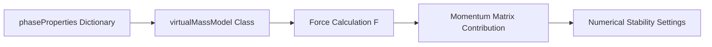

# Virtual Mass - OpenFOAM Implementation

การนำ Virtual Mass ไปใช้ใน OpenFOAM

---

## Learning Objectives

เป้าหมายการเรียนรู้

- Configure virtual mass models in OpenFOAM phaseProperties
- Understand class hierarchy and code implementation
- Apply appropriate numerical treatments for stability
- Verify implementation using function objects

---

## Overview

Implementation reference for virtual mass force in OpenFOAM Euler-Euler solvers.

**Theory:** [01_Fundamental_Concepts.md](01_Fundamental_Concepts.md) | **Overview:** [00_Overview.md](00_Overview.md)



---

## 1. OpenFOAM Configuration

### phaseProperties Dictionary

การตั้งค่าใน `constant/phaseProperties`

```cpp
virtualMass
{
    // Single phase pair
    (air in water)
    {
        type    constantCoefficient;
        Cvm     0.5;
    }
    
    // Multiple phase pairs supported
    (bubbles in oil)
    {
        type    constantCoefficient;
        Cvm     0.5;
    }
    
    // Disable for specific pair
    (particles in gas)
    {
        type    none;
    }
}
```

**Syntax rules:**
- Phase pair: `(dispersed in continuous)`
- `Cvm`: Dimensionless coefficient (typical: 0.5 for spheres)
- `type`: Model selection keyword

### Available Models

| Model | Keyword | Coefficient Source | Use Case |
|-------|---------|-------------------|----------|
| Constant Coefficient | `constantCoefficient` | User-specified $C_{VM}$ | General purpose |
| Lamb | `Lamb` | Shape-dependent | Non-spherical particles |
| No Virtual Mass | `none` | - | Disable for testing |

---

## 2. Class Hierarchy

### Inheritance Structure

โครงสร้างคลาสใน OpenFOAM

```
virtualMassModel (RTS - Run Time Selection)
├── constantVirtualMass
│   └── Cvm() returns user-specified field
├── LambVirtualMass
│   └── Cvm() computes shape-dependent coefficient
└── NoVirtualMass
    └── F() returns zero field
```

### virtualMassModel Interface

```cpp
// Base class location:
// src/phaseSystemModels/lagrangian/intermediate/submodels/VirtualMass/VirtualMassModel/

class virtualMassModel
{
protected:
    // Phase pair reference
    const phasePair& pair_;
    
    // Mesh database
    const fvMesh& mesh_;

public:
    // Runtime type information
    TypeName("virtualMassModel");
    
    // Coefficient field (pure virtual)
    virtual tmp<volScalarField> Cvm() const = 0;
    
    // Force vector field [N/m³]
    virtual tmp<volVectorField> F() const;
    
    // Exchange coefficient for implicit treatment [kg/(m³·s)]
    virtual tmp<volScalarField> K() const;
    
    // Factory method
    static autoPtr<virtualMassModel> New
    (
        const dictionary& dict,
        const phasePair& pair
    );
};
```

### Derived Class Example

```cpp
class constantVirtualMass : public virtualMassModel
{
    // User-specified coefficient
    dimensionedScalar Cvm_;
    
public:
    // Constructor from dictionary
    constantVirtualMass
    (
        const dictionary& dict,
        const phasePair& pair
    )
    :
        virtualMassModel(dict, pair),
        Cvm_("Cvm", dimless, dict)
    {}
    
    // Return constant coefficient field
    virtual tmp<volScalarField> Cvm() const
    {
        return tmp<volScalarField>
        (
            new volScalarField
            (
                IOobject
                (
                    "Cvm",
                    mesh_.time().timeName(),
                    mesh_
                ),
                mesh_,
                Cvm_
            )
        );
    }
};
```

---

## 3. Force Calculation Implementation

### Material Derivative Formulation

```cpp
tmp<volVectorField> virtualMassModel::F() const
{
    // Phase field references
    const volVectorField& Uc = pair_.continuous().U();
    const volVectorField& Ud = pair_.dispersed().U();
    const volScalarField& rhoc = pair_.continuous().rho();
    const volScalarField& alphad = pair_.dispersed();
    
    // Material derivatives: D𝐮/Dt = ∂𝐮/∂t + (𝐮·∇)𝐮
    // Acceleration difference drives virtual mass force
    
    tmp<volVectorField> tF
    (
        new volVectorField
        (
            IOobject
            (
                "virtualMassForce",
                mesh_.time().timeName(),
                mesh_,
                IOobject::NO_READ,
                IOobject::NO_WRITE
            ),
            mesh_,
            dimensionedVector("zero", dimAcceleration, Zero)
        )
    );
    
    volVectorField& F = tF.ref();
    
    // F_VM = C_VM * ρ_c * α_d * (D𝐮_c/Dt - D𝐮_d/Dt)
    F = Cvm() * rhoc * alphad * 
    (
        fvc::ddt(Uc) + (Uc & fvc::grad(Uc))  // Continuous acceleration
      - fvc::ddt(Ud) - (Ud & fvc::grad(Ud))  // Dispersed acceleration
    );
    
    return tF;
}
```

### Discretization Schemes

การเลือก scheme ใน `system/fvSchemes`

```cpp
ddtSchemes
{
    // First order - more stable
    default         Euler;
    
    // Second order - more accurate, less stable
    // default        backward;
    
    // For transient accuracy
    // default        CrankNicolson 0.9;
}

gradSchemes
{
    // Linear interpolation (second order)
    default         Gauss linear;
    
    // For highly distorted meshes
    // default         Gauss leastSquares;
}

interpolationSchemes
{
    // For face flux calculation
    default         linear;
}

divSchemes
{
    // Convective term (𝐮·∇)𝐮
    default         Gauss linear;
}

laplacianSchemes
{
    // Diffusion terms
    default         Gauss linear corrected;
}
```

---

## 4. Momentum Matrix Contribution

### Semi-Implicit Treatment

การรวมเข้าสมการ momentum

```cpp
// Dispersed phase momentum equation
fvVectorMatrix UEqn
(
    // Unsteady term
    fvm::ddt(alpha, Ud)
  + fvm::div(phi, Ud)
  
    // Drag contribution (fully implicit)
  + fvm::Sp(Kdrag, Ud)
  
    // Pressure gradient
  - fvm::laplacian(nu, Ud)
  
    // Other forces...
);

// Virtual mass contribution
const volScalarField Cvm = virtualMass.Cvm();
const volScalarField rhoc = pair_.continuous().rho();
const volScalarField alphad = pair_.dispersed();

// Semi-implicit treatment:
// - Dispersed acceleration: implicit (fvm::ddt)
// - Continuous acceleration: explicit (fvc::ddt)
// - Convective terms: explicit

UEqn += 
    // Implicit dispersed acceleration (stabilizes coupling)
    Cvm * rhoc * alphad * fvm::ddt(Ud)
    
    // Minus explicit continuous acceleration
  - Cvm * rhoc * alphad * fvc::ddt(Uc)
  
    // Minus convective acceleration difference
  - Cvm * rhoc * alphad * (Uc & fvc::grad(Uc))
  + Cvm * rhoc * alphad * (Ud & fvc::grad(Ud));
```

### Treatment Strategy Comparison

| Method | Implementation | Stability | Computational Cost | Recommended For |
|--------|---------------|-----------|-------------------|-----------------|
| Fully Implicit | All terms with `fvm::` | ★★★★★ | High (matrix coupling) | Strong acceleration, tight convergence |
| Semi-Implicit | Implicit dispersed, explicit continuous | ★★★☆☆ | Medium | General purpose, balanced |
| Explicit | All terms with `fvc::` | ★☆☆☆☆ | Low | Weak effects, testing only |

**Matrix structure impact:**
- Fully implicit requires off-diagonal coupling between phases
- Semi-implicit uses segregated approach (default in most solvers)
- Explicit requires smallest time steps

### Solver Configuration

```cpp
// system/fvSolution
solvers
{
    // Coupled velocity-pressure solver
    "(U|alpha).*"
    {
        solver          GAMG;
        tolerance       1e-06;
        relTol          0.1;
        smoother        GaussSeidel;
        
        // For tighter coupling
        // nCorrectors     2;
        // nNonOrthogonalCorrectors 1;
    }
    
    // Pressure equation
    p_rgh
    {
        solver          GAMG;
        tolerance       1e-08;
        relTol          0.05;
    }
}
```

---

## 5. Numerical Stability

### Under-Relaxation Factors

การปรับค่า relaxation

```cpp
// system/fvSolution
relaxationFactors
{
    fields
    {
        p_rgh           0.7;
        alpha           0.3;  // Critical for stability
    }
    
    equations
    {
        U               0.7;  // Apply to all phases
        "U.air"         0.5;  // Phase-specific
        "U.water"       0.7;
        alpha.air       0.3;
        alpha.water     0.3;
    }
}
```

**Guidelines:**
- Reduce relaxation for strong virtual mass effects (0.3-0.5)
- Increase relaxation for weak effects (0.7-0.9)
- Always under-relax volume fraction in multiphase

### Time Step Constraints

ข้อจำกัดของ time step

```
CFL condition:
CFL < 0.5 with strong virtual mass effects
CFL < 1.0 with weak effects

Acceleration time scale:
Δt < 0.1 × τ_a, where τ_a = |Du/Dt|⁻¹

Practical limits:
Δt < 1e-4 s for rapid bubble acceleration
Δt < 1e-3 s for moderate acceleration
Δt < 1e-2 s for quasi-steady flows
```

### Adaptive Time Stepping

```cpp
// system/controlDict
adjustTimeStep yes;

maxCo           0.5;  // Max Courant number
maxAlphaCo      0.5;  // Max volume fraction Courant

// Time step limits
maxDeltaT       1e-3;
minDeltaT       1e-6;
```

### Outer Iterations

```cpp
// system/fvSolution
PIMPLE
{
    // Pressure-velocity coupling
    nCorrectors     2;
    nNonOrthogonalCorrectors 0;
    
    // Outer iterations for phase coupling
    nOuterCorrectors 3;  // Increase for strong virtual mass
    
    // Momentum prediction
    momentumPredictor yes;
    
    // Transient option
    transonic       no;
    consistent      yes;
}
```

---

## 6. Verification and Debugging

### Force Monitoring Function Objects

ตรวจสอบค่าแรงด้วย function objects

```cpp
// system/controlDict
functions
{
    // 1. Field sampling along line
    virtualMassForceLine
    {
        type            sets;
        setFormat       raw;
        
        sets
        (
            centerLine
            {
                type            uniform;
                axis            xyz;
                start           (0 0 0);
                end             (0 0.1 0);
                nPoints         100;
            }
        );
        
        fields
        (
            virtualMassForce
            U.air
            U.water
            alpha.air
        );
        
        writeControl    timeStep;
        writeInterval   10;
    }
    
    // 2. Force magnitude statistics
    virtualMassForceStats
    {
        type            volFieldValue;
        operation       none;  // Write full field stats
        
        fields
        (
            virtualMassForce
        );
        
        writeControl    timeStep;
        writeInterval   1;
    }
    
    // 3. Phase-averaged force
    phaseAveragedVirtualMass
    {
        type            volRegion;
        operation       average;
        
        fields
        (
            virtualMassForce
        );
        
        writeControl    timeStep;
        writeInterval   1;
    }
    
    // 4. Acceleration monitoring
    accelerationDifference
    {
        type            expressions;
        writeControl    timeStep;
        writeInterval   1;
        
        libs            ("libfieldFunctionObjects.so");
        
        expression "mag(fvc::ddt(U.water) - fvc::ddt(U.air))";
        outputControl  timeStep;
        outputInterval 1;
    }
}
```

### Verification Test Cases

| Test Case | Setup | Expected Behavior |
|-----------|-------|-------------------|
| **Oscillating bubble** | Single bubble in stagnant liquid, oscillating pressure | Virtual mass force periodic with pressure frequency, magnitude ~ $C_{VM} \rho V a$ |
| **Accelerating bubble** | Bubble released from rest in quiescent liquid | Initial spike in force, then decays as terminal velocity approaches |
| **Solid-gas flow** | High density ratio (>1000) | Negligible virtual mass contribution (<1% of drag) |
| **Dense bubbly flow** | Void fraction >0.3 | Significant force contribution, affects mixture acceleration |

### Debugging Checklist

```cpp
// 1. Verify model activation
Info << "Virtual mass active: " 
     << (virtualMass.Cvm().average()().value() > 0) << endl;

// 2. Check force magnitude
scalar maxF = max(mag(virtualMassForce)).value();
Info << "Max virtual mass force: " << maxF << endl;

// 3. Compare to drag
scalar maxDrag = max(mag(dragForce)).value;
Info << "Force ratio (VM/Drag): " << maxF/maxDrag << endl;

// 4. Monitor acceleration
volVectorField accDiff = fvc::ddt(Uc) - fvc::ddt(Ud);
scalar maxAccDiff = max(mag(accDiff)).value();
```

### Common Verification Issues

| Symptom | Diagnosis | Remedy |
|---------|-----------|--------|
| Zero force field | Model not activated | Check phase pair syntax in `phaseProperties` |
| Uniform force | Missing acceleration field | Verify `ddtSchemes` not set to `steadyState` |
| Spiky results | Time step too large | Reduce `maxCo` or fixed `deltaT` |
| Wrong direction | Phases swapped | Verify `(dispersed in continuous)` syntax |

---

## 7. Common Pitfalls and Solutions

### Configuration Errors

| Pitfall | Symptom | Fix |
|---------|---------|-----|
| **Wrong phase pair syntax** | Model not active, no force | Use `(dispersed in continuous)` not `(continuous, dispersed)` |
| **Missing Cvm value** | Runtime error "keyword Cvm not found" | Add `Cvm 0.5;` to dictionary |
| **Inconsistent phase names** | Wrong force direction | Check phase names match `transportProperties` |
| **Multiple pairs conflict** | Only one model active | Ensure each pair has unique dictionary entry |

### Numerical Issues

| Issue | Cause | Solution |
|-------|-------|----------|
| **Velocity oscillations** | Explicit treatment | Switch to `fvm::ddt` for dispersed acceleration |
| **Solution divergence** | Time step too large | Reduce `maxCo` to 0.3, increase under-relaxation |
| **Slow convergence** | Strong phase coupling | Increase `nOuterCorrectors` to 3-5 |
| **Mass imbalance** | Volume fraction not relaxed | Set `alpha.*` relaxation to 0.3 |

### Performance Optimization

```cpp
// 1. Disable for testing
virtualMass
{
    (air in water)
    {
        type    constantCoefficient;
        Cvm     0.0;  // Test without virtual mass
    }
}

// 2. Use table lookup for Cvm (custom model)
// Implement look-up table instead of field calculation

// 3. Coarse-grain for initial runs
// Use coarser mesh to establish flow, then refine

// 4. Selective deactivation
virtualMass
{
    (air in water)
    {
        type    none;  // Disable in regions where effects are small
    }
}
```

### Code-Level Issues

| Problem | Root Cause | Fix |
|---------|-----------|-----|
| Compilation error | Missing typedef or include | Check `phaseSystemModel` headers |
| Runtime error "cannot find file" | Incorrect dictionary path | Verify `constant/phaseProperties` exists |
| Wrong units | Dimension inconsistency | Ensure `Cvm` is dimensionless |
| Segmentation fault | Null phase pointer | Debug phase pair construction |

---

## Quick Reference

สรุปคำสั่งและไวยากรณ์

| Task | Command/Syntax | Location |
|------|----------------|----------|
| Enable model | `virtualMass { (air in water) { type constantCoefficient; Cvm 0.5; } }` | `constant/phaseProperties` |
| Select scheme | `ddtSchemes { default Euler; }` | `system/fvSchemes` |
| Set relaxation | `relaxationFactors { equations { U.* 0.7; } }` | `system/fvSolution` |
| Monitor force | Add `volFieldValue` function object | `system/controlDict` |
| Check activity | `max(mag(virtualMassForce))` | Runtime output |
| Improve stability | Reduce `maxCo`, increase `nOuterCorrectors` | `system/controlDict` |

---

## Key Takeaways

สิ่งสำคัญที่ต้องจำ

1. **Configuration:** Use `(dispersed in continuous)` syntax in `phaseProperties` with `Cvm` coefficient
2. **Class structure:** `virtualMassModel` base class with `constantVirtualMass`, `LambVirtualMass` implementations
3. **Force calculation:** $F_{VM} = C_{VM} \rho_c \alpha_d (D\mathbf{u}_c/Dt - D\mathbf{u}_d/Dt)$ implemented via material derivatives
4. **Numerical treatment:** Semi-implicit (implicit dispersed, explicit continuous) balances stability and cost
5. **Stability:** Requires under-relaxation (0.3-0.5), small time steps (CFL < 0.5), and outer iterations
6. **Verification:** Always monitor force magnitude with function objects, compare to drag, check acceleration fields
7. **Performance:** Virtual mass adds numerical stiffness; may require smaller time steps and more iterations

---

## Related Documents

- **Overview:** [00_Overview.md](00_Overview.md)
- **Fundamental Concepts:** [01_Fundamental_Concepts.md](01_Fundamental_Concepts.md)
- **Drag Implementation:** [../01_DRAG/03_OpenFOAM_Implementation.md](../01_DRAG/03_OpenFOAM_Implementation.md)
- **Lift Implementation:** [../02_LIFT/03_OpenFOAM_Implementation.md](../02_LIFT/03_OpenFOAM_Implementation.md)