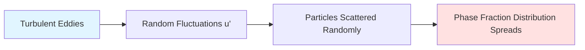

# Turbulent Dispersion Overview

ภาพรวมแรงกระจายตัวแบบปั่นป่วน

---

## Learning Objectives

By the end of this document, you should be able to:

- **Define** turbulent dispersion and explain its physical role in multiphase flows
- **Distinguish** turbulent dispersion from other interfacial forces (drag, lift, virtual mass)
- **Identify** when turbulent dispersion effects are significant in your simulation
- **Select** appropriate turbulent dispersion models for different flow regimes
- **Apply** correct coefficient ranges for model tuning

---

## What is Turbulent Dispersion?

> **Turbulent Dispersion** = การกระจายตัวของ dispersed phase (bubbles/particles/droplets) เนื่องจาก turbulent eddies ใน continuous phase

### Physical Mechanism



**Key Concept:** Turbulent dispersion acts like a **diffusion mechanism** for the dispersed phase, driven by turbulent velocity fluctuations rather than molecular motion.

### Simple Analogy

เหมือนการกระจายของควันในอากาศที่ปั่นป่วน — eddies ที่หมุนเวียนสุ่มพาควันไปทิศทางต่างๆ ทำให้ควันกระจายออกจากแหล่งกำเนิด

---

## Model Selection Guide

### When to Include Turbulent Dispersion

| Flow Condition | Include TD? | Rationale |
|----------------|-------------|-----------|
| High turbulence intensity | **✓ Yes** | Strong eddies drive dispersion |
| Large α gradients present | **✓ Yes** | TD acts to smooth gradients |
| Bubble columns/reactors | **✓ Yes** | Critical for realistic mixing |
| Stirred tanks | **✓ Yes** | Turbulence-dominated flow |
| Laminar flow | **✗ No** | No turbulent eddies present |
| Uniform α distribution | **✗ No** | No gradients to disperse |
| Very fine particles (Stokes < 0.1) | **Maybe** | Particles follow flow perfectly |

### Model Comparison

| Model | Best For | Complexity | Computational Cost | Typical $C_{TD}$ Range |
|-------|----------|------------|-------------------|------------------------|
| **Burns** | General-purpose, drag-coupled | Medium | Low | 0.5 - 1.5 |
| **Gosman** | Simple applications, $\nu_t$-based | Low | Low | 0.5 - 1.0 |
| **Lopez de Bertodano** | $k$-based, bubble columns | Low | Low | 0.05 - 0.5 |

> **Note:** For detailed mathematical formulations and derivations, see [01_Fundamental_Theory.md](01_Fundamental_Theory.md)

---

## Model Quick Reference

### Burns Model

- **Formulation:** Couples with drag coefficient
- **Strengths:** Physically consistent with momentum exchange
- **Implementation:** See [02_Specific_Models.md](02_Specific_Models.md#burns-model)

### Gosman Model

- **Formulation:** Based on turbulent viscosity $\nu_t$
- **Strengths:** Simple, widely validated
- **Implementation:** See [02_Specific_Models.md](02_Specific_Models.md#gosman-model)

### Lopez de Bertodano Model

- **Formulation:** Based on turbulent kinetic energy $k$
- **Strengths:** Direct link to turbulence energy
- **Implementation:** See [02_Specific_Models.md](02_Specific_Models.md#lopez-de-bertodano-model)

---

## Effect on Simulation Results

### Without Turbulent Dispersion

```
Radial Position:  Center    Wall
Phase Fraction:    ║        ║
                   ║        ║
                   ▼        ▼
                 High     Low
```
- Sharp α gradients maintained
- Particles may concentrate unrealistically
- Potential for numerical instability

### With Turbulent Dispersion

```
Radial Position:  Center    Wall
Phase Fraction:    ║        ║
                  ║║║║║║║║║║║
                  ▼        ▼
                Medium  Medium
```
- α profile **flattens** and smooths
- More realistic mixing patterns
- Better agreement with experimental data

---

## Coefficient Tuning Guidelines

### Starting Values

| Model | Recommended Start |
|-------|-------------------|
| Burns | $C_{TD} = 1.0$ |
| Gosman | $C_{TD} = 1.0$ |
| Lopez de Bertodano | $C_{TD} = 0.1$ |

### Tuning Procedure

1. **Run simulation** with starting value
2. **Compare** radial α profile to experimental data
3. **Adjust** if:
   - Profile too peaked → **Increase** $C_{TD}$
   - Profile too flat → **Decrease** $C_{TD}$
4. **Iterate** until satisfactory agreement

> **Best Practice:** Always validate against experimental data when tuning dispersion coefficients

---

## Key Takeaways

- ✓ **Turbulent dispersion is NOT drag** — it's a separate force driven by turbulent fluctuations
- ✓ **Direction is down-gradient** — always from high α to low α (like diffusion)
- ✓ **Essential for turbulent multiphase flows** with significant phase fraction gradients
- ✓ **Model selection matters** — Burns couples with drag, Gosman uses $\nu_t$, Lopez de Bertodano uses $k$
- ✓ **Coefficient tuning is case-dependent** — use experimental validation when possible
- ✓ **Neglect TD in laminar flows** — no turbulent eddies means no dispersion mechanism

---

## Self-Assessment

<details>
<summary><b>1. What is the physical direction of the turbulent dispersion force?</b></summary>

**Opposite to the phase fraction gradient (∇α)** — the force pushes from high concentration regions toward low concentration regions, analogous to a diffusion process. This tends to flatten and smooth out sharp gradients in the dispersed phase distribution.
</details>

<details>
<summary><b>2. How does the Burns model differ fundamentally from the Gosman model?</b></summary>

**Burns couples with drag** through $K_{drag}$ in its formulation, making it physically consistent with the momentum exchange mechanism between phases. **Gosman uses turbulent viscosity ($\nu_t$)** independently, providing a simpler but less physically coupled approach.
</details>

<details>
<summary><b>3. Under what conditions can turbulent dispersion be safely neglected?</b></summary>

Turbulent dispersion can be neglected when: (1) **Flow is laminar** — no turbulent eddies exist to drive dispersion, or (2) **Phase fraction is uniformly distributed** — no significant gradients exist for dispersion to act upon. In both cases, adding TD would have negligible effect on results.
</details>

<details>
<summary><b>4. You observe a bubble column simulation shows unrealistically sharp gas volume fraction gradients. What should you investigate first?</b></summary>

**Check if turbulent dispersion is enabled.** Sharp gradients in turbulent multiphase flows often indicate missing TD effects. If TD is already enabled, try **increasing the $C_{TD}$ coefficient** to strengthen the dispersion force. Also verify your turbulence model is properly capturing the turbulent kinetic energy or viscosity needed to drive the dispersion.
</details>

---

## Related Documents

### In This Section

- **[01_Fundamental_Theory.md](01_Fundamental_Theory.md)** — Mathematical derivation from first principles, physical mechanism detailed analysis
- **[02_Specific_Models.md](02_Specific_Models.md)** — Detailed model formulations, OpenFOAM implementation, coefficient selection

### Interphase Forces

- **[Drag Overview](../01_DRAG/00_Overview.md)** — Primary momentum exchange mechanism
- **[Lift Overview](../02_LIFT/00_Overview.md)** — Transverse force due to shear
- **[Virtual Mass Overview](../03_VIRTUAL_MASS/00_Overview.md)** — Added mass during acceleration

### Parent Topics

- **[Multiphase Fundamentals](../../01_FUNDAMENTAL_CONCEPTS/00_Overview.md)** — Flow regimes and interfacial phenomena
- **[Euler-Euler Method](../../03_EULER_EULER_METHOD/00_Overview.md)** — Mathematical framework for interphase forces

---

**Next:** Learn the mathematical foundation in [01_Fundamental_Theory.md](01_Fundamental_Theory.md) or jump to model implementation in [02_Specific_Models.md](02_Specific_Models.md)