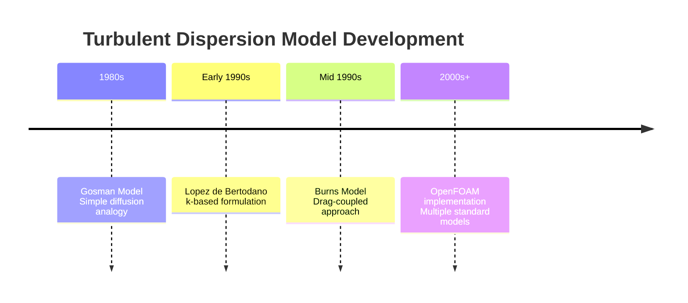
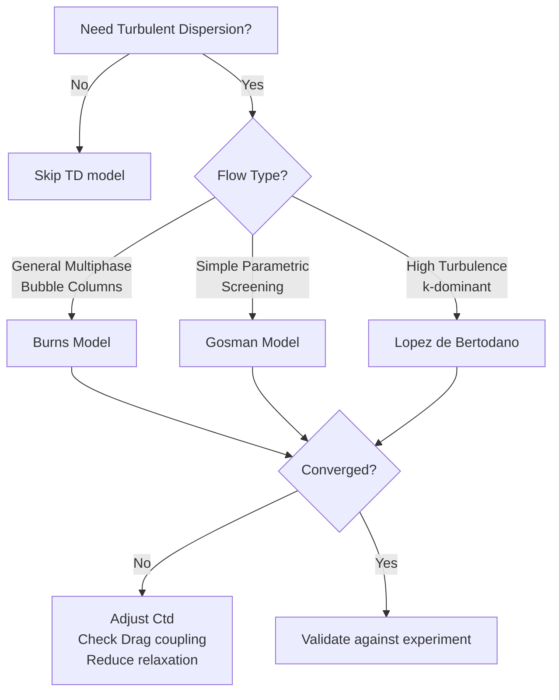
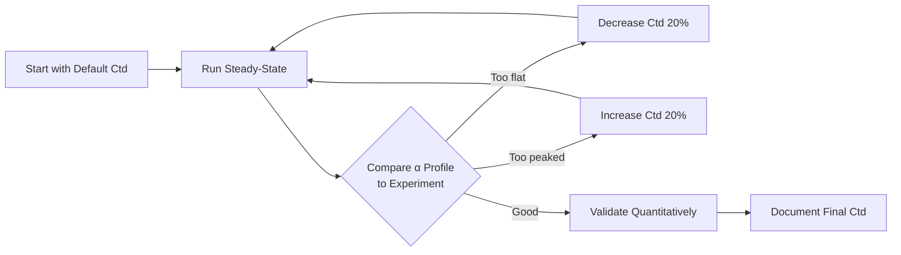

# Specific Turbulent Dispersion Models

> **How to implement, select, and tune turbulent dispersion models in OpenFOAM

---

## Learning Objectives

By the end of this document, you should be able to:
- Identify the historical development and rationale behind different TD models
- Compare formulation differences between Burns, Gosman, and Lopez de Bertodano models
- Select appropriate TD models based on flow regime and application
- Tune TD coefficients for specific cases
- Implement TD models correctly in OpenFOAM
- Diagnose and resolve common TD-related convergence issues

---

## 1. Historical Context: Why Multiple Models Exist

Turbulent dispersion modeling evolved through different approaches to the same physical problem:



**Why different formulations exist:**

| Era | Research Focus | Model Type | Key Insight |
|-----|----------------|------------|-------------|
| Early work | Simple closure | Gosman | Treat TD as turbulent diffusion |
| Advanced closure | Physics-based | Lopez de Bertodano | Direct k-link to turbulence |
| Coupled physics | System consistency | Burns | TD scales with drag coefficient |

---

## 2. Model Formulations and Assumptions

### 2.1 Burns Model (1994)

**Formulation:**

$$\mathbf{F}_{TD} = C_{TD} K_{drag} \frac{\nu_{t,c}}{\sigma_{TD}} \left(\frac{\nabla \alpha_d}{\alpha_d} - \frac{\nabla \alpha_c}{\alpha_c}\right)$$

**Assumptions:**
- TD force scales with drag coefficient (coupled approach)
- Dispersion acts like turbulent diffusion with Schmidt number σ_TD
- Symmetric treatment of phases

**Physical Rationale:**
- Particles experiencing higher drag also experience stronger turbulent dispersion
- Maintains consistency with momentum exchange between phases

**When to Use:**
- General multiphase flows with significant drag
- Bubble columns and stirred tanks
- Cases where phase coupling is important

**Limitations:**
- Requires converged drag coefficient
- May be overly complex for simple flows
- Sensitive to drag model selection

---

### 2.2 Gosman Model (1992)

**Formulation:**

$$\mathbf{F}_{TD} = -C_{TD} \rho_c \nu_{t,c} \nabla \alpha_d$$

**Assumptions:**
- TD is analogous to turbulent diffusion
- Scales with continuous phase turbulent viscosity
- Acts down phase fraction gradient

**Physical Rationale:**
- Turbulent eddies transport particles like scalar diffusion
- Simpler closure based on turbulent viscosity

**When to Use:**
- Quick parametric studies
- Flows where detailed TD physics is secondary
- Educational purposes and verification

**Limitations:**
- No coupling with drag (physically inconsistent)
- May over-predict dispersion in some regimes
- Less accurate for polydisperse flows

---

### 2.3 Lopez de Bertodano Model (1991)

**Formulation:**

$$\mathbf{F}_{TD} = -C_{TD} \rho_c k_c \nabla \alpha_d$$

**Assumptions:**
- Direct proportionality to turbulent kinetic energy
- No dependence on turbulent viscosity
- Linear gradient diffusion model

**Physical Rationale:**
- TKE represents turbulent velocity fluctuations
- Dispersion force should scale with fluctuation intensity

**When to Use:**
- High-turbulence regimes (k_c >> ν_t)
- Cases where TKE is well-predicted
- Research on dispersion mechanisms

**Limitations:**
- Can be too strong in low-Re turbulence
- Less validated than Burns model
- Sensitive to TKE prediction accuracy

---

## 3. Inter-Model Comparison

### 3.1 Key Differences

| Aspect | Burns | Gosman | Lopez de Bertodano |
|--------|-------|--------|-------------------|
| **Scaling Variable** | $K_{drag} \cdot \nu_t$ | $\rho_c \cdot \nu_t$ | $\rho_c \cdot k$ |
| **Drag Coupling** | Yes | No | No |
| **Dimensional Form** | Force/m³ | Force/m³ | Force/m³ |
| **Complexity** | High | Low | Medium |
| **Validation** | Extensive | Moderate | Limited |
| **Best For** | General use | Simple cases | High-k flows |

### 3.2 Coefficient Comparison

| Model | $C_{TD}$ Range | Default | Tuning Sensitivity |
|-------|---------------|---------|-------------------|
| Burns | 0.5 - 1.5 | 1.0 | Medium (drag-coupled) |
| Gosman | 0.5 - 1.0 | 1.0 | High (standalone) |
| Lopez de Bertodano | 0.05 - 0.5 | 0.1 | Very high (k-scaled) |

### 3.3 Predicted Behavior Comparison

```
Same Flow Conditions (α gradient = 1.0, ν_t = 0.01 m²/s, k = 0.1 m²/s², K_drag = 100 kg/m³s)

Burns (Ctd=1.0):     F ∝ 100 × 0.01 / 0.9 = 1.11
Gosman (Ctd=1.0):    F ∝ 1000 × 0.01 = 10.0
Lopez (Ctd=0.1):     F ∝ 1000 × 0.1 × 0.1 = 10.0
```

**Practical implication:** Gosman and Lopez typically require smaller $C_{TD}$ values than Burns for equivalent effects.

---

## 4. Model Selection Decision Tree



### Selection Guidelines

| Application | Recommended Model | Rationale |
|-------------|-------------------|-----------|
| **Bubble columns** | Burns | Extensive validation, drag-coupled |
| **Stirred tanks** | Burns | Complex flow, phase coupling important |
| **Pipe flows** | Burns or Gosman | Relatively simple, either works |
| **RANS predictions** | Lopez de Bertodano | k-field directly available |
| **Educational** | Gosman | Simplest form for learning |
| **LES/DNS** | Burns (modified) | Consistent with resolved turbulence |

---

## 5. Implementation in OpenFOAM

### 5.1 Burns Model Setup

```cpp
turbulentDispersion
{
    type    Burns;
    
    // Primary coefficient
    Ctd     1.0;
    
    // Turbulent Schmidt number
    sigma   0.9;
    
    // Optional: Phase pair specific overrides
    (air in water)
    {
        Ctd     1.0;
        sigma   0.9;
    }
}
```

### 5.2 Gosman Model Setup

```cpp
turbulentDispersion
{
    type    Gosman;
    
    // Dispersion coefficient
    Ctd     0.8;  // Often use < 1.0
    
    // Phase pair specific
    (air in water)
    {
        Ctd     0.8;
    }
}
```

### 5.3 Lopez de Bertodano Setup

```cpp
turbulentDispersion
{
    type    LopezDeBertodano;
    
    // Lower default due to k-scaling
    Ctd     0.1;
    
    // Phase pair specific
    (air in water)
    {
        Ctd     0.1;
    }
}
```

### 5.4 Combined Interphase Forces

TD interacts with other forces - proper ordering matters:

```cpp
interfacialModels
{
    // Drag first (foundational)
    dragModel
    {
        type    SchillerNaumann;
        CdModel constant;
        CdValue 0.44;
    }
    
    // Lift second
    liftModel
    {
        type    LiftForce;
        Cl      0.5;
    }
    
    // Dispersion last (depends on drag for Burns)
    turbulentDispersion
    {
        type    Burns;
        Ctd     1.0;
        sigma   0.9;
    }
}
```

---

## 6. Practical Tuning Guidance

### 6.1 Base Tuning Procedure



### 6.2 Coefficient Tuning Ranges

| Model | Start | Step | Min | Max | When to Use Higher |
|-------|-------|------|-----|-----|-------------------|
| Burns | 1.0 | ±0.2 | 0.5 | 1.5 | Low turbulence, small particles |
| Gosman | 0.8 | ±0.1 | 0.5 | 1.0 | High Re, large α gradients |
| Lopez | 0.1 | ±0.05 | 0.05 | 0.5 | Very high k fields |

### 6.3 Symptomatic Tuning Guide

| Symptom | Likely Issue | Adjustment |
|---------|--------------|------------|
| α too uniform (flat) | Over-dispersion | Decrease Ctd 30-50% |
| α too peaked (core) | Under-dispersion | Increase Ctd 30-50% |
| Oscillating solution | TD too strong | Decrease Ctd, add relaxation |
| No effect seen | Wrong model/Ctd | Increase Ctd, check turbulence |
| Wall α overpredicted | Missing near-wall damping | Add wall function or reduce Ctd |

### 6.4 Interaction with Turbulence Model

| Turbulence Model | Recommended TD Model | Notes |
|------------------|---------------------|-------|
| k-ε | Burns or Gosman | Standard ν_t well-predicted |
| k-ω | Burns | Better near-wall treatment |
| LES | Burns (modified) | Consider scale-dependent Ctd |
| RSM | Lopez de Bertodano | Reynolds stresses more accurate |

---

## 7. Numerical Considerations

### 7.1 Stability Issues

TD can cause convergence problems due to:

1. **Strong coupling with α equation**
2. **Nonlinear dependence on turbulence**
3. **Interaction with drag force**

**Mitigation strategies:**

```cpp
// 1. Under-relaxation
relaxationFactors
{
    equations
    {
        "U.*"     0.7;  // Reduce from default
        "alpha.*" 0.5;  // Critical for TD stability
    }
}

// 2. Implicit treatment
solvers
{
    alpha.air
    {
        solver          GAMG;
        tolerance       1e-6;
        relTol          0.1;
        smoother        GaussSeidel;
    }
}

// 3. TD ramping (custom function object)
```

### 7.2 Resolution Requirements

TD models require adequate mesh resolution:

```cpp
// Check y+ for wall-bounded flows
// For TD: y+ < 5 recommended near walls

// Estimate cell size relative to eddy size
Δ < 0.1 × L_ε  // L_ε = k^(3/2)/ε
```

### 7.3 Time Step Constraints

For transient simulations with TD:

```
CFL < 0.5  // More restrictive than single-phase
Δt < 0.1 × (k/ε)  // Resolve turbulent time scale
```

---

## 8. Verification and Validation

### 8.1 Expected Physical Behavior

Correct TD implementation should produce:

| Effect | Description | How to Check |
|--------|-------------|--------------|
| **Profile flattening** | Centerline α decreases, near-wall α increases | Plot radial α distribution |
| **Enhanced mixing** | Sharper gradients smoothed out | Visualize α contours |
| **Coupling with drag** | TD effect ∝ drag magnitude | Vary Cd, observe TD response |
| **Turbulence dependence** | Stronger TD at higher Re | Compare cases with different inlet velocities |

### 8.2 Benchmark Cases

**Case 1: Bubble Column (Standard Test)**

```
Geometry:  Cylindrical, H/D = 5
Flow:      Air-water, superficial velocity 0.03 m/s
Expected:  Gas holdup ε_g = 0.15-0.25
Target:    Match radial α profile at z/H = 0.5
```

**Case 2: Pipe Flow**

```
Geometry:  Horizontal pipe, L/D = 50
Flow:      Bubbly flow, Re = 20,000
Expected:  Core-peaked α profile without TD
           More uniform with TD
Target:    Wall void fraction < 0.3
```

### 8.3 Monitoring Functions

```cpp
// Radial phase fraction profile
radialAlpha
{
    type            sets;
    fields          (alpha.air);
    sets            
    {
        midPlane
        {
            type        uniform;
            axis        y;
            start       (0 0 0);
            end         (0 0.5 0);
            nPoints     50;
        }
    }
    writeControl    timeStep;
    writeInterval   10;
}

// TD force magnitude (custom)
turbulentDispersionForce
{
    type            coded;
    writeControl    timeStep;
    writeInterval   1;
    
    codeWrite
    #{
        const volVectorField& TD =
            mesh().lookupObject<volVectorField>("turbulentDispersionForce.air");
        
        Info << "Max |F_TD| = " << max(mag(TD)).value() << endl;
    #};
}
```

---

## 9. Common Issues and Solutions

### 9.1 Issue: No Effect Observed

**Symptoms:**
- α profile identical with/without TD
- Ctd changes have no impact

**Diagnosis:**
```cpp
// Check 1: Is TD active?
// Look for: "Selecting turbulentDispersion Burns" in log

// Check 2: Turbulence present?
functions { turbulenceInfo { type turbulenceInfo; } }

// Check 3: α gradients?
functions { alphaGrad { type magGrad; fields (alpha.air); } }
```

**Solutions:**
1. Verify turbulence model is running
2. Increase Ctd by factor of 5-10
3. Check for errors in phase pair specification
4. Ensure solver supports TD (e.g., twoPhaseEulerFoam)

### 9.2 Issue: Over-Dispersion

**Symptoms:**
- α nearly uniform (unrealistic)
- No core-peaking in bubble column
- Wall α too high

**Solutions:**
1. Reduce Ctd by 50%
2. Check if turbulence model overpredicts k/ν_t
3. Verify appropriate flow regime (TD not needed for very small bubbles)
4. Consider switching from Gosman/Lopez to Burns

### 9.3 Issue: Divergence with TD Active

**Symptoms:**
- Simulation crashes when TD enabled
| α field becomes unbounded
| Time step must be extremely small

**Solutions:**
```cpp
// 1. Tighten solver tolerances
solvers
{
    alpha.air
    {
        tolerance   1e-8;
        relTol      0.01;
    }
}

// 2. Add relaxation
relaxationFactors
{
    equations { "alpha.*" 0.3; }
}

// 3. Ramp TD coefficient
// (Implement custom function to gradually increase Ctd)

// 4. Check mesh quality
// Non-orthogonality > 70° can cause issues
```

### 9.4 Issue: Unphysical Oscillations

**Symptoms:**
- α field oscillates in time
| Checkerboard patterns in space
| Residuals plateau

**Diagnosis:**
TD creating stiff coupling with drag

**Solutions:**
1. Use implicit TD treatment (if available)
2. Switch from explicit to semi-implicit formulation
3. Reduce time step
4. Consider blending with upwind scheme for α

---

## 10. Advanced Topics

### 10.1 Phase-Resolved Dispersion (Polydisperse)

For multiple bubble size classes:

```cpp
turbulentDispersion
{
    type    Burns;
    
    // Size-dependent Ctd
    (bubbles_5mm in water)  { Ctd 1.2; }  // Larger bubbles
    (bubbles_2mm in water)  { Ctd 0.8; }  // Medium
    (bubbles_1mm in water)  { Ctd 0.5; }  // Smaller bubbles
}
```

**Rationale:** Larger bubbles have stronger dispersion due to inertia

### 10.2 Wall-Modified Dispersion

Near walls, turbulent fluctuations dampen:

```cpp
// Approaches:
// 1. Van Driest damping
nu_t_eff = nu_t * (1 - exp(-y+/A+))^2

// 2. Use k-ω (better near-wall)
// 3. Explicit wall function in TD model
```

### 10.3 Scale-Dependent Dispersion (LES)

For LES, TD should depend on subgrid scale:

```cpp
// Conceptual modification
Ctd_LES = Ctd_RANS * (k_sgs / k_total)

// Not standard in OpenFOAM - requires custom model
```

---

## 11. Quick Reference

### Default Settings

| Model | OpenFOAM Keyword | Default Ctd | Other Params |
|-------|------------------|-------------|--------------|
| Burns | `Burns` | 1.0 | σ = 0.9 |
| Gosman | `Gosman` | 1.0 | - |
| Lopez de Bertodano | `LopezDeBertodano` | 0.1 | - |

### Troubleshooting Checklist

- [ ] Turbulence model active and converged
- [ ] Phase pairs correctly specified
- [ ] Mesh adequate (especially near walls)
- [ ] Appropriate relaxation factors
- [ ] Time step satisfies stability criteria
- [ ] Ctd within recommended range
- [ ] Physical regime appropriate for TD

### Validation Checklist

- [ ] α profile shape matches experiment
- [ ] Gas holdup within ±10%
- [ ] Radial profile trends correct
- [ ] TD force magnitude reasonable
- [ ] No unphysical oscillations
- [ ] Grid convergence achieved
- [ ] Parameter sensitivity tested

---

## Key Takeaways

**Model Selection:**
- **Burns model** is the default choice for most applications due to drag coupling and extensive validation
- **Gosman model** offers simplicity for parametric studies but lacks physical consistency
- **Lopez de Bertodano** provides direct k-linking but requires careful tuning

**Practical Implementation:**
- TD acts down α gradients (diffusive spreading)
- Strength scales with turbulence intensity and drag magnitude
- Default Ctd = 1.0 for Burns, 0.8 for Gosman, 0.1 for Lopez de Bertodano
- Always tune Ctd based on experimental validation

**Common Pitfalls:**
- Forgetting to enable turbulence model
- Using TD in laminar flow regimes
- Over-predicting dispersion with excessive Ctd
- Ignoring TD-drag interaction

---

## Concept Check

<details>
<summary><b>1. Why does the Burns model couple TD with drag coefficient?</b></summary>

**Answer:** The Burns model couples TD with drag because particles experiencing higher momentum exchange (drag) also experience stronger turbulent dispersion. This coupling maintains physical consistency between the interphase forces - the turbulent eddies that affect drag also affect dispersion. It's been extensively validated in bubble column simulations.

</details>

<details>
<summary><b>2. When should you choose Gosman over Burns model?</b></summary>

**Answer:** Choose Gosman for:
- Quick parametric studies where TD physics is secondary
- Educational purposes to understand basic TD behavior
- Simple flows where detailed phase coupling isn't critical
- Cases where computational cost needs to be minimized

**Do NOT use Gosman for:**
- Production simulations requiring accurate phase distribution
- Flows with strong drag-dispersion coupling
- Validation against experimental data

</details>

<details>
<summary><b>3. Your α profile shows gas holdup = 0.45 (experiment: 0.25). What's wrong?</b></summary>

**Answer:** This indicates **over-dispersion** - TD is too strong. Solutions:

1. **Reduce Ctd by 50%** (e.g., from 1.0 to 0.5 for Burns)
2. **Check turbulence model** - if k/ν_t overpredicted, TD will be too strong
3. **Verify flow regime** - very small bubbles (< 1mm) may not need strong TD
4. **Consider switching models** - if using Gosman/Lopez, try Burns which self-limits via drag coupling

After adjustment, gas holdup should decrease toward experimental value.

</details>

<details>
<summary><b>4. How do you diagnose whether TD is actually active in your simulation?</b></summary>

**Answer:** Check in this order:

1. **Log file:** Look for "Selecting turbulentDispersion Burns" (or your model)
2. **Turbulence field:** Verify k and ν_t are non-zero
3. **α gradients:** Compute ∇α - if uniform, TD will have minimal effect
4. **Force monitoring:** Add function object to output |F_TD|
5. **Parametric test:** Run with Ctd = 0 vs Ctd = 1.0, compare α profiles

If no difference between Ctd = 0 and Ctd = 1.0, TD is not active or not working.

</details>

<details>
<summary><b>5. Why does Lopez de Bertodano use such a small default Ctd (0.1) compared to Burns (1.0)?</b></summary>

**Answer:** Because **k >> ν_t** typically:
- ν_t = C_μ k²/ε ≈ 0.09 k²/ε
- For typical turbulence: k ~ 0.1 m²/s², ν_t ~ 0.01 m²/s
- Ratio k/ν_t ~ 10

So `Ctd_Lopez × k ≈ Ctd_Burns × ν_t` means:
`0.1 × k ≈ 1.0 × ν_t`
`0.1 × 10 × ν_t ≈ 1.0 × ν_t` ✓

The smaller coefficient accounts for the k-scaling being 10× stronger than ν_t-scaling.

</details>

---

## Related Documents

### Prerequisites
- **Overview:** [00_Overview.md](00_Overview.md) - What is turbulent dispersion and when it matters
- **Fundamental Theory:** [01_Fundamental_Concepts.md](01_Fundamental_Concepts.md) - Derivation from first principles

### Related Forces
- **Drag Models:** [../01_DRAG/02_Specific_Models.md](../01_DRAG/02_Specific_Models.md) - TD coupling with drag
- **Lift Models:** [../02_LIFT/02_Specific_Models.md](../02_LIFT/02_Specific_Models.md) - TD-Lift interaction
- **Virtual Mass:** [../03_VIRTUAL_MASS/02_Specific_Models.md](../03_VIRTUAL_MASS/02_Specific_Models.md) - Combined force effects

### Advanced Topics
- **Turbulence Modeling:** [../../../03_SINGLE_PHASE_FLOW/CONTENT/03_TURBULENCE_MODELING/02_RANS_Models.md](../../../03_SINGLE_PHASE_FLOW/CONTENT/03_TURBULENCE_MODELING/02_RANS_Models.md) - k-ε, k-ω implementation
- **Multiphase Solvers:** [../../../03_MULTIPHASE_FUNDAMENTALS/CONTENT/03_EULER_EULER_METHOD/03_Implementation_Concepts.md](../../../03_MULTIPHASE_FUNDAMENTALS/CONTENT/03_EULER_EULER_METHOD/03_Implementation_Concepts.md) - Solver setup