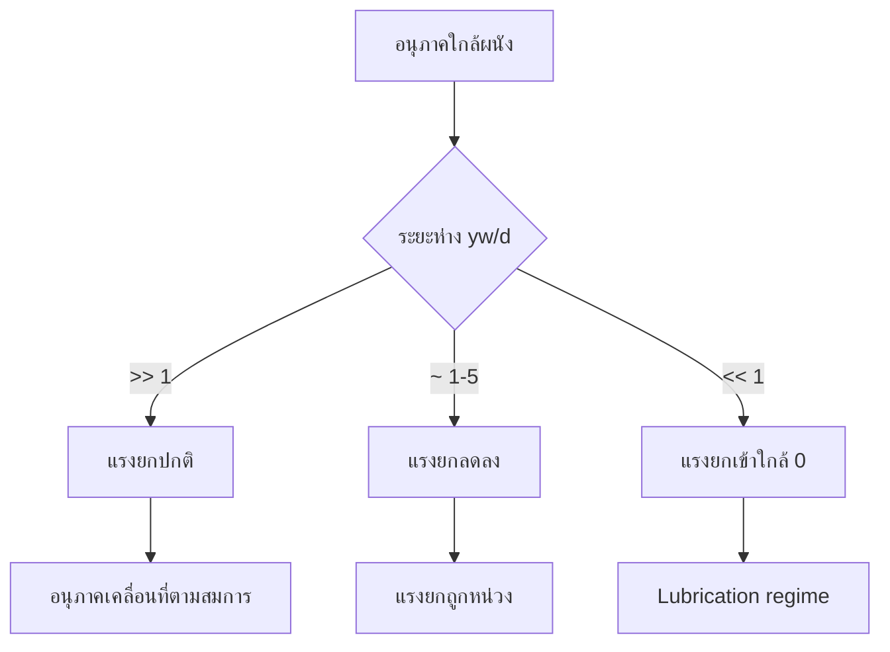

# แบบจำลองแรงยกเฉพาะ (Specific Lift Models)

---

## บทนัยนำ (Introduction)

แบบจำลองแรงยก (Lift Models) ทำหน้าที่กำหนดค่าสัมประสิทธิ์แรงยก ($C_L$) ในสมการโมเมนตัม การเลือกโมเดลที่เหมาะสมขึ้นอยู่กับระบอบการไหล (เลขเรย์โนลด์) และความสามารถในการเสียรูปของอนุภาคหรือฟองอากาศ

> [!INFO] ความสำคัญของการเลือกโมเดลที่เหมาะสม
> แต่ละโมเดลถูกพัฒนาขึ้นสำหรับเงื่อนไขเฉพาะ การใช้โมเดลที่ไม่เหมาะสมอาจทำให้การทำนายมีความคลาดเคลื่อนอย่างมากในการทำนายรูปแบบการไหล

---

## แบบจำลอง Saffman-Mei (Saffman-Mei Lift Model)

### ภาพรวม (Overview)

**Saffman-Mei** เป็นการต่อยอดจากทฤษฎีแรงยก Saffman แบบดั้งเดิม เพื่อพิจารณาผลกระทบของ **Particle Reynolds number ที่มีค่าจำกัด** ซึ่งมีความสำคัญในการใช้งาน CFD ในทางปฏิบัติ

แม้ว่าทฤษฎีต้นฉบับของ Saffman จะถูกพัฒนาขึ้นสำหรับกรณีขีดจำกัดที่ $Re_p \to 0$ แต่ **Mei** ได้พัฒนาความสัมพันธ์เชิงประจักษ์ (empirical correlations) ที่เชื่อมช่องว่างระหว่างช่วงค่า Reynolds number ต่ำและปานกลาง

### สมการโมเดล Saffman-Mei (Model Equations)

$$C_L = \begin{cases}
\frac{2.255}{\sqrt{Re_p S}} \left(1 - 0.15 Re_p^{0.687}\right) & Re_p < 40 \\
\frac{1}{\sqrt{Re_p S}} \left(0.5 + 0.2 Re_p\right) & 40 \leq Re_p \leq 1000
\end{cases} \tag{2.1}$$

### การนิยามตัวแปร (Variable Definitions)

| ตัวแปร | คำอธิบาย | สมการ |
|-----------|-------------|----------|
| **$Re_p$** | Particle Reynolds number | $Re_p = \frac{\rho_c d_p \|\mathbf{u}_c - \mathbf{u}_p\|}{\mu_c}$ |
| **$S$** | Dimensionless shear rate parameter | $S = \frac{d_p}{\|\mathbf{u}_c - \mathbf{u}_p\|} \sqrt{\left\|\frac{\partial \mathbf{u}_c}{\partial y}\right\|^2 + \left\|\frac{\partial \mathbf{u}_c}{\partial z}\right\|^2}$ |
| **$\rho_c$** | ความหนาแน่นของ continuous phase | - |
| **$d_p$** | เส้นผ่านศูนย์กลางอนุภาค | - |
| **$\mu_c$** | ความหนืดของ continuous phase | - |
| **$\mathbf{u}_c$** | ความเร็วของ continuous phase | - |
| **$\mathbf{u}_p$** | ความเร็วของอนุภาค | - |

### การวิเคราะห์ช่วง Reynolds number (Range Analysis)

#### ช่วงที่ 1: $Re_p < 40$

$$C_L = \frac{2.255}{\sqrt{Re_p S}} \left(1 - 0.15 Re_p^{0.687}\right)$$

จุดสำคัญ:
- รักษาลักษณะการสเกลแบบ $Re_p^{-1/2}$ ของทฤษฎี Saffman ดั้งเดิม
- เพิ่มปัจจัยแก้ไข $(1 - 0.15 Re_p^{0.687})$ เพื่อพิจารณาผลกระทบของ Reynolds number ที่มีค่าจำกัด
- เทอมนี้แสดงถึงความเบี่ยงเบนจากการสมมติฐาน creeping flow

#### ช่วงที่ 2: $40 \leq Re_p \leq 1000$

$$C_L = \frac{1}{\sqrt{Re_p S}} \left(0.5 + 0.2 Re_p\right)$$

จุดสำคัญ:
- เปลี่ยนไปใช้รูปแบบฟังก์ชันที่แตกต่างออกไป
- สามารถจับพฤติกรรมแรงยกที่สังเกตได้จากการทดลองได้ดีกว่า
- นิพจน์ $(0.5 + 0.2 Re_p)$ บ่งชี้ว่าค่าสัมประสิทธิ์แรงยกจะเพิ่มขึ้นตาม Reynolds number
- สะท้อนถึงการไหลวน (circulation) ที่เพิ่มขึ้นรอบอนุภาคจากผลกระทบของความเฉื่อย (inertial effects)

### การคำนวณแรงยก (Lift Force Calculation)

$$\mathbf{F}_L = C_L \rho_c \pi d_p^3 (\mathbf{u}_c - \mathbf{u}_p) \times \boldsymbol{\omega} \tag{2.2}$$

**โดยที่ $\boldsymbol{\omega} = \nabla \times \mathbf{u}_c$** = **Local vorticity vector** ของ continuous phase

การคูณไขว้ (cross product) ทำให้แน่ใจว่าแรงยกจะกระทำตั้งฉากกับทั้งความเร็วสัมพัทธ์และ vorticity vectors ซึ่งสอดคล้องกับกลไกของ Magnus effect

---

## แบบจำลอง Tomiyama (Tomiyama Lift Model)

### ภาพรวม (Overview)

**Tomiyama** ถูกพัฒนาขึ้นโดยเฉพาะเพื่อจัดการกับพฤติกรรมเฉพาะของ **ฟองอากาศที่เปลี่ยนรูปได้ (deformable bubbles)** ในการไหลของของเหลว

ต่างจากอนุภาคแข็ง ฟองอากาศสามารถเปลี่ยนรูปร่างได้ภายใต้:
- การเฉือน (shear)
- ความแตกต่างของความดัน (pressure gradients)

ซึ่งนำไปสู่ปรากฏการณ์แรงยกที่ซับซ้อน รวมถึงปรากฏการณ์ **wall peeling** สำหรับฟองอากาศขนาดใหญ่

### สมการโมเดล Tomiyama (Model Equations)

โมเดลนี้ใช้ **Eötvös number** $Eo = \frac{(\rho_c - \rho_d) g d_p^2}{\sigma}$ ซึ่งแสดงถึงอัตราส่วนของแรงลอยตัวต่อแรงตึงผิว

$$C_L = \begin{cases}
\min\left[0.288 \tanh(0.121 Re_p), f(Eo)\right] & Eo \leq 4 \\
f(Eo) & 4 < Eo \leq 10 \\
-0.27 & Eo > 10
\end{cases} \tag{2.3}$$

**ฟังก์ชันวิกฤต:**
$$f(Eo) = 0.00105 Eo^3 - 0.1159 Eo^2 + 0.426 Eo - 0.2303 \tag{2.4}$$

### การนิยามตัวแปร (Variable Definitions)

| ตัวแปร | คำอธิบาย |
|-----------|-------------|
| **$Eo$** | Eötvös number (อัตราส่วนแรงลอยตัวต่อแรงตึงผิว) |
| **$\rho_c$** | ความหนาแน่นของ continuous phase |
| **$\rho_d$** | ความหนาแน่นของ dispersed phase |
| **$g$** | ความโน้มถ่วง |
| **$d_p$** | เส้นผ่านศูนย์กลางฟองอากาศ |
| **$\sigma$** | ค่าความตึงผิวระหว่างเฟส |
| **$Re_p$** | Particle Reynolds number |

### การวิเคราะห์ตามช่วง Eötvös number (Analysis by Eo Range)

| ช่วงค่า Eo | การพิจารณา | พฤติกรรมแรงยก |
|-------------|---------------|-------------------|
| **$Eo \leq 4$** | ฟองอากาศเกือบทรงกลม (minimal deformation) | พิจารณาทั้ง Reynolds number และความสามารถเปลี่ยนรูป |
| **$4 < Eo \leq 10$** | ฟองอากาศเริ่มเปลี่ยนรูป (moderate deformation) | ควบคุมโดยฟังก์ชัน $f(Eo)$ ทั้งหมด |
| **$Eo > 10$** | ฟองอากาศเปลี่ยนรูปมาก (significant deformation) | ค่าสมมาตรคงที่ $C_L = -0.27$ |

### ปรากฏการณ์ Wall Peeling (Wall Peeling Phenomenon)

**คุณสมบัติที่น่าทึ่งที่สุด** ของโมเดล Tomiyama คือการทำนายค่าสัมประสิทธิ์แรงยกที่เป็นลบสำหรับ $Eo > 10$

แรงยกที่เป็นลบอธิบายปรากฏการณ์ **wall peeling**:
- ฟองอากาศขนาดใหญ่จะเคลื่อนที่ออกจากผนังไปยังศูนย์กลางของช่องไหล
- ต่างจากที่คาดหวังจากค่าสัมประสิทธิ์แรงยกที่เป็นบวก (ถูกผลักเข้าหาผนัง)

**กลไกเบื้องหลัง:**
- การเปลี่ยนรูปที่ไม่สมมาตรของฟองอากาศใกล้ผนัง
- การกระจายความดันรอบฟองอากาศที่เปลี่ยนรูปสร้างแรงผลักออกจากผนัง

### ความสำคัญทางอุตสาหกรรม (Industrial Importance)

- **Bubble column reactors**
- **การไหลในท่อ**
- ส่งผลต่อการกระจายตัวของฟองอากาศ ประสิทธิภาพการผสม และรูปแบบการไหลโดยรวม

โมเดล Tomiyama ได้รับการตรวจสอบอย่างกว้างขวางกับข้อมูลจากการทดลองสำหรับระบบอากาศ-น้ำ และถูกนำไปใช้อย่างแพร่หลายใน CFD codes

---

## แบบจำลอง Legendre-Magnaudet (Legendre-Magnaudet Lift Model)

### ภาพรวม (Overview)

**Legendre-Magnaudet** เป็นกรอบการทำงานที่ครอบคลุมสำหรับการคำนวณแรงยกบนฟองอากาศในการไหลแบบหนืด (viscous flows) โดยพิจารณา **อัตราส่วนความหนืด (viscosity ratio)** ระหว่างเฟสที่กระจายตัวและเฟสต่อเนื่องอย่างชัดเจน

**โมเดลนี้มีคุณค่าอย่างยิ่งสำหรับ:**
- หยดน้ำมันในน้ำ
- กระบวนการสกัดแบบของเหลว-ของเหลว (liquid-liquid extraction)
- ระบบที่ความหนืดของเฟสที่กระจายตัวมีค่าใกล้เคียงหรือมากกว่าความหนืดของเฟสต่อเนื่อง

### การแบ่งแรงยก (Lift Force Decomposition)

$$C_L = C_L^{\text{inviscid}} + C_L^{\text{viscous}} \tag{2.5}$$

| ส่วนประกอบ | แหล่งที่มา | คำอธิบาย |
|-------------|-----------|-----------|
| **$C_L^{\text{inviscid}}$** | Potential flow | แรงยกที่เกิดจากผลกระทบของ potential flow รอบฟองอากาศ |
| **$C_L^{\text{viscous}}$** | Vorticity diffusion | แรงยกเพิ่มเติมที่เกิดจากการแพร่ของ vorticity ในชั้นขอบเขต |

### ส่วน Inviscid (Inviscid Component)

$$C_L^{\text{inviscid}} = \frac{6}{\pi^2} \frac{(2 + \lambda)^2 + \lambda}{(1 + \lambda)^3} \tag{2.6}$$

**โดยที่ $\lambda = \mu_d/\mu_c$** = **อัตราส่วนความหนืด** ระหว่างเฟสที่กระจายตัวและเฟสต่อเนื่อง

**พฤติกรรมขอบเขต:**
- **$\lambda \to 0$** (ฟองแก๊สในของเหลว): $C_L^{\text{inviscid}} \to \frac{6}{\pi^2} \approx 0.608$
- **$\lambda \to \infty$** (อนุภาคแข็ง): ค่าสัมประสิทธิ์จะเข้าใกล้ค่าขีดจำกัดที่แตกต่างกัน

### ส่วน Viscous (Viscous Component)

$$C_L^{\text{viscous}} = \frac{16}{\pi} \frac{\lambda}{(1 + \lambda)^2} \frac{1}{\sqrt{Re_p}} \tag{2.7}$$

**ลักษณะเฉพาะ:**
- การสเกลแบบ $Re_p^{-1/2}$ เป็นลักษณะเฉพาะของผลกระทบชั้นขอบเขต
- แรงยกจากความหนืดมีความสำคัญมากขึ้นที่ Reynolds number ต่ำ
- ค่าสัมประสิทธิ์หน้าพิจารณาอิทธิพลของอัตราส่วนความหนืดต่อความแรงของการแพร่ของ vorticity

### การคำนวณแรงยกที่สมบูรณ์ (Complete Lift Force Calculation)

$$\mathbf{F}_L = C_L \rho_c \frac{\pi d_p^3}{6} (\mathbf{u}_c - \mathbf{u}_p) \times \boldsymbol{\omega} \tag{2.8}$$

**ข้อสังเกตสำคัญ:** โมเดล Legendre-Magnaudet ใช้ **มวลของของไหลที่ถูกแทนที่** $\rho_c \frac{\pi d_p^3}{6}$ แทนที่จะเป็นมวลของอนุภาค ซึ่งเหมาะสมสำหรับฟองอากาศและอนุภาคที่มีน้ำหนักเบา

### ขอบเขตการใช้งาน (Applicability Range)

| พารามิเตอร์ | ขอบเขตที่แนะนำ |
|---------------|-------------------|
| **Reynolds number** | $Re_p \leq 100$ |
| **อัตราส่วนความหนืด** | $\lambda \leq 10$ |
| **ความถูกต้อง** | สูงสำหรับฟองอากาศและหยดของเหลวในระบบของเหลวต่างๆ |

**นอกช่วงเหล่านี้** อาจจำเป็นต้องมีการแก้ไขเพิ่มเติมเพื่อพิจารณา:
- การเปลี่ยนรูปของฟองอากาศ
- ผลกระทบจาก wake
- การปฏิสัมพันธ์กับความปั่นป่วน (turbulence)

### การใช้งานใน CFD (CFD Applications)

**โมเดล Legendre-Magnaudet** มักถูกเลือกใช้สำหรับระบบที่การทำนายการเคลื่อนที่และการกระจายตัวของฟองอากาศอย่างแม่นยำมีความสำคัญ:

- **Bubble column reactors**
- **Flotation processes**
- **อุปกรณ์สกัดแบบของเหลว-ของเหลว**

เป็นทางเลือกที่มีพื้นฐานทางฟิสิกส์แทนความสัมพันธ์เชิงประจักษ์ (empirical correlations)

---

## ผลกระทบจากผนัง (Wall-Induced Lift)

### ภาพรวม (Overview)

เมื่ออนุภาคอยู่ใกล้ผนังแข็ง แรงยกจะถูกปรับปรุงเพื่อพิจารณาแรงผลักจากผนัง (Repulsion)

$$C_L^{wall} = C_L^{\infty} \cdot f\left(\frac{y_w}{d}\right) \tag{2.9}$$

โดยที่ $f(y_w/d) = 1 - \exp(-\beta y_w/d)$ คือฟังก์ชันหน่วง (Damping function) เพื่อลดแรงยกเมื่อใกล้ผนัง

### ฟังก์ชันการแก้ไขผนัง (Wall Correction Function)

$$f\left(\frac{y_w}{d}\right) = 1 - \exp\left(-\beta \frac{y_w}{d}\right) \tag{2.10}$$

**โดยที่ $\beta \approx 1.5$** สำหรับสภาวะโฟลว์แบบหลายเฟสทั่วไป

**คุณสมบัติของฟังก์ชัน:**
- $f \rightarrow 0$ เมื่อ $y_w \rightarrow 0$ (อนุภาคอยู่ใกล้ผนังมาก)
- $f \rightarrow 1$ เมื่อ $y_w \rightarrow \infty$ (ห่างจากผลกระทบของผนัง)

### พฤติกรรมในระบอบต่างๆ (Behavior in Different Regimes)

| ระยะห่างจากผนัง | ค่า $f$ | พฤติกรรมแรงยก |
|-------------------|---------|----------------|
| **$y_w/d \gg 1$** | $f \rightarrow 1$ | เข้าใกล้ค่าในสภาวะกระแสอิสระ, ผลกระทบของผนังน้อยมาก |
| **$1 \lesssim y_w/d \lesssim 5$** | $0 < f < 1$ | บริเวณเปลี่ยนผ่านค่อยเป็นค่อยไป, ขึ้นอยู่กับ Reynolds number อย่างมาก |
| **$y_w/d \lesssim 1$** | $f \rightarrow 0$ | การกดแรงยกของผนังอย่างรุนแรง |



---

## การนำไปใช้ใน OpenFOAM (C++ Implementation)

### สถาปัตยกรรมโค้ด (Code Architecture)

OpenFOAM นำแบบจำลองแรงยกไปใช้ผ่านการออกแบบแบบโมดูลาร์ (modular design)

#### คลาสพื้นฐานของโมเดลแรงยก (Lift Model Base Class)

```cpp
// Base lift model class
template<class CloudType>
class LiftModel
{
public:
    // Calculate lift force
    virtual vector liftForce
    (
        const typename CloudType::parcelType& p,
        const vector& curlUc,
        const scalar Re,
        const scalar muc
    ) const = 0;

    // Virtual destructor
    virtual ~LiftModel() {}
};
```

จุดสำคัญ:
- เป็น **abstract base class** ที่บังคับโครงสร้างทั่วไปสำหรับทุกการนำโมเดลแรงยกไปใช้
- ใช้ฟังก์ชัน **pure virtual** `liftForce()`
- แรงยก $\mathbf{F}_L$ จะกระทำตั้งฉากกับทิศทางความเร็วสัมพัทธ์ระหว่างเฟส
- มีความสำคัญอย่างยิ่งต่อการทำนายพฤติกรรมของเฟสที่กระจายตัวในการไหลแบบเฉือน

### การนำ Saffman-Mei ไปใช้ (Saffman-Mei Implementation)

```cpp
// Saffman-Mei lift coefficient calculation in OpenFOAM
template<class CloudType>
Foam::vector Foam::SaffmanMeiLiftForce<CloudType>::calcLiftForce
(
    const typename CloudType::parcelType& p,
    const vector& curlUc,
    const scalar Re,
    const scalar muc
) const
{
    const scalar d = p.d();
    const scalar magUr = mag(p.U() - Uc_);
    const scalar shearRate = mag(curlUc);

    // Saffman parameter
    const scalar S = (d/magUr) * sqrt(sqr(curlUc.component(0)) +
                                   sqr(curlUc.component(1)));

    scalar Cl = 0;

    if (Re < 40)
    {
        Cl = 2.255/sqrt(Re*S) * (1.0 - 0.15*pow(Re, 0.687));
    }
    else if (Re <= 1000)
    {
        Cl = (0.5 + 0.2*Re)/sqrt(Re*S);
    }
    else
    {
        Cl = 0;
    }

    // Lift force
    vector liftForce = Cl * rhoc_ * pow3(d) * (p.U() - Uc_) ^ curlUc;

    return liftForce;
}
```

### การนำ Tomiyama Lift Model ไปใช้ (Tomiyama Implementation)

```cpp
// Tomiyama lift coefficient calculation in OpenFOAM
template<class CloudType>
Foam::scalar Foam::TomiyamaLiftForce<CloudType>::calcLiftCoefficient
(
    const scalar Re,
    const scalar Eo
) const
{
    scalar Cl_tanh = 0.288*tanh(0.121*Re);

    scalar f_Eo = 0.00105*pow(Eo, 3)
                - 0.1159*pow(Eo, 2)
                + 0.426*Eo
                - 0.2303;

    scalar Cl;

    if (Eo <= 4)
    {
        Cl = min(Cl_tanh, f_Eo);
    }
    else if (Eo <= 10)
    {
        Cl = f_Eo;
    }
    else
    {
        Cl = -0.27; // Negative lift for large bubbles
    }

    return Cl;
}
```

#### สัมประสิทธิ์แรงยกตามขนาดฟอง (Lift Coefficient by Bubble Size)

| ขนาดฟอง (Eötvös number) | สมการสัมประสิทธิ์แรงยก $C_L$ | พฤติกรรม | คำอธิบาย |
|---|---|---|---|
| **ฟองขนาดเล็ก** ($Eo \leq 4$) | $C_L = \min(C_L^{viscous}, C_L^{Eo})$ | แรงยกบวก | ดึงดูดผนัง |
| **ฟองขนาดกลาง** ($4 < Eo \leq 10$) | $C_L = C_L^{Eo}$ | แรงยกผันแปร | ช่วงเปลี่ยนผ่าน |
| **ฟองขนาดใหญ่** ($Eo > 10$) | $C_L = -0.27$ | แรงยกติดลบ | ผลักผนัง (wall peeling) |

#### ความสำคัญในการจำลองการไหล (Importance in Flow Simulation)

**จุดสำคัญ:**
- การเปลี่ยนแปลงจากพฤติกรรม **wall-attracting** ไปเป็น **wall-repelling** ส่งผลอย่างมากต่อ:
  - การกระจายตัวของฟองในโดเมน
  - ปริมาตรความเข้มข้นของพื้นที่ผิว (interfacial area concentration)
  - การถ่ายเทมวลและมวลระหว่างเฟส

### การรวมแบบจำลอง (Model Integration)

แบบจำลองแรงยกถูกรวมเข้ากับระบบกลุ่มอนุภาคแบบลากรางเจียน (Lagrangian particle cloud system):

```cpp
// In the particle motion equation
template<class CloudType>
void KinematicCloud<CloudType>::computeForce()
{
    // ...
    if (liftModel_.valid())
    {
        vector FL = liftModel_->liftForce(p, curlUc, Rep, muc);
        p.F() += FL;
    }
}
```

---

## สรุปเปรียบเทียบโมเดลต่างๆ (Model Comparison Summary)

| โมเดล | ช่วง Reynolds | ประเภทอนุภาค | ข้อดี | ข้อจำกัด |
|--------|----------------|----------------|---------|------------|
| **Saffman-Mei** | $Re_p < 1000$ | อนุภาคแข็ง | ความแม่นยำสูงในช่วงต่ำ-ปานกลาง | ไม่รองรับการเปลี่ยนรูป |
| **Tomiyama** | ทุกช่วง | ฟองอากาศ | รองรับการเปลี่ยนรูปและ wall peeling | ต้องการค่า Eötvös number |
| **Legendre-Magnaudet** | $Re_p \leq 100$ | ฟองอากาศ/หยด | พื้นฐานทางฟิสิกส์แข็งแกร่ง | ข้อจำกัดความหนืดสูง |
| **Constant $C_L$** | ทุกช่วง | ทั่วไป | ง่ายและรวดเร็ว | ความแม่นยำต่ำ |

> [!TIP] แนวทางการเลือกโมเดล
> 1. **อนุภาคแข็งในการไหลเฉือน**: Saffman-Mei
> 2. **ฟองอากาศในระบมแก๊ส-ของเหลว**: Tomiyama
> 3. **หยดน้ำมันในน้ำ**: Legendre-Magnaudet
> 4. **การคำนวณเบื้องต้น**: Constant $C_L$

---

## อ้างอิง (References)

1. **Saffman, P.G.** (1965). "The lift on a small sphere in a slow shear flow". *Journal of Fluid Mechanics*
2. **Mei, R.** (1992). "An approximate expression for the lift force on a spherical bubble or drop in a low Reynolds number shear flow". *Physics of Fluids*
3. **Tomiyama, A.** et al. (2002). "Transverse migration of single bubbles in simple shear flows". *Chemical Engineering Science*
4. **Legendre, D. & Magnaudet, J.** (1998). "The lift force on a spherical bubble in a viscous linear shear flow". *Journal of Fluid Mechanics*

---
