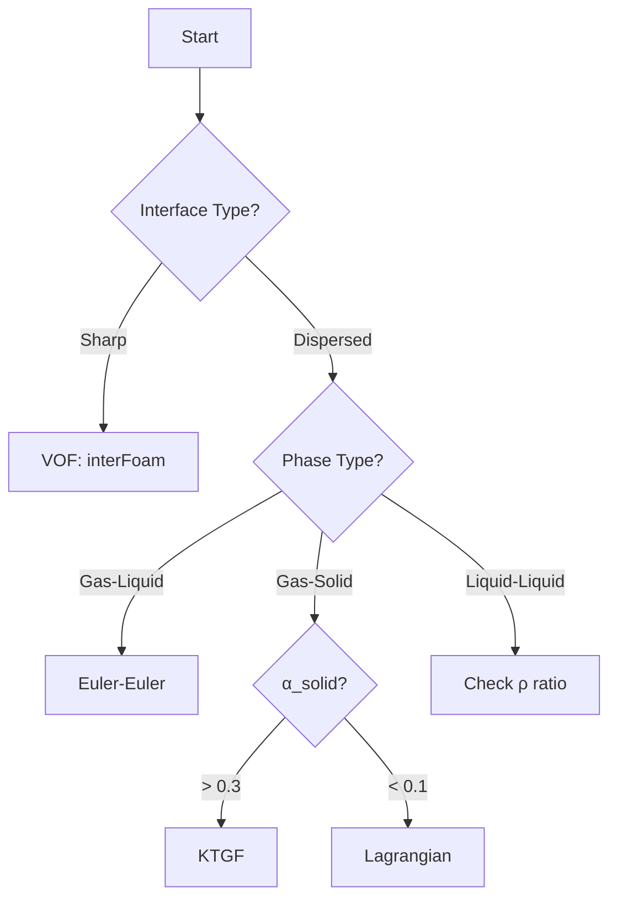

# Model Selection Overview

ภาพรวมการเลือกโมเดล Multiphase

---

## Overview



---

## 1. Method Classification

| Method | Approach | Best For |
|--------|----------|----------|
| **VOF** | Track interface | Free surface, waves |
| **Euler-Euler** | Interpenetrating continua | Bubbly/dispersed |
| **Lagrangian** | Track particles | Dilute, particle tracking |
| **Mixture** | Single velocity | Homogeneous |

---

## 2. Solver Selection

### Quick Guide

| Scenario | Solver |
|----------|--------|
| Dam break, waves | `interFoam` |
| Bubble column | `multiphaseEulerFoam` |
| Fluidized bed | `multiphaseEulerFoam` + KTGF |
| Spray combustion | `sprayFoam` |
| Particle deposition | `DPMFoam` |

### Decision Criteria

| Criterion | VOF | Euler-Euler | Lagrangian |
|-----------|-----|-------------|------------|
| Interface resolution | Cell-level | Sub-grid | — |
| Particle count | Few large | Many averaged | Individual |
| Computing cost | High (fine mesh) | Moderate | Low-moderate |

---

## 3. Interphase Force Selection

### Required Forces by System

| System | Drag | Lift | VM | TD |
|--------|------|------|----|----|
| Gas-Liquid | ✓ | Often | ✓ | Often |
| Liquid-Liquid | ✓ | Rarely | Rarely | Rarely |
| Gas-Solid | ✓ | No | No | Sometimes |

### Drag Model Selection

| Condition | Model |
|-----------|-------|
| Spherical, Re < 1000 | SchillerNaumann |
| Deformed bubbles (Eo > 1) | IshiiZuber |
| Contaminated systems | Tomiyama |
| Dense gas-solid | GidaspowErgunWenYu |

---

## 4. Turbulence Modeling

### Per-Phase Turbulence

```cpp
// constant/turbulenceProperties.water
simulationType  RAS;
RAS { RASModel kEpsilon; }

// constant/turbulenceProperties.air
simulationType  RAS;
RAS { RASModel kEpsilon; }
```

### Bubble-Induced Turbulence

- เพิ่ม source term ใน k-ε สำหรับ bubble wakes
- ใช้ Sato model หรือ BIT model

---

## 5. Key Dimensionless Numbers

| Number | Formula | Use |
|--------|---------|-----|
| Eo (Eötvös) | $\frac{g\Delta\rho d^2}{\sigma}$ | Bubble shape |
| Re | $\frac{\rho U d}{\mu}$ | Flow regime |
| Mo (Morton) | $\frac{g\mu^4\Delta\rho}{\rho^2\sigma^3}$ | System property |
| St (Stokes) | $\frac{\rho_d d^2 U}{18\mu_c L}$ | Particle response |

---

## 6. Practical Guidelines

### Start Simple

1. Begin with **drag only**
2. Add **virtual mass** if gas-liquid
3. Add **lift** if shear flow matters
4. Add **turbulent dispersion** if high turbulence

### Incremental Validation

```cpp
// Step 1: Drag only
drag { (air in water) { type SchillerNaumann; } }

// Step 2: Add VM
virtualMass { (air in water) { type constantCoefficient; Cvm 0.5; } }

// Step 3: Add Lift (if needed)
lift { (air in water) { type Tomiyama; } }
```

---

## 7. Numerical Settings

### PIMPLE for Multiphase

```cpp
PIMPLE
{
    nOuterCorrectors    3;
    nCorrectors         2;
    nAlphaSubCycles     2;
}

relaxationFactors
{
    fields { p 0.3; "alpha.*" 0.7; }
    equations { U 0.7; }
}
```

### Time Step Control

```cpp
adjustTimeStep  yes;
maxCo           0.5;
maxAlphaCo      0.3;
```

---

## Quick Reference

| Question | Check | Choose |
|----------|-------|--------|
| Sharp interface? | Visual inspection | VOF |
| Many particles? | Count per cell > 1 | Euler-Euler |
| α_d < 0.1? | dilute | Lagrangian option |
| Gas-liquid? | ρ ratio > 100 | Include VM |
| Dense granular? | α > 0.3 | KTGF required |

---

## Concept Check

<details>
<summary><b>1. ทำไมต้องเริ่มจาก simple model?</b></summary>

เพื่อให้ **debug ง่าย** — ถ้า solver ไม่ converge ด้วย drag เดียว การเพิ่ม models จะยิ่งแย่ลง
</details>

<details>
<summary><b>2. KTGF ใช้เมื่อไหร่?</b></summary>

เมื่อ **α_solid > 0.3** — ต้องมี model สำหรับ particle-particle collisions (granular pressure, viscosity)
</details>

<details>
<summary><b>3. VOF กับ Euler-Euler เลือกอย่างไร?</b></summary>

- **VOF**: Interface ต้อง **sharp** และ **resolvable** ด้วย mesh
- **Euler-Euler**: มี **หลาย bubbles/particles ต่อ cell** (averaged)
</details>

---

## Related Documents

- **Decision Framework:** [01_Decision_Framework.md](01_Decision_Framework.md)
- **Gas-Liquid Systems:** [02_Gas_Liquid_Systems.md](02_Gas_Liquid_Systems.md)
- **Liquid-Liquid Systems:** [03_Liquid_Liquid_Systems.md](03_Liquid_Liquid_Systems.md)