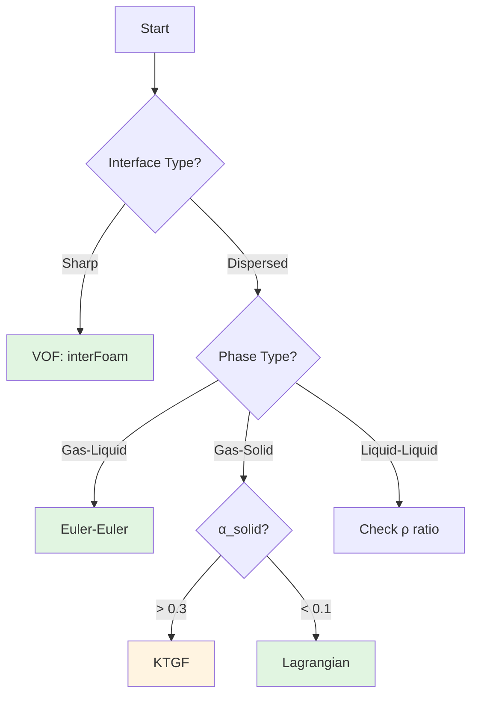

# Model Selection Overview

ภาพรวมการเลือกโมเดล Multiphase

---

## Learning Objectives

หลังจากอ่านบทนี้ คุณจะสามารถ:

- **แยกแยะประเภทของ multiphase methods** และเลือกใช้ได้อย่างเหมาะสม (VOF, Euler-Euler, Lagrangian)
- **ใช้ dimensionless numbers** (Eo, Re, Mo, St) เพื่อวินิจฉัย flow regime และ bubble/particle behavior
- **ประยุกต์ Golden Rule** (Start Simple, Add Complexity) เพื่อสร้าง incremental validation strategy
- **เลือก interphase forces** ที่เหมาะสมกับแต่ละระบบ (drag, lift, virtual mass, turbulent dispersion)
- **ตั้งค่า PIMPLE parameters** สำหรับ multiphase flows อย่างเหมาะสม

---

## Why This Matters

> **ทำไมการเลือก Model สำคัญ?**
> 
> - **Model ผิด = ผลลัพธ์ผิด** แม้ mesh และ numerical settings จะดีเพียงใด
> - การเลือก method ที่ไม่เหมาะสมกับ flow regime ทำให้ **converge ไม่ได้** หรือ **ผลลัพธ์ไม่น่าเชื่อถือ**
> - Model ที่ซับซ้อนเกินไปไม่ได้หมายถึงความแม่นยำเสมอไป — **overfitting** สามารถทำให้ใช้เวลาคำนวณนานโดยไม่ได้ประโยชน์
> - การเข้าใจ **flow regime** (dispersed vs separated) เป็นพื้นฐานสำคัญก่อนเลือก model

---

## Prerequisites

ก่อนดำเนินการต่อ คุณควรมีความเข้าใจเกี่ยวกับ:

- **Governing Equations for Multiphase Flow** (Module 04: Fundamental Concepts)
- **Flow Regimes** (dispersed, separated, transitional)
- **พื้นฐาน OpenFOAM case structure** และ dictionary files
- **Dimensionless analysis** พื้นฐาน (Reynolds, Weber numbers)

---

## Core Concepts

### 💡 Golden Rule: Start Simple, Add Complexity

เริ่มจาก drag only → ถ้า stable แล้วค่อยเพิ่ม lift, virtual mass, turbulent dispersion



### Method Classification

| Method | Approach | Best For | Interface Resolution |
|--------|----------|----------|---------------------|
| **VOF** | Track interface (α field) | Free surface, waves, sharp interfaces | Cell-level |
| **Euler-Euler** | Interpenetrating continua | Bubbly/dispersed flows | Sub-grid (averaged) |
| **Lagrangian** | Track particles individually | Dilute systems, particle tracking | Individual |
| **Mixture** | Single velocity field | Homogeneous flows, slurry | Averaged |

### Key Dimensionless Numbers

| Number | Formula | Physical Meaning | Decision Use |
|--------|---------|------------------|--------------|
| **Eo (Eötvös)** | $\frac{g\Delta\rho d^2}{\sigma}$ | Buoyancy vs Surface tension | Bubble shape (spherical vs deformed) |
| **Re** | $\frac{\rho U d}{\mu}$ | Inertia vs Viscosity | Flow regime (laminar vs turbulent) |
| **Mo (Morton)** | $\frac{g\mu^4\Delta\rho}{\rho^2\sigma^3}$ | System property | Clean vs contaminated systems |
| **St (Stokes)** | $\frac{\rho_d d^2 U}{18\mu_c L}$ | Particle response time | Coupling strength (one-way vs two-way) |

---

## Solver Selection

### Quick Solver Guide

| Scenario | Solver | Notes |
|----------|--------|-------|
| Dam break, waves, free surface | `interFoam` | VOF method, sharp interface |
| Bubble column, gas-liquid reactors | `multiphaseEulerFoam` | Euler-Euler, dispersed |
| Fluidized bed, dense granular | `multiphaseEulerFoam` + KTGF | Granular kinetics |
| Spray combustion, atomization | `sprayFoam` | Lagrangian parcels |
| Particle deposition, filtration | `DPMFoam` | Discrete particle method |

### Solver Decision Criteria

| Criterion | VOF | Euler-Euler | Lagrangian |
|-----------|-----|-------------|------------|
| Interface resolution | Cell-level (sharp) | Sub-grid (averaged) | Individual |
| Particle/bubble count | Few large interfaces | Many per cell | Individual |
| Computing cost | High (fine mesh) | Moderate | Low-moderate |
| Typical α range | Any | 0.05 - 0.7 | α_d < 0.1 |

---

## Interphase Force Selection

### Required Forces by System

| System | Drag | Lift | Virtual Mass | Turbulent Dispersion |
|--------|------|------|--------------|---------------------|
| **Gas-Liquid** | ✓ | Often | ✓ | Often |
| **Liquid-Liquid** | ✓ | Rarely | Rarely | Rarely |
| **Gas-Solid (dilute)** | ✓ | No | No | Sometimes |
| **Gas-Solid (dense)** | ✓ | No | No | Often |

### Drag Model Decision Matrix

| Condition | Model | Rationale |
|-----------|-------|-----------|
| Spherical, Re < 1000 | `SchillerNaumann` | Standard for solid spheres, clean bubbles |
| Deformed bubbles, Eo > 1 | `IshiiZuber` | Accounts for shape distortion |
| Contaminated systems | `Tomiyama` | Includes contamination effects |
| Dense gas-solid, α > 0.2 | `GidaspowErgunWenYu` | Combines WenYu (dilute) + Ergun (dense) |

---

## OpenFOAM Implementation

### Incremental Validation Strategy (Start Simple!)

เริ่มจาก model ที่เรียบง่ายที่สุด แล้วค่อยๆ เพิ่มความซับซ้อน:

```cpp
// ===== STEP 1: Drag Only =====
// constant/phaseProperties
drag
{
    (air in water)
    {
        type        SchillerNaumann;
    }
}

// ตรวจสอบ: converge หรือยัง? mass balance ดีหรือไม่?

// ===== STEP 2: Add Virtual Mass (if gas-liquid) =====
virtualMass
{
    (air in water)
    {
        type                constantCoefficient;
        Cvm                 0.5;  // Default for spheres
    }
}

// ตรวจสอบ: convergence ดีขึ้นหรือไม่?

// ===== STEP 3: Add Lift (if shear flow matters) =====
lift
{
    (air in water)
    {
        type        Tomiyama;  // Better for deformed bubbles
    }
}

// ===== STEP 4: Add Turbulent Dispersion (if high turbulence) =====>
turbulentDispersion
{
    (air in water)
    {
        type        constantCoefficient;
        Ct          0.1;  // Typical range: 0.1 - 1.0
    }
}
```

### PIMPLE Settings for Multiphase

```cpp
// system/fvSolution
PIMPLE
{
    nOuterCorrectors    3;      // Outer loops for coupling
    nCorrectors         2;      // Pressure correctors
    nAlphaSubCycles     2;      // Interface sharpening
    cAlpha              1;      // Compression coefficient
    
    // MULES vs ICONE
    interfaceCompression no;
    nAlphaCorr          1;
}

relaxationFactors
{
    fields
    {
        p               0.3;    // Pressure relaxation
        "alpha.*"       0.7;    // Volume fraction
    }
    equations
    {
        U               0.7;    // Momentum relaxation
        "k.*"           0.7;    // Turbulence
        "epsilon.*"     0.7;
    }
}
```

### Time Step Control

```cpp
// system/controlDict
adjustTimeStep  yes;
maxCo           0.5;        // Courant number limit
maxAlphaCo      0.3;        // Interface Courant (VOF)

// Adaptive time stepping
maxDeltaT       0.001;
```

### Turbulence Modeling for Multiphase

```cpp
// constant/turbulenceProperties.water
simulationType  RAS;
RAS
{
    RASModel       kEpsilon;
    turbulence     on;
    
    // Per-phase turbulence
    on              all;  // Separate fields per phase
}

// constant/turbulenceProperties.air
simulationType  RAS;
RAS
{
    RASModel       kEpsilon;
    turbulence     on;
}
```

---

## Decision Checklist

ใช้ checklist นี้เพื่อช่วยตัดสินใจ:

| Question | Check | Action |
|----------|-------|--------|
| **Interface Type?** | Visual inspection or estimate | **Sharp** → VOF<br>**Dispersed** → Euler-Euler |
| **Particles per Cell?** | Estimate: α × V_cell / V_particle | **> 1** → Euler-Euler<br>**< 1** → Lagrangian |
| **Volume Fraction?** | From design/experiment | **α_d < 0.1** → Consider Lagrangian<br>**α_d > 0.3** → Euler-Euler |
| **Density Ratio?** | ρ_continuous / ρ_dispersed | **> 100** → Include Virtual Mass |
| **Granular System?** | α_solid estimate | **α > 0.3** → KTGF required |
| **Bubble Shape?** | Calculate Eo number | **Eo < 1** → Spherical<br>**Eo > 1** → Deformed |
| **Contamination?** | System knowledge | **Clean** → SchillerNaumann/IshiiZuber<br>**Dirty** → Tomiyama |

---

## Common Issues & Solutions

| Issue | Symptoms | Solutions |
|-------|----------|-----------|
| **Divergence** | Residuals blow up, Co limit exceeded | - Reduce time step<br>- Increase under-relaxation<br>- Start with drag only |
| **Unphysical α values** | α < 0 or α > 1 | - Check MULES settings<br>- Reduce `maxAlphaCo`<br>- Improve mesh quality |
| **Slow convergence** | Residuals plateau | - Add virtual mass (gas-liquid)<br>- Check turbulence model<br>- Verify BC consistency |
| **Mass balance error** | Total mass not conserved | - Tighten convergence tolerance<br>- Increase nOuterCorrectors<br>- Check flux BCs |

---

## Key Takeaways

- **Golden Rule**: Start Simple (drag only) → Add Complexity incrementally
- **Flow Regime** เป็นปัจจัยสำคัญที่สุดในการเลือก method — ตรวจสอบด้วย dimensionless numbers
- **VOF** สำหรับ sharp interfaces, **Euler-Euler** สำหรับ dispersed flows, **Lagrangian** สำหรับ dilute systems
- **Gas-Liquid systems** มักต้องการ virtual mass; **Gas-Solid** แบบ dense ต้องการ KTGF
- **Validate ทีละ step** จะช่วย debug ได้ง่ายกว่าพยายามรวมทุกอย่างในครั้งเดียว
- **PIMPLE parameters** ต้องปรับให้เหมาะกับ multiphase: nOuterCorrectors ≥ 2, relaxation สำคัญ

---

## Concept Check

<details>
<summary><b>1. ทำไมต้องเริ่มจาก simple model?</b></summary>

เพื่อให้ **debug ง่าย** — ถ้า solver ไม่ converge ด้วย drag เดียว การเพิ่ม models จะยิ่งแย่ลง

การเพิ่ม model ทีละ step ช่วยให้:
- รู้ว่าปัญหาเกิดจาก model ไหน
- เข้าใจ contribution ของแต่ละ force
- ประหยัดเวลาคำนวณในขั้นตอน development
</details>

<details>
<summary><b>2. KTGF ใช้เมื่อไหร่?</b></summary>

เมื่อ **α_solid > 0.3** — ต้องมี model สำหรับ particle-particle collisions (granular pressure, viscosity)

KTGF (Kinetic Theory of Granular Flows) จำเป็นเมื่อ:
- Particle collisions dominate
- Granular temperature มีนัยสำคัญ
- Solid phase behaves like fluid มี viscosity และ pressure
</details>

<details>
<summary><b>3. VOF กับ Euler-Euler เลือกอย่างไร?</b></summary>

- **VOF**: Interface ต้อง **sharp** และ **resolvable** ด้วย mesh (เช่น free surface, dam break)
- **Euler-Euler**: มี **หลาย bubbles/particles ต่อ cell** (averaged, เช่น bubble column)

เกณฑ์พิจารณา:
- ถ้า mesh ละเอียดพอจะ resolve interface → VOF
- ถ้า particles/bubbles เล็กเกินไป → Euler-Euler
</details>

<details>
<summary><b>4. Virtual Mass จำเป็นเมื่อไหร่?</b></summary>

Virtual Mass จำเป็นเมื่อ **density ratio สูง** (ρ_c/ρ_d > 100) เช่น gas-liquid systems

เหตุผล:
- Dispersed phase เร่ง/หน่วง → ต้องเคลื่อน continuous phase รอบๆ
- Effect ชัดเจนใน unsteady flows (acceleration dominant)
- ช่วยเรื่อง convergence สำหรับ gas-liquid systems
</details>

---

## Related Documents

- **Decision Framework:** [01_Decision_Framework.md](01_Decision_Framework.md) — Detailed methodology for method selection
- **Gas-Liquid Systems:** [02_Gas_Liquid_Systems.md](02_Gas_Liquid_Systems.md) — Specific implementation guidance
- **Liquid-Liquid Systems:** [03_Liquid_Liquid_Systems.md](03_Liquid_Liquid_Systems.md) — Emulsion and separation applications
- **Fundamental Concepts:** [../01_FUNDAMENTAL_CONCEPTS/00_Overview.md](../01_FUNDAMENTAL_CONCEPTS/00_Overview.md) — Flow regimes basics