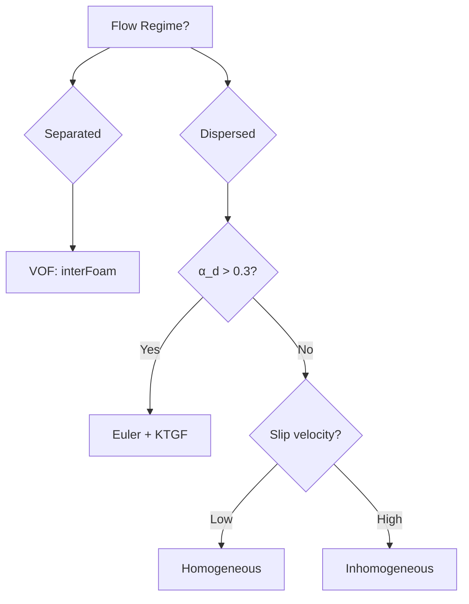
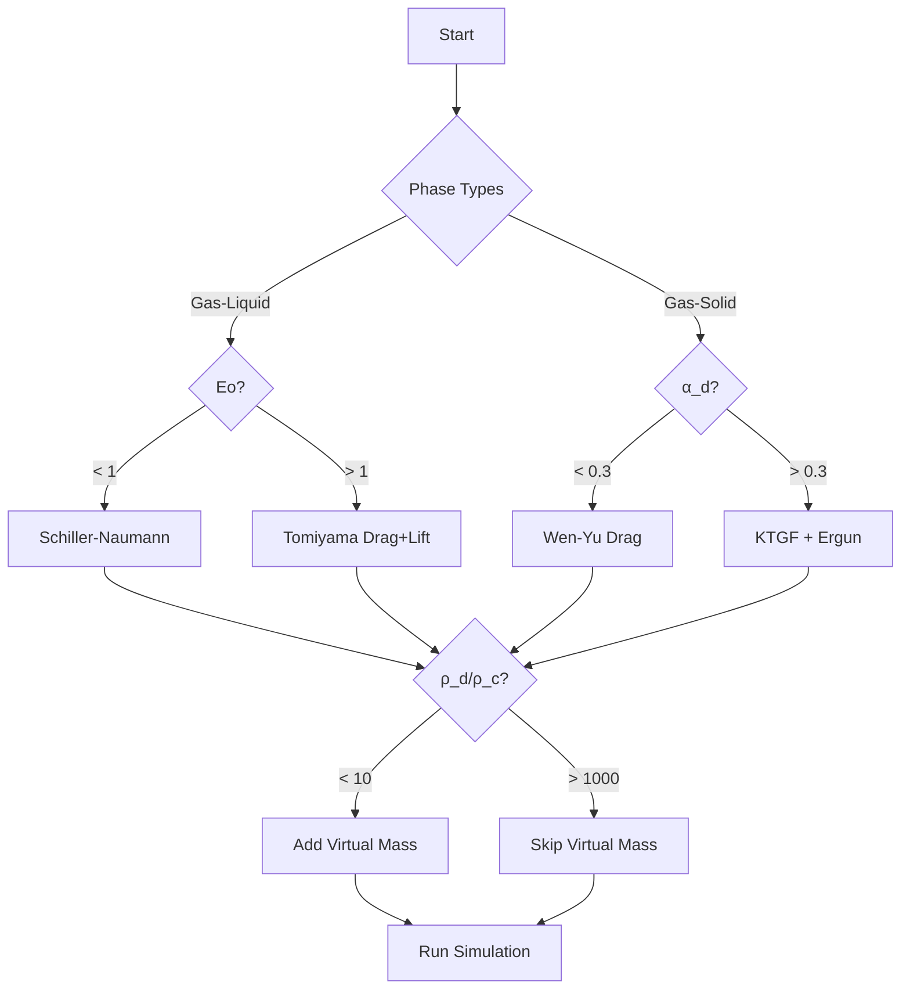

# Model Selection Decision Framework

กรอบการตัดสินใจเลือกแบบจำลอง Multiphase Flow

---

## Core Principle

> **เลือกโมเดลที่เรียบง่ายที่สุด** ที่ยังคงทำนายฟิสิกส์ที่สำคัญได้ถูกต้อง



---

## 1. System Classification

### Phase Types

| System | Solver | Use Case |
|--------|--------|----------|
| Gas-Liquid | `interFoam`, `multiphaseEulerFoam` | Bubbles, droplets |
| Liquid-Liquid | `interFoam` | Emulsions, separation |
| Gas-Solid | `multiphaseEulerFoam` | Fluidized beds |
| Liquid-Solid | `twoPhaseEulerFoam` | Slurries |

### Flow Regimes

| Regime | Characteristic | Method |
|--------|----------------|--------|
| **Separated** | Sharp interface | VOF |
| **Dispersed** | Bubbles/particles in continuous phase | Euler-Euler |

---

## 2. Dimensionless Numbers

### Particle Reynolds Number

$$Re_p = \frac{\rho_c u_{rel} d_p}{\mu_c}$$

| $Re_p$ | Regime | Drag Model |
|--------|--------|------------|
| < 1 | Stokes | $C_D = 24/Re_p$ |
| 1-1000 | Transition | Schiller-Naumann |
| > 1000 | Newton | $C_D = 0.44$ |

### Eötvös Number

$$Eo = \frac{g(\rho_c - \rho_d)d_p^2}{\sigma}$$

| $Eo$ | Shape | Model |
|------|-------|-------|
| < 1 | Spherical | Schiller-Naumann |
| > 1 | Deformed | Ishii-Zuber, Tomiyama |

### Volume Fraction

| $\alpha_d$ | Concentration | Approach |
|------------|---------------|----------|
| < 0.1 | Dilute | Lagrangian or simple Euler |
| 0.1-0.3 | Moderate | Euler + consider KTGF |
| > 0.3 | Dense | **Euler + KTGF required** |

---

## 3. Sub-Model Selection

### Drag Models

| Model | Use Case | OpenFOAM Keyword |
|-------|----------|------------------|
| Schiller-Naumann | Spherical particles | `SchillerNaumann` |
| Ishii-Zuber | Deformed bubbles | `IshiiZuber` |
| Tomiyama | Contaminated bubbles | `Tomiyama` |
| Grace | High viscosity ratio | `Grace` |
| Syamlal-O'Brien | Fluidized beds | `SyamlalOBrien` |

### Lift Models

| Model | Use Case | OpenFOAM Keyword |
|-------|----------|------------------|
| Saffman-Mei | Small particles | `SaffmanMei` |
| Tomiyama | Deformable bubbles | `Tomiyama` |
| Legendre-Magnaudet | Clean bubbles | `LegendreMagnaudet` |

### Virtual Mass

$$\mathbf{F}_{VM} = C_{VM} \rho_c \alpha_d \left(\frac{D\mathbf{u}_c}{Dt} - \frac{D\mathbf{u}_d}{Dt}\right)$$

| Condition | $C_{VM}$ |
|-----------|----------|
| Heavy particles ($\rho_d/\rho_c > 1000$) | Ignore |
| Light particles ($\rho_d/\rho_c < 10$) | 0.5 |

---

## 4. OpenFOAM Configuration

### phaseProperties

```cpp
// constant/phaseProperties
phases (gas liquid);

gas
{
    diameterModel   constant;
    d               0.003;
}

liquid { }

drag
{
    (gas in liquid)
    {
        type    SchillerNaumann;
    }
}

virtualMass
{
    (gas in liquid)
    {
        type    constantCoefficient;
        Cvm     0.5;
    }
}

turbulentDispersion
{
    (gas in liquid)
    {
        type    Burns;
        Ctd     1.0;
    }
}
```

### fvSolution (Stability)

```cpp
relaxationFactors
{
    fields
    {
        p       0.3;
        "alpha.*" 0.5;
    }
    equations
    {
        U       0.7;
        k       0.6;
    }
}
```

---

## 5. Decision Flowchart



---

## 6. Incremental Complexity

### Step-by-Step Approach

1. **Start simple:** Drag only
2. **Add Virtual Mass:** If light particles
3. **Add Lift:** If shear flow matters
4. **Add Turbulent Dispersion:** If high turbulence
5. **Add KTGF:** If dense phase

```cpp
// Step 1: Drag only
drag { (gas in liquid) { type SchillerNaumann; } }

// Step 2: Add Virtual Mass
virtualMass { (gas in liquid) { type constantCoefficient; Cvm 0.5; } }

// Step 3: Add Lift
lift { (gas in liquid) { type Tomiyama; } }

// Step 4: Add Turbulent Dispersion
turbulentDispersion { (gas in liquid) { type Burns; Ctd 1.0; } }
```

---

## Quick Reference

| Question | Check | Decision |
|----------|-------|----------|
| Interface sharp? | Separate phases | VOF |
| Many particles? | α > 0.3 | KTGF |
| Light particles? | ρ_d/ρ_c < 10 | Virtual Mass |
| Deformed bubbles? | Eo > 1 | Tomiyama |
| Wall effects? | Pipe flow | Wall Lubrication |

---

## Concept Check

<details>
<summary><b>1. ทำไมไม่ควรใช้ทุก model พร้อมกัน?</b></summary>

เพราะ:
- **Over-modeling** → unstable solver
- **เสียเวลาคำนวณโดยไม่จำเป็น**
- บาง models อาจ **conflict** กัน
</details>

<details>
<summary><b>2. KTGF คืออะไรและใช้เมื่อไหร่?</b></summary>

**Kinetic Theory of Granular Flow** — model ที่อธิบาย **particle-particle collisions** ใช้เมื่อ $\alpha_d > 0.3$ (dense phase)
</details>

<details>
<summary><b>3. VOF กับ Euler-Euler ต่างกันอย่างไร?</b></summary>

- **VOF**: Track **interface position** → separated flows
- **Euler-Euler**: Track **volume fraction** → dispersed flows with many particles
</details>

---

## Related Documents

- **ภาพรวม:** [00_Overview.md](00_Overview.md)
- **Gas-Liquid Systems:** [02_Gas_Liquid_Systems.md](02_Gas_Liquid_Systems.md)
- **Drag Fundamentals:** [../04_INTERPHASE_FORCES/01_DRAG/00_Overview.md](../04_INTERPHASE_FORCES/01_DRAG/00_Overview.md)