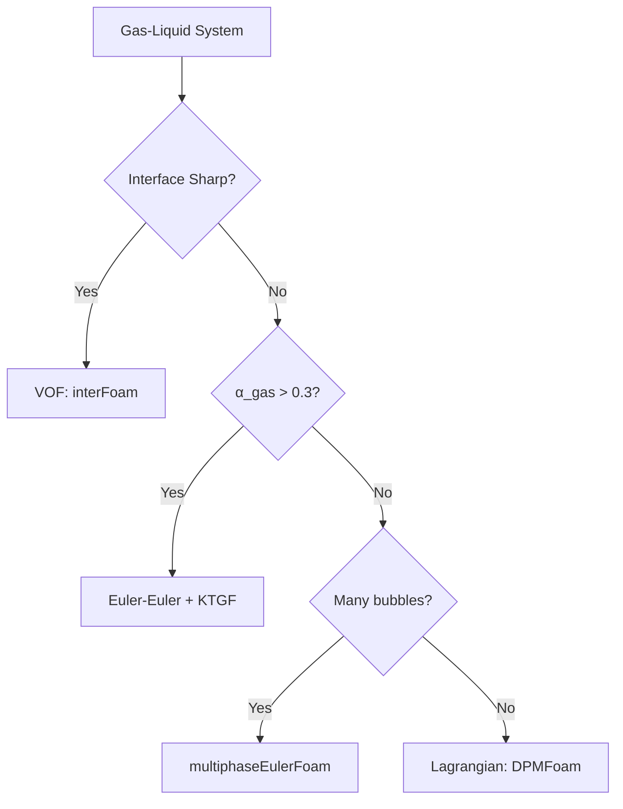

# Gas-Liquid Systems

---

## Learning Objectives

After completing this module, you will be able to:

- **Identify** the appropriate flow regime classification for gas-liquid systems using dimensionless numbers
- **Select** suitable drag, lift, and virtual mass models based on bubble deformation and contamination levels
- **Configure** OpenFOAM phaseProperties for bubbly flows with appropriate interphase force models
- **Diagnose** and resolve common convergence issues specific to gas-liquid simulations
- **Apply** function objects to measure key gas-liquid metrics like gas holdup and bubble velocity

---

## Why This Matters

Gas-liquid systems are ubiquitous in process industries—bubble columns, airlift reactors, flotation cells, and boiling heat transfer all rely on accurate prediction of phase distribution and interphase momentum transfer. The **critical challenge** is that gas bubbles deform significantly based on flow conditions (Eötvös number), and this deformation directly affects drag, lift, and mass transfer. Choosing the wrong interphase force model can lead to errors of **200% or more** in predicted gas holdup, which translates to reactor sizing errors of millions of dollars in industrial applications. Understanding how bubble shape, contamination, and flow regime interact is essential for reliable CFD predictions.

---

## Prerequisites

- Familiarity with multiphase flow fundamentals (MODULE_04_MULTIPHASE_FUNDAMENTALS/CONTENT/01_FUNDAMENTAL_CONCEPTS)
- Understanding of Euler-Euler framework basics
- Knowledge of dimensionless numbers in fluid mechanics

---

## Overview

This section focuses on **system-specific considerations for gas-liquid flows**, assuming you have already reviewed the general decision framework in `01_Decision_Framework.md`. Here we address:

- How to identify flow regimes using gas and liquid superficial velocities
- Selecting drag models based on bubble deformation (Eötvös number) and contamination
- Why virtual mass is **non-negotiable** for gas-liquid systems
- Troubleshooting issues specific to bubbly flow simulations



---

## 1. Flow Regime Identification for Gas-Liquid Systems

### 1.1 Regime Characteristics

| Regime | Visual Characteristics | Solver Choice | Key Considerations |
|--------|------------------------|---------------|-------------------|
| **Separated** | Sharp free surface, stratified | `interFoam` | Interface resolution critical |
| **Bubbly** | Discrete bubbles, coalescence rare | `multiphaseEulerFoam` | Drag model selection crucial |
| **Slug** | Large Taylor bubbles, liquid slugs | `interFoam` | Transient, requires interface tracking |
| **Churn** | Chaotic, irregular bubble breakup | `multiphaseEulerFoam` | Turbulent dispersion important |
| **Annular** | Gas core, liquid film on walls | `interFoam` | Film thickness prediction critical |

### 1.2 Flow Map Based on Superficial Velocities

Use gas and liquid superficial velocities ($j_g$, $j_l$) to predict flow regime:

| $j_g$ (m/s) | $j_l$ (m/s) | Expected Regime | Solver Recommendation |
|-------------|-------------|-----------------|----------------------|
| < 0.5 | > 0.5 | Bubbly | `multiphaseEulerFoam` |
| 0.5-5 | 0.1-1 | Slug | `interFoam` (large bubbles) |
| 5-20 | < 0.5 | Churn-turbulent | `multiphaseEulerFoam` |
| > 20 | < 0.1 | Annular | `interFoam` |

**Practical Tip:** When regime is borderline (near transitions), run **sensitivity studies** with both solvers to assess solution robustness.

---

## 2. Dimensionless Numbers for Gas-Liquid Systems

### 2.1 Key Numbers

| Number | Formula | Physical Meaning | Critical Value |
|--------|---------|------------------|----------------|
| **Eötvös** | $Eo = \frac{g\Delta\rho d^2}{\sigma}$ | Buoyancy vs. surface tension | Eo ≈ 1: deformation begins |
| **Morton** | $Mo = \frac{g\mu_l^4\Delta\rho}{\rho_l^2\sigma^3}$ | System property (constant) | Determines shape regime |
| **Bubble Reynolds** | $Re_b = \frac{\rho_l u_t d}{\mu_l}$ | Inertia vs. viscosity | Affects boundary layer |

### 2.2 Bubble Shape Prediction

Use **Eötvös-Reynolds** combination to predict bubble deformation:

| Eo Range | Re Range | Expected Shape | Drag Model Impact |
|----------|----------|----------------|-------------------|
| < 1 | any | Spherical | SchillerNaumann adequate |
| 1-40 | < 100 | Ellipsoidal | IshiiZuber recommended |
| > 40 | > 100 | Cap/spherical cap, wobbling | Tomiyama or Grace |

**Why This Matters:** Deformed bubbles have **30-50% higher drag** than spherical ones at the same Reynolds number. Ignoring deformation leads to severe underprediction of gas holdup.

---

## 3. Interphase Force Selection for Gas-Liquid Flows

### 3.1 Drag Model Decision Logic

**Gas-Liquid Specific Considerations** (complementing general decision framework):

| Condition | Recommended Model | Rationale |
|-----------|-------------------|-----------|
| Eo < 1, Re < 800 | `SchillerNaumann` | Spherical bubbles, standard drag curve |
| Eo 1-40, clean system | `IshiiZuber` | Accounts for deformation |
| Contaminated system (surfactants present) | `Tomiyama` | Reduced surface mobility increases drag |
| High viscosity ratio ($\mu_g/\mu_l > 100$) | `Grace` | Wide range of shape regimes |

**Decision Tree:**

```
Calculate Eo = gΔρd²/σ
    ↓
Eo < 1?
    ├─ Yes → SchillerNaumann (spherical regime)
    └─ No → Check contamination
              ├─ Clean → IshiiZuber
              └─ Contaminated → Tomiyama
```

### 3.2 Lift Model Selection

Lift is particularly important for **bubble plume asymmetry** and wall-peaking phenomena:

| Condition | Model | When to Use |
|-----------|-------|-------------|
| Clean, spherical bubbles (Eo < 1) | `LegendreMagnaudet` | High-purity systems, distilled water |
| Contaminated, deformed bubbles (Eo > 1) | `Tomiyama` | Industrial systems with surfactants |
| Small bubbles, high shear | `Moraga` | Dense bubbly flows near walls |

**Critical Note:** Tomiyama lift model can predict **sign change**—bubbles may migrate toward OR away from walls depending on size. This is essential for predicting wall-peaking vs. core-peaking in bubble columns.

### 3.3 Virtual Mass (Non-Negotiable for Gas-Liquid)

$$\mathbf{F}_{VM} = C_{VM} \rho_l \alpha_g \left(\frac{D\mathbf{u}_l}{Dt} - \frac{D\mathbf{u}_g}{Dt}\right)$$

**Why Always Include:**
- Gas density is typically **3 orders of magnitude** lower than liquid ($\rho_g/\rho_l \approx 0.001$)
- When bubbles accelerate, they must displace surrounding liquid
- Excluding virtual mass leads to **unphysical acceleration** and divergence

**Recommended Values:**
- Spherical bubbles: $C_{VM} = 0.5$ (theoretical)
- Deformed bubbles: $C_{VM} = 0.3-0.5$ (calibrate to experiment)

### 3.4 Turbulent Dispersion

| Model | When to Use | Tuning Parameter |
|-------|-------------|------------------|
| `Burns` | General purpose, bubbly flows | $C_{td} \approx 1.0$ |
| `Lopez de Bertodano` | High gas fraction (>0.15) | $C_{td} \approx 0.1-0.5$ |

**Rule of Thumb:** Start with $C_{td} = 1.0$, reduce if bubble spreading is **overpredicted** (excessively diffuse plume).

---

## 4. OpenFOAM Implementation

### 4.1 phaseProperties Configuration

```cpp
/*--------------------------------*- C++ -*----------------------------------*\
| =========                 |                                                 |
| \\      /  F ield         | OpenFOAM: The Open Source CFD Toolbox           |
|  \\    /   O peration     | Version:  v2312                                 |
|   \\  /    A nd           | Website:  www.openfoam.com                      |
|    \\/     M anipulation  |                                                 |
\*---------------------------------------------------------------------------*/
FoamFile
{
    version     2.0;
    format      ascii;
    class       dictionary;
    object      phaseProperties;
}
// * * * * * * * * * * * * * * * * * * * * * * * * * * * * * * * * * * * * * //

phases (air water);

// Dispersed phase (bubbles)
air
{
    diameterModel   constant;
    d               0.003;          // 3 mm bubbles
    rho             rho [1 -3 0 0 0] 1.2;      // kg/m³
}

// Continuous phase
water
{
    rho             rho [1 -3 0 0 0] 1000;     // kg/m³
    mu              mu [1 -1 -1 0 0] 0.001;   // Pa·s
    sigma           sigma [1 0 -2 0 0] 0.072; // N/m (air-water)
}

// Drag model - select based on Eo and contamination
drag
{
    (air in water)
    {
        type    Tomiyama;              // For contaminated/deformed bubbles
        residualRe      0.01;
        
        // Alternative options:
        // type    SchillerNaumann;     // Eo < 1, spherical
        // type    IshiiZuber;          // Eo 1-40, clean
    }
}

// Virtual mass - ALWAYS include for gas-liquid
virtualMass
{
    (air in water)
    {
        type    constantCoefficient;
        Cvm     0.5;                   // Spherical bubbles
    }
}

// Lift - affects lateral distribution
lift
{
    (air in water)
    {
        type    Tomiyama;              // Can predict sign change
    }
}

// Turbulent dispersion - spreads bubbles
turbulentDispersion
{
    (air in water)
    {
        type    Burns;
        Ctd     1.0;                   // Reduce if over-spreading
    }
}

// Optional: Surface tension (for VOF)
sigma
{
    (air and water)
    {
        type    constant;
        sigma   0.072;
    }
}

// ************************************************************************* //
```

### 4.2 Solver Settings (fvSolution)

```cpp
PIMPLE
{
    // Outer correctors: crucial for phase coupling
    nOuterCorrectors    3;              // Increase if coupling is slow
    nCorrectors         2;              // Pressure equation
    nAlphaSubCycles     2;              // Stability for alpha transport
    
    // Momentum prediction reduces non-orthogonality errors
    momentumPredictor  yes;
}

relaxationFactors
{
    fields
    {
        p           0.3;               // Pressure: aggressive for convergence
        "alpha.*"   0.7;               // Volume fraction: conservative
    }
    equations
    {
        U           0.7;               // Velocity
        k           0.7;               // Turbulence kinetic energy
        epsilon     0.7;               // Dissipation rate
    }
}

// Optional: residual control for steady-state
residualControl
{
    p               1e-5;
    U               1e-5;
    "(alpha|k|epsilon)" 1e-4;
}
```

### 4.3 Numerical Schemes (fvSchemes)

```cpp
ddtSchemes
{
    default         Euler;             // Use backward for transient accuracy
}

gradSchemes
{
    default         Gauss linear;
}

divSchemes
{
    default         Gauss upwind;      // Stability
    
    // Higher-order for momentum (if mesh is sufficient)
    div(phi,U)      Gauss linearUpwindV grad(U);
    
    // Compressive scheme for VOF only
    // div(phi,alpha)  Gauss vanLeer;
}

laplacianSchemes
{
    default         Gauss linear corrected;
}
```

---

## 5. Practical Application: Bubble Column

### 5.1 Case Specification

| Parameter | Value | Typical Range |
|-----------|-------|---------------|
| Column height | 1.5 m | 1-10 m (industrial) |
| Column diameter | 0.15 m | 0.1-5 m |
| Gas superficial velocity ($j_g$) | 0.02 m/s | 0.01-0.4 m/s |
| Liquid superficial velocity ($j_l$) | 0 m/s (batch) | 0-0.1 m/s |
| Bubble diameter | 3 mm | 1-6 mm |
| Operating pressure | Atmospheric | 1-10 bar |
| Temperature | 20°C | Ambient |

### 5.2 Boundary Conditions

| Boundary | Air (α) | Air (U) | Water (U) | p_rgh |
|----------|---------|---------|-----------|-------|
| Inlet (bottom) | `fixedValue 0.3` | `fixedValue (0 0 j_g/α_in)` | `pressureInletOutletVelocity` | `fixedFluxPressure` |
| Outlet (top) | `inletOutlet` | `pressureInletOutletVelocity` | `zeroGradient` | `fixedValue 0` |
| Walls | `zeroGradient` | `noSlip` | `noSlip` | `fixedFluxPressure` |

### 5.3 Key Metrics and Function Objects

```cpp
functions
{
    // Time-averaged gas holdup (most important metric)
    gasHoldup
    {
        type            volFieldValue;
        operation       volAverage;
        fields          (alpha.air);
        writeControl    timeStep;
        writeInterval   10;
        writeFormat     csv;
    }
    
    // Time-averaged bubble velocity
    bubbleVelocity
    {
        type            fieldFieldValue;
        operation       volAverage;
        fields          (U.air);
        writeControl    timeStep;
        writeInterval   10;
    }
    
    // Radial profile at mid-height
    radialProfile
    {
        type            sets;
        setFormat       csv;
        interpolationScheme cellPoint;
        
        sets
        (
            midHeight
            {
                type        uniform;
                axis        y;           // Horizontal direction
                start       (0 0 0.75);  // (x y z) at half height
                end         (0 0.15 0.75);
                nPoints     50;
            }
        );
        
        fields          (alpha.air U.air U.water p_rgh);
        writeControl    timeStep;
        writeInterval   100;
    }
    
    // Monitor convergence
    residuals
    {
        type            residuals;
        fields          (p_rgh U.air U.water alpha.air);
        writeControl    timeStep;
        writeInterval   1;
    }
}
```

### 5.4 Validation Targets

| Metric | Experimental Method | Typical Error Acceptance |
|--------|---------------------|--------------------------|
| Gas holdup | Differential pressure or bed expansion | ±10% |
| Bubble velocity | Photographic/PTV | ±15% |
| Plume width | Visual/PIV | ±20% |

---

## 6. Common Issues and Troubleshooting

### 6.1 Convergence Problems

| Symptom | Root Cause | Diagnostic Steps | Solution |
|---------|-----------|------------------|----------|
| **Bubbles disappear** (α → 0) | Over-relaxation, time step too large | Check α field—monotonic decrease to zero | • Reduce α relaxation to 0.3-0.5<br>• Decrease Courant number < 0.5<br>• Add `nAlphaSubCycles 2-3` |
| **Oscillatory pressure** | p-U decoupling, strong phase coupling | Examine p residuals—sawtooth pattern | • Ensure Rhie-Chow interpolation (default)<br>• Increase `nOuterCorrectors` to 3-5<br>• Under-relax pressure to 0.2-0.3 |
| **Diverging velocities** (U → ∞) | Missing virtual mass, unstable drag | Check if virtual mass is defined | • Add virtual mass force (essential!)<br>• Switch from implicit to semi-implicit drag<br>• Reduce time step |
| **Unphysical phase distribution** | Wrong sign for lift force | Bubbles all accumulating at walls or center | • Check lift model sign—try Tomiyama which predicts sign change<br>• Verify bubble diameter (Eo calculation)<br>• Consider wall lubrication force |

### 6.2 Physical Realism Issues

| Symptom | Likely Cause | Verification | Action |
|---------|--------------|--------------|--------|
| **Gas holdup underpredicted** (by >30%) | Drag too weak (spherical model for deformed bubbles) | Calculate Eo—if Eo > 1, bubbles deformed | Switch to IshiiZuber or Tomiyama drag |
| **Bubbles too spherical** | Surface tension too high or wrong breakup model | Visualize isosurfaces of α = 0.5 | • Verify σ value (0.072 N/m for air-water)<br>• Add population balance if breakup/coalescence significant |
| **No lateral spreading** | Missing turbulent dispersion | Bubble plume remains pencil-thin | Add Burns turbulent dispersion model with $C_{td} = 1.0$ |
| **Wall-peaking unphysical** | Excessive lift force magnitude | Plot radial α profile near wall | Reduce lift coefficient or switch to `LegendreMagnaudet` |

### 6.3 Solver-Specific Issues

#### multiphaseEulerFoam

**Issue:** `maximum number of iterations exceeded` for alpha equation

**Solutions:**
1. Add `nAlphaSubCycles 2` in `fvSolution`
2. Use MULES correction (default) with increased `alphaApplyPrevCorr yes`
3. Check for negative α values—if present, reduce Courant number

**Issue:** Segregation error in parallel runs

**Solutions:**
1. Increase `nOuterCorrectors` to ensure consistent p-U coupling across domains
2. Use `gamg` solver with proper coarse correction

#### interFoam (for slug/annular regimes)

**Issue:** Interface "streaking" or artificial breakup

**Solutions:**
1. Use compressive scheme: `div(phi,alpha)  Gauss vanLeerV01`
2. Add `nAlphaSubCycles 2`
3. Refine mesh near interface

**Issue:** Spurious currents at interface

**Solutions:**
1. Use `Gauss linear corrected` for laplacianSchemes
2. Ensure balanced surface tension force formulation
3. Reduce time step to keep Co < 0.3

### 6.4 Mesh Quality Checklist

| Check | Target | Why It Matters for Gas-Liquid |
|-------|--------|-------------------------------|
| Non-orthogonality | < 70° | Affects p-U coupling in bubbly flows |
| Aspect ratio | < 20 (ideally < 5) | High AR causes artificial bubble elongation |
| Skewness | < 0.5 | Can cause local α blow-up |
| Near-wall resolution | y+ ≈ 30-100 for Euler-Euler | Affects wall-peaking predictions |

---

## 7. Key Takeaways

1. **Flow regime identification** using superficial velocities ($j_g$, $j_l$) is the first step—bubbly flows require different treatment than slug or annular flows
2. **Bubble deformation** (quantified by Eötvös number) is the **most critical factor** in drag model selection—spherical drag models underpredict drag by 30-50% for deformed bubbles
3. **Virtual mass is non-negotiable** for gas-liquid systems—density ratio of 1:1000 makes this force essential for stability and physical realism
4. **Contamination matters**: Industrial systems with surfactants require Tomiyama drag; clean lab systems may use IshiiZuber
5. **Lift force sign prediction** is unique to gas-liquid—Tomiyama model captures migration toward or away from walls depending on bubble size
6. **Troubleshooting workflow**: Check virtual mass first, then drag model (Eo-based), then relaxation factors, then mesh quality
7. **Validation targets**: Gas holdup (±10%), bubble velocity (±15%), plume width (±20%) are the three key validation metrics for bubble columns

---

## 8. Concept Check

<details>
<summary><b>1. Calculate Eötvös number for a 5 mm air bubble in water (σ = 0.072 N/m). Is deformation significant?</b></summary>

$$Eo = \frac{g\Delta\rho d^2}{\sigma} = \frac{9.81 \times (1000-1.2) \times (0.005)^2}{0.072}$$

$$Eo \approx \frac{9.81 \times 998.8 \times 2.5 \times 10^{-5}}{0.072} \approx 3.39$$

**Conclusion:** Eo > 1 → **bubble deforms**, use IshiiZuber or Tomiyama drag (NOT SchillerNaumann)
</details>

<details>
<summary><b>2. Why is virtual mass force "non-negotiable" for gas-liquid, but optional for liquid-liquid?</b></summary>

For gas-liquid: $\rho_g/\rho_l \approx 0.001$ (three orders of magnitude difference)

When a bubble accelerates, it must displace a volume of liquid that has **1000× more inertia** than the bubble itself. Ignoring this leads to:

- Unrealistic acceleration (bubbles move way too fast)
- Numerical instability (divergence)
- Unphysical velocity spikes

For liquid-liquid: $\rho_1/\rho_2 \approx 0.5-2$ (similar densities), so virtual mass is less critical
</details>

<details>
<summary><b>3. Your simulation shows all bubbles migrating to walls (wall-peaking). Is this physical? How do you fix it?</b></summary>

**Maybe physical, maybe not:**

- **Physical for:** Small bubbles (d < 2 mm) in clean systems (LegendreMagnaudet lift predicts migration toward walls)
- **Unphysical for:** Large deformed bubbles (should stay in core)

**Fixes:**
1. Check bubble diameter—if too large, lift sign may be wrong
2. Switch to Tomiyama lift (predicts sign change based on Eo)
3. Verify Eo calculation—may need to adjust diameter or properties
4. Check if wall lubrication force is needed (not covered here)
</details>

<details>
<summary><b>4. Your Euler-Euler simulation diverges within 10 iterations. What are the first 3 things to check?</b></summary>

1. **Virtual mass defined?** If missing, add it immediately (stability issue)
2. **Relaxation factors?** Reduce p to 0.2, α to 0.3-0.5 (aggressive damping)
3. **Time step?** Reduce so Courant number < 0.5 (transient stability)

If still unstable after these three checks:
- Increase `nOuterCorrectors` to 5 (better coupling)
- Check drag model—maybe Reynolds number is outside model validity range
- Verify mesh quality (non-orthogonality < 70°)
</details>

---

## Related Documents

- **General Decision Framework:** [01_Decision_Framework.md](01_Decision_Framework.md)
- **Liquid-Liquid Systems:** [03_Liquid_Liquid_Systems.md](03_Liquid_Liquid_Systems.md)
- **Gas-Solid Systems:** [04_Gas_Solid_Systems.md](04_Gas_Solid_Systems.md)
- **Drag Models:** [../../CONTENT/04_INTERPHASE_FORCES/01_DRAG/00_Overview.md](../../CONTENT/04_INTERPHASE_FORCES/01_DRAG/00_Overview.md)
- **Lift Models:** [../../CONTENT/04_INTERPHASE_FORCES/02_LIFT/00_Overview.md](../../CONTENT/04_INTERPHASE_FORCES/02_LIFT/00_Overview.md)
- **Virtual Mass:** [../../CONTENT/04_INTERPHASE_FORCES/03_VIRTUAL_MASS/00_Overview.md](../../CONTENT/04_INTERPHASE_FORCES/03_VIRTUAL_MASS/00_Overview.md)