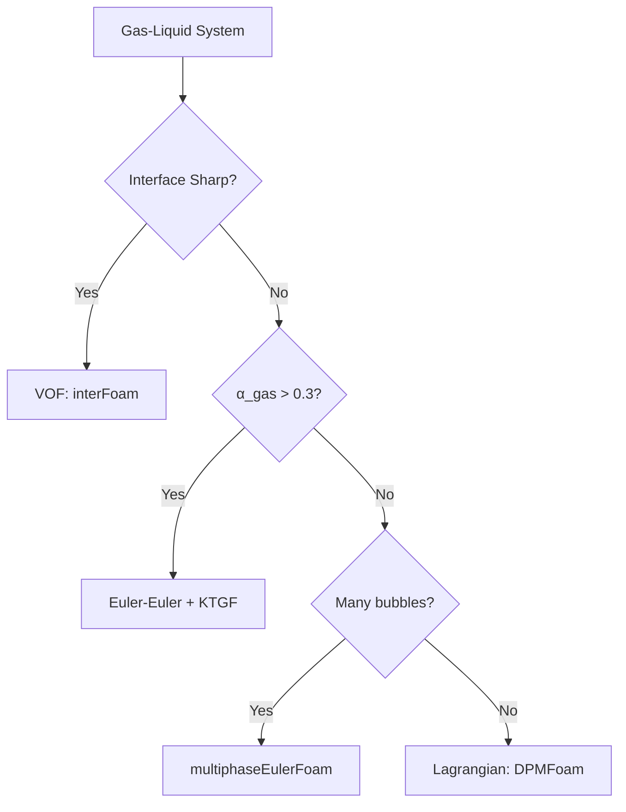

# Gas-Liquid Systems

การเลือกโมเดลสำหรับระบบ Gas-Liquid

---

## Overview



---

## 1. Flow Regime Classification

| Regime | Characteristics | Solver |
|--------|-----------------|--------|
| **Separated** | Sharp interface, free surface | `interFoam` |
| **Bubbly** | Discrete bubbles in liquid | `multiphaseEulerFoam` |
| **Slug** | Large elongated bubbles | `interFoam` |
| **Churn** | Chaotic, irregular | `multiphaseEulerFoam` |
| **Annular** | Gas core, liquid film | `interFoam` |

### Flow Map

| $j_g$ (m/s) | $j_l$ (m/s) | Regime |
|-------------|-------------|--------|
| < 0.5 | > 0.5 | Bubbly |
| 0.5-5 | 0.1-1 | Slug |
| 5-20 | < 0.5 | Churn |
| > 20 | < 0.1 | Annular |

---

## 2. Dimensionless Numbers

| Number | Formula | Purpose |
|--------|---------|---------|
| Eötvös | $Eo = \frac{g\Delta\rho d^2}{\sigma}$ | Bubble shape |
| Morton | $Mo = \frac{g\mu_l^4\Delta\rho}{\rho_l^2\sigma^3}$ | System property |
| Reynolds | $Re_b = \frac{\rho_l u_t d}{\mu_l}$ | Flow regime |

### Bubble Shape Diagram

| Eo | Re | Shape |
|----|-----|-------|
| < 1 | any | Spherical |
| 1-100 | < 100 | Ellipsoidal |
| > 100 | > 100 | Cap/Wobbling |

---

## 3. Interphase Force Selection

### Drag Models

| Model | Use Case |
|-------|----------|
| `SchillerNaumann` | Spherical bubbles, Re < 1000 |
| `IshiiZuber` | Deformed bubbles, Eo > 1 |
| `Tomiyama` | Contaminated systems |
| `Grace` | High viscosity ratio |

### Decision Logic

```
IF Eo < 1:
    → SchillerNaumann (spherical)
ELSE IF system is clean:
    → IshiiZuber
ELSE:
    → Tomiyama (contaminated)
```

### Lift Models

| Condition | Model |
|-----------|-------|
| Clean bubbles | `LegendreMagnaudet` |
| Contaminated | `Tomiyama` |
| Small bubbles | `Moraga` |

### Virtual Mass

$$\mathbf{F}_{VM} = C_{VM} \rho_l \alpha_g \left(\frac{D\mathbf{u}_l}{Dt} - \frac{D\mathbf{u}_g}{Dt}\right)$$

- **Always include** for gas-liquid (ρ_g << ρ_l)
- $C_{VM} = 0.5$ สำหรับ spherical bubbles

---

## 4. OpenFOAM Configuration

### phaseProperties

```cpp
phases (air water);

air
{
    diameterModel   constant;
    d               0.003;
}

drag
{
    (air in water)
    {
        type    Tomiyama;
        residualRe 0.01;
    }
}

virtualMass
{
    (air in water)
    {
        type    constantCoefficient;
        Cvm     0.5;
    }
}

lift
{
    (air in water)
    {
        type    Tomiyama;
    }
}

turbulentDispersion
{
    (air in water)
    {
        type    Burns;
        Ctd     1.0;
    }
}
```

### fvSolution

```cpp
PIMPLE
{
    nOuterCorrectors    3;
    nCorrectors         2;
    nAlphaSubCycles     2;
}

relaxationFactors
{
    fields { p 0.3; "alpha.*" 0.7; }
    equations { U 0.7; }
}
```

---

## 5. Bubble Column Example

### Setup

| Parameter | Value |
|-----------|-------|
| Column height | 1.5 m |
| Diameter | 0.15 m |
| Gas superficial velocity | 0.02 m/s |
| Bubble diameter | 3 mm |

### Key Metrics

| Quantity | How to measure |
|----------|----------------|
| Gas holdup | `volAverage(alpha.air)` |
| Bubble velocity | `fieldAverage(U.air)` |

### Function Objects

```cpp
functions
{
    gasHoldup
    {
        type            volFieldValue;
        operation       volAverage;
        fields          (alpha.air);
        writeControl    timeStep;
        writeInterval   10;
    }
}
```

---

## 6. Common Issues

| Problem | Cause | Solution |
|---------|-------|----------|
| Bubbles disappear | α → 0 | Reduce relaxation |
| Checkerboard | p-U decoupling | Use Rhie-Chow |
| Slow convergence | Strong coupling | Increase nOuterCorrectors |
| Unrealistic shape | Wrong drag | Check Eo, use appropriate model |

---

## Quick Reference

| Question | Answer |
|----------|--------|
| Sharp interface? | → `interFoam` (VOF) |
| Many small bubbles? | → `multiphaseEulerFoam` |
| Deformed bubbles? | → `IshiiZuber` or `Tomiyama` drag |
| Light bubbles? | → Always include Virtual Mass |

---

## Concept Check

<details>
<summary><b>1. ทำไม gas-liquid ต้องใช้ virtual mass?</b></summary>

เพราะ **gas มี density ต่ำมาก** — เมื่อ bubble accelerate ต้องเคลื่อนย้าย liquid รอบๆ ซึ่งเพิ่ม effective inertia
</details>

<details>
<summary><b>2. VOF กับ Euler-Euler ต่างกันอย่างไร?</b></summary>

- **VOF**: Track **interface position** → 1 bubble ใช้หลาย cells
- **Euler-Euler**: Track **volume fraction** → หลาย bubbles ต่อ cell
</details>

<details>
<summary><b>3. Tomiyama drag ใช้เมื่อไหร่?</b></summary>

ใช้สำหรับ **contaminated systems** (มี surfactants) ที่ลด surface mobility → เพิ่ม drag
</details>

---

## Related Documents

- **ภาพรวม:** [00_Overview.md](00_Overview.md)
- **Decision Framework:** [01_Decision_Framework.md](01_Decision_Framework.md)
- **Liquid-Liquid:** [03_Liquid_Liquid_Systems.md](03_Liquid_Liquid_Systems.md)