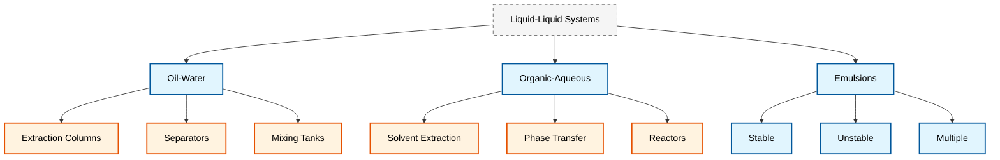

# ระบบของเหลว-ของเหลว (Liquid-Liquid Systems)

## 1. บทนำ (Introduction)

> [!INFO] **ความสำคัญของระบบของเหลว-ของเหลว**
> ระบบของเหลว-ของเหลวมีบทบาทสำคัญในกระบวนการทางอุตสาหกรรม เช่น การสกัดน้ำมัน (Liquid-Liquid Extraction), การทำอิมัลชัน (Emulsification), และการแยกสารผสม

ระบบของเหลว-ของเหลวมีความท้าทายเฉพาะที่แตกต่างจากระบบก๊าซ-ของเหลว:

- **อัตราส่วนความหนาแน่นใกล้เคียงกัน** ($\rho_d/\rho_c \approx 1$) ทำให้แรงลอยตัวมีค่าน้อย
- **อัตราส่วนความหนืดแตกต่างกันอย่างมีนัยสำคัญ** ($\lambda = \mu_d/\mu_c$) ส่งผลต่อการไหลภายในหยด
- **ความตึงผิวต่ำ** เมื่อเทียบกับระบบก๊าซ-ของเหลว ทำให้เกิดการเสียรูปได้ง่าย



---

## 2. การจำแนกหยดของเหลว (Droplet Classification)

### 2.1 หยดขนาดเล็ก ($Eo < 0.5$)

หยดขนาดเล็กมีลักษณะเป็นทรงกลมแข็ง (Rigid sphere) เนื่องจากแรงตึงผิวมีอิทธิพลสูง

**ลักษณะเฉพาะ:**
- ทรงกลม
- Reynolds number ต่ำถึงปานกลาง ($Re_p < 1000$)
- ควบคุมโดยแรงตึงผิวเป็นหลัก
- การไหลภายในน้อย

**Eötvös Number:**
$$Eo = \frac{\Delta \rho \, g \, d^2}{\sigma}$$

**ตัวแปรในสมการ:**
- $\Delta \rho$: ความแตกต่างของความหนาแน่นระหว่างเฟสกระจายและเฟสต่อเนื่อง
- $g$: ความเร่งเนื่องจากความโน้มถ่วง
- $d$: เส้นผ่านศูนย์กลางของหยด
- $\sigma$: ค่าแรงตึงผิวระหว่างอินเตอร์เฟซ

> [!TIP] **โมเดลที่แนะนำ**
> - **Drag:** Schiller-Naumann
> - **Lift:** Legendre-Magnaudet (พิจารณาอัตราส่วนความหนืด $\lambda$)
> - **Heat Transfer:** Ranz-Marshall

#### สมการควบคุมการเคลื่อนที่

**แรงลากต้าน:**
$$\mathbf{f}_D = \frac{1}{8} C_D \rho_c \pi d^2 |\mathbf{u}_d - \mathbf{u}_c| (\mathbf{u}_d - \mathbf{u}_c)$$

**สัมประสิทธิ์การลากต้าน** $C_D$ สำหรับหยดทรงกลมทำตามสหสัมพันธ์ Schiller-Naumann:
$$C_D = \begin{cases}
\frac{24}{Re_p}(1 + 0.15Re_p^{0.687}) & \text{for } Re_p < 1000 \\
0.44 & \text{for } Re_p \geq 1000
\end{cases}$$

#### OpenFOAM Code Implementation

```cpp
// Small droplets configuration
// Dispersed phase properties (e.g., oil droplets in water)
phases
{
    dispersed
    {
        // Phase type and equation of state
        type            incompressible;
        equationOfState rhoConst;
        thermodynamics  hConst;
        transport       const;

        // Droplet diameter - constant 1 mm for small spherical droplets
        // This size ensures Eo < 0.5 for typical liquid-liquid systems
        diameter        constant 0.001; // 1 mm
    }

    // Continuous phase properties (e.g., water)
    continuous
    {
        type            incompressible;
        equationOfState rhoConst;
        thermodynamics  hConst;
        transport       const;
    }
}

// Interphase interaction models configuration
phaseInteraction
{
    // Schiller-Naumann drag model - optimal for spherical droplets
    // at low to moderate Reynolds numbers
    dragModel       SchillerNaumann;
    
    // Legendre-Magnaudet lift model - accounts for viscosity ratio
    // Critical for liquid-liquid systems with differing viscosities
    liftModel       LegendreMagnaudet;
    
    // Constant virtual mass model - necessary due to similar phase densities
    virtualMassModel    constant;
    
    // Ranz-Marshall correlation for heat transfer between phases
    heatTransferModel   RanzMarshall;

    // Schiller-Naumann model coefficients
    SchillerNaumannCoeffs
    {
        // Transition Reynolds number between correlations
        switch1 1000;
        
        // Stokes flow coefficient (24/Re)
        Cd1     24;
        
        // Newton's law coefficient for high Re
        Cd2     0.44;
    }

    // Legendre-Magnaudet model coefficients
    LegendreMagnaudetCoeffs
    {
        // Viscosity ratio (lambda = mu_dispersed/mu_continuous)
        // Example: oil/water system viscosity ratio ~ 0.8
        lambda      0.8; // อัตราส่วนความหนืด น้ำมัน/น้ำ
    }

    // Virtual mass coefficient for accelerated motion
    constantVirtualMassCoeffs
    {
        // Theoretical value for spheres in potential flow
        Cvm         0.5;
    }
}
```

> **📂 Source:** `.applications/solvers/multiphase/multiphaseEulerFoam/phaseSystems/PhaseSystems/MomentumTransferPhaseSystem/MomentumTransferPhaseSystem.C`

> **💡 Explanation (คำอธิบาย):**
> การตั้งค่านี้ใช้สำหรับจำลองระบบของเหลว-ของเหลวที่มีหยดขนาดเล็ก (< 1 mm) ที่ยังคงรูปทรงกลมได้ดี โมเดล Schiller-Naumann เหมาะสมกับหยดทรงกลมที่มีค่า Reynolds number ต่ำถึงปานกลาง ในขณะที่โมเดล Legendre-Magnaudet จะพิจารณาอัตราส่วนความหนืดระหว่างเฟสซึ่งมีความสำคัญในระบบของเหลว-ของเหลว
>
> **Key Concepts (หลักการสำคัญ):**
> - **Schiller-Naumann Drag Model:** ให้ค่าสัมประสิทธิ์ drag ที่แม่นยำสำหรับหยดทรงกลมในช่วง Reynolds number ต่ำถึงปานกลาง โดยอิงจากการแก้สมการ Stokes และ Newton
> - **Legendre-Magnaudet Lift Model:** คำนึงถึงอัตราส่วนความหนืด (λ = μd/μc) ซึ่งส่งผลต่อการไหลภายในหยดและแรงยกที่เกิดขึ้น
> - **Virtual Mass Effect:** จำเป็นต้องรวมถึงเนื่องจากอัตราส่วนความหนาแน่นของเฟสใกล้เคียงกันในระบบของเหลว-ของเหลว

**เหตุผลที่เลือกใช้แบบจำลอง:**

1. **แบบจำลอง Drag Schiller-Naumann**
   - เหมาะสมที่สุดสำหรับหยดทรงกลมที่ค่า Reynolds number ต่ำถึงปานกลาง
   - ให้การทำนายค่าสัมประสิทธิ์ drag ที่แม่นยำ

2. **แบบจำลอง Lift Legendre-Magnaudet**
   - คำนึงถึงอัตราส่วนความหนืดระหว่างเฟส
   - สำคัญสำหรับระบบของเหลว-ของเหลวที่มีความหนืดต่างกัน

3. **แบบจำลอง Virtual Mass**
   - จำเป็นเนื่องจากอัตราส่วนความหนาแน่นใกล้เคียงกัน
   - ส่งผลต่อความเสถียรของการคำนวณ

---

### 2.2 หยดที่ผิดรูป ($Eo > 0.5$)

หยดขนาดใหญ่เริ่มเสียรูปเป็นทรงรีหรือเกิดการสั่นของรูปร่าง

**ลักษณะเฉพาะ:**
- ความผิดรูปที่สำคัญจากรูปทรงกลม
- รูปร่างทรงรีหรือรูปแบบที่ซับซ้อนมากขึ้น
- Reynolds number ปานกลางถึงสูง
- ผลกระทบอินเตอร์เฟซที่สำคัญ:
  - การสั่นพรำของรูปร่าง (Shape oscillations)
  - พื้นที่อินเตอร์เฟซที่เพิ่มขึ้น

**พารามิเตอร์การผิดรูป:**
$$D = \frac{L - W}{L + W}$$

**ตัวแปรในสมการ:**
- $L$: แกนหลักของหยดที่ผิดรูป
- $W$: แกนรองของหยดที่ผิดรูป

> [!WARNING] **คำเตือน**
> หยดที่ผิดรูปต้องการโมเดลที่ซับซ้อนขึ้น:
> - **Drag:** Grace Model (ออกแบบมาสำหรับหยดของเหลวโดยเฉพาะ)
> - **Turbulence:** Simonin Model (จัดการปฏิสัมพันธ์ระหว่างความปั่นป่วนและหยด)
> - **Population Balance:** จำเป็นสำหรับการทำนายการกระจายขนาดหยด

#### สหสัมพันธ์การลากต้านของ Grace

$$C_D = \frac{24}{Re_p}\left[1 + 0.15(1 + 0.283\lambda^{0.61})Re_p^{0.687}\right]$$

โดยที่ $\lambda = \mu_d/\mu_c$ คืออัตราส่วนความหนืด

#### แรงยก Legendre-Magnaudet

ในระบบของเหลว-ของเหลว สัมประสิทธิ์แรงยกขึ้นอยู่กับความหนืดภายในหยด:
$$C_L^{\text{inviscid}} = \frac{6}{\pi^2} \frac{(2 + \lambda)^2 + \lambda}{(1 + \lambda)^3} \tag{2.1}$$

#### OpenFOAM Code Implementation

```cpp
// Deformed droplets configuration
//适用于会发生变形的较大液滴 (Eo > 0.5)
phaseInteraction
{
    // Grace drag model - specifically designed for deformed liquid droplets
    // Accounts for shape deformation and form drag effects
    dragModel       Grace;
    
    // Legendre-Magnaudet lift model with viscosity ratio consideration
    liftModel       LegendreMagnaudet;
    
    // Virtual mass model for density ratios near unity
    virtualMassModel    constant;
    
    // Simonin turbulent dispersion model for deformed droplets
    // Accounts for turbulence-induced droplet dispersion
    turbulentDispersionModel    Simonin;

    // Grace model coefficients for deformed droplets
    GraceCoeffs
    {
        // High Reynolds number drag coefficient (Newton's regime)
        C1          0.44;
        
        // Stokes flow coefficient (24/Re for spherical droplets)
        C2          24.0;
        
        // Correction factor for intermediate Reynolds numbers
        // Accounts for deformation effects on drag
        C3          0.15;
        
        // Viscosity ratio (mu_dispersed/mu_continuous)
        lambda      0.8; // อัตราส่วนความหนืด
    }

    // Legendre-Magnaudet lift model coefficients
    LegendreMagnaudetCoeffs
    {
        // Viscosity ratio affecting lift coefficient
        lambda      0.8;
        // สัมประสิทธิ์แรงยกที่คำนึงถึงความหนืด
    }

    // Simonin turbulent dispersion model coefficients
    SimoninCoeffs
    {
        // Turbulent dispersion coefficient
        Ctd         1.0;
        
        // Turbulent diffusivity multiplier
        D           1.0;
        // การกระจายความปั่นป่วน
    }
}

// Interfacial tension model
// Critical for deformed droplets - affects deformation behavior
surfaceTensionModel   constant;
constantSurfaceTensionCoeffs
{
    // Surface tension for oil-water systems (N/m)
    // Lower values promote droplet deformation
    sigma    constant 0.032; // N/m สำหรับระบบน้ำมัน-น้ำ
}
```

> **📂 Source:** `.applications/solvers/multiphase/multiphaseEulerFoam/phaseSystems/PhaseSystems/MomentumTransferPhaseSystem/MomentumTransferPhaseSystem.C`

> **💡 Explanation (คำอธิบาย):**
> การตั้งค่านี้ใช้สำหรับหยดขนาดใหญ่ที่มีการเสียรูป (Eo > 0.5) โมเดล Grace ถูกพัฒนาขึ้นโดยเฉพาะสำหรับหยดของเหลวที่ผิดรูป โดยคำนึงถึงผลของ form drag ที่เกิดจากการเปลี่ยนแปลงรูปร่าง โมเดล Simonin ให้การจัดการกับผลของความปั่นป่วนต่อการกระจายตัวของหยด
>
> **Key Concepts (หลักการสำคัญ):**
> - **Grace Drag Model:** พิจารณารูปร่างของหยดเป็นฟังก์ชันของ Eötvös number (Eo) และ Reynolds number (Re) ซึ่งส่งผลต่อค่าสัมประสิทธิ์ drag โดยรวมถึงผลของอัตราส่วนความหนืด (λ)
> - **Shape Deformation:** ความตึงผิวต่ำในระบบของเหลว-ของเหลวทำให้เกิดการเสียรูปง่าย ซึ่งส่งผลต่อพื้นที่อินเตอร์เฟซและการถ่ายเทโมเมนตัม
> - **Turbulent Dispersion:** โมเดล Simonin จัดการกับปฏิสัมพันธ์ระหว่างความปั่นป่วนและการเคลื่อนที่ของหยดที่ผิดรูป

**เหตุผลที่เลือกใช้แบบจำลอง:**

1. **แบบจำลอง Drag Grace**
   - พัฒนาโดยเฉพาะสำหรับหยดที่ผิดรูป
   - คำนึงถึง form drag เพิ่มเติมเนื่องจากการเปลี่ยนแปลงรูปร่าง
   - พิจารณารูปร่างของหยดเป็นฟังก์ชันของ Eötvös และ Reynolds numbers
   - ให้การทำนาย drag ที่แม่นยำมากขึ้นสำหรับอินเตอร์เฟซที่ไม่ใช่ทรงกลม

2. **แรงตึงผิวที่ขึ้นอยู่กับอุณหภูมิ**
   - มีความสำคัญอย่างยิ่งสำหรับหยดที่ผิดรูป
   - พื้นที่อินเตอร์เฟซที่เพิ่มขึ้นทำให้ระบบมีความไวต่อการเปลี่ยนแปลงของอุณหภูมิมากขึ้น
   - ความสัมพันธ์: $\sigma(T) = \sigma_0 \left[1 - \gamma_T (T - T_0)\right]$
   - $\gamma_T$ คือสัมประสิทธิ์อุณหภูมิของแรงตึงผิว

3. **แบบจำลองการกระจายความปั่นป่วนแบบ Simonin**
   - ให้การจัดการขั้นสูงของปฏิสัมพันธ์ความปั่นป่วน-เฟสกระจาย
   - รวมถึงความไม่แน่นอนของความปั่นป่วนและผลกระทบของความเข้มข้นแบบเลือกสรร
   - มีความสำคัญอย่างยิ่งสำหรับหยดที่ใหญ่ขึ้นและผิดรูปที่โต้ตอบกับกระแสความปั่นป่วนได้ดีขึ้น

---

## 3. แบบจำลองที่แนะนำ (Recommended Models)

### 3.1 แรงยก Legendre-Magnaudet

ในระบบของเหลว-ของเหลว สัมประสิทธิ์แรงยกขึ้นอยู่กับความหนืดภายในหยด:
$$C_L^{\text{inviscid}} = \frac{6}{\pi^2} \frac{(2 + \lambda)^2 + \lambda}{(1 + \lambda)^3} \tag{3.1}$$

**ความสำคัญของอัตราส่วนความหนืด:**
- $\lambda = \mu_d/\mu_c$: อัตราส่วนความหนืด
- ค่า $\lambda$ สูง → การไหลภายในน้อย → หยดมีพฤติกรรมเหมือนของแข็ง
- ค่า $\lambda$ ต่ำ → การไหลภายในมาก → หยดมีความยืดหยุ่น

### 3.2 การรวมตัวและการแตกตัว (Population Balance Models)

หากความเข้มข้นหยดสูง ($\alpha_d > 0.1$) ต้องใช้ **Population Balance Models (PBM)**:

#### สมการสมดุลประชากร

$$\frac{\partial n(v)}{\partial t} + \nabla \cdot [\mathbf{u}_d n(v)] + \frac{\partial [G(v) n(v)]}{\partial v} = B_{breakup} - D_{breakup} + B_{coalescence} - D_{coalescence}$$

**ตัวแปรในสมการ:**
- $n(v,t)$: ความหนาแน่นจำนวนหยดขนาด $v$ ที่เวลา $t$
- $B_c, B_b$: อัตราการเกิดจากการรวมตัวและการแตกตัว
- $D_c, D_b$: อัตราการตายจากการรวมตัวและการแตกตัว

#### โมเดลการแตกตัว (Breakup Models)

**Weber Number Model:**
$$We = \frac{\rho_c u_{rel}^2 d}{\sigma} \tag{3.2}$$

การแตกตัวมักเกิดขึ้นเมื่อ $We > 12$ สำหรับระบบของเหลว-ของเหลว

**โมเดล Luo และ Svendsen:**
$$B_{breakup} = \int_v^{\infty} \beta(v,v') \Omega_{breakup}(v') n(v') \, dv'$$

กับความถี่การแตกตัว:
$$\Omega_{breakup} = 0.923(1 - \alpha_d) \frac{\varepsilon^{1/3}}{d^{2/3}} \exp\left(-\frac{U_{crit}^2}{\varepsilon^{2/3} d^{2/3}}\right)$$

#### โมเดลการรวมตัว (Coalescence Models)

**Film Drainage Model:**
- จับกลไกทางฟิสิกส์ที่หยดเข้าใกล้กัน
- เกิดการระบายของเหลวฟิล์มระหว่างอินเตอร์เฟซจนกว่าจะเกิดการแตกสลาย
- มีประสิทธิภาพด้านการคำนวณและมีความหมายทางฟิสิกส์สำหรับหยดทรงกลมขนาดเล็ก

**โมเดล Coulaloglou และ Tavlarides:**
$$\Omega_{coalescence} = C_{co} \frac{\pi}{4} (d_i + d_j)^2 \mathbf{u}_{t,ij} \exp\left(-\frac{t_{ij}}{t_{c,ij}}\right)$$

#### OpenFOAM Code Implementation

```cpp
// Population Balance Model configuration
//用于高浓度液滴系统 (alpha_d > 0.1)
populationBalance
{
    // Size group method - discretizes the droplet size distribution
    populationBalanceModel    sizeGroup;

    // Define size groups representing droplet diameter ranges
    // Each group has representative diameter (d) and initial fraction (x)
    sizeGroups
    {
        // Small droplets (0.5 mm) - 20% of total volume
        SG1 { d: 0.0005; x: 0.2; } // 0.5 mm
        
        // Medium-small droplets (1.0 mm) - 30% of total volume
        SG2 { d: 0.0010; x: 0.3; } // 1.0 mm
        
        // Medium-large droplets (2.0 mm) - 30% of total volume
        SG3 { d: 0.0020; x: 0.3; } // 2.0 mm
        
        // Large droplets (4.0 mm) - 20% of total volume
        SG4 { d: 0.0040; x: 0.2; } // 4.0 mm
    }

    // Coalescence models - droplets merging together
    coalescenceModels
    {
        // Luo coalescence model - film drainage mechanism
        // Based on collision frequency and film drainage time
        LuoCoalescence
        {
            // Coalescence rate coefficient
            Cco         0.1;
            
            // Critical film thickness parameter
            Co          0.0;
        }
    }

    // Breakup models - large droplets splitting into smaller ones
    breakupModels
    {
        // Luo breakup model - turbulence-induced breakup
        // Accounts for eddy-droplet collisions
        LuoBreakup
        {
            // Breakup frequency coefficient
            C1          0.923;
            
            // Size distribution exponent
            C2          1.0;
            
            // Critical Weber number parameter
            C3          2.45;
        }
    }
}

// Mixture k-epsilon turbulence model for multiphase flows
// Accounts for turbulence in both phases
turbulence
{
    // Mixture k-epsilon model - standard approach for dispersed flows
    type            mixtureKEpsilon;

    mixtureKEpsilonCoeffs
    {
        // Turbulent viscosity coefficient (standard value)
        Cmu         0.09;
        
        // Production term coefficient
        C1          1.44;
        
        // Dissipation term coefficient
        C2          1.92;
        
        // Dissipation Prandtl number
        sigmaEps    1.3;
        
        // Turbulent kinetic energy Prandtl number
        sigmaK      1.0;
        
        // Enable mixture viscosity calculation
        muMixture   on;
        
        // Enable phase-specific turbulence
        phaseTurbulence  on;
    }
}
```

> **📂 Source:** `.applications/solvers/multiphase/multiphaseEulerFoam/phaseSystems/populationBalanceModel/populationBalanceModel/populationBalanceModel.C`

> **💡 Explanation (คำอธิบาย):**
> Population Balance Model (PBM) จำเป็นสำหรับระบบที่มีความเข้มข้นของหยดสูง (> 10%) ซึ่งการรวมตัวและแตกตัวของหยดมีผลอย่างมากต่อการกระจายขนาด โมเดล Luo ให้การจำลองกลไกฟิสิกส์ของการแตกตัวและรวมตัวที่เกิดจากความปั่นป่วน โดยคำนึงถึงความถี่ของการชนและเวลาในการระบายฟิล์มระหว่างอินเตอร์เฟซ
>
> **Key Concepts (หลักการสำคัญ):**
> - **Size Group Method:** แบ่งการกระจายขนาดหยดออกเป็นกลุ่ม discrete แต่ละกลุ่มมีเส้นผ่านศูนย์กลางเฉลี่ยและเศษส่วนปริมาตร ซึ่งลดความซับซ้อนในการแก้สมการ PBM
> - **Breakup Model:** โมเดล Luo คำนวณอัตราการแตกตัวจากพลังงานความปั่นป่วน (ε) และค่าวิกฤต Weber number ซึ่งแทนความสัมพันธ์ระหว่างแรงเฉือนและแรงตึงผิว
> - **Coalescence Model:** โมเดล Luo คำนวณอัตราการรวมตัวจากความถี่ของการชนระหว่างหยดและเวลาที่ต้องใช้ในการระบายฟิล์มของเหลวระหว่างอินเตอร์เฟซ

---

## 4. การนำไปใช้ใน OpenFOAM

### 4.1 การตั้งค่าระบบสกัดน้ำมัน-น้ำ

ตัวอย่างการตั้งค่าใน `phaseProperties` สำหรับระบบสกัดน้ำมัน-น้ำ:

```cpp
// Oil-Water System Configuration
// Configuration for liquid-liquid extraction systems
phases
{
    // Dispersed phase: oil droplets in water
    oil
    {
        // Incompressible liquid phase
        type            incompressible;
        
        // Constant density equation of state
        equationOfState rhoConst;

        // Oil density (typical for mineral oil) in kg/m³
        rho             rho [1 -3 0 0 0] 850; // kg/m³

        // Constant viscosity transport model
        transport       const;
        
        // Oil dynamic viscosity in Pa·s (higher than water)
        mu              mu [0 2 -1 0 0] 0.05; // Pa·s
    }

    // Continuous phase: water
    water
    {
        // Incompressible liquid phase
        type            incompressible;
        
        // Constant density equation of state
        equationOfState rhoConst;

        // Water density in kg/m³ (reference value)
        rho             rho [1 -3 0 0 0] 1000; // kg/m³

        // Constant viscosity transport model
        transport       const;
        
        // Water dynamic viscosity in Pa·s (reference value at 20°C)
        mu              mu [0 2 -1 0 0] 0.001; // Pa·s
    }
}

// Interphase interaction models for oil-water system
phaseInteraction
{
    // Grace drag model - optimal for deformed oil droplets
    // Accounts for viscosity ratio effects (λ = 50 for oil/water)
    dragModel       Grace;
    
    // Legendre-Magnaudet lift model with viscosity ratio
    // Critical due to large viscosity difference between phases
    liftModel       LegendreMagnaudet;
    
    // Virtual mass model - essential for similar densities
    virtualMassModel    constant;
    
    // Burns turbulent dispersion model
    // Accounts for turbulence-induced droplet dispersion
    turbulentDispersionModel    Burns;

    // Grace model coefficients for oil-water systems
    GraceCoeffs
    {
        // High Reynolds number drag coefficient
        C1          0.44;
        
        // Stokes flow coefficient
        C2          24.0;
        
        // Intermediate Reynolds number correction
        C3          0.15;
    }

    // Legendre-Magnaudet lift model coefficients
    LegendreMagnaudetCoeffs
    {
        // Viscosity ratio (μ_oil/μ_water = 0.05/0.001 = 50)
        // High value indicates oil droplets behave more like solid spheres
        lambda      50; // อัตราส่วนความหนืด น้ำมัน/น้ำ
    }

    // Virtual mass coefficient for accelerated motion
    constantVirtualMassCoeffs
    {
        // Theoretical value for potential flow around spheres
        Cvm         0.5;
    }

    // Burns turbulent dispersion model coefficients
    BurnsCoeffs
    {
        // Turbulent dispersion coefficient
        Ctd         1.0;
        
        // Turbulent diffusivity multiplier
        D           1.0;
    }
}

// Surface tension model for oil-water interface
// Critical for droplet deformation and breakup behavior
surfaceTensionModel   constant;
constantSurfaceTensionCoeffs
{
    // Oil-water interfacial tension (typical value for mineral oil/water)
    // Lower values promote droplet deformation and breakup
    sigma         0.032; // N/m
}
```

> **📂 Source:** `.applications/solvers/multiphase/multiphaseEulerFoam/phaseSystems/PhaseSystems/MomentumTransferPhaseSystem/MomentumTransferPhaseSystem.C`

> **💡 Explanation (คำอธิบาย):**
> การตั้งค่านี้เป็นตัวอย่างสำหรับระบบน้ำมัน-น้ำที่ใช้ในกระบวนการสกัดน้ำมัน โดยมีอัตราส่วนความหนืดสูง (λ = 50) ซึ่งทำให้หยดน้ำมันมีพฤติกรรมคล้ายของแข็ง โมเดล Grace เหมาะสมสำหรับหยดที่ผิดรูป ในขณะที่โมเดล Legendre-Magnaudet คำนึงถึงผลของอัตราส่วนความหนืดที่สูงต่อแรงยก
>
> **Key Concepts (หลักการสำคัญ):**
> - **Density Ratio:** อัตราส่วนความหนาแน่นของน้ำมันต่อน้ำ ≈ 0.85 ซึ่งใกล้เคียงกัน ทำให้แรงลอยตัวมีค่าต่ำและต้องระวังเรื่องความเสถียรของ pressure-velocity coupling
> - **Viscosity Ratio:** อัตราส่วนความหนืดของน้ำมันต่อน้ำ = 50 ซึ่งสูงมาก ทำให้เกิดการไหลภายในน้อยและหยดมีพฤติกรรมเหมือนของแข็ง
> - **Interfacial Tension:** ค่าความตึงผิวระหว่างน้ำมัน-น้ำ ≈ 0.032 N/m ซึ่งต่ำกว่าระบบก๊าซ-น้ำมาก ทำให้เกิดการเสียรูปได้ง่าย

### 4.2 การเลือก Solver

```cpp
// Solver selection for transient liquid-liquid flow
// Transient simulation of two-phase Euler-Euler flow
simulationType  twoPhaseEulerFoam;

// Linear solver settings
solver
{
    // Pressure solver - Geometric-Algebraic Multigrid
    // Efficient for large-scale problems
    p               GAMG;
    
    // Final pressure solver for tighter convergence
    pFinal          GAMG;
    
    // Velocity solver - smoothSolver for faster convergence
    U               smoothSolver;
    
    // Volume fraction solver
    alpha           smoothSolver;
}

// Under-relaxation factors for stability
relaxationFactors
{
    // Field under-relaxation factors
    fields
    {
        // Pressure under-relaxation (conservative for stability)
        p           0.3;
        
        // Velocity under-relaxation
        U           0.7;
        
        // Volume fraction under-relaxation
        alpha       0.7;
    }
    
    // Equation under-relaxation factors
    equations
    {
        // Pressure equation (no under-relaxation)
        p           1;
        
        // Velocity equation under-relaxation
        U           0.8;
        
        // Volume fraction equation under-relaxation
        alpha       0.8;
    }
}
```

> **📂 Source:** `.applications/solvers/multiphase/multiphaseEulerFoam/`

> **💡 Explanation (คำอธิบาย):**
> การเลือก solver และการตั้งค่า under-relaxation factors มีความสำคัญอย่างยิ่งสำหรับความเสถียรของการคำนวณในระบบของเหลว-ของเหลว เนื่องจากอัตราส่วนความหนาแน่นใกล้เคียงกัน ทำให้การเชื่อมโยงความดัน-ความเร็วมีความเสถียรกว่าระบบก๊าซ-ของเหลว แต่ยังคงต้องใช้ under-relaxation ที่เหมาะสมเพื่อป้องกันการ oscillate
>
> **Key Concepts (หลักการสำคัญ):**
> - **Pressure-Velocity Coupling:** ในระบบของเหลว-ของเหลว อัตราส่วนความหนาแน่นใกล้เคียงกัน (≈ 1:1) ทำให้ pressure-velocity coupling มีความเสถียรกว่าระบบก๊าซ-ของเหลว
> - **Under-Relaxation Factors:** ค่า under-relaxation ที่ต่ำสำหรับ pressure (0.3) ช่วยเพิ่มความเสถียร ในขณะที่ค่าที่สูงกว่าสำหรับ velocity และ alpha (0.7-0.8) ช่วยเพิ่มอัตราการลู่เข้า
> - **Solver Selection:** GAMG solver มีประสิทธิภาพสำหรับปัญหาขนาดใหญ่ ในขณะที่ smoothSolver เหมาะสำหรับ velocity และ volume fraction

### 4.3 ข้อควรพิจารณา

> [!TIP] **ข้อควรพิจารณาสำคัญสำหรือระบบของเหลว-ของเหลว**

1. **อัตราส่วนความหนาแน่นใกล้เคียงกัน** ($\approx 1:1$)
   - ส่งผลให้การเชื่อมโยงความดัน-ความเร็ว (Pressure-Velocity Coupling) มีความเสถียรกว่าระบบ Gas-Liquid
   - แต่ต้องระวังเรื่องการทำนายขนาดหยดที่แม่นยำผ่าน PBM

2. **อัตราส่วนความหนืดแตกต่างกัน**
   - ส่งผลต่อการไหลภายในหยด (Internal circulation)
   - ควรใช้โมเดลที่คำนึงถึงผลของความหนืด (Grace, Legendre-Magnaudet)

3. **ความตึงผิวต่ำ**
   - ทำให้เกิดการเสียรูปได้ง่าย
   - จำเป็นต้องใช้โมเดล drag ที่เหมาะสมกับหยดที่ผิดรูป

4. **Population Balance Modeling**
   - สำคัญอย่างยิ่งสำหรับการทำนายการกระจายขนาดหยด
   - ต้องการทรัพยากรการคำนาณสูง

---

## 5. กรณีศึกษา (Case Studies)

### 5.1 เครื่องสกัดแบบแพร่สาร (Extraction Columns)

**ลักษณะเฉพาะ:**
- การไหลแบบ countercurrent ระหว่างเฟส
- ความเข้มข้นหยดปานกลางถึงสูง
- การรวมตัวและแตกตัวสำคัญ

**แบบจำลองที่แนะนำ:**
- Drag: Grace Model
- Lift: Legendre-Magnaudet
- Population Balance: MOC (Method of Classes)
- Turbulence: k-ε Model

### 5.2 เครื่องผสมแบบหมุน (Mixing Tanks)

**ลักษณะเฉพาะ:**
- ความปั่นป่วนสูง
- การกระจายตัวของหยดไม่สม่ำเสมอ
- การแตกตัวเนื่องจาก shear สูง

**แบบจำลองที่แนะนำ:**
- Drag: Schiller-Naumann หรือ Grace
- Turbulent Dispersion: Simonin
- Population Balance: QMOM (Quadrature Method of Moments)
- Turbulence: Realizable k-ε

### 5.3 เครื่องแยกสาร (Separators)

**ลักษณะเฉพาะ:**
- การไหลที่ค่อยข้างสงบ
- การตกตะกอนโดยแรงโน้มถ่วง
- การรวมตัวของหยดเพื่อเพิ่มขนาด

**แบบจำลองที่แนะนำ:**
- Drag: Schiller-Naumann
- Lift: Legendre-Magnaudet
- Coalescence: Film Drainage Model
- Turbulence: Standard k-ε หรือ Laminar

---

## 6. สรุป (Summary)

| ประเด็น | คำอธิบาย |
|---------|-----------|
| **ความท้าทายหลัก** | อัตราส่วนความหนืดแตกต่างกัน ความตึงผิวต่ำ การเสียรูปของหยด |
| **โมเดล Drag** | Grace (หยดผิดรูป), Schiller-Naumann (หยดทรงกลม) |
| **โมเดล Lift** | Legendre-Magnaudet (คำนึงถึงอัตราส่วนความหนืด) |
| **Population Balance** | จำเป็นสำหรับความเข้มข้นหยดสูง |
| **การคำนาณ** | ต้องการทรัพยากรสูงเมื่อใช้ PBM |

---

## 7. อ้างอิงเพิ่มเติม

ดูข้อมูลเพิ่มเติมเกี่ยวกับ:
- [[01_Decision_Framework]] - กรอบการตัดสินใจเลือกแบบจำลอง
- [[02_Gas_Liquid_Systems]] - เปรียบเทียบกับระบบก๊าซ-ของเหลว
- [[06_Property-Based_Selection]] - การเลือกโมเดลตามคุณสมบัติ
- [[07_Computational_Considerations]] - ข้อควรพิจารณาด้านการคำนาณ