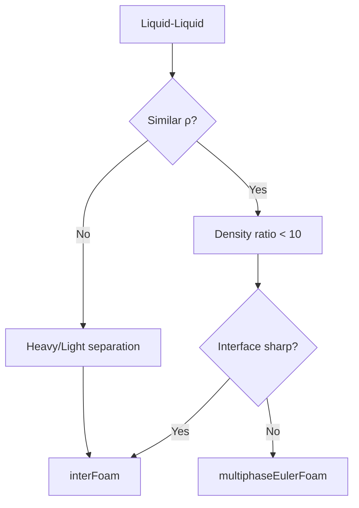

# Liquid-Liquid Systems

การเลือกโมเดลสำหรับระบบ Liquid-Liquid

---

## Overview



---

## 1. System Classification

| Type | Example | Characteristics |
|------|---------|-----------------|
| **Immiscible** | Oil-Water | Sharp interface |
| **Emulsion** | Mayonnaise | Dispersed droplets |
| **Stratified** | Separator tanks | Gravity separation |

### Key Difference from Gas-Liquid

| Property | Gas-Liquid | Liquid-Liquid |
|----------|------------|---------------|
| Density ratio | 100-1000 | 1-5 |
| Virtual mass | Always needed | Often negligible |
| Drag | High slip | Low slip |

---

## 2. Dimensionless Numbers

| Number | Formula | Meaning |
|--------|---------|---------|
| Capillary | $Ca = \frac{\mu U}{\sigma}$ | Viscous vs surface tension |
| Weber | $We = \frac{\rho U^2 d}{\sigma}$ | Inertia vs surface tension |
| Viscosity ratio | $\lambda = \frac{\mu_d}{\mu_c}$ | Droplet vs continuous |

### Droplet Breakup

| We | Behavior |
|----|----------|
| < 1 | Stable droplet |
| 1-10 | Oscillation |
| > 10 | Breakup |

---

## 3. Interphase Force Selection

### Drag Models

| Model | Use Case |
|-------|----------|
| `SchillerNaumann` | Low viscosity ratio |
| `TomiyamaKataokaZun` | Moderate deformation |
| `Hadamard` | Clean interface, low Re |

### Viscosity Ratio Effects

$$C_D = C_{D,rigid} \cdot f(\lambda)$$

| λ = μ_d/μ_c | Behavior |
|-------------|----------|
| λ << 1 | Mobile interface (bubble-like) |
| λ ≈ 1 | Moderate circulation |
| λ >> 1 | Rigid sphere (solid-like) |

### Coalescence & Breakup

```cpp
// constant/phaseProperties
populationBalance
{
    type    homogeneous;
    coalescenceModels
    {
        CoulaloglouTavlarides{}
    }
    breakupModels
    {
        LuoSvendsen{}
    }
}
```

---

## 4. OpenFOAM Configuration

### For Separation (VOF)

```cpp
// constant/transportProperties
phases (oil water);

oil
{
    transportModel  Newtonian;
    nu      [0 2 -1 0 0 0 0] 1e-5;
    rho     [1 -3 0 0 0 0 0] 850;
}

water
{
    transportModel  Newtonian;
    nu      [0 2 -1 0 0 0 0] 1e-6;
    rho     [1 -3 0 0 0 0 0] 1000;
}

sigma   [1 0 -2 0 0 0 0] 0.03;
```

### For Emulsions (Euler-Euler)

```cpp
// constant/phaseProperties
phases (oil water);

oil
{
    diameterModel   constant;
    d               0.0005;
}

drag
{
    (oil in water)
    {
        type    SchillerNaumann;
    }
}

// Virtual mass often negligible for similar densities
```

---

## 5. Application Examples

### Oil-Water Separator

| Parameter | Typical Value |
|-----------|---------------|
| Ρ_oil | 850 kg/m³ |
| ρ_water | 1000 kg/m³ |
| σ | 0.03 N/m |
| Solver | `interFoam` |

### Emulsion Mixing

| Parameter | Typical Value |
|-----------|---------------|
| Droplet size | 10-500 μm |
| Volume fraction | 0.1-0.5 |
| Solver | `multiphaseEulerFoam` |

---

## 6. Settling Velocity

### Stokes' Law

$$u_t = \frac{(\rho_d - \rho_c) g d^2}{18 \mu_c}$$

### Design Implication

| Δρ (kg/m³) | d (μm) | u_t (mm/s) |
|------------|--------|------------|
| 100 | 100 | 0.5 |
| 100 | 500 | 14 |
| 200 | 500 | 27 |

---

## 7. Numerical Considerations

### Interface Resolution

```cpp
// system/fvSchemes
divSchemes
{
    div(phi,alpha)      Gauss vanLeer;
    div(phirb,alpha)    Gauss interfaceCompression;
}
```

### Stability Settings

```cpp
// system/fvSolution
PIMPLE
{
    nOuterCorrectors    2;
    nCorrectors         2;
}

relaxationFactors
{
    fields { "alpha.*" 0.9; }
    equations { U 0.8; }
}
```

---

## Quick Reference

| System | Solver | Key Model |
|--------|--------|-----------|
| Oil-water separation | `interFoam` | VOF |
| Emulsion | `multiphaseEulerFoam` | Euler-Euler |
| Extraction column | `multiphaseEulerFoam` | + Population balance |

---

## Concept Check

<details>
<summary><b>1. ทำไม liquid-liquid ไม่ค่อยต้องใช้ virtual mass?</b></summary>

เพราะ **density ratio ใกล้เคียงกัน** — virtual mass สำคัญเมื่อ displaced fluid มี density สูงกว่า dispersed phase มาก (เช่น gas-liquid)
</details>

<details>
<summary><b>2. Viscosity ratio มีผลอย่างไรต่อ droplet behavior?</b></summary>

- **λ << 1**: Droplet ทำตัวเหมือน bubble (mobile interface)
- **λ >> 1**: Droplet ทำตัวเหมือน solid (rigid sphere)
</details>

<details>
<summary><b>3. ทำไม emulsion ใช้ Euler-Euler ไม่ใช่ VOF?</b></summary>

เพราะ emulsion มี **droplets จำนวนมาก** ที่ **เล็กกว่า mesh cell** — VOF ต้องการหลาย cells ต่อ 1 droplet จึงไม่ practical
</details>

---

## Related Documents

- **ภาพรวม:** [00_Overview.md](00_Overview.md)
- **Gas-Liquid:** [02_Gas_Liquid_Systems.md](02_Gas_Liquid_Systems.md)
- **Decision Framework:** [01_Decision_Framework.md](01_Decision_Framework.md)