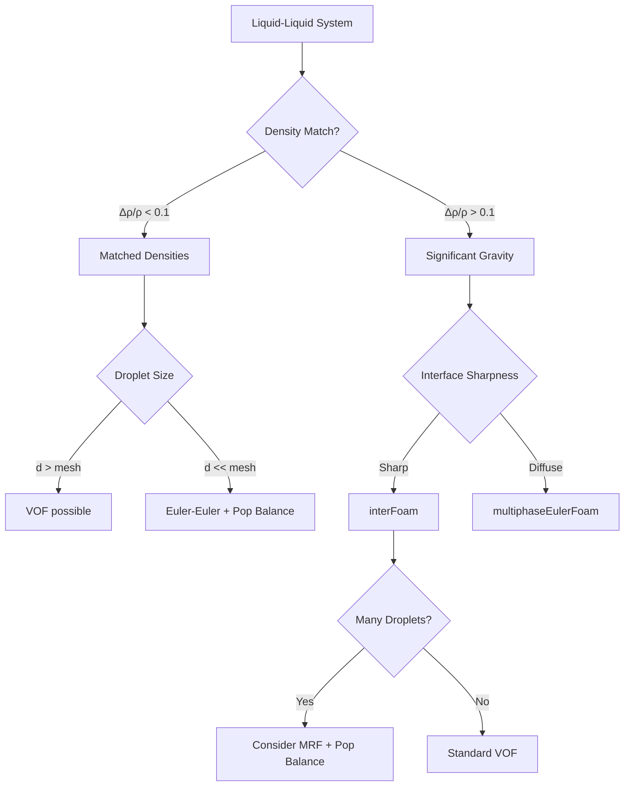
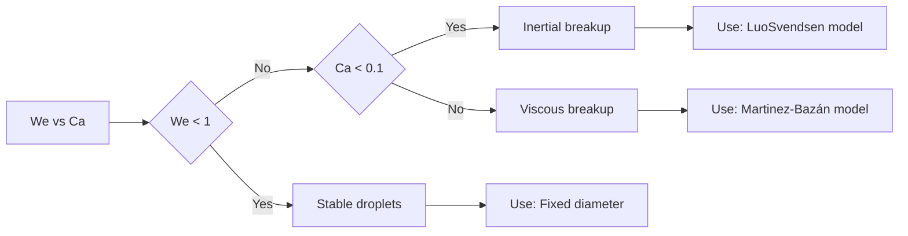
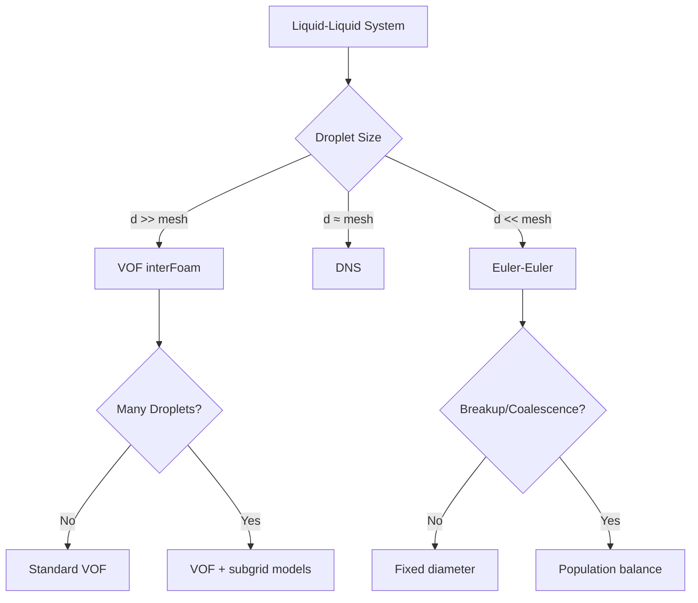

# Liquid-Liquid Systems

การเลือกโมเดลสำหรับระบบ Liquid-Liquid

---

## Learning Objectives

หลังจากอ่านบทนี้ คุณควรจะสามารถ:

1. **จำแนกประเภท** ระบบ liquid-iquid ได้ถูกต้อง (immiscible stratified emulsion)
2. **เลือก solver** ที่เหมาะสมระหว่าง interFoam และ multiphaseEulerFoam
3. **ประยุกต์ dimensionless numbers** (Ca We λ) เพื่อทำนาย droplet behavior
4. **ตั้งค่า drag model** ที่เหมาะสมกับ viscosity ratio
5. **กำหนดค่า population balance** สำหรับ coalescence breakup
6. **คำนวณ settling velocity** ด้วย Stokes' Law

---

## Why This Matters

ระบบ liquid-iquid พบได้บ่อยในอุตสาหกรรม:

- **Oil & Gas**: ถังแยกน้ำ-น้ำมัน ปิกอัปเครื่องสูบน้ำ
- **Food/Pharma**: Emulsion ผลิตภัณฑ์ เช่น มายองเนส ครีม
- **Chemical**: Liquid-liquid extraction columns

**ความท้าทายหลัก**:

1. **Density ratio ต่ำ** (1-5) → gravity force อ่อนกว่า gas-liquid มาก
2. **Viscosity ratio แตกต่างกัน** → ส่งผลต่อ drag และ circulation
3. **Interface behavior ซับซ้อน** → mobile หรือ rigid ขึ้นกับ λ

---

## Gas-Liquid vs Liquid-Liquid: Quick Comparison

| Aspect | Gas-Liquid | Liquid-Liquid | Practical Impact |
|--------|------------|---------------|------------------|
| **Density ratio** | 100-1000 | 1-5 | Gravity separation ช้ากว่าใน LL |
| **Virtual mass** | Always needed | Often negligible | ลดความซับซ้อนของสมการ |
| **Drag slip** | High (bubble ลอยเร็ว) | Low (droplet ลอยช้า) | Convergence ดีกว่าใน LL |
| **Surface tension** | Dominant | Moderate | Interface resolution สำคัญน้อยกว่า |
| **Typical applications** | Boiling cavitation | Separation emulsions | Solver choice แตกต่าง |
| **Droplet size** | mm-cm scale | µm-mm scale | LL ต้อง population balance บ่อยกว่า |

---

## Prerequisites

- พื้นฐาน VOF จาก [02_VOF_Method](../../02_VOF_METHOD/00_Overview.md)
- Euler-Euler framework จาก [03_Euler_Euler_Method](../../03_EULER_EULER_METHOD/00_Overview.md)
- Interphase forces fundamentals จาก [04_Interphase_Forces/01_DRAG](04_INTERPHASE_FORCES/01_DRAG/00_Overview.md)
- Dimensionless numbers จาก [01_Fundamental_Concepts](01_FUNDAMENTAL_CONCEPTS/00_Overview.md)

---

## 1. System Classification

### 1.1 Flow Regime Categories

| Type | Example | Characteristics | Solver |
|------|---------|-----------------|--------|
| **Immiscible Stratified** | Oil-water separator | Sharp interface gravity-driven | `interFoam` |
| **Immiscible Dispersed** | Emulsion mixing | Droplets dispersed breakup/coalescence | `multiphaseEulerFoam` |
| **Partially Miscible** | Extraction column | Mass transfer at interface | `multiphaseInterFoam` |
| **Highly Viscous** | Polymer blends | Non-Newtonian λ >> 1 | `multiphaseEulerFoam` |

### 1.2 Decision Flowchart



### 1.3 Key Difference from Gas-Liquid

**Physical Impact:**

```cpp
// Virtual mass coefficient comparison
C_VM_gas_liquid    = 0.5;  // Significant
C_VM_liquid_liquid = 0.05; // Often negligible (5-10x smaller)
```

---

## 2. Dimensionless Numbers for Liquid-Liquid

### 2.1 Primary Numbers

| Number | Formula | Physical Meaning | Typical Range |
|--------|---------|------------------|---------------|
| **Capillary** | $Ca = \frac{\mu_c U}{\sigma}$ | Viscous vs surface tension | 0.001-1 |
| **Weber** | $We = \frac{\rho_c U^2 d}{\sigma}$ | Inertia vs surface tension | 0.1-100 |
| **Viscosity Ratio** | $\lambda = \frac{\mu_d}{\mu_c}$ | Droplet vs continuous | 0.01-100 |
| **Reynolds** | $Re = \frac{\rho_c U d}{\mu_c}$ | Inertia vs viscous | 1-1000 |
| **Bond** | $Bo = \frac{(\rho_d-\rho_c) g d^2}{\sigma}$ | Gravity vs surface tension | 0.01-10 |

### 2.2 Droplet Breakup Criteria

| We | Behavior | Coalescence |
|----|----------|-------------|
| < 1 | Stable droplet | Dominant |
| 1-10 | Oscillation deformation | Moderate |
| > 10 | Breakup | Suppressed |

### 2.3 Regime Maps



### 2.4 Viscosity Ratio Effects

**Hadamard-Rybczyński Correction:**

$$C_D = \frac{24}{Re} \cdot \frac{2+3\lambda}{3+3\lambda}$$

| λ = μ_d/μ_c | Flow Regime | Drag Behavior |
|-------------|-------------|---------------|
| λ << 1 (0.01) | Clean bubble | Mobile interface ↓ drag |
| λ ≈ 1 (1) | Similar viscosities | Moderate circulation |
| λ >> 1 (100) | Dirty droplet | Rigid sphere ↑ drag |

---

## 3. Interphase Force Selection for Liquid-Liquid

### 3.1 Drag Models

| Model | λ Range | Re Range | When to Use |
|-------|---------|----------|-------------|
| `SchillerNaumann` | 0.1-10 | < 1000 | Standard emulsion |
| `HadamardRybczynski` | 0.01-1 | < 1 | Clean interface |
| `IshiiZuber` | Any | Any | Wide range |
| `TomiyamaKataokaZun` | 0.1-10 | Any | Deformable droplets |
| `Grace` | Any | Any | Viscosity-dominated |

**Why viscosity ratio matters:**

```cpp
// OpenFOAM implementation example
drag
{
    (oil in water)
    {
        type    SchillerNaumann;
        
        // Viscosity ratio correction
        viscosityRatio on;
        
        // Optional: Hadamard correction for λ << 1
        hadamardCorrection yes;
    }
}
```

### 3.2 Lift Force (Liquid-Liquid Specifics)

**Thomas Correction (for λ ≠ 1):**

$$C_L = C_{L,std} \cdot f(\lambda)$$

| λ | Lift Behavior |
|---|---------------|
| < 1 | Enhanced lift (bubble-like) |
| ≈ 1 | Standard correlations |
| > 1 | Reduced lift (solid-like) |

### 3.3 Virtual Mass

**When to include:**

```cpp
// Only for high acceleration flows
virtualMass
{
    (oil in water)
    {
        type    constantCoefficient;
        Cvm     0.05; // 10x smaller than gas-liquid
    }
}
```

### 3.4 Turbulent Dispersion

**Models:**

```cpp
turbulentDispersion
{
    type    LopezDeBertodano;
    Ctd     1.0; // Often higher than gas-liquid
}
```

### 3.5 Coalescence & Breakup (Liquid-Liquid Specific)

**Population Balance Configuration:**

```cpp
// constant/phaseProperties
populationBalance
{
    type    homogeneous;
    
    // Velocity groups (optional)
    velocityGroups
    {
        oil
        {
            sizeDistribution
            {
                type    logarithmicNormal;
                dmin    1e-6;
                dmax    1e-3;
                n       10;
            }
        }
    }
    
    // Coalescence models
    coalescenceModels
    {
        CoulaloglouTavlarides
        {
            // Collision frequency
            C1      0.008;
            
            // Critical film thickness
            hcrit   1e-6;
        }
    }
    
    // Breakup models
    breakupModels
    {
        LuoSvendsen
        {
            // Maximum stable diameter
            dMax    0.001;
            
            // Turbulent eddy properties
            beta    0.5;
        }
        
        // Alternative for viscous breakup
        MartinezBazan
        {
            We_critical 12.0;
        }
    }
    
    // Source terms
    drift
    {
        type    noDrift;
    }
    
    // Number density
    continuousPhase     water;
}
```

**Key Models for Liquid-Liquid:**

| Model | Best For | Physics |
|-------|----------|---------|
| `CoulaloglouTavlarides` | Turbulent emulsions | Collision-driven |
| `LuoSvendsen` | Low λ | Inertial breakup |
| `MartinezBazan` | High λ | Viscous breakup |

---

## 4. OpenFOAM Implementation

### 4.1 Separation (VOF Method)

**transportProperties:**

```cpp
// constant/transportProperties
phases (oil water);

oil
{
    transportModel  Newtonian;
    nu              [0 2 -1 0 0 0 0] 1e-5;
    rho             [1 -3 0 0 0 0 0] 850;
    // Optional: Non-Newtonian for high λ
    // transportModel  CrossPowerLaw;
}

water
{
    transportModel  Newtonian;
    nu              [0 2 -1 0 0 0 0] 1e-6;
    rho             [1 -3 0 0 0 0 0] 1000;
}

sigma           [1 0 -2 0 0 0 0] 0.03;

// Optional: Surfactant effects (advanced)
// surfaceForce    model surfactant;
```

**Key Settings:**

```cpp
// system/fvSchemes - Interface capturing
divSchemes
{
    div(phi,alpha)      Gauss vanLeer;          // High-resolution
    div(phirb,alpha)    Gauss interfaceCompression;  // Sharp interface
    
    // Alternative for lower λ
    // div(phi,alpha)      Gauss MUSCL;
    // div(phirb,alpha)    Gauss interfaceCompression 1.0;
}

// system/fvSolution - Stability
PIMPLE
{
    nAlphaCorr      2;
    nAlphaSubCycles 2;
    alphaReach      0.01;
    
    // For sharp interfaces (low Ca)
    cAlpha          1.0;
    
    // For diffuse interfaces (high Ca)
    // cAlpha          0.5;
}

relaxationFactors
{
    fields
    {
        "alpha.*"   0.9;    // Critical for density-matched flows
        p_rgh       0.7;
    }
    equations
    {
        U           0.8;
    }
}
```

### 4.2 Emulsions (Euler-Euler + Population Balance)

**phaseProperties:**

```cpp
// constant/phaseProperties
phases
(
    oil
    {
        diameterModel   constant;
        value           0.0005;  // 500 µm
        
        // Or use Sauter Mean Diameter
        // diameterModel   sauterMean;
        
        transportModel  Newtonian;
        nu              [0 2 -1 0 0 0 0] 5e-5;
        rho             [1 -3 0 0 0 0 0] 850;
    }
    water
    {
        transportModel  Newtonian;
        nu              [0 2 -1 0 0 0 0] 1e-6;
        rho             [1 -3 0 0 0 0 0] 1000;
    }
);

// Drag (λ-dependent)
drag
{
    (oil in water)
    {
        type    SchillerNaumann;
        
        // Enable viscosity ratio correction
        viscosityRatio on;
        
        // Optional: Hadamard correction for clean interfaces
        // hadamardCorrection yes;
        // lambdaLimit     0.1;
    }
}

// Lift (usually small for liquid-liquid)
lift
{
    (oil in water)
    {
        type    Moraga;
        
        // Reduced coefficient for λ ≈ 1
        Cl      0.05;  // vs 0.1 for gas-liquid
    }
}

// Virtual mass (often negligible)
// virtualMass
// {
//     (oil in water)
//     {
//         type    constantCoefficient;
//         Cvm     0.05;  // 10x smaller than gas-liquid
//     }
// }

// Turbulent dispersion (important for emulsions)
turbulentDispersion
{
    (oil in water)
    {
        type    LopezDeBertodano;
        Ctd     1.0;
    }
}

// Surface tension (optional for Euler-Euler)
surfaceTension
{
    type    constant;
    sigma   0.03;
    
    // Optional: Phase fraction curvature correction
    // curvatureCorrection on;
}

// Population balance
populationBalance
{
    type    homogeneous;
    
    sizeDistribution
    {
        type    logarithmicNormal;
        dmin    1e-6;   // 1 µm
        dmax    1e-3;   // 1 mm
        n       12;     // Size classes
    }
    
    coalescenceModels
    {
        CoulaloglouTavlarides
        {
            C1      0.008;
            C2      0.08;
            hcrit   1e-6;
        }
    }
    
    breakupModels
    {
        LuoSvendsen
        {
            dMax    0.001;
            beta    0.5;
        }
    }
    
    continuousPhase     water;
}
```

**Solver-Specific Settings:**

```cpp
// system/fvSolution
PIMPLE
{
    nOuterCorrectors    2;
    nCorrectors         3;      // Higher for stability
    
    // For population balance coupling
    nAlphaCorr          2;
    
    // Relaxation (critical for convergence)
    relaxFactors
    {
        fields { "alpha.*" 0.7; }
        equations { U 0.6; k 0.5; epsilon 0.5; }
    }
}

// Under-relaxation for population balance
populationBalanceCoeffs
{
    nAlphaSubCycles     2;
    alphaReach          0.01;
}
```

### 4.3 Liquid-Liquid Specific: Viscosity Ratio Implementation

**Custom drag correction:**

```cpp
// constant/phaseProperties
drag
{
    (oil in water)
    {
        type    IshiiZuber;
        
        // Enable viscosity ratio correction
        viscosityRatio on;
        
        // Hadamard-Rybczyński correction
        hadamardCorrection   yes;
        
        // Grace model for wide λ range
        graceCorrection      on;
        
        // Parameters
        lambdaMin            0.01;
        lambdaMax            100;
    }
}
```

### 4.4 Numerical Considerations

**Low Density Difference:**

```cpp
// system/fvSolution
PIMPLE
{
    // For Δρ/ρ < 0.1
    nCorrectors         4;      // More iterations
    
    // Tighter tolerance
    tolerances
    {
        p_rgh       1e-8;
        U           1e-6;
    }
}

// Use transonic option for compressibility effects
// (even for "incompressible" liquids at high Re)
transonic       yes;
```

**Interface Resolution:**

```cpp
// system/fvSchemes
divSchemes
{
    // For low Ca (sharp interfaces)
    div(phi,alpha)      Gauss vanLeerV;
    div(phirb,alpha)    Gauss interfaceCompression 1.0;
    
    // For high Ca (diffuse interfaces)
    // div(phi,alpha)      Gauss linear;
    // div(phirb,alpha)    Gauss interfaceCompression 0.5;
}

gradSchemes
{
    grad(alpha)  Gauss linear;  // For curvature calculation
}

laplacianSchemes
{
    laplacian(nuEff,U)  Gauss linear corrected;
}
```

---

## 5. Application Examples

### 5.1 Oil-Water Separator (Gravity-Driven)

**Configuration:**

| Parameter | Typical Value | Notes |
|-----------|---------------|-------|
| ρ_oil | 850 kg/m³ | Light phase |
| ρ_water | 1000 kg/m³ | Heavy phase |
| Δρ | 150 kg/m³ | Driving force |
| σ | 0.03 N/m | Moderate surface tension |
| μ_oil/μ_water | 5-50 | Viscosity ratio |
| Solver | `interFoam` | Sharp interface |
| Turbulence | Laminar or k-ωSST | Low Re |

**Setup:**

```cpp
// system/controlDict
application     interFoam;

startFrom       startTime;
startTime       0;

stopAt          endTime;
endTime         100;  // Seconds

deltaT          0.001;
adjustTimeStep  yes;

maxCo           0.5;     // Critical for stability
maxAlphaCo      0.5;

// For low Δρ
// maxCo           0.3;

writeControl    timeStep;
writeInterval   1;
```

**Performance Metrics:**

- **Separation efficiency**: > 95% in t = 50-100 s
- **Mesh resolution**: y+ < 1 near walls
- **Time step**: Δt limited by gravity wave speed

### 5.2 Emulsion Mixer (Droplet Breakup)

**Configuration:**

| Parameter | Typical Value | Notes |
|-----------|---------------|-------|
| Droplet size | 10-500 μm | Sub-grid |
| Volume fraction | 0.1-0.5 | Moderate loading |
| Agitator speed | 100-1000 RPM | High shear |
| Re_impeller | 10^4-10^6 | Turbulent |
| Solver | `multiphaseEulerFoam` | With population balance |
| Turbulence | k-ε | RANS |

**Setup:**

```cpp
// constant/phaseProperties
populationBalance
{
    type    homogeneous;
    
    // Size classes
    sizeDistribution
    {
        type    logarithmicNormal;
        dmin    1e-5;  // 10 μm
        dmax    5e-4;  // 500 μm
        n       15;    // High resolution
    }
    
    // Turbulent breakup
    breakupModels
    {
        LuoSvendsen
        {
            dMax    2e-4;
            
            // For high λ (viscous breakup)
            // use MartinezBazán
        }
    }
    
    // Coalescence
    coalescenceModels
    {
        CoulaloglouTavlarides
        {
            C1      0.008;
            C2      0.08;
        }
    }
}

// MRF for impeller (optional)
MRFProperties
{
    cellZone    impeller;
    active      yes;
    
    origin      (0 0 0);
    axis        (0 0 1);
    
    omega       100;  // rad/s
}
```

**Performance Metrics:**

- **Sauter Mean Diameter (SMD)**: 50-200 μm
- **Breakup rate**: 1-10 s^-1
- **Convergence**: Slower with population balance

### 5.3 Liquid-Liquid Extraction Column

**Configuration:**

| Parameter | Typical Value | Notes |
|-----------|---------------|-------|
| Continuous phase | Water | Aqueous |
| Dispersed phase | Organic solvent | Extractant |
| Flow regime | Counter-current | Industrial |
| Droplet size | 1-5 mm | Larger than emulsion |
| Mass transfer | Enabled | Species transport |
| Solver | `multiphaseInterFoam` | With species |

**Setup:**

```cpp
// constant/phaseProperties
phases
(
    water
    {
        transportModel  Newtonian;
        nu              [0 2 -1 0 0 0 0] 1e-6;
        rho             [1 -3 0 0 0 0 0] 1000;
    }
    organic
    {
        transportModel  Newtonian;
        nu              [0 2 -1 0 0 0 0] 2e-5;
        rho             [1 -3 0 0 0 0 0] 850;
    }
);

// Species transport
species
(
    solute
    {
        transportModel  constant;
        D               [0 2 -1 0 0 0 0] 1e-9;  // diffusivity
    }
);

// Mass transfer coefficient
massTransferModels
{
    (organic in water)
    {
        type    constant;
        K       0.001;  // m/s
    }
}
```

---

## 6. Settling Velocity Calculations

### 6.1 Stokes' Law (Low Re)

$$u_t = \frac{(\rho_d - \rho_c) g d^2}{18 \mu_c}$$

**For liquid-liquid:**

| Δρ (kg/m³) | d (μm) | μ_c (mPa·s) | u_t (mm/s) |
|------------|--------|-------------|------------|
| 100 | 100 | 1 | 0.5 |
| 100 | 500 | 1 | 14 |
| 200 | 500 | 1 | 27 |
| 100 | 100 | 10 | 0.05 |
| 100 | 500 | 10 | 1.4 |

**Key insight:** For low Δρ (100-200 kg/m³) and small droplets (< 100 μm) settling is **very slow** (hours to days)

### 6.2 Intermediate Re (Hadamard-Rybczynski)

$$C_D = \frac{24}{Re} \cdot \frac{2+3\lambda}{3+3\lambda}$$

**Correction factor vs λ:**

| λ | Correction Factor | u_t multiplier |
|---|-------------------|-----------------|
| 0.01 | 0.67 | 1.5x faster |
| 0.1 | 0.77 | 1.3x faster |
| 1 | 0.83 | 1.2x faster |
| 10 | 0.92 | 1.09x faster |
| 100 | 0.97 | 1.03x faster |

### 6.3 Design Implications

**Separator Sizing:**

```cpp
// Minimum residence time
t_min = H / u_t

// Where H = separator height
// For H = 2 m u_t = 0.5 mm/s
// t_min = 4000 s ≈ 1.1 hours

// Safety factor
t_design = 3 × t_min = 3.3 hours
```

**Emulsion stability:**

| u_t (mm/s) | Stability | Separation method |
|------------|-----------|-------------------|
| < 0.01 | Very stable | Centrifugation |
| 0.01-0.1 | Stable | Gravity + coalescer |
| 0.1-1 | Moderate | Gravity separation |
| > 1 | Unstable | Fast separation |

---

## 7. Common Issues and Troubleshooting

### 7.1 Convergence Problems (Euler-Euler)

| Symptom | Cause | Solution |
|---------|-------|----------|
| Oscillating α | Poor drag model | Use `IshiiZuber` for wide λ range |
| Negative α | Large Δρ step | Reduce Δt increase nCorrectors |
| Mass imbalance | Weak continuity | Tighten p_rgh tolerance to 1e-8 |
| Population balance divergence | Too many bins | Reduce n to 10-12 |

### 7.2 Interface Issues (VOF)

| Symptom | Cause | Solution |
|---------|-------|----------|
| Diffuse interface | Low cα or high Ca | Increase cα to 1.0 use `vanLeerV` |
| Spurious currents | High σ/low Δρ | Use `balanced` flux limiter |
| Unphysical droplets | Over-compression | Reduce cAlpha or use linear divScheme |

### 7.3 Physical Accuracy

| Problem | Check | Fix |
|---------|-------|-----|
| Wrong separation velocity | Verify Δρ ρ values | Use experimental data |
| Droplet size mismatch | Check breakup model parameters | Calibrate `dMax` `beta` |
| Poor coalescence prediction | Review film thickness | Adjust `hcrit` |

### 7.4 Population Balance Challenges

**Issue: Computational Cost**

```cpp
// Solution: Use velocity grouping (optional)
velocityGroups
{
    oil
    {
        // Instead of 15 size classes use 5
        sizeDistribution
        {
            type    uniform;
            n       5;  // Faster but less resolution
        }
    }
}
```

**Issue: Numerical Diffusion**

```cpp
// Solution: Use high-resolution schemes
divSchemes
{
    div(fvc::flux(alpha))  Gauss vanLeer;
}
```

---

## 8. Best Practices

### 8.1 Solver Selection



### 8.2 Model Selection Guidelines

| Scenario | Drag | Lift | VM | Pop Balance |
|----------|------|------|-----|-------------|
| Stratified | N/A | N/A | N/A | No |
| Dilute emulsion (λ ≈ 1) | `SchillerNaumann` | `Moraga` | No | Optional |
| Viscous emulsion (λ >> 1) | `Grace` | `Tomiyama` | No | Yes |
| Clean interface (λ << 1) | `HadamardRybczynski` | `Legendre` | Optional | Yes |
| High shear mixer | `IshiiZuber` | No | No | Yes |

### 8.3 Mesh Requirements

| Application | Resolution | y+ |
|-------------|------------|-----|
| Gravity separator | Δ = interface thickness / 10 | < 1 |
| Emulsion (Euler-Euler) | Δ ≈ droplet size | 30-100 |
| Population balance | Δ independent of d | Standard |

### 8.4 Boundary Conditions

**Inlet:**

```cpp
// VOF: Fixed α value
inlet
{
    type            fixedValue;
    value           uniform 0;  // or 1
}

// Euler-Euler: Fixed volume fraction + diameter
inlet
{
    type            fixedValue;
    value           uniform 0.3;
}

inletDiameter
{
    type            fixedValue;
    value           uniform 0.0005;
}
```

**Outlet:**

```cpp
// Use pressureOutlet for both phases
outlet
{
    type            pressureInletOutletVelocity;
    inletValue      uniform (0 0 0);
    value           uniform (0 0 0);
}

// For phase fraction
outlet_alpha
{
    type            zeroGradient;
}
```

---

## Key Takeaways

1. **Density ratio is key** — Liquid-liquid (1-5) vs gas-liquid (100-1000) → affects gravity separation virtual mass and solver choice

2. **Viscosity ratio matters** — λ determines:
   - Drag coefficient (mobile vs rigid interface)
   - Lift force magnitude
   - Breakup mechanism (inertial vs viscous)

3. **Solver selection:**
   - **VOF (interFoam)**: Sharp interface stratified flows
   - **Euler-Euler (multiphaseEulerFoam)**: Emulsions droplets << mesh
   - **Population balance**: Required when breakup/coalescence important

4. **Virtual mass often negligible** — For liquid-liquid Cvm ≈ 0.05 vs 0.5 for gas-liquid

5. **Dimensionless numbers:**
   - **Ca < 0.1**: Surface tension dominated (sharp interface)
   - **We > 10**: Droplet breakup
   - **λ << 1**: Mobile interface (bubble-like)
   - **λ >> 1**: Rigid interface (solid-like)

6. **Settling velocity scales with d²** — Small droplets (< 100 μm) settle very slowly → require centrifugation or coalescers

7. **Population balance essential for emulsions** — Droplet size distribution evolves via breakup/coalescence

8. **Numerical stability:**
   - Low Δρ → stricter tolerances
   - High λ → stronger under-relaxation
   - Interface sharpness → balanced vs compression

---

## Concept Check

<details>
<summary><b>1. ทำไม liquid-liquid ไม่ค่อยต้องใช้ virtual mass?</b></summary>

เพราะ **density ratio ใกล้เคียงกัน** (Δρ/ρ ≈ 0.1-0.5) — virtual mass สำคัญเมื่อ displaced fluid มี density สูงกว่า dispersed phase มากๆ เช่น gas-liquid (Δρ/ρ ≈ 1000)

ใน liquid-liquid Cvm ≈ 0.05 vs 0.5 สำหรับ gas-liquid
</details>

<details>
<summary><b>2. Viscosity ratio มีผลอย่างไรต่อ droplet behavior?</b></summary>

- **λ << 1** (μ_d << μ_c): Droplet ทำตัวเหมือน bubble (mobile interface) → drag ต่ำลง
- **λ ≈ 1**: Moderate circulation → drag อยู่กลางๆ
- **λ >> 1** (μ_d >> μ_c): Droplet ทำตัวเหมือน solid (rigid sphere) → drag สูงขึ้น

Hadamard-Rybczyński correction: $C_D = \frac{24}{Re} \cdot \frac{2+3\lambda}{3+3\lambda}$
</details>

<details>
<summary><b>3. เมื่อไหร่ควรใช้ VOF vs Euler-Euler สำหรับ liquid-liquid?</b></summary>

**ใช้ VOF (interFoam) เมื่อ:**
- Interface ชัดเจน (sharp interface)
- Droplet size >> mesh size
- Stratified flows (gravity separation)
- Low Ca (Ca < 0.1)

**ใช้ Euler-Euler (multiphaseEulerFoam) เมื่อ:**
- Emulsion มี droplets จำนวนมาก
- Droplet size << mesh size
- High Ca (Ca > 0.1)
- ต้องการ population balance (breakup/coalescence)
</details>

<details>
<summary><b>4. Capillary number บอกอะไร?</b></summary>

$$Ca = \frac{\mu_c U}{\sigma} = \frac{\text{Viscous forces}}{\text{Surface tension}}$$

- **Ca << 1** (< 0.01): Surface tension dominates → รักษารูปทรง droplet
- **Ca ≈ 1**: Balance → droplet สามารถ deform
- **Ca >> 1** (> 1): Viscous forces dominate → droplet แตก (breakup)

สำหรับ liquid-liquid Ca สูงกว่า gas-liquid เพราะ μ_c สูงกว่ามาก
</details>

<details>
<summary><b>5. ทำไม emulsion ใช้ Euler-Euler ไม่ใช่ VOF?</b></summary>

เพราะ emulsion มี **droplets จำนวนมาก** ที่ **เล็กกว่า mesh cell**:

- **Typical droplet**: 10-100 μm
- **Typical mesh**: 1-10 mm
- **Droplets per cell**: 10^3-10^6

VOF ต้องการ 10-20 cells ต่อ 1 droplet → ไม่ practical

Euler-Euler  treats droplets เป็น continuum field → แก้ปัญหานี้ได้
</details>

<details>
<summary><b>6. Weber number บอกอะไรเกี่ยวกับ droplet breakup?</b></summary>

$$We = \frac{\rho_c U^2 d}{\sigma} = \frac{\text{Inertial forces}}{\text{Surface tension}}$$

**Breakup criteria:**
- **We < 1**: Stable droplet → surface tension ชนะ
- **We = 1-10**: Droplet oscillate/deform → transitional
- **We > 10**: Droplet breakup → inertial forces ชนะ

ใน population balance LuoSvendsen model ใช้ We ในการคำนวณ breakup rate
</details>

---

## Related Documents

- **ภาพรวม:** [00_Overview.md](00_Overview.md)
- **Gas-Liquid:** [02_Gas_Liquid_Systems.md](02_Gas_Liquid_Systems.md)
- **Decision Framework:** [01_Decision_Framework.md](01_Decision_Framework.md)
- **Interphase Forces:** 
  - [04_INTERPHASE_FORCES/01_DRAG](04_INTERPHASE_FORCES/01_DRAG/00_Overview.md)
  - [04_INTERPHASE_FORCES/02_LIFT](04_INTERPHASE_FORCES/02_LIFT/00_Overview.md)
- **Fundamental Concepts:** [01_Fundamental_Concepts](01_FUNDAMENTAL_CONCEPTS/00_Overview.md)