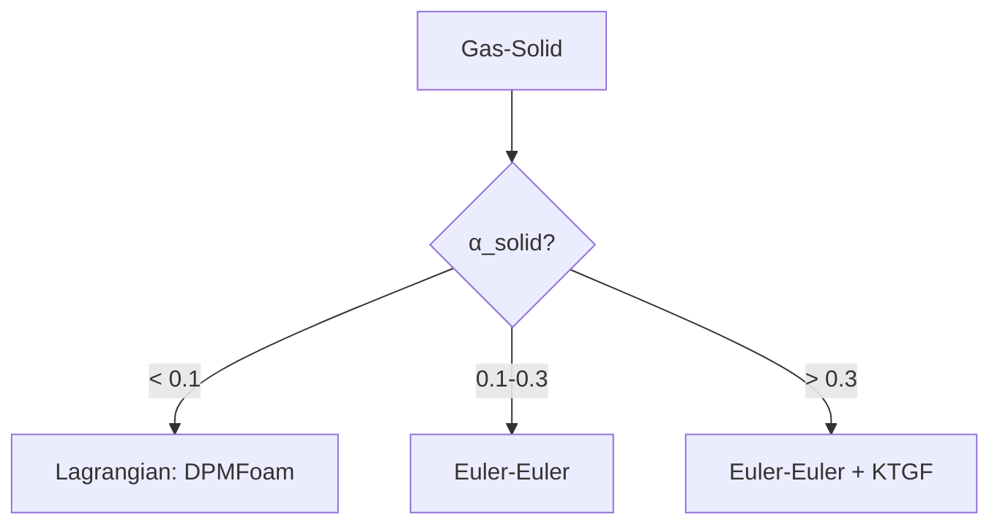

# Gas-Solid Systems

การเลือกโมเดลสำหรับระบบ Gas-Solid

---

## Overview



---

## 1. System Classification

| Regime | α_solid | Example |
|--------|---------|---------|
| Dilute | < 0.1 | Pneumatic conveying |
| Moderate | 0.1-0.3 | Risers |
| Dense | > 0.3 | Fluidized beds |

---

## 2. Drag Models

### Dilute (Wen-Yu)

$$C_D = \frac{24}{\alpha_g Re}(1 + 0.15(\alpha_g Re)^{0.687}) \alpha_g^{-1.65}$$

### Dense (Ergun)

$$\beta = \frac{150 \alpha_s^2 \mu_g}{\alpha_g d_p^2} + \frac{1.75 \alpha_s \rho_g |u_r|}{d_p}$$

### Gidaspow (Combined)

Switches between Ergun (α_g < 0.8) and Wen-Yu (α_g ≥ 0.8).

```cpp
drag { (particles in air) { type GidaspowErgunWenYu; } }
```

---

## 3. KTGF (Kinetic Theory of Granular Flow)

### When Required

α_solid > 0.3 → particle collisions important

### Key Components

| Property | Model |
|----------|-------|
| Granular pressure | Lun-Savage |
| Granular viscosity | Gidaspow |
| Radial distribution | Carnahan-Starling |

### OpenFOAM

```cpp
// constant/phaseProperties
particles
{
    residualAlpha   1e-6;
    alphaMax        0.63;

    kineticTheoryCoeffs
    {
        granularPressureModel   Lun;
        granularViscosityModel  Gidaspow;
        radialModel             CarnahanStarling;
    }
}
```

---

## 4. Key Parameters

| Parameter | Typical |
|-----------|---------|
| $d_p$ | 50-5000 μm |
| $\rho_s$ | 1000-5000 kg/m³ |
| $\alpha_{max}$ | 0.63 (spheres) |
| Restitution | 0.9 |

---

## 5. Numerical Settings

```cpp
PIMPLE
{
    nOuterCorrectors    4;
    nCorrectors         2;
}

relaxationFactors
{
    fields { p 0.3; "alpha.*" 0.5; }
    equations { U 0.6; }
}
```

---

## Quick Reference

| α_solid | Model | Keyword |
|---------|-------|---------|
| < 0.1 | Wen-Yu | `WenYu` |
| 0.1-0.3 | Euler | Basic |
| > 0.3 | KTGF | `kineticTheory` |

---

## Concept Check

<details>
<summary><b>1. ทำไม dense systems ต้องใช้ KTGF?</b></summary>

เพราะมี **particle-particle collisions** บ่อย → ต้อง model granular stress
</details>

<details>
<summary><b>2. Gidaspow switching คืออะไร?</b></summary>

Switches ระหว่าง **Ergun** (packed) และ **Wen-Yu** (dispersed) ตาม α_g
</details>

<details>
<summary><b>3. αmax คืออะไร?</b></summary>

**Maximum packing fraction** — สำหรับ random spheres ≈ 0.63
</details>

---

## Related Documents

- **ภาพรวม:** [00_Overview.md](00_Overview.md)
- **Gas-Liquid:** [02_Gas_Liquid_Systems.md](02_Gas_Liquid_Systems.md)
- **Decision Framework:** [01_Decision_Framework.md](01_Decision_Framework.md)