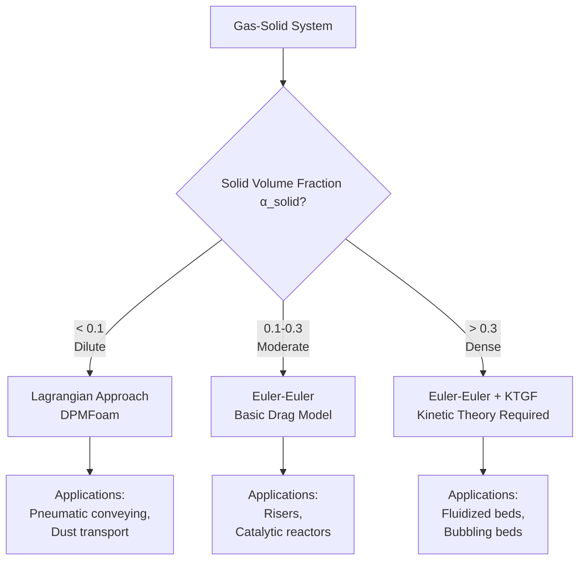
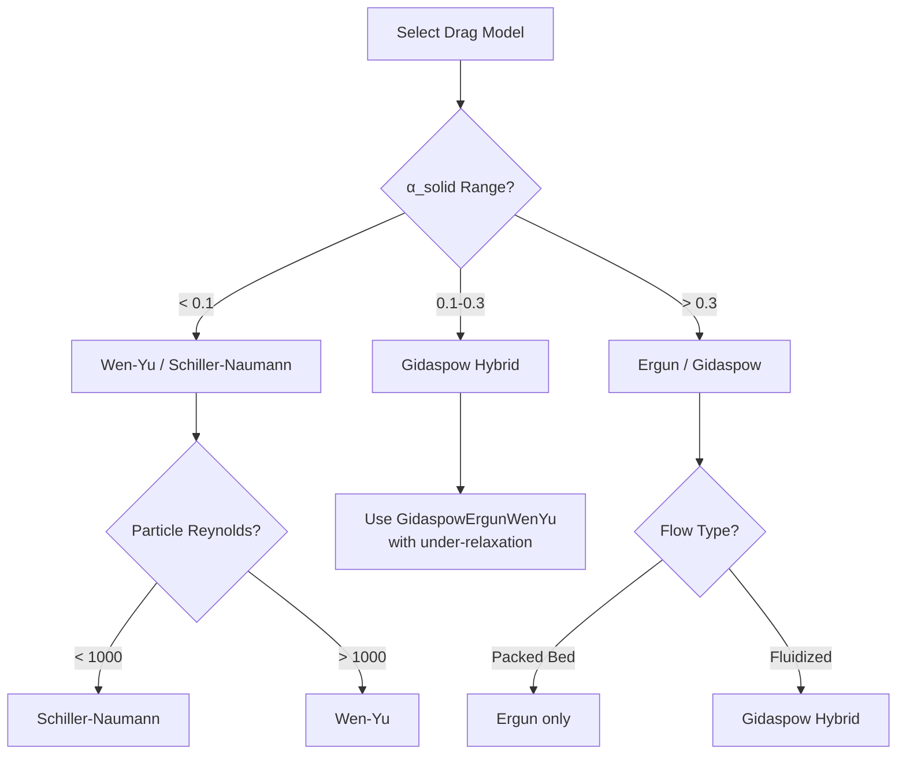

# Gas-Solid Systems

การเลือกโมเดลและการตั้งค่าสำหรับการจำลองระบบ Gas-Solid ใน OpenFOAM

---

## Learning Objectives

หลังจากอ่านบทนี้ คุณจะสามารถ:

- **จำแนกประเภท** ระบบ gas-solid ตามความเข้มข้นของอนุภาค (α_solid) และเลือกแนวทางการจำลองที่เหมาะสม
- **เลือกใช้ drag model** ที่เหมาะสมกับแต่ละระบบ และเข้าใจเกณฑ์การสลับระหว่าง Ergun และ Wen-Yu
- **ตั้งค่า KTGF** (Kinetic Theory of Granular Flow) สำหรับระบบ dense phase อย่างถูกต้อง
- **ปรับแต่ง numerical schemes** และ relaxation factors สำหรับการทำนายการไหลแบบ gas-solid
- **แก้ไขปัญหา** ที่พบบ่อยในการจำลอง fluidized beds และ pneumatic conveying

---

## Prerequisites

- ความเข้าใจพื้นฐานเรื่อง [Multiphase Flow Regimes](../01_FUNDAMENTAL_CONCEPTS/01_Flow_Regimes.md)
- ความคุ้นเคยกับ [Euler-Euler Framework](../03_EULER_EULER_METHOD/01_Introduction.md)
- ความเข้าใจพื้นฐานเรื่อง [Interphase Drag Forces](../04_INTERPHASE_FORCES/01_DRAG/01_Fundamental_Drag_Concept.md)

---

## Why This Matters

การจำลองระบบ gas-solid มีความสำคัญอย่างยิ่งในอุตสาหกรรม:

- **Fluidized Beds** ใช้ในเคมีภัณฑ์ ปิโตรเลียม และการเผาไหม้ (combustion)
- **Pneumatic Conveying** สำหรับการขนส่งวัตถุดิบแบบเกรนูล่าร์
- **Cyclone Separators** สำหรับการแยกอนุภาค
- **Risers & Downcomers** ในเครื่องมือ FCC (Fluid Catalytic Cracking)

ความท้าทายหลักคือ drag models ต่างกันอย่างมากระหว่าง dilute และ dense regimes และจำเป็นต้องใช้ KTGF เพื่อจำลอง granular temperature และ particle collisions ในระบบที่มีความเข้มข้นสูง

---

## Overview



---

## 1. System Classification

### 1.1 Volume Fraction Regimes

| Regime | α_solid | Flow Characteristics | Typical Applications |
|--------|---------|---------------------|---------------------|
| **Dilute** | < 0.1 | Particles dispersed, minimal collisions | Pneumatic conveying, spray drying, dust transport |
| **Moderate** | 0.1-0.3 | Transitional, some collisions | FCC risers, transport reactors |
| **Dense** | > 0.3 | Frequent collisions, granular stress important | Fluidized beds, bubbling beds, packed beds |

### 1.2 Dimensionless Numbers

| Parameter | Formula | Physical Meaning |
|-----------|---------|------------------|
| **Particle Reynolds** | $Re_p = \frac{\rho_g d_p |u_r|}{\mu_g}$ | Inertia vs viscous forces |
| **Stokes Number** | $St = \frac{\tau_p}{\tau_f}$ | Particle response time vs flow time |
| **Archimedes Number** | $Ar = \frac{g d_p^3 \rho_g (\rho_s - \rho_g)}{\mu_g^2}$ | Buoyancy vs viscous forces |

---

## 2. Drag Models

### 2.1 Why Drag Model Selection Matters

Drag coefficient ถูกกำหนดโดย:
- **Particle Reynolds number** ($Re_p$)
- **Local voidage** ($\alpha_g$)
- **Flow regime** (dilute vs dense)

การเลือก drag model ที่ไม่เหมาะสมอาจทำให้ทำนาย:
- **Minimum fluidization velocity** ผิดพลาด
- **Bed expansion** ไม่ถูกต้อง
- **Bubble size & frequency** ใน fluidized bed ผิด

### 2.2 Dilute Phase: Wen-Yu Model

ใช้สำหรับ dispersed flow เมื่อ α_g ≥ 0.8

$$C_D = \frac{24}{\alpha_g Re_p}(1 + 0.15(\alpha_g Re_p)^{0.687}) \alpha_g^{-1.65}$$

**ลักษณะเด่น:**
- พัฒนาจาก standard drag curve (Schiller-Naumann)
- มี correction factors สำหรับ volume fraction
- ใช้ได้ดีสำหรับ α_solid < 0.2

```cpp
// constant/phaseProperties
drag { (particles in air) { type WenYu; } }
```

### 2.3 Dense Phase: Ergun Model

ใช้สำหรับ packed bed flow เมื่อ α_g < 0.8

$$\beta = \frac{150 \alpha_s^2 \mu_g}{\alpha_g d_p^2} + \frac{1.75 \alpha_s \rho_g |u_r|}{d_p}$$

**ลักษณะเด่น:**
- ประกอบด้วย **viscous term** ($\mu_g$) และ **inertial term** ($\rho_g$)
- Viscous term dominates ที่ $Re_p$ ต่ำ (slow flow)
- Inertial term dominates ที่ $Re_p$ สูง (fast flow)
- ใช้ได้ดีสำหรับ packed beds และ dense fluidized beds

```cpp
// constant/phaseProperties
drag { (particles in air) { type Ergun; } }
```

### 2.4 Combined: Gidaspow Hybrid Model

Switches ระหว่าง Ergun และ Wen-Yu ตาม voidage:

| Condition | Model Used | Regime |
|-----------|------------|--------|
| α_g < 0.8 | Ergun | Dense/packed |
| α_g ≥ 0.8 | Wen-Yu | Dilute/dispersed |

**เกณฑ์การสลับ (Switching Criteria):**

$$\beta = \begin{cases}
\beta_{\text{Ergun}} & \text{if } \alpha_g < 0.8 \\
\beta_{\text{Wen-Yu}} & \text{if } \alpha_g \geq 0.8
\end{cases}$$

**ข้อดี:**
- ครอบคลุมทั้งสอง regimes ใน model เดียว
- ใช้ได้ดีกับ bubbling fluidized beds (มีทั้ง dense และ bubble phases)

**ข้อเสีย:**
- มี **discontinuity** ที่ α_g = 0.8 → อาจทำให้ converge ยาก
- ต้องใช้ under-relaxation และ time stepping ที่ระมัดระวัง

```cpp
// constant/phaseProperties
drag { (particles in air) { type GidaspowErgunWenYu; } }
```

### 2.5 Alternative: Schiller-Naumann

ใช้สำหรับ isolated spheres (α_solid → 0):

$$C_D = \frac{24}{Re_p}(1 + 0.15 Re_p^{0.687})$$

**เหมาะสำหรับ:** Dust transport, spray drying

```cpp
// constant/phaseProperties
drag { (particles in air) { type SchillerNaumann; } }
```

### 2.6 Drag Model Selection Guide



---

## 3. KTGF (Kinetic Theory of Granular Flow)

### 3.1 Why KTGF is Required

**ปัญหา:** ใน dense systems (α_solid > 0.3):
- Particle-particle collisions บ่อยมาก
- ไม่สามารถสมมติว่า particles behave แบบ viscous fluid ได้
- มี **granular temperature** ($\Theta_s$) เกิดจาก fluctuating motion ของ particles

**KTGF ช่วย:**
- Model granular pressure (จาก particle collisions)
- Model granular viscosity (จาก momentum exchange)
- Predict solid phase rheology ได้ถูกต้อง

### 3.2 Granular Temperature

$$\Theta_s = \frac{1}{3} \langle c'^2 \rangle$$

where $c'$ = fluctuating velocity of particles

**Physical meaning:** พลังงานจลน์จาก random motion ของ particles

### 3.3 Key KTGF Components

| Property | Physical Meaning | Common Models |
|----------|------------------|---------------|
| **Granular Pressure** | Pressure from particle collisions | Lun-Savage, Syamlal |
| **Granular Viscosity** | Resistance to shear in solid phase | Gidaspow, Syamlal-Rogers |
| **Granular Bulk Viscosity** | Resistance to compression | Lun-Savage |
| **Radial Distribution** | Probability of collision (increases as α_solid → α_max) | Carnahan-Starling, Ma-Ahmadi |
| **Conductivity** | Transfer of granular temperature | Gidaspow |

### 3.4 Radial Distribution Function

$$g_0 = \frac{1}{1 - (\alpha_s/\alpha_{max})^{1/3}}$$

**ลักษณะ:**
- $g_0$ → 1 เมื่อ α_solid → 0 (dilute)
- $g_0$ → ∞ เมื่อ α_solid → α_max (max packing)

### 3.5 OpenFOAM Implementation

```cpp
// constant/phaseProperties
phases
{
    air
    {
        ...
    }
    
    particles
    {
        // Transport properties
        rho             rho  [1 -3 0 0 0 0 0]  2500;
        Cp              Cp   [0 2 -2 -1 0 0 0]  800;
        
        // Phase properties
        residualAlpha   1e-6;          // Minimum solid volume fraction
        alphaMax        0.63;          // Maximum packing (random close pack)
        
        // KTGF coefficients
        kineticTheoryCoeffs
        {
            // Granular pressure model
            granularPressureModel   Lun;
            
            // Granular viscosity model
            granularViscosityModel  Gidaspow;
            
            // Radial distribution model
            radialModel             CarnahanStarling;
            
            // Conductivity model
            conductivityModel       Gidaspow;
            
            // Collisional dissipation
            e                       0.9;            // Restitution coefficient
        }
    }
}
```

### 3.6 Boundary Conditions for Granular Temperature

```cpp
// 0/Thetas
dimensions      [0 2 -2 0 0 0 0];

internalField   uniform 0.1;        // Initial granular temperature

boundaryField
{
    walls
    {
        type            granularTemperatureWallFunction;
        value           uniform 0;
    }
    
    inlet
    {
        type            fixedValue;
        value           uniform 0.1;
    }
    
    outlet
    {
        type            zeroGradient;
    }
}
```

---

## 4. Key Parameters

### 4.1 Particle Properties

| Parameter | Symbol | Typical Range | Physical Meaning |
|-----------|--------|---------------|------------------|
| **Particle Diameter** | $d_p$ | 50-5000 μm | Characteristic size |
| **Solid Density** | $\rho_s$ | 1000-5000 kg/m³ | Material density |
| **Restitution Coefficient** | $e$ | 0.7-0.99 | Energy loss in collisions |
| **Packing Limit** | $\alpha_{max}$ | 0.58-0.65 | Maximum possible solid fraction |

### 4.2 Common Materials

| Material | $\rho_s$ (kg/m³) | $d_p$ (μm) | Typical Application |
|----------|------------------|------------|---------------------|
| Sand | 2650 | 100-500 | Fluidized beds |
| Catalyst | 1500-2000 | 50-150 | FCC reactors |
| Glass beads | 2500 | 500-5000 | Lab experiments |
| Coal | 1300 | 50-200 | Combustion |

### 4.3 Maximum Packing Values

| Packing Type | $\alpha_{max}$ | Description |
|--------------|----------------|-------------|
| Random loose pack | 0.56 | Loosely packed |
| Random close pack | 0.63 | Typical value |
| Hexagonal close pack | 0.74 | Ordered packing |

---

## 5. Numerical Settings

### 5.1 Solvers

| Application | Solver | Description |
|-------------|--------|-------------|
| General gas-solid | `twoPhaseEulerFoam` | Standard EE solver |
| Compressible | `compressibleTwoPhaseEulerFoam` | High Mach number |
| Reactive flows | `reactingTwoPhaseEulerFoam` | Combustion |
| Heat transfer | `twoPhaseEulerFoam` + TEqn | With energy equation |

### 5.2 Time Stepping

Gas-solid systems มักเป็น **stiff** → ต้องใช้ adaptive time stepping:

```cpp
// system/controlDict
application     twoPhaseEulerFoam;

startFrom       startTime;
startTime       0;

stopAt          endTime;
endTime         10;

deltaT          1e-4;

adjustTimeStep  yes;

maxCo           0.5;            // Courant number limit
maxAlphaCo      0.5;            // Phase volume fraction Co

maxDeltaT       1e-3;
minDeltaT       1e-6;
```

### 5.3 PIMPLE Settings

ระบบ gas-solid มักต้องการ outer corrections เพื่อให้ coupling ระหว่าง phases ถูกต้อง:

```cpp
// system/fvSolution
PIMPLE
{
    nOuterCorrectors    4;      // Increase for stiff systems
    nCorrectors         2;
    nNonOrthogonalCorrectors 0;
    
    nAlphaCorr          2;      // Volume fraction correction sub-cycles
    nAlphaSubCycles     2;      // Stability for sharp interfaces
    
    pRefCell            0;
    pRefValue           0;
}
```

### 5.4 Relaxation Factors

**Critical:** Gas-solid systems มัก oscillate → ต้องใช้ under-relaxation

```cpp
// system/fvSolution
relaxationFactors
{
    fields
    {
        p               0.3;    // Pressure
        p_rgh           0.3;
        "alpha.*"       0.5;    // Volume fractions
        "Theta.*"       0.3;    // Granular temperature
    }
    
    equations
    {
        U               0.6;    // Velocities
        "U.*"           0.6;
        k               0.7;
        epsilon         0.7;
    }
}
```

### 5.5 Schemes

```cpp
// system/fvSchemes
ddtSchemes
{
    default         Euler;
}

gradSchemes
{
    default         Gauss linear;
    grad(p)         Gauss linear;
    grad(alpha.*)   Gauss limitedLinear 1;  // Boundedness
}

divSchemes
{
    default         none;
    
    // Convection - bounded scheme
    div(phi,U)      Gauss limitedLinearV 1;
    div(phi,alpha.*) Gauss limitedLinear 1;
    div(phi,Theta)  Gauss limitedLinear 1;
    
    // Interphase transfer
    div(phir,p)     Gauss limitedLinear 1;
}

laplacianSchemes
{
    default         Gauss linear corrected;
}
```

---

## 6. Practical Example: Bubbling Fluidized Bed

### 6.1 Problem Setup

**Objective:** จำลอง bubbling fluidized bed เพื่อศึกษา bed expansion และ bubble formation

**Conditions:**
- Air at 20°C, 1 atm
- Sand particles ($d_p = 300 \mu m$, $\rho_s = 2650 kg/m^3$)
- Bed height = 0.5 m
- Superficial gas velocity = 0.3 m/s

### 6.2 Case Directory Structure

```
fluidizedBed/
├── 0/
│   ├── air/U
│   ├── air/p_rgh
│   ├── air/alpha
│   ├── particles/U
│   ├── particles/alpha
│   └── particles/Thetas
├── constant/
│   ├── phaseProperties
│   ├── turbulenceProperties.{air,particles}
│   └── polyMesh/
└── system/
    ├── controlDict
    ├── fvSchemes
    └── fvSolution
```

### 6.3 phaseProperties Configuration

```cpp
// constant/phaseProperties
phases
{
    air
    {
        transportModel  Newtonian;
        nu              nu [0 2 -1 0 0 0 0] 1.5e-05;
        rho             rho [1 -3 0 0 0 0 0] 1.2;
        
        CV
        {
            Cv Cv [0 2 -2 -1 0 0 0] 1005;
        }
        
        residualAlpha   1e-6;
        alphaMax        1;
    }
    
    particles
    {
        transportModel  Newtonian;
        nu              nu [0 2 -1 0 0 0 0] 1e-06;
        rho             rho [1 -3 0 0 0 0 0] 2650;
        
        CV
        {
            Cv Cv [0 2 -2 -1 0 0 0] 800;
        }
        
        residualAlpha   1e-6;
        alphaMax        0.63;
        
        kineticTheoryCoeffs
        {
            granularPressureModel   Lun;
            granularViscosityModel  Gidaspow;
            radialModel             CarnahanStarling;
            
            e                       0.9;    // Restitution
            e0                      0.9;    // Wall restitution
        }
    }
}

drag
{
    // Gidaspow hybrid model (Ergun + Wen-Yu)
    (particles in air)
    {
        type    GidaspowErgunWenYu;
        
        // Particle diameter
        d       d [0 1 0 0 0 0 0] 3e-04;
    }
}

lift
{
    // No lift for gas-solid
}

virtualMass
{
    // Negligible for gas-solid
}

turbulence
{
    // Gas phase turbulence
    air
    {
        type    kEpsilon;
    }
    
    // Solid phase uses granular viscosity from KTGF
    particles
    {
        type    none;
    }
}
```

### 6.4 Boundary Conditions

**Inlet (bottom):**

```cpp
// 0/air/U
inlet
{
    type            fixedValue;
    value           uniform (0 0.3 0);    // Superficial velocity
}

// 0/particles/U
inlet
{
    type            fixedValue;
    value           uniform (0 0 0);
}

// 0/air/alpha
inlet
{
    type            fixedValue;
    value           uniform 1;            // Pure gas inlet
}

// 0/particles/alpha
inlet
{
    type            fixedValue;
    value           uniform 0;            // No particles at inlet
}
```

**Outlet (top):**

```cpp
// 0/air/p_rgh
outlet
{
    type            fixedValue;
    value           uniform 0;
}

// 0/air/alpha
outlet
{
    type            zeroGradient;
}

// 0/particles/alpha
outlet
{
    type            zeroGradient;
}
```

**Walls:**

```cpp
// 0/air/U
walls
{
    type            noSlip;
}

// 0/particles/U
walls
{
    type            slip;             // Free-slip for particles
}

// 0/particles/Thetas
walls
{
    type            granularTemperatureWallFunction;
    value           uniform 0;
}
```

### 6.5 Initial Conditions

```cpp
// 0/particles/alpha
dimensions      [0 0 0 0 0 0 0];

internalField   uniform 0;        // Initially empty

boundaryField
{
    #includeEtc "caseDicts/setConstraintTypes"
    
    inlet
    {
        type            fixedValue;
        value           uniform 0;
    }
    
    walls
    {
        type            fixedValue;
        value           uniform 0;
    }
    
    outlet
    {
        type            zeroGradient;
    }
}
```

**Set initial bed using setFields:**

```bash
# system/setFieldsDict
regions
{
    boxToCell
    {
        box (0 0 0) (1 1 0.5);    // Initial bed region
        
        fieldValues
        (
            volScalarFieldValue particles.alpha 0.6    // Packed bed
        );
    }
}
```

### 6.6 Monitoring Convergence

**Add function objects to track bed expansion:**

```cpp
// system/controlDict
functions
{
    bedHeight
    {
        type            surfaces;
        functionObjectLibs ("libsampling.so");
        
        surfaceFormat   raw;
        
        fields
        (
            alpha.particles
        );
        
        surfaces
        (
            zNormal
            {
                type            cuttingPlane;
                planeType       pointAndNormal;
                point           (0.5 0.5 0);
                normal          (0 0 1);
                interpolate     true;
            }
        );
        
        writeControl    timeStep;
        writeInterval   10;
    }
    
    avgPressure
    {
        type            surfaceRegion;
        functionObjectLibs ("libsampling.so");
        
        operation       average;
        
        fields
        (
            p_rgh
        );
        
        surfaceFormat   none;
        
        surfaces
        (
            bedBottom
            {
                type            plane;
                basePoint       (0.5 0.5 0.01);
                normal          (0 0 1);
            }
        );
    }
}
```

---

## 7. Common Issues and Solutions

### 7.1 Divergence at t = 0

**Symptoms:**
- Simulation crashes หลังจาก 1-2 time steps
- Large pressure spikes

**Solutions:**
```cpp
// Reduce initial time step
deltaT          1e-6;

// Increase under-relaxation
relaxationFactors
{
    fields { p 0.1; "alpha.*" 0.3; }
    equations { U 0.3; }
}

// Ramp inlet velocity gradually
inlet
{
    type            codedFixedValue;
    value           uniform (0 0 0);
    
    code
    #{
        const scalar t = this->db().time().value();
        const scalar Umax = 0.3;
        const scalar tramp = 0.1;
        
        vectorField& U = *this;
        U = vector(0, min(Umax * t/tramp, Umax), 0);
    #};
}
```

### 7.2 Negative α_solid

**Symptoms:**
- Solid volume fraction becomes negative
- Solver crashes

**Solutions:**
```cpp
// MULES correction
nAlphaCorr      4;      // Increase
nAlphaSubCycles 2;      // Add sub-cycling

// Use bounded scheme
divSchemes
{
    div(phi,alpha.*) Gauss vanLeer 1;    // TVD scheme
}

// Check fvSolution
solvers
{
    "alpha.*"
    {
        solver          smoothSolver;
        smoother        symGaussSeidel;
        tolerance       1e-8;
        relTol          0;
    }
}
```

### 7.3 Bed Not Fluidizing

**Symptoms:**
- Bed remains static (packed)
- Gas channels through

**Check:**
1. **Minimum fluidization velocity:**

$$u_{mf} = \frac{\mu_g}{d_p \rho_g} \sqrt{33.7^2 + 0.0408 Ar - 33.7}$$

2. **Drag model selection:**
   - Verify using `GidaspowErgunWenYu` for bubbling beds
   - Check particle diameter in `phaseProperties`

3. **Boundary conditions:**
   - Ensure slip BC for particles at walls
   - Check inlet velocity magnitude

### 7.4 Unphysical Granular Temperature

**Symptoms:**
- $\Theta_s$ → very large values
- Oscillations in solid velocity

**Solutions:**
```cpp
// Add granular temperature damping
kineticTheoryCoeffs
{
    ...
    
    // Maximum granular temperature
    ThetaMax        1.0;    // m²/s²
}

// Wall BC
walls
{
    type            granularTemperatureWallFunction;
    
    // Wall restitution (energy loss at walls)
    e0              0.8;    // < e (bulk)
}
```

### 7.5 Slow Convergence

**Solutions:**

1. **Increase outer correctors:**
```cpp
nOuterCorrectors  8;       // Try increasing
```

2. **Use residual control:**
```cpp
PIMPLE
{
    residualControl
    {
        p               1e-4;
        U               1e-4;
        "alpha.*"       1e-4;
    }
}
```

3. **Parallel computing:**
```bash
decomposePar
mpirun -np 4 twoPhaseEulerFoam -parallel
reconstructPar
```

---

## 8. Key Takeaways

### Core Principles

- **Regime-based modeling:** Gas-solid systems require different approaches based on α_solid:
  - **α_solid < 0.1:** Lagrangian (DPMFoam) or simple EE with Wen-Yu
  - **0.1 < α_solid < 0.3:** EE with Gidaspow hybrid drag
  - **α_solid > 0.3:** EE + KTGF required

- **Drag model selection:** Critical for predicting correct bed dynamics:
  - **Wen-Yu:** Dilute, dispersed flows
  - **Ergun:** Dense, packed flows
  - **Gidaspow:** Hybrid for bubbling beds (has discontinuity at α_g = 0.8)

- **KTGF necessity:** Required when α_solid > 0.3 to capture:
  - Granular pressure from collisions
  - Granular viscosity
  - Solid phase rheology

### Implementation Best Practices

| Aspect | Recommendation |
|--------|----------------|
| **Time stepping** | Use adaptive, maxCo ≤ 0.5, start with Δt = 1e-6 |
| **Relaxation** | Aggressive: p=0.3, α=0.5, U=0.6 for stability |
| **Outer correctors** | Increase to 4-8 for stiff systems |
| **Schemes** | Bounded TVD for α, limitedLinear for U |
| **Inlet BC** | Ramp velocity gradually over first 0.1s |
| **Initial bed** | Use setFields to create packed bed (α_solid ≈ 0.6) |

### Parameter Selection Guide

| Parameter | Typical Range | Effect |
|-----------|---------------|--------|
| $d_p$ | 50-5000 μm | Larger → higher $u_{mf}$ |
| $\rho_s$ | 1000-5000 kg/m³ | Larger → higher $u_{mf}$ |
| $e$ | 0.7-0.99 | Lower → more dissipation, less bubbling |
| $\alpha_{max}$ | 0.58-0.65 | Affects pressure drop prediction |

---

## 9. Concept Check

<details>
<summary><b>1. Why do dense gas-solid systems (α_solid > 0.3) require KTGF?</b></summary>

Because **particle-particle collisions** become frequent and granular stress (pressure and viscosity from particle interactions) becomes significant. KTGF provides:
- Granular pressure from collisional momentum transfer
- Granular viscosity based on granular temperature
- Proper rheology for the solid phase

Without KTGF, the solid phase behaves like a simple viscous fluid, which is **incorrect** for dense flows.
</details>

<details>
<summary><b>2. What is the Gidaspow hybrid drag model and when should it be used?</b></summary>

The Gidaspow model **switches between two drag formulations:**
- **Ergun model** when α_g < 0.8 (dense regime)
- **Wen-Yu model** when α_g ≥ 0.8 (dilute regime)

It should be used for **bubbling fluidized beds** and other systems where both dense and dilute regions coexist. The main drawback is the **discontinuity at α_g = 0.8**, which can cause convergence issues and requires careful under-relaxation.
</details>

<summary><b>3. What is α_max and what does it represent physically?</b></summary>

**α_max** is the **maximum packing fraction** — the highest possible solid volume fraction where particles are in contact.

Physical meaning:
- Represents random close-packing limit for spheres
- Typical value: **0.63** for random close pack
- Lower values (0.56) for loose packing
- Higher values (0.74) only for ordered (hexagonal) packing

In KTGF, $g_0$ (radial distribution function) → ∞ as α_solid → α_max, indicating increasing collision frequency.
</details>

<details>
<summary><b>4. Your fluidized bed simulation is not expanding — the solid remains packed. What should you check?</b></summary>

**Systematic checks:**

1. **Inlet velocity:**
   - Calculate $u_{mf}$ (minimum fluidization velocity)
   - Verify $U_{inlet} > u_{mf}$

2. **Drag model:**
   - Ensure using `GidaspowErgunWenYu` (not Wen-Yu only)
   - Check particle diameter $d_p$ in `phaseProperties`

3. **Particle properties:**
   - Verify $\rho_s$ and $d_p$ match your material
   - Check $\alpha_{max} \approx 0.63$

4. **Boundary conditions:**
   - Particles: `slip` at walls (not no-slip)
   - Gas: `noSlip` or `wallFunction`

5. **Numerical stability:**
   - Check for negative α values (would crash solver)
   - Verify pressure field is physical
</details>

<details>
<summary><b>5. How does the restitution coefficient (e) affect the simulation?</b></summary>

**Restitution coefficient (e)** represents energy retention during collisions:

| e value | Physical meaning | Effect on simulation |
|---------|------------------|---------------------|
| e = 1.0 | Perfectly elastic (no energy loss) | Higher granular temperature, more vigorous bubbling |
| 0.8 < e < 1.0 | Mostly elastic | Realistic bubbling behavior |
| e < 0.8 | Inelastic | Higher dissipation, smaller bubbles, denser bed |

**Lower e** → more energy dissipation → lower granular temperature → reduced bed expansion
**Higher e** → less dissipation → higher granular temperature → larger bubbles, more expansion

Typical range: **0.85-0.95** for sand/glass beads
</details>

<details>
<summary><b>6. Why do we need aggressive under-relaxation for gas-solid systems?</b></summary>

**Gas-solid systems are stiff** due to:
1. **Large density ratio** ($\rho_s/\rho_g \approx 1000-5000$)
2. **Strong coupling** via drag (momentum exchange)
3. **Nonlinear KTGF equations** for granular temperature

This leads to:
- **Oscillatory solutions** with standard relaxation
- **Divergence** if time step is too large
- **Slow convergence** or instability

**Solution:**
- Low relaxation on pressure (p = 0.2-0.3)
- Moderate relaxation on α (0.4-0.5)
- Multiple outer correctors (4-8)
- Adaptive time stepping with low Co (0.3-0.5)
</details>

---

## 10. Related Documents

### Within This Module

- **ภาพรวม:** [00_Overview.md](00_Overview.md)
- **Gas-Liquid Systems:** [02_Gas_Liquid_Systems.md](02_Gas_Liquid_Systems.md)
- **Liquid-Liquid Systems:** [03_Liquid_Liquid_Systems.md](03_Liquid_Liquid_Systems.md)
- **Decision Framework:** [01_Decision_Framework.md](01_Decision_Framework.md)

### Prerequisites

- **Fundamentals:** [Fundamental Concepts](../01_FUNDAMENTAL_CONCEPTS/00_Overview.md)
- **Euler-Euler Method:** [Introduction to EE](../03_EULER_EULER_METHOD/01_Introduction.md)
- **Drag Forces:** [Fundamental Drag Concept](../04_INTERPHASE_FORCES/01_DRAG/01_Fundamental_Drag_Concept.md)
- **Specific Drag Models:** [Specific Drag Models](../04_INTERPHASE_FORCES/01_DRAG/02_Specific_Drag_Models.md)

### Advanced Topics

- **Turbulent Dispersion:** [Turbulent Dispersion Forces](../04_INTERPHASE_FORCES/04_TURBULENT_DISPERSION/01_Fundamental_Theory.md)
- **Heat Transfer:** Heat transfer in gas-solid systems (reactors, dryers)

---

## Appendix: Quick Reference

### Drag Model Selection

| α_solid | Regime | Recommended Model | OpenFOAM Keyword |
|---------|--------|-------------------|------------------|
| < 0.1 | Dilute | Wen-Yu / Schiller-Naumann | `WenYu`, `SchillerNaumann` |
| 0.1-0.3 | Moderate | Gidaspow Hybrid | `GidaspowErgunWenYu` |
| > 0.3 | Dense | Ergun / Gidaspow + KTGF | `Ergun`, `GidaspowErgunWenYu` |

### Typical Numerical Settings

```cpp
// Recommended starting values
nOuterCorrectors    4-8;
nAlphaCorr          2-4;
maxCo               0.3-0.5;
maxAlphaCo          0.3-0.5;

relaxationFactors
{
    fields
    {
        p           0.2-0.3;
        "alpha.*"   0.4-0.5;
    }
    equations
    {
        U           0.5-0.7;
    }
}
```

### Minimum Fluidization Velocity (Quick Estimate)

$$u_{mf} \approx \frac{\mu_g}{\rho_g d_p} \left[ (33.7^2 + 0.0408 Ar)^{1/2} - 33.7 \right]$$

where $Ar = \frac{g d_p^3 \rho_g (\rho_s - \rho_g)}{\mu_g^2}$

For 300 μm sand in air at 20°C: **$u_{mf} \approx 0.05$ m/s**