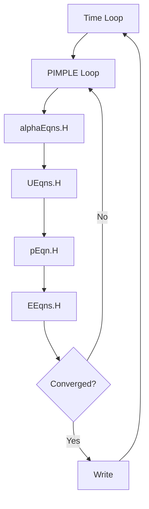

# Implementation Architecture Overview

ภาพรวมสถาปัตยกรรม multiphaseEulerFoam

> **ทำไมต้องเข้าใจ Implementation?**
> - **Debug ได้** เมื่อ simulation ไม่ work
> - **Customize ได้** เมื่อต้องการ model ใหม่
> - **เข้าใจ PIMPLE algorithm** สำหรับ multiphase

---

## Learning Objectives

### What You Will Learn
- Core OpenFOAM classes: `phaseSystem`, `phaseModel`, and interfacial models
- Governing equations for Eulerian-Eulerian multiphase flow
- PIMPLE algorithm implementation for multiphase systems
- Memory management patterns in multiphaseEulerFoam

### Why This Matters
Understanding the solver architecture enables you to:
- Diagnose convergence issues effectively
- Customize interphase force models for specific applications
- Optimize solver settings for your multiphase system
- Extend the solver with new physics models

### How You Will Apply This
After this section, you will be able to:
- Configure a complete multiphaseEulerFoam case
- Select appropriate interphase models for your application
- Debug simulation failures using code-level knowledge
- Navigate the OpenFOAM source code for further customization

---

## 1. Governing Equations

### Continuity

$$\frac{\partial(\alpha_k \rho_k)}{\partial t} + \nabla \cdot (\alpha_k \rho_k \mathbf{u}_k) = \sum_{l \neq k} \dot{m}_{lk}$$

### Momentum

$$\frac{\partial(\alpha_k \rho_k \mathbf{u}_k)}{\partial t} + \nabla \cdot (\alpha_k \rho_k \mathbf{u}_k \mathbf{u}_k) = -\alpha_k \nabla p + \nabla \cdot (\alpha_k \boldsymbol{\tau}_k) + \alpha_k \rho_k \mathbf{g} + \mathbf{M}_k$$

### Energy

$$\frac{\partial(\alpha_k \rho_k h_k)}{\partial t} + \nabla \cdot (\alpha_k \rho_k \mathbf{u}_k h_k) = \nabla \cdot (\alpha_k k_k \nabla T_k) + Q_k$$

**Constraint:** $\sum_k \alpha_k = 1$

---

## 2. Core Classes

| Class | Purpose |
|-------|---------|
| `phaseSystem` | Manage all phases and interactions |
| `phaseModel` | Store phase fields (U, α, ρ, T) |
| `dragModel` | Interphase drag force |
| `liftModel` | Lift force |
| `virtualMassModel` | Virtual mass force |

### Source Locations

```
applications/solvers/multiphase/multiphaseEulerFoam/
src/phaseSystemModels/phaseSystem/
src/phaseSystemModels/interfacialModels/
```

---

## 3. PIMPLE Algorithm



### fvSolution Settings

```cpp
PIMPLE
{
    nOuterCorrectors    3;      // SIMPLE iterations
    nCorrectors         2;      // PISO corrections
    nAlphaCorr          1;      // Alpha corrections
    nAlphaSubCycles     2;      // Alpha sub-cycles
}
```

---

## 4. Interphase Forces

### Momentum Transfer

$$\mathbf{M}_k = \sum_l (\mathbf{F}^D_{kl} + \mathbf{F}^L_{kl} + \mathbf{F}^{VM}_{kl} + \mathbf{F}^{TD}_{kl})$$

| Force | Formula |
|-------|---------|
| Drag | $\mathbf{F}^D = K(\mathbf{u}_l - \mathbf{u}_k)$ |
| Lift | $\mathbf{F}^L = C_L \rho_k (\mathbf{u}_r \times \omega)$ |
| Virtual Mass | $\mathbf{F}^{VM} = C_{VM} \rho_c \alpha_d \frac{D\mathbf{u}_r}{Dt}$ |

---

## 5. Key OpenFOAM Files

| File | Purpose |
|------|---------|
| `constant/phaseProperties` | Phase properties & interphase models |
| `constant/turbulenceProperties` | Turbulence models per phase |
| `system/fvSolution` | PIMPLE settings, solvers |
| `system/fvSchemes` | Discretization schemes |
| `0/alpha.*`, `0/U.*` | Initial conditions |

### phaseProperties Example

```cpp
phases (air water);

air
{
    diameterModel   constant;
    d               0.003;
}

drag { (air in water) { type SchillerNaumann; } }
virtualMass { (air in water) { type constantCoefficient; Cvm 0.5; } }
lift { (air in water) { type Tomiyama; } }
```

---

## 6. Advanced Features

### Partial Elimination Algorithm (PEA)

```cpp
// system/fvSolution
PIMPLE
{
    partialElimination  yes;  // For high density ratios
}
```

### Local Time Stepping (LTS)

```cpp
// system/controlDict
LTS             yes;
adjustTimeStep  yes;
maxCo           1.0;
```

---

## 7. Memory Management

| Pattern | Purpose |
|---------|---------|
| `tmp<T>` | Reference-counted smart pointer |
| `autoPtr<T>` | Exclusive ownership |
| Lazy allocation | Allocate on first access |

---

## Quick Reference

| Task | File |
|------|------|
| Select drag model | `constant/phaseProperties` → `drag` |
| Set PIMPLE iterations | `system/fvSolution` → `PIMPLE` |
| Set time step control | `system/controlDict` → `maxCo` |
| View solver source | `$FOAM_SOLVERS/multiphase/multiphaseEulerFoam/` |

---

## Key Takeaways

### Shared Pressure Field
ใน Eulerian-Eulerian approach ทุกเฟส occupy พื้นที่เดียวกัน → ความดันต้องเท่ากันที่ทุกจุดเพื่อ enforce continuity

### Partial Elimination Algorithm (PEA)
กำจัด drag term ออกจาก pressure equation → convergence ดีขึ้นสำหรับ **high density ratio** systems

### PIMPLE Settings
- **nOuterCorrectors**: SIMPLE loops (update all equations)
- **nCorrectors**: PISO corrections (pressure-velocity only)

---

## Practical Example: Bubble Column Simulation

Below is a complete multiphaseEulerFoam case setup for a bubble column with air bubbles in water.

### Case Directory Structure

```
bubbleColumn/
├── 0/
│   ├── alpha.air
│   ├── alpha.water
│   ├── U.air
│   ├── U.water
│   ├── p_rgh
│   ├── k
│   └── epsilon
├── constant/
│   ├── phaseProperties
│   ├── turbulenceProperties.air
│   ├── turbulenceProperties.water
│   └── transportProperties
├── system/
│   ├── controlDict
│   ├── fvSchemes
│   └── fvSolution
└── Allrun
```

### 0/alpha.air

```cpp
/*--------------------------------*- C++ -*----------------------------------*\
| =========                 |                                                 |
| \\      /  F ield         | OpenFOAM: The Open Source CFD Toolbox           |
|  \\    /   O peration     | Version:  v2112                                 |
|   \\  /    A nd           | Web:      www.OpenFOAM.org                      |
|    \\/     M anipulation  |                                                 |
\*---------------------------------------------------------------------------*/
FoamFile
{
    version     2.0;
    format      ascii;
    class       volScalarField;
    location    "0";
    object      alpha.air;
}
// * * * * * * * * * * * * * * * * * * * * * * * * * * * * * * * * * * * * * //

dimensions      [0 0 0 0 0 0 0];

internalField   uniform 0;

boundaryField
{
    walls
    {
        type            zeroGradient;
    }

    inlet
    {
        type            fixedValue;
        value           uniform 0.3;
    }

    outlet
    {
        type            pressureInletOutletVelocity;
        value           uniform 0;
    }
}

// ************************************************************************* //
```

### 0/U.air

```cpp
/*--------------------------------*- C++ -*----------------------------------*\
| =========                 |                                                 |
| \\      /  F ield         | OpenFOAM: The Open Source CFD Toolbox           |
|  \\    /   O peration     | Version:  v2112                                 |
|   \\  /    A nd           | Web:      www.OpenFOAM.org                      |
|    \\/     M anipulation  |                                                 |
\*---------------------------------------------------------------------------*/
FoamFile
{
    version     2.0;
    format      ascii;
    class       volVectorField;
    location    "0";
    object      U.air;
}
// * * * * * * * * * * * * * * * * * * * * * * * * * * * * * * * * * * * * * //

dimensions      [0 1 -1 0 0 0 0];

internalField   uniform (0 0 0);

boundaryField
{
    walls
    {
        type            noSlip;
    }

    inlet
    {
        type            flowRateInletVelocity;
        massFlowRate    0.001;
        value           uniform (0 0 1);
    }

    outlet
    {
        type            pressureInletOutletVelocity;
        value           uniform (0 0 0);
    }
}

// ************************************************************************* //
```

### constant/phaseProperties

```cpp
/*--------------------------------*- C++ -*----------------------------------*\
| =========                 |                                                 |
| \\      /  F ield         | OpenFOAM: The Open Source CFD Toolbox           |
|  \\    /   O peration     | Version:  v2112                                 |
|   \\  /    A nd           | Web:      www.OpenFOAM.org                      |
|    \\/     M anipulation  |                                                 |
\*---------------------------------------------------------------------------*/
FoamFile
{
    version     2.0;
    format      ascii;
    class       dictionary;
    location    "constant";
    object      phaseProperties;
}
// * * * * * * * * * * * * * * * * * * * * * * * * * * * * * * * * * * * * * //

phases
(
    water
    {
        transportModel  Newtonian;
        nu              1e-06;
        rho             1000;
    }
    air
    {
        transportModel  Newtonian;
        nu              1.48e-05;
        rho             1;

        diameterModel   constant;
        d               0.003;
    }
);

// Drag Model: Schiller-Naumann for solid spheres
drag
{
    (air in water)
    {
        type            SchillerNaumann;
    }
}

// Lift Force: Tomiyama model for deformable bubbles
lift
{
    (air in water)
    {
        type            Tomiyama;
    }
}

// Virtual Mass: Standard coefficient for dispersed bubbles
virtualMass
{
    (air in water)
    {
        type            constantCoefficient;
        Cvm             0.5;
    }
}

// Turbulent Dispersion Force
turbulentDispersion
{
    (air in water)
    {
        type            none;
    }
}

// ************************************************************************* //
```

### system/fvSolution

```cpp
/*--------------------------------*- C++ -*----------------------------------*\
| =========                 |                                                 |
| \\      /  F ield         | OpenFOAM: The Open Source CFD Toolbox           |
|  \\    /   O peration     | Version:  v2112                                 |
|   \\  /    A nd           | Web:      www.OpenFOAM.org                      |
|    \\/     M anipulation  |                                                 |
\*---------------------------------------------------------------------------*/
FoamFile
{
    version     2.0;
    format      ascii;
    class       dictionary;
    location    "system";
    object      fvSolution;
}
// * * * * * * * * * * * * * * * * * * * * * * * * * * * * * * * * * * * * * //

solvers
{
    "alpha.*"
    {
        nAlphaCorr      1;
        nAlphaSubCycles 2;
        MULESCorr       yes;
        nLimiterIter    3;

        solver          smoothSolver;
        smoother        symGaussSeidel;
        tolerance       1e-08;
        relTol          0;
    }

    "p_rgh.*"
    {
        solver          GAMG;
        tolerance       1e-06;
        relTol          0.01;

        smoother        GaussSeidel;
        nCellsInCoarsestLevel 10;
    }

    "U.*"
    {
        solver          smoothSolver;
        smoother        GaussSeidel;
        tolerance       1e-06;
        relTol          0.1;
    }

    "k.*"
    {
        solver          smoothSolver;
        smoother        GaussSeidel;
        tolerance       1e-06;
        relTol          0.1;
    }

    "epsilon.*"
    {
        solver          smoothSolver;
        smoother        GaussSeidel;
        tolerance       1e-06;
        relTol          0.1;
    }
}

PIMPLE
{
    // SIMPLE iterations
    nOuterCorrectors    3;

    // PISO corrections
    nCorrectors         2;

    // Alpha equation corrections
    nAlphaCorr          1;
    nAlphaSubCycles     2;

    // Momentum predictor
    momentumPredictor   yes;

    // Transient options
    transonic           no;
    consistent          yes;

    // Partial elimination for high density ratio
    partialElimination  yes;
}

relaxationFactors
{
    fields
    {
        "p_rgh"         0.7;
    }
    equations
    {
        "U.*"           0.7;
        "k.*"           0.7;
        "epsilon.*"     0.7;
    }
}

// ************************************************************************* //
```

### system/controlDict

```cpp
/*--------------------------------*- C++ -*----------------------------------*\
| =========                 |                                                 |
| \\      /  F ield         | OpenFOAM: The Open Source CFD Toolbox           |
|  \\    /   O peration     | Version:  v2112                                 |
|   \\  /    A nd           | Web:      www.OpenFOAM.org                      |
|    \\/     M anipulation  |                                                 |
\*---------------------------------------------------------------------------*/
FoamFile
{
    version     2.0;
    format      ascii;
    class       dictionary;
    location    "system";
    object      controlDict;
}
// * * * * * * * * * * * * * * * * * * * * * * * * * * * * * * * * * * * * * //

application     multiphaseEulerFoam;

startFrom       startTime;

startTime       0;

stopAt          endTime;

endTime         10;

deltaT          0.001;

adjustTimeStep  yes;

maxCo           0.5;

maxAlphaCo      0.5;

functions
{
    #includeFunc phaseMassFlow
    #includeFunc phaseMeanVelocity
}

// ************************************************************************* //
```

### Running the Simulation

```bash
# Run the solver
multiphaseEulerFoam

# Or use the provided script
./Allrun

# For parallel processing
decomposePar
mpirun -np 4 multiphaseEulerFoam -parallel
reconstructPar
```

### Monitoring Convergence

```bash
# Monitor phase volume fractions
probeLocations postProcessing/probeLocations/

# Check mass balance
foamListTimes
grep -h "alpha.air" 0*/alpha.air | head

# Visualize with ParaView
paraFoam -builtin
```

---

## Related Documents

- **บทถัดไป:** [01_Solver_Overview.md](01_Solver_Overview.md)
- **Code and Model Architecture:** [02_Code_and_Model_Architecture.md](02_Code_and_Model_Architecture.md)
- **Algorithm Flow:** [03_Algorithm_Flow.md](03_Algorithm_Flow.md)
- **Parallel Implementation:** [04_Parallel_Implementation.md](04_Parallel_Implementation.md)