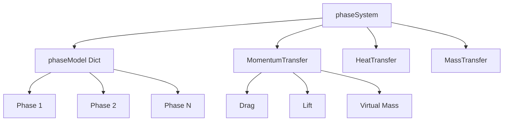
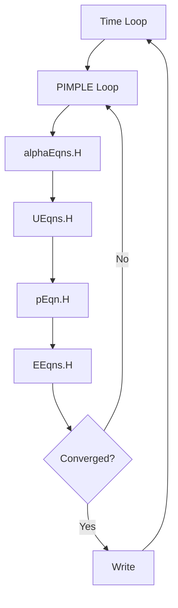

# Implementation Architecture Overview

ภาพรวมสถาปัตยกรรม multiphaseEulerFoam

> **ทำไมต้องเข้าใจ Implementation?**
> - **Debug ได้** เมื่อ simulation ไม่ work
> - **Customize ได้** เมื่อต้องการ model ใหม่
> - **เข้าใจ PIMPLE algorithm** สำหรับ multiphase

---

## Overview

> **💡 multiphaseEulerFoam = N phases, shared pressure, interphase coupling**
>
> ทุกเฟสแบ่ง pressure field เดียวกัน แต่มี velocity แยก

> **multiphaseEulerFoam** = Eulerian multi-phase solver สำหรับ N phases ที่ใช้ shared pressure field



---

## 1. Governing Equations

### Continuity

$$\frac{\partial(\alpha_k \rho_k)}{\partial t} + \nabla \cdot (\alpha_k \rho_k \mathbf{u}_k) = \sum_{l \neq k} \dot{m}_{lk}$$

### Momentum

$$\frac{\partial(\alpha_k \rho_k \mathbf{u}_k)}{\partial t} + \nabla \cdot (\alpha_k \rho_k \mathbf{u}_k \mathbf{u}_k) = -\alpha_k \nabla p + \nabla \cdot (\alpha_k \boldsymbol{\tau}_k) + \alpha_k \rho_k \mathbf{g} + \mathbf{M}_k$$

### Energy

$$\frac{\partial(\alpha_k \rho_k h_k)}{\partial t} + \nabla \cdot (\alpha_k \rho_k \mathbf{u}_k h_k) = \nabla \cdot (\alpha_k k_k \nabla T_k) + Q_k$$

**Constraint:** $\sum_k \alpha_k = 1$

---

## 2. Core Classes

| Class | Purpose |
|-------|---------|
| `phaseSystem` | Manage all phases and interactions |
| `phaseModel` | Store phase fields (U, α, ρ, T) |
| `dragModel` | Interphase drag force |
| `liftModel` | Lift force |
| `virtualMassModel` | Virtual mass force |

### Source Locations

```
applications/solvers/multiphase/multiphaseEulerFoam/
src/phaseSystemModels/phaseSystem/
src/phaseSystemModels/interfacialModels/
```

---

## 3. PIMPLE Algorithm



### fvSolution Settings

```cpp
PIMPLE
{
    nOuterCorrectors    3;      // SIMPLE iterations
    nCorrectors         2;      // PISO corrections
    nAlphaCorr          1;      // Alpha corrections
    nAlphaSubCycles     2;      // Alpha sub-cycles
}
```

---

## 4. Interphase Forces

### Momentum Transfer

$$\mathbf{M}_k = \sum_l (\mathbf{F}^D_{kl} + \mathbf{F}^L_{kl} + \mathbf{F}^{VM}_{kl} + \mathbf{F}^{TD}_{kl})$$

| Force | Formula |
|-------|---------|
| Drag | $\mathbf{F}^D = K(\mathbf{u}_l - \mathbf{u}_k)$ |
| Lift | $\mathbf{F}^L = C_L \rho_k (\mathbf{u}_r \times \omega)$ |
| Virtual Mass | $\mathbf{F}^{VM} = C_{VM} \rho_c \alpha_d \frac{D\mathbf{u}_r}{Dt}$ |

---

## 5. Key OpenFOAM Files

| File | Purpose |
|------|---------|
| `constant/phaseProperties` | Phase properties & interphase models |
| `constant/turbulenceProperties` | Turbulence models per phase |
| `system/fvSolution` | PIMPLE settings, solvers |
| `system/fvSchemes` | Discretization schemes |
| `0/alpha.*`, `0/U.*` | Initial conditions |

### phaseProperties Example

```cpp
phases (air water);

air
{
    diameterModel   constant;
    d               0.003;
}

drag { (air in water) { type SchillerNaumann; } }
virtualMass { (air in water) { type constantCoefficient; Cvm 0.5; } }
lift { (air in water) { type Tomiyama; } }
```

---

## 6. Advanced Features

### Partial Elimination Algorithm (PEA)

```cpp
// system/fvSolution
PIMPLE
{
    partialElimination  yes;  // For high density ratios
}
```

### Local Time Stepping (LTS)

```cpp
// system/controlDict
LTS             yes;
adjustTimeStep  yes;
maxCo           1.0;
```

---

## 7. Memory Management

| Pattern | Purpose |
|---------|---------|
| `tmp<T>` | Reference-counted smart pointer |
| `autoPtr<T>` | Exclusive ownership |
| Lazy allocation | Allocate on first access |

---

## Quick Reference

| Task | File |
|------|------|
| Select drag model | `constant/phaseProperties` → `drag` |
| Set PIMPLE iterations | `system/fvSolution` → `PIMPLE` |
| Set time step control | `system/controlDict` → `maxCo` |
| View solver source | `$FOAM_SOLVERS/multiphase/multiphaseEulerFoam/` |

---

## Concept Check

<details>
<summary><b>1. ทำไม multiphaseEulerFoam ใช้ shared pressure field?</b></summary>

เพราะใน Eulerian-Eulerian approach ทุกเฟส occupy พื้นที่เดียวกัน → ความดันต้องเท่ากันที่ทุกจุดเพื่อ enforce continuity
</details>

<details>
<summary><b>2. PEA ช่วยอะไร?</b></summary>

**Partial Elimination Algorithm** กำจัด drag term ออกจาก pressure equation → convergence ดีขึ้นสำหรับ **high density ratio** systems
</details>

<details>
<summary><b>3. nOuterCorrectors กับ nCorrectors ต่างกันอย่างไร?</b></summary>

- **nOuterCorrectors**: SIMPLE loops (update all equations)
- **nCorrectors**: PISO corrections (pressure-velocity only)
</details>

---

## Related Documents

- **บทถัดไป:** [01_Solver_Overview.md](01_Solver_Overview.md)
- **Algorithm Flow:** [04_Algorithm_Flow.md](04_Algorithm_Flow.md)
- **Model Architecture:** [03_Model_Architecture.md](03_Model_Architecture.md)