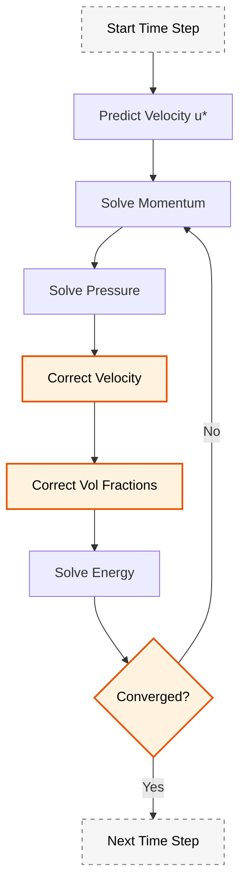
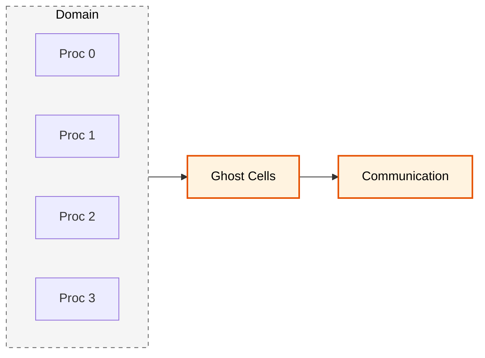

# ภาพรวม Solver (Solver Overview)

## บทนำ

**MultiphaseEulerFoam** เป็น **Solver ขั้นสูง** ใน OpenFOAM ที่ออกแบบมาเพื่อจำลองการไหลแบบ **Multiphase แบบ Eulerian** แบบขาเปลี่ยนตามเวลา ซอล์ฟเวอร์นี้ใช้แนวทาง **Eulerian-Eulerian** ซึ่งแต่ละเฟสถูกพิจารณาเป็น **interpenetrating continua** ที่มีชุดสมการการอนุรักษ์แยกกัน ทำให้สามารถจำลองปรากฏการณ์ multiphase ที่ซับซ้อนด้วยการปฏิบัติทางคณิตศาสตร์ที่เข้มงวดได้

> [!INFO] **Eulerian-Eulerian Approach**
> ในแนวทางนี้ ทุกเฟสถูกพิจารณาเป็นตัวกลางต่อเนื่องที่แทรกซึมซึ่งกันและกัน แต่ละเฟสมีชุดสมการการอนุรักษ์ของตัวเอง และมีการแลกเปลี่ยนโมเมนตัม มวล และพลังงานระหว่างเฟส

---

## ความสามารถหลัก

MultiphaseEulerFoam แก้สมการสำหรับ:

### หลายเฟส (Multiple Phases)
ซอล์ฟเวอร์จัดการกับ **จำนวนเฟสโดยพลการ** โดยแต่ละเฟสมี:
- สนามความเร็ว $\mathbf{u}_k$
- สนามความดัน $p_k$
- สนามอุณหภูมิ $T_k$
- ปริมาตรส่วน $\alpha_k$

### การถ่ายโอนโมเมนตัมระหว่างเฟส (Inter-phase Momentum Transfer)
ซอล์ฟเวอร์รวม **กลไกการแลกเปลี่ยนโมเมนตัมระหว่างเฟส** ที่ครอบคลุม:
- แรงลากตัว $\mathbf{F}_{\text{drag}}$
- แรงยก $\mathbf{F}_{\text{lift}}$
- แรงเสมือนมวล $\mathbf{F}_{\text{vm}}$

### การถ่ายโอนความร้อนและมวล (Heat & Mass Transfer)
การแลกเปลี่ยนความร้อนและมวลระหว่างเฟสถูกจำลองผ่าน:
- สัมประสิทธิ์การถ่ายโอนความร้อน
- อัตราการถ่ายโอนมวล $\dot{m}_{lk}$

### การจำลองความปั่นป่วน (Turbulence Modeling)
ซอล์ฟเวอร์บูรณาการ **รูปแบบความปั่นป่วน multiphase** ที่คำนึงถึงผลของเฟสกระจายต่อการขนส่งความปั่นป่วน

### ปรากฏการณ์การเปลี่ยนเฟส (Phase Change)
ซอล์ฟเวอร์สามารถจำลองกระบวนการเปลี่ยนเฟสผ่านกลไกการถ่ายโอนมวลที่อนุรักษ์มวลทั้งหมด

---

## ประเภทระบบที่รองรับ

| ประเภทระบบ | คำอธิบาย | ตัวอย่างการประยุกต์ใช้ |
|---|---|---|
| **แก๊ส-ของเหลว** | สองเฟสที่มีความหนาแน่นต่างกันมาก | Bubble columns, การเดินอากาศ |
| **ของเหลว-ของเหลว** | ของเหลวที่ไม่ผสมกัน | Oil-water separation |
| **ของแข็ง-ของไหล** | อนุภาคของแข็งในของไหล | Fluidized beds, slurry flows |

---

## การนำสมการควบคุมไปใช้งาน

ซอล์ฟเวอร์นำ **สมการการอนุรักษ์** ที่ได้จากวิธีการ **averaging ตามปริมาตร** มาใช้ โดยแต่ละเฟส $k$ ครอบครองส่วน $\alpha_k$ ของปริมาตรควบคุม โดยเป็นไปตามเงื่อนไข:

$$\sum_{k=1}^{N} \alpha_k = 1$$

สมการถูก discretization โดยใช้ **วิธีการปริมาตรจำกัด** พร้อมการจัดการเฉพาะทางสำหรับเทอมระหว่างเฟสเพื่อให้แน่ใจว่าได้รับเสถียรภาพเชิงตัวเลข

### การอนุรักษ์มวล (Mass Conservation)

สำหรับแต่ละเฟส $k$ สมการการอนุรักษ์มวลคำนึงถึงการสะสมในพื้นที่ การขนส่ง convection และการถ่ายโอนมวลระหว่างเฟส:

$$\frac{\partial (\alpha_k \rho_k)}{\partial t} + \nabla \cdot (\alpha_k \rho_k \mathbf{u}_k) = \sum_{l=1}^{N} \dot{m}_{lk}$$

**ตัวแปรในสมการ:**
- $\alpha_k$ คือ **ปริมาตรส่วน** ของเฟส $k$ (ไร้มิติ, $0 \leq \alpha_k \leq 1$)
- $\rho_k$ คือ **ความหนาแน่น** ของเฟส $k$ (kg/m³)
- $\mathbf{u}_k$ คือ **เวกเตอร์ความเร็ว** ของเฟส $k$ (m/s)
- $\dot{m}_{lk}$ แทน **อัตราการถ่ายโอนมวล** จากเฟส $l$ ไปยังเฟส $k$ (kg/m³·s)

**เงื่อนไขการอนุรักษ์มวลโดยรวม:**
$$\sum_{k=1}^{N} \sum_{l=1}^{N} \dot{m}_{lk} = 0$$

### การอนุรักษ์โมเมนตัม (Momentum Conservation)

สมการโมเมนตัมสำหรับเฟส $k$ ประกอบด้วยเกรเดียนต์ความดัน แรงหนืด ผลของความโน้มถ่วง และการแลกเปลี่ยนโมเมนตัมระหว่างเฟส:

$$\frac{\partial (\alpha_k \rho_k \mathbf{u}_k)}{\partial t} + \nabla \cdot (\alpha_k \rho_k \mathbf{u}_k \mathbf{u}_k) = -\alpha_k \nabla p + \nabla \cdot \boldsymbol{\tau}_k + \alpha_k \rho_k \mathbf{g} + \mathbf{M}_k$$

**ตัวแปรในสมการ:**
- $p$ คือ **สนามความดันร่วม** (Pa) ซึ่งสันนิษฐานว่าอยู่ในภาวะสมดุลกลไกทั่วเฟส
- $\boldsymbol{\tau}_k$ คือ **เทนเซอร์ความเค้นแบบหนืด** สำหรับเฟส $k$ (Pa)
- $\mathbf{g}$ คือ **เวกเตอร์ความเร่งโน้มถ่วง** (m/s²)
- $\mathbf{M}_k$ คือ **เทอมการถ่ายโอนโมเมนตัมระหว่างเฟสโดยรวม** (N/m³)
- $\mu_k$ คือ **ความหนืดไดนามิก** ของเฟส $k$ (Pa·s)
- $\mathbf{I}$ คือ **เทนเซอร์เอกลักษณ์**

**เทนเซอร์ความเค้นแบบหนืด:**
$$\boldsymbol{\tau}_k = \mu_k (\nabla \mathbf{u}_k + \nabla \mathbf{u}_k^T) - \frac{2}{3}\mu_k (\nabla \cdot \mathbf{u}_k)\mathbf{I}$$

**เทอมการถ่ายโอนโมเมนตัมระหว่างเฟส:**
$$\mathbf{M}_k = \sum_{l=1}^{N} K_{kl}(\mathbf{u}_l - \mathbf{u}_k) + \sum_{l=1}^{N} \mathbf{L}_{kl}(\mathbf{u}_l - \mathbf{u}_k) + \sum_{l=1}^{N} C_{vm,kl}\left(\frac{\mathrm{d}\mathbf{u}_l}{\mathrm{d}t} - \frac{\mathrm{d}\mathbf{u}_k}{\mathrm{d}t}\right)$$

โดยที่:
- $K_{kl}$ คือ **สัมประสิทธิ์แรงลากตัว**
- $\mathbf{L}_{kl}$ แทน **แรงยก**
- $C_{vm,kl}$ คือ **สัมประสิทธิ์แรงเสมือนมวล**

### การอนุรักษ์พลังงาน (Energy Conservation)

สมการพลังงานคำนึงถึงการขนส่นพลังงานความร้อน การนำความร้อน การสลายตัวแบบหนืด และการถ่ายโอนความร้อนระหว่างเฟส:

$$\frac{\partial (\alpha_k \rho_k E_k)}{\partial t} + \nabla \cdot (\alpha_k \rho_k H_k \mathbf{u}_k) = \nabla \cdot (k_k \nabla T_k) + Q_k$$

**ตัวแปรพลังงาน:**
- $E_k = e_k + \frac{1}{2}|\mathbf{u}_k|^2$ คือ **พลังงานรวมต่อหน่วยมวล** ของเฟส $k$ (J/kg)
- $H_k = h_k + \frac{1}{2}|\mathbf{u}_k|^2$ คือ **เอนทัลปีรวมต่อหน่วยมวล** ของเฟส $k$ (J/kg)
- $e_k$ คือ **พลังงานภายในต่อหน่วยมวล** (J/kg)
- $h_k$ คือ **เอนทัลปีเฉพาะ** (J/kg)

**ตัวแปรความร้อน:**
- $k_k$ คือ **ความนำความร้อน** ของเฟส $k$ (W/m·K)
- $T_k$ คือ **อุณหภูมิ** ของเฟส $k$ (K)
- $Q_k$ แทน **การถ่ายโอนความร้อนระหว่างเฟส** ไปยังเฟส $k$ (W/m³)

**การถ่ายโอนความร้อนระหว่างเฟส:**
$$Q_k = \sum_{l=1}^{N} h_{kl} A_{kl} (T_l - T_k)$$

โดยที่ $h_{kl}$ คือ **สัมประสิทธิ์การถ่ายโอนความร้อนระหว่างเฟส** และ $A_{kl}$ คือ **ความหนาแน่นพื้นผิวระหว่างเฟส** $k$ และ $l$

---

## การนำไปใช้เชิงตัวเลข (Numerical Implementation)

MultiphaseEulerFoam ใช้อัลกอริทึม **PIMPLE (PISO-SIMPLE)** สำหรับการ coupling ความดัน-ความเร็ว โดยให้การจำลองขาเปลี่ยนแปลงตามเวลาที่แข็งแกร่งด้วยการปรับก้าวเวลา



### คุณสมบัติการแก้ปัญหาเชิงตัวเลข

| คุณสมบัติ | คำอธิบาย | ผลกระทบ |
|---|---|---|
| **Segregated solution** | สมการโมเมนตัมของแต่ละเฟสถูกแก้ตามลำดับ | ลดหน่วยความจำ แต่ต้องการ iterations มากขึ้น |
| **Implicit treatment** | การจัดการเทอม coupling ระหว่างเฟสโดยนัย | เพิ่มเสถียรภาพเชิงตัวเลข |
| **Pressure-velocity coupling** | ผ่านอัลกอริทึม PIMPLE | ทำให้การคำนวณเสถียร |
| **Under-relaxation** | กลยุทธ์การผ่อนความเร็ว | ทำให้มั่นใจในการบรรจบกันของระบบที่แข็ง |
| **Adaptive time stepping** | ปรับก้าวเวลาโดยยึดตามจำนวน Courant | รักษาเสถียรภาพและประสิทธิภาพ |

### ขั้นตอนอัลกอริทึม PIMPLE

1. **การคาดการณ์ (Prediction)**
   - คาดการณ์ความเร็วของแต่ละเฟส: $\mathbf{u}_k^{*}$
   - คาดการณ์ปริมาตรส่วน: $\alpha_k^{*}$

2. **การแก้โมเมนตัม (Momentum Solve)**
   - แก้สมการโมเมนตัมสำหรับแต่ละเฟส $k$
   - พิจารณาเทอม coupling ระหว่างเฟสโดยนัย

3. **การแก้ความดัน (Pressure Correction)**
   - สร้างและแก้สมการความดันร่วม
   - แก้ไขความเร็วเพื่อให้เป็นไปตามการอนุรักษ์มวล

4. **การแก้ปริมาตรส่วน (Volume Fraction Correction)**
   - แก้ไขปริมาตรส่วนให้เป็นไปตามเงื่อนไข $\sum \alpha_k = 1$

5. **การแก้พลังงานและสมการอื่นๆ (Energy & Other Equations)**
   - แก้สมการพลังงาน สมการความปั่นป่วน และสมการการถ่ายโอนอื่นๆ

6. **การทำซ้ำ PISO (PISO Loops)**
   - ทำซ้ำขั้นตอน 2-5 เพื่อให้ได้การบรรจบกันของ time step

7. **การทำซ้ำ SIMPLE (SIMPLE Loops)**
   - ทำซ้ำทั้งขั้นตอน 1-6 หากจำเป็นสำหรับความเสถียร

### OpenFOAM Code Implementation

```cpp
// PIMPLE algorithm structure in MultiphaseEulerFoam
while (pimple.loop())
{
    // 1. Momentum predictor (optional)
    if (pimple.momentumPredictor())
    {
        forAll(phases, phasei)
        {
            phases[phasei].UEqn().relax();
        }
    }

    // 2. Momentum coupling
    forAll(phases, phasei)
    {
        // Solve momentum equation for each phase
        phases[phasei].UEqn().solve();
    }

    // 3. Pressure equation
    {
        // Construct and solve pressure equation
        fvScalarMatrix pEqn
        (
            fvm::laplacian(rAUf, p) == fvc::div(phiHbyA)
        );
        pEqn.solve();
    }

    // 4. Volume fraction correction
    forAll(phases, phasei)
    {
        // Correct volume fractions to satisfy sum(alpha) = 1
        phases[phasei].alphaCorrect();
    }

    // 5. Energy equation (if enabled)
    if (solveEnergy)
    {
        forAll(phases, phasei)
        {
            phases[phasei].TEqn().solve();
        }
    }
}
```

**คำอธิบาย:** โค้ดนี้แสดงโครงสร้างหลักของอัลกอริทึม PIMPLE ใน MultiphaseEulerFoam ซึ่งทำงานเป็นวงจรซ้ำจนกว่าจะบรรจบกัน โดยในแต่ละรอบจะทำการแก้สมการโมเมนตัม ความดัน ปริมาตรส่วน และพลังงานตามลำดับ

**แหล่งที่มา:** `.applications/solvers/multiphase/multiphaseEulerFoam/`

**แนวคิดสำคัญ:**
- **PIMPLE Loop**: การวนซ้ำแบบ PISO-SIMPLE เพื่อให้ได้การบรรจบกันของความดันและความเร็ว
- **Momentum Predictor**: การคาดการณ์ความเร็วเบื้องต้นเพื่อเพิ่มเสถียรภาพ
- **Volume Fraction Correction**: การแก้ไขปริมาตรส่วนให้สอดคล้องกับเงื่อนไข $\sum \alpha_k = 1$

---

## การประยุกต์ใช้งาน (Applications)

ซอล์ฟเวอร์นี้เหมาะอย่างยิ่งสำหรับ:

| การประยุกต์ใช้ | ลักษณะเฉพาะ | ความท้าทาย |
|---|---|---|
| **Bubble columns** | ฟองแก๊สในของเหลว | การจำลอง interaction ของฟองจำนวนมาก |
| **Fluidized beds** | อนุภาคของแข็งในกระแสแก๊ส | การจัดการความหนาแน่นสูงของอนุภาค |
| **Sprays** | หยดของเหลวในแก๊ส | การเปลี่ยนเฟสและ surface tension |
| **Slurry flows** | อนุภาคของแข็งในของเหลว | ความหนืดต่ำและการจมตัว |

### ข้อดีเมื่อเปรียบเทียบกับแนวทาง Lagrangian

- **ประสิทธิภาพการคำนวณสำหรับความเข้มสูง**: เหมาะสำหรับความเข้มของเฟสกระจาย > 10%
- **การจัดการ coupling ระหว่างเฟสโดยธรรมชาติ**: สมการ coupling ถูกฝังอยู่ในการกำหนดรูปแบบ
- **ความสามารถในการปรับขนาด**: ใช้หน่วยความจำน้อยกว่าการติดตามอนุภาคแต่ละตัว
- **เสถียรภาพเชิงตัวเลขที่ดีขึ้น**: การจัดการโดยนัยของ coupling ทำให้การคำนวณมีเสถียรภาพ

---

## สถาปัตยกรรมโปรแกรม

MultiphaseEulerFoam เป็นตัวอย่างของ **สถาปัตยกรรม C++ แบบเทมเพลต** ขั้นสูงที่มี **โมเดลฟิสิกส์ที่เลือกได้ในรันไทม์** เพื่อความยืดหยุ่นสูงสุด

### รากฐานคณิตศาสตร์

โปรแกรมแก้สมการนี้ใช้ **แนวทางหลายเฟสแบบออยเลอร์-ออยเลอร์** โดยแต่ละเฟส $k$ ถือเป็นคอนติลัมที่แทรกซึมกันโดยมีชุดสมการการอนุรักษ์ของตัวเอง

#### สมการต่อเนื่องของเฟส
สำหรับแต่ละเฟส $k$:
$$\frac{\partial (\alpha_k \rho_k)}{\partial t} + \nabla \cdot (\alpha_k \rho_k \mathbf{u}_k) = \sum_{l \neq k} \dot{m}_{lk}$$

โดยที่:
- $\alpha_k$ = สัดส่วนปริมาตรของเฟส (เงื่อนไข: $\sum_k \alpha_k = 1$)
- $\rho_k$ = ความหนาแน่นของเฟส
- $\mathbf{u}_k$ = เวกเตอร์ความเร็วของเฟส
- $\dot{m}_{lk}$ = อัตราการถ่ายโอนมวลจากเฟส $l$ ไปยังเฟส $k$

#### สมการโมเมนตัมของเฟส
สำหรับแต่ละเฟสที่เคลื่อนที่ $k$:
$$\frac{\partial (\alpha_k \rho_k \mathbf{u}_k)}{\partial t} + \nabla \cdot (\alpha_k \rho_k \mathbf{u}_k \mathbf{u}_k) = -\alpha_k \nabla p + \nabla \cdot (\alpha_k \boldsymbol{\tau}_k) + \alpha_k \rho_k \mathbf{g} + \sum_{l \neq k} \mathbf{M}_{lk} + \mathbf{F}_{\sigma,k}$$

โดยที่:
- $p$ = สนามความดันร่วม (ใช้ร่วมกันทุกเฟส)
- $\boldsymbol{\tau}_k$ = เทนเซอร์ความเครียดของเฟส: $\boldsymbol{\tau}_k = \mu_k (\nabla \mathbf{u}_k + \nabla \mathbf{u}_k^T) - \frac{2}{3}\mu_k (\nabla \cdot \mathbf{u}_k)\mathbf{I}$
- $\mathbf{M}_{lk}$ = การถ่ายโอนโมเมนตัมระหว่างอินเตอร์เฟซจากเฟส $l$ ไปยังเฟส $k$
- $\mathbf{F}_{\sigma,k}$ = แรงตึงผิว

#### สมการพลังงานของเฟส
$$\frac{\partial (\alpha_k \rho_k h_k)}{\partial t} + \nabla \cdot (\alpha_k \rho_k \mathbf{u}_k h_k) = \alpha_k \frac{\mathrm{d}p}{\mathrm{d}t} + \nabla \cdot (\alpha_k k_k \nabla T_k) + \sum_{l \neq k} Q_{lk} + \sum_{l \neq k} \dot{m}_{lk} h_{sat}$$

โดยที่:
- $h_k$ = เอนทาลปีจำเพาะของเฟส
- $k_k$ = สัมประสิทธิ์การนำความร้อนของเฟส
- $Q_{lk}$ = การถ่ายโอนความร้อนรับรู้จากเฟส $l$ ไปยังเฟส $k$
- $h_{sat}$ = เอนทาลปีแฟชัน (สำหรับการเปลี่ยนเฟส)

---

## การจัดการหน่วยความจำและประสิทธิภาพ

### การจัดสรรหน่วยความจำของ Field

#### รูปแบบการจัดสรรแบบ Lazy Allocation

**Lazy Allocation** เป็นพื้นฐานของประสิทธิภาพหน่วยความจำของ OpenFOAM แทนที่จะจัดสรร field ทั้งหมดล่วงหน้า ทรัพยากรจะถูกสงวนไว้และสร้างขึ้นจริงเมื่อจำเป็นต้องใช้เท่านั้น

#### ประโยชน์หลัก
- **ลดขนาดหน่วยความจำที่ใช้**: จัดสรรเฉพาะ field ที่ใช้จริงเท่านั้น
- **การเริ่มต้นที่เร็วขึ้น**: หลีกเลี่ยงการสร้างที่มีค่าใช้จ่ายสูงระหว่างการตั้งค่า
- **การจัดการทรัพยากรที่ยืดหยุ่น**: Field สามารถสร้างและทำลายได้อย่างไดนามิก

### Smart Pointer แบบ Reference-Counted

OpenFOAM ใช้ pointer แบบ reference-counted อย่างแพร่หลายสำหรับการจัดการหน่วยความจำอัตโนมัติ

```cpp
// tmp<T> - Automatic memory management
tmp<volScalarField> tfield = new volScalarField(mesh, dimensionedScalar("zero", dimless, 0.0));

// Auto-destruction when tfield goes out of scope
volScalarField& field = tfield.ref();
```

**คำอธิบาย:** คลาส `tmp` ใน OpenFOAM ให้การจัดการหน่วยความจำอัตโนมัติผ่านกลไก reference counting ซึ่งช่วยป้องกันการรั่วไหลของหน่วยความจำและทำลายออบเจ็กต์โดยอัตโนมัติเมื่อไม่มีการใช้งานอีกต่อไป

**แหล่งที่มา:** `.applications/solvers/multiphase/multiphaseEulerFoam/`

**แนวคิดสำคัญ:**
- **Reference Counting**: การนับจำนวนการอ้างอิงเพื่อกำหนดว่าจำเป็นต้องทำลายออบเจ็กต์หรือไม่
- **Automatic Destruction**: การทำลายออบเจ็กต์อัตโนมัติเมื่อไม่มีการอ้างอิงเหลืออยู่
- **Memory Efficiency**: การประหยัดหน่วยความจำด้วยการแชร์ข้อมูลระหว่างส่วนต่างๆ ของโปรแกรม

---

## การคำนวณแบบขนาน

### การแบ่งโดเมน (Domain Decomposition)

การนำไปใช้งานแบบขนานในการจำลองหลายเฟสของ OpenFOAM พึ่งพากลยุทธ์การแบ่งโดเมนที่ซับซ้อนเพื่อกระจายภาระการคำนวณไปยังหน่วยประมวลผลหลายๆ ตัว

### แนวทางพื้นฐาน

- **การแบ่งพื้นที่คำนวณ** ออกเป็นโดเมนย่อยๆ แต่ละโดเมนมอบหมายให้กับหน่วยประมวลผลที่ต่างกัน
- **กลไกการสื่อสาร** ที่เหมาะสมเพื่อรักษาความต่อเนื่องของสนาม
- **ความถูกต้องเชิงตัวเลข** ข้ามขอบเขตของหน่วยประมวลผล



### การทำสมดุลภาระ (Load Balancing)

การทำสมดุลภาระที่มีประสิทธิภาพเป็นสิ่งจำเป็นสำหรับการบรรลุประสิทธิภาพแบบขนานที่เหมาะสมที่สุดในการจำลองการไหลของหลายเฟส

### ความท้าทายของภาระการคำนวณ

ภาระการคำนวณอาจแตกต่างกันอย่างมากระหว่างเฟสต่างๆ เนื่องจาก:
- **ความแตกต่างในฟิสิกส์** ระหว่างเฟส
- **ความละเอียดของ mesh** ที่แตกต่างกัน
- **การกระจายตัวของเฟส** ในโดเมนคำนวณ

---

## การออกแบบระบบเฟส (Phase System Design)

### ลำดับชั้นของระบบเฟส

โปรแกรมแก้สมการใช้ **ระบบการจัดการเฟสแบบลำดับชั้น**:

```cpp
#include "phaseSystem.H"                          // Main phase management
#include "phaseCompressibleMomentumTransportModel.H"  // Phase-specific turbulence
```

**คำอธิบาย:** ไฟล์ส่วนหัวเหล่านี้กำหนดสถาปัตยกรรมพื้นฐานสำหรับการจัดการระบบหลายเฟส โดย `phaseSystem.H` เป็นคลาสหลักที่ควบคุมการโต้ตอบระหว่างเฟส และ `phaseCompressibleMomentumTransportModel.H` จัดการโมเดลความปั่นป่วนเฉพาะเฟส

**แหล่งที่มา:** `.applications/solvers/multiphase/multiphaseEulerFoam/phaseSystems/phaseSystem/`

**แนวคิดสำคัญ:**
- **Phase Management**: การจัดการเฟสหลายเฟสผ่านสถาปัตยกรรมเชิงวัตถุ
- **Momentum Transport**: การขนส่งโมเมนตัมเฉพาะเฟส
- **Modular Design**: การออกแบบแบบโมดูลาร์เพื่อความยืดหยุ่น

**phaseSystem.H** กำหนด **สถาปัตยกรรมพื้นฐาน**:
- **ตารางแฮช** สำหรับการถ่ายโอนระหว่างอินเตอร์เฟซ: `momentumTransferTable`, `heatTransferTable`, `specieTransferTable`
- **พจนานุกรมโมเดลเฟส**: `PtrListDictionary<phaseModel>` สำหรับการเข้าถึงเฟสแบบเป็นระเบียบ
- **การจัดการอินเตอร์เฟซ**: `phaseInterfaceKey` สำหรับการระบุคู่เฟส

### รูปแบบการออกแบบแบบเทมเพลต

สถาปัตยกรรมนี้ใช้ **เทมเพลต C++ อย่างกว้างขวาง** เพื่อ **การปรับแต่งในระหว่างคอมไพล์** และ **ความยืดหยุ่นในรันไทม์**

#### เทมเพลตโมเดลเฟส
- **เฟสอัดตัวไม่ได้**: สมการสถานะ `isochoric`
- **เฟสอัดตัวได้**: สมการสถานะ `perfectGas`, `realGas`
- **การขนส่งชนิด**: โมเดลเฟสหลายส่วนประกอบ
- **โมเดลปฏิกิริยา**: ปฏิกิริยาเคมีภายในเฟส

#### เทมเพลตระบบการถ่ายโอน
- **HeatTransferPhaseSystem**: การเชื่อมต่อความร้อนกับความร้อนแฝง
- **MomentumTransferPhaseSystem**: แรงลาก แรงยก มวลเสมือน การกระจายตัวแบบปั่นป่วน
- **MassTransferPhaseSystem**: การระเหย การควบแน่น การเกิดโพรง

---

## การคำนวณ Flux ระหว่างเฟส

### การคำนวณผลรวม Flux

ในระบบหลายเฟส การคำนวณ flux รวมเป็นสิ่งสำคัญเพื่อรักษาความสมดุลของมวล:

```cpp
// Calculate total flux from all phases
Foam::tmp<Foam::surfaceScalarField> Foam::phaseSystem::calcPhi
(
    const phaseModelList& phaseModels
) const
{
    // Initialize flux with first phase contribution
    tmp<surfaceScalarField> tmpPhi
    (
        surfaceScalarField::New
        (
            "phi",
            fvc::interpolate(phaseModels[0])*phaseModels[0].phi()
        )
    );

    // Add contributions from remaining phases
    for (label phasei=1; phasei<phaseModels.size(); phasei++)
    {
        tmpPhi.ref() +=
            fvc::interpolate(phaseModels[phasei])*phaseModels[phasei].phi();
    }

    return tmpPhi;
}
```

**คำอธิบาย:** ฟังก์ชัน `calcPhi` ใช้สำหรับคำนวณผลรวมของ flux จากทุกเฟส โดยเริ่มจากการเริ่มต้นด้วย flux ของเฟสแรก จากนั้นบวกเพิ่ม flux ของเฟสอื่นๆ ทีละเฟสจนครบทุกเฟส

**แหล่งที่มา:** `.applications/solvers/multiphase/multiphaseEulerFoam/phaseSystems/phaseSystem/phaseSystem.C`

**แนวคิดสำคัญ:**
- **Flux Calculation**: การคำนวณ flux รวมจากทุกเฟส
- **Phase Interpolation**: การประมาณค่า phase ไปยัง surface
- **Conservative Summation**: การรวมแบบอนุรักษ์ค่า

### การคำนวณปริมาตรส่วนรวมของเฟสที่เคลื่อนที่

```cpp
// Calculate sum of volume fractions for moving phases
Foam::tmp<Foam::volScalarField> Foam::phaseSystem::sumAlphaMoving() const
{
    // Initialize with first moving phase
    tmp<volScalarField> sumAlphaMoving
    (
        volScalarField::New
        (
            "sumAlphaMoving",
            movingPhaseModels_[0],
            calculatedFvPatchScalarField::typeName
        )
    );

    // Add remaining moving phases
    for
    (
        label movingPhasei=1;
        movingPhasei<movingPhaseModels_.size();
        movingPhasei++
    )
    {
        sumAlphaMoving.ref() += movingPhaseModels_[movingPhasei];
    }

    return sumAlphaMoving;
}
```

**คำอธิบาย:** ฟังก์ชัน `sumAlphaMoving` คำนวณผลรวมของปริมาตรส่วนของเฟสที่เคลื่อนที่ทั้งหมด ซึ่งมีประโยชน์สำหรับการตรวจสอบเงื่อนไข $\sum \alpha_k = 1$

**แหล่งที่มา:** `.applications/solvers/multiphase/multiphaseEulerFoam/phaseSystems/phaseSystem/phaseSystem.C`

**แนวคิดสำคัญ:**
- **Moving Phases**: เฟสที่มีการเคลื่อนที่ (ไม่ใช่ stationary phase)
- **Volume Fraction Sum**: ผลรวมของปริมาตรส่วน
- **Constraint Enforcement**: การบังคับใช้เงื่อนไข $\sum \alpha_k = 1$

---

## การแก้ไขความเร็วและ Flux

### การปรับความเร็วผสม

```cpp
// Set mixture velocity field
void Foam::phaseSystem::setMixtureU(const volVectorField& Um0)
{
    // Calculate the mean velocity difference with respect to Um0
    // from the current velocity of the moving phases
    volVectorField dUm(Um0);

    forAll(movingPhaseModels_, movingPhasei)
    {
        dUm -=
            movingPhaseModels_[movingPhasei]
           *movingPhaseModels_[movingPhasei].U();
    }

    forAll(movingPhaseModels_, movingPhasei)
    {
        movingPhaseModels_[movingPhasei].URef() += dUm;
    }
}
```

**คำอธิบาย:** ฟังก์ชันนี้ใช้สำหรับปรับความเร็วของแต่ละเฟสให้สอดคล้องกับความเร็วผสมที่กำหนด โดยคำนวณความแตกต่างจากความเร็วเป้าหมายและกระจายไปยังทุกเฟส

**แหล่งที่มา:** `.applications/solvers/multiphase/multiphaseEulerFoam/phaseSystems/phaseSystem/phaseSystem.C`

**แนวคิดสำคัญ:**
- **Mixture Velocity**: ความเร็วผสมของทุกเฟส
- **Velocity Correction**: การแก้ไขความเร็วของแต่ละเฟส
- **Mass Conservation**: การอนุรักษ์มวล

### การปรับ Flux ผสม

```cpp
// Set mixture flux field
void Foam::phaseSystem::setMixturePhi
(
    const PtrList<surfaceScalarField>& alphafs,
    const surfaceScalarField& phim0
)
{
    // Calculate the mean flux difference with respect to phim0
    // from the current flux of the moving phases
    surfaceScalarField dphim(phim0);

    forAll(movingPhaseModels_, movingPhasei)
    {
        dphim -=
            alphafs[movingPhaseModels_[movingPhasei].index()]
           *movingPhaseModels_[movingPhasei].phi();
    }

    forAll(movingPhaseModels_, movingPhasei)
    {
        movingPhaseModels_[movingPhasei].phiRef() += dphim;
    }
}
```

**คำอธิบาย:** ฟังก์ชันนี้ใช้สำหรับปรับ flux ของแต่ละเฟสให้สอดคล้องกับ flux ผสมที่กำหนด ซึ่งสำคัญสำหรับการรักษาความสมดุลของมวลในระบบหลายเฟส

**แหล่งที่มา:** `.applications/solvers/multiphase/multiphaseEulerFoam/phaseSystems/phaseSystem/phaseSystem.C`

**แนวคิดสำคัญ:**
- **Flux Correction**: การแก้ไข flux ของแต่ละเฟส
- **Surface Flux**: flux ที่ผิวของเซลล์
- **Phase Fraction at Surface**: ปริมาตรส่วนที่ผิว

---

## สรุป

สถาปัตยกรรมของ **MultiphaseEulerFoam** แสดงให้เห็นถึงการนำหลักการของพลศาสตร์ของไหลเชิงคำนวณมาประยุกต์ใช้อย่างยอดเยี่ยมผ่านแนวปฏิบัติทางวิศวกรรมซอฟต์แวร์ที่ซับซ้อน การออกแบบของ Solver นี้เป็นการผสมผสานระหว่างทฤษฎีฟิสิกส์การไหลแบบหลายเฟสกับการคำนวณเชิงตัวเลขที่เป็นประโยชน์อย่างชาญฉลาด

### ความเป็นเลิศด้านการคำนวณ

สถาปัตยกรรมของ Solver สามารถแปลงฟิสิกส์ที่ซับซ้อนของการไหลแบบหลายเฟส Eulerian-Eulerian มาเป็นกรอบการทำงานที่แข็งแกร่งได้สำเร็จผ่าน

**หลักการสำคัญ:**
- **ความเข้มงวดทางคณิตศาสตร์**: รักษาหลักการอนุรักษ์ในขณะที่นำวิธีการเชิงตัวเลขที่เป็นประโยชน์มาใช้
- **เสถียรภาพทางตัวเลข**: ใช้รูปแบบตัวเลขที่จำกัดขอบเขตและกลยุทธ์ under-relaxation สำหรับความแข็งแกร่งของการลู่เข้า
- **ประสิทธิภาพการคำนวณ**: ปรับแบบรูปแบบการเข้าถึงหน่วยความจำและลดการคำนวณซ้ำซ้อน
- **ความสามารถในการขยาย**: ให้ส่วนติดต่อที่ชัดเจนสำหรับนำโมเดลฟิสิกส์และวิธีการเชิงตัวเลขใหม่ๆ มาใช้

### ผลกระทบและการใช้งาน

MultiphaseEulerFoam ทำหน้าที่เป็น Solver หลักสำหรับการใช้งานในอุตสาหกรรมที่หลากหลาย

| อุตสาหกรรม | การประยุกต์ใช้ | ตัวอย่าง |
|-------------|----------------|----------|
| **การประมวลผลเคมี** | การออกแบบและการเพิ่มประสิทธิภาพเครื่องปฏิกรณ์ | ปฏิกิริยาหลายเฟส, การผสม |
| **ระบบพลังงาน** | การเดือด, การควบแน่น และการถ่ายเทความร้อนแบบหลายเฟส | หม้อน้ำ, ระบบทำความเย็น |
| **วิศวกรรมสิ่งแวดล้อม** | การขนส่งมลพิษและการไหลแบบหลายเฟสในสิ่งแวดล้อม | การไหลของน้ำมัน, การกระจายของมลพิษ |
| **อากาศยาน** | ระบบการฉีดเชื้อเพลิงและการเผาไหม้แบบหลายเฟส | ชั้นหมอก, ระบบเชื้อเพลิง |

**สรุปผลกระทบ:**
การผสมผสานระหว่างความซับซ้อนทางทฤษฎีและการนำมาใช้ในทางปฏิบัติทำให้เป็นเครื่องมือที่มีคุณค่าอย่างยิ่งสำหรับการวิจัยทางวิชาการและการใช้งานทางวิศวกรรมอุตสาหกรรม ช่วยก้าวหน้าขั้นสูงสุดในพลศาสตร์ของไหลแบบหลายเฟสเชิงคำนวณ

---

*อ้างอิง: การวิเคราะห์โดยยึดตามไฟล์ซอร์ส OpenFOAM multiphaseEulerFoam.C, phaseSystem.C, HeatTransferPhaseSystem.H, และ phaseSystem.H*