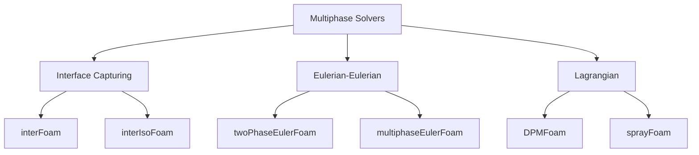
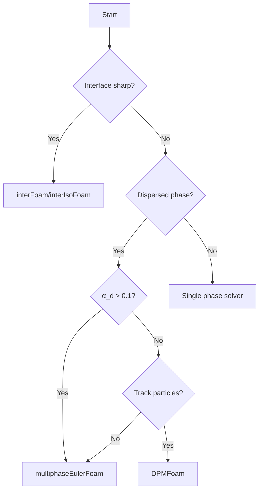

# Solver Overview

ภาพรวม Multiphase Solvers ใน OpenFOAM

---

## Learning Objectives

### What
- Classification of OpenFOAM multiphase solvers by numerical method (VOF, Euler-Euler, Lagrangian)
- Key capabilities, configurations, and use cases for each solver family
- Quick reference tables for solver selection and typical settings

### Why
- Choosing the correct solver is critical for simulation accuracy, stability, and computational efficiency
- Different physical regimes (free surface vs. dispersed vs. dilute) require fundamentally different numerical approaches
- Understanding solver capabilities prevents wasted computation time on inappropriate methods

### How
- Use the decision flowchart and quick selection tables to match your physics to the right solver
- Reference the key file configurations when setting up new cases
- Apply the common settings templates (PIMPLE, alpha controls) as starting points for your simulations

---

## Quick Solver Selection Table

| Scenario | Solver | Method | Key Advantage |
|----------|--------|--------|---------------|
| Free surface, waves, sloshing | `interFoam` | VOF | Sharp interface, mass conserved |
| High-quality interface tracking | `interIsoFoam` | Geometric VOF | Superior interface sharpness |
| Bubble column, stirred tank | `twoPhaseEulerFoam` | Euler-Euler | Efficient for moderate α_d |
| Multi-phase industrial systems | `multiphaseEulerFoam` | Euler-Euler | N phases, KTGF, population balance |
| Fluidized bed, granular flow | `multiphaseEulerFoam` | Euler-Euler + KTGF | Granular temperature modeling |
| Spray, atomization | `sprayFoam` | Euler-Lagrange | Track droplets, breakup |
| Dilute particle flow | `DPMFoam` | Euler-Lagrange | Particle tracking, deposition |

---

## Solver Classification



---

## 1. VOF Solvers (Interface Capturing)

### interFoam

| Property | Value |
|----------|-------|
| Method | Volume of Fluid (VOF) |
| Phases | 2 (immiscible) |
| Interface | Sharp, tracked |
| Use Case | Free surface, waves, sloshing |

```bash
# Run
interFoam
```

#### Key Files

| File | Purpose |
|------|---------|
| `constant/transportProperties` | Phase properties, σ |
| `0/alpha.water` | Initial phase distribution |
| `system/setFieldsDict` | Initialize α field |

### interIsoFoam

- **Geometric VOF** for sharper interfaces
- Better mass conservation
- Computationally more expensive than interFoam

---

## 2. Eulerian Solvers

### twoPhaseEulerFoam

| Property | Value |
|----------|-------|
| Method | Euler-Euler |
| Phases | 2 |
| Coupling | Interphase forces |
| Use Case | Bubbly flow, fluidized beds |

### multiphaseEulerFoam

| Property | Value |
|----------|-------|
| Method | Euler-Euler |
| Phases | N (any number) |
| Features | KTGF, population balance |
| Use Case | Complex industrial systems |

#### Key Files

| File | Purpose |
|------|---------|
| `constant/phaseProperties` | Phases, interphase models |
| `constant/turbulenceProperties.*` | Turbulence per phase |
| `0/alpha.*`, `0/U.*` | Phase fields |

---

## 3. Lagrangian Solvers

### DPMFoam

| Property | Value |
|----------|-------|
| Method | Euler-Lagrange |
| Continuous | Eulerian fluid |
| Dispersed | Lagrangian particles |
| Use Case | Dilute particle-laden flows |

#### Key Files

| File | Purpose |
|------|---------|
| `constant/kinematicCloudProperties` | Particle properties |
| `constant/injectionProperties` | Injection settings |

### sprayFoam

- Specialized for atomization and sprays
- Includes breakup, evaporation models
- Often used in combustion applications

---

## 4. Solver Selection Guide



### Quick Selection

| Scenario | Solver |
|----------|--------|
| Free surface, waves | `interFoam` |
| Bubble column | `multiphaseEulerFoam` |
| Fluidized bed | `multiphaseEulerFoam` + KTGF |
| Spray | `sprayFoam` |
| Particles in air | `DPMFoam` |

---

## 5. Common Settings

### PIMPLE (Euler-Euler)

```cpp
PIMPLE
{
    nOuterCorrectors    3;
    nCorrectors         2;
    nNonOrthogonalCorrectors 1;
}
```

### Alpha Equation

```cpp
// system/fvSolution
"alpha.*"
{
    nAlphaCorr      1;
    nAlphaSubCycles 2;
    cAlpha          1;      // Interface compression
}
```

---

## 6. Running Solvers

```bash
# Serial
interFoam

# Parallel
decomposePar
mpirun -np 4 multiphaseEulerFoam -parallel
reconstructPar
```

### Typical Workflow

1. `blockMesh` - Create mesh
2. `setFields` - Initialize α
3. `<solver>` - Run simulation
4. `paraFoam` - Visualize

---

## Quick Reference

| Solver | Method | Phases | Best For |
|--------|--------|--------|----------|
| `interFoam` | VOF | 2 | Free surface |
| `interIsoFoam` | Geometric VOF | 2 | Sharp interface |
| `twoPhaseEulerFoam` | Euler-Euler | 2 | Bubbly/dispersed |
| `multiphaseEulerFoam` | Euler-Euler | N | Industrial systems |
| `DPMFoam` | Euler-Lagrange | 2 | Dilute particles |

---

## Concept Check

<details>
<summary><b>1. VOF กับ Euler-Euler ต่างกันอย่างไร?</b></summary>

- **VOF**: Track **interface position** ด้วย α ∈ [0,1] — 1 bubble ใช้หลาย cells
- **Euler-Euler**: Track **volume fraction** — หลาย bubbles/particles เฉลี่ยใน 1 cell
</details>

<details>
<summary><b>2. เมื่อไหร่ใช้ Lagrangian approach?</b></summary>

เมื่อ **α_d < 0.1** (dilute) และต้องการ **track individual particles** — เช่น spray, particle deposition
</details>

<details>
<summary><b>3. cAlpha คืออะไร?</b></summary>

**Interface compression coefficient** — ค่าสูง (1-2) ทำให้ interface sharp ขึ้น แต่อาจ cause numerical issues
</details>

---

## Related Documents

- **ภาพรวม:** [00_Overview.md](00_Overview.md)
- **Code and Model Architecture:** [02_Code_and_Model_Architecture.md](02_Code_and_Model_Architecture.md)
- **Algorithm Flow:** [03_Algorithm_Flow.md](03_Algorithm_Flow.md)
- **Parallel Implementation:** [04_Parallel_Implementation.md](04_Parallel_Implementation.md)