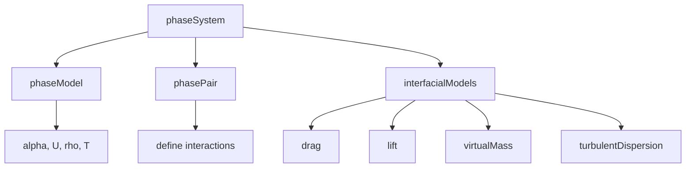
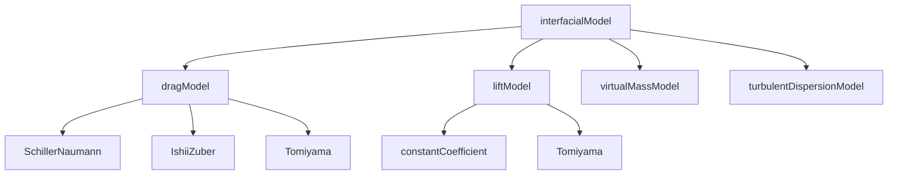

# Model Architecture

สถาปัตยกรรมโมเดลใน multiphaseEulerFoam

---

## Overview



---

## 1. Core Classes

### phaseSystem

| Responsibility | Description |
|----------------|-------------|
| Manage phases | Store all phase models |
| Track pairs | Define which phases interact |
| Solve equations | Call α, U, p, E solvers |

### phaseModel

| Field | Type |
|-------|------|
| `alpha` | `volScalarField` |
| `U` | `volVectorField` |
| `rho` | `volScalarField` |
| `thermo` | `rhoThermo` |

### phasePair

- รู้จัก **dispersed** และ **continuous** phase
- คำนวณ relative velocity, Re, Eo

---

## 2. Runtime Selection

### Factory Pattern

```cpp
// Base class provides factory
autoPtr<dragModel> dragModel::New
(
    const dictionary& dict,
    const phasePair& pair
)
{
    return autoPtr<dragModel>
    (
        runTimeSelectionTable::New(dict, pair)
    );
}
```

### How It Works

1. User specifies `type` in dictionary
2. OpenFOAM looks up in selection table
3. Creates correct derived class

```cpp
// constant/phaseProperties
drag
{
    (air in water)
    {
        type    SchillerNaumann;  // Looked up at runtime
    }
}
```

---

## 3. Interfacial Models

### Hierarchy



### Key Methods

| Model | Method | Returns |
|-------|--------|---------|
| dragModel | `K()` | Exchange coefficient |
| liftModel | `F()` | Force vector field |
| virtualMassModel | `Cvm()` | VM coefficient |

---

## 4. Source Locations

| Component | Path |
|-----------|------|
| Solver | `applications/solvers/multiphase/multiphaseEulerFoam/` |
| Phase system | `src/phaseSystemModels/phaseSystem/` |
| Phase models | `src/phaseSystemModels/phaseModel/` |
| Drag models | `src/phaseSystemModels/interfacialModels/dragModels/` |
| Lift models | `src/phaseSystemModels/interfacialModels/liftModels/` |

---

## 5. Adding Custom Model

### Step 1: Create Class

```cpp
// myDragModel.H
class myDragModel : public dragModel
{
public:
    TypeName("myDrag");

    myDragModel(const dictionary& dict, const phasePair& pair);

    virtual tmp<volScalarField> K() const;
};
```

### Step 2: Register

```cpp
// myDragModel.C
defineTypeNameAndDebug(myDragModel, 0);
addToRunTimeSelectionTable(dragModel, myDragModel, dictionary);
```

### Step 3: Use

```cpp
// constant/phaseProperties
drag
{
    (air in water)
    {
        type    myDrag;
    }
}
```

---

## 6. Template System

### Phase Types

| Template | Use |
|----------|-----|
| `MovingPhaseModel` | Phases with momentum |
| `StationaryPhaseModel` | Wall/fixed phases |
| `InertPhaseModel` | No momentum equation |

### Thermo Types

| Template | Use |
|----------|-----|
| `rhoThermo` | Compressible |
| `psiThermo` | Low Mach |
| `ConstantThermo` | Incompressible |

---

## 7. Memory Management

### Smart Pointers

```cpp
// tmp<T> - reference counted
tmp<volScalarField> K = dragModel_->K();

// autoPtr<T> - exclusive ownership
autoPtr<dragModel> drag_;
```

### Lazy Allocation

- Fields created only when needed
- Reduces memory for unused features

---

## Quick Reference

| Task | Where |
|------|-------|
| Select drag model | `constant/phaseProperties` → `drag` |
| Add custom model | Create class, add to selection table |
| View base class | `src/.../interfacialModels/<model>Model/` |

---

## Concept Check

<details>
<summary><b>1. Runtime selection ทำงานอย่างไร?</b></summary>

OpenFOAM ใช้ **hash table** ที่ map ชื่อ type → constructor function แล้วเรียกสร้าง object ตอน runtime
</details>

<details>
<summary><b>2. phasePair สำคัญอย่างไร?</b></summary>

รู้จัก **ใครเป็น dispersed ใครเป็น continuous** — สำคัญสำหรับคำนวณ Re, Eo และ interphase forces
</details>

<details>
<summary><b>3. ทำไมต้องใช้ tmp<T>?</b></summary>

**Automatic memory management** — ไม่ต้อง delete เอง, ป้องกัน memory leak
</details>

---

## Related Documents

- **ภาพรวม:** [00_Overview.md](00_Overview.md)
- **Solver Overview:** [01_Solver_Overview.md](01_Solver_Overview.md)
- **Algorithm Flow:** [04_Algorithm_Flow.md](04_Algorithm_Flow.md)