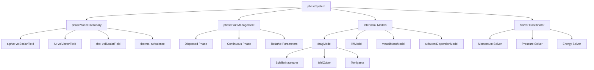
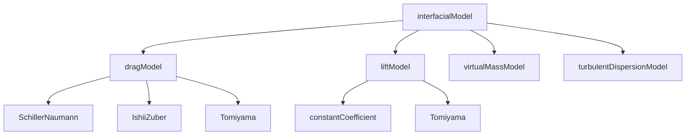

# Code and Model Architecture: multiphaseEulerFoam

สถาปัตยกรรมของ solver และโครงสร้างโมเดลสำหรับการไหลหลายเฟส

---

## Learning Objectives

### What (เนื้อหาที่จะเรียน)
- โครงสร้างคลาสหลักใน multiphaseEulerFoam: phaseModel, phaseSystem, phasePair
- รูปแบบการออกแบบ: Strategy Pattern, Factory Pattern, Smart Pointers
- ลำดับการแก้สมการ (PIMPLE algorithm) และการใช้ fvm vs fvc
- ระบบ interfacial models: drag, lift, virtual mass, turbulent dispersion
- การจัดการหน่วยความจำและ under-relaxation

### Why (ทำไมต้องเรียนรู้)
- **การอ่านและแก้ไข solver**: เข้าใจ architecture ช่วยให้แก้ bug หรือเพิ่มฟีเจอร์ได้อย่างมั่นใจ
- **การเลือกและปรับแต่งโมเดล**: รู้จักตำแหน่งโค้ดช่วยให้ customize interfacial models ได้อย่างถูกต้อง
- **การดีบักและแก้ปัญหา**: เข้าใจ flow ของข้อมูลช่วยให้ trace error และ fix ปัญหาได้เร็วขึ้น
- **การพัฒนา skill ขั้นสูง**: เป็นพื้นฐานสำคัญก่อนไปต่อยอดเรื่อง HPC, advanced turbulence, และ multiphysics

### How (จะนำไปใช้อย่างไร)
- **Navigate source code**: หาไฟล์และคลาสที่ต้องการใน `$FOAM_SRC`
- **Add custom models**: สร้าง drag/lift models ใหม่ด้วย runTimeSelectionTable
- **Debug simulations**: Trace ค่าผ่าน phaseSystem → phaseModel → fields
- **Optimize performance**: ใช้ fvm/fvc และ under-relaxation อย่างเหมาะสม

---

## Architecture Overview



### Class Hierarchy

```
phaseSystem
├── phases_ (PtrListDictionary<phaseModel>)
│   ├── water: phaseModel
│   │   ├── alpha_ (volScalarField)
│   │   ├── U_ (volVectorField)
│   │   ├── rho_ (volScalarField)
│   │   ├── thermo_ (autoPtr<basicThermo>)
│   │   └── turbulence_ (autoPtr<...>)
│   └── air: phaseModel
│       └── ...
├── dragModels_ (HashTable<dragModel>)
├── liftModels_ (HashTable<liftModel>)
├── virtualMassModels_ (HashTable<...>)
└── heatTransferModels_ (HashTable<...>)
```

---

## 1. Core Classes

### 1.1 phaseModel

เก็บข้อมูลของแต่ละเฟส:

```cpp
class phaseModel
{
protected:
    volScalarField alpha_;  // Volume fraction
    volVectorField U_;      // Velocity
    volScalarField rho_;    // Density

    autoPtr<basicThermo> thermo_;
    autoPtr<turbulenceModel> turbulence_;

public:
    const volScalarField& alpha() const { return alpha_; }
    volVectorField& U() { return U_; }

    virtual void correct() = 0;  // Update properties
};
```

**Case file mapping:**
- `alpha_` ← `0/alpha.water`
- `U_` ← `0/U.water`
- `rho_` ← คำนวณจาก `thermo_`

**Phase Templates:**

| Template | Use Case |
|----------|----------|
| `MovingPhaseModel` | Phases with momentum equation |
| `StationaryPhaseModel` | Wall/fixed phases |
| `InertPhaseModel` | No momentum equation |

**Thermo Templates:**

| Template | Use Case |
|----------|----------|
| `rhoThermo` | Compressible flows |
| `psiThermo` | Low Mach number flows |
| `ConstantThermo` | Incompressible flows |

---

### 1.2 phaseSystem

จัดการทุกเฟสและ interphase models:

```cpp
class phaseSystem
{
protected:
    PtrListDictionary<phaseModel> phases_;

    // Interphase models (key = phasePairKey)
    HashTable<autoPtr<dragModel>> dragModels_;
    HashTable<autoPtr<liftModel>> liftModels_;
    HashTable<autoPtr<virtualMassModel>> vmModels_;

public:
    const PtrListDictionary<phaseModel>& phases() const;

    tmp<volVectorField> interfacialMomentumTransfer(
        const phaseModel& phase
    ) const;

    virtual void correct();
};
```

**Responsibilities:**

| Task | Description |
|------|-------------|
| Manage phases | Store all phase models |
| Track pairs | Define which phases interact |
| Solve equations | Call α, U, p, E solvers |
| Interfacial transfer | Sum drag, lift, VM forces |

**Case file mapping:**
- `phases_` ← `constant/phaseProperties`
- `dragModels_` ← `constant/phaseProperties` → `drag { ... }`

---

### 1.3 phasePair

กำหนดความสัมพันธ์ระหว่างเฟส:

```cpp
class phasePair
{
protected:
    const phaseModel& phase1_;
    const phaseModel& phase2_;
    const phaseModel* dispersed_;
    const phaseModel* continuous_;

public:
    const phaseModel& dispersed() const;
    const phaseModel& continuous() const;

    tmp<volScalarField> Re() const;   // Reynolds number
    tmp<volScalarField> Eo() const;   // Eötvös number
};
```

**Key Concepts:**
- รู้จัก **dispersed** และ **continuous** phase
- คำนวณ relative velocity, Re, Eo
- สำคัญสำหรับคำนวณ interphase forces

---

## 2. Runtime Selection (Factory Pattern)

### 2.1 How It Works

1. User specifies `type` in dictionary
2. OpenFOAM looks up in selection table
3. Creates correct derived class

```cpp
// Base class provides factory
autoPtr<dragModel> dragModel::New
(
    const dictionary& dict,
    const phasePair& pair
)
{
    return autoPtr<dragModel>
    (
        runTimeSelectionTable::New(dict, pair)
    );
}
```

**Case file:**
```cpp
// constant/phaseProperties
drag
{
    (air in water)
    {
        type    SchillerNaumann;  // Looked up at runtime
    }
}
```

**Why Virtual Functions?**
- **Runtime polymorphism** — solver เรียก `K()` ผ่าน base class
- ได้ implementation ที่ถูกต้องตาม type ที่ระบุใน dictionary
- ไม่ต้องแก้ solver code เมื่อเพิ่ม model ใหม่

---

### 2.2 Adding Custom Model

**Step 1: Create Class**

```cpp
// myDragModel.H
class myDragModel : public dragModel
{
public:
    TypeName("myDrag");

    myDragModel(const dictionary& dict, const phasePair& pair);

    virtual tmp<volScalarField> K() const;
};
```

**Step 2: Register**

```cpp
// myDragModel.C
defineTypeNameAndDebug(myDragModel, 0);
addToRunTimeSelectionTable(dragModel, myDragModel, dictionary);
```

**Step 3: Use**

```cpp
// constant/phaseProperties
drag
{
    (air in water)
    {
        type    myDrag;
    }
}
```

---

## 3. Interfacial Models

### 3.1 Model Hierarchy



### 3.2 dragModel (Strategy Pattern)

```cpp
class dragModel
{
protected:
    const phasePair& pair_;

public:
    virtual tmp<volScalarField> K(
        const volScalarField& alpha1,
        const volScalarField& alpha2
    ) const = 0;

    // Factory method
    static autoPtr<dragModel> New(
        const dictionary& dict,
        const phasePair& pair
    );
};

// Example: Schiller-Naumann implementation
class SchillerNaumannDrag : public dragModel
{
public:
    virtual tmp<volScalarField> K(...) const
    {
        // CD = 24/Re * (1 + 0.15*Re^0.687)
        return dragCoefficient;
    }
};
```

**Key Methods:**

| Model | Method | Returns |
|-------|--------|---------|
| dragModel | `K()` | Exchange coefficient |
| liftModel | `F()` | Force vector field |
| virtualMassModel | `Cvm()` | VM coefficient |
| turbulentDispersionModel | `D()` | Diffusion coefficient |

---

### 3.3 Other Interfacial Models

**liftModel:**
- `constantCoefficient`: Fixed lift coefficient
- `Tomiyama`: Shape-dependent lift model
- `Moraga`: Bubble deformation model

**virtualMassModel:**
- `constantCoefficient`: Fixed Cvm
- `NoVirtualMass`: Disable VM effects

**turbulentDispersionModel:**
- `constantCoefficient`: Fixed diffusion
- `Burn`: Burns model (dispersed phase)
- `Lopez_de_Bertodano`: Based on k-ε turbulence

---

## 4. Solution Algorithm (PIMPLE)

### 4.1 Algorithm Flow

```
while (pimple.loop())
{
    1. #include "UEqns.H"    // Solve momentum
    2. #include "pEqn.H"     // Pressure-velocity coupling
    3. #include "EEqns.H"    // Energy (if enabled)
}
```

### 4.2 Momentum Equation

$$\frac{\partial (\alpha_k \rho_k \mathbf{u}_k)}{\partial t} + \nabla \cdot (\alpha_k \rho_k \mathbf{u}_k \mathbf{u}_k) = -\alpha_k \nabla p + \nabla \cdot \boldsymbol{\tau}_k + \alpha_k \rho_k \mathbf{g} + \mathbf{M}_k$$

```cpp
// UEqns.H
fvVectorMatrix UEqn
(
    fvm::ddt(alpha, rho, U)       // ∂(αρU)/∂t
  + fvm::div(alphaPhi, rho, U)    // ∇·(αρUU)
  ==
    - alpha*fvc::grad(p)          // -α∇p
  + fvc::div(alpha*R)             // ∇·τ
  + alpha*rho*g                   // Body force
  + interfacialMomentumTransfer() // Drag, Lift, VM
);
```

### 4.3 Interphase Momentum Transfer

$$\mathbf{M}_k = \sum_{l} (\mathbf{F}^D_{kl} + \mathbf{F}^L_{kl} + \mathbf{F}^{VM}_{kl})$$

---

## 5. fvm vs fvc

### 5.1 Operator Comparison

| Operator | fvm (Implicit) | fvc (Explicit) |
|----------|----------------|----------------|
| `ddt` | Adds to matrix | Evaluates directly |
| `div` | Adds to matrix | Evaluates directly |
| `grad` | — | Evaluates directly |
| `laplacian` | Adds to matrix | Evaluates directly |

### 5.2 Usage Rule

**Use `fvm` for:**
- Unknown terms (being solved)
- Terms with variable to solve
- Implicit discretization

**Use `fvc` for:**
- Known terms (from previous iteration)
- Explicit evaluation
- Non-linear terms

**Example from UEqn.H:**
```cpp
fvm::ddt(alpha, rho, U)       // U is unknown → implicit
  + fvm::div(alphaPhi, rho, U) // U is unknown → implicit
  ==
    - alpha*fvc::grad(p)       // p is known → explicit
  + fvc::div(alpha*R)          // R from previous iteration → explicit
```

**Key Differences:**
- **fvm**: สร้าง matrix coefficients สำหรับ implicit solve (unknown → solved)
- **fvc**: คำนวณค่า explicit จาก field ที่รู้แล้ว (known → calculated)

---

## 6. Memory Management

### 6.1 Smart Pointers

| Type | Use | Example |
|------|-----|---------|
| `autoPtr<T>` | Unique ownership | `autoPtr<dragModel> ptr(new Schiller(...))` |
| `tmp<T>` | Temporary with ref count | `tmp<volScalarField> tK = drag.K()` |

```cpp
// tmp<T> - reference counted
tmp<volScalarField> K = dragModel_->K();

// autoPtr<T> - exclusive ownership
autoPtr<dragModel> drag_;
```

### 6.2 Lazy Allocation

```cpp
const GeometricField& field()
{
    if (!fieldPtr_)
    {
        fieldPtr_.reset(new GeometricField(...));
    }
    return fieldPtr_();
}
```

**Benefits:**
- Fields created only when needed
- Reduces memory for unused features
- Automatic cleanup

---

## 7. Under-Relaxation

### 7.1 Formula

$$\phi^{new} = \phi^{old} + \lambda(\phi^{calc} - \phi^{old})$$

### 7.2 Recommended Values

| Field | λ | Notes |
|-------|---|-------|
| alpha | 0.7-0.9 | Medium-high |
| U | 0.6-0.8 | Medium |
| p | 0.2-0.5 | Low |

**Case file:** `system/fvSolution` → `relaxationFactors`

---

## 8. Source Code Locations

| Component | Path |
|-----------|------|
| Solver | `applications/solvers/multiphase/multiphaseEulerFoam/` |
| Phase system | `src/phaseSystemModels/phaseSystem/` |
| Phase models | `src/phaseSystemModels/phaseModel/` |
| Drag models | `src/phaseSystemModels/interfacialModels/dragModels/` |
| Lift models | `src/phaseSystemModels/interfacialModels/liftModels/` |
| Virtual mass | `src/phaseSystemModels/interfacialModels/virtualMassModels/` |
| Turbulent dispersion | `src/phaseSystemModels/interfacialModels/turbulentDispersionModels/` |

---

## Quick Reference

| Task | Where |
|------|-------|
| Select drag model | `constant/phaseProperties` → `drag` |
| Add custom model | Create class, add to selection table |
| View base class | `src/.../interfacialModels/<model>Model/` |
| Debug solver | `createFields.H`, `UEqns.H`, `pEqn.H` |
| Adjust relaxation | `system/fvSolution` → `relaxationFactors` |

---

## Concept Check

<details>
<summary><b>1. phaseSystem ทำหน้าที่อะไร?</b></summary>

เป็นตัวกลางจัดการทุกเฟสและ interphase models (drag, lift, etc.) ทำให้ solver ไม่ต้องจัดการรายละเอียดของแต่ละ pair
</details>

<details>
<summary><b>2. fvm กับ fvc ต่างกันอย่างไร?</b></summary>

- **fvm**: สร้าง matrix coefficients สำหรับ implicit solve (unknown → solved)
- **fvc**: คำนวณค่า explicit จาก field ที่รู้แล้ว (known → calculated)
</details>

<details>
<summary><b>3. Runtime selection ทำงานอย่างไร?</b></summary>

OpenFOAM ใช้ **hash table** ที่ map ชื่อ type → constructor function แล้วเรียกสร้าง object ตอน runtime
</details>

<details>
<summary><b>4. phasePair สำคัญอย่างไร?</b></summary>

รู้จัก **ใครเป็น dispersed ใครเป็น continuous** — สำคัญสำหรับคำนวณ Re, Eo และ interphase forces
</details>

<details>
<summary><b>5. ทำไมต้องใช้ tmp<T>?</b></summary>

**Automatic memory management** — ไม่ต้อง delete เอง, ป้องกัน memory leak
</details>

<details>
<summary><b>6. dragModel ใช้ virtual function เพื่ออะไร?</b></summary>

เพื่อ **runtime polymorphism** — solver เรียก `K()` ผ่าน base class แต่ได้ implementation ที่ถูกต้องตาม type ที่ระบุใน dictionary
</details>

<details>
<summary><b>7. Lazy allocation ช่วยอะไร?</b></summary>

ช่วย **ประหยัด memory** — สร้าง field เมื่อถูกเรียกใช้จริงเท่านั้น ไม่ใช่สร้างทั้งหมดตั้งแต่ต้น
</details>

<details>
<summary><b>8. Under-relaxation ควรใช้ค่าเท่าไหร่สำหรับ pressure?</b></summary>

**0.2-0.5** (ค่าต่ำ) — เพราะ pressure equation ไวต่อการเปลี่ยนแปลงและส่งผลต่อความเสถียรของการคำนวณ
</details>

---

## Related Documents

- **ภาพรวม:** [00_Overview.md](00_Overview.md)
- **Solver Overview:** [01_Solver_Overview.md](01_Solver_Overview.md)
- **Algorithm Flow:** [03_Algorithm_Flow.md](03_Algorithm_Flow.md)
- **Parallel Implementation:** [04_Parallel_Implementation.md](04_Parallel_Implementation.md)