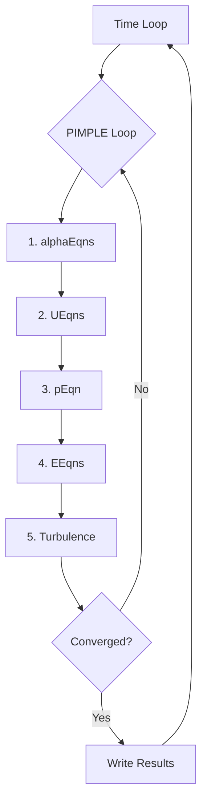

# Algorithm Flow

ขั้นตอนการทำงานของอัลกอริทึม PIMPLE ใน multiphaseEulerFoam

---

## Overview

> **PIMPLE** = **P**ISO + S**IMPLE** = Transient accuracy + Outer loop stability



---

## 1. Main Time Loop

```cpp
while (runTime.loop())
{
    #include "readTimeControls.H"
    #include "CourantNo.H"

    while (pimple.loop())
    {
        #include "alphaEqns.H"   // Phase fractions
        #include "UEqns.H"       // Momentum
        #include "pEqn.H"        // Pressure
        #include "EEqns.H"       // Energy

        turbulence->correct();
    }

    runTime.write();
}
```

---

## 2. Phase Fraction Equations (alphaEqns.H)

### Governing Equation

$$\frac{\partial(\alpha_k \rho_k)}{\partial t} + \nabla \cdot (\alpha_k \rho_k \mathbf{u}_k) = \dot{m}_k$$

**Constraint:** $\sum_k \alpha_k = 1$

### OpenFOAM Code

```cpp
forAll(phases, phasei)
{
    fvScalarMatrix alphaEqn
    (
        fvm::ddt(alpha, rho)
      + fvm::div(phi, alpha)
     ==
        massTransferSource
    );

    alphaEqn.solve();
    alpha.maxMin(1.0, 0.0);  // Bound [0,1]
}

// Normalize to sum = 1
forAll(phases, i) { phases[i] /= sumAlpha; }
```

### fvSchemes

```cpp
divSchemes
{
    div(phi,alpha)      Gauss vanLeer;
    div(phir,alpha)     Gauss interfaceCompression;
}
```

---

## 3. Momentum Equations (UEqns.H)

### Governing Equation

$$\frac{\partial(\alpha_k \rho_k \mathbf{u}_k)}{\partial t} + \nabla \cdot (\alpha_k \rho_k \mathbf{u}_k \mathbf{u}_k) = -\alpha_k \nabla p + \nabla \cdot \boldsymbol{\tau}_k + \alpha_k \rho_k \mathbf{g} + \mathbf{M}_k$$

### OpenFOAM Code

```cpp
forAll(phases, phasei)
{
    fvVectorMatrix UEqn
    (
        fvm::ddt(alpha, rho, U)
      + fvm::div(phi, U)
     ==
      - alpha*fvc::grad(p)
      + fvc::div(alpha*tau)
      + alpha*rho*g
      + interfacialMomentumTransfer
    );

    UEqn.relax();
    UEqns.set(phasei, new fvVectorMatrix(UEqn));
}
```

### Interphase Forces

| Force | Source |
|-------|--------|
| Drag | `dragModel->F()` |
| Lift | `liftModel->F()` |
| Virtual Mass | `virtualMassModel->F()` |
| Turbulent Dispersion | `turbulentDispersionModel->F()` |

---

## 4. Pressure Equation (pEqn.H)

### Governing Principle

$$\sum_k \nabla \cdot (\alpha_k \rho_k \mathbf{u}_k) = 0$$

### PISO Algorithm

1. **Predict U** from momentum with current p
2. **Solve Poisson** for pressure correction
3. **Correct U** with new pressure gradient

### OpenFOAM Code

```cpp
for (int corr = 0; corr < nCorr; corr++)
{
    // Rhie-Chow interpolation
    surfaceScalarField rAUf = fvc::interpolate(1.0/UEqn.A());

    // Pressure Poisson equation
    fvScalarMatrix pEqn
    (
        fvm::laplacian(rAUf, p) == fvc::div(phiHbyA)
    );

    pEqn.solve();

    // Flux correction
    phi = phiHbyA - rAUf*fvc::snGrad(p)*mesh.magSf();
}
```

### fvSolution

```cpp
solvers
{
    p
    {
        solver      GAMG;
        tolerance   1e-8;
        relTol      0.01;
    }
}
```

---

## 5. Energy Equations (EEqns.H)

### Governing Equation

$$\frac{\partial(\alpha_k \rho_k h_k)}{\partial t} + \nabla \cdot (\alpha_k \rho_k h_k \mathbf{u}_k) = \nabla \cdot (k \nabla T_k) + Q_k$$

### OpenFOAM Code

```cpp
forAll(phases, phasei)
{
    fvScalarMatrix EEqn
    (
        fvm::ddt(alpha, rho, h)
      + fvm::div(phi, h)
     ==
        alpha*dpdt
      + fvc::div(alphaKappaEff*fvc::grad(T))
      + interphaseHeatTransfer
    );

    EEqn.relax().solve();
    T = thermo.THE(h, T);  // Update T from h
}
```

---

## 6. Stability Controls

### Courant Number

$$Co = \frac{\Delta t \cdot |U|}{\Delta x}$$

```cpp
// system/controlDict
adjustTimeStep  yes;
maxCo           0.5;
maxAlphaCo      0.3;
```

### Under-Relaxation

$$\phi^{new} = \phi^{old} + \lambda(\phi^{calc} - \phi^{old})$$

```cpp
// system/fvSolution
relaxationFactors
{
    fields
    {
        p       0.3;
        "alpha.*"   0.7;
    }
    equations
    {
        U       0.7;
        h       0.8;
    }
}
```

---

## 7. PIMPLE Settings

```cpp
PIMPLE
{
    nOuterCorrectors    3;      // Outer SIMPLE loops
    nCorrectors         2;      // Inner PISO corrections
    nNonOrthogonalCorrectors 1; // Non-orthogonal mesh
    nAlphaSubCycles     2;      // Alpha sub-cycling
    nAlphaCorr          1;      // Alpha corrections
}
```

| Parameter | Purpose | Typical |
|-----------|---------|---------|
| nOuterCorrectors | SIMPLE iterations | 1-5 |
| nCorrectors | PISO corrections | 1-3 |
| nAlphaSubCycles | Sub-cycling for sharp interfaces | 1-4 |

---

## Quick Reference

| Step | File | Equation |
|------|------|----------|
| 1 | alphaEqns.H | $\nabla \cdot (\alpha \mathbf{u})$ |
| 2 | UEqns.H | Momentum + interphase |
| 3 | pEqn.H | Pressure Poisson |
| 4 | EEqns.H | Energy/enthalpy |
| 5 | turbulence->correct() | Turbulence |

---

## Concept Check

<details>
<summary><b>1. ทำไมต้อง normalize alpha ให้ sum = 1?</b></summary>

เพราะ phase fractions ต้องรวมกันเป็น 1 ตาม physical constraint — ถ้าไม่ normalize อาจเกิด non-physical results
</details>

<details>
<summary><b>2. Rhie-Chow interpolation ทำอะไร?</b></summary>

ป้องกัน **checkerboard pressure** บน collocated grid โดยการเพิ่ม pressure smoothing term ตอน interpolate velocity ไปยัง face
</details>

<details>
<summary><b>3. nOuterCorrectors มีผลอย่างไร?</b></summary>

ค่ามาก → **convergence ดีขึ้น** แต่ **ช้าลง** — ใช้ค่า 1-2 สำหรับ explicit coupling, 3-5 สำหรับ strong coupling
</details>

---

## Related Documents

- **ภาพรวม:** [00_Overview.md](00_Overview.md)
- **Solver Overview:** [01_Solver_Overview.md](01_Solver_Overview.md)
- **Model Architecture:** [03_Model_Architecture.md](03_Model_Architecture.md)