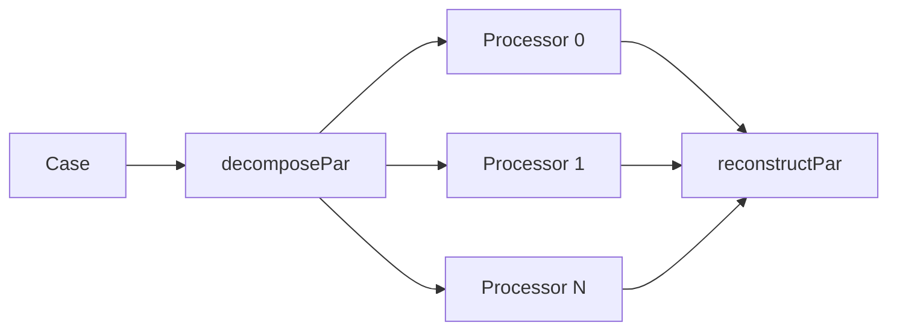

# Parallel Implementation

การนำไปใช้งานแบบขนานสำหรับ Multiphase Simulation

---

## Overview



---

## 1. Domain Decomposition

### Methods

| Method | Description | Best For |
|--------|-------------|----------|
| `scotch` | Automatic graph-based | General |
| `hierarchical` | Manual, structured | Regular meshes |
| `simple` | Geometric splitting | Quick |

### decomposeParDict

```cpp
// system/decomposeParDict
numberOfSubdomains  4;
method              scotch;

// For hierarchical
hierarchicalCoeffs
{
    n   (2 2 1);
    order xyz;
}
```

---

## 2. Running Parallel

```bash
# Decompose
decomposePar

# Run parallel
mpirun -np 4 multiphaseEulerFoam -parallel

# Reconstruct
reconstructPar
```

### HPC Cluster

```bash
#!/bin/bash
#SBATCH -n 64
#SBATCH --time=24:00:00

srun multiphaseEulerFoam -parallel
```

---

## 3. Multiphase Considerations

### Per-Phase Fields

Each processor stores:
- `alpha.<phase>`
- `U.<phase>`
- `p`

### Interphase Communication

| Data | Exchange Type |
|------|---------------|
| Phase fractions | Boundary swap |
| Velocities | Boundary swap |
| Pressure | Global solve |

---

## 4. Load Balancing

### Uniform Distribution

```cpp
method scotch;

scotchCoeffs
{
    strategy    "b";  // Balance
}
```

### For Dynamic Mesh

```cpp
// Redistribution during run
redistributePar -decompose
```

---

## 5. Scalability

### Strong Scaling

| Processors | Speedup | Cells/proc |
|------------|---------|------------|
| 1 | 1.0× | 1M |
| 4 | 3.8× | 250k |
| 16 | 14× | 62.5k |
| 64 | 45× | 15.6k |

### Guidelines

| Cells/processor | Performance |
|-----------------|-------------|
| > 50,000 | Good |
| 10,000-50,000 | Acceptable |
| < 10,000 | Communication limited |

---

## 6. Troubleshooting

### Common Issues

| Problem | Cause | Solution |
|---------|-------|----------|
| Slow scaling | Too few cells/proc | Use fewer processors |
| Results differ | Non-deterministic | Use consistent decomposition |
| Crash at boundary | Processor boundary issue | Check mesh quality |

### Debugging

```bash
# Run with output per processor
mpirun -np 4 multiphaseEulerFoam -parallel 2>&1 | tee log
```

---

## Quick Reference

| Task | Command |
|------|---------|
| Decompose | `decomposePar` |
| Run parallel | `mpirun -np N solver -parallel` |
| Reconstruct | `reconstructPar` |
| Reconstruct time | `reconstructPar -time 0.1` |

---

## Concept Check

<details>
<summary><b>1. scotch vs hierarchical ต่างกันอย่างไร?</b></summary>

- **scotch**: Automatic, optimizes communication
- **hierarchical**: Manual splitting ตาม x, y, z
</details>

<details>
<summary><b>2. ทำไม multiphase อาจ scale แย่กว่า single phase?</b></summary>

เพราะมี **หลาย fields ต่อ phase** และ **interphase forces** ต้อง communicate ข้อมูลเพิ่ม
</details>

<details>
<summary><b>3. minimum cells/processor ควรเป็นเท่าไหร่?</b></summary>

อย่างน้อย **10,000-50,000 cells** — น้อยกว่านี้ communication overhead จะ dominate
</details>

---

## Related Documents

- **ภาพรวม:** [00_Overview.md](00_Overview.md)
- **Solver Overview:** [01_Solver_Overview.md](01_Solver_Overview.md)
- **Code and Model Architecture:** [02_Code_and_Model_Architecture.md](02_Code_and_Model_Architecture.md)
- **Algorithm Flow:** [03_Algorithm_Flow.md](03_Algorithm_Flow.md)