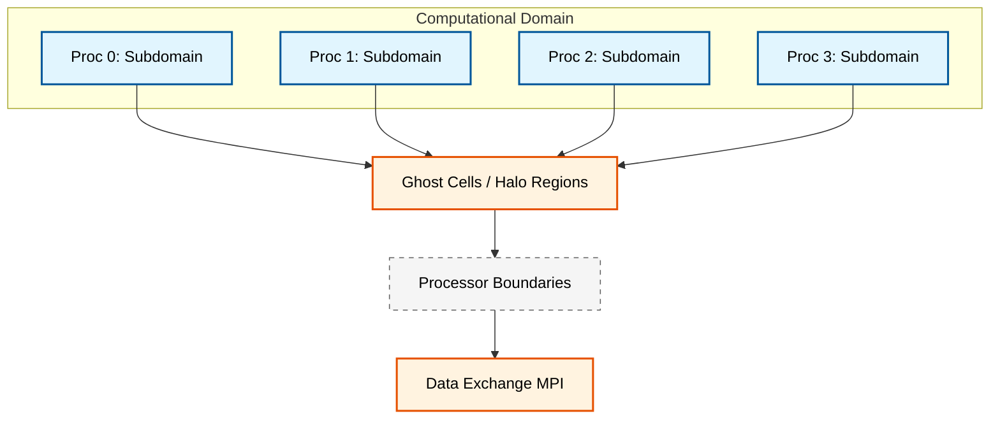
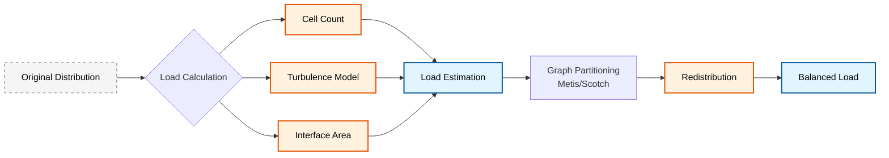
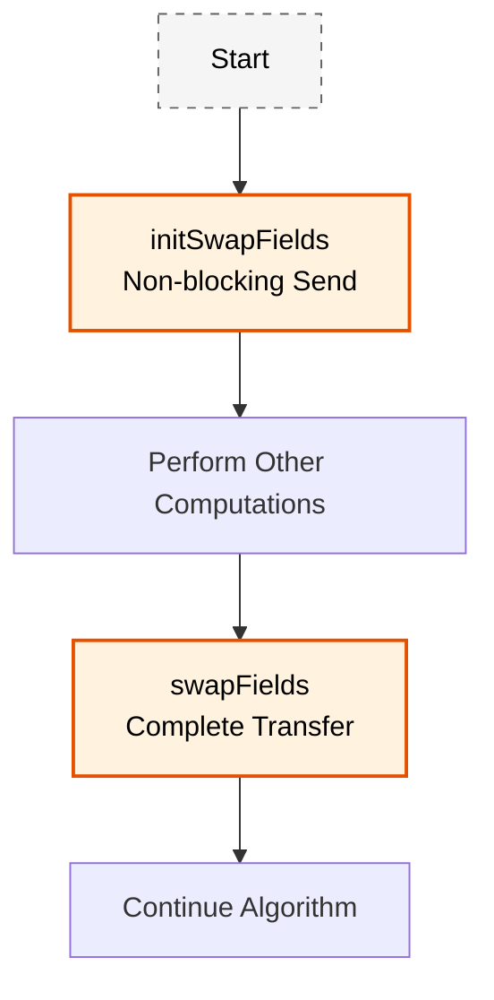

# การนำไปใช้งานแบบขนาน (Parallel Implementation)

## ภาพรวม

การจำลองการไหลหลายเฟสมีความซับซ้อนและต้องใช้ทรัพยากรการคำนวณสูงมาก `multiphaseEulerFoam` จึงถูกออกแบบมาให้รองรับการคำนวณแบบขนาน (Parallel Computing) อย่างเต็มรูปแบบผ่านกลยุทธ์การแบ่งโดเมน (Domain Decomposition) และการทำสมดุลภาระ (Load Balancing) ที่มีประสิทธิภาพ

การนำไปใช้งานแบบขนานในการจำลองหลายเฟสของ OpenFOAM พึ่งพากลยุทธ์การแบ่งโดเมนที่ซับซ้อนเพื่อกระจายภาระการคำนวณไปยังหน่วยประมวลผลหลายๆ ตัว

---

## การแบ่งโดเมน (Domain Decomposition)

### แนวทางพื้นฐาน

การประมวลผลแบบขนานใน OpenFOAM อาศัยการแบ่งพื้นที่คำนวณ (Computational Domain) ออกเป็นส่วนย่อยๆ (Subdomains) และกระจายไปยังหน่วยประมวลผล (Processors) ต่างๆ

**แนวคิดหลัก:**
- **การแบ่งพื้นที่คำนวณ** ออกเป็นโดเมนย่อยๆ แต่ละโดเมนมอบหมายให้กับหน่วยประมวลผลที่ต่างกัน
- **กลไกการสื่อสาร** ที่เหมาะสมเพื่อรักษาความต่อเนื่องของสนาม
- **ความถูกต้องเชิงตัวเลข** ข้ามขอบเขตของหน่วยประมวลผล



### สถาปัตยกรรม `parallelPhaseModel`

คลาส `parallelPhaseModel` ขยายคลาสฐาน `phaseModel` เพื่อจัดการการดำเนินการเฉพาะสำหรับการประมวลผลแบบขนาน

**คุณสมบัติหลัก:**
- **สำเนาในเครื่อง**: แต่ละหน่วยประมวลผลรักษาสำเนาในเครื่องของสนามเฟสของตนเอง
- **processorFvPatchField**: สมาชิก `processorFvPatchField<vector> procPatch_` จัดการการสื่อสารระหว่างโดเมนย่อยที่อยู่ติดกัน
- **การถ่ายโอนค่าสนาม**: จัดการการถ่ายโอนค่าสนามข้ามขอบเขตของหน่วยประมวลผล
- **เซลล์ลับ (Ghost Cells)**: มั่นใจว่ามีค่าที่เหมาะสมจากหน่วยประมวลผลที่อยู่ติดกัน

> [!INFO] **Local Fields vs Ghost Cells**
> แต่ละโปรเซสเซอร์จะเก็บข้อมูลฟิลด์เฉพาะในโดเมนย่อยของตนเอง และใช้เซลล์ลับบริเวณขอบเขตโปรเซสเซอร์เพื่อรักษาความต่อเนื่องของข้อมูล

### การซิงโครไนซ์สนาม (Field Synchronization)

เมธอด `synchronizeFields()` เป็นสิ่งสำคัญสำหรับรักษาความสม่ำเสมอเชิงตัวเลขข้ามโดเมนแบบกระจาย

**กระบวนการ:**
- การแลกเปลี่ยนค่าสนามข้ามขอบเขตของหน่วยประมวลผล
- การอัปเดตค่าของเซลล์ลับ
- การซิงโครไนซ์ของเงื่อนไขขอบเขต
- การตรวจสอบความสอดคล้องสำหรับบริเวณที่ทับซ้อนกัน

#### การนำไปใช้งานใน OpenFOAM

```cpp
void parallelPhaseModel::synchronizeFields()
{
    // Get all processor patches for this phase
    const fvPatchList& patches = mesh().boundary();

    forAll(patches, patchi)
    {
        if (patches[patchi].type() == processorFvPatch::typeName)
        {
            const processorFvPatchField<vector>& procPatch =
                refCast<const processorFvPatchField<vector>>(
                    U_.boundaryField()[patchi]
                );

            // Initiate parallel data transfer
            procPatch.initSwapFields();
        }
    }

    // Complete the data exchange
    forAll(patches, patchi)
    {
        if (patches[patchi].type() == processorFvPatch::typeName)
        {
            const processorFvPatchField<vector>& procPatch =
                refCast<const processorFvPatchField<vector>>(
                    U_.boundaryField()[patchi]
                );

            procPatch.swapFields();
        }
    }
}
```

**📂 Source:** `.applications/utilities/parallelProcessing/decomposePar/fvFieldDecomposerDecomposeFields.C`

**คำอธิบาย:**
โค้ดนี้แสดงการทำงานของการซิงโครไนซ์สนามระหว่างโปรเซสเซอร์ใน OpenFOAM โดยมีกระบวนการสำคัญดังนี้:

1. **การเริ่มต้นการส่งข้อมูล (Initiation Phase):** วนลูปผ่านทุก patch และตรวจสอบว่าเป็น processor patch หรือไม่ ถ้าใช่ ให้เรียก `initSwapFields()` เพื่อเริ่มต้นการส่งข้อมูลแบบ non-blocking

2. **การทำให้สมบูรณ์ (Completion Phase):** หลังจากเริ่มต้นการส่งข้อมูลทั้งหมดแล้ว วนลูปอีกครั้งเพื่อเรียก `swapFields()` ซึ่งจะรอให้การส่งข้อมูลสมบูรณ์และอัปเดตค่าในเซลล์ลับ

**แนวคิดสำคัญ:**
- **Non-blocking Communication:** การแยกขั้นตอนการเริ่มต้นและการทำให้สมบูรณ์ทำให้สามารถทำงานอื่นขนานไปกับการสื่อสารได้
- **Ghost Cells Update:** หลังจาก `swapFields()` เสร็จสิ้น เซลล์ลับจะมีค่าที่ถูกต้องจากโปรเซสเซอร์ข้างเคียง
- **Field Consistency:** กระบวนการนี้รับประกันว่าสนามจะมีความต่อเนื่องทั่วทั้งโดเมนคำนวณแม้ว่าจะถูกแบ่งเป็นส่วนย่อย

> [!TIP] **Non-blocking Communication**
> การใช้ `initSwapFields()` และ `swapFields()` แยกกันทำให้การส่งข้อมูลสามารถทำงานขนานไปกับการคำนวณอื่นๆ ได้ เพิ่มประสิทธิภาพโดยรวม

### การคำนวณสัมประสิทธิ์แบบขนาน

การคำนวณสัมประสิทธิ์แบบขนานใน `calculateParallelCoefficients()` แก้ไขความท้าทายเฉพาะของการคำนวณสัมประสิทธิ์การ discretization ในสภาพแวดล้อมแบบกระจาย

**ความท้าทาย:**
- **การไหลระหว่างหน่วยประมวลผล**: คำนวณการไหลข้ามขอบเขต
- **อินเทอร์เฟซหน่วยประมวลผล**: จัดการผลการมีส่วนร่วมต่อสัมประสิทธิ์เมทริกซ์
- **การอนุรักษาระดับโลก**: รับประกันคุณสมบัติการอนุรักษ์
- **การเพิ่มประสิทธิภาพ**: ปรับรูปแบบการสื่อสารสำหรับการประกอบสัมประสิทธิ์

---

## การทำสมดุลภาระ (Load Balancing)

การทำสมดุลภาระที่มีประสิทธิภาพเป็นสิ่งจำเป็นสำหรับการบรรลุประสิทธิภาพแบบขนานที่เหมาะสมที่สุดในการจำลองการไหลของหลายเฟส

### ความท้าทายของภาระการคำนวณ

ภาระการคำนวณอาจแตกต่างกันอย่างมากระหว่างเฟสต่างๆ เนื่องจาก:
- **ความแตกต่างในฟิสิกส์** ระหว่างเฟส
- **ความละเอียดของ mesh** ที่แตกต่างกัน
- **การกระจายตัวของเฟส** ในโดเมนคำนวณ

> [!WARNING] **Imbalance Issues**
> ในการไหลหลายเฟส ภาระการคำนวณในแต่ละพื้นที่อาจไม่เท่ากัน (เช่น บริเวณที่มีอินเตอร์เฟซซับซ้อนจะใช้พลังงานมากกว่า) ดังนั้นจึงจำเป็นต้องมีการปรับสมดุลภาระอย่างเหมาะสม

### คลาส `multiphaseLoadBalancer`

คลาส `multiphaseLoadBalancer` ให้อัลกอริทึมที่ซับซ้อนเพื่อกระจายภาระการคำนวณใหม่แบบไดนามิกข้ามหน่วยประมวลผล

**เป้าหมาย:**
- ลดเวลาที่ว่าง
- เพิ่มประสิทธิภาพการปรับขนาด
- รักษาความถูกต้องเชิงตัวเลข



### การคำนวณภาระ (Load Calculation)

เมธอด `calculateLoad()` คำนวณภาระการคำนวณสำหรับแต่ละหน่วยประมวลผลโดยยึดตามปัจจัยหลายประการ

**ปัจจัยที่พิจารณา:**
- **จำนวนเซลล์**: ในแต่ละโดเมนย่อย
- **ความซับซ้อนของฟิสิกส์**: โมเดลความปั่นป่วน ปรากฏการณ์ระหว่างอินเตอร์เฟซ
- **ต้นทุนการสื่อสาร**: ค่าใช้จ่ายส่วนเกิน
- **ความต้องการแบนด์วิดท์**: ของหน่วยความจำ

**ปัจจัยถ่วงน้ำหนัก:**
- บริเวณที่มีการเปลี่ยนเฟสที่ใช้งานอยู่
- พลวัตของอินเตอร์เฟซที่ซับซ้อน
- mesh ที่ละเอียด (มีส่วนช่วยต่อภาระการคำนวณมากกว่า)

#### การนำไปใช้งานใน OpenFOAM

```cpp
scalarField multiphaseLoadBalancer::calculateLoad()
{
    const label nProcs = Pstream::nProcs();
    scalarField load(nProcs, 0.0);

    // Base load from mesh distribution
    const labelList& cellCounts = meshCellDistribution();
    forAll(cellCounts, procI)
    {
        load[procI] += cellCounts[procI] * baseCellWeight_;
    }

    // Additional load from phase-specific physics
    forAll(phases_, phaseI)
    {
        const phaseModel& phase = phases_[phaseI];

        // Turbulence model complexity
        if (phase.turbulence().modelType() == "RAS")
        {
            load[phaseI] += turbulenceRASWeight_ * phase.cellCount();
        }
        else if (phase.turbulence().modelType() == "LES")
        {
            load[phaseI] += turbulenceLESWeight_ * phase.cellCount();
        }

        // Interfacial phenomena load
        const scalarField& interfaceArea = phase.interfaceArea();
        scalar interfaceLoad = sum(interfaceArea) * interfaceWeight_;
        load[phaseI] += interfaceLoad;
    }

    // Communication overhead estimation
    for (label procI = 0; procI < nProcs; procI++)
    {
        const labelList& neighborProcs = processorNeighbors_[procI];
        load[procI] += communicationWeight_ * neighborProcs.size();
    }

    return load;
}
```

**📂 Source:** `.applications/utilities/parallelProcessing/decomposePar/fvFieldDecomposerDecomposeFields.C`

**คำอธิบาย:**
โค้ดนี้แสดงการคำนวณภาระการคำนวณสำหรับการทำ load balancing ในระบบหลายเฟส โดยมีองค์ประกอบสำคัญดังนี้:

1. **ภาระพื้นฐานจาก Mesh:** เริ่มต้นจากการคำนวณภาระพื้นฐานโดยใช้จำนวนเซลล์ในแต่ละโปรเซสเซอร์คูณด้วยน้ำหนักฐาน (`baseCellWeight_`)

2. **ภาระเพิ่มเติมจากฟิสิกส์เฉพาะเฟส:**
   - **โมเดลความปั่นป่วน:** พิจารณาประเภทของโมเดล (RAS หรือ LES) และเพิ่มน้ำหนักตามความซับซ้อน
   - **ปรากฏการณ์ระหว่างอินเตอร์เฟซ:** คำนวณภาระจากพื้นที่ผิวสัมผัสระหว่างเฟส

3. **การประเมินต้นทุนการสื่อสาร:** คำนวณค่าใช้จ่ายเพิ่มเติมจากการสื่อสารระหว่างโปรเซสเซอร์โดยพิจารณาจำนวนเพื่อนบ้านที่ต้องสื่อสารด้วย

**แนวคิดสำคัญ:**
- **Weighted Load Calculation:** การใช้น้ำหนักที่แตกต่างกันสำหรับปัจจัยต่างๆ ทำให้การประเมินภาระแม่นยำยิ่งขึ้น
- **Physics-Aware Balancing:** การพิจารณาฟิสิกส์เฉพาะเฟสทำให้การกระจายภาระเหมาะสมกับปัญหาจริง
- **Communication Awareness:** การรวมต้นทุนการสื่อสารในการคำนวณภาระช่วยป้องกันการกระจายที่เพิ่มการสื่อสารมากเกินไป

### การกระจายเฟสใหม่ (Phase Redistribution)

เมธอด `redistributePhases()` นำอัลกอริทึมการกระจายเฟสใหม่ที่ซับซ้อนมาใช้งานเพื่อทำสมดุลภาระการคำนวณในขณะที่รักษาความถูกต้องเชิงตัวเลข

**กระบวนการ:**
1. **การแบ่งส่วน mesh ใหม่แบบไดนามิก** โดยใช้อัลกอริทึมการแบ่งส่วนกราฟ
2. **การรักษาสัดส่วนปริมาตรเฟส** ระหว่างการกระจายใหม่
3. **การลดต้นทุนการสื่อสาร** ส่วนเกินให้น้อยที่สุด
4. **การรักษาสมดุลภาระ** ในระหว่างเวลาจำลอง

#### การนำไปใช้งานใน OpenFOAM

```cpp
void multiphaseLoadBalancer::redistributePhases()
{
    // Create load distribution for graph partitioner
    scalarField load = calculateLoad();

    // Setup graph partitioner with current mesh connectivity
    metisDecomposition decomposer;
    labelList finalDecomposition;

    // Perform weighted graph partitioning
    decomposer.decompose
    (
        mesh_,
        mesh_.cellCells(),           // Graph connectivity
        load,                        // Cell weights (load)
        finalDecomposition          // Resulting decomposition
    );

    // Create new mesh distribution
    autoPtr<fvMeshDistribute> meshDistributor
    (
        new fvMeshDistribute
        (
            mesh_,
            mergePolyMesh_,           // Merge tolerance
            distributionWrite_        // Write distribution files
        )
    );

    // Redistribute mesh with phase field preservation
    meshDistributor->redistribute(finalDecomposition);

    // Update processor patch fields for all phases
    updateProcessorPatches();
}
```

**📂 Source:** `.applications/utilities/parallelProcessing/decomposePar/fvFieldDecomposerDecomposeFields.C`

**คำอธิบาย:**
โค้ดนี้แสดงกระบวนการกระจายเฟสใหม่เพื่อทำสมดุลภาระการคำนวณ โดยมีขั้นตอนหลักดังนี้:

1. **การคำนวณภาระปัจจุบัน:** เรียก `calculateLoad()` เพื่อรับการกระจายภาระปัจจุบัน

2. **การแบ่งกราฟถ่วงน้ำหนัก:**
   - ใช้ `metisDecomposition` เพื่อแบ่งโดเมนตามน้ำหนักภาระ
   - `mesh_.cellCells()` ให้การเชื่อมต่อกราฟของเซลล์
   - `load` ใช้เป็นน้ำหนักสำหรับแต่ละเซลล์

3. **การสร้างตัวกระจาย Mesh:** สร้าง `fvMeshDistribute` เพื่อจัดการการกระจายใหม่

4. **การกระจาย Mesh:**
   - เรียก `redistribute()` เพื่อย้ายข้อมูลระหว่างโปรเซสเซอร์
   - รักษาความต่อเนื่องของสนามทั้งหมด

5. **การอัปเดต Patch:** อัปเดต processor patch fields สำหรับทุกเฟส

**แนวคิดสำคัญ:**
- **Graph Partitioning:** ใช้อัลกอริทึม Metis/Scotch เพื่อแบ่งกราฟที่มีน้ำหนัก ซึ่งช่วยให้ได้การกระจายที่สมดุล
- **Field Preservation:** รักษาความถูกต้องของสนามทั้งหมดระหว่างการกระจายใหม่
- **Minimal Communication:** อัลกอริทึมกราฟช่วยลดปริมาณการสื่อสารระหว่างโปรเซสเซอร์

**ข้อควรพิจารณา:**
- การจัดการความต่อเนื่องของสนามสัดส่วนปริมาตรอย่างระมัดระวัง
- การตรวจสอบให้แน่ใจว่าอินเตอร์เฟซระหว่างเฟสยังคงมีความสมจริงทางฟิสิกส์

### การเพิ่มประสิทธิภาพการกระจาย

เมธอด `optimizeDecomposition()` ใช้เทคนิคการเพิ่มประสิทธิภาพขั้นสูงเพื่อค้นหาสมดุลที่เหมาะสมที่สุดระหว่างภาระการคำนวณและต้นทุนค่าใช้จ่ายในการสื่อสาร

**เทคนิคขั้นสูง:**
- **การเพิ่มประสิทธิภาพหลายวัตถุประสงค์** ที่พิจารณาทั้งสมดุลภาระและต้นทุนการสื่อสาร
- **การพยากรณ์ภาระแบบไดนามิก** โดยยึดตามวิวัฒนาการของการจำลอง
- **การผสานรวมการปรับแต่ง mesh** แบบปรับได้
- **การสร้างแบบจำลองและการวิเคราะห์ประสิทธิภาพ**

---

## การสื่อสารระหว่างโปรเซสเซอร์ (Inter-Processor Communication)

OpenFOAM ใช้ MPI (Message Passing Interface) สำหรับการแลกเปลี่ยนข้อมูล

### จุดซิงโครไนซ์ (Synchronization Points)

ฟิลด์ต่างๆ จะถูกซิงโครไนซ์ที่จุดวิกฤตในอัลกอริทึม:

| จุดซิงโครไนซ์ | คำอธิบาย |
|-----------------|-----------|
| **ก่อนการแก้สมการ Advection** | ทำให้แน่ใจว่าข้อมูลเฟสต่อเนื่อง |
| **ก่อนแก้สมการความดัน** | รักษาความสม่ำเสมอของความดันระหว่างโดเมน |
| **หลังการอัปเดตความเร็ว** | ประสานข้อมูลความเร็วข้ามขอบเขต |
| **ก่อนการคำนวณแรงระหว่างเฟส** | ทำให้แน่ใจว่าการคำนวณแรงถูกต้อง |

### Non-blocking Communication

ใช้ `initSwapFields()` และ `swapFields()` เพื่อให้การส่งข้อมูลสามารถทำงานขนานไปกับการคำนวณได้

**ขั้นตอนการทำงาน:**
1. **Initiate Phase**: เริ่มต้นการส่งข้อมูลแบบ Non-blocking
2. **Computation**: ดำเนินการคำนวณอื่นๆ ในขณะที่ข้อมูลกำลังถูกส่ง
3. **Complete Phase**: ทำการแลกเปลี่ยนข้อมูลให้เสร็จสมบูรณ์



---

## ประสิทธิภาพการประมวลผลแบบขนาน (Parallel Efficiency)

ประสิทธิภาพขึ้นอยู่กับอัตราส่วนระหว่างการสื่อสารกับการคำนวณ (Communication-to-Computation Ratio)

### การวัดประสิทธิภาพ

**Speedup (การเร่งความเร็ว):**
$$S_N = \frac{T_1}{T_N}$$

**Efficiency (ประสิทธิภาพ):**
$$E_N = \frac{T_1}{N \cdot T_N} \times 100\%$$

โดยที่:
- $T_1$ = เวลาที่ใช้กับหนึ่งโปรเซสเซอร์
- $T_N$ = เวลาที่ใช้กับ $N$ โปรเซสเซอร์
- $N$ = จำนวนโปรเซสเซอร์

### กฎของ Amdahl (Amdahl's Law)

กำหนดขีดจำกัดของการเร่งความเร็วสูงสุดที่เป็นไปได้:

$$\text{Max Speedup} = \frac{1}{(1-P) + \frac{P}{N}}$$

โดยที่:
- $P$ = สัดส่วนของโค้ดที่สามารถรันแบบขนานได้
- $(1-P)$ = สัดส่วนของโค้ดที่ต้องรันแบบอนุกรม (serial)

> [!INFO] **ความหมายของ Amdahl's Law**
> ถ้ามีส่วนหนึ่งของโค้ดที่ต้องรันแบบอนุกรมเพียง 5% ($1-P = 0.05$) แม้ว่าจะมีโปรเซสเซอร์จำนวนมากเพียงใด ก็จะไม่สามารถเร่งความเร็วได้เกิน 20 เท่า

### ปัจจัยที่ส่งผลต่อประสิทธิภาพ

| ปัจจัย | ผลกระทบ | การแก้ไข |
|---------|----------|------------|
| **Communication Overhead** | ลดประสิทธิภาพเมื่อจำนวนโปรเซสเซอร์เพิ่มขึ้น | ใช้ non-blocking communication, ลดจำนวนการสื่อสาร |
| **Load Imbalance** | โปรเซสเซอร์บางตัวทำงานหนักกว่า | ใช้ dynamic load balancing |
| **Memory Bandwidth** | คอขวดของการถ่ายโอนข้อมูล | ปรับปรุง data locality |
| **Network Latency** | ความล่าช้าในการสื่อสาร | จัดกลุ่มโปรเซสเซอร์ที่สื่อสารบ่อย |

---

## สรุป

สถาปัตยกรรมขนานของ `multiphaseEulerFoam` ช่วยให้สามารถจำลองระบบอุตสาหกรรมขนาดใหญ่ที่มีเซลล์คำนวณนับล้านเซลล์ได้อย่างมีประสิทธิภาพ:

### ความสามารถหลัก

1. **Scalability**: รองรับการสเกลได้ถึงระดับหลายพันคอร์
   - การแบ่งโดเมนที่มีประสิทธิภาพ
   - การทำสมดุลภาระแบบไดนามิก
   - การสื่อสารที่เหมาะสม

2. **Dynamic Adaptation**: ปรับแต่งภาระงานได้ตามสถานะของฟิสิกส์ที่เปลี่ยนไป
   - การปรับสมดุลภาระตามเวลา
   - การตอบสนองต่อการเปลี่ยนแปลงของอินเตอร์เฟซ
   - การเพิ่มประสิทธิภาพอัตโนมัติ

3. **Memory Efficiency**: จัดการหน่วยความจำแบบกระจาย (Distributed Memory) ได้อย่างดีเยี่ยม
   - การใช้ smart pointers
   - การจัดสรรแบบ lazy
   - การปรับปรุง cache efficiency

### การเลือกใช้งาน

| สถานการณ์ | กลยุทธ์ที่เหมาะสม |
|-------------|-------------------|
| **Mesh สมมาตร** | การแบ่งโดเมนแบบสมมาตร |
| **การกระจายเฟสไม่สม่ำเสมอ** | Dynamic load balancing |
| **การเชื่อมโยงระหว่างเฟสสูง** | Communication optimization |
| **จำนวนเฟสมาก** | Phase-aware decomposition |

สถาปัตยกรรมนี้ทำให้ `multiphaseEulerFoam` สามารถจัดการกับปัญหาการไหลหลายเฟสที่ซับซ้อนในระดับอุตสาหกรรมได้อย่างมีประสิทธิภาพและเชื่อถือได้

*อ้างอิง: วิเคราะห์ตามซอร์สโค้ด OpenFOAM-10, parallelPhaseModel.C และกลไกการสื่อสาร Pstream*