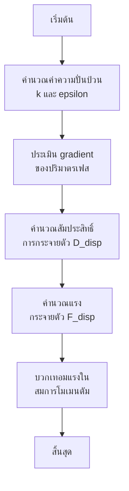

# ทฤษฎีพื้นฐานการกระจายตัวเนื่องจากความปั่นป่วน (Fundamental Theory)

> [!INFO] ภาพรวมบทนี้
> บทนี้อธิบายทฤษฎีพื้นฐานของการกระจายตัวเนื่องจากความปั่นป่วน (Turbulent Dispersion) ในระบบหลายเฟส โดยครอบคลุมการอนุมานจากสมการ Reynolds-Averaged, กลไกทางฟิสิกส์, และแบบจำลอง Gradient Diffusion Hypothesis พร้อมด้วยตัวอย่างโค้ด OpenFOAM

---

## บทนำ (Introduction)

**การกระจายตัวแบบปั่นป่วน (Turbulent dispersion)** ในการไหลแบบหลายเฟส (multiphase flow) หมายถึงการแพร่กระจายของอนุภาค ละออง หรือฟองที่เกิดจากการผันผวนของความเร็วแบบปั่นป่วนในเฟสต่อเนื่อง (continuous phase)

ปรากฏการณ์นี้มีความสำคัญอย่างยิ่งต่อ:
- **การทำนายการกระจายตัวของเฟส (phase distribution)**
- **การผสม (mixing)**
- **การขนส่ง (transport)** ในระบบหลายเฟสแบบปั่นป่วน

### กลไกทางกายภาพ

ในกรอบการทำงานแบบ Eulerian-Eulerian (Eulerian-Eulerian framework) การกระจายตัวเนื่องจากความปั่นป่วนเกิดขึ้นจาก:

1. **ความสัมพันธ์ระหว่างการผันผวน**:
   - การผันผวนของปริมาตรเฟส (phase volume fluctuations)
   - การผันผวนของความเร็ว (velocity fluctuations)

2. **กลไกพื้นฐาน**:
   - กระแสหมุนวนแบบปั่นป่วน (turbulent eddies) ในเฟสต่อเนื่อง
   - การพัดพาและกระจายเฟสที่ถูกกระจาย (dispersed phase)

### ผลกระทบที่เกิดขึ้น
- **เพิ่มประสิทธิภาพกระบวนการผสมและการขนส่ง**
- **ค่าสัมประสิทธิ์การกระจายตัว (dispersion coefficient)**: วัดอัตราที่อนุภาคกระจายตัวออกไปเนื่องจากการผันผวนแบบปั่นป่วน

### การประยุกต์ใช้ทางอุตสาหกรรม
- **คอลัมน์ฟองอากาศ (bubble columns)**
- **เตียงของไหล (fluidized beds)**
- **การสร้างละออง (sprays)**

---

## สมการ Reynolds-Averaged (Reynolds-Averaged Equations)

### สมการโมเมนตัมเฉลี่ย

สำหรับ **Multiphase flow** ที่มีการผันผวนของความปั่นป่วน (turbulent fluctuations) สมการโมเมนตัมของเฟส $k$ มีรูปแบบดังนี้:

$$\frac{\partial}{\partial t}(\overline{\alpha_k \rho_k \mathbf{u}_k}) + \nabla \cdot (\overline{\alpha_k \rho_k \mathbf{u}_k \mathbf{u}_k}) = -\overline{\alpha_k \nabla p} + \nabla \cdot \overline{\boldsymbol{\tau}_k} + \overline{\mathbf{M}_k} - \nabla \cdot \overline{\alpha_k \rho_k \mathbf{u}'_k \mathbf{u}'_k} \tag{1.1}$$

**คำจำกัดความของตัวแปร:**
- $\overline{\alpha_k \rho_k \mathbf{u}_k}$: โมเมนตัมเฉลี่ยตามเวลาของเฟส $k$
- $\overline{\alpha_k \nabla p}$: แรงดันเฉลี่ยตามเวลา
- $\overline{\boldsymbol{\tau}_k}$: ความเค้นเชื่อมโยงเฉลี่ยตามเวลา
- $\overline{\mathbf{M}_k}$: การแลกเปลี่ยนโมเมนตัมระหว่างเฟสเฉลี่ยตามเวลา
- **$\overline{\alpha_k \rho_k \mathbf{u}'_k \mathbf{u}'_k}$**: Turbulent stress สำหรับเฟส $k$

**คำอธิบาย:**
สมการนี้แสดงถึงการอนุรักษ์โมเมนตัมที่เฉลี่ยตามเวลาสำหรับแต่ละเฟส $k$ ในระบบ multiphase
- **ขีดเส้นใต้ (overbar)**: ปริมาณที่เฉลี่ยตามเวลา (time-averaged quantities)
- **เครื่องหมายไพรม์ (prime)**: การผันผวนของความปั่นป่วน (turbulent fluctuations)

เทอม turbulent stress เกิดจากเทอมการพา (convection term) ที่ไม่เป็นเชิงเส้น และแสดงถึงการถ่ายโอนโมเมนตัมเพิ่มเติมอันเนื่องมาจากการผันผวนของความเร็ว

### การแยกความเร็วในสภาวะปั่นป่วน

ในสภาวะการไหลแบบปั่นป่วน (turbulent flow) ความเร็วสามารถแยกออกเป็นส่วนเฉลี่ยและส่วนผันผวนได้ดังนี้:

$$\mathbf{u}_c = \overline{\mathbf{u}}_c + \mathbf{u}'_c$$

**คำจำกัดความตัวแปร:**
- $\overline{\mathbf{u}}_c$ คือ ความเร็วเฉลี่ย (mean velocity)
- $\mathbf{u}'_c$ คือ ความเร็วผันผวน (fluctuating velocity) โดยมีเงื่อนไข $\overline{\mathbf{u}'_c} = 0$

ความผันผวนของความเร็วในเฟสต่อเนื่อง $\mathbf{u}'_c$ แสดงถึงการเคลื่อนที่แบบสุ่มและวุ่นวายซึ่งเป็นลักษณะเฉพาะของการไหลแบบปั่นป่วน

**ความผันผวนของความเร็วมีลักษณะสำคัญดังนี้:**
- เกิดขึ้นในช่วงสเกลเชิงพื้นที่และเวลาที่หลากหลาย
- ก่อให้เกิดการถ่ายเทพลังงานจลน์แบบปั่นป่วน (turbulent energy cascade)
- พลังงานจลน์จะถูกถ่ายโอนจากกระแสน้ำวนขนาดใหญ่ (large eddies) ไปยังกระแสน้ำวนที่มีขนาดเล็กลงเรื่อยๆ
- สุดท้ายถูกสลายไปโดยความหนืดระดับโมเลกุล (molecular viscosity) ที่สเกล Kolmogorov

### OpenFOAM Code Implementation

```cpp
// Turbulent stress calculation using Boussinesq approximation
volSymmTensorField Rk
(
    -rho_k_*turbulence_k_->muEff()*dev(twoSymm(fvc::grad(U_k_)))
    + (2.0/3.0)*rho_k_*turbulence_k_->k()*I
);
```

**ใน OpenFOAM:** เทอมนี้จะถูกจำลองโดยใช้ **turbulence closures** เช่น **Boussinesq approximation** ร่วมกับ **eddy viscosity models**

---

## การอนุมานแรงกระจายตัว (Force Derivation)

### แรงกระจายตัวเนื่องจากความปั่นป่วน

แรงกระจายตัวเนื่องจากความปั่นป่วนเกิดขึ้นจากสหสัมพันธ์ (Correlation) ระหว่างความผันผวนของความเร็วและความไม่สม่ำเสมอของความเข้มข้น:

$$\mathbf{F}_{TD} = -\overline{\alpha_d' \rho_d \mathbf{u}_d'} \tag{1.2}$$

**คำจำกัดความตัวแปร:**
- $\mathbf{F}_{TD}$ คือ แรงกระจายตัวเนื่องจากสภาวะปั่นป่วน (turbulent dispersion force)
- $\alpha_d'$ คือ ความผันผวนของเศษส่วนปริมาตรของเฟสกระจาย (dispersed phase volume fraction fluctuations)
- $\mathbf{u}_d'$ คือ ความผันผวนของความเร็วของเฟสกระจาย (dispersed phase velocity fluctuations)
- $\rho_d$ คือ ความหนาแน่นของเฟสกระจาย (dispersed phase density)
- เครื่องหมายขีดบน (overbar) บ่งชี้ถึงการหาค่าเฉลี่ยจากกลุ่มตัวอย่าง (ensemble averaging)

### ความหมายทางฟิสิกส์

ความสัมพันธ์นี้แสดงถึง:
- **การถ่ายโอนโมเมนตัมสุทธิ** ที่เกิดจากการปฏิสัมพันธ์ระหว่างความไม่สม่ำเสมอของความเข้มข้นและความผันผวนของความเร็ว
- **แนวโน้มของสภาวะปั่นป่วน** ที่จะผสมอนุภาคที่กระจายตัว ซึ่งมีแนวโน้มที่จะทำให้ความเข้มข้นลดลง
- **ผลทางสถิติอันดับสอง** ที่เกิดขึ้นจากการอธิบายการไหลแบบหลายเฟสในสภาวะปั่นป่วนโดยการหาค่าเฉลี่ยจากกลุ่มตัวอย่าง

### การอนุมานจากแรงฉุด (Drag Force)

#### ขั้นตอนการอนุมานแรงฉุด

**ขั้นที่ 1:** จากการแยก Reynolds ของแรงฉุด (drag force):
$$\mathbf{F}_D = \mathbf{K} (\mathbf{u}_c - \mathbf{u}_d)$$

**ขั้นที่ 2:** เมื่อแทนค่า $\mathbf{u}_i = \overline{\mathbf{u}}_i + \mathbf{u}'_i$:
$$\mathbf{F}_D = \mathbf{K} (\overline{\mathbf{u}}_c - \overline{\mathbf{u}}_d) + \mathbf{K} (\mathbf{u}'_c - \mathbf{u}'_d)$$

**ขั้นที่ 3:** แรงฉุดที่เฉลี่ยตามเวลาคือ:
$$\overline{\mathbf{F}_D} = \overline{\mathbf{K}} (\overline{\mathbf{u}}_c - \overline{\mathbf{u}}_d) + \overline{\mathbf{K} (\mathbf{u}'_c - \mathbf{u}'_d)}$$

**คำอธิบาย:** เทอมที่สอง $\overline{\mathbf{K} (\mathbf{u}'_c - \mathbf{u}'_d)}$ แสดงถึง**ผลของการกระจายตัวเนื่องจากความปั่นป่วน** (turbulent dispersion effect)

#### หลักการทางกายภาพ

**แรงการกระจายตัวเนื่องจากความปั่นป่วน (turbulent dispersion force)** เกิดจากการสัมพันธ์กันระหว่าง:
- ส่วนที่ผันผวนของความเร็ว ($\mathbf{u}'_c - \mathbf{u}'_d$)
- สัมประสิทธิ์การแลกเปลี่ยนโมเมนตัมระหว่างเฟส (interphase momentum exchange coefficient) $\mathbf{K}$

**ผลของแรง:**
- กระจายอนุภาคหรือหยดน้ำออกจากบริเวณที่มีความเข้มของความปั่นป่วนสูง
- ส่งเสริมการกระจายตัวของเฟสให้สม่ำเสมอมากขึ้น

### รูปแบบทางคณิตศาสตร์

$$\mathbf{F}_{td} = C_{td} \rho_c k \nabla \alpha_d$$

**คำจำกัดความของตัวแปร:**
- $C_{td}$: สัมประสิทธิ์การกระจายตัวเนื่องจากความปั่นป่วน (turbulent dispersion coefficient)
- $\rho_c$: ความหนาแน่นของเฟสต่อเนื่อง (continuous phase density)
- $k$: พลังงานจลน์จากความปั่นป่วน (turbulent kinetic energy)
- $\alpha_d$: สัดส่วนปริมาตรของเฟสที่ถูกกระจาย (dispersed phase volume fraction)

#### OpenFOAM Code Implementation

```cpp
// Turbulent dispersion force calculation (Burns model)
const dimensionedScalar Ctd("Ctd", dimless, phasePair_.dispersed()*Ctd0_);
const volScalarField k(mixingTurbulence().k());
const volScalarField D(Ctd*rhoContinuous()*k);

tmp<volVectorField> tFtd = D*fvc::grad(dispersed().fraction());
```

---

## สมมติฐานการแพร่ตามเกรเดียนต์ (Gradient Diffusion Hypothesis)

### แบบจำลอง Gradient Diffusion

แนวทางที่พบได้บ่อยที่สุดคือการจำลองการกระจายตัวของความปั่นป่วน (turbulent dispersion) เป็นกระบวนการแพร่แบบเกรเดียนต์ (gradient diffusion process):

$$\mathbf{F}_{TD,k} = -D_{TD,k} \nabla \alpha_k \tag{1.3}$$

โดยที่:
- $D_{TD,k}$ คือ **สัมประสิทธิ์การกระจายตัวของความปั่นป่วน** (turbulent dispersion coefficient) สำหรับเฟส $k$
- $\alpha_k$ คือ **สัดส่วนปริมาตร** (volume fraction) ของเฟส $k$

สูตรนี้ปฏิบัติต่อการกระจายตัวของความปั่นป่วนในลักษณะเดียวกับการแพร่แบบโมเลกุล (molecular diffusion) โดยที่ความผันผวนของความปั่นป่วนในเฟสต่อเนื่อง (continuous phase) ทำให้อนุภาคของเฟสที่กระจายตัว (dispersed phase) เคลื่อนที่จากบริเวณที่มีความเข้มข้นสูงไปยังบริเวณที่มีความเข้มข้นต่ำ

### สัมประสิทธิ์การกระจายตัว

โดยที่ $D_{TD}$ คือสัมประสิทธิ์การกระจายตัว ซึ่งสัมพันธ์กับความหนืดความปั่นป่วน ($\nu_t$):

$$D_{TD} = \frac{\nu_t}{\sigma_{TD}}$$

**คำจำกัดความ:**
- **$\sigma_{TD}$ (Turbulent Schmidt Number):** อัตราส่วนระหว่างการแพร่โมเมนตัมและการแพร่มวล (ค่าปกติ $\approx 0.9$)
- $\nu_t$ คือ ความหนืดจลน์ของความปั่นป่วน (turbulent kinematic viscosity)

**ฟิสิกส์พื้นฐาน:**
- เกลียวคลื่นความปั่นป่วน (turbulent eddies) ในเฟสต่อเนื่องสร้างการเคลื่อนที่แบบสุ่มที่มุ่งทำให้การกระจายตัวของเฟสมีความสม่ำเสมอ
- สัมประสิทธิ์ $D_{TD,k}$ แสดงถึงประสิทธิภาพของกระบวนการผสม และขึ้นอยู่กับทั้งลักษณะความปั่นป่วนของเฟสต่อเนื่องและคุณสมบัติของเฟสที่กระจายตัว

### โมเดลที่ใช้ใน OpenFOAM

| โมเดล | สมการ | ลักษณะเฉพาะ |
|--------|---------|-------------|
| **Lopez de Bertodano** | $\mathbf{F}_{td} = -C_{td} \rho_c \nu_t \nabla \alpha_d$ | ใช้ค่า turbulent viscosity $\nu_t$ |
| **Burns** | $\mathbf{F}_{td} = -C_{td} \rho_c k \nabla \alpha_d$ | ใช้ค่า turbulent kinetic energy $k$ |
| **Frank et al.** | $\mathbf{F}_{td} = -C_{td} \rho_c \sqrt{k} \nabla \alpha_d$ | ใช้ค่า $\sqrt{k}$ |

**คำอธิบาย:** รูปแบบนี้ทำให้มั่นใจได้ว่าแรงจะกระทำในทิศทางที่ความเข้มข้นของเฟสที่ถูกกระจายลดลง ช่วยเพิ่มการผสมและป้องกันการแยกเฟส

### แบบจำลองการปิด (Closure Models)

ในทางปฏิบัติ เทอมนี้ต้องการการสร้างแบบจำลองเพื่อปิด (closure modeling) เพื่อเชื่อมโยงกับปริมาณการไหลเฉลี่ยที่ทราบ

**แนวทางทั่วไป:**

**1. สมมติฐานการแพร่แบบเกรเดียนต์ (Gradient Diffusion Hypothesis)**
- สันนิษฐานว่าฟลักซ์การกระจายตัวเนื่องจากสภาวะปั่นป่วนเป็นสัดส่วนกับเกรเดียนต์ของเศษส่วนเฟสเฉลี่ย
- **ข้อดี:** ง่ายต่อการนำไปใช้และทำความเข้าใจ
- **ข้อเสีย:** อาจไม่แม่นยำสำหรับกรณีที่ซับซ้อน

**2. ทฤษฎีของ Tchen (Tchen's Theory)**
- ให้การปิดที่ซับซ้อนมากขึ้นโดยอิงจากการตอบสนองของอนุภาคต่อสภาวะปั่นป่วน
- **ข้อดี:** แม่นยำกว่าสำหรับอนุภาคที่มีความเฉื่อยต่างกัน
- **ข้อเสีย:** คำนวณซับซ้อนกว่า

**3. วิธี PDF (PDF Methods)**
- ใช้ฟังก์ชันความหนาแน่นความน่าจะเป็น (probability density functions) เพื่อจับลักษณะทางสถิติของเฟสกระจาย
- **ข้อดี:** แม่นยำที่สุดในทางทฤษฎี
- **ข้อเสีย:** ต้องการทรัพยากรการคำนวณสูงมาก

---

## การตอบสนองของอนุภาค (Particle Response)

ประสิทธิภาพการกระจายตัวขึ้นอยู่กับ **Stokes Number ($St$)**:

$$St = \frac{\tau_p}{\tau_t} \tag{1.4}$$

### พารามิเตอร์ทางคณิตศาสตร์ที่สำคัญ

**1. เวลาตอบสนองของอนุภาค (Particle Response Time)**
$$\tau_p = \frac{\rho_p d_p^2}{18\mu_c}$$

**คำจำกัดความตัวแปร:**
- $\tau_p$ คือ เวลาลักษณะเฉพาะที่อนุภาคจะตอบสนองต่อการเปลี่ยนแปลงความเร็วของของไหลรอบข้าง
- $\rho_p$ คือ ความหนาแน่นของอนุภาค (particle density)
- $d_p$ คือ เส้นผ่านศูนย์กลางของอนุภาค (particle diameter)
- $\mu_c$ คือ ความหนืดจลน์ของเฟสต่อเนื่อง (dynamic viscosity)

**2. สเกลเวลาของสภาวะปั่นป่วน (Turbulent Time Scale)**
$$\tau_t = \frac{k}{\varepsilon}$$

**คำจำกัดความตัวแปร:**
- $\tau_t$ คือ สเกลเวลาลักษณะเฉพาะของกระแสน้ำวนปั่นป่วน
- $k$ คือ พลังงานจลน์ปั่นป่วน (turbulent kinetic energy)
- $\varepsilon$ คือ อัตราการสลายตัวของพลังงาน (dissipation rate)

พารามิเตอร์ไร้มิติที่กำหนดความสามารถของอนุภาคในการติดตามความผันผวนของสภาวะปั่นป่วน

### การตีความ Stokes Number

**$St \ll 1$:** อนุภาคเคลื่อนที่ตามความผันผวนได้สมบูรณ์ (การกระจายตัวสูงสุด)
- **ลักษณะพฤติกรรม:**
  - ✅ อนุภาคจะติดตามความผันผวนของสภาวะปั่นป่วนอย่างใกล้ชิด
  - ✅ อนุภาคสามารถแทรกซึมเข้าไปในกระแสน้ำวนขนาดเล็กได้
  - ✅ การกระจายตัวของอนุภาค (Turbulent dispersion) ถูกควบคุมโดยสภาวะปั่นป่วนของของไหลเป็นหลัก
  - ✅ สนามความเข้มข้นของอนุภาคมีแนวโน้มที่จะสม่ำเสมอเนื่องจากการผสมที่มีประสิทธิภาพ

**$St \gg 1$:** อนุภาคมีความเฉื่อยสูงเกินกว่าจะตอบสนองต่อกระแสหมุนวน (การกระจายตัวต่ำ)
- **ลักษณะพฤติกรรม:**
  - ❌ อนุภาคจะไม่ไวต่อความผันผวนของสภาวะปั่นป่วน
  - ❌ อนุภาคมีแนวโน้มที่จะเคลื่อนที่ตามวิถีแบบวิถีโคจร (ballistic trajectories)
  - ❌ การกระจายตัวของอนุภาคถูกจำกัดโดยความเฉื่อยของอนุภาค
  - ❌ อนุภาคอาจเกิดการแยกชั้น (segregate) เนื่องมาจากผลของการรวมกลุ่มแบบเลือก (preferential concentration effects)

การเข้าใจทฤษฎีนี้ช่วยให้สามารถปรับแต่งค่า **Turbulent Schmidt Number** ใน OpenFOAM ให้เหมาะสมกับขนาดอนุภาคและสภาวะการไหลจริงได้

### ความสำคัญทางวิศวกรรม

แรงกระจายตัวเนื่องจากความปั่นป่วนมีความสำคัญอย่างยิ่งต่อ:

| ปรากฏการณ์ | ความสำคัญของแรงกระจายตัว |
|--------------|--------------------------------------|
| การกระจายตัวของอนุภาค | ควบคุมรูปแบบการกระจายในกระแสน้ำวน |
| ปรากฏการณ์การผสมและการแยกชั้น | ส่งผลต่อประสิทธิภาพการผสม |
| กระบวนการตกตะกอนและการพัดพา | สำคัญต่อการทำนายการสะสมตัว |
| การเผาไหม้แบบพ่นฝอย | ส่งผลต่อประสิทธิภาพการเผาไหม้ |
| การขนส่งด้วยลม | สำคัญต่อการออกแบบระบบท่อ |

**การประยุกต์ใช้ในอุตสาหกรรม:**
- **Spray Combustion:** การพ่นเชื้อเพลิงในเครื่องยนต์
- **Pneumatic Transport:** การขนส่งผงและอนุภาคในระบบท่อ
- **Chemical Reactors:** ปฏิกิริยาเคมีหลายเฟส
- **Environmental Engineering:** การกระจายมลพิษในบรรยากาศ

---

## อัลกอริทึมการคำนวณ (Computation Algorithm)

### ขั้นตอนการคำนาณแรงกระจายตัวแบบปั่นป่วน:



### รายละเอียดขั้นตอน:

1. **คำนวณค่าความปั่นป่วน** (turbulence quantities)
   ```cpp
   // คำนวณ k และ epsilon สำหรับแต่ละเฟส
   turbModel1->correct();
   turbModel2->correct();
   ```

2. **ประเมิน gradient ของปริมาตรเฟส**
   ```cpp
   // คำนวณ gradient ของ alpha1
   volVectorField gradAlpha1 = fvc::grad(alpha1);
   ```

3. **คำนวณสัมประสิทธิ์การกระจายตัว**
   ```cpp
   // สัมประสิทธิ์การกระจายตัว D_disp
   D_disp = C_td * sqrt(k1 + k2) * characteristicLength;
   ```

4. **คำนวณแรงกระจายตัว**
   ```cpp
   // แรงกระจายตัวแบบปั่นป่วน
   F_disp = -D_disp * gradAlpha1 * rho_mixture;
   ```

5. **บวกเทอมแรงในสมการโมเมนตัม**
   ```cpp
   // เพิ่มแรงในสมการโมเมนตัมของแต่ละเฟส
   U1Eqn += F_disp;
   U2Eqn -= F_disp;  // Newton's third law
   ```

---

## สรุป (Summary)

ทฤษฎีพื้นฐานของการกระจายตัวเนื่องจากความปั่นป่วนมีพื้นฐานมาจาก:

> [!TIP] จุดสำคัญที่ควรจำ
> 1. **แหล่งกำเนิด**: เกิดจากสหสัมพันธ์ระหว่างความผันผวนของสัดส่วนเฟสและความเร็ว
> 2. **การจำลอง**: โดยทั่วไปใช้ Gradient Diffusion Hypothesis
> 3. **พารามิเตอร์สำคัญ**: Turbulent Schmidt Number ($\sigma_{TD} \approx 0.9$) และ Stokes Number
> 4. **การนำไปใช้**: มีความสำคัญอย่างยิ่งในการทำนายการกระจายตัวของเฟสในระบบหลายเฟสแบบปั่นป่วน

การเข้าใจทฤษฎีพื้นฐานนี้เป็นพื้นฐานสำคัญในการเลือกและปรับแต่งโมเดลการกระจายตัวที่เหมาะสมกับแต่ละปัญหาการไหลหลายเฟสใน OpenFOAM
