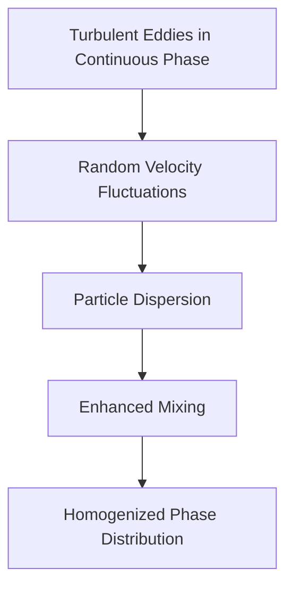
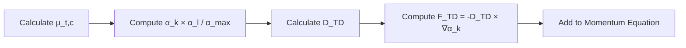
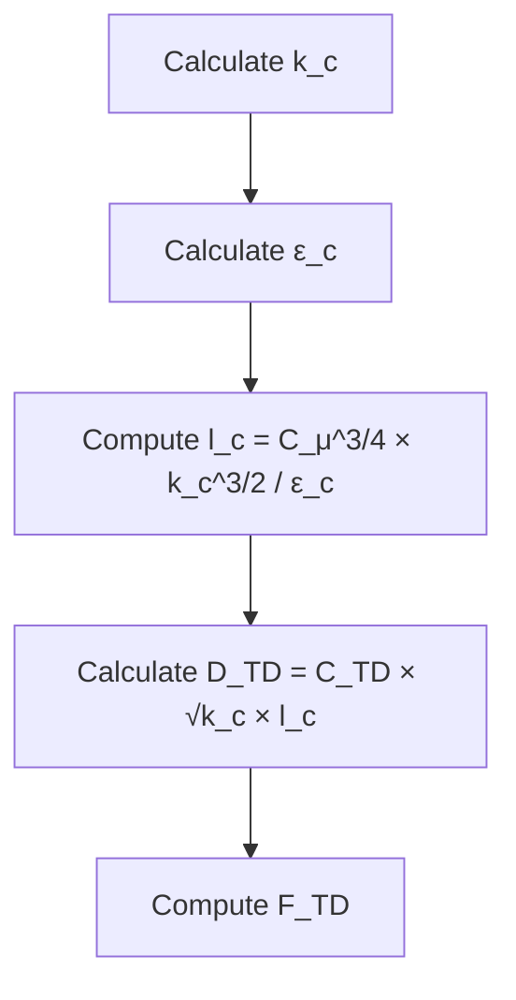
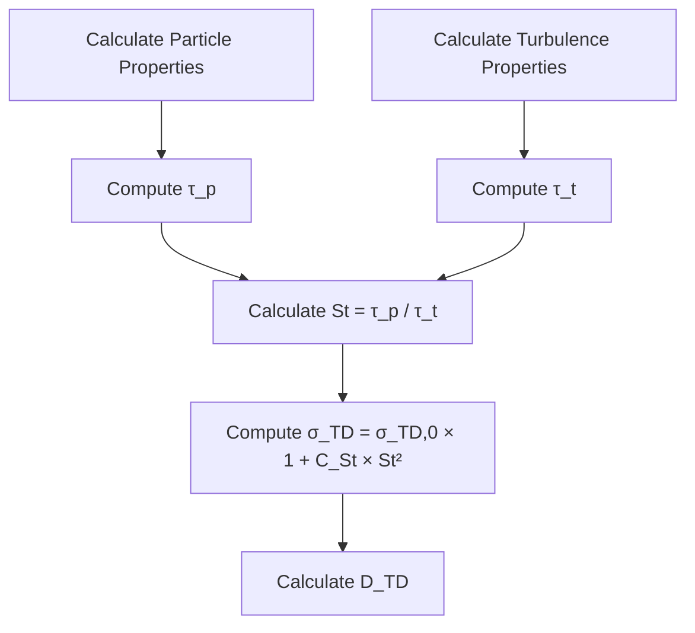
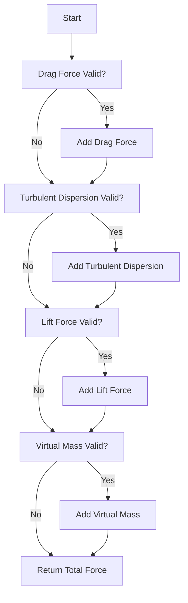

# โมเดลการกระจายตัวเนื่องจากความปั่นป่วนเฉพาะ (Specific Turbulent Dispersion Models)

## บทนำ (Introduction)

**โมเดลการกระจายตัวเนื่องจากความปั่นป่วน (Turbulent Dispersion Models)** ทำหน้าที่กำหนดสัมประสิทธิ์การแพร่ ($D_{TD}$) เพื่อปิดเทอมแรงกระจายตัวในสมการโมเมนตัม โดยส่วนใหญ่จะอิงตามคุณสมบัติความปั่นป่วนของเฟสต่อเนื่อง (เช่น $\mu_{t,c}$, $k_c$, $\varepsilon_c$)

ใน OpenFOAM โมเดลเหล่านี้ถูกนำไปใช้ผ่านคลาส `turbulentDispersionModel` ซึ่งเป็นฐานคลาสแบบนามธรรมสำหรับการพัฒนาโมเดลที่หลากหลาย

> [!INFO] ความสำคัญของการเลือกโมเดล
> การเลือกโมเดลที่เหมาะสมขึ้นอยู่กับประเภทของการไหล คุณสมบัติของเฟส และระดับความแม่นยำที่ต้องการ

---

## 1. โมเดลการแพร่แบบเกรเดียนต์ (Gradient Diffusion Model)

แนวทางที่พบได้บ่อยที่สุดคือการจำลองการกระจายตัวของความปั่นป่วน (turbulent dispersion) เป็นกระบวนการแพร่แบบเกรเดียนต์ (gradient diffusion process):

$$\mathbf{F}_{TD,k} = -D_{TD,k} \nabla \alpha_k \tag{1.1}$$

โดยที่:
- $D_{TD,k}$ คือ **สัมประสิทธิ์การกระจายตัวของความปั่นป่วน** (turbulent dispersion coefficient) สำหรับเฟส $k$
- $\alpha_k$ คือ **สัดส่วนปริมาตร** (volume fraction) ของเฟส $k$

สูตรนี้ปฏิบัติต่อการกระจายตัวของความปั่นป่วนในลักษณะเดียวกับการแพร่แบบโมเลกุล (molecular diffusion) โดยที่ความผันผวนของความปั่นป่วนในเฟสต่อเนื่อง (continuous phase) ทำให้อนุภาคของเฟสที่กระจายตัว (dispersed phase) เคลื่อนที่จากบริเวณที่มีความเข้มข้นสูงไปยังบริเวณที่มีความเข้มข้นต่ำ

### ฟิสิกส์พื้นฐาน (Basic Physics)

- **เกลียวคลื่นความปั่นป่วน (turbulent eddies)** ในเฟสต่อเนื่องสร้างการเคลื่อนที่แบบสุ่มที่มุ่งทำให้การกระจายตัวของเฟสมีความสม่ำเสมอ
- สัมประสิทธิ์ $D_{TD,k}$ แสดงถึงประสิทธิภาพของกระบวนการผสม และขึ้นอยู่กับทั้งลักษณะความปั่นป่วนของเฟสต่อเนื่องและคุณสมบัติของเฟสที่กระจายตัว



---

## 2. โมเดลของ Burns et al. (2004)

โมเดลของ Burns et al. (2004) ที่ใช้กันอย่างแพร่หลายและเป็น **โมเดลที่ง่ายและเสถียรที่สุด** อิงตามสมมติฐานการแพร่แบบเกรเดียนต์ (Gradient Diffusion Hypothesis):

$$D_{TD,k} = \frac{\mu_{t,c}}{\sigma_{TD}} \frac{\alpha_k \alpha_l}{\alpha_{max}} \tag{2.1}$$

โดยที่:
- $\mu_{t,c}$ คือ **ความหนืดของความปั่นป่วน** (turbulent viscosity) ของเฟสต่อเนื่อง
- $\sigma_{TD}$ คือ **จำนวน Schmidt สำหรับการกระจายตัว** (turbulent dispersion Schmidt number) (โดยทั่วไปคือ 0.6-1.0)
- $\alpha_{max}$ คือ **สัดส่วนการอัดแน่นสูงสุด** (maximum packing fraction) (โดยทั่วไปคือ 0.6-0.8)

### การตีความทางฟิสิกส์ (Physical Interpretation)

- ที่สัดส่วนเฟสต่ำ การกระจายตัวจะเพิ่มขึ้นเป็นเส้นตรงตาม $\alpha_k$
- ที่สัดส่วนเฟสสูง เทอม $\alpha_k \alpha_l/\alpha_{max}$ จะจำกัดการกระจายตัว
- โมเดลจะพิจารณาการเปลี่ยนผ่านระหว่างสภาวะเจือจาง (dilute) และสภาวะหนาแน่น (dense) โดยอัตโนมัติ

### OpenFOAM Implementation

```cpp
// Gradient Diffusion Model in OpenFOAM
// Calculate turbulent dispersion force using gradient diffusion approach
template<class PhaseType>
Foam::tmp<Foam::volVectorField>
Foam::TurbulentDispersionModel<PhaseType>::F_TD() const
{
    const PhaseType& phase = this->phase();
    const PhaseType& otherPhase = this->otherPhase();

    // Get turbulent dispersion coefficient
    volScalarField DTD = this->DTD();

    // Return turbulent dispersion force: -D_TD * grad(alpha)
    return -DTD*fvc::grad(phase);
}

// Calculate DTD for Burns et al. model
template<class PhaseType>
Foam::tmp<Foam::volScalarField>
Foam::BurnsDispersionModel<PhaseType>::DTD() const
{
    const PhaseType& phase = this->phase();
    const PhaseType& otherPhase = this->otherPhase();

    // D_TD = (mu_t,c / sigma_TD) * (alpha_k * alpha_l / alpha_max)
    return
        (this->turbulence().nut()/sigmaTD_)
       *(phase*otherPhase/alphaMax_);
}
```

> **📂 Source:** `.applications/solvers/multiphase/multiphaseEulerFoam/interfacialModels/turbulentDispersionModels/turbulentDispersionModel/turbulentDispersionModel.H`

**คำอธิบาย (Explanation):**

โค้ดด้านบนแสดงการนำโมเดลของ Burns et al. ไปใช้ใน OpenFOAM ซึ่งประกอบด้วยสองฟังก์ชันหลัก:

1. **`F_TD()`**: ฟังก์ชันคำนวณแรงกระจายตัวจากความปั่นป่วน (turbulent dispersion force) โดยใช้สูตร $\mathbf{F}_{TD} = -D_{TD} \nabla \alpha$
2. **`DTD()`**: ฟังก์ชันคำนวณสัมประสิทธิ์การกระจายตัว $D_{TD}$ ตามสมการของ Burns et al.

**แนวคิดสำคัญ (Key Concepts):**

- การใช้ `fvc::grad(phase)` สำหรับคำนวณเกรเดียนต์ของสัดส่วนปริมาตร
- การคำนวณ $D_{TD}$ ใช้ความหนืดของความปั่นป่วน (`nut()`) และสัดส่วนปริมาตรของทั้งสองเฟส
- ค่า `sigmaTD_` และ `alphaMax_` เป็นพารามิเตอร์ที่กำหนดใน dictionary



---

## 3. โมเดลของ Lopez de Bertodano (1998)

**โมเดล Lopez de Bertodano (1998)** เป็นหนึ่งในรูปแบบที่นิยมใช้กันอย่างแพร่หลายสำหรับการกระจายตัวของอนุภาคแบบปั่นป่วนในการไหลแบบหลายเฟส

### คุณสมบัติเด่น (Key Features)

- พึ่งพาค่าสัดส่วนเฟสเฉพาะที่ (local phase fractions) อย่างชัดเจน
- เหมาะสำหรับการไหลที่การกระจายตัวของเฟสมีบทบาทสำคัญ
- พิจารณาสัดส่วนเฟสเฉพาะที่ โดยระบุว่าแรงกระจายตัวควรจะแรงที่สุดเมื่อเฟสกระจายตัวมีปริมาณน้อย

### สมการหลัก (Main Equation)

$$D_{TD,k} = C_{TD} \frac{\mu_{t,c}}{\rho_c} \frac{\alpha_k \alpha_l}{\max(\alpha_k, \alpha_l)} \tag{3.1}$$

**นิยามตัวแปร:**
- $D_{TD,k}$: แรงกระจายตัวแบบปั่นป่วนสำหรับเฟส $k$
- $C_{TD}$: สัมประสิทธิ์การกระจายตัวแบบปั่นป่วน (ค่าทั่วไป: 0.1-0.3)
- $\mu_{t,c}$: ความหนืดแบบปั่นป่วนของเฟสต่อเนื่อง
- $\rho_c$: ความหนาแน่นของเฟสต่อเนื่อง
- $\alpha_k, \alpha_l$: สัดส่วนปริมาตรของเฟส $k$ และ $l$

### ลักษณะเฉพาะ (Characteristics)

- **เฟสต่อเนื่อง**: เฟสที่มีสัดส่วนปริมาตรสูงสุดในบริเวณนั้น
- **เทอมที่ไม่สมมาตร**: $\frac{\alpha_k \alpha_l}{\max(\alpha_k, \alpha_l)}$
- ให้การจัดการที่แตกต่างกันขึ้นอยู่กับว่าเฟสใดมีสัดส่วนปริมาตรมากกว่า

### หลักการทางฟิสิกส์ (Physical Principles)

> [!TIP] กลไกการกระจายตัว
> ผลของการกระจายตัวแบบปั่นป่วนควรจะแรงกว่าเมื่อเฟสที่กระจายตัวมีปริมาณน้อย ($\alpha_k$ น้อย) เมื่อเทียบกับเมื่อเฟสที่กระจายตัวมีปริมาณมากในฟิลด์การไหล

โมเดลนี้เหมาะสำหรับระบบ **Gas-Liquid** ที่มีการเปลี่ยนแปลง Void fraction อย่างมากในโดเมน

---

## 4. โมเดลของ Simonin (Kinetic Theory-Based)

**โมเดลของ Simonin** ที่อิงตามทฤษฎีจลนศาสตร์ (kinetic theory-based model) ให้การจำลองที่แม่นยำยิ่งขึ้นโดยพิจารณามาตราส่วนความยาวของความปั่นป่วน

### สมการหลัก (Main Equation)

$$D_{TD,k} = C_{TD} \sqrt{k_c} l_c \tag{4.1}$$

โดยที่:
- $k_c$ คือ **พลังงานจลน์ของความปั่นป่วน** (turbulent kinetic energy) ของเฟสต่อเนื่อง
- $l_c$ คือ **มาตราส่วนความยาวของความปั่นป่วน** (turbulent length scale)
- $C_{TD}$ คือ **สัมประสิทธิ์เชิงประจักษ์** (empirical coefficient) (โดยทั่วไปคือ 0.1-0.5)

### มาตราส่วนความยาวของความปั่นป่วน (Turbulent Length Scale)

$$l_c = C_\mu^{3/4} \frac{k_c^{3/2}}{\epsilon_c} \tag{4.2}$$

โดยที่:
- $C_\mu$ คือ ค่าคงที่ของโมเดลความปั่นป่วน (โดยทั่วไปคือ 0.09)
- $\epsilon_c$ คือ อัตราการสลายตัวของพลังงานจลน์

### ข้อดีของโมเดล Simonin (Advantages)

| ข้อดี | คำอธิบาย |
|---------|-------------|
| **อิงตามฟิสิกส์พื้นฐาน** | อิงตามฟิสิกส์พื้นฐานของความปั่นป่วน |
| **ความหลากหลาย** | สามารถใช้ได้กับสภาวะการไหลที่หลากหลาย |
| **ความสอดคล้อง** | สอดคล้องกับสูตรทฤษฎีจลนศาสตร์ |
| **ความไวต่อข้อจำกัดต่ำ** | มีความไวต่อข้อจำกัดของการอัดแน่นสูงสุดน้อยกว่า |

### OpenFOAM Implementation

```cpp
// Simonin Turbulent Dispersion Model Implementation
// Based on kinetic theory of granular flows
class SimoninTurbulentDispersion
:
    public turbulentDispersionModel
{
private:
    // Turbulent dispersion coefficient (C_TD)
    dimensionedScalar CTD_;

public:
    // Calculate turbulent dispersion coefficient D
    // D = C_TD * sqrt(k_c) * l_c
    virtual tmp<volScalarField> D() const
    {
        const phaseModel& continuous = pair_.continuous();

        const volScalarField& k = continuous.turbulence().k();
        const volScalarField& epsilon = continuous.turbulence().epsilon();

        // Calculate turbulent length scale: l_T = k^(3/2) / epsilon
        volScalarField lT = pow(k, 1.5)/epsilon;

        // Return dispersion coefficient
        return CTD_*sqrt(k)*lT;
    }

    // Calculate turbulent dispersion force Fi
    virtual tmp<volVectorField> Fi() const
    {
        const phaseModel& dispersed = pair_.dispersed();
        const phaseModel& continuous = pair_.continuous();

        const volScalarField& alphaD = dispersed.alpha();
        const volScalarField& alphaC = continuous.alpha();
        const volScalarField& rhoC = continuous.rho();

        const volScalarField Dtd = this->D();

        // F_i = -rho_c * D_TD * alpha_d * alpha_c * grad(alpha_d) / max(alpha_c, small)
        return -rhoC*Dtd*alphaD*alphaC*fvc::grad(alphaD)/max(alphaC, small);
    }
};
```

> **📂 Source:** `.applications/solvers/multiphase/multiphaseEulerFoam/interfacialModels/turbulentDispersionModels/SimininTurbulentDispersion/SimininTurbulentDispersion.H`

**คำอธิบาย (Explanation):**

โค้ดนี้แสดงการนำโมเดลของ Simonin ไปใช้ใน OpenFOAM ซึ่งอิงตามทฤษฎีจลนศาสตร์:

1. **`D()`**: คำนวณสัมประสิทธิ์การกระจายตัวโดยใช้สมการ $D_{TD} = C_{TD} \sqrt{k_c} l_c$
2. **`Fi()`**: คำนวณแรงกระจายตัวโดยพิจารณาความหนาแน่นและสัดส่วนปริมาตรของทั้งสองเฟส

**แนวคิดสำคัญ (Key Concepts):**

- การใช้ `pow(k, 1.5)/epsilon` สำหรับคำนวณมาตราส่วนความยาวของความปั่นป่วน
- การใช้ `max(alphaC, small)` เพื่อป้องกันการหารด้วยศูนย์
- โมเดลนี้เหมาะสำหรับระบบที่มีความหนาแน่นสูง เช่น fluidized beds

โมเดลนี้เหมาะสำหรับระบบ **Fluidized Bed** หรือสารแขวนลอยที่มีความเข้มข้นสูง



---

## 5. โมเดลความปั่นป่วนของส่วนผสม (Mixture Turbulence Model)

**โมเดลความปั่นป่วนของส่วนผสม** นำเสนอรูปแบบที่สมมาตร (symmetric formulation) ซึ่งปฏิบัติต่อทุกเฟสอย่างเท่าเทียมกัน

### คุณสมบัติเฉพาะ (Characteristics)

- ใช้คุณสมบัติความปั่นป่วนเฉลี่ยของส่วนผสม (mixture-averaged turbulence properties)
- เหมาะสำหรับระบบที่ไม่มีการแบ่งแยกระหว่างเฟสต่อเนื่องและเฟสกระจายตัวที่ชัดเจน
- มีประโยชน์อย่างยิ่งในการไหลแบบแก๊ส-ของเหลวที่มีสัดส่วนปริมาตรใกล้เคียงกัน

### สมการหลัก (Main Equation)

แรงกระจายตัวแบบปั่นป่วนสำหรับเฟส $k$ กำหนดโดย:

$$D_{TD,k} = C_{TD} \frac{\mu_{t,m}}{\rho_m} \tag{5.1}$$

### คุณสมบัติของส่วนผสม (Mixture Properties)

คุณสมบัติของส่วนผสมคำนวณจากค่าเฉลี่ยถ่วงน้ำหนัก:

$$\rho_m = \sum_k \alpha_k \rho_k \tag{5.2}$$

$$\mu_{t,m} = \sum_k \alpha_k \mu_{t,k} \tag{5.3}$$

**นิยามตัวแปร:**
- $\rho_m$: ความหนาแน่นของส่วนผสม (ความหนาแน่นมวลรวมของระบบหลายเฟส)
- $\mu_{t,m}$: ความหนืดแบบปั่นป่วนของส่วนผสม (พิจารณาการมีส่วนร่วมของความปั่นป่วนจากทุกเฟส)

### ข้อดีและข้อจำกัด (Advantages and Limitations)

| ข้อดี | ข้อจำกัด |
|---------|-------------|
| อนุรักษ์เชิงคณิตศาสตร์ (mathematically conservative) | อาจประเมินผลการกระจายตัวแบบปั่นป่วนต่ำเกินไปในระบบที่มีพฤติกรรมเฟสกระจายตัวที่ชัดเจน |
| มีความสมมาตรต่อการสลับเฟส (symmetric with respect to phase interchange) | |
| เหมาะสำหรับการนำไปใช้งานเชิงตัวเลขที่เสถียร | |

---

## 6. โมเดล Schmidt Number แบบแปรผัน (Variable Schmidt Number Model)

**โมเดล Schmidt number แบบแปรผัน** นำเสนอแนวทางที่ปรับเปลี่ยนได้ (adaptive approach) สำหรับการสร้างแบบจำลองการกระจายตัวแบบปั่นป่วน

### หลักการ (Principles)

- อนุญาตให้ค่า Schmidt number แบบปั่นป่วน $\sigma_{TD}$ แปรผันตามสภาวะการไหลเฉพาะที่
- แก้ไขข้อจำกัดของแนวทาง Schmidt number แบบคงที่
- สามารถจับภาพฟิสิกส์ที่ซับซ้อนของการปฏิสัมพันธ์ระหว่างความปั่นป่วนกับเฟส

### สมการหลัก (Main Equation)

การแปรผันของ Schmidt number สร้างแบบจำลองดังนี้:

$$\sigma_{TD} = \sigma_{TD,0} (1 + C_{St} St^2) \tag{6.1}$$

**นิยามตัวแปร:**
- $\sigma_{TD,0}$: ค่าพื้นฐานของ Schmidt number แบบปั่นป่วน (โดยทั่วไปประมาณ 0.7-1.0)
- $C_{St}$: สัมประสิทธิ์เชิงประจักษ์ (ค่าทั่วไป: 0.1-1.0)
- $St$: Stokes number

### Stokes Number

Stokes number กำหนดโดย:

$$St = \frac{\tau_p}{\tau_t} = \frac{\rho_k d_k^2}{18 \mu_c} \sqrt{\frac{\epsilon}{\nu}} \tag{6.2}$$

**นิยามตัวแปรเพิ่มเติม:**
- $\tau_p$: เวลาผ่อนคลายของอนุภาค (particle relaxation time)
- $\tau_t$: ช่วงเวลาของความปั่นป่วน (turbulent timescale)
- $d_k$: เส้นผ่านศูนย์กลางลักษณะเฉพาุของอนุภาค/หยด
- $\mu_c$: ความหนืดจลนศาสตร์ของเฟสต่อเนื่อง
- $\epsilon$: อัตราการสลายตัวของความปั่นป่วน
- $\nu$: ความหนืดจลน์ (kinematic viscosity)

### การตีความ Stokes number (Stokes Number Interpretation)

> [!INFO] พฤติกรรมของอนุภาคตาม Stokes number
> - **$St \ll 1$**: อนุภาคติดตาม eddy ของความปั่นป่วนอย่างใกล้ชิด
> - **$St \gg 1$**: อนุภาคไม่ได้รับผลกระทบจากความปั่นป่วนมากนัก

### พฤติกรรมทางฟิสิกส์ (Physical Behavior)

| Stokes number | ลักษณะอนุภาค | การกระจายตัว |
|--------------|----------------|-------------------|
| **สูง (ขนาดใหญ่ หนัก)** | อนุภาคขนาดใหญ่ หนัก | การกระจายตัวแบบปั่นป่วนเพิ่มขึ้นเนื่องจากความเฉื่อยของอนุภาค |
| **ต่ำ (ขนาดเล็ก เบา)** | อนุภาคขนาดเล็ก เบา | การกระจายตัวติดตามความผันผวนของความปั่นป่วนอย่างใกล้ชิด |



---

## 7. โมเดลความเร็วลอยเลื่อน (Drift Velocity Model)

สูตรทางเลือกที่ใช้ความเร็วลอยเลื่อน (drift velocity):

$$\mathbf{F}_{TD,k} = C_{TD} \alpha_k \alpha_l \rho_c (\mathbf{v}_{drift} \cdot \nabla \alpha_l) \tag{7.1}$$

โดยที่ความเร็วลอยเลื่อนคือ:

$$\mathbf{v}_{drift} = -D_{t,c} \frac{\nabla \alpha_l}{\alpha_l} \tag{7.2}$$

และ $D_{t,c} = \mu_{t,c}/\rho_c$ คือ **ความสามารถในการแพร่ของความปั่นป่วน** (turbulent diffusivity)

### คุณสมบัติหลัก (Key Properties)

| คุณสมบัติ | คำอธิบาย |
|-----------|-------------|
| **การตีความในเชิงฟิสิกส์** | ให้การตีความการกระจายตัวในเชิงฟิสิกส์ที่เข้าใจง่ายว่าเป็นการเคลื่อนที่สัมพัทธ์ |
| **การอนุรักษ์โมเมนตัม** | รักษาโมเมนตัมของเฟสโดยอัตโนมัติ |
| **ความสอดคล้อง** | สอดคล้องกับสูตรของของไหลสองเฟส (two-fluid formulation) ของการไหลแบบหลายเฟส |
| **ความเหมาะสม** | เหมาะสำหรับการไหลที่มีเกรเดียนต์สัดส่วนเฟสสูง |

---

## 8. โมเดลที่อิงตาบ PDF (PDF-Based Models)

### แนวทางฟังก์ชันความหนาแน่นของความน่าจะเป็น (Probability Density Function Approach)

การใช้ฟังก์ชันความหนาแน่นของความน่าจะเป็น (probability density function - PDF) ของตำแหน่งอนุภาค:

$$\mathbf{F}_{TD} = -\nabla \cdot (\alpha_d \langle \mathbf{u}'_d \rangle_{PDF}) \tag{8.1}$$

โดยที่ $\langle \cdot \rangle_{PDF}$ หมายถึงการหาค่าเฉลี่ยจาก PDF ของตำแหน่งอนุภาค

### ข้อดีและความท้าทาย (Advantages and Challenges)

| ข้อดี | ความท้าทาย |
|---------|--------------|
| การแสดงฟิสิกส์ของการกระจายตัวของความปั่นป่วนที่แม่นยำที่สุด | ใช้ทรัพยากรในการคำนวณสูง (computationally expensive) |
| สามารถจับผลกระทบที่ไม่ใช่เฉพาะที่ (non-local effects) และผลของหน่วยความจำ (memory effects) | ต้องการวิธีการเชิงตัวเลขที่ซับซ้อน |
| เหมาะสำหรับการไหลแบบปั่นป่วนที่ซับซ้อนซึ่งมีความไม่สมมาตรสูง (strong anisotropy) | มีการนำไปใช้อย่างจำกัดในซอฟต์แวร์เชิงพาณิชย์ |
| ให้ข้อมูลทางสถิติเกี่ยวกับรูปแบบการกระจายตัวของอนุภาค | |

### โมเดลสมการ Langevin (Langevin Equation Models)

สำหรับวิถีอนุภาค (particle trajectories):

$$\frac{d\mathbf{x}_p}{dt} = \mathbf{u}_p + \sqrt{2D_{TD}} \boldsymbol{\xi}(t) \tag{8.2}$$

โดยที่ $\boldsymbol{\xi}(t)$ คือ **สัญญาณรบกวนสีขาว** (white noise) ที่มีค่าเฉลี่ยเป็นศูนย์

### แง่มุมของการนำไปใช้ (Implementation Aspects)

- โดยทั่วไปใช้ในการจำลองการติดตามอนุภาคแบบลากรองจ์ (Lagrangian particle tracking simulations)
- สามารถเชื่อมโยงกับวิธีการแบบออยเลอร์-ลากรองจ์ (Eulerian-Lagrangian methods)
- ให้ข้อมูลระดับอนุภาคโดยละเอียด
- เหมาะสำหรับการไหลที่มีเฟสกระจายตัวแบบเจือจาง (dilute dispersed phase flows)

### คุณสมบัติทางสถิติ (Statistical Properties)

$$\langle \boldsymbol{\xi}(t) \rangle = 0 \tag{8.3}$$

$$\langle \boldsymbol{\xi}(t) \cdot \boldsymbol{\xi}(t') \rangle = \delta(t-t') \tag{8.4}$$

ความแปรปรวนเป็นสัดส่วนกับ $D_{TD}$ แสดงถึงความแข็งแกร่งของการกระจายตัว

---

## 9. การเปรียบเทียบโมเดล (Model Comparison)

### ตารางเปรียบเทียบโมเดลการกระจายตัวของความปั่นป่วน

| โมเดล | หลักการ | ความซับซ้อนในการคำนวณ | ความแม่นยำ | เหมาะสำหรับ |
|---------|-----------|------------------------|-------------|-------------|
| **Gradient Diffusion** | แพร่แบบเกรเดียนต์ | ต่ำ | ปานกลาง | การประยุกต์ใช้ทางวิศวกรรมทั่วไป |
| **Drift Velocity** | ความเร็วลอยเลื่อน | ปานกลาง | ดี-ดีเยี่ยม | การไหลที่มีเกรเดียนต์สูง |
| **PDF-Based** | ฟังก์ชันความหนาแน่นของความน่าจะเป็น | สูงมาก | ยอดเยี่ยม | งานวิจัยและการไหลที่ซับซ้อน |
| **Langevin** | กระบวนการสุ่ม (Stochastic) | สูง | ดี-ยอดเยี่ยม | การติดตามอนุภาคแบบลากรองจ์ |
| **Burns** | Gradient Diffusion พื้นฐาน | ต่ำ | ดี | ระบบ Gas-Liquid ทั่วไป |
| **Bertodano** | Asymmetric Alpha | ปานกลาง | ดี | ระบบที่มี Void fraction ผันผวนสูง |
| **Simonin** | Kinetic Theory | สูง | ดี-ยอดเยี่ยม | ระบบของแข็ง-ของเหลว, หนาแน่น |

---

## 10. การเลือกพารามิเตอร์ (Parameter Selection)

### สัมประสิทธิ์การกระจายตัวเนื่องจากความปั่นป่วน ($C_{TD}$)

| ค่า | คำอธิบาย | การใช้งานที่เหมาะสม |
|-----|-------------|-------------------|
| **0.1 - 0.5** | การกระจายตัวน้อย | กระแสการไหลที่มีความเฉพาะเจาะจงต่ำ |
| **1.0** | ค่าเริ่มต้นใน OpenFOAM | การใช้งานทั่วไป |
| **1.0 - 1.5** | การกระจายตัวมาก | การไหลแบบปั่นป่วนอย่างยิ่ง |

> [!WARNING] การตีความทางกายภาพ
> แสดงถึงประสิทธิภาพของกระแสหมุนวนเนื่องจากความปั่นป่วนในการกระจายเฟสกระจายตัว

### จำนวน Schmidt ($\sigma_{TD}$)

| ค่า | ความหมาย | ผลกระทบ |
|-----|------------|-----------|
| **0.7** | การแพร่ของโมเมนตัมสูงกว่า | การกระจายตัวน้อยลง |
| **0.9 - 1.0** | ค่าเริ่มต้น | สมดุลมาตรฐาน |
| **1.3** | การแพร่ของโมเมนตัมต่ำกว่า | การกระจายตัวมากขึ้น |

> [!TIP] ความหมายทางกายภาพ
> อัตราส่วนของความสามารถในการแพร่ของโมเมนตัมต่อความสามารถในการแพร่ของมวล (หรือเศษส่วนปริมาตร)

---

## 11. การเชื่อมโยงกับระบบเฟส (Integration with Phase Systems)

ใน Solver `multiphaseEulerFoam` การกระจายตัวเนื่องจากความปั่นป่วนจะถูกรวมเข้าผ่าน:

### การถ่ายโอนโมเมนตัมระหว่างรอยต่อ (Interfacial Momentum Transfer)

แรงจากการกระจายตัวเนื่องจากความปั่นป่วนมีส่วนช่วยในเทอมการถ่ายโอนโมเมนตัมระหว่างรอยต่อในสมการโมเมนตัมของแต่ละเฟส

### การเชื่อมโยงเศษส่วนปริมาตร (Volume Fraction Coupling)

แรงขึ้นอยู่กับเกรเดียนต์ของเศษส่วนปริมาตร ทำให้เกิดการเชื่อมโยงที่แข็งแกร่งระหว่างเฟส

### การรวมเข้ากับโมเดลความปั่นป่วน (Turbulence Model Integration)

ความหนืดเนื่องจากความปั่นป่วนจากโมเดลความปั่นป่วนของเฟสต่อเนื่องจะถูกนำมาใช้ในการคำนวณสัมประสิทธิ์การกระจายตัว

### OpenFOAM Code: การเชื่อมโยงกับรุ่นการลาก

```cpp
// Interfacial momentum transfer: combining all force models
// Total interfacial force F = F_drag + F_turbulentDispersion + F_lift + F_virtualMass
template<class BasePhaseSystem>
tmp<volVectorField> PhasePair::F() const
{
    // Create a temporary force field initialized to zero
    tmp<volVectorField> tF
    (
        new volVectorField
        (
            IOobject
            (
                "F",
                mesh_.time().timeName(),
                mesh_,
                IOobject::NO_READ,
                IOobject::NO_WRITE
            ),
            mesh_,
            dimensionedVector("F", dimensionSet(1, -2, -2, 0, 0, 0, 0), Zero)
        )
    );

    volVectorField& F = tF.ref();

    // Add drag force contribution if valid
    if (drag_.valid())
    {
        F += drag_->F();
    }

    // Add turbulent dispersion force contribution if valid
    if (turbulentDispersion_.valid())
    {
        F += turbulentDispersion_->F();
    }

    // Add lift force contribution if valid
    if (lift_.valid())
    {
        F += lift_->F();
    }

    // Add virtual mass force contribution if valid
    if (virtualMass_.valid())
    {
        F += virtualMass_->F();
    }

    return tF;
}
```

> **📂 Source:** `.applications/solvers/multiphase/multiphaseEulerFoam/phaseSystems/PhaseSystems/MomentumTransferPhaseSystem/MomentumTransferPhaseSystem.C`

**คำอธิบาย (Explanation):**

โค้ดนี้แสดงวิธีการรวมแรงทั้งหมดที่กระทำต่ออินเทอร์เฟสระหว่างเฟสใน OpenFOAM:

1. **การสร้างฟิลด์แรง**: สร้างฟิลด์เวกเตอร์สำหรับเก็บแรงรวมที่มิติเป็น [kg/(m²·s²)]
2. **การเพิ่มแรงแต่ละชนิด**: ตรวจสอบว่าโมเดลแรงแต่ละชนิดมีความถูกต้องหรือไม่ และเพิ่มผลกระทบของแรงนั้นๆ ลงในฟิลด์แรงรวม
3. **แรงที่รวมเข้าด้วยกัน**: แรงลาก (drag), การกระจายตัวจากความปั่นป่วน (turbulent dispersion), แรงยก (lift), และแรงมวลเสมือน (virtual mass)

**แนวคิดสำคัญ (Key Concepts):**

- การใช้ `.valid()` สำหรับตรวจสอบว่ามีการกำหนดโมเดลแรงหรือไม่
- การใช้ `dimensionSet(1, -2, -2, 0, 0, 0, 0)` สำหรับกำหนดมิติของแรงต่อหน่วยปริมาตร
- การเพิ่มแรงทั้งหมดเข้าด้วยกันในสมการโมเมนตัมของแต่ละเฟส



---

## สรุป (Summary)

การเลือกโมเดลการกระจายตัวเนื่องจากความปั่นป่วนที่เหมาะสมขึ้นอยู่กับ:

1. **ประเภทของการไหล**: Gas-liquid, solid-liquid, หรือ gas-solid
2. **ระดับความเข้มข้น**: Dilute หรือ dense
3. **ความแม่นยำที่ต้องการ**: การใช้งานทางวิศวกรรม หรือ งานวิจัย
4. **ทรัพยากรการคำนวณ**: ข้อจำกัดด้านเวลาและหน่วยความจำ

> [!TIP] คำแนะนำในการเลือกโมเดล
> - **เริ่มต้น**: ใช้โมเดล Burns สำหรับการประยุกต์ใช้ทั่วไป
> - **Void fraction ผันผวนสูง**: ใช้โมเดล Bertodano
> - **ระบบหนาแน่น**: ใช้โมเดล Simonin
> - **ความแม่นยำสูงสุด**: ใช้โมเดล PDF-based หรือ Langevin

การเลือกค่า **Turbulent Schmidt Number ($\sigma_{TD}$)** ที่ถูกต้องมีผลอย่างมากต่อการทำนายโปรไฟล์ความเข้มข้นของอนุภาค หากตั้งค่าต่ำเกินไปอนุภาคจะฟุ้งกระจายมากเกินความจริง