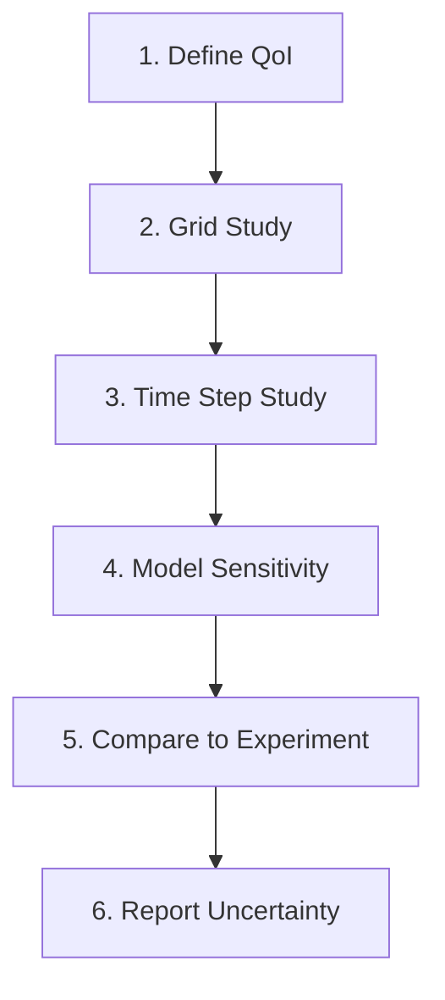

# Validation Overview

ภาพรวมการตรวจสอบความถูกต้องของ Multiphase Simulation

> **ทำไม Validation สำคัญที่สุด?**
> - **CFD ที่ไม่ validated = ไม่น่าเชื่อถือ**
> - Multiphase ยิ่งซับซ้อน → ยิ่งต้อง validate มากขึ้น
> - เข้าใจ GCI, mass balance, volume conservation

---

## Overview

> **💡 Verification ≠ Validation**
>
> Verification: "Solving equations right" | Validation: "Solving right equations"


| Stage | Question | Method |
|-------|----------|--------|
| **Verification** | Is the code solving equations correctly? | MMS, exact solutions |
| **Validation** | Is the model representing physics correctly? | Experimental comparison |

---

## 1. Verification vs Validation

### Verification

- **Code Verification**: No bugs in implementation
- **Solution Verification**: Numerical errors acceptable

### Validation

- **Model Validation**: Physics models appropriate
- **Uncertainty Quantification**: Error bounds known

---

## 2. Error Types

| Error Type | Source | Detection |
|------------|--------|-----------|
| **Discretization** | Mesh, time step | Grid convergence |
| **Iteration** | Solver tolerance | Residual monitoring |
| **Round-off** | Floating point | Double vs single precision |
| **Model** | Physics approximation | Experimental comparison |

---

## 3. Grid Convergence Index (GCI)

### Three-Grid Method

$$p = \frac{\ln\left(\frac{\phi_3 - \phi_2}{\phi_2 - \phi_1}\right)}{\ln(r)}$$

$$\text{GCI} = F_s \frac{|\varepsilon|}{r^p - 1}$$

| Parameter | Value |
|-----------|-------|
| $r$ (refinement ratio) | 2 (typical) |
| $F_s$ (3 grids) | 1.25 |
| $F_s$ (2 grids) | 3.0 |

### Target GCI

| Application | GCI |
|-------------|-----|
| Research | < 1% |
| Engineering | < 3% |
| Screening | < 5% |

---

## 4. Multiphase-Specific Checks

### Interface Resolution

| Method | Target Cells |
|--------|--------------|
| VOF | 2-3 cells across interface |
| Level Set | 3-5 cells |

### Volume Conservation

$$\epsilon_{vol} = \frac{V_{final} - V_{initial}}{V_{initial}} \times 100\%$$

- Target: < 1%

### Mass Balance

$$\sum_k \dot{m}_{in,k} - \sum_k \dot{m}_{out,k} = \frac{d}{dt}\int_V \sum_k \alpha_k \rho_k \, dV$$

---

## 5. Key Benchmark Cases

| Case | Physics | Metric |
|------|---------|--------|
| Rising bubble | Surface tension, buoyancy | Terminal velocity |
| Bubble column | Drag, dispersion | Gas holdup |
| Fluidized bed | Granular, drag | Bed expansion |
| Dam break | Free surface | Front position |

---

## 6. OpenFOAM Tools

### Residuals

```cpp
// system/controlDict
residuals
{
    type            residuals;
    fields          (p U "alpha.*");
    writeControl    timeStep;
}
```

### Function Objects

```cpp
functions
{
    massBalance
    {
        type            volFieldValue;
        operation       volIntegrate;
        fields          (alpha.water);
    }
}
```

### Post-Processing

```bash
# Extract data
foamLog log.interFoam

# Sample
postProcess -func sample
```

---

## 7. Validation Workflow



### Quantity of Interest (QoI)

| Type | Examples |
|------|----------|
| Integral | Gas holdup, pressure drop |
| Local | Velocity profile, α distribution |
| Time-dependent | Transient behavior |

---

## Quick Reference

| Check | Method | Target |
|-------|--------|--------|
| Grid independence | GCI | < 3% |
| Volume conservation | Time integral | < 1% |
| Residuals | Monitor | < 1e-6 |
| Experimental | Compare | Within uncertainty |

---

## Concept Check

<details>
<summary><b>1. Verification กับ Validation ต่างกันอย่างไร?</b></summary>

- **Verification**: "Solving equations **right**" (math correct)
- **Validation**: "Solving **right equations**" (physics correct)
</details>

<details>
<summary><b>2. ทำไมต้องใช้ 3 grids สำหรับ GCI?</b></summary>

เพราะต้องหา **observed order of accuracy** $p$ ซึ่งต้องการ 3 data points สำหรับ fitting
</details>

<details>
<summary><b>3. Volume conservation สำคัญอย่างไรใน multiphase?</b></summary>

ถ้า volume **ไม่อนุรักษ์** → mass balance ผิด → ผลลัพธ์ไม่น่าเชื่อถือ โดยเฉพาะสำหรับ long simulations
</details>

---

## Related Documents

- **Validation Methodology:** [01_Validation_Methodology.md](01_Validation_Methodology.md)
- **Benchmark Problems:** [02_Benchmark_Problems.md](02_Benchmark_Problems.md)
- **Grid Convergence:** [03_Grid_Convergence.md](03_Grid_Convergence.md)