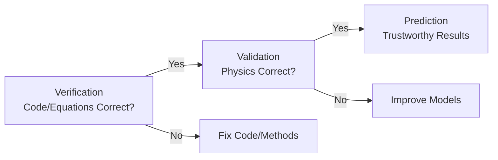
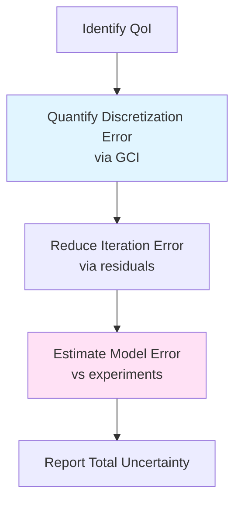
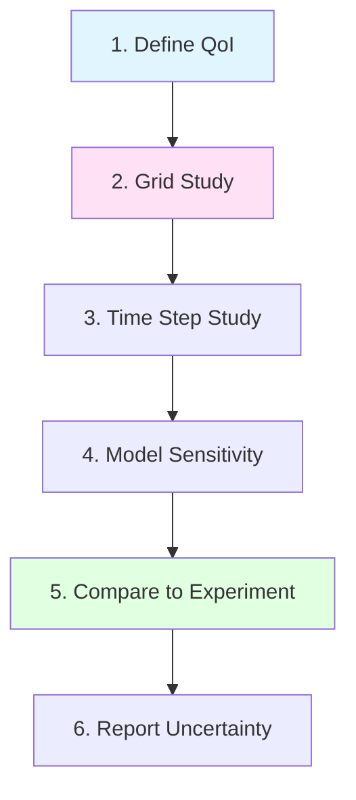

# Validation Overview

ภาพรวมการตรวจสอบความถูกต้องของ Multiphase Simulation

> **ทำไม Validation สำคัญที่สุด?**
> - **CFD ที่ไม่ validated = ไม่น่าเชื่อถือ**
> - Multiphase ยิ่งซับซ้อน → ยิ่งต้อง validate มากขึ้น
> - เข้าใจ GCI, mass balance, volume conservation

---

## Learning Objectives

หลังจากอ่านบทนี้ คุณควรจะสามารถ:

- **WHAT:** อธิบายความแตกต่างระหว่าง Verification และ Validation
- **WHY:** เข้าใจความสำคัญของการทำ validation สำหรับ multiphase simulations และผลกระทบของ error types ต่อความน่าเชื่อถือของผลลัพธ์
- **HOW:** นำไปใช้ validation workflow สำหรับ multiphase flows, ใช้ grid convergence index (GCI) และ uncertainty quantification, ตรวจสอบ volume conservation และ mass balance ด้วย OpenFOAM function objects

---

## Overview

> **💡 Verification ≠ Validation**
>
> **WHAT are they?**
> - **Verification**: "Solving equations **right**" - ตรวจสอบความถูกต้องทางคณิตศาสตร์
> - **Validation**: "Solving **right equations**" - ตรวจสอบความถูกต้องทางฟิสิกส์
>
> **WHY distinguish them?**
> - Verification = โค้ดแกะสมการถูกไหม (code verification) และผลเฉลยลู่เข้าหาค่าจริงไหม (solution verification)
> - Validation = โมเดลฟิสิกส์ใช้ได้ไหมกับปัญหาจริง
>
> **HOW to apply?**
> - ต้องผ่าน verification ก่อน จึงจะสามารถไป validation กับ experiment ได้



| Stage | Question | Method | Output |
|-------|----------|--------|--------|
| **Verification** | Is the code solving equations correctly? | MMS, exact solutions, grid convergence | Numerical error bounds |
| **Validation** | Is the model representing physics correctly? | Experimental comparison, benchmark cases | Physical accuracy |

---

## 1. Verification vs Validation

### 1.1 What is Verification?

**Code Verification:**
- **WHAT:** ตรวจสอบว่าไม่มี bugs ในการ implement สมการ
- **WHY:** โค้ดที่มี bug จะให้ผลลัพธ์ผิดเสมอ ไม่ว่าจะใช้ mesh ดีแค่ไหน
- **HOW:** Method of Manufactured Solutions (MMS), ทดสอบกับ exact solutions, verify conservation properties

**Solution Verification:**
- **WHAT:** แน่ใจว่า numerical errors (discretization, iteration) อยู่ในระดับที่ยอมรับได้
- **WHY:** ต้องรู้ error bounds เพื่อระบุ uncertainty ของผลลัพธ์
- **HOW:** Grid convergence studies, time step refinement, residual monitoring

### 1.2 What is Validation?

**Model Validation:**
- **WHAT:** ตรวจสอบว่า physics models (drag, turbulence, surface tension) เหมาะสมกับปัญหาที่แก้
- **WHY:** Multiphase flows มี closure models หลายอย่าง แต่ละ model มีขอบเขตที่ใช้ได้
- **HOW:** เปรียบเทียบกับ experimental data, benchmark cases, วัดความแม่นยำของ Quantity of Interest (QoI)

**Uncertainty Quantification:**
- **WHAT:** ระบุช่วงความเชื่อมั่นของผลลัพธ์ (confidence intervals)
- **WHY:** ทำให้สามารถตัดสินใจใช้ผลลัพธ์ได้อย่างมั่นใจ
- **HOW:** Propagation of errors, sensitivity analysis, statistical methods

---

## 2. Error Types

### 2.1 What Are the Main Error Sources?

| Error Type | Source | Detection | Control Method |
|------------|--------|-----------|----------------|
| **Discretization Error** | Finite mesh/timestep resolution | Grid convergence study | Refine mesh/timestep |
| **Iteration Error** | Solver tolerance, convergence criteria | Residual monitoring | Tighten tolerance |
| **Round-off Error** | Floating-point precision | Double vs single precision test | Use double precision |
| **Modeling Error** | Physics approximations (RANS, VOF) | Experimental validation | Improve/select models |
| **User Error** | Wrong BCs, parameters, setup | Peer review, sensitivity studies | Training, checklists |

### 2.2 Why This Matters for Multiphase?

Multiphase flows มี error sources พิเศษ:
- **Interface tracking**: VOF/Level set มี numerical diffusion
- **Closure models**: Drag, lift, turbulent dispersion มี empirical parameters
- **Coupling**: Phase coupling เพิ่มความซับซ้อนของ convergence

### 2.3 How to Control Errors?



---

## 3. Grid Convergence Index (GCI)

> **📘 Note:** สำหรับรายละเอียดการคำนวณ GCI และ derivation แบบเต็ม ให้ดู [03_Grid_Convergence.md](03_Grid_Convergence.md)

### 3.1 What is GCI?

**WHAT:** Grid Convergence Index เป็น metric ที่แสดงถึงความคลาดเคลื่อนจากการ discretize ช่องว่าง (grid) เป็นหลักมูลตามวิธีการของ Roache

**WHY:** 
- ให้มาตรฐานที่เป็นที่ยอมรับในการรายงาน grid independence
- แปลงความคลาดเคลื่อนจาก grid เป็นรูปแบบที่สามารถเปรียบเทียบได้
- เป็นตัวชี้วัด uncertainty จาก mesh ที่เชื่อถือได้

### 3.2 How to Calculate GCI (Brief Summary)

**Three-Grid Method:**

$$p = \frac{\ln\left(\frac{\phi_3 - \phi_2}{\phi_2 - \phi_1}\right)}{\ln(r)}$$

$$\text{GCI}_{12} = F_s \frac{|\phi_2 - \phi_1|}{r^p - 1}$$

| Parameter | Symbol | Typical Value |
|-----------|--------|---------------|
| Refinement ratio | $r = h_2/h_1$ | 2 (recommended ≥ 1.3) |
| Safety factor (3 grids) | $F_s$ | 1.25 |
| Safety factor (2 grids) | $F_s$ | 3.0 |

### 3.3 GCI Targets by Application

| Application | GCI Target | Rationale |
|-------------|-----------|-----------|
| **Research** | < 1% | High accuracy required for publication |
| **Engineering design** | < 3% | Acceptable for design decisions |
| **Screening studies** | < 5% | Sufficient for trend identification |

### 3.4 Quick GCI Checklist

- [ ] ใช้อย่างน้อย 3 grids (fine, medium, coarse)
- [ ] Refinement ratio $r$ คงที่ ($r \geq 1.3$)
- [ ] Grids อยู่ใน asymptotic range ($p \approx p_{theoretical}$)
- [ ] Monitor QoI ที่สำคัญ (ไม่ใช่แค่ point values)
- [ ] รายงานทั้ง GCI และ apparent order $p$

---

## 4. Multiphase-Specific Checks

### 4.1 Interface Resolution

**WHAT:** ตรวจสอบว่า mesh ละเอียดพอที่จะ resolve interface ระหว่าง phases ได้

**WHY:** Interface ที่ resolve ไม่ดี → numerical diffusion → surface tension force ผิด → shape/motion ผิด

**HOW:** ประเมินด้วย cell count ข้าม interface:

| Method | Target Cells Across Interface | OpenFOAM Check |
|--------|------------------------------|----------------|
| VOF (interFoam) | 2-3 cells | `postProcess -func interfaceThickness` |
| Level Set | 3-5 cells | Visualize `alpha` isosurfaces |
| Euler-Euler | N/A (statistical) | Check mesh vs bubble/particle size |

```cpp
// Example: Check interface thickness in system/controlDict
functions
{
    interfaceThickness
    {
        type    interfaceThickness;
        phase   alpha.water;
        region  interface; // 0.1 < alpha < 0.9
    }
}
```

### 4.2 Volume Conservation

**WHAT:** ตรวจสอบว่าปริมาตรรวมของแต่ละ phase ถูกอนุรักษ์ (conserved) ตลอดการจำลอง

**WHY:** VOF method อนุญาตให้มี numerical errors เล็กน้อย แต่ถ้า accumulation → unphysical และ mass balance ผิด

**HOW:** Monitor global volume fraction:

$$\epsilon_{vol} = \frac{V_{final} - V_{initial}}{V_{initial}} \times 100\%$$

**Target:** < 1% สำหรับ simulations ที่ยาว

**OpenFOAM Implementation:**

```cpp
// system/controlDict
functions
{
    volumeConservation
    {
        type            volFieldValue;
        operation       volIntegrate;
        fields          (alpha.water alpha.air);
        writeControl    timeStep;
    }
}
```

```bash
# Check volume conservation
foamLog log.interFoam
grep volFieldValue log.volFieldValue | awk '{print $2-$3}'
```

### 4.3 Mass Balance

**WHAT:** ตรวจสอบว่า mass flow rate เข้า-ออก สมดุลกับ rate of change ใน domain

**WHY:** Multiphase flows มีหลาย phases → ต้องตรวจสอบทุก phase

**HOW:** Integral form of mass conservation:

$$\sum_k \dot{m}_{in,k} - \sum_k \dot{m}_{out,k} = \frac{d}{dt}\int_V \sum_k \alpha_k \rho_k \, dV$$

**OpenFOAM Implementation:**

```cpp
// system/controlDict
functions
{
    massBalanceWater
    {
        type            surfaceFieldValue;
        operation       sum;
        surfaceFormat   none;
        regionType      patch;
        name            inlet;
        fields          
        (
            phi         // Mass flux
        );
    }
    
    totalMass
    {
        type            volFieldValue;
        operation       volIntegrate;
        fields          (rho); // For compressible
    }
}
```

### 4.4 Additional Multiphase Checks

| Check | What to Monitor | Target | OpenFOAM Tool |
|-------|----------------|--------|---------------|
| **CFL number** | Interface velocity × Δt/Δx | < 1 (explicit) | `foamListTimes` |
| **Capillary number** | μU/σ | Compare to regime | `postProcess` |
| **Bounding** | 0 ≤ α ≤ 1 | Enforced | Check `alpha.*` min/max |
| **Courant number per phase** | |αU|Δt/Δx | < 0.3 (VOF) | `Co` function object |

---

## 5. Key Benchmark Cases

### 5.1 Why Use Benchmarks?

**WHAT:** Test cases ที่มี experimental data คุณภาพสูง ใช้สำหรับ validate multiphase solvers

**WHY:**
- แยกปัญหา physics models vs numerical implementation
- มี reference solutions ที่ community ยอมรับ
- สร้างความมั่นใจก่อนไป solve ปัญหาจริง

### 5.2 Standard Benchmark Cases

| Case | Physics | Quantity of Interest | OpenFOAM Solver |
|------|---------|---------------------|-----------------|
| **Rising bubble** | Surface tension, buoyancy | Terminal velocity, shape | interIsoFoam |
| **Bubble column** | Drag, dispersion, turbulence | Gas holdup, velocity profiles | twoPhaseEulerFoam |
| **Fluidized bed** | Granular, drag, collisions | Bed expansion, pressure drop | reactingTwoPhaseEulerFoam |
| **Dam break** | Free surface, impact | Front position, pressure | interFoam |
| **Rayleigh-Taylor** | Interface instability | Mixing layer growth | interIsoFoam |
| **Water jet** | Surface tension breakup | Droplet size distribution | compressibleInterFoam |

### 5.3 Validation Metrics

| Metric Type | Examples | How to Calculate |
|-------------|----------|------------------|
| **Integral** | Gas holdup, total force | `volIntegrate`, `forces` function object |
| **Local** | Velocity profiles, α distribution | `sample`, `sets` |
| **Time-dependent** | Front position, transient response | Compare time series |
| **Statistical** | Mean/rms of fluctuations | `fieldMinMax`, `fieldAverage` |

---

## 6. OpenFOAM Tools for Validation

### 6.1 Residual Monitoring

```cpp
// system/controlDict
residuals
{
    type            residuals;
    fields          (p U "alpha.*");
    writeControl    timeStep;
    
    // Custom tolerance
    tolerance
    {
        p           1e-6;
        U           1e-5;
        alpha.water 1e-5;
    }
}
```

**Usage:**
```bash
# Monitor residuals during run
tail -f log.interFoam | grep "solution"
```

### 6.2 Function Objects for Conservation

```cpp
// system/controlDict
functions
{
    // Volume fraction check
    volFractionCheck
    {
        type            volFieldValue;
        operation       none;
        fields          (alpha.water);
        writeFields     true;
    }
    
    // Mass flow at boundaries
    massFlowInlet
    {
        type            surfaceFieldValue;
        operation       sum;
        regionType      patch;
        name            inlet;
        fields          (phi);
    }
    
    // Interface tracking
    interfacePosition
    {
        type            surfaces;
        surfaceFormat   vtk;
        interpolationScheme cellPoint;
        surfaces
        (
            "alphaIso=0.5"
        );
        fields          (alpha.water);
    }
}
```

### 6.3 Sampling for Validation

```cpp
// system/sampleDict
sets
(
    centerLine
    {
        type    uniform;
        axis    xyz;
        start   (0 0 0);
        end     (0 1 0);
        nPoints 100;
    }
);

surfaces
(
    midPlane
    {
        type    plane;
        plane   (0 1 0) (0 0 0);
        interpolate true;
    }
);
```

**Run sampling:**
```bash
# Sample data along lines/surfaces
postProcess -func sample

# Extract time history
foamLog log.interFoam
```

### 6.4 Forces and Coefficients

```cpp
// system/controlDict
functions
{
    forces
    {
        type            forces;
        libs            ("libforces.so");
        writeControl    timeStep;
        
        patches         (obstacle);
        rho             rhoInf;
        rhoInf          1000; // Water density
        log             true;
    }
    
    forceCoeffs
    {
        type            forceCoeffs;
        libs            ("libforces.so");
        
        patches         (obstacle);
        magUInf         1.0;
        lRef            1.0;
        ARef            1.0;
        
        liftDir         (0 1 0);
        dragDir         (1 0 0);
        CofR            (0 0 0);
    }
}
```

---

## 7. Validation Workflow

### 7.1 Systematic Approach

**WHAT:** End-to-end process จาก problem definition ไปจนถึง uncertainty reporting

**WHY:** ลดความเสี่ยงจาก missed checks และ ensure reproducibility

**HOW:** Follow 6-step workflow:



### 7.2 Step-by-Step Details

#### **Step 1: Define Quantity of Interest (QoI)**
| Type | Examples | When to Use |
|------|----------|-------------|
| **Integral** | Gas holdup, pressure drop, total force | Overall system performance |
| **Local** | Velocity profile, void fraction distribution | Detailed physics understanding |
| **Time-dependent** | Transient front position, frequency | Unsteady phenomena |

#### **Step 2: Grid Convergence Study**
- Run ≥ 3 systematically refined meshes
- Calculate GCI for QoI
- Confirm asymptotic range

#### **Step 3: Time Step Independence**
- Halve Δt until QoI changes < 1%
- Consider adaptive time stepping (adjustableRunTime)

#### **Step 4: Model Sensitivity**
- Vary closure models (drag, turbulence)
- Test parameter ranges (e.g., drag coefficient)
- Compare to experimental trends

#### **Step 5: Experimental Comparison**
- Plot simulation vs experiment for QoI
- Calculate error metrics (RMSE, MAE, R²)
- Discuss physics of discrepancies

#### **Step 6: Uncertainty Reporting**
```markdown
## Results
- **Predicted QoI:** 0.85 ± 0.05 (GCI: 2.3%)
- **Experimental:** 0.82 ± 0.08
- **Difference:** 3.7% (within uncertainty bounds)
```

### 7.3 Validation Checklist

- [ ] QoI defined and measurable
- [ ] Grid independence achieved (GCI < target)
- [ ] Time step independence confirmed
- [ ] Volume conservation < 1%
- [ ] Mass balance satisfied
- [ ] Compared to experimental data
- [ ] Uncertainties quantified and reported
- [ ] Setup documented and reproducible

---

## Quick Reference

| Check | Method | Target | OpenFOAM Tool |
|-------|--------|--------|---------------|
| **Grid independence** | GCI (3 grids) | < 3% engineering | `refineMesh` + manual |
| **Time step** | Δt/2 test | < 1% change | `adjustableRunTime` |
| **Volume conservation** | ∫α dV | < 1% drift | `volFieldValue` |
| **Residuals** | Monitor | < 1e-6 | `residuals` function object |
| **Mass balance** | Surface flux | Global balance | `surfaceFieldValue` |
| **Experimental** | Compare QoI | Within uncertainty | `sample`, `probes` |

---

## Key Takeaways

✅ **Verification ≠ Validation**
- Verification: โค้ด/สมการถูกไหม (mathematical correctness)
- Validation: ฟิสิกส์ถูกไหม (physical accuracy)

✅ **Multiphase requires additional checks**
- Interface resolution: 2-3 cells across interface for VOF
- Volume conservation: < 1% drift สำคัญสำหรับ long simulations
- Mass balance: ตรวจสอบทุก phase

✅ **GCI is the standard for grid independence**
- ใช้อย่างน้อย 3 grids ด้วย refinement ratio คงที่
- รายงานทั้ง GCI value และ apparent order $p$
- Target: < 1% (research), < 3% (engineering)

✅ **Follow systematic validation workflow**
1. Define QoI
2. Grid study → GCI
3. Time step study → independence
4. Model sensitivity → physics understanding
5. Experimental comparison → accuracy assessment
6. Uncertainty quantification → confidence bounds

✅ **OpenFOAM provides comprehensive tools**
- `residuals`: Monitor convergence
- `volFieldValue`, `surfaceFieldValue`: Check conservation
- `sample`, `sets`: Extract validation data
- `forces`, `forceCoeffs`: Calculate integral quantities

✅ **Always report uncertainties**
- Numerical uncertainty (GCI, time step)
- Experimental uncertainty (error bars)
- Total uncertainty = combined effects

---

## Concept Check

<details>
<summary><b>1. Verification กับ Validation ต่างกันอย่างไร?</b></summary>

- **Verification**: "Solving equations **right**" - ตรวจสอบว่าสมการถูกแก้ด้วยวิธีที่ถูกต้อง (mathematical correctness)
- **Validation**: "Solving **right equations**" - ตรวจสอบว่าสมการที่ใช้สามารถ describe ฟิสิกส์ได้ถูกต้อง (physical accuracy)

ตัวอย่าง: Verification = แก้ Navier-Stokes ถูกไหม, Validation = ใช้ k-ε model เหมาะกับ flow นี้ไหม
</details>

<details>
<summary><b>2. ทำไมต้องใช้ 3 grids สำหรับ GCI?</b></summary>

เพราะต้องหา **observed order of accuracy** $p$ ซึ่งต้องการ 3 data points เพื่อ:
1. Confirm ว่าอยู่ใน asymptotic range ($p \approx p_{theoretical}$)
2. ใช้ safety factor $F_s = 1.25$ (ถ้าใช้ 2 grids ต้องใช้ $F_s = 3.0$ ซึ่ง conservative มาก)

ถ้าใช้ 2 grids: ไม่สามารถคำนวณ $p$ ได้ → ต้อง assume $p$ → uncertainty สูงขึ้น
</details>

<details>
<summary><b>3. Volume conservation สำคัญอย่างไรใน multiphase?</b></summary>

ถ้า volume **ไม่อนุรักษ์** → mass balance ผิด → ผลลัพธ์ไม่น่าเชื่อถือ โดยเฉพาะ:

- **Long simulations**: Errors accumulate → ผลลัพธ์ drift ออกจากความจริง
- **Closed systems**: Volume ควรคงที่ → ถ้าเปลี่ยน = มีปัญหา
- **VOF method**: Numerical diffusion ทำให้ interface diffuse → volume diffusion

Monitoring: `volFieldValue` บน `alpha.*` ทุก time step
</details>

<details>
<summary><b>4. QoI คืออะไรและทำไมสำคัญ?</b></summary>

**QoI (Quantity of Interest)** = ปริมาณที่เราสนใจจริงๆ จาก simulation

**สำคัญเพราะ:**
- Validation ต้อง focus บน metric ที่ใช้ตัดสินใจ ไม่ใช่ทุกอย่าง
- Grid/time step independence ต้อง check QoI ไม่ใช่แค่ point values
- ช่วย prioritize computational resources (refine ตรงที่สำคัญ)

ตัวอย่าง: Bubble column → gas holdup (global), riser velocity profile (local)
</details>

<details>
<summary><b>5. อธิบาย workflow จาก problem definition ไปจนถึง uncertainty reporting</b></summary>

**6-step validation workflow:**

1. **Define QoI**: กำหนด metric ที่ใช้ validate (e.g., terminal velocity)
2. **Grid Study**: Run 3+ meshes, calculate GCI → ensure < target
3. **Time Step Study**: Halve Δt จน QoI converge → ensure temporal independence
4. **Model Sensitivity**: Test drag models, turbulence → understand physics
5. **Compare to Experiment**: Plot sim vs exp, calculate error → assess accuracy
6. **Report Uncertainty**: Combine GCI + experimental error → confidence bounds

ผลลัพธ์: "Terminal velocity = 0.25 m/s ± 3% (GCI 2%, experimental 2%)"
</details>

---

## Related Documents

- **Validation Methodology:** [01_Validation_Methodology.md](01_Validation_Methodology.md) - รายละเอียดเทคนิค validation และ error analysis
- **Benchmark Problems:** [02_Benchmark_Problems.md](02_Benchmark_Problems.md) - Benchmark cases สำหรับ multiphase flows
- **Grid Convergence:** [03_Grid_Convergence.md](03_Grid_Convergence.md) - GCI calculation แบบละเอียดพร้อมตัวอย่าง