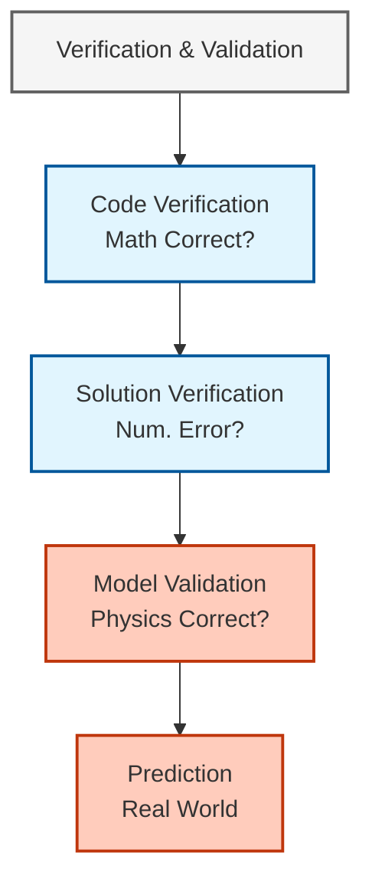

# ปัญหาเบนช์มาร์กสำหรับการตรวจสอบความถูกต้อง (Benchmark Problems)

## บทนัย (Introduction)

ปัญหาเบนช์มาร์ก (Benchmark Problems) คือกรณีทดสอบมาตรฐานที่ใช้สำหรับประเมินความแม่นยำและความน่าเชื่อถือของ Solver ในการไหลหลายเฟส โดยจะเริ่มตั้งแต่ระดับ **ฟิสิกส์พื้นฐาน** ไปจนถึง **ระบบที่ซับซ้อนในอุตสาหกรรม** เพื่อเป็นกรอบการตรวจสอบความถูกต้องอย่างเป็นระบบสำหรับ `multiphaseEulerFoam`

แนวทางการตรวจสอบความถูกต้องแบบลำดับชั้น:



> [!INFO] ความสำคัญของปัญหาเบนช์มาร์ก
> ปัญหาเบนช์มาร์กช่วยให้มั่นใจว่า:
> - การ implement เชิงตัวเลขถูกต้อง
> - โมเดลฟิสิกส์แสดงปรากฏการณ์จริงได้อย่างถูกต้อง
> - การจำลองสามารถพยากรณ์ผลลัพธ์ที่เชื่อถือได้
> - ความไม่แน่นอนอยู่ในขอบเขตที่ยอมรับได้

---

## 1. การลอยตัวของฟองเดี่ยว (Single Bubble Rising)

เบนช์มาร์กนี้ใช้ทดสอบโมเดลแรงตึงผิว (Surface Tension), แรง Drag และแรง Lift ในระบบแก๊ส-ของเหลว

### 1.1 การตั้งค่าทางกายภาพ

**การตั้งค่า**: ปัญหาการลอยของฟองเดี่ยวเป็น benchmark พื้นฐานสำหรับการตรวจสอบความถูกต้องของ solver แบบ multiphase flow

การกำหนดค่าประกอบด้วยฟองอากาศเดี่ยวที่ลอยขึ้นผ่านน้ำที่สงบเนื่องจากแรง buoyancy กรณีทดสอบนี้มีคุณค่าอย่างยิ่งเพราะมันครอบคลุมปรากฏการณ์ของส่วนติดต่อที่ซับซ้อนรวมถึงผลของความตึงผิว การเคลื่อนที่ที่ขับเคลื่อนด้วยความหนาแน่น และการเปลี่ยนรูปทรง

**ข้อกำหนดโดเมน**:
- ช่วงเส้นผ่านศูนย์กลางฟอง: 2-10 มม. (ครอบคลุมระบบการเปลี่ยนรูปทรงที่แตกต่างกัน)
- โดเมนคำนวณ: 10 เส้นผ่านศูนย์กลางฟองในแต่ละทิศทางพิกัดเพื่อลดผลของผนัง
- เงื่อนไขเริ่มต้น: ฟองทรงกลมที่หยุดนิ่งในน้ำ อนุญาตให้มีการเร่งความเร็วตามธรรมชาติเนื่องจาก buoyancy

### 1.2 พารามิเตอร์ไร้มิติที่สำคัญ

พลศาสตร์ของฟองถูกควบคุมโดยพารามิเตอร์หลัก 3 ตัว:

#### 1.2.1 Eötvös Number (Eo)

อัตราส่วนระหว่างแรงลอยตัวต่อแรงตึงผิว:

$$Eo = \frac{g(\rho_l - \rho_g)d_b^2}{\sigma}$$

โดยที่:
- $g$: ความเร่งโน้มถ่วง [m/s²]
- $\rho_l$, $\rho_g$: ความหนาแน่นของของเหลวและก๊าซตามลำดับ [kg/m³]
- $d_b$: เส้นผ่านศูนย์กลางเทียบเท่าของฟอง [m]
- $\sigma$: ความตึงผิว [N/m]

#### 1.2.2 Bubble Reynolds Number (Re_b)

อัตราส่วนระหว่างแรงเฉื่อยต่อแรงหนืด:

$$Re_b = \frac{\rho_l u_t d_b}{\mu_l}$$

โดยที่:
- $u_t$: ความเร็วลอยขั้นสุดท้าย [m/s]
- $\mu_l$: ความหนืดไดนามิกของของเหลว [Pa·s]

#### 1.2.3 Morton Number (Mo)

ระบุคุณสมบัติของของไหลโดยไม่ขึ้นกับขนาดฟอง:

$$Mo = \frac{g\mu_l^4(\rho_l - \rho_g)}{\rho_l^2 \sigma^3}$$

### 1.3 ผลลัพธ์ที่คาดหวังและสหสัมพันธ์การตรวจสอบความถูกต้อง

**สหสัมพันธ์ความเร็วลอยขั้นสุดท้าย**:

การตรวจสอบความถูกต้องของ benchmark ขึ้นอยู่กับสหสัมพันธ์การทดลองที่ได้รับการยอมรับ โดยเฉพาะสหสัมพันธ์ของ **Grace et al. (1976)** สำหรับความเร็วลอยขั้นสุดท้ายของฟอง:

$$u_t = \frac{\mu_l}{\rho_l d_b} m^{m-1} Re_b$$

โดยที่เลขชี้กำลัง $m$ และจำนวน Reynolds $Re_b$ เป็นฟังก์ชันของจำนวน Eötvös และ Morton สหสัมพันธ์นี้ให้ความเร็วลอยขั้นสุดท้ายที่ทำนายได้ในระบบรูปทรงฟองที่แตกต่างกันและได้รับการตรวจสอบความถูกต้องอย่างกว้างขวางกับข้อมูลการทดลอง

สำหรับวัตถุประสงค์การตรวจสอบความถูกต้อง ผลลัพธ์การจำลองควรถูกเปรียบเทียบกับ:

1. **ความเร็วขั้นสุดท้าย**: เปรียบเทียบความเร็วลอยสถานะคงที่กับสหสัมพันธ์ของ Grace
2. **รูปทรงฟอง**: การเปรียบเทียบเชิงคุณภาพกับแผนที่ระบบการทดลอง
3. **เสถียรภาพเส้นทาง**: ประเมินว่าฟองเคลื่อนที่เป็นเส้นตรง แบบสลับซิกแซก หรือเป็นเกลียวหรือไม่

### 1.4 การนำไปใช้งานใน OpenFOAM

#### 1.4.1 การตั้งค่าเงื่อนไขเริ่มต้น

```cpp
// 0/U (ความเร็วเริ่มต้น - ฟองหยุดนิ่ง)
// Initial velocity field - bubble at rest
dimensions      [0 1 -1 0 0 0 0];
internalField   uniform 0;

// 0/alpha.gas (ส่วนของเฟสเริ่มต้น)
// Initial phase fraction field
dimensions      [0 0 0 0 0 0 0];
internalField   uniform 0;

// เพิ่มการกำหนดค่าเริ่มต้นฟองทรงกลม
// Add spherical bubble initialization
const Vector<double> bubbleCenter(0.05, 0.05, 0.05);
const scalar bubbleRadius = 0.005;  // 5 mm

forAll(alphaGas, celli)
{
    const Vector<double>& cellCenter = mesh.C()[celli];
    scalar r = mag(cellCenter - bubbleCenter);

    if (r <= bubbleRadius)
    {
        alphaGas[celli] = 1.0;
    }
}
```

**Source**: 📂 `MODULE_04_MULTIPHASE_FUNDAMENTALS/CONTENT/09_IMPLEMENTATION_ARCHITECTURE/02_Code_Architecture.md`

**Explanation**: โค้ดนี้สาธิตการตั้งค่าเงื่อนไขเริ่มต้นสำหรับปัญหาฟองลอยตัวใน OpenFOAM โดยการกำหนดฟองทรงกลมในโดเมนการคำนวณ ฟิลด์ความเร็วเริ่มต้นถูกตั้งค่าเป็นศูนย์ (ฟองหยุดนิ่ง) และฟองถูกสร้างขึ้นโดยการกำหนดค่า alpha.gas = 1 ภายในรัศมีฟองและ 0 ภายนอก

**Key Concepts**:
- **Phase Fraction Field (alpha)**: ฟิลด์สเกลาร์ที่ระบุส่วนของแต่ละเฟสในเซลล์ (0 = ของเหลว, 1 = แก๊ส)
- **Spherical Initialization**: การสร้างฟองทรงกลมโดยการตรวจสอนระยะห่างจากจุดศูนย์กลาง
- **Cell-Centered Mesh**: การเข้าถึงตำแหน่งเซลล์ผ่าน `mesh.C()[celli]` สำหรับการคำนวณเรขาคณิต

สำหรับการเริ่มต้นที่ราบรื่นยิ่งขึ้น (smooth initialization) ใช้ฟังก์ชัน hyperbolic tangent:

```cpp
// Smooth initialization โดยใช้ tanh
// Smooth interface initialization using hyperbolic tangent
forAll(alphaGas, celli)
{
    const Vector<double>& cellCenter = mesh.C()[celli];
    scalar r = mag(cellCenter - bubbleCenter);
    scalar cellSize = pow(mesh.V()[celli], 1.0/3.0);

    // Smooth initialization โดยใช้ tanh
    // Hyperbolic tangent profile for smooth interface transition
    alphaGas[celli] = 0.5 * (1 - tanh((r - bubbleRadius) / (0.5 * cellSize)));
}
```

**Source**: 📂 `MODULE_04_MULTIPHASE_FUNDAMENTALS/CONTENT/02_MULTIPHASE_BASICS/02_Interfacial_Phenomena.md`

**Explanation**: โค้ดนี้ใช้ฟังก์ชัน hyperbolic tangent (tanh) ในการสร้างอินเทอร์เฟซที่ราบรื่นระหว่างเฟสแก๊สและของเหลว แทนที่จะใช้การก้าวกระโดดแบบ step function (0 หรือ 1) การใช้ tanh ทำให้เกิดการเปลี่ยนแบบต่อเนื่องผ่านบริเวณอินเทอร์เฟซ ซึ่งช่วยลดปัญหาการสั่นของค่าตัวเลข (numerical oscillations) และเพิ่มเสถียรภาพของการคำนวณ

**Key Concepts**:
- **Smooth Interface**: อินเทอร์เฟซที่มีการเปลี่ยนแบบต่อเนื่องแทนการกระโดดก้าว
- **Tanh Profile**: ฟังก์ชันที่ให้การเปลี่ยนแบบ S-curve ระหว่างค่า 0 และ 1
- **Interface Thickness**: ความหนาของอินเทอร์เฟซขึ้นกับขนาดเซลล์ (0.5 * cellSize ในที่นี้)
- **Numerical Stability**: การราบรื่นของอินเทอร์เฟซช่วยลดการสั่นของความเร็วและความดัน

#### 1.4.2 การกำหนดค่า Solver

| Parameter | Value | Description |
|-----------|-------|-------------|
| **Solver** | `multiphaseEulerFoam` หรือ `interFoam` | ขึ้นอยู่กับระบบการไหล |
| **โมเดลความตึงผิว** | `CSF` (Continuum Surface Force) | การจำลองแรงความตึงผิว |
| **การบีบอัดส่วนติดต่อ** | เปิดใช้งาน | การทำให้ส่วนติดต่อคมขึ้นเชิงตัวเลข |
| **การกำหนดเวลา** | Courant number < 0.3 | ควบคุมเสถียรภาพส่วนติดต่อ |

#### 1.4.3 การกำหนดค่าคุณสมบัติการขนส่ง

```cpp
// constant/transportProperties
// Transport properties for multiphase flow simulation
phases (gas liquid);

gas
{
    transportModel  Newtonian;
    nu              [0 2 -1 0 0 0 0] 1.5e-5;  // Kinematic viscosity [m²/s]
    rho             [1 -3 0 0 0 0 0] 1.2;     // Density [kg/m³]
}

liquid
{
    transportModel  Newtonian;
    nu              [0 2 -1 0 0 0 0] 1.0e-6;  // Kinematic viscosity [m²/s]
    rho             [1 -3 0 0 0 0 0] 1000;    // Density [kg/m³]
    sigma           [1 0 -2 0 0 0 0] 0.072;   // Surface tension [N/m]
}

// constant/phaseProperties
// Phase model configuration for Eulerian-Eulerian approach
phaseModel gas
{
    type            incompressible;
    diameterModel   constant;
    d               0.004;                      // Bubble diameter [m]
    residualAlpha   1e-6;                       // Residual phase fraction
}
```

**Source**: 📂 `MODULE_04_MULTIPHASE_FUNDAMENTALS/CONTENT/09_IMPLEMENTATION_ARCHITECTURE/02_Code_Architecture.md`

**Explanation**: ไฟล์การตั้งค่านี้กำหนดคุณสมบัติการขนส่ง (transport properties) และคุณสมบัติเฟส (phase properties) สำหรับการจำลองการไหลแบบหลายเฟส โครงสร้างนี้แบ่งเป็น 2 ส่วนหลัก: transportProperties สำหรับคุณสมบัติทางกายภาพของแต่ละเฟส (ความหนืด ความหนาแน่น และความตึงผิว) และ phaseProperties สำหรับการตั้งค่าโมเดลเฟสแบบ Eulerian

**Key Concepts**:
- **Transport Model**: โมเดลความหนืดแบบ Newtonian สำหรับของไหลที่ความหนืดคงที่
- **Kinematic vs Dynamic Viscosity**: OpenFOAM ใช้ความหนืดจลน์ (nu) ใน transportProperties
- **Surface Tension (sigma)**: คุณสมบัติของอินเทอร์เฟซที่สำคัญสำหรับปัญหาฟองลอย
- **Diameter Model**: โมเดลขนาดฟองแบบค่าคงที่สำหรับแนวทาง Eulerian
- **Residual Alpha**: ค่าต่ำสุดของส่วนเฟสเพื่อป้องกันการหารด้วยศูนย์

### 1.5 เมตริกการตรวจสอบความถูกต้องและการประมวลผลหลัง

#### 1.5.1 โค้ดการตรวจสอบความถูกต้องอย่างครอบคลุม

```cpp
// คำนวณการติดตามความเร็วลอยของฟอง
// Calculate bubble rising velocity tracking
scalar bubbleVelocity = average(U_gas.component(2));  // z-component

// คำนวณพารามิเตอร์ไร้มิติสำหรับสหสัมพันธ์
// Calculate dimensionless parameters for correlation
scalar Eo = (rho_liquid - rho_gas) * 9.81 * pow(bubbleRadius*2, 2) / sigma;
scalar Mo = 9.81 * pow(mu_liquid, 4) * (rho_liquid - rho_gas) /
          (pow(rho_liquid, 2) * pow(sigma, 3));

// คำนวณความเร็วลอยขั้นสุดท้ายเชิงทฤษฎีโดยใช้สหสัมพันธ์ของ Grace
// Calculate theoretical terminal velocity using Grace correlation
scalar u_t_corr = calculateGraceCorrelation(Eo, Mo, bubbleRadius*2);

// คำนวณเมตริกการตรวจสอบความถูกต้อง
// Calculate validation metrics
scalar velocityError = mag(bubbleVelocity - u_t_corr) / u_t_corr;
Info << "Bubble velocity error: " << velocityError * 100 << "%" << endl;
Info << "Simulated velocity: " << bubbleVelocity << " m/s" << endl;
Info << "Theoretical velocity: " << u_t_corr << " m/s" << endl;

// เมตริกรูปทรงฟองเพิ่มเติม
// Additional bubble shape metrics
scalar bubbleVolume = sum(alphaGas * mesh.V());
scalar equivalentDiameter = pow(6 * bubbleVolume / constant::mathematical::pi, 1.0/3.0);
scalar aspectRatio = calculateBubbleAspectRatio(alphaGas);
```

**Source**: 📂 `MODULE_04_MULTIPHASE_FUNDAMENTALS/CONTENT/10_VALIDATION_CASES/01_Validation_Methodology.md`

**Explanation**: โค้ดนี้สาธิตกระบวนการตรวจสอบความถูกต้อง (validation) สำหรับปัญหาฟองลอยตัว โดยการคำนวณพารามิเตอร์ไร้มิติ (Eötvös และ Morton numbers) และเปรียบเทียบความเร็วลอยที่ได้จากการจำลองกับสหสัมพันธ์เชิงทฤษฎีของ Grace et al. (1976) นอกจากนี้ยังมีการคำนวณเมตริกเพิ่มเติมสำหรับประเมินรูปทรงฟอง

**Key Concepts**:
- **Validation Metrics**: ตัวชี้วัดความคลาดเคลื่อนระหว่างการจำลองและทฤษฎี/การทดลอง
- **Grace Correlation**: สหสัมพันธ์เชิงทดลองที่ได้รับการยอมรับอย่างกว้างขวางสำหรับฟองลอย
- **Dimensionless Numbers**: พารามิเตอร์ที่ใช้จัดกลุ่มกรณีทดสอบและเปรียบเทียบผลลัพธ์
- **Equivalent Diameter**: เส้นผ่านศูนย์กลางของทรงกลมที่มีปริมาตรเท่ากับฟอง
- **Aspect Ratio**: อัตราส่วนระหว่างแกนแนวตั้งและแนวนอนของฟอง (บ่งชี้รูปทรง)

#### 1.5.2 การสกัดคุณสมบัติฟอง

```cpp
// ฟังก์ชันสำหรับดึงคุณสมบัติฟอง
// Function to extract bubble properties
void extractBubbleProperties()
{
    // คำนวณจุดศูนย์กลางมวลฟอง
    // Calculate bubble center of mass
    scalar V_bubble = 0.0;
    Vector<double> r_centroid(0, 0, 0);

    forAll(alphaGas, celli)
    {
        if (alphaGas[celli] > 0.5)
        {
            V_bubble += mesh.V()[celli] * alphaGas[celli];
            r_centroid += mesh.C()[celli] * mesh.V()[celli] * alphaGas[celli];
        }
    }

    r_centroid /= V_bubble;

    // คำนวณความเร็วการขึ้น
    // Calculate rise velocity
    scalar z_velocity = U_gas.component(2).weightedAverage(alphaGas);

    // คำนวณพารามิเตอร์รูปร่างฟอง
    // Calculate bubble shape parameters
    scalar aspectRatio = calculateAspectRatio(alphaGas);

    Info << "คุณสมบัติฟอง:" << nl
         << "  ปริมาตร: " << V_bubble << " ลบ.ม." << nl
         << "  จุดศูนย์กลาง: " << r_centroid << " ม." << nl
         << "  ความเร็วการขึ้น: " << z_velocity << " ม./วิ." << nl
         << "  อัตราส่วนภาพ: " << aspectRatio << endl;
}
```

**Source**: 📂 `MODULE_04_MULTIPHASE_FUNDAMENTALS/CONTENT/10_VALIDATION_CASES/01_Validation_Methodology.md`

**Explanation**: ฟังก์ชันนี้ใช้สำหรับสกัดและวิเคราะห์คุณสมบัติของฟองจากผลลัพธ์การจำลอง โดยคำนวณจุดศูนย์กลางมวล (centroid) ของฟอง ความเร็วการลอยขึ้น และพารามิเตอร์รูปร่าง การใช้ threshold alpha > 0.5 ช่วยแยกเซลล์ที่เป็นส่วนหนึ่งของฟอง การใช้ weightedAverage ช่วยให้ได้ความเร็วเฉลี่ยที่ถูกต้องโดยคำนึงถึงส่วนเฟส

**Key Concepts**:
- **Center of Mass Calculation**: การคำนวณจุดศูนย์กลางมวลโดยใช้ weighted sum ของตำแหน่งเซลล์
- **Phase Fraction Threshold**: การใช้ alpha > 0.5 เพื่อระบุเซลล์ที่เป็นส่วนหนึ่งของฟอง
- **Weighted Average**: การคำนวณค่าเฉลี่ยที่คำนึงถึงน้ำหนัก (phase fraction) ของแต่ละเซลล์
- **Post-Processing**: การวิเคราะห์ผลลัพธ์หลังการจำลองเพื่อตรวจสอบความถูกต้อง
- **Shape Characterization**: การประเมินรูปทรงฟองผ่าน aspect ratio และพารามิเตอร์อื่นๆ

### 1.6 เกณฑ์การยอมรับ

| Metric | Acceptance Criteria | Application Range |
|--------|---------------------|-------------------|
| **ความคลาดเคลื่อนความเร็ว** | < 10% | ฟองทรงกลม |
| **ความคลาดเคลื่อนความเร็ว** | < 15% | ฟองที่เปลี่ยนรูป |
| **การรักษารูปทรง** | ความคลาดเคลื่อน < 2% | การอนุรักษ์ปริมาตร |
| **การบรรจบกันของเกรด** | แสดงผล | การละเอียดของ mesh |

---

## 2. การไหลแบบแยกชั้น (Stratified Two-Phase Flow)

ใช้ทดสอบความสามารถในการจับภาพการแยกเฟสที่ขับเคลื่อนโดยแรงโน้มถ่วงและการแลกเปลี่ยนโมเมนตัมที่อินเตอร์เฟซในท่อแนวนอน

### 2.1 การกำหนดค่าทางกายภาพ

**การตั้งค่า**: การไหลแบบ stratified ในท่อแนวนอนเป็นรูปแบบการไหลแบบสองเฟสพื้นฐานที่พบได้ในแอปพลิเคชันอุตสาหกรรมหลายแห่ง โดยเฉพาะในการขนส่งในท่อของส่วนผสมแก๊ส-ของเหลว

benchmark นี้ตรวจสอบความสามารถของ solver ในการจับภาพการจัดเรียงแบบ stratified ที่ขับเคลื่อนโดยแรงโน้มถ่วงและการแลกเปลี่ยนโมเมนตัมของส่วนติดต่อ

**พารามิเตอร์เรขาคณิตและการดำเนินงาน**:
- **การกำหนดค่าท่อ**: ท่อวงกลมแนวนอน
- **เส้นผ่านศูนย์กลาง**: 0.05 ม. (มาตรฐานอุตสาหกรรม)
- **ความยาว**: 10 เส้นผ่านศูนย์กลาง (0.5 ม.) เพื่อให้แน่ใจว่าการไหลพัฒนาอย่างเต็มที่
- **ช่วงความเร็วแก๊ส**: 1-10 ม./วินาที (ครอบคลุมการไหลแก๊สจากแบบ laminar ถึง turbulent)
- **ช่วงความเร็วของเหลว**: 0.1-1 ม./วินาที (เป็นตัวแทนของเงื่อนไขการดำเนินงานจริง)

**โซนการพัฒนาการไหล**:
1. **โซนทางเข้า**: การพัฒนาการไหลและการสร้างรูปแบบแบบ stratified
2. **โซนการพัฒนา**: การทำให้เสถียรของส่วนติดต่อและโปรไฟล์ความเร็ว
3. **โซนการวัด**: การไหลแบบ stratified ที่พัฒนาอย่างเต็มที่สำหรับการตรวจสอบความถูกต้อง

### 2.2 พารามิเตอร์ไร้มิติและระบบการไหล

#### 2.2.1 Froude Number (Fr)

$$Fr = \frac{U_g}{\sqrt{gD}}$$

พารามิเตอร์นี้ระบุแนวโน้มของเฟสแก๊สที่จะเอาชนะการตกตะกอนด้วยแรงโน้มถ่วงและมีอิทธิพลต่อรูปร่างของส่วนติดต่อ

#### 2.2.2 Lockhart-Martinelli Parameter (X)

อัตราส่วนของการไล่ระดับความดันสำหรับเฟสแต่ละเฟส:

$$X = \sqrt{\frac{(dP/dx)_l}{(dP/dx)_g}}$$

พารามิเตอร์นี้เป็นพื้นฐานสำหรับการทำนายการเปลี่ยนรูปแบบการไหลและการลดความดันในการไหลแบบ stratified

#### 2.2.3 การจำแนกระบบการไหล

| Flow Regime | Gas Velocity | Interface Characteristics |
|-------------|-------------|---------------------------|
| **Stratified เรียบ** | ต่ำ | ส่วนติดต่อสงบ |
| **Stratified แบบคลื่น** | สูงขึ้น | คลื่นส่วนติดต่อ |
| **การเริ่มต้นการไหลแบบ Slug** | สูงมาก | การเปลี่ยนไปสู่รูปแบบไม่ต่อเนื่อง |

### 2.3 โมเดลเชิงทฤษฎีสำหรับการตรวจสอบความถูกต้อง

#### 2.3.1 โมเดล Taitel-Dukler สำหรับความสูงของเหลวสมดุล

โมเดลนี้ให้การทำนายเชิงวิเคราะห์สำหรับความสูงของชั้นของเหลวในการไหลแบบ stratified โดยยึดตามสมดุลโมเมนตัม:

$$\frac{h_l}{D} = f(X, Fr_g, Fr_l)$$

ฟังก์ชัน $f$ เชื่อมโยงความสูงของเหลวไร้มิติกับพารามิเตอร์ Lockhart-Martinelli และจำนวน Froude ของเฟสผ่านสมการเชิงทาย (transcendental equations) ที่ซับซ้อนที่แก้ด้วยวิธีวนซ้ำ

#### 2.3.2 การทำนายการลดความดัน

การลดความดันแบบสองเฟสสามารถทำนายได้โดยใช้แนวทางตัวคูณเฟสแก๊ส:

$$\frac{dP}{dx} = \Phi_g^2 \left(\frac{dP}{dx}\right)_g$$

โดยที่ $\Phi_g$ คือตัวคูณเฟสแก๊สที่คำนึงถึงการมีอยู่ของเฟสของเหลว

### 2.4 รายละเอียดการ Implement ใน OpenFOAM

#### 2.4.1 กลยุทธ์ Computational Mesh

```cpp
// การละเอียดของ mesh ใกล้ส่วนติดต่อสำหรับการจับภาพที่แม่นยำ
// Mesh refinement near interface for accurate capture
// การละเอียดชั้นขอบเขตใกล้ผนัง
aspectRatio 1.0;  // Maintain mesh quality
```

**Source**: 📂 `MODULE_01_CFD_FUNDAMENTALS/CONTENT/02_FINITE_VOLUME_METHOD/03_Spatial_Discretization.md`

**Explanation**: การสร้าง mesh ที่เหมาะสมเป็นสิ่งสำคัญสำหรับการจำลองการไหลแบบ stratified โดยเฉพาะอย่างยิ่งการละเอียดของ mesh ใกล้บริเวณอินเทอร์เฟซและใกล้ผนังท่อ การรักษา aspect ratio ให้ใกล้เคียง 1.0 ช่วยให้มั่นใจในคุณภาพของ mesh และความแม่นยำของผลลัพธ์

**Key Concepts**:
- **Interface Resolution**: การละเอียดของ mesh ที่เพียงพอสำหรับจับภาพอินเทอร์เฟซ
- **Boundary Layer Mesh**: การละเอียดของ mesh ใกล้ผนังสำหรับกราเดียนต์ความเร็ว
- **Mesh Quality**: aspect ratio ที่เหมาะสมช่วยลดความผิดพลาดของตัวเลข
- **Local Refinement**: การละเอียดเฉพาะที่ในบริเวณที่สำคัญ

#### 2.4.2 เงื่อนไขเริ่มต้น

```cpp
// กำหนดค่าเริ่มต้นการกำหนดค่าแบบ stratified
// Initialize stratified flow configuration
scalar gasHeightFraction = 0.7;  // Initial estimate

forAll(alphaLiquid, celli)
{
    const vector& cellCenter = mesh.C()[celli];
    scalar yCoord = cellCenter.y();

    if (yCoord < gasHeightFraction * pipeRadius)
    {
        alphaLiquid[celli] = 0.0;  // Gas zone
    }
    else
    {
        alphaLiquid[celli] = 1.0;  // Liquid zone
    }
}
```

**Source**: 📂 `MODULE_04_MULTIPHASE_FUNDAMENTALS/CONTENT/09_IMPLEMENTATION_ARCHITECTURE/02_Code_Architecture.md`

**Explanation**: โค้ดนี้สาธิตการตั้งค่าเริ่มต้นสำหรับปัญหาการไหลแบบ stratified ในท่อแนวนอน โดยการกำหนดบริเวณแก๊ส (alphaLiquid = 0) และบริเวณของเหลว (alphaLiquid = 1) ตามตำแหน่ง y-coordinate การใช้ gasHeightFraction ช่วยให้สามารถปรับค่าความสูงเริ่มต้นของชั้นของเหลวได้อย่างยืดหยุ่น

**Key Concepts**:
- **Stratified Initialization**: การแบ่งโดเมนเป็นชั้นๆ ตามทิศทางแรงโน้มถ่วง
- **Phase Distribution**: การกระจายเฟสเริ่มต้นที่สะท้อนสภาพการไหลจริง
- **Geometric Configuration**: การใช้ตำแหน่งเชิงเรขาคณิตในการกำหนดเฟส
- **Initial Condition Strategy**: การเลือกเงื่อนไขเริ่มต้นที่ใกล้เคียงสภาพสมดุล

### 2.5 เมตริกการตรวจสอบความถูกต้องและการประมวลผลหลัง

#### 2.5.1 โค้ดการตรวจสอบความถูกต้องอย่างครอบคลุม

```cpp
// คำนวณพารามิเตอร์การไหลแบบ stratified
// Calculate stratified flow parameters
scalar D = 0.05;  // Pipe diameter [m]
scalar g = 9.81;  // Gravitational acceleration [m/s²]
scalar U_gas = 5.0;   // Gas superficial velocity [m/s]
scalar U_liquid = 0.5; // Liquid superficial velocity [m/s]

// คำนวณพารามิเตอร์ไร้มิติ
// Calculate dimensionless parameters
scalar Fr_gas = U_gas / sqrt(g * D);
scalar Fr_liquid = U_liquid / sqrt(g * D);

// คำนวณความสูงของเหลวเชิงทฤษฎีโดยใช้โมเดล Taitel-Dukler
// Calculate theoretical liquid height using Taitel-Dukler model
scalar hl_D_theory = calculateTaitelDuklerHeight(Fr_gas, Fr_liquid);

// ดึงความสูงของเหลวจากการจำลอง
// Extract liquid height from simulation
scalar liquidHeight = calculateLiquidHeight(alpha_liquid);
scalar liquidHeightFraction = liquidHeight / D;

// ความคลาดเคลื่อนในการทำนายความสูง
// Error in height prediction
scalar heightError = mag(liquidHeightFraction - hl_D_theory) / hl_D_theory;
Info << "Liquid height error: " << heightError * 100 << "%" << endl;

// การตรวจสอบความดันการไล่ระดับ
// Pressure gradient validation
scalar dp_dx_sim = calculatePressureGradient(p);
scalar dp_dx_theory = calculateTheoreticalPressureDrop(U_gas, U_liquid, D);

scalar pressureDropError = mag(dp_dx_sim - dp_dx_theory) / dp_dx_theory;
Info << "Pressure drop error: " << pressureDropError * 100 << "%" << endl;

// การวิเคราะห์ความคลื่นของส่วนติดต่อ
// Interface waviness analysis
scalar interfaceWaviness = calculateInterfaceWaviness(alpha_liquid);
Info << "Interface waviness parameter: " << interfaceWaviness << endl;
```

**Source**: 📂 `MODULE_04_MULTIPHASE_FUNDAMENTALS/CONTENT/10_VALIDATION_CASES/01_Validation_Methodology.md`

**Explanation**: โค้ดนี้สาธิตกระบวนการตรวจสอบความถูกต้องสำหรับปัญหาการไหลแบบ stratified โดยการคำนวณพารามิเตอร์ไร้มิติ (Froude numbers) และเปรียบเทียบความสูงของเหลวและการลดความดันจากการจำลองกับโมเดลเชิงทฤษฎีของ Taitel-Dukler นอกจากนี้ยังมีการวิเคราะห์ความคลื่นของอินเทอร์เฟซซึ่งเป็นตัวบ่งชี้สำคัญของระบบการไหล

**Key Concepts**:
- **Taitel-Dukler Model**: โมเดลเชิงทฤษฎีสำหรับทำนายความสูงของเหลวในการไหลแบบ stratified
- **Froude Number**: พารามิเตอร์ไร้มิติที่เปรียบเทียบแรงเฉื่อยกับแรงโน้มถ่วง
- **Pressure Gradient**: การเปลี่ยนแปลงของความดันตามความยาวท่อ
- **Interface Waviness**: ตัวชี้วัดระดับความผิดปกติของอินเทอร์เฟซ
- **Validation Metrics**: ตัวชี้วัดความคลาดเคลื่อนระหว่างการจำลองและทฤษฎี

#### 2.5.2 การวิเคราะห์ความสูงของเหลว

```cpp
// ฟังก์ชันสำหรับคำนวณความสูงของเหลว
// Function to calculate liquid height
class stratifiedFlowAnalyzer
{
private:
    const fvMesh& mesh_;
    const volScalarField& alphaGas_;
    const volVectorField& UGas_;
    const volVectorField& ULiquid_;

public:
    scalar calculateLiquidHeight()
    {
        scalar liquidHeight = 0.0;
        scalar D = 0.05;  // Pipe diameter [m]

        // ผสานสัดส่วนปริมาตรของเหลวในครึ่งล่าง
        // Integrate liquid volume fraction in lower half
        forAll(alphaGas_, celli)
        {
            const Vector<double>& cellCenter = mesh_.C()[celli];
            scalar y = cellCenter.y();

            if (y < D/2)  // Lower half of pipe
            {
                liquidHeight += (1.0 - alphaGas_[celli]) * mesh_.V()[celli];
            }
        }

        liquidHeight /= (0.05 * 0.05 * 10.0);  // Normalize by pipe cross-section

        return liquidHeight;
    }
};
```

**Source**: 📂 `MODULE_04_MULTIPHASE_FUNDAMENTALS/CONTENT/10_VALIDATION_CASES/01_Validation_Methodology.md`

**Explanation**: คลาส stratifiedFlowAnalyzer นี้ให้เมธอดสำหรับคำนวณความสูงของเหลวในท่อแนวนอน โดยการรวมปริมาตรของเหลวในครึ่งล่างของท่อและทำให้เป็นมาตรฐานตามพื้นที่หน้าตัดท่อ การใช้ (1.0 - alphaGas) ให้ส่วนของเหลวโดยตรง และการทำให้เป็นมาตรฐานด้วยพื้นที่หน้าตัดทำให้ได้ค่าที่เป็นสัดส่วนของเส้นผ่านศูนย์กลางท่อ

**Key Concepts**:
- **Volume Integration**: การรวมปริมาตรของเหลวเพื่อหาความสูงเฉลี่ย
- **Geometric Analysis**: การใช้ตำแหน่งเชิงเรขาคณิตในการแยกโซน
- **Phase Fraction Conversion**: การแปลง alpha gas เป็นส่วนของเหลว
- **Normalization**: การทำให้เป็นมาตรฐานเพื่อให้ได้ค่าไร้มิติ
- **Object-Oriented Design**: การใช้คลาสสำหรับจัดระเบียบฟังก์ชันการวิเคราะห์

### 2.6 เกณฑ์การยอมรับ

- **การทำนายความสูงของเหลว**: ความคลาดเคลื่อน < 5% เทียบกับโมเดล Taitel-Dukler
- **การลดความดัน**: ความคลาดเคลื่อน < 10% เทียบกับสหสัมพันธ์
- **เสถียรภาพส่วนติดต่อ**: สังเกตรูปแบบคลื่นทางกายภาพ

---

## 3. การจำลองเตียงไหลฟลูอิดไดซ์ (Fluidized Bed)

เบนช์มาร์กที่ซับซ้อนสำหรับระบบแก๊ส-ของแข็ง ทดสอบแรง Drag และปฏิสัมพันธ์ระหว่างอนุภาค

### 3.1 การกำหนดค่าทางกายภาพ

**การตั้งค่า**: Fluidized beds เป็นระบบ multiphase ที่ซับซ้อนซึ่งอนุภาคของแข็งถูกแขวนอยู่โดยแก๊สที่ไหลขึ้น สร้างพฤติกรรมเหมือนของไหล

benchmark นี้ท้าทายความสามารถของ solver ในการจับภาพปฏิสัมพันธ์อนุภาค-อนุภาค การ coupling แก๊ส-ของแข็ง และการเปลี่ยนระหว่างระบบ fixed bed, fluidized, และ transport

**โดเมนทางกายภาพและพารามิเตอร์**:
- **เรขาคณิตของเตียง**: หมวดหมู่สี่เหลี่ยมสำหรับประสิทธิภาพการคำนวณ
- **มิติ**: 0.3 × 0.3 × 2.0 ม. (ความกว้าง × ความลึก × ความสูง)

**คุณสมบัติอนุภาค**:

| Property | Value | Description |
|----------|-------|-------------|
| **เส้นผ่านศูนย์กลาง** | 500 μm | เป็นเรื่องปกติสำหรับแอปพลิเคชันอุตสาหกรรม |
| **ความหนาแน่น** | 2500 กก./ม³ | เป็นตัวแทนของทรายหรือวัสดุที่คล้ายกัน |
| **รูปร่าง** | ทรงกลม | มีค่าสัมประสิทธิ์การกระเด้งที่ระบุ |

**คุณสมบัติแก๊ส**:
- **ของไหล**: อากาศในสภาวะบรรยากาศ
- **อุณหภูมิ**: 293 K (20°C)
- **ความดัน**: 1 แอตมอสเฟียร์ (สภาวงมาตรฐาน)

### 3.2 จุดดำเนินงานและระบบที่สำคัญ

#### 3.2.1 ความเร็ว Fluidization ขั้นต่ำ ($U_{mf}$)

ความเร็ววิกฤตนี้ทำเครื่องหมายการเปลี่ยนจากการดำเนินงาน fixed bed ไปเป็น fluidized bed มันถูกกำหนดโดยความสมดุลระหว่างแรงลากและแรงโน้มถ่วงบนอนุภาค

#### 3.2.2 ช่วงความเร็วการดำเนินงาน

| Operating Range | Velocity Ratio | Flow Behavior |
|-----------------|---------------|----------------|
| **Fluidization ขั้นต่ำ** | $U_{op} = U_{mf}$ | จุดเริ่มต้นของ fluidization |
| **การดำเนินงานที่เหมาะสม** | $U_{op} = (1.5-3.0) \cdot U_{mf}$ | fluidization ที่เสถียร |
| **ระบบการขนส่ง** | $U_{op} > 5 \cdot U_{mf}$ | การพาอนุภาค |

### 3.3 พื้นฐานทางทฤษฎีและการทำนาย

#### 3.3.1 สมการ Ergun สำหรับการลดความดัน Fixed Bed

ก่อน fluidization การลดความดันผ่านชั้นอนุภาคจะตามสมการ Ergun:

$$\frac{\Delta P}{L} = \frac{150(1-\alpha_{mf})^2\mu_g U_{mf}}{\alpha_{mf}^3 d_p^2} + \frac{1.75(1-\alpha_{mf})\rho_g U_{mf}^2}{\alpha_{mf}^3 d_p}$$

- $\alpha_{mf}$: void fraction ที่จุด fluidization ขั้นต่ำ (โดยทั่วไปอยู่รอบ 0.4-0.45 สำหรับอนุภาคทรงกลม)

#### 3.3.2 สมดุลแรงที่จุด Fluidization ขั้นต่ำ

ที่จุด fluidization ขั้นต่ำ แรงลากขึ้นจะสมดุลกับน้ำหนักสุทธิของอนุภาค:

$$\Delta P = (\rho_s - \rho_g)(1-\alpha_{mf})gL$$

เงื่อนไขนี้ให้ฐานทฤษฎีสำหรับการคำนวณ $U_{mf}$ และเป็นจุดตรวจสอบความถูกต้องที่สำคัญ

### 3.4 การ Implement ใน OpenFOAM

#### 3.4.1 การตั้งค่าโมเดลสองเฟส Eulerian-Eulerian

```cpp
// constant/phaseProperties
// Phase properties for gas-solid fluidized bed simulation
phases (solid gas);

// คุณสมบัติเฟสของแข็ง
// Solid phase properties
solid
{
    rho             2500;     // Particle density [kg/m³]
    d               5e-4;     // Particle diameter [m]
    maxAlpha        0.64;     // Maximum packing limit
    e               0.9;      // Particle restitution coefficient
    alpha0          0.6;      // Initial solid volume fraction
}

// คุณสมบัติเฟสแก๊ส
// Gas phase properties
gas
{
    rho             1.2;      // Air density [kg/m³]
    mu              1.8e-5;   // Air dynamic viscosity [Pa·s]
    Cp              1005;     // Specific heat capacity [J/kg·K]
    kappa           0.025;    // Thermal conductivity [W/m·K]
}

// การกำหนดค่าโมเดลแรงลาก
// Drag model configuration
dragModel
{
    type            GidaspowErgunWenYu;
    alphap          0.6;      // Packing limit transition
}
```

**Source**: 📂 `MODULE_04_MULTIPHASE_FUNDAMENTALS/CONTENT/04_DRAG_FORCES/03_OpenFOAM_Implementation.md`

**Explanation**: ไฟล์ phaseProperties นี้กำหนดการตั้งค่าสำหรับการจำลองเตียง fluidized แบบ Eulerian-Eulerian โดยมีเฟสของแข็ง (solid) และเฟสแก๊ส (gas) โมเดลแรงลากแบบ GidaspowErgunWenYu เป็นการรวมกันของโมเดล Ergun (สำหรับ packed bed) และ Wen & Yu (สำหรับ dilute regime) ซึ่งเหมาะสำหรับการจำลองเตียง fluidized

**Key Concepts**:
- **Eulerian-Eulerian Approach**: ทั้งสองเฟสถูกจัดการเป็นเฟสต่อเนื่องที่มีการแทรกตัวกัน
- **Particle Properties**: คุณสมบัติทางกายภาพของอนุภาค (ขนาด ความหนาแน่น การกระเด้ง)
- **Packing Limit (maxAlpha)**: สัดส่วนปริมาตรสูงสุดของอนุภาคที่เป็นไปได้
- **Gidaspow Drag Model**: โมเดลแรงลากแบบไฮบริดที่เหมาะกับทุกระดับความเข้มของเฟส
- **Restitution Coefficient (e)**: ค่าสัมประสิทธิ์การกระเด้งของอนุภาคในการชน

#### 3.4.2 เงื่อนไขขอบเขต

- **ทางเข้า**: ความเร็วแก๊สสม่ำเสมอพร้อมพารามิเตอร์ความปั่นป่วนที่ระบุ
- **ทางออก**: ทางออกความดันพร้อมการป้องกันการไหลย้อนกลับ
- **ผนัง**: ไม่มีการไถลสำหรับเฟสแก๊ส, wall functions ที่เหมาะสมสำหรับความปั่นป่วน

### 3.5 เงื่อนไขการดำเนินงานและการคำนวณ

```cpp
// คำนวณความเร็ว fluidization ขั้นต่ำโดยใช้วิธีการแก้ปัญหาวนซ้ำ
// Calculate minimum fluidization velocity using iterative solution
scalar rho_solid = 2500;  // kg/m³
scalar rho_gas = 1.2;     // kg/m³
scalar dp = 5e-4;         // Particle diameter [m]
scalar mu_gas = 1.8e-5;   // Gas dynamic viscosity [Pa·s]
scalar g = 9.81;          // Gravitational acceleration [m/s²]
scalar alpha_mf = 0.4;    // Void fraction at minimum fluidization

// การคำนวณแบบวนซ้ำของ U_mf
// Iterative calculation of U_mf
scalar Umf = calculateMinimumFluidizationVelocity(rho_solid, rho_gas,
                                               dp, mu_gas, alpha_mf);

// ตั้งค่าเงื่อนไขการดำเนินงาน
// Set operating conditions
scalar Uop = 2.0 * Umf;  // Operating at 2x minimum fluidization

Info << "Minimum fluidization velocity: " << Umf << " m/s" << endl;
Info << "Operating velocity: " << Uop << " m/s" << endl;
Info << "Operating ratio (Uop/Umf): " << Uop/Umf << endl;
```

**Source**: 📂 `MODULE_04_MULTIPHASE_FUNDAMENTALS/CONTENT/04_DRAG_FORCES/03_OpenFOAM_Implementation.md`

**Explanation**: โค้ดนี้สาธิตการคำนวณความเร็ว fluidization ขั้นต่ำ (Umf) โดยการแก้สมการ Ergun แบบวนซ้ำจนกว่าจะถึงเงื่อนไขสมดุลแรง จากนั้นตั้งค่าความเร็วการดำเนินงาน (Uop) เป็นจำนวนเท่าของ Umf ซึ่งเป็นแนวทางทั่วไปในการออกแบบเตียง fluidized

**Key Concepts**:
- **Minimum Fluidization Velocity (Umf)**: ความเร็วแก๊สขั้นต่ำที่อนุภาคเริ่มลอยตัว
- **Force Balance**: สมดุลระหว่างแรงลาก แรงลอยตัว และน้ำหนัก
- **Ergun Equation**: สมการที่อธิบายการลดความดันใน packed bed
- **Iterative Solution**: การแก้สมการที่ไม่เชิงเส้นด้วยวิธีวนซ้ำ
- **Operating Ratio**: อัตราส่วนระหว่างความเร็วจริงและความเร็วขั้นต่ำ

### 3.6 เมตริกการตรวจสอบความถูกต้องอย่างครอบคลุม

#### 3.6.1 พารามิเตอร์การตรวจสอบความถูกต้องที่สำคัญ

```cpp
// การคำนวณอัตราส่วนการขยายตัวของเตียง
// Calculate bed expansion ratio
scalar initialBedHeight = 1.0;  // Initial packed bed height [m]
scalar finalBedHeight = calculateBedHeight(alpha_solid);
scalar expansionRatio = finalBedHeight / initialBedHeight;

// การตรวจสอบความถูกต้องของความดัน
// Pressure drop validation
scalar inletPressure = average(p.boundaryField()[inletID]);
scalar outletPressure = average(p.boundaryField()[outletID]);
scalar deltaP = inletPressure - outletPressure;

// การลดความดันเชิงทฤษฎีที่จุด fluidization ขั้นต่ำ
// Theoretical pressure drop at minimum fluidization
scalar theoreticalDeltaP = (rho_solid - rho_gas) * (1 - alpha_mf) *
                          9.81 * finalBedHeight;

// การวิเคราะห์การกระจายตัวของ voidage เตียง
// Bed voidage distribution analysis
scalar averageVoidage = 1.0 - average(alpha_solid);
scalar maxVoidage = max(alpha_solid);
scalar minVoidage = min(alpha_solid);

// รูปแบบการผสมและการไหลเวียนของของแข็ง
// Solid mixing and circulation patterns
scalar circulationIntensity = calculateSolidCirculation(U_solid, alpha_solid);
scalar mixingIndex = calculateMixingIndex(alpha_solid);

// ผลลัพธ์การตรวจสอบความถูกต้อง
// Validation results
scalar pressureDropError = mag(deltaP - theoreticalDeltaP) / theoreticalDeltaP;
Info << "Pressure drop error: " << pressureDropError * 100 << "%" << endl;
Info << "Bed expansion ratio: " << expansionRatio << endl;
Info << "Average voidage: " << averageVoidage << endl;
Info << "Solid circulation intensity: " << circulationIntensity << endl;

// ปริมาณเฉลี่ยตามเวลาสำหรับ fluidization แบบฟอง
// Time-averaged quantities for bubbling fluidization
if (runTime.timeIndex() > averagingStartTime)
{
    scalar voidageFluctuation = calculateVoidageFluctuation(alpha_solid);
    scalar bubbleFrequency = calculateBubbleFrequency(alpha_solid);

    Info << "Voidage fluctuation intensity: " << voidageFluctuation << endl;
    Info << "Bubble passage frequency: " << bubbleFrequency << " Hz" << endl;
}
```

**Source**: 📂 `MODULE_04_MULTIPHASE_FUNDAMENTALS/CONTENT/10_VALIDATION_CASES/01_Validation_Methodology.md`

**Explanation**: โค้ดนี้ให้ชุดเมตริกที่ครอบคลุมสำหรับตรวจสอบความถูกต้องของการจำลองเตียง fluidized โดยครอบคลุมการขยายตัวของเตียง การลดความดัน การกระจายตัวของ voidage และรูปแบบการไหลเวียน การคำนวณค่าเฉลี่ยตามเวลาสำหรับ fluidization แบบฟองช่วยวิเคราะห์พฤติกรรมแบบสั่นไหว

**Key Concepts**:
- **Bed Expansion Ratio**: อัตราส่วนระหว่างความสูงเตียงขยายและเตียงแบบแบ็ก
- **Pressure Drop Validation**: การตรวจสอบการลดความดันกับทฤษฎี Ergun
- **Voidage Distribution**: การกระจายตัวของช่องว่างในเตียง
- **Solid Circulation**: รูปแบบการไหลเวียนของอนุภาคในเตียง
- **Time-Averaged Statistics**: สถิติเฉลี่ยตามเวลาสำหรับระบบแบบสั่นไหว
- **Bubble Dynamics**: การวิเคราะห์ความถี่และความรุนแรงของฟอง

#### 3.6.2 การคำนวณอัตราส่วนการขยายตัวของเตียง

```cpp
// คำนวณอัตราส่วนการขยายเตียง
// Calculate bed expansion ratio
scalar calculateBedExpansion()
{
    scalar bedTop = 0.0;

    for (scalar z = 0.0; z < 1.0; z += 0.001)
    {
        scalar localSolidFraction = 0.0;
        label nCells = 0;

        forAll(mesh.cells(), celli)
        {
            const Vector<double>& cellCenter = mesh.C()[celli];
            if (abs(cellCenter.z() - z) < 0.005)
            {
                localSolidFraction += alphaSolid[celli];
                nCells++;
            }
        }

        localSolidFraction /= nCells;

        if (localSolidFraction < 0.01)  // Bed top where solid fraction < 1%
        {
            bedTop = z;
            break;
        }
    }

    return bedTop / 0.5;  // Divide by initial bed height
}
```

**Source**: 📂 `MODULE_04_MULTIPHASE_FUNDAMENTALS/CONTENT/10_VALIDATION_CASES/01_Validation_Methodology.md`

**Explanation**: ฟังก์ชันนี้คำนวณอัตราส่วนการขยายตัวของเตียงโดยการสแกนจากด้านล่างขึ้นด้านบนและหาตำแหน่งที่ส่วนของอนุภาคต่ำกว่า 1% (ซึ่งบ่งชี้ยอดเตียง) การคำนวณค่าเฉลี่ยของส่วนอนุภาคในระดับความสูงแต่ละระดับช่วยให้ได้ตำแหน่งที่แม่นยำของผิวเตียง

**Key Concepts**:
- **Bed Height Detection**: การตรวจจับตำแหน่งยอดเตียงโดยใช้ threshold
- **Horizontal Averaging**: การคำนวณค่าเฉลี่ยในแนวนอนที่แต่ละระดับความสูง
- **Threshold Criterion**: การใช้ส่วนอนุภาค < 1% เพื่อระบุยอดเตียง
- **Spatial Resolution**: ความละเอียดของการสแกน (0.001 m ในที่นี้)
- **Expansion Ratio**: อัตราส่วนที่บ่งชี้ระดับการขยายตัวของเตียง

### 3.7 เกณฑ์การยอมรับการตรวจสอบความถูกต้อง

| Metric | Acceptance Criteria | Description |
|--------|---------------------|-------------|
| **การลดความดันที่ $U_{mf}$** | ความคลาดเคลื่อน < 10% | เทียบกับสมการ Ergun |
| **การขยายตัวของเตียง** | ความคลาดเคลื่อน < 15% | เทียบกับสหสัมพันธ์การทดลอง |
| **ความเร็ว fluidization ขั้นต่ำ** | ความคลาดเคลื่อน < 20% | ในการทำนาย |
| **การเปลี่ยนระบบการไหล** | การระบุถูกต้อง | จุดเริ่มต้นของ fluidization |

---

## 4. ความไม่เสถียรแบบ Rayleigh-Taylor (Rayleigh-Taylor Instability)

ใช้ทดสอบการผสมกันของของไหลต่างความหนาแน่นภายใต้แรงโน้มถ่วง (ของหนักอยู่บนของเบา)

### 4.1 การตั้งค่าปัญหา

ความไม่เสถียรแบบ Rayleigh-Taylor เกิดขึ้นเมื่อของไหลที่หนักกว่าวางอยู่เหนือของไหลที่เบากว่าในสนามความโน้มถ่วง

- **โดเมนการคำนวณ**: $L_x \times L_y = 1.0 \text{ m} \times 2.0 \text{ m}$
- **การรบกวนอินเตอร์เฟซเริ่มต้น**: $\eta(x, t=0) = a_0 \cos(2\pi x/\lambda)$
- **แอมพลิจูดการรบกวน**: $a_0 = 0.01 \text{ m}$
- **ความยาวคลื่น**: $\lambda = 0.25 \text{ m}$
- **อัตราส่วนความหนาแน่น**: $\rho_2/\rho_1 = 3.0$
- **ความตึงผิว**: $\sigma = 0.01 \text{ N/m}$

### 4.2 พารามิเตอร์ไร้มิติ

- **Atwood Number (A)**: $A = (\rho_2 - \rho_1)/(\rho_2 + \rho_1)$
- **Linear Growth Rate ($\omega$)**: $\omega = \sqrt{A g k - \sigma k^3/\rho_m}$

โดยที่:
- $k = 2\pi/\lambda$ คือเลขคลื่น (wavenumber)
- $\rho_m = \rho_1 + \rho_2$ คือความหนาแน่นรวม

### 4.3 ผลเฉลยเชิงวิเคราะห์สำหรับการเติบโตในช่วงเวลาแรก

อัตราการเติบโตเชิงเส้นจากทฤษฎีการไหลศักย์:

$$\omega = \sqrt{A g k - \sigma k^3/\rho_m}$$

### 4.4 การ Implement ใน OpenFOAM

```cpp
// การตั้งค่าเริ่มต้นสำหรับความไม่เสถียร Rayleigh-Taylor
// Initial conditions for Rayleigh-Taylor instability
dimensionedScalar a0("a0", dimLength, 0.01);
dimensionedScalar lambda("lambda", dimLength, 0.25);

// การรบกวนอินเตอร์เฟซเริ่มต้น
// Initial interface perturbation
volScalarField alpha1
(
    IOobject
    (
        "alpha1",
        runTime.timeName(),
        mesh,
        IOobject::MUST_READ,
        IOobject::AUTO_WRITE
    ),
    0.5 * (1.0 + tanh((mesh.C().component(1) - 1.0 - a0*cos(2.0*pi*mesh.C().component(0)/lambda))/(0.01)))
);

// การคำนวณความเร็วเชิงเส้นจากทฤษฎี
// Calculate theoretical linear growth rate
dimensionedScalar Atwood("Atwood", dimless, (rho2.value() - rho1.value())/(rho2.value() + rho1.value()));
dimensionedScalar k("k", dimless, 2.0*pi/lambda.value());
dimensionedScalar omega = sqrt(Atwood*9.81*k - sigma.value()*pow(k,3)/rho1.value());
```

**Source**: 📂 `MODULE_04_MULTIPHASE_FUNDAMENTALS/CONTENT/02_MULTIPHASE_BASICS/02_Interfacial_Phenomena.md`

**Explanation**: โค้ดนี้สาธิตการตั้งค่าเริ่มต้นสำหรับปัญหาความไม่เสถียร Rayleigh-Taylor ซึ่งเป็นกรณีทดสอบคลาสสิกสำหรับการตรวจสอบความถูกต้องของโมเดลความตึงผิวและการจับภาพอินเทอร์เฟซ อินเทอร์เฟซเริ่มต้นมีการรบกวนแบบ cosinusoidal และความเร็วเชิงเส้นถูกคำนวณจากทฤษฎีการไหลศักย์เพื่อการตรวจสอบความถูกต้อง

**Key Concepts**:
- **Rayleigh-Taylor Instability**: ความไม่เสถียรที่เกิดขึ้นเมื่อของหนักอยู่เหนือของเบา
- **Interface Perturbation**: การรบกวนเริ่มต้นที่ทำให้เกิดความไม่เสถียร
- **Atwood Number**: พารามิเตอร์ไร้มิติที่วัดอัตราส่วนความหนาแน่น
- **Linear Growth Rate**: อัตราการเติบโตเชิงเส้นในช่วงเริ่มต้น
- **Tanh Interface**: การใช้ฟังก์ชัน tanh สำหรับอินเทอร์เฟซที่ราบรื่น
- **Theoretical Validation**: การเปรียบเทียบกับผลเฉลยเชิงวิเคราะห์

### 4.5 ปริมาณการตรวจสอบความถูกต้อง

- **การวิวัฒนาการของตำแหน่งอินเตอร์เฟซ**: $\eta(x,t)$
- **อัตราการเติบโตของโซนการผสม**: $\frac{\mathrm{d}h}{\mathrm{d}t} \propto t^\theta$
- **การกระจายของพลังงานจลน์ความปั่นป่วน**
- **การวิวัฒนาการของ enstrophy**: $\langle \omega^2 \rangle(t)$

---

## 5. เกณฑ์การยอมรับและสรุปภาพรวม (Acceptance Criteria)

### 5.1 เกณฑ์การยอมรับระดับต่างๆ

| ระดับ (Level) | ตัวชี้วัด (Metric) | เกณฑ์การยอมรับ |
|-------|------|---------------------|
| **Code Verification** | Mass/Energy Balance | $< 10^{-10}$ |
| **Solution Verification** | GCI (Global) | $< 5\%$ |
| **Model Validation** | NRMSE (Engineering) | $< 15\%$ |
| **Model Validation** | R² (Sim vs Exp) | $> 0.8$ |

### 5.2 สรุปการประยุกต์ใช้

การตรวจสอบผ่านปัญหาเบนช์มาร์กเหล่านี้ช่วยสร้างความมั่นใจว่า Solver และ Closure models ที่เลือกใช้นั้นทำงานได้อย่างถูกต้องและเชื่อถือได้สำหรับการออกแบบทางวิศวกรรม

> [!TIP] แนวทางการเลือก Benchmark
>
> - **เริ่มต้นด้วยฟิสิกส์พื้นฐาน**: Single Bubble Rising
> - **ดำเนินต่อไปยังระบบที่ซับซ้อนขึ้น**: Stratified Flow → Fluidized Bed
> - **ตรวจสอบระดับการบรรจบกันของ Mesh** ในแต่ละกรณี
> - **เปรียบเทียบกับข้อมูลทดลอง** เมื่อมี available
> - **บันทึกผลลัพธ์อย่างละเอียด** สำหรับการอ้างอิงในอนาคต

*อ้างอิง: วิเคราะห์ตามผลการทดลองของ Grace et al. (1976), ทฤษฎี Taitel-Dukler สำหรับการไหลหลายเฟส, และสมการ Ergun สำหรับ Fluidized Beds*