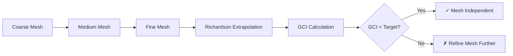

# Grid Convergence Study

การศึกษาการลู่เข้าของกริดสำหรับ Multiphase Flow

---

## Learning Objectives

หลังจากอ่านบทนี้ คุณควรจะสามารถ:

- **อธิบาย** แนวคิด Grid Convergence Index (GCI) และความสำคัญของ mesh independence study
- **เลือกใช้** 2-grid หรือ 3-grid method ได้อย่างเหมาะสมกับสถานการณ์
- **คำนวณ** GCI, Richardson extrapolation และ observed order of accuracy จากผลลัพธ์ multiphase simulation
- **ตั้งค่า** OpenFOAM function objects เพื่อ extract quantities of interest (QoI) สำหรับ grid study
- **ประเมิน** ความเหมาะสมของ mesh resolution สำหรับ interface-capturing methods
- **ตรวจสอบ** asymptotic range เพื่อยืนยันความถูกต้องของ GCI calculation
- **แก้ไขปัญหา** ที่พบบ่อยใน GCI calculation (negative p, asymptotic range violations)

---

## Overview

> **เป้าหมาย:** ยืนยันว่าผลลัพธ์ **ไม่ขึ้นกับความละเอียดของ mesh** (Mesh Independent)

**WHAT:** Grid Convergence Study คือการวิเคราะห์ความละเอียดของ mesh เพื่อยืนยันว่า numerical solution ลู่เข้าสู่ค่าที่ไม่เปลี่ยนแปลงเมื่อลด mesh size ลง

**WHY:** ถ้า mesh หยาบเกินไป ผลลัพธ์จะมี **discretization error** สูง แต่ถ้าละเอียดเกินไปจะเสีย computational cost ไปโดยเปล่ายิ่งสำคัญใน multiphase flow ที่ interface resolution ส่งผลต่อ physics prediction

**HOW:** ใช้ Richardson Extrapolation และ Grid Convergence Index (GCI) — standard methodology จาก Journal of Fluids Engineering (Roache, 1994) เพื่อ quantify uncertainty จาก mesh discretization



### When Grid Study Matters Most

| Scenario | Importance | Reason |
|----------|------------|--------|
| Interface-capturing (VOF) | 🔴 Critical | Interface resolution affects curvature, surface tension |
| Turbulent multiphase | 🔴 Critical | Near-wall resolution affects phase distribution |
| Laminar separated flow | 🟡 Important | Recirculation zones sensitive to mesh |
| Fully developed flow | 🟢 Less critical | Flow fields relatively smooth |

---

## 1. Systematic Mesh Refinement

### Three-Grid vs Two-Grid Method

| Aspect | 3-Grid Method | 2-Grid Method |
|--------|--------------|---------------|
| **When to use** | Research, publication, rigorous V&V | Engineering screening, time-limited studies |
| **Computational cost** | 3× simulation runs | 2× simulation runs |
| **What it provides** | Observed order $p$ + asymptotic check | GCI only (assume theoretical $p$) |
| **Reliability** | High (verifies asymptotic range) | Medium (blind to $p$ calculation errors) |
| **Fs factor** | 1.25 | 3.0 |

**Decision Guide:**
- ใช้ **3-grid** สำหรับ validation studies, journal publications, หรือเมื่อไม่แน่ใจ theoretical order
- ใช้ **2-grid** สำหรับ parametric studies, design optimization, หรือเมื่อ computational resource จำกัด

### Refinement Strategy

| Mesh | Size | Cell Count | Ratio |
|------|------|------------|-------|
| Coarse | $h_3$ | $N$ | - |
| Medium | $h_2$ | $N \cdot r^3$ | $r_{32} = h_3/h_2$ |
| Fine | $h_1$ | $N \cdot r^6$ | $r_{21} = h_2/h_1$ |

**Ideal refinement ratio:** $r = h_{coarse}/h_{fine} \geq 1.3$ (Roache recommends $r > \sqrt{2}$)

### OpenFOAM Workflow

```bash
# === STEP 1: Create case directories ===
mkdir -p coarseCase mediumCase fineCase

# === STEP 2: Coarse mesh ===
cd coarseCase
blockMesh
cp -r 0.org 0
interFoam > log.coarse
cd ..

# === STEP 3: Medium mesh (modify blockMeshDict: cells × 2) ===
cd mediumCase
# Edit system/blockMeshDict: multiply all cell counts by 2
blockMesh
cp -r 0.org 0
interFoam > log.medium
cd ..

# === STEP 4: Fine mesh (cells × 4 from coarse) ===
cd fineCase
# Edit system/blockMeshDict: multiply all cell counts by 4
blockMesh
cp -r 0.org 0
interFoam > log.fine
cd ..
```

**Automatic refinement with refineMesh:**

```bash
# Alternative: use refineMesh instead of manual editing
cd mediumCase
refineMesh -overwrite -dir '(x y z)'  # Uniform refinement by factor 2
```

---

## 2. Richardson Extrapolation

### Observed Order of Accuracy

**WHY:** Theoretical order $p_{theory}$ (e.g., 2nd order for convection schemes) อาจ differ จาก observed order $p$ เนื่องจาก:
- Non-linearities in multiphase equations
- Solution discontinuities at interface
- Numerical dissipation from interface compression

**HOW:** Calculate from 3 mesh results:

$$p = \frac{\ln\left(\frac{\phi_3 - \phi_2}{\phi_2 - \phi_1}\right)}{\ln(r)}$$

**Where:**
- $\phi_1$ = fine mesh result ($h_1$)
- $\phi_2$ = medium mesh result ($h_2$)
- $\phi_3$ = coarse mesh result ($h_3$)
- $r$ = refinement ratio (assume $r_{21} \approx r_{32}$)

### Extrapolated Value

$$\phi_{exact} \approx \phi_1 + \frac{\phi_1 - \phi_2}{r^p - 1}$$

**Physical meaning:** $\phi_{exact}$ คือ estimate ของ grid-independent solution ที่ mesh size $\rightarrow 0$

### Convergence Requirements

Monotonic convergence ($\phi_1 < \phi_2 < \phi_3$ หรือ $\phi_1 > \phi_2 > \phi_3$):

$$0 < \frac{\phi_3 - \phi_2}{\phi_2 - \phi_1} < 1$$

ถ้าไม่เป็นไปตามนี้ → solution ไม่อยู่ใน asymptotic range

---

## 3. Grid Convergence Index (GCI)

### Definition

**WHAT:** GCI คือ **error band** ที่ estimate ความคลาดเคลื่อนจาก discretization ในรูป百分比

**WHY:** Safety factor $F_s$ รับประกันว่า true error อยู่ภายใน band นี้ด้วย confidence 95-99%

### Calculation Formula

$$\text{GCI}_{fine} = F_s \frac{|\varepsilon_{12}|}{r^p - 1}$$

**Relative error:**
$$\varepsilon_{12} = \frac{\phi_1 - \phi_2}{\phi_1}$$

| Safety Factor | 3-Grid Method | 2-Grid Method |
|---------------|---------------|---------------|
| $F_s$ | 1.25 | 3.0 |

**Rationale:** 2-grid method ใช้ $F_s = 3.0$ เพราะไม่มี asymptotic check →  conservative estimate

### Acceptance Criteria

| Application Type | GCI Target (Fine) | Typical Use Case |
|------------------|-------------------|------------------|
| **Research Publication** | < 1% | Validation studies, journal papers |
| **Engineering Design** | < 3% | Industrial equipment, process optimization |
| **Screening Studies** | < 5% | Parametric sweeps, preliminary design |

### Asymptotic Range Verification

**WHY:** ตรวจสอบว่า meshes อยู่ใน asymptotic convergence range (error scales with $h^p$)

**HOW:**

$$\frac{\text{GCI}_{32}}{r^p \cdot \text{GCI}_{21}} \approx 1.0$$

**Acceptable range:** 0.8 - 1.2

ถ้าออกนอกช่วง:
- Check monotonic convergence
- Verify refinement ratio consistency
- Consider intermediate mesh level

---

## 4. Error Norms for Field Variables

### When to Use Error Norms

| Norm | Application | Strength |
|------|-------------|----------|
| **L1** | Global mass balance | Less sensitive to outliers |
| **L2** | RMS error across domain | Penalizes moderate errors |
| **L∞** | Local hotspots | Captures worst-case error |

### Formulations

**L1 Norm (Average Error):**
$$\varepsilon_{L1} = \frac{1}{N} \sum_{i=1}^{N} \left| \frac{\phi_i - \phi_{ref}}{\phi_{ref}} \right|$$

**L2 Norm (RMS Error):**
$$\varepsilon_{L2} = \sqrt{\frac{1}{N} \sum_{i=1}^{N} \left( \frac{\phi_i - \phi_{ref}}{\phi_{ref}} \right)^2}$$

**L∞ Norm (Maximum Error):**
$$\varepsilon_{max} = \max_{i} \left| \frac{\phi_i - \phi_{ref}}{\phi_{ref}} \right|$$

### Multiphase Field Norms

```python
# Example: Calculate L2 norm for phase fraction field
import numpy as np
from scipy.interpolate import griddata

# Load alpha.water from fine and medium meshes
alpha_fine = read_field('fineCase/10/alpha.water')
alpha_medium_interp = map_fields_to_fine_mesh('mediumCase/10/alpha.water')

# Calculate L2 norm
L2_error = np.sqrt(np.mean(((alpha_fine - alpha_medium_interp) / alpha_fine)**2))
```

---

## 5. Multiphase-Specific Considerations

### Interface Resolution Requirements

**WHY:** Interface-capturing methods (VOF, Level Set) ต้องการ mesh resolution พอเพียงเพื่อ:
- Resolve sharp gradients of phase fraction
- Accurately calculate curvature (surface tension force)
- Maintain interface sharpness (minimize numerical diffusion)

| Method | Minimum Cells Across Interface | Recommended |
|--------|-------------------------------|-------------|
| **VOF (MULES)** | 2-3 cells | 4-5 cells for surface tension |
| **Level Set** | 3-5 cells | 6-8 cells for high curvature |
| **Phase Field** | 4-6 cells | 8-10 cells (diffuse interface) |

**Diagnostic:** Check interface sharpness by plotting $\alpha$ profile across interface:

```bash
# Sample phase fraction across interface
sample -latestTime -line '((0 0 0) (0 1 0))' -sets alpha.water
```

### Target GCI by Field Variable

| Field | GCI Target | Rationale |
|-------|------------|-----------|
| **Phase fraction ($\alpha$)** | < 3% | Directly affects interface position |
| **Velocity magnitude** | < 5% | Momentum transport is secondary to interface |
| **Pressure field** | < 2% | Pressure gradient drives flow, affects interface shape |
| **Volume fraction integrals** | < 1% | Critical for mass balance (e.g., gas holdup) |

### Adaptive Mesh Refinement (AMR)

**WHY:** AMR ช่วย reduce computational cost โดย refine เฉพาะบริเวณ interface และ high-gradient regions

**HOW:** Configure dynamic refinement in OpenFOAM:

```cpp
// system/dynamicMeshDict
dynamicFvMesh   dynamicRefineFvMesh;

dynamicRefineFvMeshCoeffs
{
    // Refinement frequency
    refineInterval  1;
    
    // Field to monitor (phase fraction)
    field           alpha.water;
    
    // Refinement triggers
    lowerRefineLevel 0.01;  // Below this → coarsen
    upperRefineLevel 0.99;  // Above this → refine
    
    // Refinement limits
    maxRefinement   4;       // Maximum refinement level
    maxCells        500000;  // Stop if exceeds this
    
    // Buffer zones
    nBufferLayers   1;       // Extra refined layer around interface
}
```

**AMR Best Practices:**
1. Start with globally refined base mesh
2. Use `maxRefinement ≤ 3` for initial studies
3. Monitor cell count growth during simulation
4. Compare AMR results against uniform refinement for validation

---

## 6. OpenFOAM Implementation

### Extract Quantities of Interest (QoI)

**WHY:** ต้องการ extract QoI จากแต่ละ mesh level อย่าง consistent เพื่อ calculate GCI

**HOW:** Use function objects in `system/controlDict`:

```cpp
// system/controlDict
functions
{
    // === Volume-integrated quantities ===
    gasHoldup
    {
        type            volRegion;
        lib             libs(fieldFunctionObjects);
        regionType      all;
        operation       volAverage;
        fields          (alpha.gas);
        writeControl    writeTime;
        writeFormat     csv;
    }
    
    liquidVolume
    {
        type            volIntegrate;
        lib             libs(fieldFunctionObjects);
        regionType      all;
        operation       sum;
        fields          (alpha.water);
        writeControl    writeTime;
    }
    
    // === Surface-based quantities ===
    inletPressure
    {
        type            surfaceRegion;
        lib             libs(fieldFunctionObjects);
        regionType      patch;
        name            inlet;
        operation       areaAverage;
        fields          (p);
        writeControl    writeTime;
    }
    
    outletPressure
    {
        type            surfaceRegion;
        regionType      patch;
        name            outlet;
        operation       areaAverage;
        fields          (p);
        writeControl    writeTime;
    }
    
    // === Pressure drop (difference) ===
    pressureDrop
    {
        type            surfaceRegion;
        regionType      patch;
        name            inlet;
        operation       weightedAverage;
        weightField     alpha.water;  // Weight by liquid fraction
        fields          (p);
        writeControl    writeTime;
    }
    
    // === Forces (drag, lift) ===
    forcesOnObject
    {
        type            forces;
        lib             libs("forces.so");
        writeControl    writeTime;
        writeFields     true;
        
        patches         ("objectWalls");
        
        // Include pressure and viscous forces
        rho             rhoInf;  // Use reference density
        rhoInf          1000;    // kg/m³ (water)
        
        // Coordinate system
        CofR            (0 0 0);  // Center of rotation
        pitchAxis       (0 1 0);  // Axis for moment calculation
    }
    
    forceCoeffs
    {
        type            forceCoeffs;
        lib             libs("forceCoeffs.so");
        writeControl    writeTime;
        
        patches         ("objectWalls");
        
        // Reference values for Cd, Cl, Cm
        magUInf         1.0;     // Reference velocity (m/s)
        lRef            0.1;     // Reference length (m)
        Aref            0.01;    // Reference area (m²)
        
        // Density and viscosity
        rhoInf          1000;
        nuInf           1e-06;
        
        // Lift direction
        liftDir         (0 0 1);
        dragDir         (1 0 0);
        pitchAxis       (0 1 0);
    }
}
```

### Output Location

Results written to:
```
postProcessing/
├── gasHoldup/
│   └── volRegion(alpha.gas).csv
├── liquidVolume/
│   └── volIntegrate(alpha.water).csv
├── inletPressure/
│   └── surfaceRegion(p).csv
└── forcesOnObject/
    └── forces.dat
```

### Interpolate Between Meshes

**Use case:** Compare fields at identical spatial locations across different meshes

```bash
# Map coarse mesh results onto fine mesh geometry
mapFields ../coarseCase \
    -sourceTime latestTime \
    -consistent \
    -mapMethod cellPointInterpolate
```

**Map methods:**
- `cellPointInterpolate`: Second-order accurate (recommended)
- `cellVolumeWeight`: First-order, conservative
- `directMesh`: One-to-one mapping (requires identical topology)

---

## 7. Common Pitfalls and Troubleshooting

### Problem: Negative Observed Order (p < 0)

**Symptom:**
```python
p = log((phi3 - phi2) / (phi2 - phi1)) / log(r)
# Result: p = -1.5  ← Should be positive!
```

**Possible Causes:**
1. **Oscillatory convergence** — $\phi_1, \phi_2, \phi_3$ ไม่ monotonic
2. **Insufficient refinement** — Meshes ไม่อยู่ใน asymptotic range
3. **Statistical noise** — Unsteady simulation ยังไม่ converge ทางสถิติ
4. **Round-off errors** — $\phi_1 \approx \phi_2$ ทำให้ numerator ใกล้ศูนย์

**Solutions:**
```python
# === Diagnostic: Check monotonicity ===
if not ((phi1 > phi2 > phi3) or (phi1 < phi2 < phi3)):
    print("ERROR: Non-monotonic convergence!")
    print(f"phi1={phi1:.4f}, phi2={phi2:.4f}, phi3={phi3:.4f}")
    # → Add intermediate mesh level or refine further

# === Solution 1: Check convergence ratio ===
R = (phi3 - phi2) / (phi2 - phi1)
if not (0 < R < 1):
    print(f"WARNING: Convergence ratio R={R:.3f} outside (0,1)")
    print("→ Meshes not in asymptotic range")

# === Solution 2: Verify statistical convergence ===
# For unsteady simulations, average over converged window
time_window = slice(-50, None)  # Last 50 timesteps
phi1_avg = np.mean(phi1_history[time_window])
phi2_avg = np.mean(phi2_history[time_window])
phi3_avg = np.mean(phi3_history[time_window])

# === Solution 3: Increase refinement ratio ===
# If r < 1.3, try r = 2.0 or higher
```

---

### Problem: Asymptotic Range Violation

**Symptom:**
```python
asymptotic_check = GCI_32 / (r**p * GCI_21)
# Result: asymptotic_check = 0.45  ← Should be ≈ 1.0
```

**Acceptable range:** 0.8 - 1.2

**Possible Causes:**
1. **Inconsistent refinement ratios** — $r_{21} \neq r_{32}$
2. **Non-uniform mesh quality** — Some regions over-refined, others under-refined
3. **Changing flow physics** — Different meshes resolve different phenomena (e.g., turbulence transition)
4. **Numerical artifacts** — Scheme changes behavior with mesh size

**Diagnostic Steps:**
```python
def diagnose_asymptotic_violation(phi_values, r_values, GCI_values):
    """Comprehensive diagnostic for asymptotic range violations"""
    
    phi1, phi2, phi3 = phi_values
    r21, r32 = r_values
    GCI_21, GCI_32 = GCI_values
    
    # Check 1: Refinement ratio consistency
    if abs(r21 - r32) / r21 > 0.1:
        print("❌ ISSUE: Inconsistent refinement ratios")
        print(f"   r21 = {r21:.2f}, r32 = {r32:.2f} (diff > 10%)")
        print("   → Use uniform refinement or correct GCI formula")
        return False
    
    # Check 2: Observed order reasonableness
    p = np.log((phi3 - phi2) / (phi2 - phi1)) / np.log(r21)
    if p < 0.5 or p > 5.0:
        print(f"⚠️  WARNING: Unusual observed order p = {p:.2f}")
        print("   → Expected range: 0.5 - 5.0 for most CFD schemes")
        print("   → Check for non-linearities or numerical issues")
    
    # Check 3: Convergence monotonicity
    R = (phi3 - phi2) / (phi2 - phi1)
    if not (0 < R < 1):
        print(f"❌ ISSUE: Non-monotonic convergence (R = {R:.3f})")
        print("   → Solution not in asymptotic range")
        print("   → Add intermediate mesh level")
        return False
    
    # Check 4: GCI magnitude
    if GCI_21 > 0.1:  # 10%
        print(f"⚠️  WARNING: Large GCI_fine = {GCI_21*100:.1f}%")
        print("   → Mesh likely too coarse for asymptotic range")
        print("   → Refine all mesh levels further")
    
    print("✅ All checks passed (asymptotic range valid)")
    return True
```

**Remediation Strategies:**

| Strategy | When to Use | How to Implement |
|----------|-------------|------------------|
| **Add intermediate mesh** | $r_{21} \neq r_{32}$ | Insert mesh between existing levels |
| **Increase refinement ratio** | Asymptotic check < 0.5 | Use $r \geq 2.0$ instead of $r = 1.3$ |
| **Global refinement** | Localized physics change | Refine entire domain uniformly |
| **Verify mesh quality** | Skewed cells in critical regions | Check non-orthogonality, aspect ratio |

---

### Problem: Round-off Error Dominance

**Symptom:**
```python
# phi1 and phi2 nearly identical
phi1 = 0.152341
phi2 = 0.152338
# → p calculation blows up due to division by tiny number
```

**Diagnosis:**
```python
relative_diff = abs(phi1 - phi2) / phi1
if relative_diff < 1e-6:
    print("❌ Round-off error dominates!")
    print(f"   Relative difference: {relative_diff:.2e}")
    print("   → Meshes too similar (wasted computational effort)")
```

**Solution:**
- Increase refinement ratio to $r \geq 1.5$
- Use double precision (`wmake -sp` for OpenFOAM compilation)
- Verify that differences are above machine epsilon ($\sim 10^{-15}$ for double)

---

### Problem: Statistical Sampling Error (Unsteady Flows)

**Symptom:**
```python
# Different mesh levels give different "averaged" values
# but sampling window is too short or improperly chosen
```

**Best Practice:**
```python
def extract_statistically_converged_value(
    time_series, 
    window_size=50, 
    convergence_tol=0.01
):
    """
    Extract time-averaged value from statistically converged window
    
    Parameters
    ----------
    time_series : array
        Full time history of QoI
    window_size : int
        Size of averaging window (timesteps)
    convergence_tol : float
        Relative change threshold for convergence
    
    Returns
    -------
    float : Statistically converged mean value
    """
    
    # Find start of statistical convergence
    # (when running mean stops changing significantly)
    running_mean = np.cumsum(time_series) / np.arange(1, len(time_series)+1)
    
    for i in range(window_size, len(time_series) - window_size):
        recent_mean = running_mean[i]
        prev_mean = running_mean[i - window_size]
        
        if abs(recent_mean - prev_mean) / abs(prev_mean) < convergence_tol:
            # Statistically converged from index i onward
            converged_window = time_series[i:i+window_size]
            return np.mean(converged_window)
    
    print("WARNING: Statistical convergence not achieved")
    return np.mean(time_series[-window_size:])

# Usage for each mesh level
phi1_stat = extract_statistically_converged_value(phi1_time_history)
phi2_stat = extract_statistically_converged_value(phi2_time_history)
phi3_stat = extract_statistically_converged_value(phi3_time_history)

# Now calculate GCI with statistically converged values
results = calculate_gci([phi1_stat, phi2_stat, phi3_stat])
```

---

### Problem: Interface Resolution vs. GCI Discrepancy

**Symptom:**
```python
# GCI for phase fraction is acceptable (< 3%)
# But interface looks visually different between meshes
```

**Root Cause:**
- GCI measures **integral quantities** (e.g., volume-averaged $\alpha$)
- Interface **position** and **shape** require separate metrics

**Solution: Calculate interface-specific metrics**

```python
def interface_position_error(alpha_field_fine, alpha_field_coarse, alpha_threshold=0.5):
    """
    Calculate error in interface position between two meshes
    
    Parameters
    ----------
    alpha_field_fine : array
        Phase fraction field from fine mesh
    alpha_field_coarse : array
        Phase fraction field from coarse mesh (interpolated to fine mesh)
    alpha_threshold : float
        Iso-surface value defining interface (default: 0.5)
    
    Returns
    -------
    float : Average distance error of interface position
    """
    
    # Find interface cells (where alpha ≈ threshold)
    interface_mask_fine = np.abs(alpha_field_fine - alpha_threshold) < 0.1
    interface_mask_coarse = np.abs(alpha_field_coarse - alpha_threshold) < 0.1
    
    # Count cells where interface exists in one mesh but not the other
    symmetric_difference = np.logical_xor(interface_mask_fine, interface_mask_coarse)
    
    # Error metric: fraction of cells with interface mismatch
    interface_error = np.sum(symmetric_difference) / np.sum(interface_mask_fine)
    
    return interface_error

# Usage
interface_err = interface_position_error(alpha_fine, alpha_coarse_interp)
print(f"Interface position error: {interface_err*100:.2f}%")

# Target: < 5% for multiphase flows with surface tension
if interface_err > 0.05:
    print("⚠️  WARNING: Interface poorly resolved despite acceptable GCI")
    print("   → Refine interface region specifically (use AMR)")
```

---

## 8. Practical Implementation

### Automated GCI Calculator for OpenFOAM

**WHAT:** Complete Python script for automated GCI calculation from OpenFOAM results

**WHY:** Eliminates manual data extraction and reduces calculation errors

**HOW:** Use the script below as part of your grid study workflow

```python
#!/usr/bin/env python3
"""
Grid Convergence Index (GCI) Calculator for OpenFOAM Multiphase Simulations
Author: OpenFOAM Documentation Team
Version: 2.0
Date: 2025-12-30

Features:
- Support for 2-grid and 3-grid methods
- Automatic extraction from OpenFOAM postProcessing directories
- Statistical convergence checking for unsteady flows
- Comprehensive error diagnostics
- Asymptotic range verification
"""

import numpy as np
import pandas as pd
from pathlib import Path
import json
import argparse
from typing import List, Tuple, Dict, Union

class GCICalculator:
    """Comprehensive GCI calculation with error handling and diagnostics"""
    
    def __init__(self, phi_values: List[float], r: float = 2.0, n_grids: int = 3):
        """
        Initialize GCI calculator
        
        Parameters
        ----------
        phi_values : list
            [fine, medium, coarse] mesh results (must be monotonic for n_grids=3)
        r : float
            Refinement ratio (default: 2.0)
        n_grids : int
            Number of mesh levels (2 or 3)
        """
        self.phi_values = np.array(phi_values)
        self.r = r
        self.n_grids = n_grids
        self.results = {}
        self.warnings = []
        self.errors = []
        
    def validate_inputs(self) -> bool:
        """Validate input data before calculation"""
        
        # Check array length
        if len(self.phi_values) < self.n_grids:
            self.errors.append(
                f"Insufficient data points: need {self.n_grids}, "
                f"got {len(self.phi_values)}"
            )
            return False
        
        # Check for NaN or Inf
        if not np.all(np.isfinite(self.phi_values)):
            self.errors.append("Input contains NaN or Inf values")
            return False
        
        # Check refinement ratio
        if self.r < 1.0:
            self.warnings.append(
                f"Unusual refinement ratio r={self.r:.2f} (< 1.0). "
                "Typically r = h_coarse/h_fine > 1"
            )
        elif self.r < 1.3:
            self.warnings.append(
                f"Low refinement ratio r={self.r:.2f} (< 1.3). "
                "Roache recommends r > sqrt(2)"
            )
        
        return True
    
    def check_monotonic_convergence(self) -> Tuple[bool, float]:
        """
        Check if solution exhibits monotonic convergence
        
        Returns
        -------
        is_monotonic : bool
            True if 0 < (phi3-phi2)/(phi2-phi1) < 1
        convergence_ratio : float
            Value of (phi3-phi2)/(phi2-phi1)
        """
        phi1, phi2, phi3 = self.phi_values[:3]
        
        numerator = phi3 - phi2
        denominator = phi2 - phi1
        
        # Avoid division by zero
        if abs(denominator) < 1e-15:
            self.errors.append(
                "Denominator (phi2-phi1) ≈ 0. "
                "Meshes too similar or converged to machine precision"
            )
            return False, np.nan
        
        convergence_ratio = numerator / denominator
        is_monotonic = 0 < convergence_ratio < 1
        
        if not is_monotonic:
            self.warnings.append(
                f"Non-monotonic convergence: R = {convergence_ratio:.3f}. "
                "Expected 0 < R < 1"
            )
        
        return is_monotonic, convergence_ratio
    
    def calculate_observed_order(self) -> float:
        """
        Calculate observed order of accuracy p
        
        Returns
        -------
        p : float
            Observed order (may be negative if convergence is poor)
        """
        phi1, phi2, phi3 = self.phi_values[:3]
        
        numerator = np.log((phi3 - phi2) / (phi2 - phi1))
        denominator = np.log(self.r)
        
        p = numerator / denominator
        
        # Check for unreasonable values
        if p < 0:
            self.warnings.append(
                f"Negative observed order p = {p:.3f}. "
                "Indicates non-asymptotic convergence"
            )
        elif p > 10:
            self.warnings.append(
                f"Unusually high observed order p = {p:.3f}. "
                "Check for numerical artifacts or insufficient refinement"
            )
        
        return p
    
    def calculate_richardson_extrapolation(self, p: float) -> float:
        """
        Calculate Richardson extrapolated value (estimate of grid-independent solution)
        
        Parameters
        ----------
        p : float
            Observed order of accuracy
        
        Returns
        -------
        phi_exact : float
            Estimated grid-independent solution
        """
        phi1, phi2 = self.phi_values[:2]
        
        denominator = self.r**p - 1
        
        if abs(denominator) < 1e-10:
            self.warnings.append(
                f"Denominator r^p - 1 ≈ 0 for p={p:.3f}, r={self.r:.2f}. "
                "Using phi1 as phi_exact"
            )
            return phi1
        
        phi_exact = phi1 + (phi1 - phi2) / denominator
        
        return phi_exact
    
    def calculate_gci_3grid(self) -> Dict:
        """
        Calculate GCI using 3-grid method (with asymptotic check)
        
        Returns
        -------
        results : dict
            Dictionary containing all GCI metrics and diagnostics
        """
        phi1, phi2, phi3 = self.phi_values[:3]
        
        # Check monotonic convergence
        is_monotonic, convergence_ratio = self.check_monotonic_convergence()
        
        # Calculate observed order
        p = self.calculate_observed_order()
        
        # Richardson extrapolation
        phi_exact = self.calculate_richardson_extrapolation(p)
        
        # Relative errors
        eps_21 = abs((phi1 - phi2) / phi1) if phi1 != 0 else np.nan
        eps_32 = abs((phi2 - phi3) / phi2) if phi2 != 0 else np.nan
        
        # GCI calculations (Fs = 1.25 for 3-grid method)
        Fs = 1.25
        denominator = self.r**p - 1
        
        if abs(denominator) < 1e-10:
            self.errors.append("Cannot calculate GCI: r^p - 1 ≈ 0")
            return {}
        
        GCI_21 = Fs * eps_21 / denominator
        GCI_32 = Fs * eps_32 / denominator
        
        # Asymptotic range check
        asymptotic_check = GCI_32 / (self.r**p * GCI_21) if GCI_21 != 0 else np.nan
        in_asymptotic_range = 0.8 <= asymptotic_check <= 1.2
        
        if not in_asymptotic_range:
            self.warnings.append(
                f"Asymptotic check = {asymptotic_check:.3f} (outside [0.8, 1.2]). "
                "Meshes may not be in asymptotic convergence range"
            )
        
        results = {
            'method': '3-grid',
            'phi_fine': phi1,
            'phi_medium': phi2,
            'phi_coarse': phi3,
            'refinement_ratio': self.r,
            'convergence_ratio_R': convergence_ratio,
            'is_monotonic': is_monotonic,
            'observed_order_p': p,
            'richardson_extrapolation': phi_exact,
            'relative_error_21': eps_21,
            'relative_error_32': eps_32,
            'GCI_fine': GCI_21,
            'GCI_medium': GCI_32,
            'asymptotic_check': asymptotic_check,
            'in_asymptotic_range': in_asymptotic_range,
            'safety_factor': Fs
        }
        
        return results
    
    def calculate_gci_2grid(self, p_assumed: float = 2.0) -> Dict:
        """
        Calculate GCI using 2-grid method (assuming theoretical order)
        
        Parameters
        ----------
        p_assumed : float
            Assumed theoretical order (default: 2.0)
        
        Returns
        -------
        results : dict
            Dictionary containing GCI metrics
        """
        phi1, phi2 = self.phi_values[:2]
        
        # Relative error
        eps_21 = abs((phi1 - phi2) / phi1) if phi1 != 0 else np.nan
        
        # GCI (Fs = 3.0 for 2-grid method)
        Fs = 3.0
        denominator = self.r**p_assumed - 1
        
        if abs(denominator) < 1e-10:
            self.errors.append("Cannot calculate GCI: r^p - 1 ≈ 0")
            return {}
        
        GCI_fine = Fs * eps_21 / denominator
        
        results = {
            'method': '2-grid',
            'phi_fine': phi1,
            'phi_coarse': phi2,
            'refinement_ratio': self.r,
            'assumed_order_p': p_assumed,
            'relative_error_21': eps_21,
            'GCI_fine': GCI_fine,
            'safety_factor': Fs
        }
        
        return results
    
    def calculate(self) -> Dict:
        """
        Main calculation method - dispatches to appropriate method
        
        Returns
        -------
        results : dict
            Complete GCI results with diagnostics
        """
        # Validate inputs
        if not self.validate_inputs():
            return {'errors': self.errors, 'warnings': self.warnings}
        
        # Dispatch based on method
        if self.n_grids == 3:
            results = self.calculate_gci_3grid()
        elif self.n_grids == 2:
            results = self.calculate_gci_2grid()
        else:
            self.errors.append(f"Invalid n_grids: {self.n_grids} (must be 2 or 3)")
            return {'errors': self.errors, 'warnings': self.warnings}
        
        # Add warnings and errors to results
        results['warnings'] = self.warnings
        results['errors'] = self.errors
        
        self.results = results
        return results
    
    def print_report(self, target_gci: float = 0.03):
        """
        Print formatted report of GCI calculation
        
        Parameters
        ----------
        target_gci : float
            Target GCI value for comparison (default: 0.03 = 3%)
        """
        if not self.results:
            print("❌ No results to display (calculation failed)")
            return
        
        print("\n" + "=" * 70)
        print("GRID CONVERGENCE INDEX (GCI) CALCULATION REPORT")
        print("=" * 70)
        
        # Input summary
        print("\n📊 INPUT DATA:")
        print(f"   Method: {self.results.get('method', 'Unknown')}")
        print(f"   Refinement ratio (r): {self.r:.3f}")
        
        if self.n_grids == 3:
            print(f"   Fine mesh (φ₁):      {self.results['phi_fine']:.6f}")
            print(f"   Medium mesh (φ₂):    {self.results['phi_medium']:.6f}")
            print(f"   Coarse mesh (φ₃):    {self.results['phi_coarse']:.6f}")
        else:
            print(f"   Fine mesh (φ₁):      {self.results['phi_fine']:.6f}")
            print(f"   Coarse mesh (φ₂):    {self.results['phi_coarse']:.6f}")
        
        # Results
        print("\n📈 RESULTS:")
        
        if self.n_grids == 3:
            print(f"   Convergence ratio (R):   {self.results['convergence_ratio_R']:.4f}")
            print(f"   Monotonic convergence:   {'✅ Yes' if self.results['is_monotonic'] else '❌ No'}")
            print(f"   Observed order (p):      {self.results['observed_order_p']:.3f}")
            print(f"   Richardson φ_exact:      {self.results['richardson_extrapolation']:.6f}")
            print(f"   Relative error ε₂₁:      {self.results['relative_error_21']*100:.3f}%")
            print(f"   GCI (fine mesh):         {self.results['GCI_fine']*100:.3f}%")
            print(f"   Asymptotic check:        {self.results['asymptotic_check']:.3f}")
            print(f"   In asymptotic range:     {'✅ Yes' if self.results['in_asymptotic_range'] else '❌ No'}")
        else:
            print(f"   Assumed order (p):       {self.results.get('assumed_order_p', 2.0):.3f}")
            print(f"   Relative error ε₂₁:      {self.results['relative_error_21']*100:.3f}%")
            print(f"   GCI (fine mesh):         {self.results['GCI_fine']*100:.3f}%")
        
        # Comparison with target
        print(f"\n🎯 TARGET COMPARISON:")
        print(f"   Calculated GCI:    {self.results['GCI_fine']*100:.3f}%")
        print(f"   Target GCI:        {target_gci*100:.3f}%")
        
        if self.results['GCI_fine'] < target_gci:
            print(f"   ✅ PASS: Mesh independence achieved!")
        else:
            print(f"   ❌ FAIL: GCI exceeds target (refine mesh further)")
        
        # Warnings and errors
        if self.results.get('warnings'):
            print(f"\n⚠️  WARNINGS:")
            for i, warning in enumerate(self.results['warnings'], 1):
                print(f"   {i}. {warning}")
        
        if self.results.get('errors'):
            print(f"\n❌ ERRORS:")
            for i, error in enumerate(self.results['errors'], 1):
                print(f"   {i}. {error}")
        
        print("\n" + "=" * 70 + "\n")


def extract_qoi_from_csv(
    csv_path: Union[str, Path], 
    column_name: str, 
    time_index: int = -1
) -> float:
    """
    Extract quantity of interest from OpenFOAM function object output
    
    Parameters
    ----------
    csv_path : str/Path
        Path to CSV file in postProcessing directory
    column_name : str
        Name of column to extract (e.g., 'volAverage(alpha.gas)')
    time_index : int
        Which timestep to use (-1 for last timestep)
    
    Returns
    -------
    float : QoI value
    """
    try:
        df = pd.read_csv(csv_path)
        return df[column_name].iloc[time_index]
    except Exception as e:
        print(f"Error reading {csv_path}: {e}")
        return np.nan


def extract_statistically_converged_qoi(
    csv_path: Union[str, Path],
    column_name: str,
    window_size: int = 50,
    convergence_tol: float = 0.01
) -> float:
    """
    Extract statistically converged QoI from unsteady simulation
    
    Parameters
    ----------
    csv_path : str/Path
        Path to CSV file with time history
    column_name : str
        Name of column to extract
    window_size : int
        Size of averaging window
    convergence_tol : float
        Convergence tolerance for running mean
    
    Returns
    -------
    float : Statistically converged mean value
    """
    try:
        df = pd.read_csv(csv_path)
        time_series = df[column_name].values
        
        # Calculate running mean
        running_mean = np.cumsum(time_series) / np.arange(1, len(time_series)+1)
        
        # Find convergence point
        for i in range(window_size, len(time_series) - window_size):
            recent_mean = running_mean[i]
            prev_mean = running_mean[i - window_size]
            
            if abs(recent_mean - prev_mean) / abs(prev_mean) < convergence_tol:
                converged_window = time_series[i:i+window_size]
                return np.mean(converged_window)
        
        # If not converged, use last window
        return np.mean(time_series[-window_size:])
    
    except Exception as e:
        print(f"Error reading {csv_path}: {e}")
        return np.nan


# === COMMAND-LINE INTERFACE ===
def main():
    """Command-line interface for GCI calculator"""
    
    parser = argparse.ArgumentParser(
        description='Calculate Grid Convergence Index from OpenFOAM simulations',
        formatter_class=argparse.RawDescriptionHelpFormatter,
        epilog="""
Examples:
  # 3-grid method with manual input
  python gci_calculator.py --values 0.152 0.148 0.141 --r 2.0 --n-grids 3
  
  # 2-grid method with target GCI
  python gci_calculator.py --values 0.152 0.148 --r 2.0 --n-grids 2 --target 0.05
  
  # Extract from OpenFOAM postProcessing directories
  python gci_calculator.py --case-dir gridStudy --qoi gasHoldup --column volAverage(alpha.gas)
        """
    )
    
    parser.add_argument('--values', type=float, nargs='+',
                        help='QoI values [fine, medium, coarse]')
    parser.add_argument('--r', type=float, default=2.0,
                        help='Refinement ratio (default: 2.0)')
    parser.add_argument('--n-grids', type=int, choices=[2, 3], default=3,
                        help='Number of mesh levels (default: 3)')
    parser.add_argument('--target', type=float, default=0.03,
                        help='Target GCI for comparison (default: 0.03 = 3%%)')
    parser.add_argument('--case-dir', type=str,
                        help='Base directory with case subdirectories')
    parser.add_argument('--qoi', type=str,
                        help='Name of quantity of interest (subdir in postProcessing/)')
    parser.add_argument('--column', type=str,
                        help='Column name in CSV file')
    parser.add_argument('--statistical', action='store_true',
                        help='Use statistical convergence for unsteady flows')
    parser.add_argument('--output', type=str,
                        help='Output JSON file for results')
    
    args = parser.parse_args()
    
    # Extract QoI from OpenFOAM directories
    if args.case_dir and args.qoi and args.column:
        case_dir = Path(args.case_dir)
        mesh_levels = ['fineCase', 'mediumCase', 'coarseCase'][:args.n_grids]
        phi_values = []
        
        for mesh_level in mesh_levels:
            csv_path = case_dir / mesh_level / 'postProcessing' / args.qoi
            # Find latest time directory
            time_dirs = sorted([d for d in csv_path.iterdir() if d.is_dir()], 
                             key=lambda x: float(x.name))
            if time_dirs:
                latest_time = time_dirs[-1]
                csv_file = latest_time / f"{args.qoi}.csv"
                
                if args.statistical:
                    qoi = extract_statistically_converged_qoi(csv_file, args.column)
                else:
                    qoi = extract_qoi_from_csv(csv_file, args.column)
                
                phi_values.append(qoi)
        
        if len(phi_values) < args.n_grids:
            print(f"Error: Could not extract QoI from all mesh levels")
            return
        
        args.values = phi_values
    
    # Validate inputs
    if not args.values or len(args.values) < args.n_grids:
        print("Error: Insufficient values provided")
        parser.print_help()
        return
    
    # Calculate GCI
    calculator = GCICalculator(args.values, args.r, args.n_grids)
    results = calculator.calculate()
    calculator.print_report(target_gci=args.target)
    
    # Save to JSON
    if args.output:
        # Convert numpy types for JSON serialization
        results_serializable = {}
        for key, value in results.items():
            if isinstance(value, (np.integer, np.floating)):
                results_serializable[key] = float(value)
            elif isinstance(value, np.ndarray):
                results_serializable[key] = value.tolist()
            else:
                results_serializable[key] = value
        
        with open(args.output, 'w') as f:
            json.dump(results_serializable, f, indent=2)
        print(f"Results saved to {args.output}")


# === EXAMPLE USAGE ===
if __name__ == "__main__":
    
    # Example 1: 3-grid GCI calculation
    print("\n" + "=" * 70)
    print("EXAMPLE 1: 3-Grid GCI Calculation")
    print("=" * 70)
    
    # Results from 3 mesh levels (e.g., gas holdup)
    phi = [0.152, 0.148, 0.141]  # [fine, medium, coarse]
    r = 2.0  # Refinement ratio
    
    calc = GCICalculator(phi, r, n_grids=3)
    results = calc.calculate()
    calc.print_report(target_gci=0.03)
    
    # Example 2: 2-grid GCI calculation
    print("\n" + "=" * 70)
    print("EXAMPLE 2: 2-Grid GCI Calculation")
    print("=" * 70)
    
    phi_2grid = [0.152, 0.148]
    calc2 = GCICalculator(phi_2grid, r, n_grids=2)
    results2 = calc2.calculate()
    calc2.print_report(target_gci=0.05)
    
    # Example 3: Demonstrating error diagnostics
    print("\n" + "=" * 70)
    print("EXAMPLE 3: Error Diagnostics (Non-Monotonic Convergence)")
    print("=" * 70)
    
    phi_bad = [0.150, 0.148, 0.149]  # Non-monotonic!
    calc3 = GCICalculator(phi_bad, r, n_grids=3)
    results3 = calc3.calculate()
    calc3.print_report(target_gci=0.03)
    
    # Run command-line interface if script is called with arguments
    import sys
    if len(sys.argv) > 1:
        main()
```

### Bash Script for Automated Workflow

```bash
#!/bin/bash
# automate_grid_study.sh - Run multiphase simulation on 3 mesh levels
# Author: OpenFOAM Documentation Team
# Version: 1.0

set -e  # Exit on error

# ==============================================================================
# CONFIGURATION
# ==============================================================================
SOLVER="interFoam"
BASE_DIR="gridStudy"
MESHES=("coarse" "medium" "fine")
REFINEMENT_RATIOS=(1 2 4)
QOI_NAME="gasHoldup"
QOI_COLUMN="volAverage(alpha.gas)"
TARGET_GCI=0.03

# Colors for output
RED='\033[0;31m'
GREEN='\033[0;32m'
YELLOW='\033[1;33m'
NC='\033[0m' # No Color

# ==============================================================================
# FUNCTIONS
# ==============================================================================

log_info() {
    echo -e "${GREEN}[INFO]${NC} $1"
}

log_warning() {
    echo -e "${YELLOW}[WARN]${NC} $1"
}

log_error() {
    echo -e "${RED}[ERROR]${NC} $1"
}

# ==============================================================================
# MAIN EXECUTION
# ==============================================================================

log_info "Starting automated grid convergence study"
log_info "Base directory: $BASE_DIR"
log_info "Solver: $SOLVER"

# Create base directory
mkdir -p $BASE_DIR

# Loop through mesh levels
for i in "${!MESHES[@]}"; do
    MESH=${MESHES[$i]}
    RATIO=${REFINEMENT_RATIOS[$i]}
    
    echo ""
    echo "========================================"
    log_info "Setting up $MESH mesh (refinement: ${RATIO}x)"
    echo "========================================"
    
    CASE_DIR="$BASE_DIR/$MESH"
    
    # Copy base case
    if [ ! -d "baseCase" ]; then
        log_error "baseCase directory not found!"
        exit 1
    fi
    
    log_info "Copying baseCase to $CASE_DIR"
    cp -r baseCase $CASE_DIR
    cd $CASE_DIR
    
    # Modify mesh density in blockMeshDict
    log_info "Modifying blockMeshDict (refinement ratio: ${RATIO}x)"
    python3 <<EOF
import re

with open('system/blockMeshDict', 'r') as f:
    content = f.read()

# Multiply all cell counts by refinement ratio
content = re.sub(
    r'\(\s*\d+\s+\d+\s+\d+\s*\)',
    lambda m: '(' + ' '.join([str(int(x)*$RATIO) for x in m.group().split()]) + ')',
    content
)

with open('system/blockMeshDict', 'w') as f:
    f.write(content)

print("✓ Cell counts multiplied by $RATIO")
EOF
    
    # Generate mesh
    log_info "Generating mesh with blockMesh"
    blockMesh > log.blockMesh 2>&1 || {
        log_error "blockMesh failed. Check log.blockMesh"
        exit 1
    }
    
    # Initialize fields
    if [ -d "0.org" ]; then
        log_info "Initializing fields from 0.org"
        cp -r 0.org 0
    fi
    
    # Run solver
    log_info "Running $SOLVER (this may take a while...)"
    $SOLVER > log.$MESH 2>&1 || {
        log_error "$SOLVER failed. Check log.$MESH"
        exit 1
    }
    
    log_info "✓ Simulation completed for $MESH mesh"
    
    cd ../..
done

# ==============================================================================
# EXTRACT QOI AND CALCULATE GCI
# ==============================================================================

echo ""
echo "========================================"
log_info "Extracting Quantities of Interest"
echo "========================================"

phi_values=()

for MESH in "${MESHES[@]}"; do
    CASE_DIR="$BASE_DIR/$MESH"
    
    # Find latest time directory
    LATEST_TIME=$(ls -t $CASE_DIR | grep -E '^[0-9]+$' | head -1)
    
    if [ -z "$LATEST_TIME" ]; then
        log_warning "No time directories found in $CASE_DIR"
        continue
    fi
    
    log_info "$MESH mesh: latest time = $LATEST_TIME"
    
    # Extract QoI from function object output
    CSV_PATH="$CASE_DIR/postProcessing/$QOI_NAME/$LATEST_TIME/${QOI_NAME}.csv"
    
    if [ -f "$CSV_PATH" ]; then
        QOI_VALUE=$(tail -1 $CSV_PATH | awk -F',' "{print \$2}")
        phi_values+=($QOI_VALUE)
        log_info "$MESH mesh: $QOI_NAME = $QOI_VALUE"
    else
        log_warning "CSV file not found: $CSV_PATH"
    fi
done

# ==============================================================================
# CALCULATE GCI
# ==============================================================================

echo ""
echo "========================================"
log_info "Calculating Grid Convergence Index"
echo "========================================"

if [ ${#phi_values[@]} -eq 3 ]; then
    log_info "Using 3-grid method"
    
    # Run Python GCI calculator
    python3 <<EOF
import numpy as np

phi = [${phi_values[@]}]
r = 2.0

print(f"\nInput values:")
print(f"  Fine mesh (φ₁):      {phi[0]:.6f}")
print(f"  Medium mesh (φ₂):    {phi[1]:.6f}")
print(f"  Coarse mesh (φ₃):    {phi[2]:.6f}")
print(f"  Refinement ratio:    {r:.2f}")

# Check monotonic convergence
R = (phi[2] - phi[1]) / (phi[1] - phi[0])
print(f"\nConvergence ratio (R): {R:.4f}")

if not (0 < R < 1):
    print("⚠️  WARNING: Non-monotonic convergence!")

# Observed order
p = np.log((phi[2] - phi[1]) / (phi[1] - phi[0])) / np.log(r)
print(f"Observed order (p):      {p:.3f}")

# Richardson extrapolation
phi_exact = phi[0] + (phi[0] - phi[1]) / (r**p - 1)
print(f"Richardson φ_exact:      {phi_exact:.6f}")

# GCI calculations
eps_21 = abs((phi[0] - phi[1]) / phi[0])
eps_32 = abs((phi[1] - phi[2]) / phi[1])

Fs = 1.25
GCI_21 = Fs * eps_21 / (r**p - 1)
GCI_32 = Fs * eps_32 / (r**p - 1)

print(f"\nGCI (fine mesh):         {GCI_21*100:.3f}%")
print(f"GCI (medium mesh):       {GCI_32*100:.3f}%")

# Asymptotic check
asymptotic_check = GCI_32 / (r**p * GCI_21)
print(f"Asymptotic check:        {asymptotic_check:.3f}")

# Check against target
target = $TARGET_GCI
if GCI_21 < target:
    print(f"\n✅ PASS: GCI < {target*100:.0f}% (mesh independent)")
    exit(0)
else:
    print(f"\n❌ FAIL: GCI > {target*100:.0f}% (refine mesh further)")
    exit(1)
EOF
    
    GCI_RESULT=$?
    
elif [ ${#phi_values[@]} -eq 2 ]; then
    log_warning "Only 2 mesh levels available, using 2-grid method"
    
    python3 <<EOF
import numpy as np

phi = [${phi_values[@]}]
r = 2.0
p_assumed = 2.0

print(f"\nInput values:")
print(f"  Fine mesh (φ₁):      {phi[0]:.6f}")
print(f"  Coarse mesh (φ₂):    {phi[1]:.6f}")
print(f"  Refinement ratio:    {r:.2f}")
print(f"  Assumed order (p):   {p_assumed:.2f}")

# Relative error
eps_21 = abs((phi[0] - phi[1]) / phi[0])

# GCI (conservative safety factor for 2-grid)
Fs = 3.0
GCI_fine = Fs * eps_21 / (r**p_assumed - 1)

print(f"\nGCI (fine mesh):         {GCI_fine*100:.3f}%")

# Check against target
target = $TARGET_GCI
if GCI_fine < target:
    print(f"\n✅ PASS: GCI < {target*100:.0f}% (mesh independent)")
    exit(0)
else:
    print(f"\n❌ FAIL: GCI > {target*100:.0f}% (refine mesh further)")
    exit(1)
EOF
    
    GCI_RESULT=$?
    
else
    log_error "Insufficient QoI values extracted (${#phi_values[@]} < 2)"
    exit 1
fi

# ==============================================================================
# FINAL REPORT
# ==============================================================================

echo ""
echo "========================================"
if [ $GCI_RESULT -eq 0 ]; then
    log_info "Grid study completed successfully!"
    log_info "Mesh independence achieved: YES"
else
    log_warning "Grid study completed, but mesh independence not achieved"
    log_warning "Recommendation: Refine mesh or add intermediate mesh level"
fi
echo "========================================"
echo ""
echo "Results saved in: $BASE_DIR"
echo "GCI calculation script: gci_calculator.py"
echo ""
```

---

## Key Takeaways

### Critical Concepts

1. **Mesh independence is non-negotiable** — ไม่มีวิธีทางวิทยาศาสตร์ที่จะยืนยันผลลัพธ์ถ้าไม่ทำ grid study

2. **3-grid method is gold standard** — ให้ observed order $p$ + asymptotic check แต่ต้องแลกกับ computational cost 3×

3. **GCI < 1% for research** — Journal publications มัก require น้อยกว่านี้สำหรับ quantitative studies

4. **Interface resolution drives mesh requirements** — ใน multiphase flow, interface sharpness สำคัญกว่า velocity field resolution

5. **Safety factors account for unknowns** — $F_s$ ไม่ใช่ arbitrary: 1.25 (3-grid) และ 3.0 (2-grid) มาจาก statistical analysis

### When to Use Each Method

| Situation | Recommended Approach |
|-----------|---------------------|
| **Journal publication** | 3-grid GCI + asymptotic check |
| **Industrial design** | 2-grid GCI + verification against experiment |
| **Parametric optimization** | 2-grid GCI on baseline case only |
| **Debugging** | Visual field comparison + single QoI check |

### Common Pitfalls

❌ **Using inconsistent refinement ratios** — ใช้ $r_{21} \neq r_{32}$ จะ break asymptotic range check

❌ **Ignoring monotonic convergence** — ถ้า $\phi_1 < \phi_2 < \phi_3$ ไม่เป็นจริง → solution ไม่ลู่เข้า

❌ **Only checking integral quantities** — ต้อง check both QoI (e.g., drag) และ field norms (e.g., velocity field)

❌ **Refining globally for interface problems** — Use AMR to target interface region efficiently

❌ **Neglecting statistical convergence** — Unsteady simulations ต้อง average หลังจาก statistical convergence

### Troubleshooting Quick Reference

| Problem | Symptom | Solution |
|---------|---------|----------|
| Negative p | $p < 0$ | Add intermediate mesh, check monotonicity |
| Asymptotic violation | Check ∉ [0.8, 1.2] | Verify $r_{21} = r_{32}$, refine meshes |
| Round-off error | $\phi_1 \approx \phi_2$ | Increase refinement ratio, use double precision |
| Interface discrepancy | GCI OK but visual difference | Calculate interface position error, use AMR |
| Statistical noise | Large variance in $\phi$ | Extend averaging window, check convergence |

---

## Concept Check

<details>
<summary><b>1. ทำไมต้องใช้ mesh 3 ระดับแทนที่จะใช้ 2 ระดับ?</b></summary>

**3-grid method:**
- **Calculate observed order** $p$ จากผลลัพธ์จริง ไม่ใช่ค่า theoretical
- **Verify asymptotic range** ด้วย check $\frac{\text{GCI}_{32}}{r^p \cdot \text{GCI}_{21}} \approx 1$
- **Lower safety factor** ($F_s = 1.25$ vs 3.0) เพราะมีข้อมูลมากกว่า

**2-grid method:**
- ต้อง assume theoretical order (เสี่ยงถ้ามี non-linear effects)
- Safety factor สูงกว่า → conservative estimate อาจ over-predict error
- เหมาะสำหรับ screening studies ที่รวดเร็วกว่า

</details>

<details>
<summary><b>2. GCI บอกอะไร? และทำไมต้องใช้ safety factor?</b></summary>

**GCI คือ:**
- **Error band** ที่ estimate discretization error ในรูป百分比
- บอกว่าผลลัพธ์ห่างจาก grid-independent solution เท่าไหร่
- Example: $\text{GCI} = 2.5\%$ แปลว่า true error น่าจะอยู่ในช่วง $\pm 2.5\%$

**Safety factor $F_s$:**
- **3-grid:** $F_s = 1.25$ → 95% confidence ว่า true error ≤ GCI
- **2-grid:** $F_s = 3.0$ → conservative estimate เพราะไม่มี asymptotic check
- มาจาก statistical analysis ของ error distribution ไม่ใช่ค่า arbitrary

**Physical meaning:**
ถ้า $\phi_{fine} = 0.152$ และ $\text{GCI}_{fine} = 2.1\%$
→ $\phi_{exact} \in [0.149, 0.155]$ ด้วย confidence 95%

</details>

<details>
<summary><b>3. ทำไม multiphase flow ต้องการ interface resolution พิเศษ?</b></summary>

**Interface challenges:**
1. **Sharp gradients:** Phase fraction changes from 0 → 1 ใน 2-3 cells → high discretization error
2. **Curvature calculation:** Surface tension force $\propto$ curvature ซึ่ง sensitive ต่อ mesh resolution
3. **Numerical diffusion:** Coarse mesh smears interface → predict interface position ผิด
4. **Mass conservation:** Poor resolution ทำให้ $\sum \alpha \neq 1$ (numerical voidage)

**Target:** 4-5 cells across interface สำหรับ VOF methods with surface tension

**Diagnostics:**
```bash
# Check interface thickness
sample -line '((0 0 0) (0 0.1 0))' -sets alpha.water
# Plot should show sharp S-curve spanning 4-5 cells
```

**Solution:** ใช้ AMR เพื่อ refine บริเวณ interface โดยไม่ refine ทั้ง domain

</details>

<details>
<summary><b>4. จะรู้ได้อย่างไรว่า mesh ละเอียดพอแล้ว?</b></summary>

**Primary criteria:**
1. **GCI < target** — ต้องผ่าน acceptance criteria (e.g., < 3% สำหรับ engineering)
2. **Asymptotic check ≈ 1** — ค่า $\frac{\text{GCI}_{32}}{r^p \cdot \text{GCI}_{21}}$ ต้องอยู่ใน [0.8, 1.2]
3. **Monotonic convergence** — $\phi_1 < \phi_2 < \phi_3$ หรือกลับกัน

**Secondary checks:**
4. **Interface resolution** — 4-5 cells across interface (plot $\alpha$ profile)
5. **Field norms** — L2 norm ของ velocity field ลู่เข้า
6. **Physical consistency** — Mass balance, energy balance ถูกต้อง

**Example:**
```
GCI_fine = 1.8%  → PASS (< 3% target)
Asymptotic check = 0.95 → PASS (≈ 1.0)
Interface thickness = 4.5 cells → PASS (≥ 4)
→ Mesh is sufficiently refined
```

</details>

<details>
<summary><b>5. ความแตกต่างระหว่าง Richardson extrapolation และ GCI?</b></summary>

**Richardson Extrapolation:**
- **Estimate** grid-independent solution ($\phi_{exact}$ เมื่อ $h \rightarrow 0$)
- ใช้สูตร $\phi_{exact} \approx \phi_1 + \frac{\phi_1 - \phi_2}{r^p - 1}$
- **Output:** Single value (predicted solution at zero mesh size)

**GCI:**
- **Error band** รอบๆ $\phi_{fine}$ ที่ estimate discretization uncertainty
- ใช้สูตร $\text{GCI} = F_s \frac{|\varepsilon|}{r^p - 1}$
- **Output:** Percentage (e.g., 2.1%)

**Relationship:**
- Richardson extrapolation **corrects** systematic error ให้ได้ $\phi_{exact}$ estimate
- GCI **quantifies** remaining uncertainty หลังจาก correction
- ทั้งคู่ใช้ข้อมูลเดียวกัน ($\phi_1, \phi_2, \phi_3, p, r$) แต่ตอบคำถามต่างกัน

**Usage example:**
```python
phi_fine = 0.152
phi_exact = 0.154  # From Richardson extrapolation
GCI = 0.021  # 2.1%

# Report: φ = 0.154 ± 2.1% (95% confidence)
```

</details>

<details>
<summary><b>6. จะทำอย่างไรเมื่อพบว่า observed order p เป็นลบ?</b></summary>

**Possible causes:**
1. **Non-monotonic convergence** — $\phi_1, \phi_2, \phi_3$ ไม่ลู่เข้าแบบ monotonic
2. **Statistical noise** — Unsteady simulation ยังไม่ converge ทางสถิติ
3. **Insufficient refinement** — Meshes ไม่อยู่ใน asymptotic range
4. **Changing physics** — Different meshes resolve different flow features

**Diagnostic steps:**
```python
# Check convergence ratio
R = (phi3 - phi2) / (phi2 - phi1)
if not (0 < R < 1):
    print("Non-monotonic convergence detected")
    # → Add intermediate mesh level or refine further
```

**Solutions:**
- Add intermediate mesh level (e.g., between medium and fine)
- Extend simulation time to achieve statistical convergence
- Use time-averaged values from converged window
- Verify mesh quality consistency across levels

</details>

---

## Related Documents

### Within This Module

- **Overview:** [00_Overview.md](00_Overview.md) — V&V framework และ grid study's role
- **Validation Methodology:** [01_Validation_Methodology.md](01_Validation_Methodology.md) — How grid independence supports validation
- **Benchmark Problems:** [02_Benchmark_Problems.md](02_Benchmark_Problems.md) — Reference cases with known grid convergence
- **Uncertainty Quantification:** [04_Uncertainty_Quantification.md](04_Uncertainty_Quantification.md) — Monte Carlo methods for combined uncertainty analysis

### Cross-Module References

- **Meshing Fundamentals:** `MODULE_02/CONTENT/01_MESHING_FUNDAMENTALS/` — Mesh quality criteria affecting convergence
- **snappyHexMesh:** `MODULE_02/CONTENT/03_SNAPPYHEXMESH_BASICS/` — Adaptive refinement for interface regions
- **Numerical Methods:** `MODULE_01/CONTENT/03_NUMERICAL_METHODS/` — Discretization schemes และ theoretical order of accuracy

### External Resources

- **Roache, P. J. (1998).** *Verification of codes and calculations.* AIAA Journal, 36(5), 696-702. — Original GCI methodology
- **ASME V&V 20-2009.** *Standard for Verification and Validation in Computational Fluid Dynamics.* — Industry-standard procedures
- **OpenFOAM Programmer's Guide:** `forces` function object documentation for drag/lift calculations

---

**File:** `03_Grid_Convergence.md` | **Module:** Validation and Verification | **Last Updated:** 2025-12-30