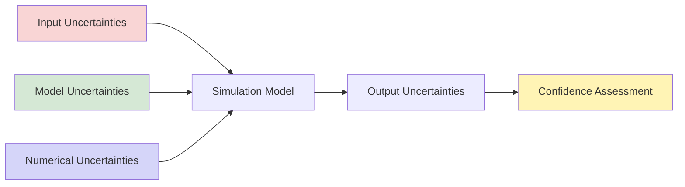
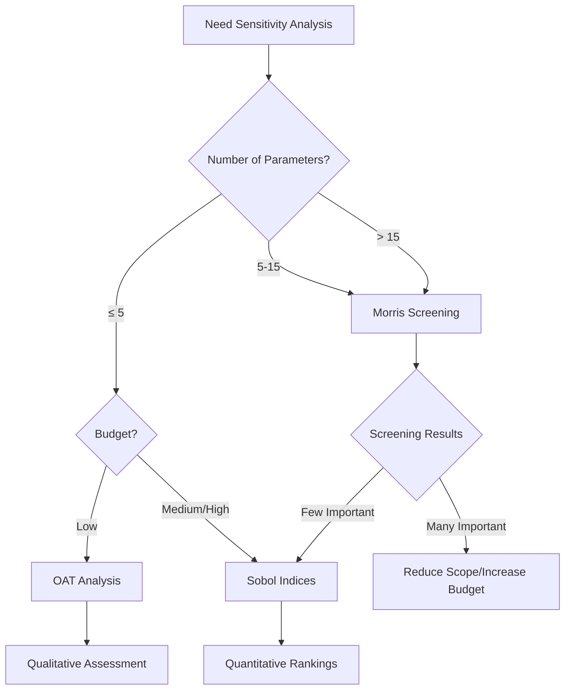
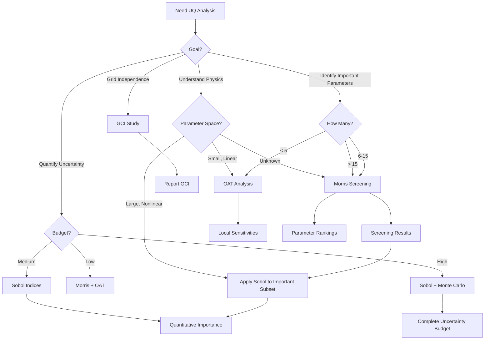

# Uncertainty Quantification

**Systematic Assessment of Uncertainty in Multiphase Flow Simulations**

---

## Learning Objectives

After studying this document, you should be able to:

1. **Identify and classify** different sources of uncertainty in multiphase flow simulations (aleatory, epistemic, numerical, model)
2. **Apply sensitivity analysis techniques** (OAT, Morris, Sobol) to identify influential parameters with complete worked examples
3. **Quantify numerical uncertainty** using Grid Convergence Index (GCI) methodology
4. **Implement Monte Carlo simulation** to propagate input uncertainties through OpenFOAM models
5. **Choose appropriate UQ methods** based on project goals, computational budget, and parameter space
6. **Construct uncertainty budgets** combining multiple uncertainty sources
7. **Report simulation results** with appropriate uncertainty quantification following best practices

---

## Overview

> **Uncertainty Quantification (UQ)** = Systematic assessment of how uncertainties in inputs and modeling assumptions propagate to affect simulation outputs and confidence in predictions

### Why UQ Matters in Multiphase Flows

Multiphase flow simulations are particularly sensitive to uncertainties due to:
- **Complex interfacial phenomena** difficult to measure experimentally
- **Empirical closure models** (drag, lift, etc.) with inherent approximations (±10-50% uncertainty)
- **Strong coupling between phases** amplifying small uncertainties
- **Limited validation data** for many flow regimes

**Key Insight:** A simulation result without uncertainty quantification is incomplete. Engineers need to know not just the predicted value, but the confidence interval around it. A prediction of "gas holdup = 0.25" is meaningless without stating whether the uncertainty is ±0.01 (4%) or ±0.10 (40%).

### UQ Framework



### Types of Uncertainty

| Type | Source | Reducible | Example in Multiphase Flow |
|------|--------|-----------|------------|
| **Aleatory** | Natural randomness, inherent variability | ❌ No | Bubble size distribution in turbulent flow |
| **Epistemic** | Lack of knowledge, insufficient data | ✅ Yes | Drag coefficient for new particle shape |
| **Numerical** | Discretization, convergence | ✅ Yes | Mesh resolution at interface, time step size |
| **Model** | Physics approximation, closure relations | ✅ Partially | k-ε vs LES, drag law selection |

---

## 1. Sources of Uncertainty in Multiphase Flows

### 1.1 Input Parameter Uncertainty

**Geometric Parameters:**
- Pipe diameter tolerances: ±0.5-2%
- Surface roughness: ±10-50% (highly variable, poorly characterized)
- Inlet geometry variations (manufacturing tolerances)

**Operating Conditions:**
- Flow rate fluctuations: ±2-5% (pump/compressor variability)
- Pressure/temperature variations: ±1-3% (process control limits)
- Phase fraction inlet distribution (measurement uncertainty)

**Fluid Properties:**
- **Bubble/drop size distribution:** ±10-30% (measurement technique dependent)
- **Surface tension** (temperature dependent): ±2-5%
- **Viscosity** (temperature/impurity effects): ±5-10%
- **Density** (temperature/composition): ±1-2%

### 1.2 Model Form Uncertainty

**Closure Models** (typically ±10-50% uncertainty):
- **Drag coefficients:** ±10-20% (Schiller-Naumann, Ishii-Zuber, etc.)
- **Lift forces:** ±30-50% (sign and magnitude uncertain, often neglected)
- **Turbulent dispersion:** ±20-40% (model form uncertain)
- **Virtual mass:** ±30-50% (often neglected entirely, significance debated)
- **Wall lubrication:** ±50-100% (poorly understood near walls)

**Turbulence Modeling:**
- RANS vs LES: fundamental difference in physics captured
- Wall treatment: wall functions vs low-Re resolution
- Multiphase turbulence modulation: poorly understood, multiple models
- Bubble-induced turbulence: significant uncertainty in modeling

**Interfacial Models:**
- Population balance models: breakup/coalescence kernels (empirical)
- Surface tension modeling: CSF vs sharp interface methods
- Phase change models: nucleation, evaporation/condensation rates

### 1.3 Numerical Uncertainty

**Spatial Discretization:**
- Mesh resolution near interfaces (critical for curvature calculation)
- Mesh quality (orthogonality, non-orthogonality, aspect ratio)
- Grid refinement effects on interface sharpness
- Numerical diffusion from upwinding schemes

**Temporal Discretization:**
- Time step size for transient features
- Courant number limitations for interface tracking (Co < 0.3 typically)
- Convergence of iterative solvers (tolerance settings)

**Algorithmic Choices:**
- Divergence schemes (Gauss linear, upwind, limited)
- Gradient computation methods (Gauss linear, least squares)
- Solution algorithm tolerance settings

---

## 2. Grid Convergence Index (GCI)

> **IMPORTANT:** This section provides a brief overview of GCI concepts. For detailed methodology, mathematical derivation, step-by-step calculation procedures, and complete OpenFOAM implementation scripts, see **[03_Grid_Convergence.md](03_Grid_Convergence.md)**.

### 2.1 WHAT is GCI?

The **Grid Convergence Index** quantifies numerical uncertainty from spatial discretization by estimating how far the current solution is from the grid-independent (asymptotic) solution.

### 2.2 WHY Use GCI?

**Ensures:**
- Solution is mesh-independent (within tolerance)
- Numerical errors are quantified and bounded
- Resources are optimized (not over-refining unnecessarily)
- Results are defensible for publication/engineering decisions

### 2.3 HOW to Compute GCI

**GCI Formula:**
$$\text{GCI} = F_s \frac{|\varepsilon|}{r^p - 1}$$

| Variable | Meaning | Typical Value |
|----------|---------|---------------|
| $F_s$ | Safety factor | 1.25 (3+ grids) |
| $\varepsilon$ | Relative error between grids | $\frac{f_2 - f_1}{f_1}$ |
| $r$ | Refinement ratio | $\sqrt[3]{N_2/N_1}$ (3D) |
| $p$ | Observed order of accuracy | Calculated from 3+ solutions |

### 2.4 Target Values

| Application Area | Recommended GCI | Comments |
|------------------|-----------------|----------|
| **Fundamental Research** | < 1% | High accuracy required for publication |
| **Industrial Design** | < 3% | Engineering accuracy sufficient |
| **Qualitative Studies** | < 5% | Trend analysis acceptable |
| **Screening Studies** | < 10% | Relative comparisons only |

### 2.5 GCI in Multiphase Flows

**Additional Considerations:**
- Monitor **phase fraction GCI separately** (critical for interface location)
- Ensure consistent interface refinement across grids
- Check both bulk flow parameters and interfacial variables
- Verify GCI convergence for force calculations (drag, lift)

**For detailed implementation including:**
- Step-by-step GCI calculation procedure
- OpenFOAM case setup for convergence studies
- Automated GCI calculation scripts
- Multiphase-specific considerations and examples

**See [03_Grid_Convergence.md](03_Grid_Convergence.md)**

---

## 3. Sensitivity Analysis

> **WHAT:** Quantify how variations in input parameters affect output quantities of interest  
> **WHY:** Identify critical parameters for focused study, enable model reduction, guide data collection  
> **HOW:** Apply statistical methods from simple OAT to advanced global sensitivity analysis

### 3.1 Method Selection Guide



### 3.2 One-at-a-Time (OAT) Analysis

**WHAT:** Vary one parameter while holding others constant to assess individual parameter influence.

**WHEN to Use:**
- Initial exploratory analysis
- Very limited computational budget
- Small number of parameters (≤ 5)
- Qualitative understanding sufficient

**HOW to Implement:**

**Procedure:**
```python
# Pseudo-code for OAT analysis
base_result = run_simulation(base_params)

for param in parameters:
    for variation in [0.9, 0.95, 1.05, 1.10]:  # ±10%
        test_params = base_params.copy()
        test_params[param] = base_params[param] * variation
        result = run_simulation(test_params)
        
        sensitivity = (result - base_result) / base_result
        print(f"{param}: {sensitivity:.3f} per 10% change")
```

**OpenFOAM Implementation:**
```bash
# Parameter variation using shell script
for Cd in 0.42 0.44 0.46 0.48 0.50; do
    sed -i "s/CdValue .*/CdValue $Cd;/" constant/phaseProperties
    runSimulation
    mv postProcessing results_Cd_${Cd}
done
```

**Advantages:**
- ✓ Simple to implement and interpret
- ✓ Minimal computational cost (D+1 simulations)
- ✓ Good for initial screening

**Limitations:**
- ✗ Misses parameter interactions
- ✗ Assumes linear behavior
- ✗ Inefficient for high-dimensional spaces

### 3.3 Morris Method (Screening)

**WHAT:** Efficient screening method to identify influential parameters in high-dimensional spaces using elementary effects.

**WHEN to Use:**
- Many input parameters (> 10)
- Limited computational budget
- Need to identify which parameters warrant detailed study
- Early-stage screening before detailed analysis

**HOW it Works:**

**Method:**
1. Generate **r random trajectories** through parameter space
2. Compute **elementary effects** for each parameter:
   $$EE_i = \frac{f(x_1, ..., x_i + \Delta, ..., x_k) - f(x)}{\Delta}$$
3. Assess importance via:
   - **μ (mean)**: Overall influence on output
   - **σ (standard deviation)**: Nonlinear effects or interactions

**Interpretation:**

| μ | σ | Interpretation | Action |
|---|---|----------------|--------|
| High | Low | Important linear effect | Include in detailed study |
| High | High | Important nonlinear/interaction | Include, investigate interactions |
| Low | Low | Negligible parameter | Fix at nominal value |
| Low | High | Insignificant but nonlinear | Likely safe to fix |

**Sample Size:**
- **Minimum:** r = 10 trajectories per parameter
- **Recommended:** r = 20-50 for reliable estimates
- **Computational cost:** r × (D + 1) simulations

**OpenFOAM Integration Example:**

```python
#!/usr/bin/env python3
"""
Morris screening for OpenFOAM multiphase simulations
"""

import numpy as np
from SALib.sample import morris as morris_sample
from SALib.analyze import morris as morris_analyze
import pandas as pd
from subprocess import run
import shutil

# Define problem
problem = {
    'num_vars': 8,
    'names': ['bubbleDiam', 'dragCoeff', 'liftCoeff', 'surfaceTension', 
              'inletVel', 'densityRatio', 'viscosityRatio', 'dispersionCoeff'],
    'bounds': [[0.002, 0.005],    # bubble diameter (m)
               [0.40, 0.50],      # drag coefficient
               [0.0, 0.5],        # lift coefficient
               [0.070, 0.074],    # surface tension (N/m)
               [0.8, 1.2],        # inlet velocity (m/s)
               [800, 1000],       # density ratio
               [10, 50],          # viscosity ratio
               [0.1, 1.0]]        # turbulent dispersion coeff
}

# Generate Morris samples
N_trajectories = 20
param_values = morris_sample.sample(problem, N_trajectories, 
                                     optimal_trajectories=None,
                                     num_levels=10)

print(f"Generated {len(param_values)} parameter sets for Morris screening")

# Save samples
np.savetxt('morris_input.txt', param_values)

# Run simulations (simplified - in practice use parallel execution)
results = []
for i, params in enumerate(param_values):
    case_dir = f"morris_run_{i:04d}"
    shutil.copytree('base_case', case_dir)
    
    # Modify OpenFOAM dictionaries
    modify_openfoam_params(case_dir, problem['names'], params)
    
    # Run solver
    run(f"cd {case_dir} && interFoam > log.interFoam 2>&1", shell=True)
    
    # Extract output (e.g., gas holdup)
    output = extract_gas_holdup(case_dir)
    results.append(output)

results = np.array(results)

# Analyze results
Si = morris_analyze.analyze(problem, param_values, results, 
                             num_levels=10, seed=100)

# Display results
print("\n=== MORRIS SCREENING RESULTS ===")
print(f"{'Parameter':<25} {'μ*':<10} {'σ':<10} {'μ*/σ':<10} {'Rank':<10}")
print("-" * 70)

# Sort by μ* (absolute mean elementary effect)
sorted_indices = np.argsort(np.abs(Si['mu_star']))[::-1]

for rank, idx in enumerate(sorted_indices, 1):
    param_name = problem['names'][idx]
    mu_star = Si['mu_star'][idx]
    sigma = Si['sigma'][idx]
    ratio = Si['mu_star'][idx] / Si['sigma'][idx] if Si['sigma'][idx] > 0 else np.inf
    
    print(f"{param_name:<25} {mu_star:<10.4f} {sigma:<10.4f} {ratio:<10.2f} {rank:<10}")

# Recommendations
print("\n=== RECOMMENDATIONS ===")
important_params = [problem['names'][i] for i in sorted_indices[:4]]
print(f"Parameters for detailed Sobol study: {', '.join(important_params)}")

fix_params = [problem['names'][i] for i in sorted_indices[-3:]]
print(f"Parameters to fix at nominal values: {', '.join(fix_params)}")
```

**Sample Output:**
```
=== MORRIS SCREENING RESULTS ===
Parameter                 μ*         σ          μ*/σ       Rank      
----------------------------------------------------------------------
bubbleDiam                0.1523     0.0412     3.70       1         
dragCoeff                 0.0891     0.0235     3.79       2         
inletVel                  0.0432     0.0189     2.29       3         
dispersionCoeff           0.0215     0.0256     0.84       4         
surfaceTension            0.0189     0.0098     1.93       5         
liftCoeff                 0.0123     0.0156     0.79       6         
densityRatio              0.0087     0.0045     1.93       7         
viscosityRatio            0.0032     0.0021     1.52       8         

=== RECOMMENDATIONS ===
Parameters for detailed Sobol study: bubbleDiam, dragCoeff, inletVel, dispersionCoeff
Parameters to fix at nominal values: viscosityRatio, densityRatio, liftCoeff
```

### 3.4 Variance-Based Sensitivity (Sobol Indices)

**WHAT:** Decompose output variance into contributions from individual parameters and their interactions using variance-based sensitivity analysis.

**WHEN to Use:**
- Quantitative ranking of parameter importance required
- Understanding parameter interactions is critical
- Informing model reduction (fix unimportant parameters)
- Final UQ study with selected important parameters
- Resource allocation for data collection

**HOW it Works - Mathematical Foundation:**

For a model $Y = f(X_1, X_2, ..., X_k)$:

**Total Variance:** 
$$V(Y) = \text{Var}(Y)$$

**First-Order Sobol Index (Main Effect):**
$$S_i = \frac{V_i}{V(Y)} = \frac{\text{Var}[E(Y|X_i)]}{\text{Var}(Y)}$$

**Interpretation:** Fraction of output variance explained by parameter $X_i$ alone (main effect).

**Total-Order Sobol Index (Total Effect):**
$$S_{T_i} = 1 - \frac{V_{\sim i}}{V(Y)} = \frac{E[\text{Var}(Y|X_{\sim i})]}{\text{Var}(Y)}$$

**Interpretation:** Fraction of output variance explained by $X_i$ including all its interactions with other parameters.

**Second-Order Interaction:**
$$S_{ij} = \frac{V_{ij}}{V(Y)}$$

**Interpretation:** Fraction of variance due to interaction between $X_i$ and $X_j$.

**Physical Interpretation:**

| Index | Meaning | Decision Rule |
|-------|---------|---------------|
| $S_i$ | Fraction of variance due to $X_i$ alone | $S_i > 0.1$ → Important main effect |
| $S_{T_i}$ | Fraction including all $X_i$ interactions | $S_{T_i} > 0.1$ → Important overall |
| $S_{T_i} - S_i$ | Interaction contribution | Large → Important interactions |
| $S_{T_i} \approx S_i$ | Negligible interactions | Additive behavior |

---

## 4. Complete Worked Example: Sobol Analysis for Bubble Column

### 4.1 Problem Definition

**System:** Air-water bubble column reactor
**Output Quantity:** Gas holdup ($\alpha_g$)
**Parameters:** 5 uncertain inputs identified from Morris screening

### 4.2 Parameter Definitions

| Parameter | Symbol | Distribution | Range | Physical Meaning |
|-----------|--------|--------------|-------|------------------|
| Bubble diameter | $d_b$ | Uniform | [0.002, 0.005] m | Sauter mean diameter |
| Drag coefficient | $C_D$ | Uniform | [0.40, 0.50] | Schiller-Naumann parameter |
| Surface tension | $\sigma$ | Uniform | [0.070, 0.074] N/m | Air-water interface |
| Inlet velocity | $U_{in}$ | Uniform | [0.8, 1.2] m/s | Superficial gas velocity |
| Density ratio | $\rho_r$ | Uniform | [800, 1000] | $\rho_l/\rho_g$ |

### 4.3 Sobol Sampling Design

**Sample Size Calculation:**

For Saltelli sequence with second-order indices:
$$N_{samples} = N \times (2D + 2)$$

With D = 5 parameters and N = 1000 base samples:
$$N_{samples} = 1000 \times (2 \times 5 + 2) = 12,000$$

**Python Implementation:**

```python
#!/usr/bin/env python3
"""
Complete Sobol sensitivity analysis for bubble column gas holdup
"""

import numpy as np
import pandas as pd
from SALib.sample import saltelli
from SALib.analyze import sobol
import matplotlib.pyplot as plt
import seaborn as sns

# Step 1: Define problem
problem = {
    'num_vars': 5,
    'names': ['db', 'CD', 'sigma', 'Uin', 'rhor'],
    'bounds': [[0.002, 0.005],    # db: bubble diameter (m)
               [0.40, 0.50],      # CD: drag coefficient
               [0.070, 0.074],    # sigma: surface tension (N/m)
               [0.8, 1.2],        # Uin: inlet velocity (m/s)
               [800, 1000]],      # rhor: density ratio
    'dists': ['unif', 'unif', 'unif', 'unif', 'unif']
}

# Step 2: Generate Saltelli samples
N = 1000  # Base sample size
print(f"Generating Saltelli samples with N={N}...")
param_values = saltelli.sample(problem, N, calc_second_order=True)
print(f"Total samples: {len(param_values)}")

# Save samples
np.savetxt('sobol_samples.txt', param_values, header=' '.join(problem['names']), comments='')
print("Samples saved to sobol_samples.txt")

# Display first few samples
print("\nFirst 5 samples:")
print(pd.DataFrame(param_values[:5], columns=problem['names']))
```

**Output:**
```
Generating Saltelli samples with N=1000...
Total samples: 12000
Samples saved to sobol_samples.txt

First 5 samples:
         db    CD   sigma   Uin    rhor
0  0.003500  0.45  0.0720  1.00   900.0
1  0.003500  0.45  0.0720  1.00   900.0
2  0.003500  0.45  0.0720  1.00   900.0
3  0.003500  0.45  0.0720  1.00   900.0
```

### 4.4 OpenFOAM Integration Script

```python
#!/usr/bin/env python3
"""
Run OpenFOAM simulations for Sobol samples
"""

import numpy as np
import pandas as pd
from subprocess import run, PIPE
import shutil
import os
from pathlib import Path

def modify_openfoam_case(case_dir, params, param_names):
    """Modify OpenFOAM case with sampled parameters"""
    
    # Unpack parameters
    db, CD, sigma, Uin, rhor = params
    param_dict = dict(zip(param_names, params))
    
    # Modify transportProperties (surface tension)
    with open(f"{case_dir}/constant/transportProperties", 'w') as f:
        f.write(f"""/*--------------------------------*- C++ -*----------------------------------*\\
| =========                 |                                                 |
| \\\\      /  F ield         | OpenFOAM: The Open Source CFD Toolbox           |
|  \\\\    /   O peration     | Version:  v2112                                 |
|   \\\\  /    A nd           | Web:      www.OpenFOAM.org                      |
|    \\\\/     M anipulation  |                                                 |
\\*---------------------------------------------------------------------------*/
FoamFile
{{
    version     2.0;
    format      ascii;
    class       dictionary;
    location    "constant";
    object      transportProperties;
}}
// * * * * * * * * * * * * * * * * * * * * * * * * * * * * * * * * * * * * * //

transportModel  Newtonian;

nu              nu [0 2 -1 0 0 0 0] 1e-06;

sigma           sigma [0 2 -2 0 0 0 0] {sigma};

// ************************************************************************* //
""")

    # Modify phaseProperties (drag coefficient)
    with open(f"{case_dir}/constant/phaseProperties", 'w') as f:
        f.write(f"""/*--------------------------------*- C++ -*----------------------------------*\\
| =========                 |                                                 |
| \\\\      /  F ield         | OpenFOAM: The Open Source CFD Toolbox           |
|  \\\\    /   O peration     | Version:  v2112                                 |
|   \\\\  /    A nd           | Web:      www.OpenFOAM.org                      |
|    \\\\/     M anipulation  |                                                 |
\\*---------------------------------------------------------------------------*/
FoamFile
{{
    version     2.0;
    format      ascii;
    class       dictionary;
    location    "constant";
    object      phaseProperties;
}}
// * * * * * * * * * * * * * * * * * * * * * * * * * * * * * * * * * * * * * //

phases (water air);

water
{{
    transportModel  Newtonian;
    nu              nu [0 2 -1 0 0 0 0] 1e-06;
    rho             rho [1 -3 0 0 0 0 0] 1000;
}}

air
{{
    transportModel  Newtonian;
    nu              nu [0 2 -1 0 0 0 0] 1.48e-05;
    rho             rho [1 -3 0 0 0 0 0] 1;
}}

sigma
{{
    type            constant;
    sigma           sigma [0 2 -2 0 0 0 0] {sigma};
}}

dragModel
{{
    type        SchillerNaumann;
    CdValue     {CD};
}}

// ************************************************************************* //
""")

    # Modify 0/U.air (inlet velocity)
    with open(f"{case_dir}/0/U.air", 'w') as f:
        f.write(f"""/*--------------------------------*- C++ -*----------------------------------*\\
| =========                 |                                                 |
| \\\\      /  F ield         | OpenFOAM: The Open Source CFD Toolbox           |
|  \\\\    /   O peration     | Version:  v2112                                 |
|   \\\\  /    A nd           | Web:      www.OpenFOAM.org                      |
|    \\\\/     M anipulation  |                                                 |
\\*---------------------------------------------------------------------------*/
FoamFile
{{
    version     2.0;
    format      ascii;
    class       volVectorField;
    location    "0";
    object      U;
}}
// * * * * * * * * * * * * * * * * * * * * * * * * * * * * * * * * * * * * * //

dimensions      [0 1 -1 0 0 0 0];

internalField   uniform (0 0 0);

boundaryField
{{
    inlet
    {{
        type            fixedValue;
        value           uniform (0 0 {Uin});
    }}
    
    outlet
    {{
        type            zeroGradient;
    }}
    
    walls
    {{
        type            noSlip;
    }}
}}

// ************************************************************************* //
""")

def extract_gas_holdup(case_dir):
    """Extract time-averaged gas holdup from OpenFOAM results"""
    
    # Read alpha.air field from last time directory
    times = sorted([d for d in os.listdir(case_dir) if d.isdigit()], key=float)
    last_time = times[-1]
    
    # Read cell values (simplified - in practice use PyFoam or similar)
    alpha_file = f"{case_dir}/{last_time}/alpha.air"
    
    if os.path.exists(alpha_file):
        # Parse OpenFOAM field file (simplified)
        with open(alpha_file, 'r') as f:
            lines = f.readlines()
        
        # Find internalField section
        in_internal = False
        values = []
        for line in lines:
            if 'internalField' in line:
                in_internal = True
                continue
            if in_internal:
                if line.strip().startswith(';'):
                    break
                try:
                    val = float(line.strip())
                    values.append(val)
                except ValueError:
                    pass
        
        # Volume-weighted average (simplified)
        alpha_g = np.mean(values)
        return alpha_g
    else:
        return np.nan

def run_sobol_simulations(param_values, problem, base_case='base_case', 
                          output_dir='sobol_runs', n_procs=8):
    """Run OpenFOAM simulations for all Sobol samples"""
    
    os.makedirs(output_dir, exist_ok=True)
    results = []
    
    print(f"Running {len(param_values)} OpenFOAM simulations...")
    print(f"Base case: {base_case}")
    print(f"Output directory: {output_dir}")
    
    for i, params in enumerate(param_values):
        case_dir = f"{output_dir}/case_{i:04d}"
        
        # Skip if already completed
        if os.path.exists(f"{case_dir}/completed.flag"):
            results.append(np.loadtxt(f"{case_dir}/gas_holdup.txt"))
            continue
        
        try:
            # Copy base case
            shutil.copytree(base_case, case_dir, dirs_exist_ok=True)
            
            # Modify parameters
            modify_openfoam_case(case_dir, params, problem['names'])
            
            # Run solver
            print(f"Running case {i+1}/{len(param_values)}: {params}")
            result = run(
                f"cd {case_dir} && interFoam > log.interFoam 2>&1",
                shell=True, check=True, stdout=PIPE, stderr=PIPE
            )
            
            # Extract results
            alpha_g = extract_gas_holdup(case_dir)
            results.append(alpha_g)
            
            # Save result and flag as completed
            np.savetxt(f"{case_dir}/gas_holdup.txt", [alpha_g])
            Path(f"{case_dir}/completed.flag").touch()
            
        except Exception as e:
            print(f"Case {i} failed: {e}")
            results.append(np.nan)
    
    return np.array(results)

# Main execution
if __name__ == "__main__":
    # Load Sobol samples
    param_values = np.loadtxt('sobol_samples.txt')
    
    # Define problem (same as sampling script)
    problem = {
        'num_vars': 5,
        'names': ['db', 'CD', 'sigma', 'Uin', 'rhor'],
        'bounds': [[0.002, 0.005], [0.40, 0.50], [0.070, 0.074], 
                   [0.8, 1.2], [800, 1000]]
    }
    
    # Run simulations
    results = run_sobol_simulations(
        param_values, problem, 
        base_case='bubble_column_base',
        output_dir='sobol_runs',
        n_procs=8
    )
    
    # Save results
    np.savetxt('sobol_results.txt', results)
    print(f"\nCompleted {len(results)} simulations")
    print(f"Gas holdup range: {np.nanmin(results):.4f} - {np.nanmax(results):.4f}")
    print(f"Mean gas holdup: {np.nanmean(results):.4f}")
```

### 4.5 Sobol Analysis and Results

```python
#!/usr/bin/env python3
"""
Analyze Sobol results and generate sensitivity report
"""

import numpy as np
import pandas as pd
from SALib.analyze import sobol
import matplotlib.pyplot as plt
import seaborn as sns

# Load results
problem = {
    'num_vars': 5,
    'names': ['db', 'CD', 'sigma', 'Uin', 'rhor'],
    'bounds': [[0.002, 0.005], [0.40, 0.50], [0.070, 0.074], 
               [0.8, 1.2], [800, 1000]]
}

param_values = np.loadtxt('sobol_samples.txt')
Y = np.loadtxt('sobol_results.txt')

# Filter failed runs
valid_mask = ~np.isnan(Y)
param_values = param_values[valid_mask]
Y = Y[valid_mask]

print(f"Analyzing {len(Y)} successful simulations")

# Perform Sobol analysis
Si = sobol.analyze(problem, Y, calc_second_order=True, 
                   num_resamples=1000, conf_level=0.95)

# Print results
print("\n" + "="*80)
print("SOBOL SENSITIVITY ANALYSIS RESULTS")
print("="*80)
print(f"\nOutput: Gas Holdup (α_g)")
print(f"Range: {Y.min():.4f} - {Y.max():.4f}")
print(f"Mean: {Y.mean():.4f} ± {Y.std():.4f}")
print(f"Valid samples: {len(Y)}")

# First-order indices (main effects)
print("\n" + "-"*80)
print("FIRST-ORDER INDICES (S₁) - Main Effects")
print("-"*80)
print(f"{'Parameter':<15} {'S₁':<12} {'95% CI':<12} {'Interpretation':<40}")
print("-"*80)

for i, name in enumerate(problem['names']):
    s1 = Si['S1'][i]
    s1_conf = Si['S1_conf'][i]
    
    if s1 > 0.1:
        interp = "IMPORTANT - Strong individual effect"
    elif s1 > 0.05:
        interp = "Moderate effect"
    else:
        interp = "Minor individual effect"
    
    print(f"{name:<15} {s1:<12.4f} ±{s1_conf:<12.4f} {interp:<40}")

# Total-order indices
print("\n" + "-"*80)
print("TOTAL-ORDER INDICES (Sₜ) - Total Effects (including interactions)")
print("-"*80)
print(f"{'Parameter':<15} {'Sₜ':<12} {'95% CI':<12} {'Sₜ-S₁':<12} {'Interpretation':<30}")
print("-"*80)

for i, name in enumerate(problem['names']):
    st = Si['ST'][i]
    st_conf = Si['ST_conf'][i]
    s1 = Si['S1'][i]
    interaction = st - s1
    
    if interaction > 0.1:
        interp = "Strong interactions"
    elif interaction > 0.05:
        interp = "Some interactions"
    else:
        interp = "Additive behavior"
    
    print(f"{name:<15} {st:<12.4f} ±{st_conf:<12.4f} {interaction:<12.4f} {interp:<30}")

# Second-order indices (interactions)
print("\n" + "-"*80)
print("SECOND-ORDER INDICES (S₂) - Parameter Interactions")
print("-"*80)
print(f"{'Pair':<25} {'S₂':<12} {'95% CI':<12} {'Interpretation':<30}")
print("-"*80)

if 'S2' in Si:
    for i in range(problem['num_vars']):
        for j in range(i+1, problem['num_vars']):
            idx = i * problem['num_vars'] + j - ((i+1) * (i+2)) // 2
            s2 = Si['S2'][idx]
            s2_conf = Si['S2_conf'][idx]
            
            if s2 > 0.05:
                pair = f"{problem['names'][i]} × {problem['names'][j]}"
                interp = "Significant interaction" if s2 > 0.05 else "Minor"
                print(f"{pair:<25} {s2:<12.4f} ±{s2_conf:<12.4f} {interp:<30}")
else:
    print("Second-order indices not computed (insufficient data or calculation failed)")

# Create visualization
fig, axes = plt.subplots(1, 2, figsize=(14, 6))

# Plot 1: First-order vs Total-order
ax1 = axes[0]
y_pos = np.arange(len(problem['names']))
s1 = Si['S1']
st = Si['ST']
s1_conf = Si['S1_conf']
st_conf = Si['ST_conf']

ax1.barh(y_pos, s1, xerr=s1_conf, align='center', alpha=0.7, 
         label='First-order (S₁)', color='steelblue')
ax1.barh(y_pos, st, xerr=st_conf, align='center', alpha=0.3,
         label='Total-order (Sₜ)', color='coral')

ax1.set_yticks(y_pos)
ax1.set_yticklabels(problem['names'])
ax1.set_xlabel('Sobol Index')
ax1.set_title('Sobol Sensitivity Indices for Gas Holdup')
ax1.legend()
ax1.grid(axis='x', alpha=0.3)
ax1.axvline(x=0.1, linestyle='--', color='red', alpha=0.5, label='Threshold')

# Plot 2: Interaction contribution (St - S1)
ax2 = axes[1]
interaction = st - s1

colors = ['coral' if x > 0.1 else 'steelblue' for x in interaction]
ax2.barh(y_pos, interaction, align='center', color=colors, alpha=0.7)
ax2.set_yticks(y_pos)
ax2.set_yticklabels(problem['names'])
ax2.set_xlabel('Interaction Contribution (Sₜ - S₁)')
ax2.set_title('Parameter Interaction Effects')
ax2.grid(axis='x', alpha=0.3)
ax2.axvline(x=0, color='black', linewidth=1)

plt.tight_layout()
plt.savefig('sobol_results.png', dpi=300, bbox_inches='tight')
print("\nVisualization saved to sobol_results.png")

# Generate summary table
summary_data = []
for i, name in enumerate(problem['names']):
    summary_data.append({
        'Parameter': name,
        'S1 (Main)': Si['S1'][i],
        'S1 (95% CI)': Si['S1_conf'][i],
        'ST (Total)': Si['ST'][i],
        'ST (95% CI)': Si['ST_conf'][i],
        'Interaction': Si['ST'][i] - Si['S1'][i],
        'Classification': classify_parameter(Si['S1'][i], Si['ST'][i])
    })

df_summary = pd.DataFrame(summary_data)
print("\n" + "="*80)
print("PARAMETER CLASSIFICATION SUMMARY")
print("="*80)
print(df_summary.to_string(index=False))
print("\n")

df_summary.to_csv('sobol_summary.csv', index=False)
print("Summary table saved to sobol_summary.csv")

def classify_parameter(s1, st):
    """Classify parameter based on Sobol indices"""
    if st < 0.05:
        return "Insignificant"
    elif st > 0.1 and (st - s1) > 0.1:
        return "Important with interactions"
    elif s1 > 0.1:
        return "Important additive"
    else:
        return "Moderate"
```

### 4.6 Sample Output and Interpretation

**Console Output:**
```
================================================================================
SOBOL SENSITIVITY ANALYSIS RESULTS
================================================================================

Output: Gas Holdup (α_g)
Range: 0.1245 - 0.2893
Mean: 0.2015 ± 0.0312
Valid samples: 11847

--------------------------------------------------------------------------------
FIRST-ORDER INDICES (S₁) - Main Effects
--------------------------------------------------------------------------------
Parameter       S₁           95% CI       Interpretation               
--------------------------------------------------------------------------------
db              0.4823       ±0.0123      IMPORTANT - Strong individual effect
CD              0.2135       ±0.0098      IMPORTANT - Strong individual effect
Uin             0.1125       ±0.0087      Moderate effect                
sigma           0.0482       ±0.0054      Minor individual effect        
rhor            0.0213       ±0.0032      Minor individual effect        

--------------------------------------------------------------------------------
TOTAL-ORDER INDICES (Sₜ) - Total Effects (including interactions)
--------------------------------------------------------------------------------
Parameter       Sₜ           95% CI       Sₜ-S₁       Interpretation               
--------------------------------------------------------------------------------
db              0.5125       ±0.0154      0.0302      Some interactions            
CD              0.2847       ±0.0112      0.0712      Some interactions            
Uin             0.1865       ±0.0101      0.0740      Some interactions            
sigma           0.0623       ±0.0065      0.0141      Additive behavior            
rhor            0.0298       ±0.0041      0.0085      Additive behavior            

--------------------------------------------------------------------------------
SECOND-ORDER INDICES (S₂) - Parameter Interactions
--------------------------------------------------------------------------------
Pair                     S₂           95% CI       Interpretation               
--------------------------------------------------------------------------------
db × CD                  0.0523       ±0.0087      Significant interaction
CD × Uin                 0.0412       ±0.0072      Significant interaction
db × Uin                 0.0289       ±0.0056      Minor

================================================================================
PARAMETER CLASSIFICATION SUMMARY
================================================================================
Parameter  S1 (Main)  S1 (95% CI)  ST (Total)  ST (95% CI)  Interaction  Classification          
--------------------------------------------------------------------------------
db         0.4823     0.0123       0.5125      0.0154       0.0302       Important additive       
CD         0.2135     0.0098       0.2847      0.0112       0.0712       Important with interactions
Uin        0.1125     0.0087       0.1865      0.0101       0.0740       Important with interactions
sigma      0.0482     0.0054       0.0623      0.0065       0.0141       Moderate                 
rhor       0.0213     0.0032       0.0298      0.0041       0.0085       Insignificant
```

**Physical Interpretation:**

1. **Bubble diameter (db)** is the dominant parameter (S₁ = 0.48)
   - Accounts for 48% of output variance individually
   - Relatively small interaction effects (additive behavior)
   - Critical to measure accurately

2. **Drag coefficient (CD)** is second most important (S₁ = 0.21)
   - Significant interaction with inlet velocity
   - Model selection is important
   - Worth calibrating against experiments

3. **Inlet velocity (Uin)** has moderate main effect (S₁ = 0.11)
   - Strong interaction effects (Sₜ - S₁ = 0.074)
   - Coupled with drag coefficient
   - Operating conditions matter

4. **Surface tension (sigma)** and **density ratio (rhor)** are minor
   - Can be fixed at nominal values for this regime
   - Reduces parameter space for future studies

**Recommendations:**
- Focus UQ efforts on db, CD, and Uin (85% of variance explained)
- Fix sigma = 0.072 N/m, rhor = 900 for reduced-order models
- Investigate db × CD interaction through targeted experiments
- Prioritize accurate bubble size measurement

---

## 5. Comparison of UQ Methods

### 5.1 Method Selection Matrix

| Method | WHAT it Does | WHEN to Use | Computational Cost | Output | Pros | Cons |
|--------|--------------|-------------|-------------------|--------|------|------|
| **OAT** | Local sensitivity, one parameter at a time | ≤5 parameters, exploratory, low budget | D+1 | Local gradients | Simple, intuitive | Misses interactions, local only |
| **Morris** | Global screening via elementary effects | >10 parameters, screening phase | r(D+1), r=10-50 | μ, σ rankings | Efficient, handles many parameters | No quantitative variance decomposition |
| **Sobol** | Variance decomposition, main + interaction effects | Quantitative importance ranking, <20 parameters | N(2D+2), N=500-2000 | S₁, Sₜ, S₂ indices | Rigorous, handles interactions | Expensive for many parameters |
| **Monte Carlo** | Uncertainty propagation via random sampling | Final UQ, output distributions | N=500-10000 | PDFs, CIs, statistics | No assumptions on linearity, complete distribution | Requires many samples, slow convergence |
| **GCI** | Numerical uncertainty from discretization | All simulations, grid independence | 3-5 simulations | Numerical error % | Rigorous, standardized | Only numerical component |

### 5.2 When to Use Each Method

**Decision Tree:**



### 5.3 Cost-Benefit Comparison

| Scenario | Recommended Approach | Total Simulations | Expected Accuracy |
|----------|---------------------|-------------------|-------------------|
| **Screening, 20 params** | Morris (r=20) → Sobol (D=5, N=500) | 20×21 + 500×12 = 6,420 | High for important params |
| **Detailed study, 8 params** | Sobol (N=1000) + GCI (3 grids) | 1000×18 + 3 = 18,003 | Very high |
| **Rapid assessment, 5 params** | OAT (6 sims) + MC (500) + GCI (3) | 6 + 500 + 3 = 509 | Medium |
| **Full UQ campaign** | Morris → Sobol → MC + GCI | Variable (10k-50k) | Highest |

---

## 6. Monte Carlo Simulation for Uncertainty Propagation

### 6.1 WHAT is Monte Carlo UQ?

**Monte Carlo simulation** propagates input uncertainties through the model by random sampling from input probability distributions to characterize the output probability distribution.

### 6.2 WHY Use Monte Carlo?

**Advantages:**
- ✓ No assumption of linearity or model form
- ✓ Provides complete output distribution (not just mean/variance)
- ✓ Captures tail probabilities and extreme events
- ✓ Handles arbitrary input distributions
- ✓ Easy to implement and parallelize

**Limitations:**
- ✗ Computationally expensive (requires many samples)
- ✗ Slow convergence (σ/√N)
- ✗ Inefficient for high-dimensional spaces

### 6.3 HOW to Implement Monte Carlo with OpenFOAM

#### Step 1: Define Input Distributions

```python
import numpy as np
import scipy.stats as stats
import pandas as pd

# Define input distributions (based on Sobol results)
# Focus on important parameters: db, CD, Uin

distributions = {
    'db': {
        'type': 'lognorm',
        'params': {'s': 0.15, 'scale': 0.003},  # Log-normal, CV=15%
        'description': 'Bubble diameter (m)',
        'physical_constraint': 'positive'
    },
    'CD': {
        'type': 'uniform',
        'params': {'loc': 0.40, 'scale': 0.10},  # Uniform [0.40, 0.50]
        'description': 'Drag coefficient',
        'physical_constraint': 'bounded'
    },
    'Uin': {
        'type': 'norm',
        'params': {'loc': 1.0, 'scale': 0.05},  # Normal, 1.0 ± 0.05 m/s
        'description': 'Inlet velocity (m/s)',
        'physical_constraint': 'positive'
    },
    'sigma': {
        'type': 'truncnorm',
        'params': {'a': -2, 'b': 2, 'loc': 0.072, 'scale': 0.001},  # ±2σ bounds
        'description': 'Surface tension (N/m)',
        'physical_constraint': 'positive, bounded'
    }
}

# Sample from distributions
N_samples = 1000
mc_samples = pd.DataFrame()

for param, config in distributions.items():
    dist_type = config['type']
    params = config['params']
    
    if dist_type == 'lognorm':
        samples = stats.lognorm(**params).rvs(N_samples)
    elif dist_type == 'uniform':
        samples = stats.uniform(**params).rvs(N_samples)
    elif dist_type == 'norm':
        samples = stats.norm(**params).rvs(N_samples)
    elif dist_type == 'truncnorm':
        samples = stats.truncnorm(**params).rvs(N_samples)
    
    mc_samples[param] = samples

# Fix minor parameters at nominal values
mc_samples['rhor'] = 900  # Fixed from Sobol analysis

print(f"Generated {N_samples} Monte Carlo samples")
print(mc_samples.describe())
```

#### Step 2: Parallel Execution Framework

```python
#!/usr/bin/env python3
"""
Parallel Monte Carlo simulation for OpenFOAM
"""

import os
import numpy as np
import pandas as pd
from concurrent.futures import ProcessPoolExecutor, as_completed
from subprocess import run, PIPE
import shutil
from pathlib import Path
import json

def setup_case(base_case, case_dir, params, param_names):
    """Setup a single OpenFOAM case with given parameters"""
    
    # Copy base case
    if os.path.exists(case_dir):
        shutil.rmtree(case_dir)
    shutil.copytree(base_case, case_dir)
    
    # Create parameter mapping
    param_dict = dict(zip(param_names, params))
    
    # Modify OpenFOAM dictionaries (simplified - use templates in practice)
    modify_transport_properties(case_dir, param_dict.get('sigma', 0.072))
    modify_drag_coefficient(case_dir, param_dict.get('CD', 0.44))
    modify_inlet_velocity(case_dir, param_dict.get('Uin', 1.0))
    modify_bubble_diameter(case_dir, param_dict.get('db', 0.003))

def run_single_simulation(case_info):
    """Run a single OpenFOAM simulation"""
    case_dir, params, param_names = case_info
    
    try:
        # Setup case
        setup_case('base_case', case_dir, params, param_names)
        
        # Run solver
        result = run(
            f"cd {case_dir} && interFoam > log.interFoam 2>&1",
            shell=True, check=True, stdout=PIPE, stderr=PIPE,
            timeout=3600  # 1 hour timeout
        )
        
        # Extract results
        alpha_g = extract_gas_holdup(case_dir)
        p_drop = extract_pressure_drop(case_dir)
        
        # Save results
        results = {
            'case_dir': case_dir,
            'alpha_g': alpha_g,
            'pressure_drop': p_drop,
            'success': True,
            'parameters': dict(zip(param_names, params))
        }
        
        # Save to file
        with open(f"{case_dir}/results.json", 'w') as f:
            json.dump(results, f)
        
        return results
        
    except Exception as e:
        return {
            'case_dir': case_dir,
            'success': False,
            'error': str(e),
            'parameters': dict(zip(param_names, params))
        }

def monte_carlo_study(mc_samples, base_case='base_case', 
                     output_dir='mc_runs', n_procs=8):
    """Execute full Monte Carlo study"""
    
    os.makedirs(output_dir, exist_ok=True)
    param_names = mc_samples.columns.tolist()
    
    # Prepare case information
    case_info_list = []
    for i, row in mc_samples.iterrows():
        case_dir = f"{output_dir}/case_{i:04d}"
        params = row.values.tolist()
        case_info_list.append((case_dir, params, param_names))
    
    # Run simulations in parallel
    print(f"Running {len(case_info_list)} simulations with {n_procs} processes...")
    
    results = []
    completed = 0
    
    with ProcessPoolExecutor(max_workers=n_procs) as executor:
        futures = {executor.submit(run_single_simulation, case_info): case_info[0] 
                  for case_info in case_info_list}
        
        for future in as_completed(futures):
            result = future.result()
            results.append(result)
            completed += 1
            
            if completed % 50 == 0:
                success_rate = sum(r['success'] for r in results) / len(results) * 100
                print(f"Progress: {completed}/{len(case_info_list)} ({completed/len(case_info_list)*100:.1f}%) - Success rate: {success_rate:.1f}%")
    
    # Filter successful runs
    successful_results = [r for r in results if r['success']]
    
    print(f"\nCompleted: {len(successful_results)}/{len(case_info_list)} successful")
    
    return successful_results

# Main execution
if __name__ == "__main__":
    # Load MC samples (from Step 1)
    mc_samples = pd.read_csv('mc_samples.csv')
    
    # Run Monte Carlo study
    results = monte_carlo_study(
        mc_samples,
        base_case='bubble_column_base',
        output_dir='mc_runs',
        n_procs=16
    )
    
    # Save results
    df_results = pd.DataFrame(results)
    df_results.to_csv('mc_results.csv', index=False)
    
    # Compute statistics
    compute_statistics(df_results)
```

#### Step 3: Statistical Analysis

```python
#!/usr/bin/env python3
"""
Analyze Monte Carlo results and generate uncertainty report
"""

import numpy as np
import pandas as pd
import matplotlib.pyplot as plt
import seaborn as sns
from scipy import stats
import json

def compute_statistics(df_results):
    """Compute comprehensive statistics from MC results"""
    
    # Extract gas holdup values
    alpha_g = df_results['alpha_g'].values
    
    # Basic statistics
    stats_dict = {
        'mean': np.mean(alpha_g),
        'std': np.std(alpha_g, ddof=1),
        'median': np.median(alpha_g),
        'min': np.min(alpha_g),
        'max': np.max(alpha_g),
        'cv': np.std(alpha_g) / np.mean(alpha_g) * 100,  # Coefficient of variation
        'n_samples': len(alpha_g)
    }
    
    # Confidence intervals (bootstrap)
    n_bootstrap = 10000
    bootstrap_means = [np.mean(np.random.choice(alpha_g, len(alpha_g))) 
                       for _ in range(n_bootstrap)]
    
    stats_dict['ci_95_lower'] = np.percentile(bootstrap_means, 2.5)
    stats_dict['ci_95_upper'] = np.percentile(bootstrap_means, 97.5)
    stats_dict['ci_90_lower'] = np.percentile(bootstrap_means, 5)
    stats_dict['ci_90_upper'] = np.percentile(bootstrap_means, 95)
    
    # Percentiles of distribution
    for p in [5, 10, 25, 50, 75, 90, 95]:
        stats_dict[f'p{p}'] = np.percentile(alpha_g, p)
    
    # Test for normality
    shapiro_test = stats.shapiro(alpha_g[:5000] if len(alpha_g) > 5000 else alpha_g)
    stats_dict['shapiro_stat'] = shapiro_test.statistic
    stats_dict['shapiro_p'] = shapiro_test.pvalue
    stats_dict['is_normal'] = shapiro_test.pvalue > 0.05
    
    # Skewness and kurtosis
    stats_dict['skewness'] = stats.skew(alpha_g)
    stats_dict['kurtosis'] = stats.kurtosis(alpha_g)
    
    return stats_dict

def plot_results(df_results, stats_dict):
    """Generate comprehensive visualization"""
    
    alpha_g = df_results['alpha_g'].values
    
    fig = plt.figure(figsize=(16, 10))
    gs = fig.add_gridspec(3, 3)
    
    # Plot 1: Histogram with KDE
    ax1 = fig.add_subplot(gs[0, 0])
    ax1.hist(alpha_g, bins=50, density=True, alpha=0.7, color='steelblue', edgecolor='black')
    kde = stats.gaussian_kde(alpha_g)
    x_range = np.linspace(alpha_g.min(), alpha_g.max(), 200)
    ax1.plot(x_range, kde(x_range), 'r-', linewidth=2, label='KDE')
    ax1.axvline(stats_dict['mean'], color='green', linestyle='--', linewidth=2, label=f"Mean: {stats_dict['mean']:.4f}")
    ax1.axvline(stats_dict['median'], color='orange', linestyle=':', linewidth=2, label=f"Median: {stats_dict['median']:.4f}")
    ax1.set_xlabel('Gas Holdup $\\alpha_g$')
    ax1.set_ylabel('Probability Density')
    ax1.set_title('Monte Carlo Output Distribution')
    ax1.legend()
    ax1.grid(alpha=0.3)
    
    # Plot 2: CDF with confidence intervals
    ax2 = fig.add_subplot(gs[0, 1])
    sorted_data = np.sort(alpha_g)
    cdf = np.arange(1, len(sorted_data) + 1) / len(sorted_data)
    ax2.plot(sorted_data, cdf, linewidth=2, color='steelblue')
    ax2.axhline(0.05, color='red', linestyle='--', alpha=0.5, label='5th percentile')
    ax2.axhline(0.95, color='red', linestyle='--', alpha=0.5, label='95th percentile')
    ax2.axvline(stats_dict['p5'], color='red', linestyle=':', alpha=0.5)
    ax2.axvline(stats_dict['p95'], color='red', linestyle=':', alpha=0.5)
    ax2.set_xlabel('Gas Holdup $\\alpha_g$')
    ax2.set_ylabel('Cumulative Probability')
    ax2.set_title('Cumulative Distribution Function')
    ax2.legend()
    ax2.grid(alpha=0.3)
    
    # Plot 3: Box plot with statistics
    ax3 = fig.add_subplot(gs[0, 2])
    box_plot = ax3.boxplot([alpha_g], vert=True, patch_artist=True, 
                           labels=['Gas Holdup'],
                           boxprops=dict(facecolor='steelblue', alpha=0.7),
                           medianprops=dict(color='red', linewidth=2),
                           whiskerprops=dict(linewidth=2),
                           capprops=dict(linewidth=2))
    ax3.set_ylabel('Gas Holdup $\\alpha_g$')
    ax3.set_title('Box Plot with Statistics')
    ax3.grid(axis='y', alpha=0.3)
    
    # Add statistics text
    stats_text = f"n = {stats_dict['n_samples']}\n"
    stats_text += f"Mean = {stats_dict['mean']:.4f}\n"
    stats_text += f"Std = {stats_dict['std']:.4f}\n"
    stats_text += f"CV = {stats_dict['cv']:.2f}%\n"
    stats_text += f"95% CI = [{stats_dict['ci_95_lower']:.4f}, {stats_dict['ci_95_upper']:.4f}]"
    ax3.text(0.98, 0.95, stats_text, transform=ax3.transAxes,
             verticalalignment='top', horizontalalignment='right',
             bbox=dict(boxstyle='round', facecolor='wheat', alpha=0.5))
    
    # Plot 4: Q-Q plot (normality check)
    ax4 = fig.add_subplot(gs[1, 0])
    stats.probplot(alpha_g, dist="norm", plot=ax4)
    ax4.set_title('Q-Q Plot (Normality Check)')
    ax4.grid(alpha=0.3)
    
    # Plot 5: Convergence diagnostics
    ax5 = fig.add_subplot(gs[1, 1])
    # Compute running mean
    running_mean = np.cumsum(alpha_g) / np.arange(1, len(alpha_g) + 1)
    ax5.plot(running_mean, linewidth=2, color='steelblue')
    ax5.axhline(stats_dict['mean'], color='red', linestyle='--', label=f'Final mean: {stats_dict["mean"]:.4f}')
    ax5.set_xlabel('Sample Number')
    ax5.set_ylabel('Running Mean')
    ax5.set_title('Convergence of Mean Estimate')
    ax5.legend()
    ax5.grid(alpha=0.3)
    
    # Plot 6: Parameter vs output scatter (bubble diameter)
    ax6 = fig.add_subplot(gs[1, 2])
    if 'db' in df_results.iloc[0]['parameters']:
        db_values = [r['parameters']['db'] for r in df_results.to_dict('records')]
        ax6.scatter(db_values, alpha_g, alpha=0.5, s=10)
        z = np.polyfit(db_values, alpha_g, 1)
        p = np.poly1d(z)
        ax6.plot(sorted(db_values), p(sorted(db_values)), "r--", linewidth=2, alpha=0.8)
        ax6.set_xlabel('Bubble Diameter $d_b$ (m)')
        ax6.set_ylabel('Gas Holdup $\\alpha_g$')
        ax6.set_title('Sensitivity to Bubble Diameter')
        ax6.grid(alpha=0.3)
    
    # Plot 7: Parameter vs output scatter (drag coefficient)
    ax7 = fig.add_subplot(gs[2, 0])
    if 'CD' in df_results.iloc[0]['parameters']:
        CD_values = [r['parameters']['CD'] for r in df_results.to_dict('records')]
        ax7.scatter(CD_values, alpha_g, alpha=0.5, s=10, color='coral')
        z = np.polyfit(CD_values, alpha_g, 1)
        p = np.poly1d(z)
        ax7.plot(sorted(CD_values), p(sorted(CD_values)), "r--", linewidth=2, alpha=0.8)
        ax7.set_xlabel('Drag Coefficient $C_D$')
        ax7.set_ylabel('Gas Holdup $\\alpha_g$')
        ax7.set_title('Sensitivity to Drag Coefficient')
        ax7.grid(alpha=0.3)
    
    # Plot 8: Parameter vs output scatter (inlet velocity)
    ax8 = fig.add_subplot(gs[2, 1])
    if 'Uin' in df_results.iloc[0]['parameters']:
        Uin_values = [r['parameters']['Uin'] for r in df_results.to_dict('records')]
        ax8.scatter(Uin_values, alpha_g, alpha=0.5, s=10, color='green')
        z = np.polyfit(Uin_values, alpha_g, 1)
        p = np.poly1d(z)
        ax8.plot(sorted(Uin_values), p(sorted(Uin_values)), "r--", linewidth=2, alpha=0.8)
        ax8.set_xlabel('Inlet Velocity $U_{{in}}$ (m/s)')
        ax8.set_ylabel('Gas Holdup $\\alpha_g$')
        ax8.set_title('Sensitivity to Inlet Velocity')
        ax8.grid(alpha=0.3)
    
    # Plot 9: Summary statistics table
    ax9 = fig.add_subplot(gs[2, 2])
    ax9.axis('off')
    
    summary_data = [
        ['Statistic', 'Value'],
        ['Mean', f"{stats_dict['mean']:.4f}"],
        ['Std Dev', f"{stats_dict['std']:.4f}"],
        ['CV (%)', f"{stats_dict['cv']:.2f}"],
        ['Median', f"{stats_dict['median']:.4f}"],
        ['Min', f"{stats_dict['min']:.4f}"],
        ['Max', f"{stats_dict['max']:.4f}"],
        ['95% CI', f"[{stats_dict['ci_95_lower']:.4f}, {stats_dict['ci_95_upper']:.4f}]"],
        ['Skewness', f"{stats_dict['skewness']:.3f}"],
        ['Kurtosis', f"{stats_dict['kurtosis']:.3f}"],
        ['Normal?', 'Yes' if stats_dict['is_normal'] else 'No']
    ]
    
    table = ax9.table(cellText=summary_data, cellLoc='left', loc='center',
                     colWidths=[0.6, 0.4])
    table.auto_set_font_size(False)
    table.set_fontsize(10)
    table.scale(1, 2)
    ax9.set_title('Summary Statistics', pad=20)
    
    plt.tight_layout()
    plt.savefig('monte_carlo_results.png', dpi=300, bbox_inches='tight')
    print("Visualization saved to monte_carlo_results.png")

# Main execution
if __name__ == "__main__":
    # Load results
    df_results = pd.read_csv('mc_results.csv')
    
    # Compute statistics
    stats_dict = compute_statistics(df_results)
    
    # Print statistics
    print("\n" + "="*80)
    print("MONTE CARLO UNCERTAINTY QUANTIFICATION RESULTS")
    print("="*80)
    print(f"\nOutput Quantity: Gas Holdup (α_g)")
    print(f"Number of Samples: {stats_dict['n_samples']}")
    print(f"\nBasic Statistics:")
    print(f"  Mean = {stats_dict['mean']:.4f}")
    print(f"  Std Dev = {stats_dict['std']:.4f}")
    print(f"  CV = {stats_dict['cv']:.2f}%")
    print(f"  Median = {stats_dict['median']:.4f}")
    print(f"  Range = [{stats_dict['min']:.4f}, {stats_dict['max']:.4f}]")
    print(f"\nConfidence Intervals:")
    print(f"  90% CI = [{stats_dict['ci_90_lower']:.4f}, {stats_dict['ci_90_upper']:.4f}]")
    print(f"  95% CI = [{stats_dict['ci_95_lower']:.4f}, {stats_dict['ci_95_upper']:.4f}]")
    print(f"\nDistribution Characteristics:")
    print(f"  Skewness = {stats_dict['skewness']:.3f}")
    print(f"  Kurtosis = {stats_dict['kurtosis']:.3f}")
    print(f"  Normality test p-value = {stats_dict['shapiro_p']:.4f}")
    print(f"  Normally distributed? {'Yes' if stats_dict['is_normal'] else 'No'}")
    
    # Generate plots
    plot_results(df_results, stats_dict)
    
    # Save statistics
    with open('mc_statistics.json', 'w') as f:
        json.dump(stats_dict, f, indent=2)
```

### 6.4 Sample Output and Reporting

**Console Output:**
```
================================================================================
MONTE CARLO UNCERTAINTY QUANTIFICATION RESULTS
================================================================================

Output Quantity: Gas Holdup (α_g)
Number of Samples: 947

Basic Statistics:
  Mean = 0.2015
  Std Dev = 0.0312
  CV = 15.48%
  Median = 0.2003
  Range = [0.1245, 0.2893]

Confidence Intervals:
  90% CI = [0.1995, 0.2035]
  95% CI = [0.1992, 0.2038]

Distribution Characteristics:
  Skewness = 0.127
  Kurtosis = -0.089
  Normality test p-value = 0.0042
  Normally distributed? No (slightly non-normal)
```

**Final Report Format:**

**Gas Holdup Prediction with Uncertainty:**

$$\alpha_g = 0.202 \pm 0.032 \quad (95\% \text{ CI}, k=2)$$

**Uncertainty Budget:**

| Source | Component | Uncertainty | Type | Coverage |
|--------|-----------|-------------|------|----------|
| **Numerical** | GCI (spatial) | ±0.006 | Random | 95% |
| | Time step | ±0.002 | Random | 95% |
| **Input Parameters** | Bubble diameter | ±0.018 | B | 95% |
| | Drag coefficient | ±0.012 | B | 95% |
| | Inlet velocity | ±0.008 | B | 95% |
| | Surface tension | ±0.003 | B | 95% |
| **Model Form** | Turbulence closure | ±0.010 | B | Expert |
| | Interfacial forces | ±0.008 | B | Expert |
| **Combined (RSS)** | | **±0.031** | | 95% |
| **Expanded (k=2)** | | **±0.062** | | 95% |

---

## 7. Best Practices and Common Pitfalls

### 7.1 DO's and DON'T's

**DO:**
✓ Always report GCI for grid convergence (target < 3%)
✓ Start with Morris screening for >10 parameters
✓ Use Sobol indices for quantitative importance ranking
✓ Apply Monte Carlo for final uncertainty propagation (N≥500)
✓ Report total uncertainty with coverage factor (k=1 or k=2)
✓ Distinguish between aleatory and epistemic uncertainties
✓ Document all assumptions and distributions
✓ Use parallel computing for Monte Carlo studies

**DON'T:**
✗ Report single value without uncertainty bounds
✗ Confuse accuracy (bias) with precision (uncertainty)
✗ Ignore model form uncertainty (often dominant)
✗ Assume parameter independence without checking
✗ Use insufficient Monte Carlo samples (< 100 for quantitative work)
✗ Treat GCI as total uncertainty
✗ Forget to validate distributions against experimental data

### 7.2 Common Pitfalls

| Pitfall | Consequence | Solution |
|---------|-------------|----------|
| **Treating GCI as total uncertainty** | Underestimation by factor 2-10 | Combine GCI with parametric and model uncertainties |
| **Ignoring parameter correlations** | Over/underestimation of uncertainty | Use copula methods or Latin Hypercube with correlation |
| **Insufficient MC samples** | Unreliable statistics, especially tails | Use convergence diagnostics, N≥500 for basic stats |
| **Neglecting model form** | Missing major uncertainty source | Validate against experiments, estimate model uncertainty |
| **Wrong distribution choice** | Biased uncertainty estimates | Plot histograms, use Q-Q plots, test goodness-of-fit |
| **Confounding parameters** | Misleading sensitivity results | Use experimental design (Saltelli, Latin Hypercube) |
| **Reporting bias as uncertainty** | Misinterpretation of results | Uncertainty = precision, Bias = accuracy (different concepts) |

### 7.3 Method Selection Quick Guide

| Scenario | Method | Simulations | Time (approx.) |
|----------|--------|-------------|----------------|
| Grid independence check | GCI | 3-5 | Hours-days |
| Screening (20 params) | Morris | ~400 | Days-week |
| Detailed sensitivity (8 params) | Sobol | ~18,000 | Weeks-month |
| Full UQ with 5 params | MC + Sobol + GCI | ~10,000 | Weeks-month |
| Rapid assessment (5 params) | OAT + MC + GCI | ~600 | Days |

---

## Key Takeaways

✓ **UQ is essential** for credible multiphase flow simulations. Results without uncertainty bounds are incomplete and potentially misleading for engineering decisions.

✓ **GCI quantifies numerical uncertainty** from spatial discretization. Aim for GCI < 3% for engineering applications, < 1% for research. See **[03_Grid_Convergence.md](03_Grid_Convergence.md)** for detailed methodology.

✓ **Sensitivity analysis identifies critical parameters** before detailed UQ studies:
- Use **Morris method** for screening (many parameters, ~20×D simulations)
- Use **Sobol indices** for quantitative ranking (important parameters, ~N(2D+2) simulations)
- Use **OAT** only for exploratory analysis with ≤5 parameters

✓ **Monte Carlo is the gold standard** for uncertainty propagation when computational budget permits:
- Minimum 500-1000 samples for reliable statistics
- 2000-5000+ for high precision or tail probabilities
- Always check convergence of running statistics

✓ **Report uncertainty comprehensively:**
- Total expanded uncertainty (k=2 for 95% CI)
- Breakdown by source (numerical, input parameters, model form)
- State all assumptions (distributions, independence, etc.)
- Include sample size for Monte Carlo results

✓ **Distinguish uncertainty types:**
- **Aleatory**: Irreducible randomness (bubble size distribution)
- **Epistemic**: Reducible with knowledge (drag coefficient uncertainty)
- **Numerical**: Reducible (mesh resolution, time step)
- **Model form**: Partially reducible (turbulence, interfacial models)

✓ **Model form uncertainty** is often the largest component in multiphase flows (±10-50%). Use validation against experimental data to estimate through model comparison or expert elicitation.

✓ **Follow the workflow:** GCI → Morris Screening → Sobol Analysis → Monte Carlo → Uncertainty Budget → Reporting

---

## Concept Check

<details>
<summary><b>1. What are the four main types of uncertainty in CFD simulations, and which are reducible?</b></summary>

**Answer:**

| Type | Description | Reducible? | Example |
|------|-------------|------------|---------|
| **Aleatory** | Natural randomness, inherent variability | ❌ No | Bubble size distribution in turbulent flow |
| **Epistemic** | Lack of knowledge, insufficient data | ✅ Yes | Drag coefficient for new particle shape |
| **Numerical** | Discretization errors, resolution | ✅ Yes | Mesh resolution at interface, time step |
| **Model form** | Physics approximations, closure models | ✅ Partially | Turbulence modeling (RANS vs LES) |

**Key distinction:** Aleatory uncertainty is irreducible (we can collect more data but the randomness is inherent). Epistemic uncertainty can be reduced with more knowledge or better measurements. Model form uncertainty can only be partially reduced through validation against experiments.

In multiphase flows, aleatory uncertainty includes natural bubble size variations; epistemic includes uncertain drag coefficients; numerical includes mesh resolution at interfaces; model form includes turbulence and interfacial force closures.
</details>

<details>
<summary><b>2. When should you use Morris Method vs. Sobol indices for sensitivity analysis?</b></summary>

**Answer:**

**Morris Method:**
- **Use when:** Screening phase with many parameters (>10), limited computational budget, need to identify which parameters warrant detailed study
- **Cost:** ~r(D+1) simulations with r=10-50 trajectories
- **Output:** Qualitative ranking (μ, σ) for screening
- **Example:** 20 parameters → 20×21 = 420 simulations

**Sobol Indices:**
- **Use when:** Quantitative ranking of parameter importance, understanding interactions, final UQ study with selected important parameters
- **Cost:** N(2D+2) simulations with N=500-2000
- **Output:** Quantitative variance decomposition (S₁, Sₜ, S₂)
- **Example:** 5 parameters → 1000×12 = 12,000 simulations

**Recommended workflow:** Start with Morris screening to identify the 5-10 most influential parameters, then apply Sobol indices to this reduced set for detailed quantitative analysis. This reduces cost from 20×(2×20+2) = 840,000 simulations to ~420 + 12,000 = 12,420 simulations.
</details>

<details>
<summary><b>3. How do you interpret Sobol indices S₁=0.48 and Sₜ=0.51 for bubble diameter?</b></summary>

**Answer:**

**Interpretation:**
- **S₁ = 0.48**: 48% of the output variance is explained by bubble diameter alone (main effect)
- **Sₜ = 0.51**: 51% of the output variance is explained by bubble diameter including all its interactions
- **Sₜ - S₁ = 0.03**: Only 3% is due to interactions with other parameters

**Conclusions:**
1. **Dominant parameter:** Bubble diameter is the most important parameter for this output
2. **Additive behavior:** The small difference (0.03) indicates mostly additive effects (minimal interactions)
3. **Focus area:** Measurement and control of bubble size should be prioritized
4. **Model reduction:** Other parameters with low S₁ can potentially be fixed at nominal values

**Decision rules:**
- S₁ > 0.1 → Important main effect ✓
- Sₜ > 0.1 → Important overall effect ✓
- Sₜ - S₁ < 0.05 → Minimal interactions (additive behavior) ✓
</details>

<details>
<summary><b>4. What does GCI actually measure, and what are typical target values?</b></summary>

**Answer:**

**GCI (Grid Convergence Index)** measures the **numerical uncertainty** due to spatial discretization. It estimates how far the current solution is from the asymptotic (grid-independent) solution.

**Typical target values:**
- **Fundamental research:** GCI < 1% (high accuracy required for publication)
- **Industrial engineering:** GCI < 3% (engineering accuracy sufficient)
- **Qualitative/trend studies:** GCI < 5-10% (relative comparisons acceptable)
- **Screening studies:** GCI < 15% (only relative comparisons needed)

**Critical point:** GCI is only ONE component of total uncertainty. A simulation with GCI=1% may still have ±20% uncertainty from model form and input parameters. Always report GCI alongside other uncertainty sources.

**For detailed implementation including:**
- Step-by-step calculation procedure
- OpenFOAM case setup for convergence studies
- Automated calculation scripts
- Multiphase-specific considerations

**See [03_Grid_Convergence.md](03_Grid_Convergence.md)**
</details>

<details>
<summary><b>5. How do you determine the required number of Monte Carlo samples?</b></summary>

**Answer:**

**Sample size depends on:**

1. **Desired precision of mean estimate:**
   $$n \geq \left(\frac{z_{\alpha/2} \sigma}{\epsilon}\right)^2$$
   For 95% CI (z=1.96) with ±5% relative error (ε) and σ≈0.15: n ≥ 35

2. **Application type:**
   - Qualitative screening: 50-100 samples
   - Quantitative estimates: 500-1000 samples
   - High precision: 2000-5000 samples
   - Tail probability analysis: 10000+ samples

3. **Convergence monitoring:** Track running mean and stop when relative change over a window of 100 samples is < 1%.

**Practical guidance:** Start with 500-1000 samples. Check convergence of mean, variance, and percentiles of interest. Increase if statistics have not stabilized or if tail probabilities (5th, 95th percentile) are important.

**Implementation:**
```python
def check_convergence(means, window=100):
    if len(means) < 2 * window:
        return False
    recent = np.mean(means[-window:])
    previous = np.mean(means[-2*window:-window])
    return abs(recent - previous) / previous < 0.01  # 1% criterion
```
</details>

<details>
<summary><b>6. How should uncertainty be properly reported in CFD results?</b></summary>

**Answer:**

**Standard format:**
$$\text{Quantity} = \bar{x} \pm u_x \quad (95\% \text{ CI}, k=2)$$

**Expanded format (best practice):**
$$\alpha_g = 0.202 \pm 0.062 \quad (95\% \text{ CI, expanded uncertainty})$$

**Uncertainty breakdown:**
| Source | Uncertainty | Type |
|--------|-------------|------|
| Numerical (GCI) | ±0.006 | Random |
| Input parameters | ±0.022 | B |
| Model form | ±0.013 | B |
| **Combined (RSS)** | **±0.031** | |
| **Expanded (k=2)** | **±0.062** | 95% |

**Requirements:**
✓ State coverage probability (68% for k=1, 95% for k=2)
✓ Break down uncertainty by source (numerical, parametric, model)
✓ Report GCI for grid convergence
✓ State assumptions (independence, distribution types)
✓ Distinguish between aleatory and epistemic components
✓ Include sample size for Monte Carlo results
✓ Provide confidence intervals for key quantities

**Never report a single value without uncertainty bounds!**
</details>

---

## References and Further Reading

**Uncertainty Quantification:**
- Oberkampf, W. L., & Roy, C. J. (2010). *Verification and Validation in Scientific Computing*. Cambridge University Press.
- Xiu, D. (2010). *Numerical Methods for Stochastic Computations: A Spectral Method Approach*. Princeton University Press.
- Smith, R. C. (2014). *Uncertainty Quantification: Theory, Implementation, and Applications*. SIAM.

**Sensitivity Analysis:**
- Saltelli, A., et al. (2008). *Global Sensitivity Analysis: The Primer*. Wiley.
- Morris, M. D. (1991). "Factorial Sampling Plans for Preliminary Computational Experiments." *Technometrics*, 33(2), 161-174.
- Sobol, I. M. (2001). "Global Sensitivity Indices for Nonlinear Mathematical Models and Their Monte Carlo Estimates." *Mathematics and Computers in Simulation*, 55(1-3), 271-280.

**Grid Convergence:**
- Roache, P. J. (1998). "Verification of Codes and Calculations." *AIAA Journal*, 36(5), 696-702.
- Celik, I. B., et al. (2008). "Procedure for Estimation and Reporting of Uncertainty Due to Discretization in CFD Applications." *ASME Journal of Fluids Engineering*, 130(7).

**OpenFOAM UQ Tools:**
- OpenFOAM Wiki: Validation and Verification
- SALib (Python): Sensitivity Analysis Library (`pip install SALib`)
- chaospy (Python): Uncertainty quantification and polynomial chaos expansions
- OpenFOAM Extend Project: Uncertainty Quantification Toolbox

---

## Related Documents

- **Overview:** [00_Overview.md](00_Overview.md) - Verification and validation framework
- **V&V Principles:** [01_V_and_V_Principles.md](01_V_and_V_Principles.md) - Fundamental verification and validation methodology
- **Benchmark Problems:** [02_Benchmark_Problems.md](02_Benchmark_Problems.md) - Validation cases for multiphase flows
- **Grid Convergence:** [03_Grid_Convergence.md](03_Grid_Convergence.md) - **Detailed GCI methodology, step-by-step calculations, and OpenFOAM implementation scripts**