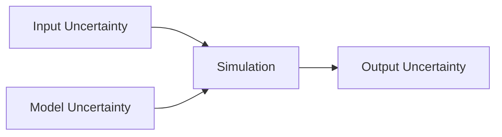

# Uncertainty Quantification

การวัดความไม่แน่นอนใน Multiphase Simulation

---

## Overview

> **UQ** = การประเมินความไม่แน่นอนของผลลัพธ์เนื่องจาก input และ model uncertainties



---

## 1. Sources of Uncertainty

| Type | Source | Example |
|------|--------|---------|
| **Aleatory** | Random variability | Bubble size distribution |
| **Epistemic** | Lack of knowledge | Drag coefficient |
| **Numerical** | Discretization | Mesh, time step |
| **Model** | Physics approximation | Turbulence model |

---

## 2. Grid Convergence Index

$$\text{GCI} = F_s \frac{|\varepsilon|}{r^p - 1}$$

| Variable | Meaning |
|----------|---------|
| $F_s$ | Safety factor (1.25 for 3 grids) |
| $\varepsilon$ | Relative error |
| $r$ | Refinement ratio |
| $p$ | Observed order |

### Target GCI

| Application | GCI |
|-------------|-----|
| Research | < 1% |
| Engineering | < 3% |

---

## 3. Sensitivity Analysis

### One-at-a-Time (OAT)

วัด output เมื่อเปลี่ยน 1 input

### Morris Method

Screening สำหรับหลาย inputs

### Sobol Indices

$$S_i = \frac{V_i}{V_{total}}$$

---

## 4. Error Propagation

$$\delta y = \sqrt{\sum_i \left(\frac{\partial f}{\partial x_i}\right)^2 \delta x_i^2}$$

---

## 5. Monte Carlo

```python
import numpy as np

N = 1000
results = []
for i in range(N):
    d = np.random.normal(0.003, 0.0003)  # ±10% bubble size
    result = run_simulation(d)
    results.append(result)

mean = np.mean(results)
std = np.std(results)
```

---

## 6. Reporting Uncertainty

### Standard Format

$$\bar{x} \pm u_x \quad (95\% \text{ confidence})$$

### Example

$$\alpha_g = 0.15 \pm 0.02 \quad (\text{GCI} < 3\%)$$

---

## Quick Reference

| Method | Use |
|--------|-----|
| GCI | Grid convergence |
| Sensitivity | Important parameters |
| Monte Carlo | Full uncertainty propagation |

---

## Concept Check

<details>
<summary><b>1. Aleatory vs Epistemic ต่างกันอย่างไร?</b></summary>

- **Aleatory**: Natural randomness (ลดไม่ได้)
- **Epistemic**: ความไม่รู้ (ลดได้ด้วยข้อมูลเพิ่ม)
</details>

<details>
<summary><b>2. GCI บอกอะไร?</b></summary>

**Numerical uncertainty** เนื่องจาก mesh — บอกว่าห่างจาก grid-independent solution เท่าไหร่
</details>

<details>
<summary><b>3. ทำไมต้อง report uncertainty?</b></summary>

เพื่อให้ผู้อ่าน **ประเมินความน่าเชื่อถือ** ของผลลัพธ์ — ผลลัพธ์ไม่มี uncertainty ไม่ complete
</details>

---

## Related Documents

- **ภาพรวม:** [00_Overview.md](00_Overview.md)
- **Grid Convergence:** [03_Grid_Convergence.md](03_Grid_Convergence.md)
- **Benchmark Problems:** [02_Benchmark_Problems.md](02_Benchmark_Problems.md)