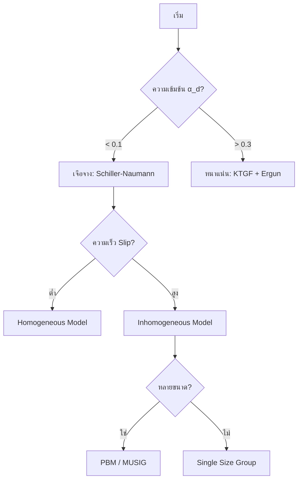

# Multiphase Model Selection Overview

## 1. บทนำ (Introduction)

หัวใจสำคัญของการจำลองการไหลหลายเฟสคือการเลือกแบบจำลอง (Model Selection) ที่เหมาะสมกับระบบทางกายภาพ การเลือกแบบจำลองที่ไม่สอดคล้องกับฟิสิกส์จริงอาจนำไปสู่ผลลัพธ์ที่ผิดพลาดอย่างรุนแรง หรือทำให้การคำนวณไม่ลู่เข้า (Divergence)

---

## 2. พารามิเตอร์หลักในการตัดสินใจ (Key Decision Parameters)

### 2.1 สัดส่วนปริมาตร ($\alpha_d$)
- **เจือจาง (Dilute, $\alpha_d < 0.1$):** ปฏิสัมพันธ์ระหว่างอนุภาคน้อยมาก ใช้โมเดลพื้นฐานได้
- **ปานกลาง ($0.1 < \alpha_d < 0.3$):** ต้องพิจารณา Crowding effects และ Drag ที่ปรับปรุงแล้ว
- **หนาแน่น (Dense, $\alpha_d > 0.3$):** ต้องใช้ Kinetic Theory of Granular Flow (KTGF)

### 2.2 ตัวเลขไร้มิติ (Dimensionless Numbers)
- **Reynolds Number ($Re_p$):** ระบุระบอบการไหลรอบอนุภาค
- **Eötvös Number ($Eo$):** ระบุความสำคัญของแรงลอยตัวเทียบกับแรงตึงผิว (สำหรับการเสียรูปของฟอง)
- **Weber Number ($We$):** ระบุการแตกตัวและรวมตัวของหยดของเหลว

---

## 3. โครงสร้างแบบจำลอง (Model Formulations)

### 3.1 Homogeneous vs. Inhomogeneous
- **Homogeneous:** ทุกเฟสเคลื่อนที่ด้วยความเร็วเดียวกัน (Slip velocity $\approx 0$) คำนวณเร็วมาก
- **Inhomogeneous:** แต่ละเฟสมีความเร็วของตัวเอง (Slip velocity มีนัยสำคัญ) แม่นยำแต่กินทรัพยากรสูง

### 3.2 Population Balance Modeling (PBM)
ใช้เมื่ออนุภาคมีหลายขนาด (Polydisperse) และมีการรวมตัว (Coalescence) หรือแตกตัว (Breakup)

---

## 4. แผนผังการตัดสินใจ (Decision Algorithm)

---

## 5. การตั้งค่าใน OpenFOAM

แบบจำลองหลักจะถูกเลือกใน `constant/phaseProperties` โดยมี Solver ที่รองรับต่างกัน เช่น:
- `multiphaseEulerFoam`: ระบบทั่วไปหลายเฟส
- `reactingTwoPhaseEulerFoam`: ระบบสองเฟสที่มีปฏิกิริยาเคมีและการเปลี่ยนเฟส

การเลือกแบบจำลองควรเริ่มจากโมเดลที่ง่ายที่สุดก่อน แล้วค่อยเพิ่มความซับซ้อนเมื่อจำเป็นตามข้อมูลการตรวจสอบ (Validation)
