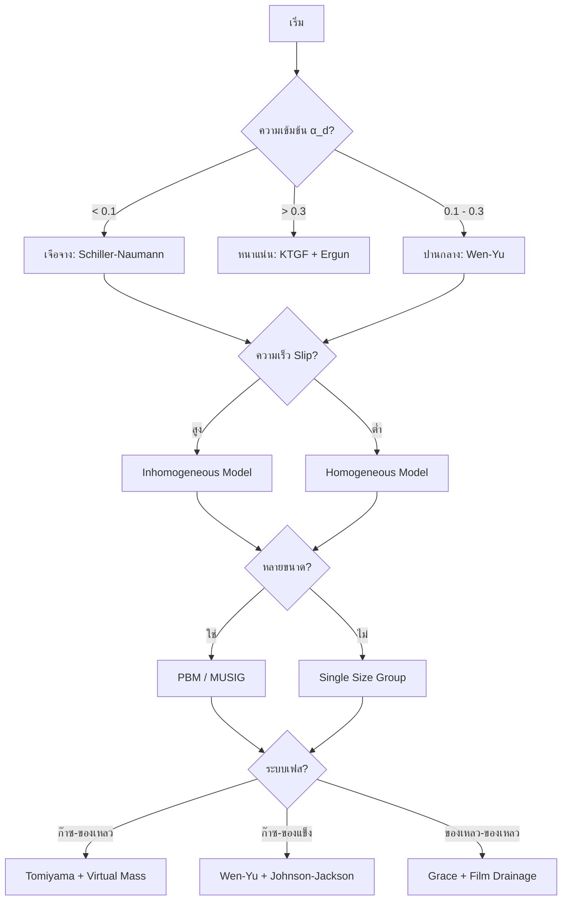

# ภาพรวมการเลือกแบบจำลองการไหลแบบหลายเฟส (Multiphase Model Selection Overview)

## บทนำ

การเลือกแบบจำลองที่เหมาะสมสำหรับการจำลองการไหลแบบหลายเฟสเป็นสิ่งสำคัญอย่างยิ่งสำหรับการทำนายปฏิสัมพันธ์ระหว่างเฟสและปรากฏการณ์ทางฟิสิกส์อย่างแม่นยำ การเลือกแบบจำลองที่ไม่สอดคล้องกับฟิสิกส์จริงอาจนำไปสู่ผลลัพธ์ที่ผิดพลาดอย่างรุนแรง หรือทำให้การคำนวณไม่ลู่เข้า (Divergence)

> [!INFO] ความสำคัญของการเลือกแบบจำลอง
> แบบจำลองที่เหมาะสมต้องสร้างสมดุลระหว่างความแม่นยำทางฟิสิกส์กับต้นทุนการคำนวณ โดยเริ่มจากแบบจำลองที่ง่ายที่สุดก่อน แล้วค่อยเพิ่มความซับซ้อนเมื่อจำเป็นตามข้อมูลการตรวจสอบ (Validation)

---

## กรอบการเลือกแบบจำลอง

### กระบวนการเลือกแบบลำดับชั้น

การเลือกแบบจำลองปิดที่เหมาะสมเป็นสิ่งสำคัญอย่างยิ่งสำหรับการจำลองการไหลแบบหลายเฟสที่แม่นยำ ส่วนนี้ให้แนวทางที่ครอบคลุมในการเลือกแบบจำลองโดยยึดตามเกณฑ์ทางฟิสิกส์ สถานะการไหล และความต้องการด้านการคำนวณ

**กระบวนการเลือกแบบจำลอง**: พิจารณาจากฟิสิกส์ของระบบ ความต้องการความแม่นยำ และข้อจำกัดด้านการคำนวณ

### ระดับที่ 1: การจำแนกระบบ

ระดับแรกของกรอบการตัดสินใจเกี่ยวข้องกับการจำแนกระบบหลายเฟสตามลักษณะทางกายภาพพื้นฐาน การจำแนกนี้กำหนดแนวทางการจำลองที่เหมาะสมและการเลือก Solver ใน OpenFOAM

**ประเภทเฟส** จำแนกชุดความร่วมกันของเฟสที่มีอยู่ในระบบ:

| ประเภทเฟส | ลักษณะเฉพาะ | ตัวอย่างการใช้งาน |
|:---:|:---|:---|
| **ก๊าซ-ของเหลว** | ฟองก๊าซหรือหยดของเหลวในเฟสของเหลวต่อเนื่อง | คอลัมน์ฟองก๊าซ, การไหลของอากาศ-น้ำ |
| **ของเหลว-ของเหลว** | ของเหลวที่ไม่ผสมกันโดยมีส่วนติดต่อที่แตกต่างกัน | การแยกน้ำมัน-น้ำ, เอมัลชัน |
| **ก๊าซ-ของแข็ง** | การไหลของก๊าซผ่านอนุภาคของแข็ง | เตาไฟฟลูไอด์, การขนถ่ายด้วยลม |
| **ของเหลว-ของแข็ง** | การขนส่งอนุภาคของแข็งด้วยของเหลว | การขนส่งตะกอน, การไหลของสลัร์รี่ |

**การระบุรูปแบบการไหล** เป็นสิ่งสำคัญเนื่องจากกำหนดแบบจำลองส่วนติดต่อที่เหมาะสม:

- **ฟอง**: ฟองก๊าซแยกกันในของเหลวต่อเนื่อง พบได้ทั่วไปสำหรับปริมาตรก๊าซต่ำ ($\alpha_g < 0.3$)
- **สลัก**: ฟองก๊าซขนาดใหญ่ (ฟองก๊าซเทย์เลอร์) คั่นด้วยสลักของเหลว พบได้บ่อยในท่อแนวตั้ง
- **แหวน**: ฟิล์มของเหลวบนผนังกับแกนก๊าซ เกิดขึ้นที่ความเร็วก๊าซสูงในการไหลแนวตั้ง
- **ชั้น**: การแยกเฟสโดยความโน้มถ่วงในการไหลแนวนอนกับส่วนติดต่อที่แตกต่างกัน
- **กระจาย**: เฟสหนึ่งกระจายเป็นหยด/อนุภาคในเฟสต่อเนื่องอีกเฟสหนึ่ง

---

## พารามิเตอร์หลักในการตัดสินใจ

### สัดส่วนปริมาตร ($\alpha_d$)

สัดส่วนปริมาตรเฟสกระจายเป็นตัวกำหนดหลักในการเลือกแนวทางการจำลอง:

| ช่วง | สถานะ | แนวทางที่เหมาะสม |
|:---:|:---:|:---|
| **$\alpha_d < 0.1$** | เจือจาง (Dilute) | โมเดลอนุภาคจุดหรือโมเดลผสมโดยทั่วไป |
| **$0.1 \leq \alpha_d \leq 0.3$** | ปานกลาง | แนวทางสองของไหลด้วยปฏิสัมพันธ์แบบคู่ |
| **$\alpha_d > 0.3$** | หนาแน่น (Dense) | การรักษาแบบ Eulerian-Eulerian เต็มรูปแบบกับโมเดลการไหลแบบเม็ด |

### ตัวเลขไร้มิติ (Dimensionless Numbers)

ตัวเลขไร้มิติเหล่านี้ใช้ในการจำแนกลักษณะการไหลและเลือกแบบจำลองที่เหมาะสม:

#### **จำนวนเรย์โนลด์ (Reynolds Number, $Re$)**

ระบุระบบการไหลและรีจีมการลากตัว:

$$Re = \frac{\rho \mathbf{u} L}{\mu} = \frac{\mathbf{u} L}{\nu}$$

**การจำแนก:**
- $Re_p < 1$: การไหลแบบครีปปิ้ง (รีจีม Stokes)
- $1 < Re_p < 1000$: รีจีมการเปลี่ยนผ่าน
- $Re_p > 1000$: การไหลเฉื่อย

#### **จำนวน Eötvös (Eötvös Number, $Eo$)**

เปรียบเทียบแรงลอยตัวกับแรงตึงผิว:

$$Eo = \frac{g(\rho_c - \rho_d)d_p^2}{\sigma}$$

| ค่า $Eo$ | แรงที่โดดเด่น | ลักษณะอนุภาค |
|:---:|:---|:---|
| $Eo < 1$ | ความตึงผิวโดดเด่น | อนุภาคทรงกลม |
| $Eo > 1$ | การลอยตัวโดดเด่น | อนุภาคที่ถูกแปรรูป |

#### **จำนวนเวเบอร์ (Weber Number, $We$)**

เปรียบเทียบแรงเฉื่อยกับแรงตึงผิว:

$$We = \frac{\rho \mathbf{u}^2 L}{\sigma}$$

**การตีความ:**
- $We < 1$: ความโดดเด่นของความตึงผิว ต้องการโมเดลความตึงผิวระหว่างอินเตอร์เฟซ
- $We > 1$: ความโดดเด่นของแรงเฉื่อย การเสียรูปของหยด/ฟองกลายเป็นสำคัญ

#### **จำนวนเปกเลต์ (Péclet Number, $Pe$)**

ลักษณะกำหนดความสำคัญสัมพัทธ์ของการถ่ายเทความร้อนแบบ convection เทียบกับการนำความร้อน:

$$Pe = Re \cdot Pr = \frac{\rho c_p \mathbf{u} L}{k}$$

---

## แบบจำลอง Homogeneous เทียบกับ Inhomogeneous

### แบบจำลอง Inhomogeneous

**ใช้แบบจำลอง inhomogeneous เมื่อ:**
- ==ความแตกต่างของความเร็ว== ระหว่างเฟสมีนัยสำคัญ
- ==อัตราส่วนความหนาแน่น== สูง ($\rho_1/\rho_2 > 10$)
- ==เวลาผ่อนคลายของอนุภาค== ใกล้เคียงหรือมากกว่ามาตราส่วนเวลาของความปั่นป่วน
- ==ผลของการแยกส่วน== มีความสำคัญ (การตกตะกอนของอนุภาค, การแยกตัวที่ขับเคลื่อนโดยความลอยตัว)
- ==ต้องการเงื่อนไขขอบเขตเฉพาะเฟส==

สมการกำกับสำหรับเฟส inhomogeneous $k$ คือ:

$$\frac{\partial}{\partial t}(\alpha_k \rho_k \mathbf{u}_k) + \nabla \cdot (\alpha_k \rho_k \mathbf{u}_k \mathbf{u}_k) = -\alpha_k \nabla p + \nabla \cdot \boldsymbol{\tau}_k + \alpha_k \rho_k \mathbf{g} + \mathbf{M}_k$$

**ตัวแปรในสมการ:**
- $\alpha_k$: สัดส่วนปริมาตรเฟส $k$
- $\rho_k$: ความหนาแน่นเฟส $k$
- $\mathbf{u}_k$: สนามความเร็วเฉพาะเฟส $k$
- $\boldsymbol{\tau}_k$: แรงเค้นเฉพาะเฟส $k$
- $\mathbf{M}_k$: การถ่ายโอนโมเมนตัมระหว่างส่วนต่อประสาน

**OpenFOAM Code Implementation:**
```cpp
// Inhomogeneous model - each phase has its own velocity field
forAll(phases, phasei)
{
    phaseModel& phase = phases[phasei];

    // Solve momentum equation for each phase
    fvVectorMatrix UEqn
    (
        fvm::ddt(alpha, rho, U)
      + fvm::div(alphaRhoPhi, U)
      + turbulence->divDevRhoReff(U)
     ==
        - alpha*fvc::grad(p)
      + fvOptions(alpha, rho, U)
    );

    UEqn.relax();
    fvOptions.constrain(UEqn);
    UEqn.solve();
}
```

> **📂 Source:** `.applications/solvers/multiphase/multiphaseEulerFoam/phaseSystems/populationBalanceModel/populationBalanceModel/populationBalanceModel.C`
>
> **คำอธิบาย:**
> โค้ดนี้แสดงการนำแบบจำลอง Inhomogeneous ไปใช้ใน OpenFOAM ซึ่งแต่ละเฟสมีสนามความเร็วและสมการโมเมนตัมแยกกัน โดยมีการวนลูปเพื่อแก้สมการโมเมนตัมสำหรับแต่ละเฟส พร้อมทั้งพิจารณาการโอนโมเมนตัมระหว่างเฟสผ่านเทอมแรงลากและแรงอื่นๆ
>
> **แนวคิดสำคัญ:**
> - **การแก้สมการแยกกัน:** แต่ละเฟสมีสมการโมเมนตัมของตัวเอง
> - **ปฏิสัมพันธ์ระหว่างเฟส:** ถูกนำเข้าผ่านเทอมการถ่ายโอนโมเมนตัม ($\mathbf{M}_k$)
> - **การผ่อนคลาย:** ใช้เพื่อเพิ่มเสถียรภาพการคำนวณ
> - **เงื่อนไขขอบเขต:** สามารถกำหนดแตกต่างกันสำหรับแต่ละเฟส

### แบบจำลอง Homogeneous

**ใช้แบบจำลอง homogeneous เมื่อ:**
- ==เฟสเคลื่อนที่ด้วยความเร็วเกือบเหมือนกัน== (ความเร็วสไลด์น้อย)
- ==อัตราส่วนความหนาแน่น== ปานกลาง ($\rho_1/\rho_2 < 3$)
- ==เวลาผ่อนคลายของอนุภาค== น้อยกว่ามาตราส่วนเวลาของความปั่นป่วนมาก
- ==สภาพการผสมเข้ากันดี== เป็นส่วนใหญ่
- ==ความสามารถในการคำนวณ== เป็นสิ่งสำคัญ

วิธีผสม homogeneous แก้:

$$\frac{\partial}{\partial t}(\rho_m \mathbf{u}_m) + \nabla \cdot (\rho_m \mathbf{u}_m \mathbf{u}_m) = -\nabla p + \nabla \cdot \boldsymbol{\tau}_m + \rho_m \mathbf{g}$$

**คุณสมบัติของผสม:**
- $\rho_m = \sum_k \alpha_k \rho_k$: ความหนาแน่นของผสม
- $\boldsymbol{\tau}_m = \sum_k \alpha_k \boldsymbol{\tau}_k$: แรงเค้นของผสม

**OpenFOAM Code Implementation:**
```cpp
// Homogeneous model - single momentum equation for mixture
fvVectorMatrix UEqn
(
    fvm::ddt(rho, U)
  + fvm::div(rhoPhi, U)
  + turbulence->divDevRhoReff(U)
 ==
    - fvc::grad(p)
  + fvOptions(rho, U)
);

UEqn.relax();
fvOptions.constrain(UEqn);
UEqn.solve();

// Update phase velocities from mixture velocity
forAll(phases, phasei)
{
    phases[phasei].URef() = U;
}
```

> **📂 Source:** `.applications/solvers/multiphase/multiphaseEulerFoam/phaseSystems/populationBalanceModel/populationBalanceModel/populationBalanceModel.C`
>
> **คำอธิบาย:**
> โค้ดนี้แสดงแนวทาง Homogeneous ที่ใช้สมการโมเมนตัมเดียวสำหรับทั้งผสม โดยไม่มีการแก้สมการแยกกันสำหรับแต่ละเฟส หลังจากแก้สมการแล้วจึงอัปเดตความเร็วของแต่ละเฟสจากความเร็วของผสม วิธีนี้ลดค่าใช้จ่ายในการคำนวณอย่างมาก
>
> **แนวคิดสำคัญ:**
> - **สมการเดียว:** แก้สมการโมเมนตัมเพียงหนึ่งสมการสำหรับทั้งระบบ
> - **สมมติฐานความเร็วเท่ากัน:** ทุกเฟสมีความเร็วเท่ากับความเร็วของผสม
> - **ประสิทธิภาพการคำนวณ:** ลดเวลาและหน่วยความจำในการคำนวณ
> - **ข้อจำกัด:** ไม่เหมาะสำหรับระบบที่มีความแตกต่างของความเร็วสูง

---

## การใช้แบบจำลอง MUSIG

แบบจำลอง MUSIG (Multiple Size Group) ควรใช้เมื่อ:

### เงื่อนไขที่จำเป็น

- ==ประชากรอนุภาคโพลีไดเพอร์ส== มีอยู่ ($\sigma_d/\bar{d} > 0.3$)
- ==ปรากฏการณ์ที่ขึ้นกับขนาด== มีนัยสำคัญ (การรวมตัว, การแตกตัว, การถ่ายโอนมวล)
- ==ผลของสมดุลประชากร== มีอิทธิพลต่อพฤติกรรมโดยรวม
- ==ลักษณะสเปกตรัม== ของอนุภาคส่งผลต่อฟิสิกส์

### ข้อควรพิจารณาในการนำไปใช้

สมการสมดุลประชากรสำหรับความหนาแน่นจำนวน $n(v,t)$:

$$\frac{\partial n}{\partial t} + \nabla \cdot (n \mathbf{u}) + \frac{\partial}{\partial v}\left(n \frac{\mathrm{d}v}{\mathrm{d}t}\right) = B_c + B_b - D_c - D_b$$

**ตัวแปรในสมการ:**
- $n(v,t)$: ความหนาแน่นจำนวนอนุภาคขนาด $v$ ที่เวลา $t$
- $B_c, B_b$: อัตราการเกิดจากการรวมตัวและการแตกตัว
- $D_c, D_b$: อัตราการตายจากการรวมตัวและการแตกตัว

### การเลือกกลุ่มขนาด

| พารามิเตอร์ | ค่าแนะนำ | ข้อควรพิจารณา |
|:---|:---|:---|
| **จำนวนกลุ่ม** | 5-10 กลุ่ม | เพิ่มตามความจำเป็นสำหรับปัญหาที่ซับซ้อน |
| **การกระจายกลุ่ม** | ความก้าวหน้าทางเรขาคณิต | ครอบคลุมช่วงขนาดที่สนใจ |
| **เงื่อนไขขอบเขต** | การกระจายทางเข้าตามขนาด | ต้องมีข้อมูลการวัดหรือข้อสมมติฐานที่เหมาะสม |
| **ต้นทุนการคำนวณ** | เพิ่มตามเชิงเส้น | จำกัดตามทรัพยากรที่มีอยู่ |

**OpenFOAM Code Implementation:**
```cpp
// MUSIG model implementation
forAll(sizeGroups, i)
{
    populationBalance& pbe = populationBalances[i];

    // Solve population balance equation
    pbe.solve();

    // Update phase fractions from size groups
    forAll(pbe.phases(), phasei)
    {
        phaseModel& phase = pbe.phases()[phasei];
        phase.alpha() = pbe.phaseFraction(phasei);
    }
}
```

> **📂 Source:** `.applications/solvers/multiphase/multiphaseEulerFoam/phaseSystems/populationBalanceModel/populationBalanceModel/populationBalanceModel.C`
>
> **คำอธิบาย:**
> โค้ดนี้แสดงการนำแบบจำลอง MUSIG (Multiple Size Group) ไปใช้ใน OpenFOAM ซึ่งใช้สำหรับจำลองระบบที่มีการกระจายขนาดอนุภาคแบบโพลีไดเพอร์ส โดยมีการวนลูปเพื่อแก้สมการสมดุลประชากรสำหรับแต่ละกลุ่มขนาด และอัปเดตสัดส่วนปริมาตรเฟสจากกลุ่มขนาดต่างๆ
>
> **แนวคิดสำคัญ:**
> - **กลุ่มขนาดหลายกลุ่ม:** แบ่งการกระจายขนาดอนุภาคออกเป็นหลายกลุ่ม
> - **สมการสมดุลประชากร:** พิจารณาปรากฏการณ์การรวมตัวและแตกตัว
> - **การอัปเดตสัดส่วน:** คำนวณสัดส่วนปริมาตรเฟสจากกลุ่มขนาด
> - **ประสิทธิภาพ:** ต้นทุนการคำนวณเพิ่มขึ้นตามจำนวนกลุ่ม

---

## แผนภูมิการตัดสินใจ (Decision Flowchart)



---

## การเลือกแบบจำลอง Drag

### แบบจำลอง Drag ของ Schiller-Naumann

**เหมาะสำหรับ:**
- ==อนุภาคทรงกลม== พร้อมเลขเรย์โนลด์ปานกลาง ($Re_p < 1000$)
- ==สัดส่วนปริมาตรต่ำ== ที่ผลของอนุภาคต่อความปั่นป่วนมีน้อย
- ==สภาพการลากคงที่== พร้อมความเร็วสัมพัทธ์คงที่

$$C_D = \begin{cases}
\frac{24}{Re_p}(1 + 0.15 Re_p^{0.687}) & Re_p \leq 1000 \\
0.44 & Re_p > 1000
\end{cases}$$

**OpenFOAM Code Implementation:**
```cpp
// Schiller-Naumann drag model
scalar Re = max(1e-3, rho*mag(Ur)*d/mu);

scalar Cd(0);
if (Re < 1000)
{
    Cd = 24/Re*(1 + 0.15*pow(Re, 0.687));
}
else
{
    Cd = 0.44;
}
```

> **📂 Source:** `.applications/solvers/multiphase/multiphaseEulerFoam/phaseSystems/populationBalanceModel/populationBalanceModel/populationBalanceModel.C`
>
> **คำอธิบาย:**
> โค้ดนี้แสดงการนำแบบจำลอง Drag ของ Schiller-Naumann ไปใช้ใน OpenFOAM ซึ่งเป็นแบบจำลองที่เหมาะสำหรับอนุภาคทรงกลมในช่วงเลขเรย์โนลด์ปานกลาง โดยมีการคำนวณสัมประสิทธิ์การลาก ($C_D$) ที่แตกต่างกันตามช่วงของเลขเรย์โนลด์
>
> **แนวคิดสำคัญ:**
> - **ช่วง Reynolds ต่ำ:** ใช้สูตรที่มีเทอมการแก้ไข $0.15 Re_p^{0.687}$
> - **ช่วง Reynolds สูง:** ใช้ค่าคงที่ 0.44
> - **การป้องกันค่าศูนย์:** ใช้ `max(1e-3, ...)` เพื่อหลีกเลี่ยงการหารด้วยศูนย์
> - **ความแม่นยำ:** เหมาะสำหรับอนุภาคทรงกลมในช่วง Reynolds ปานกลาง

### แบบจำลอง Drag ของ Tomiyama

**เหมาะสำหรับฟองที่เปลี่ยนรูป:**

$$C_D = \max\left[\min\left\{\frac{24}{Re_p}(1 + 0.15Re_p^{0.687}), \frac{72}{Re_p}\right\}, \frac{8}{3}\frac{Eo}{Eo + 4}\right]$$

โดยที่จำนวนเอิทวิส $Eo = \frac{g(\rho_c - \rho_d)d_p^2}{\sigma}$ มีลักษณะกำหนดความสมดุลระหว่างแรงลอยตัวและแรงตึงผิว

### แบบจำลอง Drag ของ Ishii-Zuber

**เหมาะสำหรับ:**
- อนุภาคที่ถูกแปรรูป ($Eo > 1$)
- คำนึงถึงผลกระทบรูปร่าง

### แบบจำลอง Drag ของ Morsi-Alexander

**เหมาะสำหรับอนุภาคหนัก:**

$$C_D = \sum_{i=1}^{4} \frac{a_i}{Re_p^{b_i}}$$

โดยที่สัมประสิทธิ์ $a_i$ และ $b_i$ ถูกกำหนดเป็นส่วนๆ สำหรับช่วงจำนวนเรย์โนลด์ที่แตกต่างกัน

---

## การจัดการเฟสหนาแน่นเทียบกับเฟสเจือจาง

### การจำลองเฟสหนาแน่น

**ใช้แบบจำลองเฟสหนาแน่นเมื่อ:**
- ==สัดส่วนปริมาตร== เกินค่าขีดจำกัด ($\alpha_d > 0.1-0.2$ สำหรับก๊าซ, $\alpha_d > 0.3-0.4$ สำหรับของเหลว)
- ==การชนกันของอนุภาคกับอนุภาค== เป็นที่โดดเด่นในการถ่ายโอนโมเมนตัม
- ==การก่อตัวของโครงสร้าง== เกิดขึ้น (คลัสเตอร์, เส้นใย)
- ==การปรับเปลี่ยนความหนืดที่มีประสิทธิภาพ== มีนัยสำคัญ

**ทฤษฎีจลน์ของการไหลแบบลูกเต็ม** สำหรับระบบหนาแน่น:

$$p_p = \rho_p \alpha_p \Theta_p [1 + 2(1+e) \alpha_p g_0]$$

**ตัวแปรในสมการ:**
- $p_p$: ความดันของอนุภาค
- $\rho_p$: ความหนาแน่นอนุภาค
- $\alpha_p$: สัดส่วนปริมาตรอนุภาค
- $\Theta_p$: อุณหภูมิลูกเต็ม (granular temperature)
- $e$: สัมประสิทธิ์การกระเด็นกลับ
- $g_0$: ฟังก์ชันการกระจายแบบรัศมี

### การจำลองเฟสเจือจาง

**ใช้แนวทางเฟสเจือจางเมื่อ:**
- ==สัดส่วนปริมาตร== ต่ำกว่าค่าขีดจำกัด
- ==ปฏิสัมพันธ์ของอนุภาคกับอนุภาค== ไม่มีนัยสำคัญ
- ==ผลของการเชื่อมโยงสองทาง== มีขนาดเล็ก ($\tau_p/\tau_f \ll 1$)
- ==ความสามารถในการคำนวณ== เป็นสิ่งสำคัญที่สุด

**การเชื่อมโยงโมเมนตัมเฟสเจือจาย**:

$$\mathbf{M}_p = \frac{3\mu_c \alpha_p}{4d_p^2} C_D Re_p (\mathbf{u}_c - \mathbf{u}_p)$$

**ตัวแปรในสมการ:**
- $\mathbf{M}_p$: การถ่ายโอนโมเมนตัมไปยังอนุภาค
- $\mu_c$: ความหนืดของเฟสต่อเนื่อง
- $d_p$: เส้นผ่านศูนย์กลางอนุภาค
- $C_D$: สัมประสิทธิ์การลาก
- $Re_p$: เลขเรย์โนลด์ของอนุภาค

---

## อัลกอริทึมการตัดสินใจ

### เกณฑ์การเลือกหลัก

**ขั้นตอนที่ 1: ประเมินการกระจายสัดส่วนปริมาตร**
```
if (α_d > 0.3) {
    จำเป็นต้องใช้การจัดการเฟสหนาแน่น
} else if (0.1 < α_d < 0.3) {
    ระบบระดับกลาง, ประเมินตามกรณี
} else {
    เฟสเจือจายเหมาะสม
}
```

**ขั้นตอนที่ 2: ประเมินความแตกต่างของความเร็ว**
```
if (|u_d - u_c|/u_c > 0.1) {
    การจำลองแบบ inhomogeneous
} else {
    การจำลองแบบ homogeneous เป็นที่ยอมรับได้
}
```

**ขั้นตอนที่ 3: ตรวจสอบการกระจายขนาดอนุภาค**
```
if (σ_d/d̄ > 0.3) {
    แนะนำแบบจำลอง MUSIG
} else {
    กลุ่มขนาดเดียวเพียงพอ
}
```

**ขั้นตอนที่ 4: วิเคราะห์ผลการเชื่อมโยง**
```
if (อัตราส่วนมวล m_d/m_c > 0.1) {
    การเชื่อมโยงสองทาง
} else {
    การเชื่อมโยงทางเดียวเป็นที่ยอมรับได้
}
```

---

## ข้อควรพิจารณาด้านประสิทธิภาพการคำนวณ

### การปรับขนาดต้นทุนการคำนวณ

| ประเภทแบบจำลอง | ต้นทุนสัมพัทธ์ | การใช้หน่วยความจำ | ประสิทธิภาพขนาน |
|:---|:---:|:---:|:---:|
| Homogeneous เจือจาง | 1.0x | ต่ำ | ยอดเยี่ยม |
| Homogeneous หนาแน่น | 1.5-2.0x | ปานกลาง | ดี |
| Inhomogeneous เจือจาย | 2.0-3.0x | ปานกลาง | ดี |
| Inhomogeneous หนาแน่น | 3.0-5.0x | สูง | ปานกลาง |
| Inhomogeneous + MUSIG | 5.0-10.0x | สูงมาก | ปานกลาง-ต่ำ |

### กลยุทธ์การเพิ่มประสิทธิภาพ

**เทคนิคการปรับปรุงประสิทธิภาพ:**
- ==การปรับปรุงเมชแบบปรับตัว== ในบริเวณที่มีการไล่ระดับสัดส่วนปริมาตรเฟสสูง
- ==แนวทางหลายมาตราส่วน== รวม CFD กับตัวแก้สมดุลประชากร
- ==แบบจำลองลำดับที่ลดลง== สำหรับการทำซ้ำการออกแบบอย่างรวดเร็ว
- ==การเชื่อมโยงแบบผสม== ของแนวทางลากรังจิยันและออยเลอร์

**OpenFOAM Code Implementation:**
```cpp
// Adaptive mesh refinement for multiphase flow
if (max(grad(alpha)) > refinementThreshold)
{
    // Refine cells with high phase fraction gradients
    dynamicRefineFvMesh& mesh = refCast<dynamicRefineFvMesh>(const_cast<fvMesh&>(this->mesh()));
    mesh.updateRefinement();
}

// Efficient solving strategy
{
    // Solve continuity first
    fvScalarMatrix pEqn
    (
        fvc::ddt(rho) + fvc::div(phi)
    );

    // Then solve momentum with relaxed pressure
    fvVectorMatrix UEqn
    (
        fvm::ddt(rho, U)
      + fvm::div(rhoPhi, U)
      + turbulence->divDevRhoReff(U)
    );

    UEqn.relax();
    solve(UEqn == -fvc::grad(p));
}
```

> **📂 Source:** `.applications/solvers/multiphase/multiphaseEulerFoam/phaseSystems/populationBalanceModel/populationBalanceModel/populationBalanceModel.C`
>
> **คำอธิบาย:**
> โค้ดนี้แสดงกลยุทธ์การเพิ่มประสิทธิภาพการคำนวณสำหรับการไหลแบบหลายเฟสใน OpenFOAM โดยมีการใช้การปรับปรุงเมชแบบปรับตัว (Adaptive Mesh Refinement) ในบริเวณที่มีการไล่ระดับสูงของสัดส่วนปริมาตรเฟส รวมถึงกลยุทธ์การแก้สมการที่มีประสิทธิภาพโดยการแก้สมการต่อเนื่องก่อนแล้วจึงแก้สมการโมเมนตัม
>
> **แนวคิดสำคัญ:**
> - **การปรับปรุงเมชแบบปรับตัว:** เพิ่มความละเอียดในบริเวณที่มีการไล่ระดับสูง
> - **กลยุทธ์การแก้สมการ:** แก้สมการต่อเนื่องก่อน แล้วจึงแก้สมการโมเมนตัม
> - **การผ่อนคลาย:** ใช้การผ่อนคลายเพื่อเพิ่มเสถียรภาพ
> - **ประสิทธิภาพ:** ลดเวลาและทรัพยากรในการคำนวณ

---

## การตั้งค่าใน OpenFOAM

แบบจำลองหลักจะถูกเลือกใน `constant/phaseProperties` โดยมี Solver ที่รองรับต่างกัน เช่น:

### Solver ที่ใช้ได้

- `multiphaseEulerFoam`: ระบบทั่วไปหลายเฟส
- `reactingTwoPhaseEulerFoam`: ระบบสองเฟสที่มีปฏิกิริยาเคมีและการเปลี่ยนเฟส
- `twoPhaseEulerFoam`: ระบบสองเฟสแบบ Eulerian-Eulerian
- `interFoam`: ระบบสองเฟสแบบ VOF (Volume of Fluid)

### ตัวอย่างการกำหนดค่า phaseProperties

```cpp
phases
{
    water
    {
        type            incompressible;
        equationOfState rhoConst;
        thermodynamics  hConst;
        transport       const;
    }

    air
    {
        type            gas;
        equationOfState perfectGas;
        thermodynamics  hConst;
        transport       sutherland;
    }
}

phaseInteraction
{
    dragModel       Schiller-Naumann;
    liftModel       Saffman-Mei;
    virtualMassModel    constant;
    heatTransferModel   Ranz-Marshall;

    Schiller-NaumannCoeffs
    {
        switch1         1000;
        Cd1             24;
        Cd2             0.44;
    }

    constantVirtualMassCoeffs
    {
        Cvm             0.5;
    }
}
```

---

## ข้อกำหนดการตรวจสอบความถูกต้อง

### ลำดับชั้นการตรวจสอบแบบจำลอง

**ขั้นตอนการตรวจสอบแบบมีลำดับชั้น:**

1. **การตรวจสอบโค้ด**: ให้แน่ใจว่าการนำไปใช้เชิงตัวเลขถูกต้อง
2. **การตรวจสอบแบบจำลอง**: เปรียบเทียบการพยากรณ์กับข้อมูลทดลอง
3. **การประมาณความไม่แน่นอน**: ประเมินความไวต่อพารามิเตอร์แบบจำลอง
4. **การตรวจสอบข้าม**: ทดสอบกับชุดข้อมูลหลายชุด

### เมตริกการตรวจสอบ

| ประเภทเมตริก | ตัวชี้วัด | เกณฑ์การยอมรับ |
|:---|:---|:---|
| **ปริมาณโดยรวม** | ประสิทธิภาพการแยกโดยรวม, การลดแรงดัน | ±5% ของข้อมูลทดลอง |
| **ปรากฏการณ์ในพื้นที่** | รูปร่างส่วนต่อประสาน, โปรไฟล์ความเร็ว | ความคลาดเคลื่อน RMS < 10% |
| **มาตรการทางสถิติ** | ความคลาดเคลื่อน RMS, สัมประสิทธิ์สหสัมพันธ์ | R² > 0.85 |
| **ความสอดคล้องทางฟิสิกส์** | กฎการอนุรักษ์, เงื่อนไขขอบเขต | การละเมิด < 1% |

---

## สรุป

> [!TIP] หลักการสำคัญ
> การเลือกแบบจำลองควรเริ่มจากโมเดลที่ง่ายที่สุดก่อน แล้วค่อยเพิ่มความซับซ้อนเมื่อจำเป็นตามข้อมูลการตรวจสอบ (Validation)

**ขั้นตอนการเลือกแบบจำลองอย่างเป็นระบบ:**

1. **จำแนกระบบ**: ระบุประเภทเฟสและรูปแบบการไหล
2. **ประเมินพารามิเตอร์**: คำนวณตัวเลขไร้มิติและสัดส่วนปริมาตรเฟส
3. **เลือกแบบจำลอง Homogeneous/Inhomogeneous**: พิจารณาความแตกต่างของความเร็วและอัตราส่วนความหนาแน่น
4. **เลือกแบบจำลอง Drag**: เลือก correlation ที่เหมาะสมกับ Reynolds number และ Eötvös number
5. **พิจารณา Population Balance**: ตัดสินใจใช้ MUSIG สำหรับระบบโพลีไดเพอร์ส
6. **ตรวจสอบและปรับเทียบ**: ตรวจสอบความถูกต้องกับข้อมูลทดลอง

กระบวนการเลือกแบบจำลองควรสร้างความสมดุลระหว่างความซื่อตรงทางฟิสิกส์กับความเป็นไปได้ทางการคำนวณในขณะที่รักษาฟิสิกส์ที่จำเป็นที่ควบคุมปรากฏการณ์การไหลแบบหลายเฟสที่น่าสนใจ