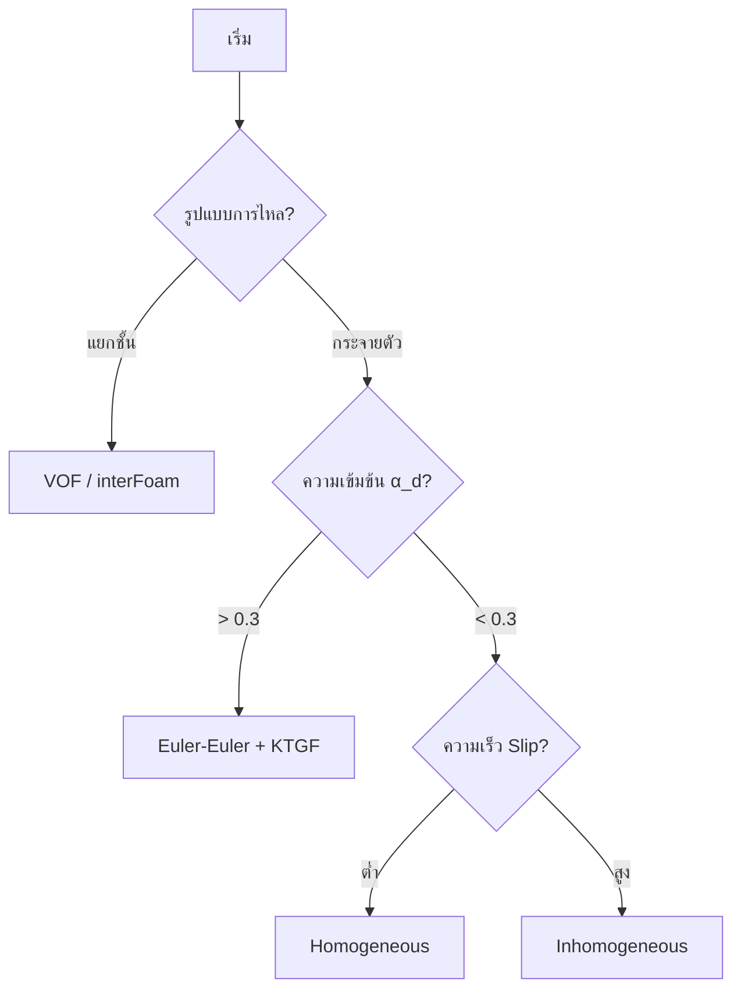

# กรอบการตัดสินใจเลือกแบบจำลอง (Model Selection Decision Framework)

## 1. บทนำ (Introduction)

การจำลองการไหลหลายเฟสใน OpenFOAM มีความซับซ้อนเนื่องจากมีโมเดลให้เลือกจำนวนมาก กรอบการตัดสินใจนี้ช่วยให้นักวิจัยและวิศวกรสามารถเลือกแบบจำลองย่อย (Sub-models) ได้อย่างเป็นระบบตามหลักฟิสิกส์

---

## 2. กระบวนการตัดสินใจแบบลำดับชั้น (Hierarchical Process)

### ระดับที่ 1: การจำแนกระบบ (System Classification)
พิจารณาประเภทของเฟสและรูปแบบการไหลหลัก:
- **เฟส (Phase Types):** Gas-Liquid, Liquid-Solid, Gas-Solid?
- **รูปแบบ (Flow Regimes):** Dispersed (กระจาย) หรือ Separated (แยกชั้น)?
  - หากแยกชั้นชัดเจน: เลือก **VOF (`interFoam`)**
  - หากกระจายตัว: เลือก **Euler-Euler (`multiphaseEulerFoam`)**

### ระดับที่ 2: การประเมินพารามิเตอร์ทางกายภาพ (Physical Assessment)
ใช้ตัวเลขไร้มิติเพื่อระบุกลไกที่โดดเด่น:
- **Particle Reynolds ($Re_p$):** กำหนดระบอบแรงฉุด (Stokes, Transition, หรือ Newton)
- **Eötvös Number ($Eo$):** ประเมินการเสียรูปของฟองอากาศ
- **Volume Fraction ($\alpha_d$):**
  - $\alpha_d < 0.1$: ระบบเจือจาง (Dilute)
  - $\alpha_d > 0.3$: ระบบหนาแน่น (Dense) - ต้องใช้ **KTGF**

### ระดับที่ 3: การเลือกแบบจำลองย่อย (Sub-model Selection)

| ปรากฏการณ์ | เกณฑ์การตัดสินใจ | โมเดลแนะนำ |
|-----------|-----------------|-----------|
| **Drag** | ทรงกลม / $Re_p < 1000$ | Schiller-Naumann |
| **Drag** | ฟองอากาศเสียรูป / $Eo > 1$ | Ishii-Zuber |
| **Lift** | ฟองอากาศในท่อ | Tomiyama |
| **Dispersion** | ระบบที่มีความปั่นป่วนสูง | Burns |
| **Heat Transfer** | ทั่วไป | Ranz-Marshall |

---

## 3. อัลกอริทึมการตัดสินใจ (Decision Algorithm)



---

## 4. การนำไปใช้ใน OpenFOAM

การเลือกทั้งหมดจะถูกระบุในไฟล์ `constant/phaseProperties`:

```openfoam
phaseInteraction
{
    dragModel       SchillerNaumann;
    liftModel       Tomiyama;
    virtualMassModel constant;
    turbulentDispersionModel Burns;
}
```

**คำแนะนำ:** ควรเริ่มจากแบบจำลองที่ง่ายที่สุด (เช่น Schiller-Naumann Drag และ No Lift) เพื่อตรวจสอบเสถียรภาพเบื้องต้นก่อนเพิ่มความซับซ้อน
