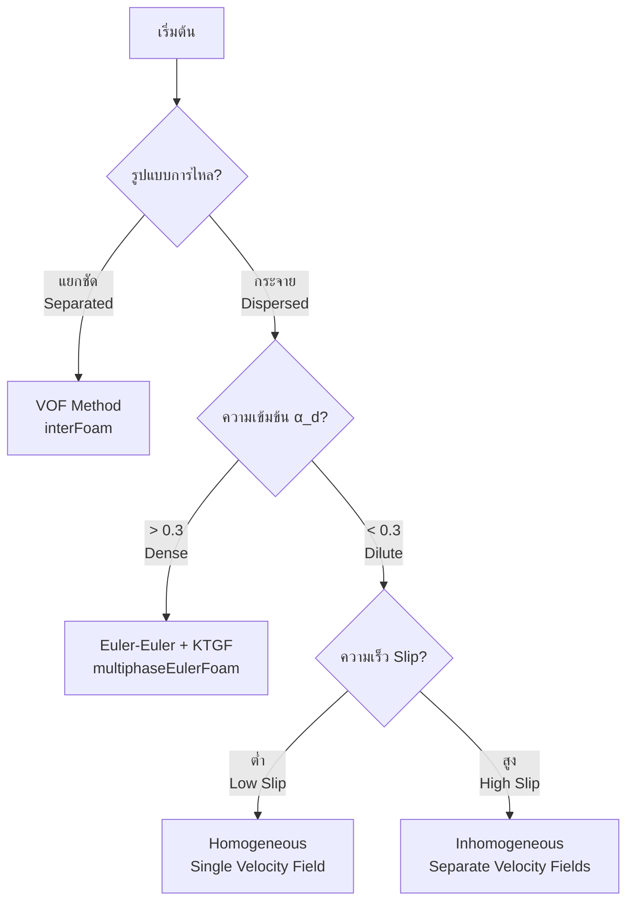
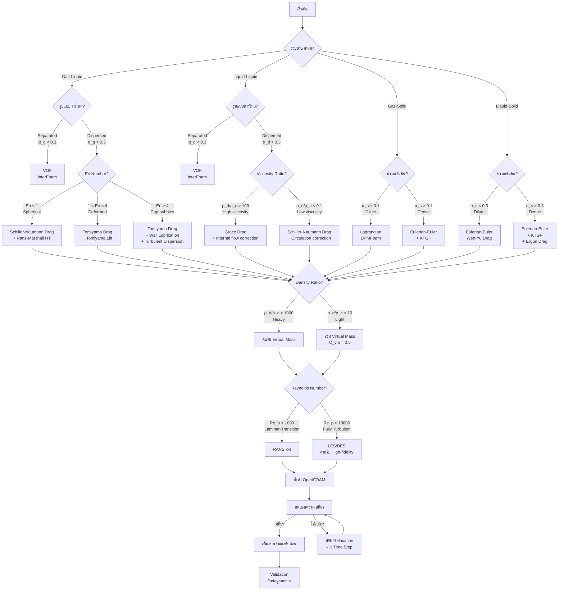

# กรอบการตัดสินใจเลือกแบบจำลอง (Model Selection Decision Framework)

## 1. บทนำ (Introduction)

การจำลองการไหลหลายเฟสใน OpenFOAM มีความซับซ้อนเนื่องจากมีโมเดลให้เลือกจำนวนมาก กรอบการตัดสินใจนี้ช่วยให้นักวิจัยและวิศวกรสามารถเลือกแบบจำลองย่อย (Sub-models) ได้อย่างเป็นระบบตามหลักฟิสิกส์

> [!INFO] ความสำคัญของการเลือกโมเดลที่เหมาะสม
> การเลือกแบบจำลองที่เหมาะสมเป็นสิ่งสำคัญอย่างยิ่งสำหรับการทำนายปฏิสัมพันธ์ระหว่างเฟสและปรากฏการณ์ทางฟิสิกส์อย่างแม่นยำ การเลือกที่ผิดพลาดอาจนำไปสู่ผลลัพธ์ที่คลาดเคลื่อนอย่างมากหรือปัญหาความไม่เสถียรทางตัวเลข

---

## 2. กระบวนการตัดสินใจแบบลำดับชั้น (Hierarchical Process)

### ระดับที่ 1: การจำแนกระบบ (System Classification)

ระดับแรกของกรอบการตัดสินใจเกี่ยวข้องกับการจำแนกระบบหลายเฟสตามลักษณะทางกายภาพพื้นฐาน การจำแนกนี้กำหนดแนวทางการจำลองที่เหมาะสมและการเลือก Solver ใน OpenFOAM

#### **ประเภทเฟส (Phase Types)**

| ประเภทเฟส | ลักษณะเฉพาะ | ตัวอย่างการใช้งาน | Solver แนะนำ |
|-------------|----------------|-------------------|--------------|
| **ก๊าซ-ของเหลว** | ฟองก๊าซหรือหยดของเหลวในเฟสของเหลวต่อเนื่อง | คอลัมน์ฟองก๊าซ, การไหลของอากาศ-น้ำ | `multiphaseEulerFoam`, `interFoam` |
| **ของเหลว-ของเหลว** | ของเหลวที่ไม่ผสมกันโดยมีส่วนติดต่อที่แตกต่างกัน | การแยกน้ำมัน-น้ำ, เอมัลชัน | `interFoam`, `multiphaseInterFoam` |
| **ก๊าซ-ของแข็ง** | การไหลของก๊าซผ่านอนุภาคของแข็ง | เตาไฟฟลูไอด์, การขนถ่ายด้วยลม | `multiphaseEulerFoam`, `coalChemistryFoam` |
| **ของเหลว-ของแข็ง** | การขนส่งอนุภาคของแข็งด้วยของเหลว | การขนส่งตะกอน, การไหลของสลัร์รี่ | `multiphaseEulerFoam`, `twoPhaseEulerFoam` |

#### **รูปแบบการไหล (Flow Regimes)**

- **แยกชัด (Separated Flow)**: รูปแบบการไหลที่เฟสแยกจากกันอย่างชัดเจน เช่น การไหลแบบชั้น (stratified flow)
  - เลือก **VOF (`interFoam`)**
  - เหมาะสำหรับ: `α_d < 0.3` และอินเตอร์เฟสที่ชัดเจน

- **กระจาย (Dispersed Flow)**: รูปแบบการไหลที่เฟสหนึ่งกระจายเป็นฟอง/หยด/อนุภาคในเฟสต่อเนื่องอีกเฟสหนึ่ง
  - เลือก **Euler-Euler (`multiphaseEulerFoam`)**
  - เหมาะสำหรับ: ระบบที่มีส่วนปริมาตรเฟสกระจายสูง



---

### ระดับที่ 2: การประเมินพารามิเตอร์ทางกายภาพ (Physical Assessment)

ใช้ตัวเลขไร้มิติเพื่อระบุกลไกที่โดดเด่นและเลือกแบบจำลองย่อยที่เหมาะสม

#### **อัตราส่วนคุณสมบัติ (Property Ratios)**

**อัตราส่วนความหนาแน่น** ($\rho_d/\rho_c$):
$$\frac{\rho_d}{\rho_c} = \text{Density Ratio}$$

| ช่วงค่า | ลักษณะเฉพณะ | แรงที่โดดเด่น | คำแนะนำ |
|----------|--------------|----------------|-----------|
| **> 1000** | อนุภาคหนัก (Heavy Particles) | แรงเฉื่อย, แรงโน้มถ่วง | ละเลย Virtual Mass |
| **< 10** | อนุภาคเบา (Light Particles) | แรงลอยตัว, Virtual Mass | จำเป็นต้องรวม Virtual Mass |

**อัตราส่วนความหนืด** ($\mu_d/\mu_c$):
$$\frac{\mu_d}{\mu_c} = \text{Viscosity Ratio}$$

| ช่วงค่า | ลักษณะเฉพณะ | ผลต่อการไหลเวียนภายใน | คำแนะนำ |
|----------|--------------|---------------------|-----------|
| **> 100** | เฟสกระจายหนืดมาก | การไหลเวียนภายในถูกยับยั้ง | ใช้แบบจำลอง Grace Drag |
| **< 0.1** | เฟสกระจายหนืดต่ำ | การไหลเวียนภายในแข็งแกร่ง | ใช้แบบจำลอง Schiller-Naumann ดัดแปลง |

#### **ตัวเลขไร้มิติสำคัญ (Critical Dimensionless Numbers)**

**Particle Reynolds Number** ($Re_p$):
$$Re_p = \frac{\rho_c u_{rel} d_p}{\mu_c}$$

| ช่วง $Re_p$ | ลักษณะการไหล | รีจีม | แบบจำลอง Drag แนะนำ |
|-------------|----------------|---------|---------------------|
| $Re_p < 1$ | การไหลครีปปิ้ง | รีจีมสโตกส์ | Stokes: $C_D = \frac{24}{Re_p}$ |
| $1 < Re_p < 1000$ | การเปลี่ยนผ่าน | รีจีมการเปลี่ยนผ่าน | Schiller-Naumann |
| $Re_p > 1000$ | การไหลเฉื่อย | รีจีมเฉื่อย | Newton: $C_D = 0.44$ |

**Eötvös Number** ($Eo$):
$$Eo = \frac{g(\rho_c - \rho_d)d_p^2}{\sigma}$$

| ค่า $Eo$ | แรงที่โดดเด่น | ลักษณะอนุภาค | แบบจำลองแนะนำ |
|----------|----------------|----------------|------------------|
| $Eo < 1$ | ความตึงผิวโดดเด่น | อนุภาคทรงกลม | Schiller-Naumann |
| $Eo > 1$ | การลอยตัวโดดเด่น | อนุภาคที่ถูกแปรรูป | Ishii-Zuber, Tomiyama |
| $Eo > 4$ | การลอยตัวเด่นชัด | ฟองก๊าซแคป (Cap bubbles) | Tomiyama พร้อม Wall Lubrication |

**Weber Number** ($We$):
$$We = \frac{\rho_c u_{rel}^2 d_p}{\sigma}$$

ใช้ประเมินการเปลี่ยนรูปของฟองก๊าศ/หยด:
- **$We < 1$**: ไม่มีการเปลี่ยนรูปที่สำคัญ
- **$We > 1$**: เริ่มมีการเปลี่ยนรูป
- **$We > 4$**: การเปลี่ยนรูปอย่างมีนัยสำคัญ

**Volume Fraction** ($\alpha_d$):
$$\alpha_d = \frac{V_d}{V_{total}}$$

| ช่วง $\alpha_d$ | ความเข้มข้น | แนวทางการจำลอง | แบบจำลองเพิ่มเติม |
|-----------------|--------------|-------------------|---------------------|
| $0 < \alpha_d < 0.1$ | เจือจาง (Dilute) | Lagrangian หรือ Eulerian อย่างเดียว | ไม่ต้องการ KTGF |
| $0.1 < \alpha_d < 0.3$ | ปานกลาง (Intermediate) | Eulerian สองเฟส | พิจารณา KTGF |
| $\alpha_d > 0.3$ | หนาแน่น (Dense) | Eulerian หลายเฟส | ==จำเป็นต้องใช้ KTGF== |

---

### ระดับที่ 3: การเลือกแบบจำลองย่อย (Sub-model Selection)

โดยยึดตามการจำแนกระบบและพารามิเตอร์ทางกายภาพ แบบจำลองที่เหมาะสมจะถูกเลือกสำหรับปรากฏการณ์ทางกายภาพแต่ละประการ

#### **การเลือกแบบจำลอง Drag (Drag Model Selection)**

| แบบจำลอง | เงื่อนไข | สมการ $C_D$ | เหมาะสำหรับ |
|------------|------------|-------------------|--------------|
| **Stokes Drag** | $Re_p < 1$, อนุภาคทรงกลม | $C_D = \frac{24}{Re_p}$ | ฝุ่นละออง, อนุภาคเล็กมาก |
| **Schiller-Naumann** | $1 < Re_p < 1000$, รีจีมการเปลี่ยนผ่าน | $C_D = \frac{24}{Re_p}(1 + 0.15Re_p^{0.687})$ | ฟองก๊าศทรงกลม, หยดขนาดเล็ก |
| **Ishii-Zuber** | อนุภาคที่ถูกแปรรูป, $Eo > 1$ | พิจารณาผลกระทบรูปร่าง | ฟองก๊าศผิดรูปขนาดกลาง |
| **Tomiyama** | รวมผลกระทบผนังและแรงยก | เหมาะสำหรับการไหลในท่อ | ฟองก๊าศในท่อ, Slug flow |
| **Grace** | หยดที่ผิดรูป, อัตราส่วนความหนืดสูง | คำนึงถึง form drag | หยดน้ำมันในน้ำ |

สัมประสิทธิ์การลากตัว $C_D$ ปรากฏในพจน์การแลกเปลี่ยนโมเมนตัม:
$$\mathbf{M}_D = \frac{3}{4}\frac{\alpha_c\alpha_d\rho_c}{d_p}C_D|\mathbf{u}_d - \mathbf{u}_c|(\mathbf{u}_d - \mathbf{u}_c)$$

#### **การเลือกแบบจำลอง Lift (Lift Model Selection)**

| แบบจำลอง | เงื่อนไข | สมการ | เหมาะสำหรับ |
|------------|------------|-----------------|--------------|
| **Saffman-Mei** | อนุภาคทรงกลมขนาดเล็ก | $\mathbf{F}_L = C_L \rho_c V_d (\mathbf{u}_c - \mathbf{u}_d) \times (\nabla \times \mathbf{u}_c)$ | ฟองก๊าศเล็ก |
| **Tomiyama Lift** | ฟองก๊าศที่เปลี่ยนรูป | คำนึงถึงการเปลี่ยนเครื่องหมายของแรงยก | ฟองก๊าศในท่อ, Wall peaking |
| **Legendre-Magnaudet** | ฟองก๊าศที่มีการไหลเวียนภายใน | พิจารณาผลกระทบการไหลเวียน | ฟองก๊าศ clean |

> [!TIP] เคล็ดลับการเลือกแบบจำลอง Lift
> สำหรับฟองก๊าศในท่อแนวตั้ง แบบจำลอง **Tomiyama Lift** แนะนำอย่างยิ่งเนื่องจากจับปรากฏการณ์ "wall peaking" ที่ฟองก๊าศสะสมใกล้ผนังได้

#### **การเลือกแบบจำลอง Virtual Mass (Virtual Mass Model)**

$$\mathbf{F}_{VM} = C_{VM} \rho_c \alpha_d \left(\frac{D\mathbf{u}_c}{Dt} - \frac{D\mathbf{u}_d}{Dt}\right)$$

| สถานการณ์ | ค่า $C_{VM}$ แนะนำ | ความจำเป็น |
|------------|---------------------|--------------|
| อนุภาคหนัก ($\rho_d/\rho_c > 1000$) | สามารถละเลย | ต่ำ |
| อนุภาคเบา ($\rho_d/\rho_c < 10$) | $C_{VM} \approx 0.5$ | ==สูงมาก== |
| ฟองก๊าศในการไหลแบบไม่สมดุล | $C_{VM} = 0.5-1.0$ | สูง |

#### **การเลือกแบบจำลอง Turbulent Dispersion (Turbulent Dispersion Model)**

| แบบจำลอง | สมการ | เหมาะสำหรับ |
|------------|-----------------|--------------|
| **Burns** | $\mathbf{F}_{TD} = -C_{TD} \rho_c k \nabla \alpha_d$ | ระบบความปั่นป่วนสูง |
| **Simonin** | คำนึงถึง correlation ของความปั่นป่วน | การไหลที่มีความซับซ้อน |
| **Loth** | รวมผลกระทบของความเข้มข้น | ระบบที่มีการกระจายตัวแปรผัน |

#### **การเลือกแบบจำลอง Heat Transfer (Heat Transfer Model Selection)**

$$Pe = Re_p \cdot Pr = \frac{\rho_c c_{p,c} u_{rel} d_p}{k_c}$$

| แบบจำลอง | เงื่อนไข | สมการ $Nu$ | เหมาะสำหรับ |
|------------|------------|-------------------|--------------|
| **Ranz-Marshall** | $Pe > 1$ | $Nu = 2 + 0.6Re_p^{0.5}Pr^{0.33}$ | การถ่ายโอน convection โดดเด่น |
| **Friedlander** | จำนวนเป็กเล็ตต่ำ | การถ่ายโอนโดยการแพร่โดดเด่น | อนุภาคเล็กมาก |
| **Tomiyama** | ฟองก๊าศที่เปลี่ยนรูป | คำนึงถึงผลกระทบรูปร่าง | ฟองก๊าศขนาดกลาง-ใหญ่ |

#### **การเลือกแบบจำลอง Turbulence (Turbulence Model Selection)**

| แบบจำลอง | ความแม่นยำ | ต้นทุนการคำนวณ | เหมาะสำหรับ |
|------------|-------------|-------------------|--------------|
| **k-ε** | ปานกลาง | ต่ำ | การไหลจำนวนเรย์โนลด์สูง |
| **k-ω** | สูง (ใกล้ผนัง) | ปานกลาง | การไหลชั้นขอบเขต |
| **SST k-ω** | สูง | ปานกลาง-สูง | การไหลที่มีการแยกชั้น |
| **LES** | สูงมาก | สูงมาก | การวิเคราะห์รายละเอียด |
| **RANS** | ปานกลาง | ต่ำ | การคำนวณวิศวกรรมทั่วไป |

---

## 3. การนำไปใช้ใน OpenFOAM (Implementation in OpenFOAM)

### การกำหนดค่าแบบจำลอง (Model Configuration)

การเลือกทั้งหมดจะถูกระบุในไฟล์ `constant/phaseProperties`:

```cpp
// ตัวอย่างการกำหนดค่าแบบจำลองสำหรับระบบก๊าซ-ของเหลว
phases
{
    gas
    {
        type            gas;
        equationOfState perfectGas;
        thermodynamics  hConst;
        transport       sutherland;

        // คุณสมบัติก๊าซ
        rho             rho [1 -3 0 0 0 0 0] 1.2;
        mu              mu [1 -1 -1 0 0] 1.8e-5;
        Cp              Cp [0 2 -2 -1 -1 0 0] 1005;
    }

    liquid
    {
        type            incompressible;
        equationOfState rhoConst;
        thermodynamics  hConst;
        transport       const;

        // คุณสมบัติของเหลว
        rho             rho [1 -3 0 0 0 0 0] 1000;
        mu              mu [1 -1 -1 0 0] 0.001;
        Cp              Cp [0 2 -2 -1 -1 0 0] 4180;
        sigma           sigma [1 0 -2 0 0] 0.072;
    }
}

phaseInteraction
{
    // Drag Model
    dragModel       SchillerNaumann;

    SchillerNaumannCoeffs
    {
        switch1         1000;
        Cd1             24.0;
        Cd2             0.44;
    }

    // Lift Model
    liftModel       Tomiyama;

    TomiyamaCoeffs
    {
        C1              0.44;
        C2              24.0;
        C3              0.15;
        C4              6.0;
    }

    // Virtual Mass Model
    virtualMassModel    constant;

    constantVirtualMassCoeffs
    {
        Cvm             0.5;
    }

    // Turbulent Dispersion Model
    turbulentDispersionModel Burns;

    BurnsCoeffs
    {
        Ctd             1.0;
        D               1.0;
    }

    // Wall Lubrication Model
    wallLubricationModel    Antal;

    AntalCoeffs
    {
        Cw1             -0.01;
        Cw2             0.1;
    }

    // Heat Transfer Model
    heatTransferModel   RanzMarshall;

    RanzMarshallCoeffs
    {
        Pr              0.7;
    }
}

// การกำหนดค่า Turbulence
turbulence
{
    type            kEpsilon;

    kEpsilonCoeffs
    {
        Cmu             0.09;
        C1              1.44;
        C2              1.92;
        sigmaEps        1.3;
        sigmaK          1.0;
    }

    phaseModel
    {
        continuous     liquid;
        dispersed      gas;

        dispersedMultiphaseTurbulence
        {
            type        continuousGasEuler;

            sigma        1.0;
            Cmu          0.09;
            Prt          1.0;
        }
    }
}
```

### การเลือก Solver ที่เหมาะสม (Solver Selection)

```cpp
// การเลือก Solver ตามรูปแบบการไหล
simulationType  twoPhaseEulerFoam;  // สำหรับระบบก๊าซ-ของเหลว 2 เฟส
// simulationType  multiphaseEulerFoam;  // สำหรับระบบหลายเฟส (> 2 เฟส)
// simulationType  interFoam;  // สำหรับ VOF method
// simulationType  reactingMultiphaseEulerFoam;  // สำหรับปฏิกิริยาเคมี
```

### การตั้งค่า Solver และ Relaxation (Solver and Relaxation Settings)

```cpp
// การตั้งค่า Solver ใน system/fvSolution
solvers
{
    p
    {
        solver          GAMG;
        tolerance       1e-6;
        relTol          0.01;
        smoother        GaussSeidel;
    }

    pFinal
    {
        solver          GAMG;
        tolerance       1e-8;
        relTol          0;
        smoother        GaussSeidel;
    }

    U
    {
        solver          smoothSolver;
        smoother        GaussSeidel;
        tolerance       1e-6;
        relTol          0;
    }

    alpha
    {
        solver          smoothSolver;
        smoother        GaussSeidel;
        tolerance       1e-8;
        relTol          0;
    }
}

// การตั้งค่า Relaxation Factors
relaxationFactors
{
    fields
    {
        p               0.3;
        U               0.7;
        alpha           0.7;
    }
    equations
    {
        p               1;
        U               0.8;
        alpha           0.8;
    }
}
```

> [!WARNING] คำเตือนเรื่องความเสถียร
> ควรเริ่มจากแบบจำลองที่ง่ายที่สุด (เช่น Schiller-Naumann Drag และ No Lift) เพื่อตรวจสอบเสถียรภาพเบื้องต้นก่อนเพิ่มความซับซ้อน เช่น:
> 1. เริ่มด้วย Drag + Heat Transfer เท่านั้น
> 2. เพิ่ม Virtual Mass หากมีการเร่งความเร็วสูง
> 3. เพิ่ม Lift หากมี shear flow ที่สำคัญ
> 4. เพิ่ม Turbulent Dispersion หากความปั่นป่วนสูง

---

## 4. อัลกอริทึมการตัดสินใจแบบครบวงจร (Comprehensive Decision Algorithm)



---

## 5. ตารางสรุปการเลือกแบบจำลอง (Model Selection Summary Table)

| ปรากฏการณ์ | เกณฑ์การตัดสินใจ | โมเดลแนะนำ | OpenFOAM Keyword |
|-----------|-----------------|-----------|------------------|
| **Drag - Spherical** | ทรงกลม / $Re_p < 1000$ | Schiller-Naumann | `SchillerNaumann` |
| **Drag - Deformed** | ฟองอากาศเสียรูป / $Eo > 1$ | Ishii-Zuber / Tomiyama | `IshiiZuber` / `Tomiyama` |
| **Drag - Heavy Particles** | อนุภาคหนัก / $\rho_d/\rho_c > 1000$ | Morsi-Alexander | `MorsiAlexander` |
| **Lift - Bubbles** | ฟองอากาศในท่อ | Tomiyama | `Tomiyama` |
| **Lift - Particles** | อนุภาคของแข็ง | Saffman-Mei | `SaffmanMei` |
| **Virtual Mass** | อนุภาคเบา / $\rho_d/\rho_c < 10$ | Constant ($C_{VM} = 0.5$) | `constantVirtualMass` |
| **Turbulent Dispersion** | ระบบที่มีความปั่นป่วนสูง | Burns / Simonin | `Burns` / `Simonin` |
| **Wall Lubrication** | ฟองอากาศในท่อ | Antal / Frank | `Antal` / `Frank` |
| **Heat Transfer** | ทั่วไป | Ranz-Marshall | `RanzMarshall` |
| **Turbulence - RANS** | การคำนวณวิศวกรรม | k-ε / k-ω SST | `kEpsilon` / `kOmegaSST` |
| **Turbulence - LES** | การวิเคราะห์รายละเอียด | LES Dynamic | `LES` |
| **Population Balance** | การกระจายขนาดแปรผัน | MOC / QMOM | `methodOfClasses` / `QMOM` |
| **Dense Phase** | $\alpha_d > 0.3$ | KTGF | `kineticTheory` |

---

## 6. ข้อควรพิจารณาเชิงปฏิบัติ (Practical Considerations)

### การเริ่มต้นอย่างง่าย (Start Simple Strategy)

```cpp
// STEP 1: เริ่มต้นด้วยโมเดลพื้นฐาน
phaseInteraction
{
    dragModel       SchillerNaumann;
    // liftModel       none;  // เริ่มต้นไม่มี lift
    // virtualMassModel    none;  // เริ่มต้นไม่มี virtual mass
    // turbulentDispersionModel none;  // เริ่มต้นไม่มี dispersion
    heatTransferModel   RanzMarshall;
}

// STEP 2: เพิ่ม Virtual Mass สำหรับอนุภาคเบา
phaseInteraction
{
    dragModel       SchillerNaumann;
    virtualMassModel    constant;
    constantVirtualMassCoeffs { Cvm 0.5; }
    heatTransferModel   RanzMarshall;
}

// STEP 3: เพิ่ม Lift สำหรับ shear flow
phaseInteraction
{
    dragModel       SchillerNaumann;
    liftModel       Tomiyama;
    virtualMassModel    constant;
    heatTransferModel   RanzMarshall;
}

// STEP 4: เพิ่ม Turbulent Dispersion สำหรับความปั่นป่วนสูง
phaseInteraction
{
    dragModel       SchillerNaumann;
    liftModel       Tomiyama;
    virtualMassModel    constant;
    turbulentDispersionModel Burns;
    heatTransferModel   RanzMarshall;
}
```

### การปรับปรุงความเสถียร (Stability Improvements)

#### **การใช้ Implicit Coupling**
```cpp
couplingScheme    implicit;
maxIter          10;
residualTol      1e-6;
```

#### **การปรับ Relaxation Factors**
```cpp
relaxationFactors
{
    phases        0.7;   // สำหรับสัดส่วนปริมาตรเฟส
    drag          0.5;   // สำหรับแรง drag
    lift          0.5;   // สำหรับแรง lift
    turbulence    0.8;   // สำหรับความปั่นป่วน
}
```

#### **การใช้ Smoothing**
```cpp
smoothingCoeffs
{
    diameter           0.3;   // สำหรับเส้นผ่านศูนย์กลาง
    interfacialArea    0.2;   // สำหรับพื้นที่อินเตอร์เฟส
}
```

### การตรวจสอบความถูกต้อง (Validation)

#### **ขั้นตอนการตรวจสอบ**
1. **Mesh Independence**: ทดสอบกับ mesh ที่ละเอียดขึ้น 3 ระดับ
2. **Time Step Sensitivity**: ทดสอบกับ time step ที่แตกต่างกัน
3. **Comparison with Experiments**: เปรียบเทียบกับข้อมูลทดลอง
4. **Parameter Sensitivity**: วิเคราะห์ความไวต่อพารามิเตอร์แบบจำลอง

#### **เมตริกการตรวจสอบ**
| ประเภทเมตริก | ตัวชี้วัด | เกณฑ์การยอมรับ |
|---------------|-------------|-----------------|
| **ปริมาณโดยรวม** | ประสิทธิภาพการแยก, การลดแรงดัน | ±5% ของข้อมูลทดลอง |
| **ปรากฏการณ์ในพื้นที่** | รูปร่างส่วนต่อประสาน, โปรไฟล์ความเร็ว | ความคลาดเคลื่อน RMS < 10% |
| **มาตรการทางสถิติ** | ความคลาดเคลื่อน RMS, สัมประสิทธิ์สหสัมพันธ์ | R² > 0.85 |
| **ความสอดคล้องทางฟิสิกส์** | กฎการอนุรักษ์, เงื่อนไขขอบเขต | การละเมิด < 1% |

---

## 7. สรุป (Summary)

### หลักการสำคัญ (Key Principles)

1. **เริ่มต้นอย่างง่าย**: เริ่มจากแบบจำลองที่ง่ายที่สุดและเพิ่มความซับซ้อนทีละน้อย
2. **ใช้ตัวเลขไร้มิติ**: พารามิเตอร์เช่น $Re_p$, $Eo$, $We$ ชี้นำการเลือกแบบจำลอง
3. **คำนึงถึงอัตราส่วนคุณสมบัติ**: อัตราส่วนความหนาแน่นและความหนืดกำหนดแบบจำลองที่เหมาะสม
4. **ตรวจสอบความเสถียร**: ใช้ implicit coupling, relaxation, และ smoothing เพื่อความเสถียร
5. **ตรวจสอบความถูกต้อง**: เปรียบเทียบกับข้อมูลทดลองและทดสอบความไม่ขึ้นกับ mesh

### แผนภูมิการตัดสินใจแบบรวดเร็ว (Quick Decision Chart)

```
┌─────────────────────────────────────────────────────────────┐
│                  MODEL SELECTION QUICK GUIDE                │
├─────────────────────────────────────────────────────────────┤
│                                                              │
│  1. System Classification                                    │
│     ├─ Gas-Liquid ──→ multiphaseEulerFoam / interFoam       │
│     ├─ Liquid-Liquid ──→ interFoam / multiphaseInterFoam    │
│     ├─ Gas-Solid ──→ multiphaseEulerFoam / DPMFoam          │
│     └─ Liquid-Solid ──→ multiphaseEulerFoam                 │
│                                                              │
│  2. Flow Regime                                             │
│     ├─ Separated (α_d < 0.3) ──→ VOF (interFoam)            │
│     └─ Dispersed (α_d > 0.3) ──→ Eulerian                   │
│                                                              │
│  3. Particle Reynolds (Re_p)                                │
│     ├─ < 1 ──→ Stokes Drag                                   │
│     ├─ 1-1000 ──→ Schiller-Naumann Drag                      │
│     └─ > 1000 ──→ Newton Drag (C_D = 0.44)                   │
│                                                              │
│  4. Deformation (Eo)                                        │
│     ├─ < 1 ──→ Spherical (Schiller-Naumann)                 │
│     ├─ 1-4 ──→ Deformed (Tomiyama)                           │
│     └─ > 4 ──→ Cap bubbles (Tomiyama + Wall Lubrication)    │
│                                                              │
│  5. Density Ratio (ρ_d/ρ_c)                                 │
│     ├─ > 1000 ──→ Heavy (Ignore Virtual Mass)                │
│     └─ < 10 ──→ Light (Include Virtual Mass, C_VM = 0.5)    │
│                                                              │
│  6. Volume Fraction (α_d)                                   │
│     ├─ < 0.1 ──→ Dilute (No KTGF)                            │
│     ├─ 0.1-0.3 ──→ Intermediate (Consider KTGF)              │
│     └─ > 0.3 ──→ Dense (REQUIRES KTGF)                       │
│                                                              │
│  7. Turbulence                                              │
│     ├─ Engineering ──→ RANS (k-ε, k-ω SST)                  │
│     └─ High-Fidelity ──→ LES / DES                           │
│                                                              │
└─────────────────────────────────────────────────────────────┘
```

> [!SUCCESS] คำแนะนำสุดท้าย
> การเลือกแบบจำลองที่เหมาะสมเป็นศาสตร์ที่ต้องอาศัยทั้งความเข้าใจทางฟิสิกส์และประสบการณ์ ใช้กรอบการตัดสินใจนี้เป็นแนวทาง แต่อย่าลืมที่จะปรับเปลี่ยนตามสถานการณ์เฉพาะของคุณ เมื่อสงสัย → **เริ่มต้นอย่างง่าย**
