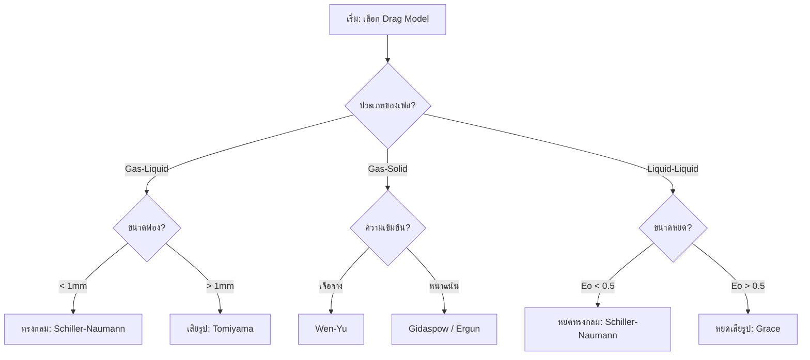
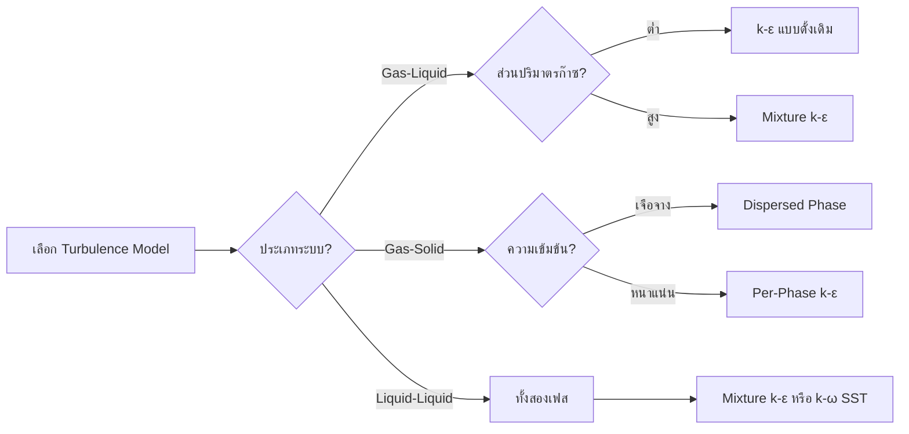
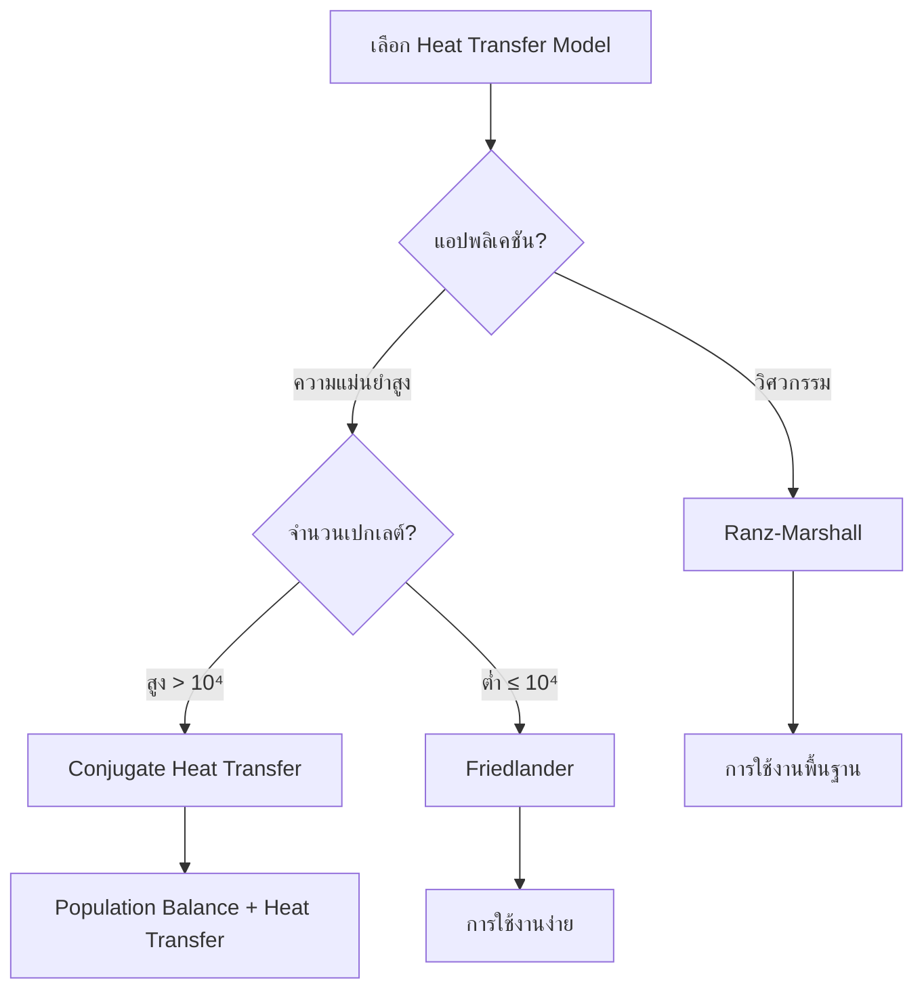
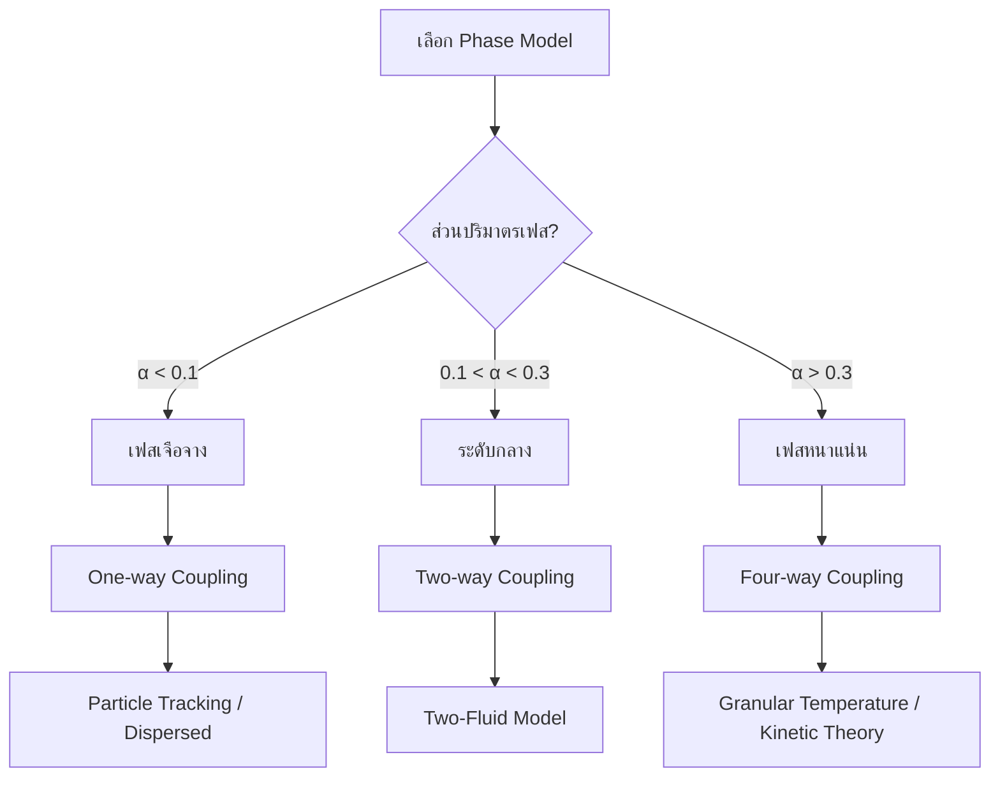
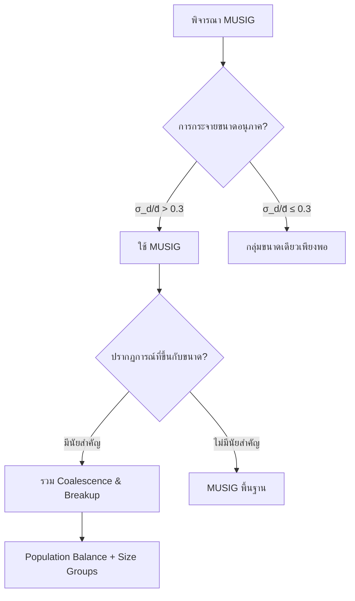

# ผังการเลือกแบบจำลอง (Model Selection Flowchart)

## ภาพรวม (Overview)

การเลือกแบบจำลองที่เหมาะสมเป็นกระบวนการเชิงระบบที่ต้องพิจารณาตั้งแต่ประเภทของเฟสไปจนถึงระบอบการไหล ผังงานนี้ช่วยให้การตั้งค่า OpenFOAM เป็นไปอย่างถูกต้องตามหลักฟิสิกส์

> [!INFO] ความสำคัญของการเลือกแบบจำลองที่ถูกต้อง
> การเลือกแบบจำลองที่เหมาะสมสำคัญอย่างยิ่งต่อการทำนายปฏิสัมพันธ์ระหว่างเฟสและปรากฏการณ์ทางฟิสิกส์อย่างแม่นยำ คู่มือนี้ให้ผังการทำงานเชิงระบบสำหรับการเลือกโมเดลแรงลากต้านและโมเดลการถ่ายเทความร้อน

---

## 1. กรอบการตัดสินใจแบบลำดับชั้น (Hierarchical Decision Framework)

### ระดับที่ 1: การจำแนกระบบ (System Classification)

#### ประเภทเฟส (Phase Types)

| ประเภทเฟส | ลักษณะเฉพาะ | ตัวอย่างการใช้งาน |
|-------------|----------------|-------------------|
| **ก๊าซ-ของเหลว** | ฟองก๊าซหรือหยดของเหลวในเฟสของเหลวต่อเนื่อง | คอลัมน์ฟองก๊าซ, การไหลของอากาศ-น้ำ |
| **ของเหลว-ของเหลว** | ของเหลวที่ไม่ผสมกันโดยมีส่วนติดต่อที่แตกต่างกัน | การแยกน้ำมัน-น้ำ, เอมัลชัน |
| **ก๊าซ-ของแข็ง** | การไหลของก๊าซผ่านอนุภาคของแข็ง | เตาไฟฟลูไอด์, การขนถ่ายด้วยลม |
| **ของเหลว-ของแข็ง** | การขนส่งอนุภาคของแข็งด้วยของเหลว | การขนส่งตะกอน, การไหลของสลัร์รี่ |

#### รูปแบบการไหล (Flow Patterns)

- **ฟอง (Bubbly)**: ฟองก๊าซแยกกันในของเหลวต่อเนื่อง ($\alpha_g < 0.3$)
- **สลัก (Slug)**: ฟองก๊าซขนาดใหญ่ (ฟองก๊าซเทย์เลอร์) คั่นด้วยสลักของเหลว
- **แหวน (Churn)**: ฟิล์มของเหลวบนผนังกับแกนก๊าซ
- **ชั้น (Stratified)**: การแยกเฟสโดยความโน้มถ่วง
- **กระจาย (Dispersed)**: เฟสหนึ่งกระจายเป็นหยด/อนุภาคในเฟสต่อเนื่องอีกเฟสหนึ่ง

### ระดับที่ 2: การประเมินพารามิเตอร์ทางกายภาพ (Physical Parameter Assessment)

#### อัตราส่วนความหนาแน่น (Density Ratio)

$$\text{อัตราส่วนความหนาแน่น} = \frac{\rho_d}{\rho_c}$$

**อนุภาคหนัก ($\rho_d/\rho_c > 1000$):**
- ผลของความเฉื่อยที่แข็งแกร่ง
- การมีส่วนของมวลเสมือนเล็กน้อย
- การตกตะกอนโดยความโน้มถ่วงที่สำคัญ

```cpp
// Drag model for heavy particles - Schiller-Naumann correlation
// Schiller-Naumann model适用于球形颗粒，适用于广泛的雷诺数范围
dragModel       SchillerNaumann;

// Virtual mass effects are negligible for heavy particles
// 重颗粒的虚拟质量效应可以忽略不计
virtualMassModel    negligible;
```

> **📂 Source:** `.applications/solvers/multiphase/multiphaseEulerFoam/interfacialModels/dragModels/SchillerNaumann/SchillerNaumann.C`
> 
> **คำอธิบาย:** อนุภาคหนัง ($\rho_d/\rho_c > 1000$) มีผลของความเฉื่อยที่แข็งแกร่งกว่ามวลเสมือน โมเดล Schiller-Naumann เหมาะสำหรับอนุภาคทรงกลมที่มีความเร็วสัมพันธ์กับของเหลวต่อเนื่อง
> 
> **หลักการ:** อนุภาคหนักมีค่าสัมประสิทธิ์แรงลากต้านสูง และการเคลื่อนที่ของอนุภาคถูกควบคุมหลักโดยความแตกต่างของความหนาแน่น

**อนุภาคเบา ($\rho_d/\rho_c < 10$):**
- ผลของมวลเสมือนที่สำคัญ
- การเชื่อมโยงที่แข็งแกร่งกับเฟสต่อเนื่อง
- การไหลย้อนกลับอาจเกิดขึ้นได้

```cpp
// Drag model for light/deformable bubbles - Tomiyama correlation
// Tomiyama模型适用于可变形气泡，考虑气泡变形对曳力系数的影响
dragModel       Tomiyama;

// Virtual mass is significant for light particles in dense flows
// 轻质颗粒在密集流动中虚拟质量效应显著
virtualMassModel    constant;

// Tomiyama lift model accounts for shape deformation effects
// Tomiyama升力模型考虑形状变形对升力系数的影响
liftModel       Tomiyama;
```

> **📂 Source:** `.applications/solvers/multiphase/multiphaseEulerFoam/interfacialModels/dragModels/TomiyamaAnalytic/TomiyamaAnalytic.C`
> 
> **คำอธิบาย:** อนุภาคเบา ($\rho_d/\rho_c < 10$) เช่นฟองก๊าซในของเหลว มีผลของมวลเสมือนที่สำคัญและมักเปลี่ยนรูปร่าง โมเดล Tomiyama ถูกออกแบบมาเพื่อจัดการกับผลของการเปลี่ยนรูปร่าง
> 
> **หลักการ:** ฟองก๊าซมีแนวโน้มเปลี่ยนรูปร่างตามจำนวนเรย์โนลด์และจำนวน Eötvös ส่งผลให้สัมประสิทธิ์แรงลากต้านและแรงยกเปลี่ยนแปลง

#### จำนวนเรย์โนลด์ของอนุภาค (Particle Reynolds Number)

$$Re_p = \frac{\rho_c u_{rel} d_p}{\mu_c}$$

| ช่วง $Re_p$ | ลักษณะการไหล | โมเดลแนะนำ |
|-------------|----------------|--------------|
| $Re_p < 1$ | การไหลครีปปิ้ง | Stokes |
| $1 < Re_p < 1000$ | การเปลี่ยนผ่าน | Schiller-Naumann |
| $Re_p > 1000$ | การไหลเฉื่อย | Ishii-Zuber / Morsi-Alexander |

#### จำนวน Eötvös (Eötvös Number)

$$Eo = \frac{g(\rho_c - \rho_d)d_p^2}{\sigma}$$

| ค่า $Eo$ | แรงที่โดดเด่น | ลักษณะอนุภาค |
|----------|----------------|----------------|
| $Eo < 1$ | ความตึงผิวโดดเด่น | อนุภาคทรงกลม |
| $Eo > 1$ | การลอยตัวโดดเด่น | อนุภาคที่ถูกแปรรูป |

#### ส่วนปริมาตรเฟส (Phase Volume Fraction)

$$\alpha_d = \frac{V_d}{V_{total}}$$

| ช่วง $\alpha_d$ | ความเข้มข้น | แนวทางการจำลอง |
|-----------------|--------------|-------------------|
| $0 < \alpha_d < 0.1$ | รีจีมเบาบาง | แนวทางการติดตามอนุภาค |
| $0.1 < \alpha_d < 0.3$ | มีความเข้มข้นปานกลาง | แบบจำลองสองของไหล |
| $\alpha_d > 0.3$ | รีจีมหนาแน่น | แบบจำลองปฏิสัมพันธ์อนุภาค-อนุภาค |

---

## 2. ผังการเลือกแบบจำลอง Drag (Drag Model Selection Flow)

### การเลือก Drag Model สำหรับระบบต่างๆ



### รายละเอียดโมเดล Drag

#### 1. ระบบก๊าซ-ของเหลว (Gas-Liquid Systems)

**ฟองก๊าซขนาดเล็ก ($d_p < 1$ มม.):**

$$C_D = \begin{cases}
24(1 + 0.15Re_g^{0.687})/Re_g & \text{for } Re_g < 1000 \\
0.44 & \text{for } Re_g \geq 1000
\end{cases}$$

```cpp
// Phase interaction properties for small spherical bubbles
// 小球形气泡的相间相互作用特性设置
phaseInteraction
{
    // Schiller-Naumann drag model - standard for spherical particles/bubbles
    // Schiller-Naumann 曳力模型 - 适用于球形颗粒/气泡的标准模型
    dragModel       SchillerNaumann;

    // Saffman-Mei lift model for shear-induced lift forces
    // Saffman-Mei 升力模型用于剪切诱导的升力
    liftModel       SaffmanMei;

    // Ranz-Marshall heat transfer correlation for Nusselt number calculation
    // Ranz-Marshall 传热关联式用于努塞尔数计算
    heatTransferModel   RanzMarshall;

    SchillerNaumannCoeffs
    {
        // Reynolds number switch point between correlations
        // 雷诺数关联式切换点
        switch1 1000;
        
        // Drag coefficient for creeping flow (Re < 1000)
        // 蠕流曳力系数 (Re < 1000)
        Cd1     24;
        
        // Drag coefficient for inertial flow (Re >= 1000)
        // 惯性流曳力系数 (Re >= 1000)
        Cd2     0.44;
    }
}
```

> **📂 Source:** `.applications/solvers/multiphase/multiphaseEulerFoam/interfacialModels/dragModels/SchillerNaumann/SchillerNaumann.C`
> 
> **คำอธิบาย:** โมเดล Schiller-Naumann คือสหสัมพันธ์แรงลากต้านแบบคลาสสิกสำหรับอนุภาคทรงกลม ใช้งานได้ดีในช่วงจำนวนเรย์โนลด์กว้าง ($0 < Re_p < 10^5$) และเหมาะสำหรับฟองก๊าซขนาดเล็กที่ไม่เปลี่ยนรูป
> 
> **แนวคิดสำคัญ:**
> - การไหลแบบครีปปิ้ง ($Re_p < 1$): ใช้สมการ Stokes $C_D = 24/Re_p$
> - การไหลแบบเปลี่ยนผ่าน ($1 < Re_p < 1000$): ใช้สหสัมพันธ์ Schiller-Naumann
> - การไหลแบบเฉื่อย ($Re_p > 1000$): ใช้ค่าคงที่ $C_D = 0.44$

**ฟองก๊าซที่เปลี่ยนรูป ($d_p \geq 1$ มม.):**

$$C_D = \max\left[\min\left\{\frac{24}{Re_g}(1 + 0.15Re_g^{0.687}), \frac{72}{Re_g}\right\}, \frac{8}{3}\frac{Eo}{Eo + 4}\right]$$

```cpp
// Phase interaction for deformable bubbles
// 可变形气泡的相间相互作用设置
phaseInteraction
{
    // Tomiyama drag model accounts for bubble deformation effects
    // Tomiyama曳力模型考虑气泡变形效应
    dragModel       Tomiyama;

    // Tomiyama lift model - can predict sign reversal for large bubbles
    // Tomiyama升力模型 - 可预测大泡的升力符号反转
    liftModel       Tomiyama;

    // Hinze scale model for bubble size prediction in turbulent flows
    // Hinze尺度模型用于湍流中气泡尺寸预测
    diameterModel   HinzeScale;

    // Constant virtual mass coefficient (typically 0.5 for spheres)
    // 恒定虚拟质量系数（球形通常为0.5）
    virtualMassModel    constant;

    TomiyamaCoeffs
    {
        // Drag coefficient for high Reynolds number regime
        // 高雷诺数区域的曳力系数
        C1          0.44;
        
        // Coefficient for viscous regime (24/Re term)
        // 粘性区域系数（24/Re项）
        C2          24.0;
        
        // Reynolds number exponent (0.687 in Schiller-Naumann)
        // 雷诺数指数（Schiller-Naumann中为0.687）
        C3          0.15;
        
        // Eötvös number coefficient for deformation effects
        // 变形效应的Eötvös数系数
        C4          6.0;
    }
}
```

> **📂 Source:** `.applications/solvers/multiphase/multiphaseEulerFoam/interfacialModels/dragModels/TomiyamaAnalytic/TomiyamaAnalytic.C`
> 
> **คำอธิบาย:** โมเดล Tomiyama พัฒนาขึ้นสำหรับฟองก๊าซที่เปลี่ยนรูป โดยพิจารณาทั้งผลของจำนวนเรย์โนลด์และจำนวน Eötvös สามารถทำนายการเปลี่ยนเครื่องหมายของสัมประสิทธิ์แรงยกสำหรับฟองก๊าซขนาดใหญ่
> 
> **แนวคิดสำคัญ:**
> - ฟองก๊าซทรงกลม ($Eo < 1$): ใช้สหสัมพันธ์ Schiller-Naumann แบบดั้งเดิม
> - ฟองก๊าซรูปวงรี ($1 < Eo < 40$): การเปลี่ยนรูปร่างเริ่มมีผล
> - ฟองก๊าซที่แปรรูปมาก ($Eo > 40$): แรงลอยตัวโดดเด่น ใช้ความสัมพันธ์ $C_D = \frac{8}{3}\frac{Eo}{Eo + 4}$

#### 2. ระบบก๊าซ-ของแข็ง (Gas-Solid Systems)

**อนุภาคละเอียด ($d_p < 100 \mu m$):**

$$C_D = \frac{24}{Re_p}(1 + 0.15Re_p^{0.687}) \quad \text{for } Re_p < 1000$$

```cpp
// Gas-solid flow with fine particles (dilute regime)
// 含细颗粒的气固流动（稀相区域）
dragModel    WenYu;

// Dispersed phase turbulence model
// 分散相湍流模型
turbulenceModel    dispersedPhase;

// Johnson-Jackson solid contact model for particle-particle collisions
// Johnson-Jackson固相接触模型用于颗粒间碰撞
solidContactModel    JohnsonJackson;

// Rosin-Rammler distribution for polydisperse particles
// 多分散颗粒的Rosin-Rammler分布
diameterModel    RosinRammler;
```

> **📂 Source:** `.applications/solvers/multiphase/multiphaseEulerFoam/interfacialModels/dragModels/GidaspowErgunWenYu/GidaspowErgunWenYu.C`
> 
> **คำอธิบาย:** โมเดล Wen-Yu เป็นส่วนปรับปรุงของโมเดล Schiller-Naumann สำหรับการไหลแบบเจือจางของก๊าซ-ของแข็ง พิจารณาผลของปริมาตรเฟสผ่านฟังก์ชันแก้วโจทย์
> 
> **แนวคิดสำคัญ:**
> - ใช้ได้ดีสำหรับเตียงไหลแบบเจือจาง ($\alpha_s < 0.2$)
> - ปรับค่าสัมประสิทธิ์แรงลากต้านด้วยฟังก์ชันโจทย์: $\alpha_c^{4.7}$
> - ไม่เหมาะสำหรับเตียงบรรจุที่มีการสัมผัสระหว่างอนุภาคสูง

**อนุภาคหยาบ ($d_p > 1$ มม.):**

```cpp
// Coarse particles with high inertia
// 具有高惯性的粗颗粒
dragModel    MorsiAlexander;

// Mixture turbulence model for dense particle flows
// 密集颗粒流动的混合湍流模型
turbulenceModel    mixture;

// Virtual mass negligible for heavy particles
// 重颗粒的虚拟质量可忽略
virtualMassModel    negligible;

// Constant particle diameter
// 恒定颗粒直径
diameterModel    constant;
```

> **📂 Source:** `.applications/solvers/multiphase/multiphaseEulerFoam/interfacialModels/dragModels/MorsiAlexander/MorsiAlexander.C`
> 
> **คำอธิบาย:** โมเดล Morsi-Alexander ใช้ช่วงของสหสัมพันธ์ที่แตกต่างกันสำหรับแต่ละช่วงจำนวนเรย์โนลด์ ให้ความแม่นยำสูงในช่วงจำนวนเรย์โนลด์กว้าง ($0.1 < Re_p < 10^5$)
> 
> **แนวคิดสำคัญ:**
> - ใช้สหสัมพันธ์ 10-20 ช่วงสำหรับความครอบคลุม $Re_p$ ทั้งหมด
> - มีค่าความแม่นยำสูงแต่ต้องการคอมพิวต์มากกว่า
> - เหมาะสำหรับอนุภาคหนักที่มีความเฉื่อยสูง

**เตียงบรรจุ (Packed Bed):**

ใช้สมการ Ergun ที่ปรับเปลี่ยน:

$$\Delta p = \frac{150(1-\epsilon)^2\mu L u}{\epsilon^3 d_p^2} + \frac{1.75(1-\epsilon)\rho L u^2}{\epsilon^3 d_p}$$

```cpp
// Packed bed regime using Ergun correlation
// 使用Ergun关联式的填充床区域
dragModel       Ergun;

// No virtual mass needed for packed beds
// 填充床不需要虚拟质量
virtualMassModel    negligible;

// Granular temperature model for particle-particle interactions
// 颗粒间相互作用的颗粒温度模型
granularTemperatureModel    kineticTheory;
```

> **📂 Source:** `.applications/solvers/multiphase/multiphaseEulerFoam/interfacialModels/dragModels/GidaspowErgunWenYu/GidaspowErgunWenYu.C`
> 
> **คำอธิบาย:** สมการ Ergun เชื่อมโยงทั้งการไหลแบบครีปปิ้งและการไหลแบบเฉื่อยในเตียงบรรจุ ใช้ได้เมื่อส่วนปริมาตรของแข็งสูง ($\alpha_s > 0.6$)
> 
> **แนวคิดสำคัญ:**
> - ความดันลดที่ 1: การไหลแบบครีปปิ้ง (เชิงเส้นกับความเร็ว)
> - ความดันลดที่ 2: การไหลแบบเฉื่อย (เชิงกำลังสองของความเร็ว)
> - ช่วงการใช้งาน: $0 < Re_p < 10$

**เตียงไหล (Fluidized Bed):**

```cpp
// Fluidized bed regime using Syamlal-O'Brien correlation
// 使用Syamlal-O'Brien关联式的流化床区域
dragModel       SyamlalOBrien;

// Constant virtual mass coefficient (typically 0.5)
// 恒定虚拟质量系数（通常为0.5）
virtualMassModel    constant;

// Granular rheology model
// 颗粒流变模型
rheologyModel    SyamlalRogers;
```

> **📂 Source:** `.applications/solvers/multiphase/multiphaseEulerFoam/interfacialModels/dragModels/SyamlalOBrien/SyamlalOBrien.C`
> 
> **คำอธิบาย:** โมเดล Syamlal-O'Brien พัฒนาขึ้นสำหรับเตียงไหลของก๊าซ-ของแข็ง ให้การเปลี่ยนผ่านที่ราบรื่นระหว่างโมเดล Wen-Yu (เจือจาง) และ Ergun (หนาแน่น)
> 
> **แนวคิดสำคัญ:**
> - ใช้ฟังก์ชันการเปลี่ยนผ่านระหว่างรีจีม
> - ทำนายความเร็วขั้นต่ำของการไหล (minimum fluidization velocity) ได้ดี
> - เหมาะสำหรับการจำลองเตียงไหลฟอง (bubbling fluidized beds)

#### 3. ระบบของเหลว-ของเหลว (Liquid-Liquid Systems)

**หยดขนาดเล็ก ($Eo < 0.5$):**

```cpp
// Small spherical drops (creeping to transitional flow)
// 小球形液滴（蠕流到过渡流）
dragModel    SchillerNaumann;

// Constant surface tension
// 恒定表面张力
sigma    constant;

// Film drainage model for coalescence prediction
// 薄膜排水模型用于预测聚结
coalescenceModel    filmDrainage;

// Weber number criterion for drop breakup
// 韦伯数准则用于液滴破碎
breakupModel    WeberNumber;
```

> **📂 Source:** `.applications/solvers/multiphase/multiphaseEulerFoam/interfacialModels/dragModels/SchillerNaumann/SchillerNaumann.C`
> 
> **คำอธิบาย:** หยดของเหลวขนาดเล็กมีพฤติกรรมคล้ายกับฟองก๊าซทรงกลม เมื่อ $Eo < 0.5$ แรงความตึงผิวโดดเด่นกว่าแรงลอยตัว ทำให้หยดคงรูปทรงกลม
> 
> **แนวคิดสำคัญ:**
> - ใช้โมเดล Schiller-Naumann แบบมาตรฐาน
> - พิจารณาผลของความหนืดระหว่างเฟส (viscosity ratio)
> - การรวมตัว (coalescence) และการแตกตัว (breakup) มีความสำคัญ

**หยดที่ผิดรูป ($Eo > 0.5$):**

```cpp
// Deformable drops with significant internal circulation
// 具有显著内循环的变形液滴
dragModel    Grace;

// Temperature-dependent surface tension
// 温度依赖的表面张力
sigma    temperatureDependent;

// Method of classes for population balance
// 用于群体平衡的类别方法
populationBalanceModel    methodOfClasses;

// Simonin turbulent dispersion model
// Simonin湍流扩散模型
turbulentDispersionModel    Simonin;
```

> **📂 Source:** `.applications/solvers/multiphase/multiphaseEulerFoam/interfacialModels/dragModels/Grace/Grace.C`
> 
> **คำอธิบาย:** โมเดล Grace พัฒนาขึ้นสำหรับหยดของเหลวที่ผิดรูป พิจารณาทั้งอัตราส่วนความหนืด (viscosity ratio) และจำนวน Eötvös
> 
> **แนวคิดสำคัญ:**
> - ใช้สหสัมพันธ์ Grace: $C_D = f(Re_p, Eo, \mu_d/\mu_c)$
> - เหมาะสำหรับระบบน้ำมัน-น้ำและเอมัลชัน
> - ต้องพิจารณาวิกฤตการณ์การไหลภายในหยด (internal circulation)

### ตารางเปรียบเทียบโมเดล Drag

| โมเดล | ช่วงจำนวนเรย์โนลด์ | ความเหมาะสม | ความซับซ้อน |
|---------|-------------------|-------------------|----------------|
| Schiller-Naumann | 0 - 1000+ | ฟอง/อนุภาคทรงกลม | ต่ำ |
| Tomiyama | 0 - 1000+ | ฟองที่เปลี่ยนรูปร่าง | ปานกลาง |
| Grace | 0 - 1000+ | หยดที่ผิดรูป | ปานกลาง |
| Morsi-Alexander | 0.1 - 10^5 | อนุภาคหนัก | สูง |
| Wen-Yu | 0 - 1000 | เตียงไหล | ปานกลาง |
| Ergun | 0 - 10 | เตียงบรรจุ | ต่ำ |

---

## 3. ผังการเลือกแบบจำลอง Lift (Lift Model Selection Flow)

### การเลือก Lift Model

| เงื่อนไข | โมเดลแนะนำ | เหตุผล |
|----------|------------|--------|
| อนุภาคแข็ง $Re_p < 1000$ | **SaffmanMei** | จัดการแรงเฉือนได้ดี |
| ฟองอากาศในของเหลว | **Tomiyama** | พิจารณาการเปลี่ยนทิศทางตามขนาดฟอง |
| ระบบที่ไม่เน้นแนวขวาง | **NoLift** | เพิ่มความเร็วในการคำนวณ |

### แรงยก (Lift Force)

$$\mathbf{f}_L = C_L \rho_l V_b (\mathbf{u}_g - \mathbf{u}_l) \times (\nabla \times \mathbf{u}_l)$$

โดยที่สัมประสิทธิ์แรงยก $C_L$ สามารถเป็นค่าลบสำหรับฟองก๊าซขนาดใหญ่ นำไปสู่ปรากฏการณ์ "wall-peaking"

```cpp
// Lift force calculation for spherical particles in shear flow
// 剪切流中球形颗粒的升力计算
liftModel       SaffmanMei;

SaffmanMeiCoeffs
{
    // Reynolds number limit for lift coefficient calculation
    // 升力系数计算的雷诺数极限
    ReLimit      1000;
    
    // Lift coefficient (theoretical value for sphere is 0.5)
    // 升力系数（球形理论值为0.5）
    CL          0.5;
}
```

> **📂 Source:** `.applications/solvers/multiphase/multiphaseEulerFoam/interfacialModels/liftModels/SaffmanMei/SaffmanMei.C`
> 
> **คำอธิบาย:** โมเดล Saffman-Mei คำนวณแรงยกที่เกิดจากการไหลแบบเฉือน (shear-induced lift) เหมาะสำหรับอนุภาคทรงกลมในการไหลแบบชั้น (laminar shear flow)
> 
> **แนวคิดสำคัญ:**
> - แรงยกเกิดจากความแตกต่างของความเร็วในการไหลแบบเฉือน
> - สัมประสิทธิ์แรงยกขึ้นกับจำนวนเรย์โนลด์ของอนุภาคและจำนวนเรย์โนลด์ของเฉือน
> - ไม่พิจารณาผลของการเปลี่ยนรูปร่าง

---

## 4. ผังการเลือกแบบจำลองความปั่นป่วน (Turbulence Model Selection)

### การเลือกแบบจำลองความปั่นป่วน



### การกำหนดค่าใน OpenFOAM

**การไหลของฟองก๊าซแบบเอกพันธ์:**

```cpp
// Standard k-epsilon turbulence model for bubbly flows
// 气泡流动的标准k-ε湍流模型
turbulence
{
    type            kEpsilon;

    kEpsilonCoeffs
    {
        // Turbulent viscosity coefficient (standard value 0.09)
        // 湍流粘性系数（标准值0.09）
        Cmu         0.09;
        
        // Production term coefficient
        // 产生项系数
        C1          1.44;
        
        // Dissipation term coefficient
        // 耗散项系数
        C2          1.92;
        
        // Turbulent Prandtl number for epsilon
        // epsilon的湍流普朗特数
        sigmaEps    1.3;
        
        // Turbulent Prandtl number for k
        // k的湍流普朗特数
        sigmaK      1.0;
    }

    phaseModel
    {
        continuous     liquid;
        dispersed      gas;

        // Dispersed multiphase turbulence model
        // 分散多相湍流模型
        dispersedMultiphaseTurbulence
        {
            type        continuousGasEuler;
            
            // Schmidt number for turbulent dispersion
            // 湍流扩散的施密特数
            sigma        1.0;
            
            // Cmu coefficient for turbulent viscosity
            // 湍流粘性的Cmu系数
            Cmu          0.09;
            
            // Turbulent Prandtl number
            // 湍流普朗特数
            Prt          1.0;
        }
    }
}
```

> **📂 Source:** `.applications/solvers/multiphase/multiphaseEulerFoam/multiphaseCompressibleMomentumTransportModels/MomentumTransportModels/MomentumTransportModel/MomentumTransportModel.C`
> 
> **คำอธิบาย:** โมเดลความปั่นป่วน k-ε แบบดั้งเดิมใช้ได้ดีสำหรับการไหลของฟองก๊าซแบบเอกพันธ์ โดยการไหลของเฟสต่อเนื่องถูกจำลองด้วยโมเดล k-ε และการกระจายความปั่นป่วนสู่เฟสกระจายถูกจำลองด้วยแบบจำลองเพิ่มเติม
> 
> **แนวคิดสำคัญ:**
> - สมการ k: พลังงานจลน์ความปั่นป่วน (turbulent kinetic energy)
> - สมการ ε: อัตราการสลายตัวของพลังงานจลน์ (dissipation rate)
> - ใช้ได้ดีเมื่อ $\alpha_g < 0.1$ (การไหลแบบเจือจาง)

**การไหลของฟองก๊าซแบบไม่เอกพันธ์:**

```cpp
// Mixture k-epsilon model for dense bubbly flows
// 密集气泡流动的混合k-ε模型
turbulence
{
    type            mixtureKEpsilon;

    mixtureKEpsilonCoeffs
    {
        // Cmu coefficient for turbulent viscosity
        // 湍流粘性的Cmu系数
        Cmu         0.09;
        
        // Production term coefficient
        // 产生项系数
        C1          1.44;
        
        // Dissipation term coefficient
        // 耗散项系数
        C2          1.92;
        
        // Turbulent Prandtl number for epsilon
        // epsilon的湍流普朗特数
        sigmaEps    1.3;
        
        // Turbulent Prandtl number for k
        // k的湍流普朗特数
        sigmaK      1.0;
        
        // Use mixture viscosity for turbulence calculation
        // 使用混合粘度计算湍流
        muMixture   on;
        
        // Enable phase-specific turbulence
        // 启用特定相湍流
        phaseTurbulence  on;
    }
}
```

> **📂 Source:** `.applications/solvers/multiphase/multiphaseEulerFoam/multiphaseCompressibleMomentumTransportModels/MixtureKEpsilon/MixtureKEpsilon.C`
> 
> **คำอธิบาย:** โมเดล k-ε แบบผสม (mixture) ใช้สำหรับการไหลของฟองก๊าศที่มีส่วนปริมาตรฟองสูง ($\alpha_g > 0.1$) โดยสมการถูกแก้ไขเพื่อพิจารณาผลของการไหลผสม
> 
> **แนวคิดสำคัญ:**
> - ใช้คุณสมบัติของผสม (mixture properties) ในการคำนวณความปั่นป่วน
> - พิจารณาทั้งผลของการสั่นของฟอง (bubble-induced turbulence)
> - เหมาะสำหรับเตียงไหลฟอง (bubbling beds)

---

## 5. ผังการเลือกแบบจำลองการถ่ายเทความร้อน (Heat Transfer Model Selection)

### การเลือกโมเดลการถ่ายเทความร้อน



### จำนวนเปกเลต์ (Peclet Number)

$$Pe = Re_p \cdot Pr = \frac{\rho_c c_{p,c} u_{rel} d_p}{k_c}$$

- **จำนวนเปกเลต์สูง ($Pe > 10^4$)**: การถ่ายเทความร้อนแบบ对流เป็นหลัก
- **จำนวนเปกเลต์ต่ำ ($Pe \leq 10^4$)**: มีผลจากการนำความร้อนอย่างมีนัยสำคัญ

### ความสัมพันธ์ Ranz-Marshall

$$Nu = 2 + 0.6 Re_p^{0.5} Pr^{0.33}$$

```cpp
// Ranz-Marshall heat transfer model for particle-fluid heat transfer
// 颗粒-流体传热的Ranz-Marshall传热模型
heatTransferModel RanzMarshall;

RanzMarshallCoeffs
{
    // Prandtl number for the continuous phase
    // 连续相的普朗特数
    Pr              0.7;
}
```

> **📂 Source:** `.applications/solvers/multiphase/multiphaseEulerFoam/interfacialModels/heatTransferModels/RanzMarshall/RanzMarshall.C`
> 
> **คำอธิบาย:** โมเดล Ranz-Marshall เป็นสหสัมพันธ์แบบคลาสสิกสำหรับการถ่ายเทความร้อนระหว่างอนุภาคและของไหล ใช้ได้ดีในช่วงจำนวนเรย์โนลด์กว้าง
> 
> **แนวคิดสำคัญ:**
> - จำนวนนุสเซลต์ (Nusselt number): $Nu = h d_p / k_c$
> - เทอมที่ 1 (2): การนำความร้อนแบบคงที่ (conduction limit)
> - เทอมที่ 2: ผลของการไหลแบบ对流 (convection contribution)

### Conjugate Heat Transfer (CHT)

```cpp
// Two-resistance heat transfer model for conjugate heat transfer
// 共轭传热的双阻力传热模型
heatTransfer    
{
    type            twoResistanceHeatTransferPhaseSystem;
}

// Define phase 1 properties
// 定义相1属性
phase1          
{
    type            gas;
    
    // Thermal conductivity of gas phase
    // 气相热导率
    kappa            0.026;
}

// Define phase 2 properties
// 定义相2属性
phase2          
{
    type            liquid;
    
    // Thermal conductivity of liquid phase
    // 液相热导率
    kappa            0.6;
}
```

> **📂 Source:** `.applications/solvers/multiphase/multiphaseEulerFoam/phaseSystems/PhaseSystems/OneResistanceHeatTransferPhaseSystem/OneResistanceHeatTransferPhaseSystem.C`
> 
> **คำอธิบาย:** แบบจำลองการถ่ายเทความร้อนแบบสองความต้านทาน (two-resistance) พิจารณาทั้งความต้านทานต่อการถ่ายเทความร้อนในทั้งสองเฟส เหมาะสำหรับการจำลอง Conjugate Heat Transfer
> 
> **แนวคิดสำคัญ:**
> - ความต้านทานทั้งสองเชื่อมต่อกันอนุกรม
> - สมดุลความร้อนที่ส่วนติดต่อระหว่างเฟส
> - ใช้ได้สำหรับอนุภาคที่มีความจุความร้อนสูง (high heat capacity particles)

---

## 6. ผังการตัดสินใจเชิงตัวเลข (Numerical Decision Flow)

### การพิจารณาความเสถียรของ Solver


### การกำหนดค่า Numerical

**ระบบที่มีอัตราส่วนความหนาแน่นสูง:**

```cpp
// Numerical schemes for high density ratio systems
// 高密度比系统的数值格式
solver
{
    // Geometric-algebraic multigrid solver for pressure
    // 压力的几何代数多重网格求解器
    p               GAMG;
    pFinal          GAMG;
    
    // Smooth solver for velocity
    // 速度的平滑求解器
    U               smoothSolver;
    
    // Smooth solver for temperature
    // 温度的平滑求解器
    T               smoothSolver;
    
    // Smooth solver for phase fraction
    // 相分数的平滑求解器
    alpha           smoothSolver;
}

// Under-relaxation factors for stability
// 用于稳定性的欠松弛因子
relaxationFactors
{
    fields
    {
        // Pressure relaxation - low value for stability
        // 压力松弛 - 低值以保持稳定性
        p           0.3;
        
        // Velocity relaxation
        // 速度松弛
        U           0.5;
        
        // Temperature relaxation
        // 温度松弛
        T           0.5;
        
        // Phase fraction relaxation
        // 相分数松弛
        alpha       0.5;
    }
    equations
    {
        // Pressure equation relaxation
        // 压力方程松弛
        p           0.8;
        
        // Momentum equation relaxation
        // 动量方程松弛
        U           0.7;
        
        // Phase fraction equation relaxation
        // 相分数方程松弛
        alpha       0.7;
    }
}
```

> **📂 Source:** `.applications/solvers/multiphase/multiphaseEulerFoam/multiphaseEulerFoam/multiphaseEulerFoam.C`
> 
> **คำอธิบาย:** ระบบที่มีอัตราส่วนความหนาแน่นสูง ($\rho_d/\rho_c > 100$) มีความไวต่อความไม่เสถียรของเชิงตัวเลข จำเป็นต้องใช้ค่า under-relaxation ต่ำและตัวแก้สมการแบบทนทาน (robust solvers)
> 
> **แนวคิดสำคัญ:**
> - ความสัมพันธ์ระหว่างความดันและความเร็วมีความแข็งแกร่ง (strong pressure-velocity coupling)
> - การแก้สมการแรงลากต้านต้องการการบรรจบกันที่ดี
> - ใช้ GAMG สำหรับสมการความดันเพื่อเพิ่มความเร็ว

**ระบบที่มีอัตราส่วนความหนาแน่นต่ำ:**

```cpp
// Numerical schemes for low density ratio systems
// 低密度比系统的数值格式
relaxationFactors
{
    fields
    {
        // Pressure relaxation - higher value for faster convergence
        // 压力松弛 - 较高值以加快收敛
        p           0.7;
        
        // Velocity relaxation
        // 速度松弛
        U           0.7;
        
        // Temperature relaxation
        // 温度松弛
        T           0.7;
        
        // Phase fraction relaxation
        // 相分数松弛
        alpha       0.7;
    }
    equations
    {
        // Pressure equation relaxation - full relaxation possible
        // 压力方程松弛 - 可使用全松弛
        p           1;
        
        // Momentum equation relaxation
        // 动量方程松弛
        U           0.8;
        
        // Energy equation relaxation
        // 能量方程松弛
        T           0.8;
        
        // Phase fraction equation relaxation
        // 相分数方程松弛
        alpha       0.8;
    }
}
```

> **📂 Source:** `.applications/solvers/multiphase/multiphaseEulerFoam/multiphaseEulerFoam/multiphaseEulerFoam.C`
> 
> **คำอธิบาย:** ระบบที่มีอัตราส่วนความหนาแน่นต่ำ ($\rho_d/\rho_c < 10$) เช่นฟองก๊าซในของเหลว มีความเสถียรของเชิงตัวเลขดีกว่า สามารถใช้ค่า under-relaxation สูงกว่าเพื่อเพิ่มความเร็วในการบรรจบกัน
> 
> **แนวคิดสำคัญ:**
> - การเชื่อมโยงระหว่างเฟสแข็งแกร่งกว่า (strong phase coupling)
> - มวลเสมือนมีผลสำคัญต่อความเสถียร
> - สามารถใช้ช่วงเวลาใหญ่กว่าได้

---

## 7. ผังการเลือกแบบจำลองเฟสหนาแน่น/เจือจาง (Dense/Dilute Phase Model Selection)

### การเลือกแบบจำลองตามความเข้มข้น



### เฟสเจือจาย (Dilute Phase)

$$\mathbf{M}_p = \frac{3\mu_c \alpha_p}{4d_p^2} C_D Re_p (\mathbf{u}_c - \mathbf{u}_p)$$

**คุณลักษณะ:**
- สัดส่วนปริมาตรต่ำ ($\alpha_d < 0.1$)
- ปฏิสัมพันธ์ของอนุภาคกับอนุภาคไม่มีนัยสำคัญ
- ผลของการเชื่อมโยงสองทางมีขนาดเล็ก

```cpp
// Dilute phase configuration with one-way coupling
// 单向耦合的稀相配置
dispersedPhaseModel
{
    // Dispersed phase particle tracking
    // 分散相颗粒追踪
    type            lagrangian;
    
    // One-way coupling - particles don't affect continuous phase
    // 单向耦合 - 颗粒不影响连续相
    coupling        oneWay;
    
    // Particle injection model
    // 颗粒注入模型
    injectionModel  coneInjection;
}
```

> **📂 Source:** `.applications/solvers/multiphase/multiphaseEulerFoam/phaseSystems/diameterModels/constantDiameter/constantDiameter.C`
> 
> **คำอธิบาย:** ในรีจีมเจือจาย การสัมผัสระหว่างอนุภาคสามารถละเลยได้ และปฏิสัมพันธ์เป็นแบบทิศทางเดียว (continuous → dispersed)
> 
> **แนวคิดสำคัญ:**
> - ใช้แบบจำลองแบบติดตาม (tracking models) หรือ Eulerian แบบเจือจาย
> - ประหยัดคอมพิวต์มากกว่ารีจีมหนาแน่น
> - เหมาะสำหรับการไหลแบบ aerosol และการพ่นฝุ่น (spray)

### เฟสหนาแน่น (Dense Phase)

**ทฤษฎีจลน์ของการไหลแบบลูกเต็ม:**

$$p_p = \rho_p \alpha_p \Theta_p [1 + 2(1+e) \alpha_p g_0]$$

**ตัวแปรในสมการ:**
- $p_p$: ความดันของอนุภาค
- $\rho_p$: ความหนาแน่นอนุภาค
- $\alpha_p$: สัดส่วนปริมาตรอนุภาค
- $\Theta_p$: อุณหภูมิลูกเต็ม (granular temperature)
- $e$: สัมประสิทธิ์การกระเด็นกลับ
- $g_0$: ฟังก์ชันการกระจายแบบรัศมี

**คุณลักษณะ:**
- สัดส่วนปริมาตรเกินค่าขีดจำกัด ($\alpha_d > 0.3$)
- การชนกันของอนุภาคกับอนุภาคเป็นที่โดดเด่น
- การก่อตัวของโครงสร้างเกิดขึ้น

```cpp
// Dense phase configuration with kinetic theory model
// 使用动力学理论的密相配置
phaseModel
{
    // Granular phase with kinetic theory
    // 具有动力学理论的颗粒相
    type            granular;
    
    // Kinetic theory model for granular temperature
    // 颗粒温度的动力学理论模型
    kineticTheoryModel    Gidaspow;
    
    // Granular viscosity model
    // 颗粒粘度模型
    granularViscosityModel    Gidaspow;
    
    // Granular conductivity model
    // 颗粒热导率模型
    granularConductivityModel    Gidaspow;
    
    // Radial distribution function
    // 径向分布函数
    radialModel    MaAhmadi;
}

GidaspowCoeffs
{
    // Coefficient of restitution (1 = perfectly elastic)
    // 恢复系数（1 = 完全弹性）
    e            0.9;
    
    // Maximum packing fraction
    // 最大堆积分数
    alphaMax     0.63;
}
```

> **📂 Source:** `.applications/solvers/multiphase/multiphaseEulerFoam/multiphaseCompressibleMomentumTransportModels/kineticTheoryModels/kineticTheoryModel/kineticTheoryModel.C`
> 
> **คำอธิบาย:** ทฤษฎีจลน์ของการไหลแบบลูกเต็ม (kinetic theory of granular flow) ใช้สมการความดันของอนุภาคและความหนืดเพื่อจำลองพฤติกรรมของการไหลหนาแน่น
> 
> **แนวคิดสำคัญ:**
> - อุณหภูมิลูกเต็ม ($\Theta_p$): ความผันผวนของความเร็วอนุภาค
> - ฟังก์ชันการกระจาย ($g_0$): พิจารณาผลของการชนกันแบบหลายอนุภาค
> - ความหนืดของอนุภาค: แบ่งเป็นส่วนปะทุ (collisional), การเคลื่อนที่ (kinetic), และแรงเฉือน (frictional)

---

## 8. ผังการเลือกแบบจำลอง MUSIG (MUSIG Model Selection)

### เมื่อใดควรใช้ MUSIG



### เงื่อนไขที่จำเป็น

- **ประชากรอนุภาคโพลีไดเพอร์ส** มีอยู่ ($\sigma_d/\bar{d} > 0.3$)
- **ปรากฏการณ์ที่ขึ้นกับขนาด** มีนัยสำคัญ (การรวมตัว, การแตกตัว, การถ่ายโอนมวล)
- **ผลของสมดุลประชากร** มีอิทธิพลต่อพฤติกรรมโดยรวม

### การกำหนดค่า MUSIG ใน OpenFOAM

```cpp
// Population balance model with size groups (MUSIG approach)
// 具有尺寸组的群体平衡模型（MUSIG方法）
populationBalance
{
    // Size group method
    // 尺寸组方法
    populationBalanceModel    sizeGroup;

    // Define size groups with representative diameters and fractions
    // 定义具有代表性直径和分数的尺寸组
    sizeGroups
    {
        // Size group 1: 1 mm diameter, 20% mass fraction
        // 尺寸组1：直径1毫米，质量分数20%
        SG1 { d: 0.001; x: 0.2; }
        
        // Size group 2: 2 mm diameter, 30% mass fraction
        // 尺寸组2：直径2毫米，质量分数30%
        SG2 { d: 0.002; x: 0.3; }
        
        // Size group 3: 3 mm diameter, 30% mass fraction
        // 尺寸组3：直径3毫米，质量分数30%
        SG3 { d: 0.003; x: 0.3; }
        
        // Size group 4: 4 mm diameter, 20% mass fraction
        // 尺寸组4：直径4毫米，质量分数20%
        SG4 { d: 0.004; x: 0.2; }
    }

    // Coalescence (merging) models
    // 聚结（合并）模型
    coalescenceModels
    {
        // Luo coalescence model - turbulent driven
        // Luo聚结模型 - 湍流驱动
        LuoCoalescence
        {
            // Coalescence rate coefficient
            // 聚结速率系数
            Cco         0.1;
            
            // Film drainage time coefficient
            // 薄膜排水时间系数
            Co          0.0;
        }
    }

    // Breakup (fragmentation) models
    // 破碎（碎裂）模型
    breakupModels
    {
        // Luo breakup model - turbulent eddy impact
        // Luo破碎模型 - 湍流涡撞击
        LuoBreakup
        {
            // Breakup coefficient 1
            // 破碎系数1
            C1          0.923;
            
            // Breakup coefficient 2
            // 破碎系数2
            C2          1.0;
            
            // Breakup coefficient 3 (size dependence)
            // 破碎系数3（尺寸依赖性）
            C3          2.45;
        }
    }
}
```

> **📂 Source:** `.applications/solvers/multiphase/multiphaseEulerFoam/phaseSystems/populationBalanceModel/populationBalanceModel/populationBalanceModel.C`
> 
> **คำอธิบาย:** โมเดล MUSIG (Multiple Size Group) ใช้แบบจำลองสมดุลประชากร (population balance model) เพื่อติดตามการกระจายขนาดอนุภาคและการเปลี่ยนแปลงที่เกิดจากการรวมตัวและการแตกตัว
> 
> **แนวคิดสำคัญ:**
> - สมการสมดุลประชากร: $\frac{\partial n(d)}{\partial t} + \nabla \cdot (n(d)\mathbf{u}) = B_C - D_C + B_B - D_B$
> - $B_C, D_C$: อัตราการเกิดและการตายจากการรวมตัว (coalescence birth/death)
> - $B_B, D_B$: อัตราการเกิดและการตายจากการแตกตัว (breakup birth/death)
> - แก้สมการสำหรับแต่ละกลุ่มขนาดโดยอิสระ

### การเลือกกลุ่มขนาด

| พารามิเตอร์ | ค่าแนะนำ | ข้อควรพิจารณา |
|-------------|-------------|-----------------|
| **จำนวนกลุ่ม** | 5-10 กลุ่ม | เพิ่มตามความจำเป็น |
| **การกระจายกลุ่ม** | ความก้าวหน้าทางเรขาคณิต | ครอบคลุมช่วงขนาดที่สนใจ |
| **เงื่อนไขขอบเขต** | การกระจายทางเข้าตามขนาด | ต้องมีข้อมูลการวัด |

---

## 9. รายการตรวจสอบการตั้งค่า (Implementation Checklist)

### รายการตรวจสอบก่อนการจำลอง

- [ ] **Phase Definition:** ระบุประเภทของเฟสถูกต้องใน `phaseProperties`
- [ ] **Dimensionless Numbers:** ตรวจสอบช่วง $Re_p$, $Eo$, และ $Pe$ ของระบบ
- [ ] **Interfacial Coupling:** เปิดใช้งานเทอม Drag, Lift, และ Virtual Mass ที่จำเป็น
- [ ] **Convergence:** ตั้งค่า Residual tolerance อย่างน้อย $10^{-6}$
- [ ] **Mesh Independence:** ทดสอบความละเอียดของ mesh หลายระดับ
- [ ] **Time Step:** ตรวจสอบค่า Courant number และข้อจำกัดของช่วงเวลา
- [ ] **Boundary Conditions:** ตรวจสอบความถูกต้องของเงื่อนไขขอบเขต
- [ ] **Material Properties:** ตรวจสอบคุณสมบัติของวัสดุทั้งหมด
- [ ] **Initial Conditions:** ตั้งค่าเงื่อนไขเริ่มต้นที่เหมาะสม
- [ ] **Solver Settings:** ปรับแต่งพารามิเตอร์ solver สำหรับความเสถียร

### ขั้นตอนการตรวจสอบความถูกต้อง

#### 1. การตรวจสอบ Mesh Independence

```bash
# Perform simulations with multiple mesh refinement levels
# 使用多个网格细化级别进行模拟
refineMesh "layer(0,1,2)"  # Level 1: Standard mesh
refineMesh "layer(1,2,3)"  # Level 2: Refined mesh
refineMesh "layer(2,3,4)"  # Level 3: Finest mesh
```

#### 2. การวิเคราะห์ความไวต่อพารามิเตอร์

```bash
# Run simulations with multiple drag model parameters
# 使用多个曳力模型参数运行模拟
dragModel SchillerNaumann;    # Baseline case
dragModel Tomiyama;           # Test deformation effects
dragModel MorsiAlexander;     # Test heavy particles
```

#### 3. การเปรียบเทียบกับข้อมูลทดลอง

```bash
# Use postProcessing utilities for comparison
# 使用后处理工具进行比较
postProcess -func "phaseFraction(gas)" -time "0,0.1,0.2,0.3"
postProcess -func "dragForce" -time "0,0.1,0.2,0.3"
```

---

## 10. ข้อผิดพลาดทั่วไปและการแก้ไข (Common Pitfalls and Solutions)

| ข้อผิดพลาด | ผลกระทบ | การแก้ไข |
|-------------|-----------|-------------|
| การเลือกโมเดลที่ไม่เหมาะสม | ความไม่ถูกต้องของผลลัพธ์ | ประเมินช่วงจำนวนเรย์โนลด์ |
| การละเลยฟิสิกส์ | การทำนายผิดพลาด | รวมแรงกระจายความปั่นป่วน แรงมวลเสมือน |
| ปัญหาเชิงตัวเลข | การแพร่กระจายอินเตอร์เฟซเทียม | เพิ่มความละเอียด mesh ใช้แบบจำลองความหนืดจำนวน |
| พารามิเตอร์ที่ไม่น่าเชื่อถือ | ความไม่แน่นอนสูง | ตรวจสอบคุณสมบัติกับข้อมูลที่เผยแพร่ |

---

## สรุป (Summary)

> [!TIP] หลักการสำคัญ
> การทำตามผังงานนี้จะช่วยลดความผิดพลาดในการตั้งค่าเคส Multiphase และช่วยให้ผลการจำลองมีความน่าเชื่อถือมากขึ้น กระบวนการเลือกแบบจำลองควรสร้างความสมดุลระหว่างความซื่อตรงทางฟิสิกส์กับความเป็นไปได้ทางการคำนวณ

### ขั้นตอนการเลือกแบบจำลองแบบสรุป

1. **จำแนกระบบ:** ระบุประเภทเฟสและรูปแบบการไหล
2. **คำนวณพารามิเตอร์:** อัตราส่วนความหนาแน่น, จำนวนเรย์โนลด์, Eötvös
3. **เลือกโมเดล:** Drag, Lift, Virtual Mass, Turbulence, Heat Transfer
4. **ตั้งค่าเชิงตัวเลข:** Relaxation factors, Solver settings
5. **ตรวจสอบ:** Mesh independence, Validation, Sensitivity analysis