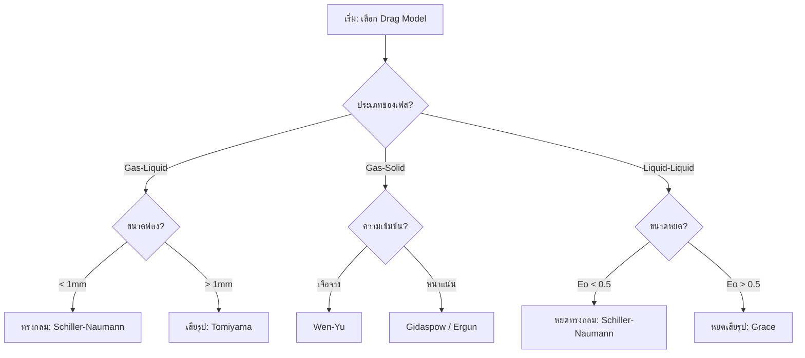
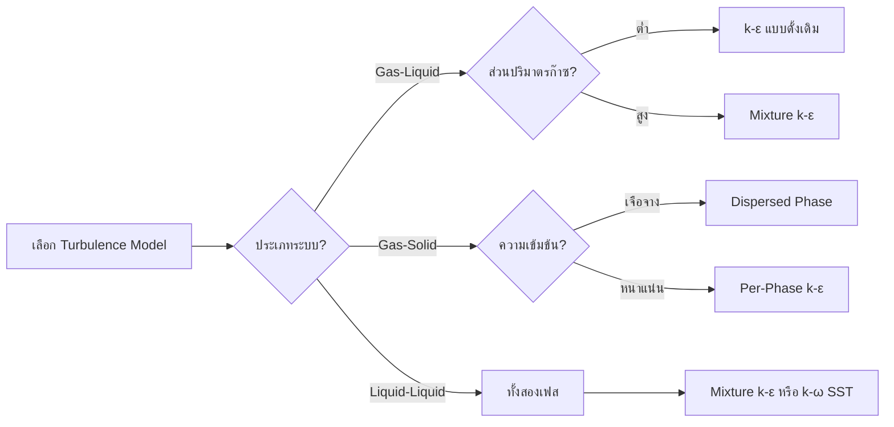
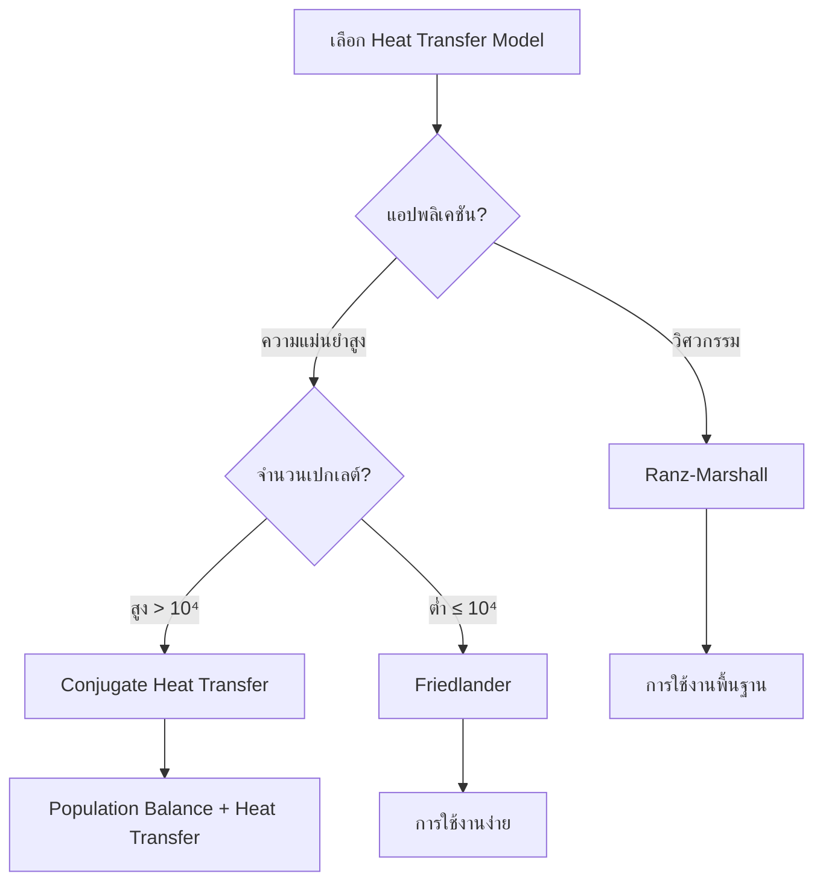
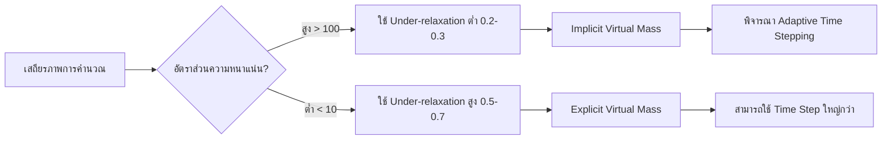
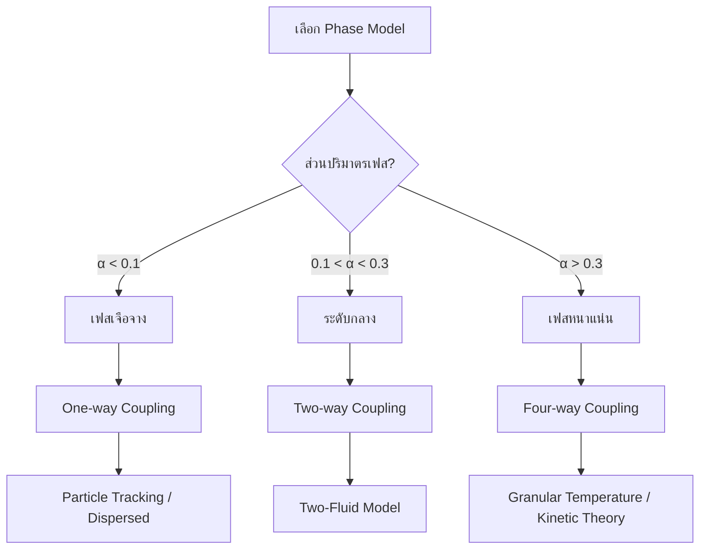
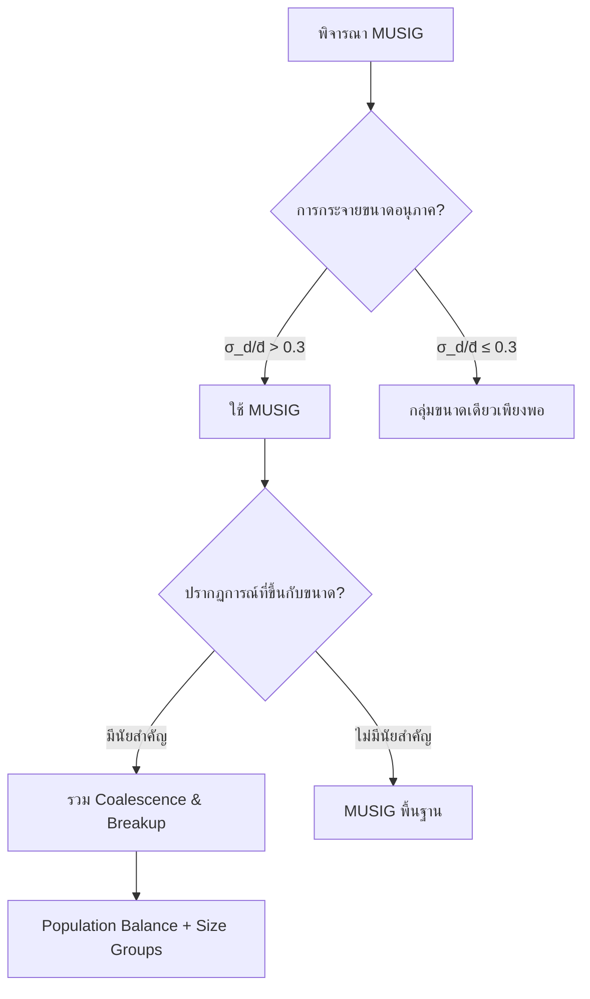

# ผังการเลือกแบบจำลอง (Model Selection Flowchart)

## ภาพรวม (Overview)

การเลือกแบบจำลองที่เหมาะสมเป็นกระบวนการเชิงระบบที่ต้องพิจารณาตั้งแต่ประเภทของเฟสไปจนถึงระบอบการไหล ผังงานนี้ช่วยให้การตั้งค่า OpenFOAM เป็นไปอย่างถูกต้องตามหลักฟิสิกส์

> [!INFO] ความสำคัญของการเลือกแบบจำลองที่ถูกต้อง
> การเลือกแบบจำลองที่เหมาะสมสำคัญอย่างยิ่งต่อการทำนายปฏิสัมพันธ์ระหว่างเฟสและปรากฏการณ์ทางฟิสิกส์อย่างแม่นยำ คู่มือนี้ให้ผังการทำงานเชิงระบบสำหรับการเลือกโมเดลแรงลากต้านและโมเดลการถ่ายเทความร้อน

---

## 1. กรอบการตัดสินใจแบบลำดับชั้น (Hierarchical Decision Framework)

### ระดับที่ 1: การจำแนกระบบ (System Classification)

#### ประเภทเฟส (Phase Types)

| ประเภทเฟส | ลักษณะเฉพาะ | ตัวอย่างการใช้งาน |
|-------------|----------------|-------------------|
| **ก๊าซ-ของเหลว** | ฟองก๊าซหรือหยดของเหลวในเฟสของเหลวต่อเนื่อง | คอลัมน์ฟองก๊าซ, การไหลของอากาศ-น้ำ |
| **ของเหลว-ของเหลว** | ของเหลวที่ไม่ผสมกันโดยมีส่วนติดต่อที่แตกต่างกัน | การแยกน้ำมัน-น้ำ, เอมัลชัน |
| **ก๊าซ-ของแข็ง** | การไหลของก๊าซผ่านอนุภาคของแข็ง | เตาไฟฟลูไอด์, การขนถ่ายด้วยลม |
| **ของเหลว-ของแข็ง** | การขนส่งอนุภาคของแข็งด้วยของเหลว | การขนส่งตะกอน, การไหลของสลัร์รี่ |

#### รูปแบบการไหล (Flow Patterns)

- **ฟอง (Bubbly)**: ฟองก๊าซแยกกันในของเหลวต่อเนื่อง ($\alpha_g < 0.3$)
- **สลัก (Slug)**: ฟองก๊าซขนาดใหญ่ (ฟองก๊าซเทย์เลอร์) คั่นด้วยสลักของเหลว
- **แหวน (Churn)**: ฟิล์มของเหลวบนผนังกับแกนก๊าซ
- **ชั้น (Stratified)**: การแยกเฟสโดยความโน้มถ่วง
- **กระจาย (Dispersed)**: เฟสหนึ่งกระจายเป็นหยด/อนุภาคในเฟสต่อเนื่องอีกเฟสหนึ่ง

### ระดับที่ 2: การประเมินพารามิเตอร์ทางกายภาพ (Physical Parameter Assessment)

#### อัตราส่วนความหนาแน่น (Density Ratio)

$$\text{อัตราส่วนความหนาแน่น} = \frac{\rho_d}{\rho_c}$$

**อนุภาคหนัก ($\rho_d/\rho_c > 1000$):**
- ผลของความเฉื่อยที่แข็งแกร่ง
- การมีส่วนของมวลเสมือนเล็กน้อย
- การตกตะกอนโดยความโน้มถ่วงที่สำคัญ

```cpp
// แบบจำลองสำหรับอนุภาคหนัก
dragModel       SchillerNaumann;
virtualMassModel    negligible;
```

**อนุภาคเบา ($\rho_d/\rho_c < 10$):**
- ผลของมวลเสมือนที่สำคัญ
- การเชื่อมโยงที่แข็งแกร่งกับเฟสต่อเนื่อง
- การไหลย้อนกลับอาจเกิดขึ้นได้

```cpp
// แบบจำลองสำหรับอนุภาคเบา
dragModel       Tomiyama;
virtualMassModel    constant;
liftModel       Tomiyama;
```

#### จำนวนเรย์โนลด์ของอนุภาค (Particle Reynolds Number)

$$Re_p = \frac{\rho_c u_{rel} d_p}{\mu_c}$$

| ช่วง $Re_p$ | ลักษณะการไหล | โมเดลแนะนำ |
|-------------|----------------|--------------|
| $Re_p < 1$ | การไหลครีปปิ้ง | Stokes |
| $1 < Re_p < 1000$ | การเปลี่ยนผ่าน | Schiller-Naumann |
| $Re_p > 1000$ | การไหลเฉื่อย | Ishii-Zuber / Morsi-Alexander |

#### จำนวน Eötvös (Eötvös Number)

$$Eo = \frac{g(\rho_c - \rho_d)d_p^2}{\sigma}$$

| ค่า $Eo$ | แรงที่โดดเด่น | ลักษณะอนุภาค |
|----------|----------------|----------------|
| $Eo < 1$ | ความตึงผิวโดดเด่น | อนุภาคทรงกลม |
| $Eo > 1$ | การลอยตัวโดดเด่น | อนุภาคที่ถูกแปรรูป |

#### ส่วนปริมาตรเฟส (Phase Volume Fraction)

$$\alpha_d = \frac{V_d}{V_{total}}$$

| ช่วง $\alpha_d$ | ความเข้มข้น | แนวทางการจำลอง |
|-----------------|--------------|-------------------|
| $0 < \alpha_d < 0.1$ | รีจีมเบาบาง | แนวทางการติดตามอนุภาค |
| $0.1 < \alpha_d < 0.3$ | มีความเข้มข้นปานกลาง | แบบจำลองสองของไหล |
| $\alpha_d > 0.3$ | รีจีมหนาแน่น | แบบจำลองปฏิสัมพันธ์อนุภาค-อนุภาค |

---

## 2. ผังการเลือกแบบจำลอง Drag (Drag Model Selection Flow)

### การเลือก Drag Model สำหรับระบบต่างๆ



### รายละเอียดโมเดล Drag

#### 1. ระบบก๊าซ-ของเหลว (Gas-Liquid Systems)

**ฟองก๊าซขนาดเล็ก ($d_p < 1$ มม.):**

$$C_D = \begin{cases}
24(1 + 0.15Re_g^{0.687})/Re_g & \text{for } Re_g < 1000 \\
0.44 & \text{for } Re_g \geq 1000
\end{cases}$$

```cpp
phaseInteraction
{
    dragModel       Schiller-Naumann;
    liftModel       Saffman-Mei;
    heatTransferModel   Ranz-Marshall;

    Schiller-NaumannCoeffs
    {
        switch1 1000;
        Cd1     24;
        Cd2     0.44;
    }
}
```

**ฟองก๊าซที่เปลี่ยนรูป ($d_p \geq 1$ มม.):**

$$C_D = \max\left[\min\left\{\frac{24}{Re_g}(1 + 0.15Re_g^{0.687}), \frac{72}{Re_g}\right\}, \frac{8}{3}\frac{Eo}{Eo + 4}\right]$$

```cpp
phaseInteraction
{
    dragModel       Tomiyama;
    liftModel       Tomiyama;
    diameterModel   HinzeScale;
    virtualMassModel    constant;

    TomiyamaCoeffs
    {
        C1          0.44;
        C2          24.0;
        C3          0.15;
        C4          6.0;
    }
}
```

#### 2. ระบบก๊าซ-ของแข็ง (Gas-Solid Systems)

**อนุภาคละเอียด ($d_p < 100 \mu m$):**

$$C_D = \frac{24}{Re_p}(1 + 0.15Re_p^{0.687}) \quad \text{for } Re_p < 1000$$

```cpp
dragModel    WenYu;
turbulenceModel    dispersedPhase;
solidContactModel    JohnsonJackson;
diameterModel    RosinRammler;
```

**อนุภาคหยาบ ($d_p > 1$ มม.):**

```cpp
dragModel    MorsiAlexander;
turbulenceModel    mixture;
virtualMassModel    negligible;
diameterModel    constant;
```

**เตียงบรรจุ (Packed Bed):**

ใช้สมการ Ergun ที่ปรับเปลี่ยน:

$$\Delta p = \frac{150(1-\epsilon)^2\mu L u}{\epsilon^3 d_p^2} + \frac{1.75(1-\epsilon)\rho L u^2}{\epsilon^3 d_p}$$

**เตียงไหล (Fluidized Bed):**

```cpp
dragModel       Syamlal-O'Brien;
virtualMassModel    constant;
```

#### 3. ระบบของเหลว-ของเหลว (Liquid-Liquid Systems)

**หยดขนาดเล็ก ($Eo < 0.5$):**

```cpp
dragModel    Schiller-Naumann;
sigma    constant;
coalescenceModel    filmDrainage;
breakupModel    WeberNumber;
```

**หยดที่ผิดรูป ($Eo > 0.5$):**

```cpp
dragModel    Grace;
sigma    temperatureDependent;
populationBalanceModel    methodOfClasses;
turbulentDispersionModel    Simonin;
```

### ตารางเปรียบเทียบโมเดล Drag

| โมเดล | ช่วงจำนวนเรย์โนลด์ | ความเหมาะสม | ความซับซ้อน |
|---------|-------------------|-------------------|----------------|
| Schiller-Naumann | 0 - 1000+ | ฟอง/อนุภาคทรงกลม | ต่ำ |
| Tomiyama | 0 - 1000+ | ฟองที่เปลี่ยนรูปร่าง | ปานกลาง |
| Grace | 0 - 1000+ | หยดที่ผิดรูป | ปานกลาง |
| Morsi-Alexander | 0.1 - 10^5 | อนุภาคหนัก | สูง |
| Wen-Yu | 0 - 1000 | เตียงไหล | ปานกลาง |
| Ergun | 0 - 10 | เตียงบรรจุ | ต่ำ |

---

## 3. ผังการเลือกแบบจำลอง Lift (Lift Model Selection Flow)

### การเลือก Lift Model

| เงื่อนไข | โมเดลแนะนำ | เหตุผล |
|----------|------------|--------|
| อนุภาคแข็ง $Re_p < 1000$ | **Saffman-Mei** | จัดการแรงเฉือนได้ดี |
| ฟองอากาศในของเหลว | **Tomiyama** | พิจารณาการเปลี่ยนทิศทางตามขนาดฟอง |
| ระบบที่ไม่เน้นแนวขวาง | **No Lift** | เพิ่มความเร็วในการคำนวณ |

### แรงยก (Lift Force)

$$\mathbf{f}_L = C_L \rho_l V_b (\mathbf{u}_g - \mathbf{u}_l) \times (\nabla \times \mathbf{u}_l)$$

โดยที่สัมประสิทธิ์แรงยก $C_L$ สามารถเป็นค่าลบสำหรับฟองก๊าซขนาดใหญ่ นำไปสู่ปรากฏการณ์ "wall-peaking"

---

## 4. ผังการเลือกแบบจำลองความปั่นป่วน (Turbulence Model Selection)

### การเลือกแบบจำลองความปั่นป่วน



### การกำหนดค่าใน OpenFOAM

**การไหลของฟองก๊าซแบบเอกพันธ์:**

```cpp
turbulence
{
    type            kEpsilon;

    kEpsilonCoeffs
    {
        Cmu         0.09;
        C1          1.44;
        C2          1.92;
        sigmaEps    1.3;
        sigmaK      1.0;
    }

    phaseModel
    {
        continuous     liquid;
        dispersed      gas;

        dispersedMultiphaseTurbulence
        {
            type        continuousGasEuler;
            sigma        1.0;
            Cmu          0.09;
            Prt          1.0;
        }
    }
}
```

**การไหลของฟองก๊าซแบบไม่เอกพันธ์:**

```cpp
turbulence
{
    type            mixtureKEpsilon;

    mixtureKEpsilonCoeffs
    {
        Cmu         0.09;
        C1          1.44;
        C2          1.92;
        sigmaEps    1.3;
        sigmaK      1.0;
        muMixture   on;
        phaseTurbulence  on;
    }
}
```

---

## 5. ผังการเลือกแบบจำลองการถ่ายเทความร้อน (Heat Transfer Model Selection)

### การเลือกโมเดลการถ่ายเทความร้อน



### จำนวนเปกเลต์ (Peclet Number)

$$Pe = Re_p \cdot Pr = \frac{\rho_c c_{p,c} u_{rel} d_p}{k_c}$$

- **จำนวนเปกเลต์สูง ($Pe > 10^4$)**: การถ่ายเทความร้อนแบบ对流เป็นหลัก
- **จำนวนเปกเลต์ต่ำ ($Pe \leq 10^4$)**: มีผลจากการนำความร้อนอย่างมีนัยสำคัญ

### ความสัมพันธ์ Ranz-Marshall

$$Nu = 2 + 0.6 Re_p^{0.5} Pr^{0.33}$$

```cpp
heatTransferModel RanzMarshall;

RanzMarshallCoeffs
{
    Pr              0.7;
}
```

### Conjugate Heat Transfer (CHT)

```cpp
heatTransfer    {
    type            twoResistanceHeatTransferPhaseSystem;
}

phase1          {
    type            gas;
}
phase2          {
    type            liquid;
}
```

---

## 6. ผังการตัดสินใจเชิงตัวเลข (Numerical Decision Flow)

### การพิจารณาความเสถียรของ Solver



### การกำหนดค่า Numerical

**ระบบที่มีอัตราส่วนความหนาแน่นสูง:**

```cpp
solver
{
    p               GAMG;
    pFinal          GAMG;
    U               smoothSolver;
    T               smoothSolver;
    alpha           smoothSolver;
}

relaxationFactors
{
    fields
    {
        p           0.3;
        U           0.5;
        T           0.5;
        alpha       0.5;
    }
    equations
    {
        p           0.8;
        U           0.7;
        alpha       0.7;
    }
}
```

**ระบบที่มีอัตราส่วนความหนาแน่นต่ำ:**

```cpp
relaxationFactors
{
    fields
    {
        p           0.7;
        U           0.7;
        T           0.7;
        alpha       0.7;
    }
    equations
    {
        p           1;
        U           0.8;
        T           0.8;
        alpha       0.8;
    }
}
```

---

## 7. ผังการเลือกแบบจำลองเฟสหนาแน่น/เจือจาง (Dense/Dilute Phase Model Selection)

### การเลือกแบบจำลองตามความเข้มข้น



### เฟสเจือจาย (Dilute Phase)

$$\mathbf{M}_p = \frac{3\mu_c \alpha_p}{4d_p^2} C_D Re_p (\mathbf{u}_c - \mathbf{u}_p)$$

**คุณลักษณะ:**
- สัดส่วนปริมาตรต่ำ ($\alpha_d < 0.1$)
- ปฏิสัมพันธ์ของอนุภาคกับอนุภาคไม่มีนัยสำคัญ
- ผลของการเชื่อมโยงสองทางมีขนาดเล็ก

### เฟสหนาแน่น (Dense Phase)

**ทฤษฎีจลน์ของการไหลแบบลูกเต็ม:**

$$p_p = \rho_p \alpha_p \Theta_p [1 + 2(1+e) \alpha_p g_0]$$

**ตัวแปรในสมการ:**
- $p_p$: ความดันของอนุภาค
- $\rho_p$: ความหนาแน่นอนุภาค
- $\alpha_p$: สัดส่วนปริมาตรอนุภาค
- $\Theta_p$: อุณหภูมิลูกเต็ม (granular temperature)
- $e$: สัมประสิทธิ์การกระเด็นกลับ
- $g_0$: ฟังก์ชันการกระจายแบบรัศมี

**คุณลักษณะ:**
- สัดส่วนปริมาตรเกินค่าขีดจำกัด ($\alpha_d > 0.3$)
- การชนกันของอนุภาคกับอนุภาคเป็นที่โดดเด่น
- การก่อตัวของโครงสร้างเกิดขึ้น

---

## 8. ผังการเลือกแบบจำลอง MUSIG (MUSIG Model Selection)

### เมื่อใดควรใช้ MUSIG



### เงื่อนไขที่จำเป็น

- **ประชากรอนุภาคโพลีไดเพอร์ส** มีอยู่ ($\sigma_d/\bar{d} > 0.3$)
- **ปรากฏการณ์ที่ขึ้นกับขนาด** มีนัยสำคัญ (การรวมตัว, การแตกตัว, การถ่ายโอนมวล)
- **ผลของสมดุลประชากร** มีอิทธิพลต่อพฤติกรรมโดยรวม

### การกำหนดค่า MUSIG ใน OpenFOAM

```cpp
populationBalance
{
    populationBalanceModel    sizeGroup;

    sizeGroups
    {
        SG1 { d: 0.001; x: 0.2; }
        SG2 { d: 0.002; x: 0.3; }
        SG3 { d: 0.003; x: 0.3; }
        SG4 { d: 0.004; x: 0.2; }
    }

    coalescenceModels
    {
        LuoCoalescence
        {
            Cco         0.1;
            Co          0.0;
        }
    }

    breakupModels
    {
        LuoBreakup
        {
            C1          0.923;
            C2          1.0;
            C3          2.45;
        }
    }
}
```

### การเลือกกลุ่มขนาด

| พารามิเตอร์ | ค่าแนะนำ | ข้อควรพิจารณา |
|-------------|-------------|-----------------|
| **จำนวนกลุ่ม** | 5-10 กลุ่ม | เพิ่มตามความจำเป็น |
| **การกระจายกลุ่ม** | ความก้าวหน้าทางเรขาคณิต | ครอบคลุมช่วงขนาดที่สนใจ |
| **เงื่อนไขขอบเขต** | การกระจายทางเข้าตามขนาด | ต้องมีข้อมูลการวัด |

---

## 9. รายการตรวจสอบการตั้งค่า (Implementation Checklist)

### รายการตรวจสอบก่อนการจำลอง

- [ ] **Phase Definition:** ระบุประเภทของเฟสถูกต้องใน `phaseProperties`
- [ ] **Dimensionless Numbers:** ตรวจสอบช่วง $Re_p$, $Eo$, และ $Pe$ ของระบบ
- [ ] **Interfacial Coupling:** เปิดใช้งานเทอม Drag, Lift, และ Virtual Mass ที่จำเป็น
- [ ] **Convergence:** ตั้งค่า Residual tolerance อย่างน้อย $10^{-6}$
- [ ] **Mesh Independence:** ทดสอบความละเอียดของ mesh หลายระดับ
- [ ] **Time Step:** ตรวจสอบค่า Courant number และข้อจำกัดของช่วงเวลา
- [ ] **Boundary Conditions:** ตรวจสอบความถูกต้องของเงื่อนไขขอบเขต
- [ ] **Material Properties:** ตรวจสอบคุณสมบัติของวัสดุทั้งหมด
- [ ] **Initial Conditions:** ตั้งค่าเงื่อนไขเริ่มต้นที่เหมาะสม
- [ ] **Solver Settings:** ปรับแต่งพารามิเตอร์ solver สำหรับความเสถียร

### ขั้นตอนการตรวจสอบความถูกต้อง

#### 1. การตรวจสอบ Mesh Independence

```bash
# ทำการจำลองด้วยความละเอียด mesh หลายระดับ
refineMesh "layer(0,1,2)"  # ขั้นที่ 1: Mesh ปกติ
refineMesh "layer(1,2,3)"  # ขั้นที่ 2: Mesh ละเอียดขึ้น
refineMesh "layer(2,3,4)"  # ขั้นที่ 3: Mesh ละเอียดสูงสุด
```

#### 2. การวิเคราะห์ความไวต่อพารามิตอร์

```bash
# ทำการจำลองด้วยพารามิเตอร์แรงลากต้านหลายค่า
dragModel SchillerNaumann;    # ทดสอบกรณีฐาน
dragModel Tomiyama;           # ทดสอบเอฟเฟกต์การเปลี่ยนรูปร่าง
dragModel MorsiAlexander;     # ทดสอบอนุภาคหนัก
```

#### 3. การเปรียบเทียบกับข้อมูลทดลอง

```bash
# ใช้ postProcessing utilities สำหรับการเปรียบเทียบ
postProcess -func "phaseFraction(gas)" -time "0,0.1,0.2,0.3"
postProcess -func "dragForce" -time "0,0.1,0.2,0.3"
```

---

## 10. ข้อผิดพลาดทั่วไปและการแก้ไข (Common Pitfalls and Solutions)

| ข้อผิดพลาด | ผลกระทบ | การแก้ไข |
|-------------|-----------|-------------|
| การเลือกโมเดลที่ไม่เหมาะสม | ความไม่ถูกต้องของผลลัพธ์ | ประเมินช่วงจำนวนเรย์โนลด์ |
| การละเลยฟิสิกส์ | การทำนายผิดพลาด | รวมแรงกระจายความปั่นป่วน แรงมวลเสมือน |
| ปัญหาเชิงตัวเลข | การแพร่กระจายอินเตอร์เฟซเทียม | เพิ่มความละเอียด mesh ใช้แบบจำลองความหนืดจำนวน |
| พารามิเตอร์ที่ไม่น่าเชื่อถือ | ความไม่แน่นอนสูง | ตรวจสอบคุณสมบัติกับข้อมูลที่เผยแพร่ |

---

## สรุป (Summary)

> [!TIP] หลักการสำคัญ
> การทำตามผังงานนี้จะช่วยลดความผิดพลาดในการตั้งค่าเคส Multiphase และช่วยให้ผลการจำลองมีความน่าเชื่อถือมากขึ้น กระบวนการเลือกแบบจำลองควรสร้างความสมดุลระหว่างความซื่อตรงทางฟิสิกส์กับความเป็นไปได้ทางการคำนวณ

### ขั้นตอนการเลือกแบบจำลองแบบสรุป

1. **จำแนกระบบ:** ระบุประเภทเฟสและรูปแบบการไหล
2. **คำนวณพารามิเตอร์:** อัตราส่วนความหนาแน่น, จำนวนเรย์โนลด์, Eötvös
3. **เลือกโมเดล:** Drag, Lift, Virtual Mass, Turbulence, Heat Transfer
4. **ตั้งค่าเชิงตัวเลข:** Relaxation factors, Solver settings
5. **ตรวจสอบ:** Mesh independence, Validation, Sensitivity analysis
