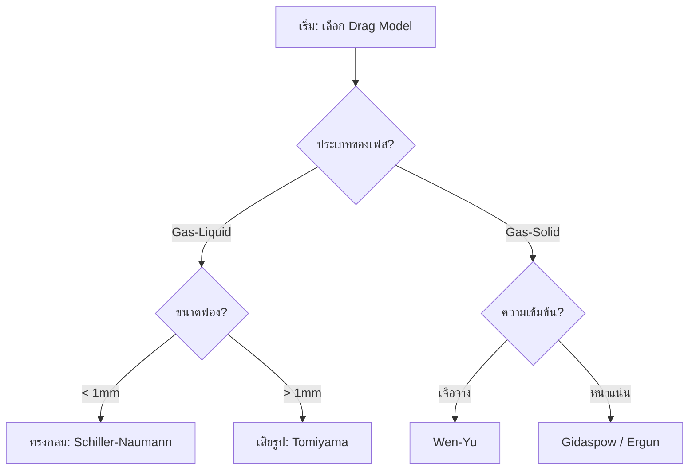
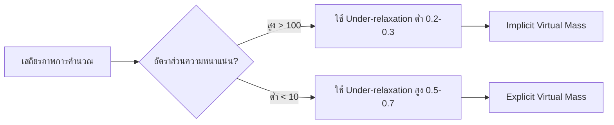

# ผังการเลือกแบบจำลอง (Model Selection Flowchart)

## 1. บทนำ (Introduction)

การเลือกแบบจำลองที่เหมาะสมเป็นกระบวนการเชิงระบบที่ต้องพิจารณาตั้งแต่ประเภทของเฟสไปจนถึงระบอบการไหล ผังงานนี้ช่วยให้การตั้งค่า OpenFOAM เป็นไปอย่างถูกต้องตามหลักฟิสิกส์

---

## 2. ขั้นตอนการเลือกแบบจำลองย่อย (Sub-model Selection Flow)

### 2.1 การเลือก Drag Model (แรงฉุด)
เริ่มจากการระบุลักษณะทางกายภาพของเฟสกระจาย:

### 2.2 การเลือก Lift Model (แรงยก)
พิจารณาความสำคัญของการเคลื่อนที่แนวขวาง:

| เงื่อนไข | โมเดลแนะนำ | เหตุผล |
|----------|------------|--------|
| อนุภาคแข็ง $Re_p < 1000$ | **Saffman-Mei** | จัดการแรงเฉือนได้ดี |
| ฟองอากาศในของเหลว | **Tomiyama** | พิจารณาการเปลี่ยนทิศทางตามขนาดฟอง |
| ระบบที่ไม่เน้นแนวขวาง | **No Lift** | เพิ่มความเร็วในการคำนวณ |

---

## 3. ผังการตัดสินใจเชิงตัวเลข (Numerical Decision Flow)

นอกเหนือจากฟิสิกส์ ต้องพิจารณาความเสถียรของ Solver ด้วย:

---

## 4. รายการตรวจสอบการตั้งค่า (Implementation Checklist)

- [ ] **Phase Definition:** ระบุประเภทของเฟสถูกต้องใน `phaseProperties`
- [ ] **Dimensionless Numbers:** ตรวจสอบช่วง $Re_p$ และ $Eo$ ของระบบ
- [ ] **Interfacial Coupling:** เปิดใช้งานเทอม Drag, Lift, และ Virtual Mass ที่จำเป็น
- [ ] **Convergence:** ตั้งค่า Residual tolerance อย่างน้อย $10^{-6}$

การทำตามผังงานนี้จะช่วยลดความผิดพลาดในการตั้งค่าเคส Multiphase และช่วยให้ผลการจำลองมีความน่าเชื่อถือมากขึ้น
