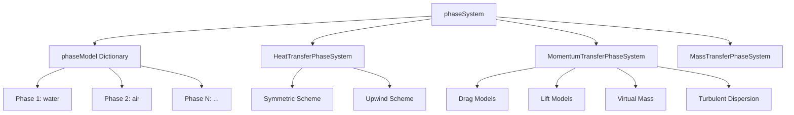
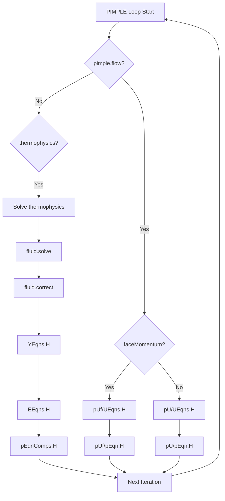

# ภาพรวมสถาปัตยกรรมการนำไปใช้งาน (Implementation Architecture Overview)

## บทนำ (Introduction)

`multiphaseEulerFoam` เป็น **Solver การไหลหลายเฟสแบบ Eulerian ขั้นสูงที่สุด** ใน OpenFOAM ที่ออกแบบมาเพื่อจำลองระบบที่มีเฟสของไหลกี่เฟสก็ได้ ($N$ phases) ที่ใช้ **สนามความดันร่วมกัน** (Shared Pressure Field) ในขณะที่แต่ละเฟสยังคงรักษาคุณสมบัติทางกายภาพและเทอร์โมไดนามิกส์ที่แยกออกจากกันอย่างเด็ดขาด

> [!INFO] ความสามารถหลักของ Solver
> Solver นี้เป็นตัวอย่างที่ยอดเยี่ยมของ **สถาปัตยกรรม C++ แบบ Template** ขั้นสูง ซึ่งรองรับ **การเลือกโมเดลฟิสิกส์ในขณะรันไทม์** (Run-time selectable physics models) เพื่อความยืดหยุ่นสูงสุดในการใช้งาน

---

## รากฐานทางคณิตศาสตร์ (Mathematical Foundation)

Solver นี้ใช้แนวทาง **Eulerian-Eulerian** โดยแต่ละเฟส $k$ ถูกพิจารณาว่าเป็นคอนตินิวอัม (Continuum) ที่แทรกซึมกัน และมีชุดสมการอนุรักษ์ของตัวเอง

### สมการความต่อเนื่อง (Continuity Equation)

สำหรับแต่ละเฟส $k$:

$$\frac{\partial (\alpha_k \rho_k)}{\partial t} + \nabla \cdot (\alpha_k \rho_k \mathbf{u}_k) = \sum_{l \neq k} \dot{m}_{lk}$$

โดยที่:
- $\alpha_k$: สัดส่วนปริมาตรของเฟส (Volume fraction) โดยมีเงื่อนไข $\sum_k \alpha_k = 1$
- $\rho_k$: ความหนาแน่นของเฟส (Phase density) [kg/m³]
- $\mathbf{u}_k$: เวกเตอร์ความเร็วของเฟส (Phase velocity vector) [m/s]
- $\dot{m}_{lk}$: อัตราการถ่ายโอนมวลจากเฟส $l$ ไปยังเฟส $k$ (Mass transfer rate) [kg/(m³·s)]

### สมการโมเมนตัม (Momentum Equation)

สำหรับแต่ละเฟสที่เคลื่อนที่ $k$:

$$\frac{\partial (\alpha_k \rho_k \mathbf{u}_k)}{\partial t} + \nabla \cdot (\alpha_k \rho_k \mathbf{u}_k \mathbf{u}_k) = -\alpha_k \nabla p + \nabla \cdot (\alpha_k \boldsymbol{\tau}_k) + \alpha_k \rho_k \mathbf{g} + \sum_{l \neq k} \mathbf{M}_{lk} + \mathbf{F}_{\sigma,k}$$

โดยที่:
- $p$: สนามความดันร่วม (Shared pressure field) [Pa]
- $\boldsymbol{\tau}_k$: เทนเซอร์ความเครียดของเฟส (Phase stress tensor): $\boldsymbol{\tau}_k = \mu_k (\nabla \mathbf{u}_k + \nabla \mathbf{u}_k^T) - \frac{2}{3}\mu_k (\nabla \cdot \mathbf{u}_k)\mathbf{I}$
- $\mathbf{g}$: เวกเตอร์ความโน้มถ่วง [m/s²]
- $\mathbf{M}_{lk}$: การถ่ายโอนโมเมนตัมระหว่างอินเตอร์เฟซ (Interfacial momentum transfer) จากเฟส $l$ ไปยังเฟส $k$ [N/m³]
- $\mathbf{F}_{\sigma,k}$: แรงตึงผิว (Surface tension force) [N/m³]
- $\mu_k$: ความหนืดไดนามิกของเฟส $k$ [Pa·s]
- $\mathbf{I}$: เทนเซอร์เอกลักษณ์

### สมการพลังงาน (Energy Equation)

$$\frac{\partial (\alpha_k \rho_k h_k)}{\partial t} + \nabla \cdot (\alpha_k \rho_k \mathbf{u}_k h_k) = \alpha_k \frac{\mathrm{d}p}{\mathrm{d}t} + \nabla \cdot (\alpha_k k_k \nabla T_k) + \sum_{l \neq k} Q_{lk} + \sum_{l \neq k} \dot{m}_{lk} h_{sat}$$

โดยที่:
- $h_k$: เอนทาลปีจำเพาะของเฟส (Specific phase enthalpy) [J/kg]
- $k_k$: สัมประสิทธิ์การนำความร้อนของเฟส (Phase thermal conductivity) [W/(m·K)]
- $T_k$: อุณหภูมิของเฟส $k$ [K]
- $Q_{lk}$: การถ่ายโอนความร้อนสัมผัส (Sensible heat transfer) จากเฟส $l$ ไปยังเฟส $k$ [W/m³]
- $h_{sat}$: เอนทาลปีอิ่มตัว (Saturation enthalpy) สำหรับการเปลี่ยนเฟส [J/kg]

---

## สถาปัตยกรรมหลัก (Core Architecture)

### ลำดับชั้นของระบบเฟส (Phase System Hierarchy)

OpenFOAM ใช้การจัดการเฟสแบบลำดับชั้นเพื่อให้รองรับฟิสิกส์ที่หลากหลาย:

```cpp
#include "phaseSystem.H"                          // Main phase management
#include "phaseCompressibleMomentumTransportModel.H"  // Phase-specific turbulence
```

> **📖 คำอธิบาย (Explanation)**
> 
> บล็อกโค้ดนี้แสดงการรวมไฟล์ส่วนหัวพื้นฐานสำหรับการจัดการระบบหลายเฟสใน OpenFOAM โดย:
> - `phaseSystem.H` เป็นไฟล์หลักที่ควบคุมการจัดการทุกเฟสในระบบ รวมถึงตารางการถ่ายโอนโมเมนตัมและความร้อน
> - `phaseCompressibleMomentumTransportModel.H` ให้คลาสพื้นฐานสำหรับโมเดลความปั่นป่วนเฉพาะเฟส
> 
> **หลักการสำคัญ:** การแยกแยะระหว่าง phase system (การจัดการทั้งระบบ) กับ phase models (คุณสมบัติเฉพาะเฟส) ทำให้สถาปัตยกรรมมีความยืดหยุ่นสูง

**คลาสหลัก:**
- **`phaseSystem.H`**: กำหนดโครงสร้างพื้นฐาน เช่น:
  - `momentumTransferTable`: ตารางการถ่ายโอนโมเมนตัม
  - `heatTransferTable`: ตารางการถ่ายโอนความร้อน
  - `specieTransferTable`: ตารางการถ่ายโอนชนิดสาร
  - `PtrListDictionary<phaseModel>`: พจนานุกรมโมเดลเฟสสำหรับการเข้าถึงเฟสแบบเป็นระบบ
  - `phaseInterfaceKey`: การจัดการอินเตอร์เฟซสำหรับการระบุคู่เฟส

- **`phaseModel`**: คลาสที่เก็บข้อมูลสถานะของหนึ่งเฟส:
  - `U`: ฟิลด์ความเร็ว
  - `alpha`: ฟิลด์สัดส่วนปริมาตร
  - `rho`: ฟิลด์ความหนาแน่น
  - `T`: ฟิลด์อุณหภูมิ
  - `thermo()`: เทอร์โมไดนามิกส์ของเฟส

### รูปแบบการออกแบบแบบเทมเพลต (Template Design Patterns)

สถาปัตยกรรมนี้ใช้ C++ Templates อย่างกว้างขวางเพื่อความยืดหยุ่นในรันไทม์:

#### Phase Model Templates
- **เฟสอัดตัวไม่ได้** (Incompressible): สมการสถานะ `isochoric`
- **เฟสอัดตัวได้** (Compressible): สมการสถานะ `perfectGas`, `realGas`
- **การขนส่งชนิด** (Species Transport): โมเดลเฟสหลายส่วนประกอบ
- **โมเดลปฏิกิริยา** (Reaction Models): ปฏิกิริยาเคมีภายในเฟส

#### Transfer System Templates
- **`HeatTransferPhaseSystem`**: การเชื่อมต่อความร้อนและ Latent heat
  ```cpp
  virtual tmp<volScalarField> L
  (
      const phaseInterface& interface,
      const volScalarField& dmdtf,
      const volScalarField& Tf,
      const latentHeatScheme scheme
  ) const = 0;
  ```

  > **📖 คำอธิบาย (Explanation)**
  > 
  > โค้ดนี้แสดง **virtual function** สำหรับการคำนวณ **latent heat** (ความร้อนแฝง) ในกระบวนการถ่ายโอนความร้อนระหว่างเฟส โดย:
  > - `tmp<volScalarField>`: ใช้ smart pointer เพื่อการจัดการหน่วยความจำอัตโนมัติ
  > - `phaseInterface&`: อ้างอิงถึงอินเตอร์เฟซระหว่างสองเฟส
  > - `dmdtf`: อัตราการเปลี่ยนสภาพของเฟส (mass transfer rate)
  > - `Tf`: อุณหภูมิที่อินเตอร์เฟซ
  > - `latentHeatScheme`: รูปแบบการคำนวณ (Symmetric/Upwind)
  > 
  > **แนวคิดสำคัญ:** การใช้ `virtual` และ `= 0` ทำให้เป็น **pure virtual function** ซึ่งบังคับให้คลาสลูกต้อง implement วิธีการคำนวณของตัวเอง
  
  - รูปแบบสมมาตร (Symmetric): การ Discretize แบบกลางสำหรับความแม่นยำ
  - รูปแบบอัพวินด์ (Upwind): อัพวินด์ไบแอสสำหรับเสถียรภาพทางตัวเลข

- **`MomentumTransferPhaseSystem`**: จัดการ Drag, Lift, Virtual Mass, และ Turbulent Dispersion
- **`MassTransferPhaseSystem`**: จัดการการระเหย (Evaporation) และการควบแน่น (Condensation)



---

## อัลกอริทึมของ Solver (Solver Algorithm)

### การกำหนดค่าเริ่มต้นของ Fields และ Models

โปรแกรมแก้ปัญหาเริ่มต้นโดยการกำหนดค่าเริ่มต้นของ fields และโมเดลทางฟิสิกส์ทั้งหมดที่จำเป็น:

```cpp
#include "postProcess.H"           // Post-processing framework
#include "setRootCaseLists.H"      // Case directory management
#include "createTime.H"            // Temporal discretization setup
#include "createMesh.H"            // Finite volume mesh creation
#include "createDyMControls.H"     // Dynamic mesh controls
#include "createFields.H"          // Field initialization
#include "createFieldRefs.H"       // Field reference management
```

> **📖 คำอธิบาย (Explanation)**
> 
> บล็อกโค้ดนี้แสดง **ลำดับการเริ่มต้นมาตรฐาน** ของ solver ใน OpenFOAM โดย:
> - แต่ละไฟล์ `.H` มีหน้าที่เฉพาะในการตั้งค่าส่วนต่างๆ ของระบบ
> - การแยกโค้ดออกเป็นไฟล์เหล่านี้ทำให้ง่ายต่อการบำรุงรักษาและทำให้โค้ดเป็น modular
> - การเรียกใช้ตามลำดับนี้มีความสำคัญเพื่อให้แน่ใจว่า dependencies ถูกต้อง
> 
> **แนวคิดสำคัญ:** การแยกส่วนการตั้งค่า (initialization) ออกจาก logic หลักของ solver ทำให้โค้ดเป็นระเบียบและอ่านง่าย

กระบวนการกำหนดค่าเริ่มต้นนี้สร้าง:
- **Phase fraction fields** ($\alpha_k$) สำหรับแต่ละเฟส
- **Velocity fields** ($\mathbf{u}_k$) สำหรับแต่ละเฟส
- **Pressure field** ($p$)
- **Temperature fields** ($T_k$) หากมีการแก้สมการพลังงาน
- **Thermophysical models** สำหรับแต่ละเฟส
- **Transport models** (ความหนืด, ความนำความร้อน)
- **Turbulence models** หากมีความเกี่ยวข้อง

### ระบบการกำหนดค่ารันไทม์

**ตัวเลือกขั้นสูงของโปรแกรมแก้สมการ** สำหรับความเสถียรและความแม่นยำที่ดีขึ้น:

```cpp
Switch faceMomentum
(
    pimple.dict().lookupOrDefault<Switch>("faceMomentum", false)
);
Switch partialElimination
(
    pimple.dict().lookupOrDefault<Switch>("partialElimination", false)
);
```

> **📖 คำอธิบาย (Explanation)**
> 
> โค้ดนี้แสดง **การอ่านค่าตัวเลือกจากไฟล์ dictionary** (เช่น `fvSolution`) โดย:
> - `faceMomentum`: ใช้ discretization แบบ face-based สำหรับสมการโมเมนตัม (เสถียรกว่าสำหรับ Courant number สูง)
> - `partialElimination`: เปิดใช้อัลกอริทึมการกำจัดเทอม drag บางส่วน (ช่วยการลู่เข้า)
> - `lookupOrDefault`: อ่านค่าจาก dictionary หากไม่พบให้ใช้ค่า default (false)
> 
> **แนวคิดสำคัญ:** Run-time selection ทำให้ผู้ใช้สามารถปรับแต่ง numeric schemes โดยไม่ต้อง recompile

- **โมเมนตัมแบบใบหน้า** (Face-based Momentum): ความเสถียรที่ดีขึ้นสำหรับเลข Courant สูง
- **การกำจัดบางส่วน** (Partial Elimination): การบรรจบกันที่ดีขึ้นสำหรับการไหลที่มีอัตราส่วนความหนาแน่นสูง

### วงจรอัลกอริทึม PIMPLE

ใช้การเชื่อมต่อความดัน-ความเร็วแบบไฮบริด (Hybrid Pressure-Velocity Coupling) ซึ่งรวมเอาข้อดีของ SIMPLE (สำหรับ Steady-state) และ PISO (สำหรับ Transient) เข้าด้วยกัน:

```cpp
while (pimple.loop())  // PIMPLE correction loop
{
    if (!pimple.flow())
    {
        // Solve thermophysics only
        if (pimple.thermophysics()) {
            fluid.solve(rAUs, rAUfs);
            fluid.correct();
            fluid.correctContinuityError();
            #include "YEqns.H"    // Species transport
            #include "EEqns.H"    // Energy equation
            #include "pEqnComps.H" // Compressible pressure
        }
    }
    else
    {
        // Full flow solution with momentum coupling
        if (faceMomentum) {
            #include "pUf/UEqns.H"  // Face-based momentum
            #include "pUf/pEqn.H"   // Face-based pressure
        } else {
            #include "pU/UEqns.H"   // Cell-based momentum
            #include "pU/pEqn.H"    // Cell-based pressure
        }
    }
}
```

> **📖 คำอธิบาย (Explanation)**
> 
> โค้ดนี้แสดง **โครงสร้างหลักของ PIMPLE loop** ซึ่งเป็นหัวใจของ solver โดย:
> - `pimple.loop()`: วนซ้ำจนกว่าจะบรรจบกัน (convergence) หรือถึงจำนวนรอบสูงสุด
> - `pimple.flow()`: ตรวจสอบว่าต้องแก้สมการโมเมนตัมหรือไม่ (thermophysics-only mode)
> - `faceMomentum`: เลือกใช้ discretization แบบ face-based หรือ cell-based
> - `#include` directives: รวมไฟล์ที่มีสมการต่างๆ ซึ่งถูกแยกออกเพื่อความชัดเจน
> 
> **แนวคิดสำคัญ:** การแยก logic ออกเป็นไฟล์เหล่านี้ทำให้สามารถเลือกใช้ numeric schemes ที่แตกต่างกันได้โดยไม่ต้องแก้โค้ดหลัก



---

## การ Discretize สมการโมเมนตัม (Momentum Discretization)

### Face-based vs Cell-based Momentum

#### โมเมนตัมแบบใบหน้า (`pUf/UEqns.H`)
- **การอนุรักษ์ที่ดีขึ้น**: คุณสมบัติการอนุรักษ์มวลที่ดีขึ้น
- **ความเสถียร**: ความทนทานต่อเลข Courant สูงขึ้น
- **การจับกังหัน**: การแก้ไขความต่อเนื่องที่ดีขึ้น

#### โมเมนตัมแบบเซลล์ (`pU/UEqns.H`)
- **ความเรียบง่าย**: แนวทางปริมาตรจำกัดแบบดั้งเดิม
- **ประสิทธิภาพ**: ต้นทุนการคำนวณที่ต่ำกว่า
- **ความเข้ากันได้**: การจัดการเงื่อนไขขอบเขตมาตรฐาน

### การถ่ายโอนโมเมนตัมระหว่างอินเตอร์เฟซ (Interfacial Momentum Transfer)

โปรแกรมแก้สมการคำนวณ **การถ่ายโอนโมเมนตัมระหว่างอินเตอร์เฟซ** ผ่านกลไกหลายอย่าง:

#### แรงลาก (Drag Force)
$$\mathbf{M}_{drag,kl} = K_{drag,kl} (\mathbf{u}_l - \mathbf{u}_k)$$

โดยที่ $K_{drag,kl}$ คือ **สัมประสิทธิ์แรงลาก** ระหว่างเฟส $k$ และ $l$

#### แรงยก (Lift Force)
$$\mathbf{M}_{lift,kl} = C_{lift} \rho_k \alpha_k (\mathbf{u}_k - \mathbf{u}_l) \times (\nabla \times \mathbf{u}_k)$$

#### แรงมวลเสมือน (Virtual Mass Force)
$$\mathbf{M}_{vm,kl} = C_{vm} \rho_k \alpha_l \left(\frac{\mathrm{d}\mathbf{u}_k}{\mathrm{d}t} - \frac{\mathrm{d}\mathbf{u}_l}{\mathrm{d}t}\right)$$

#### การกระจายตัวแบบปั่นป่วน (Turbulent Dispersion)
$$\mathbf{M}_{td,kl} = C_{td} \rho_k \nabla \cdot (\mu_{t,k} \nabla \alpha_k)$$

### การประกอบเมทริกซ์และการแก้ไข

แต่ละเฟสสร้าง **เมทริกซ์ปริมาตรจำกัด** ของตัวเอง:

```cpp
UEqns.set
(
    phase.index(),
    new fvVectorMatrix
    (
        phase.UfEqn()                    // Phase momentum equation
     ==
       *momentumTransfer[phase.name()]   // Interfacial transfer terms
      + fvModels.source(alpha, rho, U)  // Source terms (gravity, etc.)
    )
);
```

> **📖 คำอธิบาย (Explanation)**
> 
> โค้ดนี้แสดง **การประกอบเมทริกซ์สมการโมเมนตัม** สำหรับแต่ละเฟส โดย:
> - `UEqns.set()`: ตั้งค่าเมทริกซ์สำหรับเฟสที่ระบุโดย `phase.index()`
> - `phase.UfEqn()`: สร้างสมการโมเมนตัมเฉพาะเฟส (convection, diffusion, pressure gradient)
> - `momentumTransfer[phase.name()]`: เพิ่มเทอม interfacial forces (drag, lift, virtual mass, etc.)
> - `fvModels.source()`: เพิ่มเทอมแหล่งกำเนิดภายนอก (เช่น แรงโน้มถ่วง)
> 
> **แนวคิดสำคัญ:** การใช้ pointer dereference (`*`) กับ `momentumTransfer` แสดงว่าเป็น smart pointer ที่จัดการหน่วยความจำอัตโนมัติ

**การดำเนินการเมทริกซ์**:
```cpp
UEqns[phase.index()].relax();        // Relaxation for stability
fvConstraints.constrain(UEqns[phase.index()]);  // Apply constraints
U.correctBoundaryConditions();      // Ensure boundary consistency
```

> **📖 คำอธิบาย (Explanation)**
> 
> โค้ดนี้แสดง **ขั้นตอนสุดท้ายก่อนการแก้สมการ** โดย:
> - `relax()`: ผ่อนคลายเมทริกซ์เพื่อเพิ่มความเสถียร (under-relaxation)
> - `fvConstraints.constrain()`: ใช้ constraints ที่ผู้ใช้กำหนด (เช่น รักษาค่าต่ำสุด/สูงสุด)
> - `correctBoundaryConditions()`: อัปเดตค่าบน boundaries ให้สอดคล้องกับค่าภายใน domain
> 
> **แนวคิดสำคัญ:** การทำ under-relaxation และการใช้ constraints เป็นเทคนิคสำคัญในการรับประกันความเสถียรของการแก้สมการในระบบหลายเฟส

---

## คุณสมบัติทางตัวเลขขั้นสูง (Advanced Numerical Features)

### Partial Elimination Algorithm (PEA)

ใช้เพื่อเพิ่มความเสถียรในการคำนวณกรณีที่มีแรง Drag สูง (High density ratio) โดยการกำจัดเทอม Drag ออกจากสมการความดันผ่านการจัดการพีชคณิต ช่วยให้การลู่เข้า (Convergence) ดีขึ้นอย่างมาก

```cpp
if (partialElimination)
{
    fluid.partialEliminationf(rAUfs, alphafs, phiKdPhifs);
}
```

> **📖 คำอธิบาย (Explanation)**
> 
> โค้ดนี้แสดง **การเรียกใช้อัลกอริทึม Partial Elimination** โดย:
> - `partialElimination`: ตัวแปร boolean ที่ควบคุมการเปิด/ปิดอัลกอริทึม
> - `fluid.partialEliminationf()`: เมธอดที่ดำเนินการ PEA สำหรับ face-based formulation
> - `rAUfs`: ตัวแปรที่เก็บค่า inverse of diagonal coefficients ของเมทริกซ์โมเมนตัม
> - `alphafs`: Phase fractions บน faces
> - `phiKdPhifs`: Fluxes ที่เกี่ยวข้องกับ drag coefficients
> 
> **แนวคิดสำคัญ:** PEA ช่วย **กำจัดเทอม drag ออกจาก pressure equation** ทำให้ pressure-velocity coupling ดีขึ้น โดยเฉพาะสำหรับระบบที่มี density ratio สูง (เช่น gas-solid)

เทคนิคนี้ **กำจัดเทอมแรงลาก** จากสมการความดันผ่านการจัดการพีชคณิต ซึ่งปรับปรุงลักษณะการบรรจบกัน

### Local Time Stepping (LTS)

ใช้สำหรับการเร่งการคำนวณเข้าสู่สถานะคงที่ (Steady-state acceleration) โดยการก้าวเวลาที่แตกต่างกันในแต่ละพื้นที่ของเมช:

```cpp
if (LTS)
{
    #include "setRDeltaT.H"  // Local time step calculation
    if (faceMomentum)
    {
        #include "setRDeltaTf.H"  // Face-based time stepping
    }
}
```

> **📖 คำอธิบาย (Explanation)**
> 
> โค้ดนี้แสดง **การใช้ Local Time Stepping (LTS)** ซึ่งเป็นเทคนิคในการเร่งการบรรจบกันสู่ steady-state โดย:
> - `LTS`: ตัวแปร boolean ที่เปิด/ปิดการใช้ LTS
> - `setRDeltaT.H`: ไฟล์ที่คำนวณและกำหนด time step ที่แตกต่างกันในแต่ละ cell
> - `setRDeltaTf.H`: ไฟล์ที่คำนวณ time step บน faces สำหรับ face-based formulation
> 
> **แนวคิดสำคัญ:** LTS ใช้ **time step ที่แตกต่างกันในแต่ละ cell** โดยพิจารณาจากขนาด cell และความเร็วของการไหล ทำให้สามารถบรรลุ steady-state ได้เร็วขึ้นอย่างมาก แต่ไม่สามารถใช้สำหรับ transient simulations ที่ต้องการความแม่นยำทางเวลา

### การควบคุม Courant Number

**สมการหลัก**:
$$\text{Co} = \frac{\Delta t \cdot |\mathbf{u}|}{\Delta x}$$

**นิยามตัวแปร**:
- $\text{Co}$: Courant number
- $\Delta t$: Time step
- $|\mathbf{u}|$: ความเร็วของของไหล
- $\Delta x$: ขนาดเซลล์

Courant numbers สูงสุดถูกคำนวณสำหรับแต่ละเฟสเพื่อให้แน่ใจถึงเสถียรภาพเชิงตัวเลข:
$$\text{Co}_{max} = \max\left(\frac{\Delta t \cdot |\mathbf{u}_k|}{\Delta x_k}\right) \quad \forall k$$

---

## สถาปัตยกรรมโมเดล (Model Architecture)

### ลำดับชั้นโมเดลการลากตัว (Drag Model Hierarchy)

ลำดับชั้นโมเดลการลากตัวใน OpenFOAM ให้กรอบการทำงานที่ยืดหยุ่นสำหรับการคำนวณการถ่ายเทโมเมนตัมระหว่างเฟส

**คลาสฐาน `dragModel`** ทำหน้าที่เป็นอินเตอร์เฟซนามธรรม:

```cpp
// Base drag model
class dragModel
{
public:
    // Virtual destructor
    virtual ~dragModel() {}

    // Calculate drag force
    virtual tmp<volVectorField> F
    (
        const phaseModel& phase1,
        const phaseModel& phase2
    ) const = 0;

    // Factory method for model creation
    static autoPtr<dragModel> New
    (
        const dictionary& dict,
        const phasePair& pair
    );
};
```

> **📖 คำอธิบาย (Explanation)**
> 
> โค้ดนี้แสดง **โครงสร้างของ drag model base class** โดย:
> - `virtual ~dragModel()`: Virtual destructor สำหรับการ cleanup ที่ถูกต้องใน inheritance
> - `virtual tmp<volVectorField> F()`: Pure virtual function ที่บังคับให้ derived classes ต้อง implement
> - `static autoPtr<dragModel> New()`: Factory method สำหรับการสร้าง model จาก dictionary ใน runtime
> 
> **แนวคิดสำคัญ:** การใช้ **Runtime Selection (RTS)** ทำให้สามารถเลือกโมเดลที่ต้องการผ่านไฟล์ dictionary โดยไม่ต้อง recompile

### โมเดลเฉพาะ: Schiller-Naumann Drag

**คุณสมบัติ:**
- **เหมาะสำหรับการไหลของฟองกระจาย** (dispersed bubble flow)
- **ใช้งานได้ดีกับจำนวน Reynolds ต่ำถึงปานกลาง**

**สมการความสัมพันธ์ของสัมประสิทธิ์การลากตัว:**
$$C_D = \begin{cases}
24(1 + 0.15 Re^{0.687}) / Re & \text{if } Re < 1000 \\
0.44 & \text{if } Re \geq 1000
\end{cases}$$

**ตัวแปรในสมการ:**
- $C_D$ = สัมประสิทธิ์การลากตัว (drag coefficient)
- $Re$ = จำนวน Reynolds สัมพัทธ์ระหว่างเฟส: $Re = \rho_p |\mathbf{u}_p - \mathbf{u}_c| d_p / \mu_c$
  - $\rho_p$ = ความหนาแน่นของอนุภาค
  - $\mathbf{u}_p, \mathbf{u}_c$ = เวกเตอร์ความเร็วของเฟสและเฟสต่อเนื่อง
  - $d_p$ = เส้นผ่านศูนย์กลางอนุภาค
  - $\mu_c$ = ความหนืดของเฟสต่อเนื่อง

### การผสมผสานโมเดลความปั่นป่วน

กรอบการทำงานโมเดลความปั่นป่วนแบบหลายเฟสขยายแนวทางการจำลองความปั่นป่วนแบบเฟสเดียวเพื่อจัดการกับหลายเฟสที่โต้ตอบกัน

**คลาส `phaseCompressibleTurbulenceModel`:**
```cpp
class phaseCompressibleTurbulenceModel
:
    public compressible::turbulenceModel
{
protected:
    const phaseModel& phase_;
    const phaseSystem& phaseSystem_;

public:
    // Calculate Reynolds stress
    virtual tmp<volSymmTensorField> R() const;

    // Calculate turbulent viscosity
    virtual tmp<volScalarField> mut() const;

    // Correction step
    virtual void correct();
};
```

> **📖 คำอธิบาย (Explanation)**
> 
> โค้ดนี้แสดง **โครงสร้างของ turbulence model สำหรับ multiphase** โดย:
> - สืบทอดจาก `compressible::turbulenceModel` ซึ่งเป็น base class สำหรับ single-phase
> - `phase_`: อ้างอิงถึง phase ที่โมเดลนี้คำนวณ
> - `phaseSystem_`: อ้างอิงถึงระบบทั้งหมดเพื่อเข้าถึง phases อื่นๆ
> - `R()`: คำนวณ Reynolds stress tensor สำหรับ phase นี้
> - `mut()`: คำนวณ turbulent viscosity ของ phase
> - `correct()`: อัปเดตค่า turbulence ทุก time step
> 
> **แนวคิดสำคัญ:** การออกแบบนี้ทำให้แต่ละ phase มี **turbulence model ของตัวเอง** ซึ่งสามารถโต้ตอบกับ phases อื่นผ่าน `phaseSystem_`

**เมธอดสำคัญ:**

1. **การคำนวณความเค้น Reynolds (`R()`)**
   $$\mathbf{R}_k = -\rho_k \overline{\mathbf{u}'_k \mathbf{u}'_k}$$

2. **ความหนืดความปั่นป่วน (`mut()`)**
   $$\mu_{t,k} = \rho_k C_\mu \frac{k_k^2}{\epsilon_k}$$

**โมเดลความปั่นป่วนที่รองรับ:**

| โมเดล | ชื่อใน OpenFOAM | คุณสมบัติ |
|--------|-------------------|------------|
| k-ε Standard | `kEpsilon` | แบบดั้งเดิม, เหมาะกับการไหลที่พัฒนาเต็มที่ |
| k-ω Standard | `kOmega` | ดีกับชั้นขอบเขตและความดันแปรผันต่ำ |
| k-ω SST | `kOmegaSST` | ผสมผสาน k-ε และ k-ω, ความแม่นยำสูง |
| Spalart-Allmaras | `SpalartAllmaras` | โมเดลสมการเดียว, ประหยัดค่าใช้จ่าย |

---

## การจัดการข้อมูลและหน่วยความจำ (Data and Memory Management)

### การจัดเก็บฟิลด์ (Field Storage)

ฟิลด์ใน OpenFOAM ถูกจัดระเบียบตามลำดับชั้นโดยใช้คลาสคอนเทนเนอร์ที่ใช้เทมเพลต:

**หลักการสำคัญ:**
- **การจัดเก็บตามประเภท**: ฟิลด์แต่ละประเภท (scalar, vector, tensor) ถูกจัดเก็บในตารางแฮชแยกกัน
- **ความปลอดภัยของประเภท**: รักษาความปลอดภัยของประเภทขณะที่อนุญาตการดำเนินการแบบ polymorphic
- **ประสิทธิภาพการเข้าถึง**: ใช้ `HashTable` สำหรับการเข้าถึงฟิลด์โดยใช้ชื่อได้อย่างมีประสิทธิภาพ O(1)

### การจัดการหน่วยความจำ (Memory Management)

#### Lazy Allocation

**Lazy Allocation** เป็นพื้นฐานของประสิทธิภาพหน่วยความจำของ OpenFOAM:

```cpp
template<class Type>
class multiphaseField
{
private:
    autoPtr<GeometricField<Type, fvPatchField, volMesh>> fieldPtr_;
    bool allocated_;

public:
    // Lazy allocation - allocate only on first access
    const GeometricField<Type, fvPatchField, volMesh>& field()
    {
        if (!allocated_)
        {
            fieldPtr_.reset(new GeometricField<Type, fvPatchField, volMesh>(...));
            allocated_ = true;
        }
        return fieldPtr_();
    }

    void clear()
    {
        fieldPtr_.clear();
        allocated_ = false;
    }
};
```

> **📖 คำอธิบาย (Explanation)**
> 
> โค้ดนี้แสดง **รูปแบบ Lazy Allocation** ที่ใช้ใน OpenFOAM โดย:
> - `autoPtr`: Smart pointer ที่เป็นเจ้าของพื้นที่หน่วยความจำโดย独占 (exclusive ownership)
> - `allocated_`: ตัวแปร flag ที่บอกว่า field ถูกจัดสรรแล้วหรือยัง
> - `field()`: เมธอด getter ที่จัดสรร field เฉพาะเมื่อถูกเรียกครั้งแรก
> - `clear()`: คืนพื้นที่หน่วยความจำเมื่อไม่ต้องการใช้แล้ว
> 
> **แนวคิดสำคัญ:** Lazy allocation ช่วย **ลดหน่วยความจำที่ใช้** โดยการสร้าง field เฉพาะเมื่อจำเป็น และช่วย **ลดเวลา startup** เนื่องจากไม่ต้องจัดสรร field ทั้งหมดตั้งแต่เริ่ม

ประโยชน์:
- **ลดขนาดหน่วยความจำที่ใช้**: จัดสรรเฉพาะ field ที่ใช้จริงเท่านั้น
- **การเริ่มต้นที่เร็วขึ้น**: หลีกเลี่ยงการสร้างที่มีค่าใช้จ่ายสูงระหว่างการตั้งค่า
- **การจัดการทรัพยากรที่ยืดหยุ่น**: Field สามารถสร้างและทำลายได้อย่างไดนามิก

#### Smart Pointer แบบ Reference-Counted

```cpp
// tmp<T> - automatic memory management
tmp<volScalarField> tfield = new volScalarField(mesh, dimensionedScalar("zero", dimless, 0.0));

// Auto-destruction when tfield goes out of scope
volScalarField& field = tfield.ref();
```

> **📖 คำอธิบาย (Explanation)**
> 
> โค้ดนี้แสดง **การใช้ tmp<T> smart pointer** ซึ่งเป็น reference-counted smart pointer โดย:
> - `tmp<volScalarField>`: Wrapper รอบๆ pointer ที่มี reference counting
> - `new`: สร้าง field ใหม่ซึ่ง tmp จะเป็นเจ้าของ
> - `ref()`: ดึง reference ถาวรออกมาจาก tmp
> - **Automatic destruction**: เมื่อ tmp ถูกทำลาย (ออกจาก scope) มันจะตรวจสอบ reference count และคืนหน่วยความจำถ้าไม่มีใครใช้
> 
> **แนวคิดสำคัญ:** tmp<T> ช่วย **ป้องกัน memory leak** โดยการจัดการหน่วยความจำอัตโนมัติผ่าน reference counting

คลาส `tmp` ให้การ **garbage collection** อัตโนมัติโดยอิงตามการนับ reference ป้องกันการรั่วไหลของหน่วยความจำ

### การแคชโมเดล (Model Caching)

**การแคชการคำนวณที่มีค่าใช้จ่ายสูง** เป็นสิ่งจำเป็นสำหรับประสิทธิภาพของ solver:

```cpp
class cachedCoefficientModel
{
private:
    mutable volScalarField cachedCoefficient_;
    mutable label lastUpdateTime_;

public:
    const volScalarField& coefficient() const
    {
        label currentTime = mesh().time().timeIndex();

        if (currentTime != lastUpdateTime_)
        {
            cachedCoefficient_ = calculateCoefficient();
            lastUpdateTime_ = currentTime;
        }

        return cachedCoefficient_;
    }

private:
    volScalarField calculateCoefficient() const
    {
        return expensiveCalculation();
    }
};
```

> **📖 คำอธิบาย (Explanation)**
> 
> โค้ดนี้แสดง **เทคนิค caching** สำหรับการลดการคำนวณซ้ำ โดย:
> - `mutable` keyword: อนุญาตให้แก้ไขค่าใน method ที่เป็น const (เพื่อ caching)
> - `cachedCoefficient_`: เก็บผลลัพธ์ที่คำนวณแล้ว
> - `lastUpdateTime_`: เก็บ time index ล่าสุดที่คำนวณ
> - `coefficient()`: getter method ที่ตรวจสอบว่าต้องคำนวณใหม่หรือไม่
> - `calculateCoefficient()`: method ที่มีค่าใช้จ่ายสูงซึ่งถูกเรียกเฉพาะเมื่อจำเป็น
> 
> **แนวคิดสำคัญ:** Caching ช่วย **ลดการคำนวณซ้ำ** โดยเก็บผลลัพธ์และคืนค่าเดิมหากยังอยู่ใน time step เดียวกัน

---

## การนำไปใช้งานแบบขนาน (Parallel Implementation)

### การแบ่งโดเมน (Domain Decomposition)

การนำไปใช้งานแบบขนานในการจำลองหลายเฟสของ OpenFOAM พึ่งพากลยุทธ์การแบ่งโดเมนที่ซับซ้อนเพื่อกระจายภาระการคำนวณ

**แนวทางพื้นฐาน:**
- **การแบ่งพื้นที่คำนาณ** ออกเป็นโดเมนย่อยๆ แต่ละโดเมนมอบหมายให้กับหน่วยประมวลผลที่ต่างกัน
- **กลไกการสื่อสาร** ที่เหมาะสมเพื่อรักษาความต่อเนื่องของสนาม
- **ความถูกต้องเชิงตัวเลข** ข้ามขอบเขตของหน่วยประมวลผล

### การซิงโครไนซ์สนาม (Field Synchronization)

เมธอด `synchronizeFields()` เป็นสิ่งสำคัญสำหรับรักษาความสม่ำเสมอเชิงตัวเลขข้ามโดเมนแบบกระจาย:

```cpp
void parallelPhaseModel::synchronizeFields()
{
    const fvPatchList& patches = mesh().boundary();

    forAll(patches, patchi)
    {
        if (patches[patchi].type() == processorFvPatch::typeName)
        {
            const processorFvPatchField<vector>& procPatch =
                refCast<const processorFvPatchField<vector>>(
                    U_.boundaryField()[patchi]
                );

            procPatch.initSwapFields();
        }
    }

    forAll(patches, patchi)
    {
        if (patches[patchi].type() == processorFvPatch::typeName)
        {
            const processorFvPatchField<vector>& procPatch =
                refCast<const processorFvPatchField<vector>>(
                    U_.boundaryField()[patchi]
                );

            procPatch.swapFields();
        }
    }
}
```

> **📖 คำอธิบาย (Explanation)**
> 
> โค้ดนี้แสดง **การซิงโครไนซ์ field ข้าม processor boundaries** โดย:
> - Loop แรก (`initSwapFields`): เตรียมการสำหรับการแลกเปลี่ยนข้อมูล (allocate buffers)
> - Loop ที่สอง (`swapFields`): ดำเนินการส่งและรับข้อมูลจริง
> - `processorFvPatch`: Patch type พิเศษสำหรับ boundaries ระหว่าง processors
> - `refCast`: Cast ชนิดข้อมูลอย่างปลอดภัยใน runtime
> 
> **แนวคิดสำคัญ:** การแยก initialization และ execution ออกจากกันทำให้ **optimize communication** โดยการรวม messages ทั้งหมดแล้วส่งพร้อมกัน (non-blocking communication)

### การทำสมดุลภาระ (Load Balancing)

การทำสมดุลภาระที่มีประสิทธิภาพเป็นสิ่งจำเป็นสำหรับการบรรลุประสิทธิภาพแบบขนานที่เหมาะสมที่สุด

**ความท้าทายของภาระการคำนวณ:**
- **ความแตกต่างในฟิสิกส์** ระหว่างเฟส
- **ความละเอียดของ mesh** ที่แตกต่างกัน
- **การกระจายตัวของเฟส** ในโดเมนคำนวณ

**ประสิทธิภาพการปรับขนาด:**
- การปรับขนาดเกือบเป็นเส้นตรงถึงหลายพันคอร์ของโปรเซสเซอร์
- สามารถจำลองระบบหลายเฟสในอุตสาหกรรมขนาดใหญ่ด้วยเซลล์การคำนวณหลายล้านเซลล์ได้

---

## การกำหนดค่าใช้งาน (Implementation Configuration)

### ตัวอย่างไฟล์ `constant/phaseProperties`

```openfoam
phases (water air);

water
{
    phaseModel      incompressible;
    equationOfState isochoric;
    thermo          hConst;
    transport       const;
}

air
{
    phaseModel      compressible;
    equationOfState perfectGas;
    thermo          hConst;
    transport       const;
}

phaseSystem
{
    type            momentumTransferPhaseSystem;
    interfacialModels
    {
        drag
        {
            type        SchillerNaumann;
            blended     true;
        }
    }
}
```

> **📖 คำอธิบาย (Explanation)**
> 
> ไฟล์นี้แสดง **การกำหนดค่า phases และ interfacial models** โดย:
> - `phases (water air)`: ระบุ phases ที่มีในระบบ
> - `phaseModel`: ระบุว่าเฟสเป็น incompressible หรือ compressible
> - `equationOfState`: สมการสถานะของเฟส (isochoric = ความหนาแน่นคงที่)
> - `thermo`: โมเดลเทอร์โมไดนามิกส์ (hConst = enthalpy คงที่)
> - `transport`: โมเดลการขนส่ง (const = viscosity คงที่)
> - `interfacialModels`: โมเดล interfacial forces (drag, lift, etc.)
> - `blended`: ใช้ blended scheme สำหรับ drag calculation
> 
> **แนวคิดสำคัญ:** ไฟล์นี้แสดงพลังของ **Runtime Selection** ทำให้ผู้ใช้สามารถเปลี่ยน physics models โดยไม่ต้อง recompile

### ตัวอย่างไฟล์ `system/fvSolution`

```openfoam
PIMPLE
{
    nCorrectors     2;
    nAlphaCorr      1;
    faceMomentum    yes;
    partialElimination yes;
}

solvers
{
    p_rgh
    {
        solver          GAMG;
        tolerance       1e-7;
        relTol          0.01;
    }

    "U.*"
    {
        solver          PBiCGStab;
        preconditioner  DILU;
        tolerance       1e-06;
        relTol          0.1;
    }

    "h.*"
    {
        solver          PBiCGStab;
        preconditioner  DILU;
        tolerance       1e-06;
        relTol          0.1;
    }
}
```

> **📖 คำอธิบาย (Explanation)**
> 
> ไฟล์นี้แสดง **การตั้งค่า solvers และ PIMPLE parameters** โดย:
> - `nCorrectors`: จำนวนรอบการแก้ไข pressure equation
> - `nAlphaCorr`: จำนวนรอบการแก้ไข phase fraction
> - `faceMomentum`: เปิดใช้ face-based momentum discretization
> - `partialElimination`: เปิดใช้อัลกอริทึม PEA
> - `GAMG`: Geometric-Algebraic Multi-Grid solver (เหมาะกับ pressure)
> - `PBiCGStab`: Preconditioned Bi-Conjugate Gradient Stabilized (เหมาะกับ vector fields)
> - `DILU`: Diagonal Incomplete LU preconditioner
> - `tolerance` และ `relTol`: ค่าความคลาดเคลื่อนสัมบูรณ์และสัมพัทธ์
> 
> **แนวคิดสำคัญ:** การเลือก solver และ parameters มีผลต่อ **speed of convergence** และ **stability** ของ simulation

### การควบคุมโปรแกรมแก้สมการ

| พารามิเตอร์ | ค่าตัวอย่าง | คำอธิบาย |
|---------------|---------------|-----------|
| `nCorrectors` | 2 | จำนวนตัวแก้ไขความดัน |
| `nAlphaCorr` | 1 | ตัวแก้ไขสัดส่วนเฟส |
| `faceMomentum` | yes | ใช้โมเมนตัมแบบใบหน้า |
| `partialElimination` | yes | ใช้อัลกอริทึมการกำจัดบางส่วน |

---

## สรุป (Summary)

สถาปัตยกรรมของ `multiphaseEulerFoam` แสดงให้เห็นถึงการนำหลักการของพลศาสตร์ของไหลเชิงคำนวณมาประยุกต์ใช้อย่างยอดเยี่ยมผ่านแนวปฏิบัติทางวิศวกรรมซอฟต์แวร์ที่ซับซ้อน

### ความยอดเยี่ยมในการออกแบบเชิงวัตถุ

- **ลำดับชั้นของโมเดลเฟส**: แต่ละเฟสถูกแสดงด้วยคลาสเฉพาะที่สืบทอดจากเทมเพลตฐาน `phaseModel`
- **การนำโมเดลฟิสิกส์มาใช้**: โมเดลความปั่นป่วน การถ่ายเทความร้อน และการถ่ายเทโมเมนตัมระหว่างอินเตอร์เฟซ ใช้ส่วนติดต่อที่สม่ำเสมอ
- **เทมเพลตเมตาโปรแกรมมิ่ง**: การใช้เทมเพลต C++ อย่างกว้างขวางทำให้เกิดพฤติกรรมแบบ polymorphic ขณะคอมไพล์

### กรอบการทำงานแบบยืดหยุ่น

สถาปัตยกรรมของ Solver รองรับความยืดหยุ่นในการเลือกและรวมโมเดลการปิดแบบไม่เคยมีมาก่อน ช่วยให้นักวิจัยสามารถนำโมเดลการปิดใหม่ๆ มาใช้และทดสอบได้ง่าย

### ความเป็นเลิศด้านการคำนวณ

- **ความเข้มงวดทางคณิตศาสตร์**: รักษาหลักการอนุรักษ์ในขณะที่นำวิธีการเชิงตัวเลขที่เป็นประโยชน์มาใช้
- **เสถียรภาพทางตัวเลข**: ใช้รูปแบบตัวเลขที่จำกัดขอบเขตและกลยุทธ์ under-relaxation
- **ประสิทธิภาพการคำนวณ**: ปรับแบบรูปแบบการเข้าถึงหน่วยความจำและลดการคำนวณซ้ำซ้อน
- **ความสามารถในการขยาย**: ให้ส่วนติดต่อที่ชัดเจนสำหรับนำโมเดลฟิสิกส์และวิธีการเชิงตัวเลขใหม่ๆ มาใช้

สถาปัตยกรรมของ `multiphaseEulerFoam` นี้ช่วยให้ผู้ใช้สามารถจำลองปรากฏการณ์ที่ซับซ้อน เช่น เครื่องปฏิกรณ์คอลัมน์ฟอง (Bubble column reactors) หรือการวิเคราะห์ความปลอดภัยในเครื่องปฏิกรณ์นิวเคลียร์ ได้อย่างมีประสิทธิภาพและแม่นยำ

---

*อ้างอิง: วิเคราะห์ตามซอร์สโค้ด OpenFOAM `multiphaseEulerFoam.C`, `phaseSystem.H` และ `HeatTransferPhaseSystem.H`*

**📂 Source:**
- `.applications/solvers/multiphase/multiphaseEulerFoam/`
- `src/phaseSystemModels/phaseSystem/phaseSystem.H`
- `src/phaseSystemModels/phaseSystem/heatTransferPhaseSystem/heatTransferPhaseSystem.H`