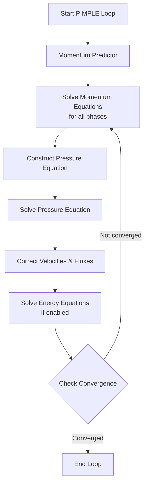
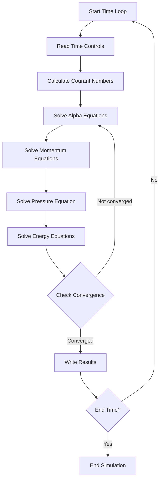

# สถาปัตยกรรมโค้ดของ MultiphaseEulerFoam (Code Architecture)

## 1. บทนำ (Overview)

`multiphaseEulerFoam` เป็น Solver ที่แสดงถึงความก้าวหน้าสูงสุดของ OpenFOAM ในด้านการไหลหลายเฟส โดยใช้สถาปัตยกรรม **Object-Oriented** และ **Advanced C++ Templates** เพื่อจัดการกับระบบที่มีจำนวนเฟสเท่าใดก็ได้ที่ใช้สนามความดันร่วมกัน แต่รักษาคุณสมบัติเฉพาะของแต่ละเฟสไว้ได้อย่างอิสระ

### หลักการออกแบบหลัก

> [!INFO] หลักการสำคัญของสถาปัตยกรรม
> - **Modularity**: แต่ละเฟสและโมเดลฟิสิกส์ถูกแยกออกจากกันอย่างชัดเจน
> - **Extensibility**: สามารถเพิ่มโมเดลใหม่โดยไม่ต้องแก้ไขโครงสร้างหลัก
> - **Type Safety**: ใช้ Template C++ เพื่อความปลอดภัยของประเภทข้อมูล
> - **Performance**: การจัดการหน่วยความจำอย่างมีประสิทธิภาพ

---

## 2. ลำดับชั้นของคลาสหลัก (Core Class Hierarchy)

### 2.1 คลาส `phaseModel`

เป็นคลาสที่เก็บข้อมูลและพฤติกรรมของหนึ่งเฟส (Single phase) โดยห่อหุ้มฟิลด์และคุณสมบัติทางเทอร์โมไดนามิกส์ที่จำเป็น:

#### โครงสร้างของ phaseModel

| ฟิลด์ (Field) | ประเภท (Type) | คำอธิบาย |
|-------|------|-------------|
| `alpha()` | `volScalarField` | สัดส่วนปริมาตร (Volume fraction) |
| `U()` | `volVectorField` | ความเร็วของเฟส (Velocity) |
| `rho()` | `volScalarField` | ความหนาแน่น (Density) จากเทอร์โมฟิสิกส์ |
| `thermo()` | Reference | ออบเจ็กต์ `thermophysicalProperties` |
| `turbulence()` | Reference | ออบเจ็กต์ `multiphaseTurbulenceModel` |

#### การนำไปใช้งานใน OpenFOAM

```cpp
// phaseModel.H - โครงสร้างหลักของคลาสโมเดลเฟส
class phaseModel
{
protected:
    // ฟิลด์พื้นฐาน
    volScalarField alpha_;
    volVectorField U_;
    volScalarField rho_;

    // อ้างอิงถึงโมเดลฟิสิกส์
    autoPtr<basicThermo> thermo_;
    autoPtr<phaseCompressibleTurbulenceModel> turbulence_;

public:
    // Constructors และ Destructor
    phaseModel
    (
        const word& phaseName,
        const fvMesh& mesh,
        const dictionary& phaseDict
    );

    virtual ~phaseModel() {}

    // เมธอดการเข้าถึงฟิลด์
    const volScalarField& alpha() const { return alpha_; }
    volScalarField& alpha() { return alpha_; }

    const volVectorField& U() const { return U_; }
    volVectorField& U() { return U_; }

    const volScalarField& rho() const { return rho_; }
    volScalarField& rho() { return rho_; }

    // เมธอดการคำนวณโมเมนตัม
    tmp<volVectorField> U() const;
    tmp<volScalarField> rho() const;

    // เมธอดเสมือนสำหรับการแก้ไข
    virtual void correct() = 0;
    virtual void correctContinuity() = 0;
};
```

### 2.2 คลาส `phaseSystem`

ทำหน้าที่เป็นศูนย์กลาง (Central Hub) ในการจัดการคอลเลกชันของ `phaseModel` และควบคุมการโต้ตอบระหว่างเฟส (Inter-phase coupling):

#### หน้าที่หลักของ phaseSystem

- **Phase Storage**: เก็บรายการของเฟสทั้งหมดในรูปแบบ `PtrListDictionary<phaseModel>`
- **Interaction Models**: จัดการแรง Drag, Lift, Virtual Mass และการถ่ายเทความร้อน/มวล
- **Solution Strategy**: ประสานงานลำดับการแก้สมการของทุกเฟส

#### โครงสร้างของ phaseSystem

```cpp
// phaseSystem.H - ระบบจัดการเฟสหลายเฟส
class phaseSystem
{
protected:
    // คอนเทนเนอร์จัดเก็บเฟส
    PtrListDictionary<phaseModel> phases_;

    // โมเดลการถ่ายโอนระหว่างอินเตอร์เฟซ
    HashTable<autoPtr<dragModel>, phasePairKey> dragModels_;
    HashTable<autoPtr<liftModel>, phasePairKey> liftModels_;
    HashTable<autoPtr<virtualMassModel>, phasePairKey> virtualMassModels_;

    // โมเดลการถ่ายโอนความร้อน
    HashTable<autoPtr<heatTransferModel>, phasePairKey> heatTransferModels_;

public:
    // Constructors
    phaseSystem(const fvMesh& mesh);

    // เมธอดการเข้าถึงเฟส
    const PtrListDictionary<phaseModel>& phases() const
    {
        return phases_;
    }

    // เมธอดการคำนวณการถ่ายโอนระหว่างอินเตอร์เฟซ
    tmp<volVectorField> interfacialMomentumTransfer
    (
        const phaseModel& phase
    ) const;

    tmp<volScalarField> interfacialHeatTransfer
    (
        const phaseModel& phase
    ) const;

    // เมธอดการแก้ไข
    virtual void correct();
    virtual void correctContinuity();
};
```

### 2.3 ลำดับชั้นของโมเดล Drag

#### โครงสร้างคลาส dragModel

```cpp
// dragModel.H - คลาสฐานสำหรับโมเดลการลาก
class dragModel
{
protected:
    const phasePair& pair_;

public:
    // Virtual destructor
    virtual ~dragModel() {}

    // เมธอดเสมือนบริสุทธิ์สำหรับการคำนวณแรงลาก
    virtual tmp<volScalarField> K
    (
        const volScalarField& alpha1,
        const volScalarField& alpha2
    ) const = 0;

    // เมธอด factory แบบสแตติกสำหรับการสร้างโมเดล
    static autoPtr<dragModel> New
    (
        const dictionary& dict,
        const phasePair& pair
    );
};

// SchillerNaumann.H - โมเดล Schiller-Naumann
class SchillerNaumannDrag
:
    public dragModel
{
public:
    // Constructor
    SchillerNaumannDrag
    (
        const dictionary& dict,
        const phasePair& pair
    );

    // คำนวณสัมประสิทธิ์การลาก
    virtual tmp<volScalarField> K
    (
        const volScalarField& alpha1,
        const volScalarField& alpha2
    ) const;
};
```

---

## 3. การจัดระเบียบโครงสร้างข้อมูล (Data Structure Organization)

### 3.1 การจัดเก็บฟิลด์ (Field Storage)

OpenFOAM จัดเก็บฟิลด์ในคลาสคอนเทนเนอร์ที่ใช้เทมเพลตเพื่อให้การเข้าถึงมีประสิทธิภาพสูงสุด:

#### หลักการสำคัญ
- **การจัดเก็บตามประเภท**: ฟิลด์แต่ละประเภท (scalar, vector, tensor) ถูกจัดเก็บในตารางแฮชแยกกัน
- **ความปลอดภัยของประเภท**: รักษาความปลอดภัยของประเภทขณะที่อนุญาตการดำเนินการแบบ polymorphic
- **ประสิทธิภาพการเข้าถึง**: ใช้ `HashTable` สำหรับการเข้าถึงฟิลด์โดยใช้ชื่อได้อย่างมีประสิทธิภาพ O(1)

```cpp
// ตัวอย่างคอนเทนเนอร์จัดเก็บฟิลด์เฟส
class phaseFieldContainer
{
private:
    // ฟิลด์ปริมาตรหลักสำหรับลำดับ tensor ที่แตกต่างกัน
    HashTable<volScalarField*, word> scalarFields_;
    HashTable<volVectorField*, word> vectorFields_;
    HashTable<volTensorField*, word> tensorFields_;
    HashTable<volSymmTensorField*, word> symmTensorFields_;

    // ฟิลด์ผิวสำหรับการคำนวณ flux
    HashTable<surfaceScalarField*, word> surfaceScalarFields_;
    HashTable<surfaceVectorField*, word> surfaceVectorFields_;

public:
    // วิธีการเข้าถึงฟิลด์พร้อมการตรวจสอบขอบเขต
    volScalarField& scalarField(const word& name);
    const volScalarField& scalarField(const word& name) const;
    volVectorField& vectorField(const word& name);
    const volVectorField& vectorField(const word& name) const;

    // การลงทะเบียนและจัดการฟิลด์
    void registerField(const volScalarField& field);
    void registerField(const volVectorField& field);

    // การจัดการวงจรชีวิตฟิลด์
    bool fieldExists(const word& name) const;
    void removeField(const word& name);
};
```

### 3.2 การจัดการ Mesh และ Time

การจัดการเวลาในการจำลองหลายเฟสต้องการการประสานงานอย่างระมัดระวังระหว่าง:
- การอัปเดตโทโพโลยี mesh
- การถ่ายโอนฟิลด์
- เกณฑ์การลู่เข้า

#### Adaptive Time Stepping

ระบบจะปรับก้าวเวลา ($\Delta t$) อัตโนมัติโดยอิงตามจำนวน Courant ($Co$) เพื่อรักษาเสถียรภาพของการคำนวณ:

**จำนวน Courant สำหรับความเร็ว:**
$$Co = \frac{|\mathbf{u}| \Delta t}{\Delta x}$$

**จำนวน Courant สำหรับสัดส่วนเฟส (Advection):**
$$Co_\alpha = \frac{|\mathbf{U}_\alpha| \Delta t}{\Delta x}$$

โดยที่ $\mathbf{u}$ คือความเร็วของไหล, $\mathbf{U}_\alpha$ คือความเร็วของอินเตอร์เฟส, และ $\Delta x$ คือขนาดของเซลล์

---

## 4. การจัดการหน่วยความจำ (Memory Management)

### 4.1 Lazy Allocation

เพื่อเพิ่มประสิทธิภาพสูงสุด OpenFOAM จะไม่จัดสรรหน่วยความจำให้ฟิลด์ทั้งหมดล่วงหน้า แต่จะสร้างขึ้นจริงเมื่อมีการเรียกใช้งานครั้งแรกเท่านั้น (Lazy Creation)

#### ประโยชน์ของ Lazy Allocation

- **ลดขนาดหน่วยความจำที่ใช้**: จัดสรรเฉพาะฟิลด์ที่ใช้จริงเท่านั้น
- **การเริ่มต้นที่เร็วขึ้น**: หลีกเลี่ยงการสร้างที่มีค่าใช้จ่ายสูงระหว่างการตั้งค่า
- **การจัดการทรัพยากรที่ยืดหยุ่น**: ฟิลด์สามารถสร้างและทำลายได้อย่างไดนามิก

```cpp
// การจัดการ field ที่มีประสิทธิภาพ
template<class Type>
class multiphaseField
{
private:
    autoPtr<GeometricField<Type, fvPatchField, volMesh>> fieldPtr_;
    bool allocated_;

public:
    // Lazy allocation - จัดสรรเฉพาะเมื่อเข้าถึงครั้งแรก
    const GeometricField<Type, fvPatchField, volMesh>& field()
    {
        if (!allocated_)
        {
            fieldPtr_.reset(new GeometricField<Type, fvPatchField, volMesh>(...));
            allocated_ = true;
        }
        return fieldPtr_();
    }

    // การทำความสะอาดหน่วยความจำ - deallocation ที่ชัดเจน
    void clear()
    {
        fieldPtr_.clear();
        allocated_ = false;
    }
};
```

### 4.2 Smart Pointers แบบ Reference-Counted

ใช้ `tmp<T>` และ `autoPtr<T>` เพื่อการจัดการหน่วยความจำอัตโนมัติ (Garbage collection) และป้องกันการรั่วไหลของหน่วยความจำ (Memory Leaks):

```cpp
// การใช้ tmp สำหรับการจัดการหน่วยความจำอัตโนมัติ
tmp<volScalarField> tfield = new volScalarField(mesh, ...);
volScalarField& field = tfield.ref(); // field จะถูกทำลายอัตโนมัติเมื่อสิ้นสุด Scope

// การใช้ autoPtr สำหรับ ownership ที่ชัดเจน
autoPtr<phaseModel> phasePtr(new phaseModel(mesh, dict));
phaseModel& phase = phasePtr(); // เข้าถึง object
```

#### ประเภท Smart Pointer ใน OpenFOAM

| ประเภท | การใช้งาน | คุณสมบัติ |
|--------|------------|-----------|
| `autoPtr<T>` | Ownership ชัดเจน | ไม่สามารถ copy ได้, transfer ownership |
| `tmp<T>` | Temporary objects | Reference counting, auto-destruction |
| `refPtr<T>` | Shared ownership | Reference counting แบบ mutable |

---

## 5. กลยุทธ์การแก้ปัญหาเชิงตัวเลข (Numerical Solution Strategy)

### 5.1 อัลกอริทึม PIMPLE

ใช้การวนซ้ำเพื่อแก้ความเชื่อมโยงระหว่างความดันและความเร็ว:

#### ขั้นตอนหลักของ PIMPLE



#### รายละเอียดขั้นตอน

1. **Momentum Predictor**: ทำนายความเร็วเบื้องต้น
2. **Momentum Coupling**: แก้สมการโมเมนตัมของทุกเฟสพร้อมกัน
3. **Pressure Equation**: แก้สมการความดันร่วมเพื่อรักษาความต่อเนื่อง (Continuity)
4. **Correction**: แก้ไขค่าสัดส่วนเฟสและพลังงาน

#### การนำไปใช้งานใน OpenFOAM

```cpp
// pEqn.H - Pressure-velocity coupling
while (pimple.loop())
{
    // 1. Momentum equations
    #include "UEqns.H"

    // 2. Pressure equation
    #include "pEqn.H"

    // 3. Energy equations (if enabled)
    if (pimple.thermophysics())
    {
        #include "EEqns.H"
    }
}
```

### 5.2 การผ่อนคลาย (Under-Relaxation)

เพื่อป้องกันการแกว่ง (Oscillation) ของค่าที่คำนวณได้:

$$\phi^{new} = \phi^{old} + \lambda_{relax}(\phi^{calculated} - \phi^{old})$$

| ฟิลด์ (Field) | ค่า $\lambda$ ที่แนะนำ | การใช้งาน |
|-------|------------------|-----------|
| **Phase fractions** | 0.7 - 0.9 | ค่าปานกลางถึงสูง |
| **Momentum (U)** | 0.6 - 0.8 | ค่าปานกลาง |
| **Pressure (p)** | 0.2 - 0.5 | ค่าต่ำถึงปานกลาง |
| **Energy (T/h)** | 0.8 - 0.95 | ค่าสูงถึงใกล้ 1 |

---

## 6. การนำทางคณิตศาสตร์ไปใช้งาน (Mathematical Implementation)

### 6.1 สมการสัดส่วนปริมาตรเฟส

#### พื้นฐานทฤษฎี

สมการต่อเนื่องเฟส:
$$\frac{\partial (\alpha_k \rho_k)}{\partial t} + \nabla \cdot (\alpha_k \rho_k \mathbf{u}_k) = \sum_{l=1}^{N} \dot{m}_{lk}$$

#### การนำไปใช้งานใน OpenFOAM

```cpp
// alphaEqns.H - Phase fraction transport
forAll(phases, phasei)
{
    phaseModel& phase = phases[phasei];
    volScalarField& alpha = phase;

    // Phase fraction equation
    fvScalarMatrix alphaEqn
    (
        fvm::ddt(alpha, phase.rho())
      + fvm::div(alphaPhi, phase.rho())
    ==
        phase.massTransferSource()  // Interphase mass transfer
    );

    alphaEqn.relax();
    alphaEqn.solve();

    // Apply bounding
    alpha.maxMin(1.0, 0.0);
}
```

**การจับคู่โค้ดกับทฤษฎี:**
- `fvm::ddt(alpha, phase.rho())` → $\frac{\partial (\alpha_k \rho_k)}{\partial t}$ (อนุพันธ์เชิงเวลา)
- `fvm::div(alphaPhi, phase.rho())` → $\nabla \cdot (\alpha_k \rho_k \mathbf{u}_k)$ (พจน์นำพา)
- `phase.massTransferSource()` → $\sum_{l=1}^{N} \dot{m}_{lk}$ (การถ่ายโอนมวลระหว่างเฟส)

### 6.2 สมการโมเมนตัม

#### พื้นฐานทฤษฎี

สมการโมเมนตัมหลายเฟส:
$$\frac{\partial (\alpha_k \rho_k \mathbf{u}_k)}{\partial t} + \nabla \cdot (\alpha_k \rho_k \mathbf{u}_k \mathbf{u}_k) = -\alpha_k \nabla p + \nabla \cdot \boldsymbol{\tau}_k + \alpha_k \rho_k \mathbf{g} + \mathbf{M}_k$$

#### การนำไปใช้งานใน OpenFOAM

```cpp
// UEqns.H - Momentum equation solution
PtrList<fvVectorMatrix> UEqns(phases.size());

forAll(phases, phasei)
{
    phaseModel& phase = phases[phasei];
    volVectorField& U = phase.U();

    // Momentum equation matrix
    fvVectorMatrix UEqn
    (
        fvm::ddt(alpha, phase.rho(), U)
      + fvm::div(alphaPhi, phase.rho(), U)
    ==
        // Pressure gradient term
        - alpha*fvc::grad(p)

        // Viscous stress term
      + fvc::div(alpha*phase.R())

        // Gravity term
      + alpha*rho*g

        // Interphase momentum transfer
      + phase.interfacialMomentumTransfer()
    );

    // Relax and solve
    UEqn.relax();
    UEqns.set(phasei, new fvVectorMatrix(UEqn));
}
```

**การจับคู่โค้ดกับทฤษฎี:**
- `fvm::ddt(alpha, phase.rho(), U)` → $\frac{\partial (\alpha_k \rho_k \mathbf{u}_k)}{\partial t}$
- `fvm::div(alphaPhi, phase.rho(), U)` → $\nabla \cdot (\alpha_k \rho_k \mathbf{u}_k \mathbf{u}_k)$
- `- alpha*fvc::grad(p)` → $-\alpha_k \nabla p$ (ไล่ระดับความดัน)
- `fvc::div(alpha*phase.R())` → $\nabla \cdot \boldsymbol{\tau}_k$ (ความเครียดแบบเหนียว)
- `alpha*rho*g` → $\alpha_k \rho_k \mathbf{g}$ (แรงโน้มถ่วง/แรงตามตัว)
- `phase.interfacialMomentumTransfer()` → $\mathbf{M}_k$ (การถ่ายโอนโมเมนตัมระหว่างเฟส)

### 6.3 การถ่ายโอนโมเมนตัมระหว่างเฟส

#### ส่วนประกอบของแรงแต่ละอย่าง

**การถ่ายโอนโมเมนตัมระหว่างเฟสทั้งหมดคือผลรวมของกลไกทั้งหมด:**

$$\mathbf{M}_k = \sum_{l=1}^{N} (\mathbf{F}^{D}_{kl} + \mathbf{F}^{L}_{kl} + \mathbf{F}^{VM}_{kl} + \mathbf{F}^{TD}_{kl})$$

##### 1. แรงลาก (Drag Force)

$$\mathbf{F}^{D}_{kl} = \frac{3}{4} C_D \frac{\alpha_l \alpha_k}{d_p} \rho_k |\mathbf{u}_l - \mathbf{u}_k| (\mathbf{u}_l - \mathbf{u}_k)$$

- ใช้ความสัมพันธ์แรงลากของ Schiller-Naumann:
$$C_D = \begin{cases} 24(1 + 0.15 Re^{0.687}) / Re & \text{if } Re < 1000 \\ 0.44 & \text{if } Re \geq 1000 \end{cases}$$

##### 2. แรงยก (Lift Force)

$$\mathbf{F}^{L}_{kl} = C_L \rho_k \alpha_l (\mathbf{u}_l - \mathbf{u}_k) \times (\nabla \times \mathbf{u}_k)$$

- แบบจำลองแรงยกของ Tomiyama หรือแบบอื่น

##### 3. แรงมวลเสมือน (Virtual Mass Force)

$$\mathbf{F}^{VM}_{kl} = C_{VM} \rho_k \alpha_l \left(\frac{D\mathbf{u}_l}{Dt} - \frac{D\mathbf{u}_k}{Dt}\right)$$

- คำนึงถึงผลกระทบของมวลเพิ่ม

##### 4. การกระเจืองความปั่นป่วน (Turbulent Dispersion)

$$\mathbf{F}^{TD}_{kl} = C_{TD} \rho_k \frac{\mu_{t,k}}{\sigma_{t,k}} (\nabla \alpha_l - \nabla \alpha_k)$$

- แบบจำลองของ Burns หรือ Lopez de Bertodano

#### การนำไปใช้งานใน OpenFOAM

```cpp
// Interphase momentum transfer calculation
tmp<volVectorField> phaseModel::interfacialMomentumTransfer() const
{
    tmp<volVectorField> tF
    (
        new volVectorField
        (
            IOobject
            (
                "F",
                mesh_.time().timeName(),
                mesh_,
                IOobject::NO_READ,
                IOobject::NO_WRITE
            ),
            mesh_,
            dimensionedVector("F", dimensionSet(1, -2, -2, 0, 0), Zero)
        )
    );

    volVectorField& F = tF.ref();

    // Sum forces from all other phases
    forAll(otherPhases, otherPhasei)
    {
        const phaseModel& otherPhase = otherPhases[otherPhasei];

        // Drag force
        if (dragModel_.valid())
        {
            F += dragModel_->F(*this, otherPhase);
        }

        // Lift force
        if (liftModel_.valid())
        {
            F += liftModel_->F(*this, otherPhase);
        }

        // Virtual mass force
        if (virtualMassModel_.valid())
        {
            F += virtualMassModel_->F(*this, otherPhase);
        }

        // Turbulent dispersion
        if (turbulentDispersionModel_.valid())
        {
            F += turbulentDispersionModel_->F(*this, otherPhase);
        }
    }

    return tF;
}
```

### 6.4 สมการความดัน

#### พื้นฐานทางคณิตศาสตร์

สมการความดันมาจากเงื่อนไขความต่อเนื่องของส่วนผสม:
$$\sum_{k=1}^{N} \nabla \cdot (\alpha_k \rho_k \mathbf{u}_k) = 0$$

#### อัลกอริทึม PISO

```cpp
// pEqn.H - Pressure correction equation
for (int corr = 0; corr < nCorr; corr++)
{
    // Calculate pressure fluxes
    surfaceScalarField rUAf
    (
        "rUAf",
        interpolated(rAU)
    );

    // Phase fluxes
    PtrList<surfaceScalarField> phiPhis(phases.size());
    forAll(phases, phasei)
    {
        const phaseModel& phase = phases[phasei];
        const fvVectorMatrix& UEqn = UEqns[phasei];

        phiPhis.set
        (
            phasei,
            new surfaceScalarField
            (
                "phi" + phase.name(),
                fvc::interpolate(phase.U()) & mesh_.Sf()
            )
        );
    }

    // Pressure equation matrix
    fvScalarMatrix pEqn
    (
        fvm::laplacian(rUAf, p) ==
        fvc::div(phiHbyA)
    );

    // Solve pressure equation
    pEqn.solve();

    // Correct phase fluxes
    forAll(phases, phasei)
    {
        phiPhis[phasei] -= rUAf*fvc::snGrad(p)*mesh_.magSf();
    }
}
```

---

## 7. การประมวลผลแบบขนาน (Parallel Implementation)

### 7.1 Domain Decomposition

รองรับการสลายตัวโดเมน (Domain Decomposition) และการสื่อสารผ่าน MPI:

#### คุณสมบัติหลัก
- **Synchronization**: ฟิลด์ต่างๆ จะถูกประสานข้อมูลข้ามขอบเขตโปรเซสเซอร์ (Processor boundaries) ผ่านคลาส `processorFvPatchField`
- **Scalability**: การออกแบบที่ลดการสร้างวัตถุชั่วคราวช่วยให้สเกลการคำนวณในระบบขนาดใหญ่ได้ดี

```cpp
// การซิงโครไนซ์สนามระหว่างโปรเซสเซอร์
void parallelPhaseModel::synchronizeFields()
{
    // Get all processor patches for this phase
    const fvPatchList& patches = mesh().boundary();

    forAll(patches, patchi)
    {
        if (patches[patchi].type() == processorFvPatch::typeName)
        {
            const processorFvPatchField<vector>& procPatch =
                refCast<const processorFvPatchField<vector>>(
                    U_.boundaryField()[patchi]
                );

            // Initiate parallel data transfer
            procPatch.initSwapFields();
        }
    }

    // Complete the data exchange
    forAll(patches, patchi)
    {
        if (patches[patchi].type() == processorFvPatch::typeName)
        {
            const processorFvPatchField<vector>& procPatch =
                refCast<const processorFvPatchField<vector>>(
                    U_.boundaryField()[patchi]
                );

            procPatch.swapFields();
        }
    }
}
```

### 7.2 Load Balancing

การทำสมดุลภาระที่มีประสิทธิภาพเป็นสิ่งจำเป็นสำหรับการบรรลุประสิทธิภาพแบบขนานที่เหมาะสมที่สุด

#### ความท้าทายของภาระการคำนวณ

ภาระการคำนวณอาจแตกต่างกันอย่างมากระหว่างเฟสต่างๆ เนื่องจาก:
- **ความแตกต่างในฟิสิกส์** ระหว่างเฟส
- **ความละเอียดของ mesh** ที่แตกต่างกัน
- **การกระจายตัวของเฟส** ในโดเมนคำนวณ

```cpp
// การคำนวณภาระสำหรับการกระจายใหม่
scalarField multiphaseLoadBalancer::calculateLoad()
{
    const label nProcs = Pstream::nProcs();
    scalarField load(nProcs, 0.0);

    // Base load from mesh distribution
    const labelList& cellCounts = meshCellDistribution();
    forAll(cellCounts, procI)
    {
        load[procI] += cellCounts[procI] * baseCellWeight_;
    }

    // Additional load from phase-specific physics
    forAll(phases_, phaseI)
    {
        const phaseModel& phase = phases_[phaseI];

        // Turbulence model complexity
        if (phase.turbulence().modelType() == "RAS")
        {
            load[phaseI] += turbulenceRASWeight_ * phase.cellCount();
        }
        else if (phase.turbulence().modelType() == "LES")
        {
            load[phaseI] += turbulenceLESWeight_ * phase.cellCount();
        }

        // Interfacial phenomena load
        const scalarField& interfaceArea = phase.interfaceArea();
        scalar interfaceLoad = sum(interfaceArea) * interfaceWeight_;
        load[phaseI] += interfaceLoad;
    }

    return load;
}
```

---

## 8. โครงสร้างอัลกอริทึม (Algorithm Flow Structure)

### 8.1 การกำหนดค่าเริ่มต้น

โปรแกรมแก้ปัญหาเริ่มต้นโดยการกำหนดค่าเริ่มต้นของ fields และโมเดลทางฟิสิกส์ทั้งหมด:

```cpp
// createFields.H - Initialization
#include "postProcess.H"
#include "setRootCaseLists.H"
#include "createTime.H"
#include "createMesh.H"
#include "createDyMControls.H"
#include "createFields.H"
#include "createFieldRefs.H"
```

### 8.2 วงจรคำนวณหลัก



#### รายละเอียดวงจรหลัก

```cpp
// วงจรคำนวณหลัก
while (runTime.loop())
{
    // Read control parameters
    #include "readTimeControls.H"

    // Calculate Courant numbers
    #include "compressibleMultiphaseCourantNo.H"

    // Solve phase fraction equations
    #include "alphaEqns.H"

    // Solve momentum equations
    #include "UEqns.H"

    // Solve pressure equation
    #include "pEqn.H"

    // Solve energy equations
    #include "EEqns.H"

    // Write results
    runTime.write();
}
```

---

## 9. การจัดการเทอร์โมไดนามิก (Thermodynamics Integration)

### 9.1 การแก้ไขสมการพลังงาน

#### พื้นฐานทฤษฎี

สมการพลังงาน:
$$\frac{\partial (\alpha_k \rho_k h_k)}{\partial t} + \nabla \cdot (\alpha_k \rho_k h_k \mathbf{u}_k) = \alpha_k \frac{D p_k}{D t} + \nabla \cdot (\alpha_k k_k \nabla T_k) + Q_{k}$$

#### การนำไปใช้งาน

```cpp
// EEqns.H - Energy equation solution
forAll(phases, k)
{
    const phaseModel& phase = phases[k];
    const volScalarField& h = phase.thermo().h();
    const volScalarField& T = phase.T();

    // Energy equation construction
    fvScalarMatrix EEqn
    (
        fvm::ddt(alpha, rho, h)
      + fvm::div(alphaRhoPhi, h)
     ==
        alpha*dpdt
      + fvc::div(alphaKappaEff*fvc::grad(T))
      + interphaseHeatTransfer[k]
    );

    EEqn.relax().solve();

    // Update temperature from enthalpy
    phase.T() = phase.thermo().THE(h, phase.T());
}
```

### 9.2 การจัดการความร้อนแฝง

#### การเปลี่ยนเฟส

```cpp
// การคำนวณความร้อนแฝง
virtual tmp<volScalarField> L
(
    const phaseInterface& interface,
    const volScalarField& dmdtf,
    const volScalarField& Tf,
    const latentHeatScheme scheme
) const = 0;
```

**รูปแบบความร้อนแฝง:**
- **รูปแบบสมมาตร**: การ Discretize แบบกลางสำหรับความแม่นยำ
- **รูปแบบอัพวินด์**: อัพวินด์ไบแอสสำหรับเสถียรภาพทางตัวเลข

---

## 10. สรุปและข้อดี (Summary and Advantages)

### 10.1 ความยอดเยี่ยมในการออกแบบเชิงวัตถุ

> [!TIP] สถาปัตยกรรมที่ยอดเยี่ยม
> - **ลำดับชั้นของโมเดลเฟส**: แต่ละเฟสถูกแสดงด้วยคลาสเฉพาะที่สืบทอดจากเทมเพลตฐาน
> - **การนำโมเดลฟิสิกส์มาใช้**: โมเดลต่างๆ ใช้ส่วนติดต่อที่สม่ำเสมอผ่านคลาสฐานแบบนามธรรม
> - **เทมเพลตเมตาโปรแกรมมิ่ง**: การใช้เทมเพลต C++ อย่างกว้างขวางทำให้เกิดพฤติกรรมแบบ polymorphic ขณะคอมไพล์

### 10.2 คุณสมบัติที่สำคัญ

| คุณสมบัติ | คำอธิบาย | ประโยชน์ |
|-----------|------------|----------|
| **Modularity** | แต่ละเฟสและโมเดลแยกจากกัน | ง่ายต่อการบำรุงรักษาและขยาย |
| **Extensibility** | เพิ่มโมเดลใหม่โดยไม่แก้หลัก | รองรับการวิจัยและพัฒนา |
| **Type Safety** | Template C++ ปลอดภัยต่อประเภท | ลดข้อผิดพลาดขณะคอมไพล์ |
| **Performance** | การจัดการหน่วยความจำอย่างมีประสิทธิภาพ | รองรับการจำลองขนาดใหญ่ |

### 10.3 ผลกระทบและการใช้งาน

MultiphaseEulerFoam ทำหน้าที่เป็น Solver หลักสำหรับการใช้งานในอุตสาหกรรมที่หลากหลาย

| อุตสาหกรรม | การประยุกต์ใช้ | ตัวอย่าง |
|-------------|----------------|----------|
| **การประมวลผลเคมี** | การออกแบบและการเพิ่มประสิทธิภาพเครื่องปฏิกรณ์ | ปฏิกิริยาหลายเฟส, การผสม |
| **ระบบพลังงาน** | การเดือด, การควบแน่น และการถ่ายเทความร้อนแบบหลายเฟส | หม้อน้ำ, ระบบทำความเย็น |
| **วิศวกรรมสิ่งแวดล้อม** | การขนส่งมลพิษและการไหลแบบหลายเฟสในสิ่งแวดล้อม | การไหลของน้ำมัน, การกระจายของมลพิษ |
| **อากาศยาน** | ระบบการฉีดเชื้อเพลิงและการเผาไหม้แบบหลายเฟส | ชั้นหมอก, ระบบเชื้อเพลิง |

สถาปัตยกรรมนี้ช่วยให้ `multiphaseEulerFoam` มีความยืดหยุ่นสูง สามารถปรับแต่งโมเดลแรงระหว่างเฟส หรือเพิ่มฟิสิกส์ใหม่ๆ เข้าไปได้โดยไม่ต้องแก้ไขโครงสร้างหลักของ Solver

---

*อ้างอิง: วิเคราะห์ตามซอร์สโค้ด OpenFOAM-10, phaseModel.H, phaseSystem.H และกลไกการจัดการหน่วยความจำของ OpenFOAM*
