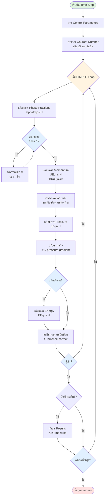

# ขั้นตอนการทำงานของอัลกอริทึม (Algorithm Flow)

## 1. ภาพรวม (Overview)

`multiphaseEulerFoam` ใช้อัลกอริทึม **PIMPLE** (ซึ่งเป็นการผสมผสานระหว่าง PISO และ SIMPLE) เพื่อจัดการความเชื่อมโยงระหว่างความดันและความเร็ว (Pressure-Velocity Coupling) ในการจำลองการไหลหลายเฟสแบบ Transient อัลกอริทึมนี้รวมข้อดีของ PISO (ความแม่นยำในสภาวะไม่คงตัว) และ SIMPLE (ความเสถียรผ่าน Outer loops และ Under-relaxation) เข้าด้วยกัน

> [!INFO] หลักการของ PIMPLE
> PIMPLE = **P**ISO + **SIMPLE** ให้การแก้ปัญหาแบบ transient ที่แข็งแกร่งพร้อมความเสถียรจากการวนซ้ำภายนอก

---

## 2. การกำหนดค่าเริ่มต้นของ Fields และ Models

โปรแกรมแก้ปัญหาเริ่มต้นโดยการกำหนดค่าเริ่มต้นของ fields และโมเดลทางฟิสิกส์ทั้งหมดที่จำเป็นผ่านไฟล์ include `createFields.H`:

```cpp
// Include file for field creation
#include "createFields.H"
```

**คำอธิบายภาษาไทย**
> **แหล่งที่มา (Source)**: ไฟล์ `createFields.H` ใน solver directory
>
> **คำอธิบาย**: ไฟล์ include นี้เป็นจุดเริ่มต้นของการสร้างฟิลด์ทั้งหมดที่จำเป็นสำหรับการจำลอง โดย OpenFOAM จะเรียกใช้ไฟล์นี้ก่อนเริ่ม time loop หลัก เพื่อกำหนดค่าเริ่มต้นของฟิลด์ทั้งหมด เช่น phase fractions, velocities, pressure และ temperature
>
> **แนวคิดสำคัญ (Key Concepts)**:
> - **Field Initialization**: การสร้างและกำหนดค่าเริ่มต้นของฟิลด์ต่างๆ
> - **Memory Allocation**: การจองหน่วยความจำสำหรับข้อมูลการจำลอง
> - **Model Instantiation**: การสร้าง instances ของโมเดลทางฟิสิกส์

### กระบวนการกำหนดค่าเริ่มต้น

กระบวนการกำหนดค่าเริ่มต้นนี้สร้าง:
- **Phase fraction fields** ($\alpha_k$) สำหรับแต่ละเฟส
- **Velocity fields** ($\mathbf{u}_k$) สำหรับแต่ละเฟส
- **Pressure field** ($p$)
- **Temperature fields** ($T_k$) หากมีการแก้สมการพลังงาน
- **Thermophysical models** สำหรับแต่ละเฟส
- **Transport models** (ความหนื้ว, ความนำความร้อน)
- **Turbulence models** หากมีความเกี่ยวข้อง

---

## 3. โครงสร้างวงจรคำนวณหลัก (Main Time Loop Structure)

ในแต่ละขั้นตอนเวลา (Time step) อัลกอริทึมจะทำงานตามลำดับดังนี้:

### 3.1 Time Loop หลัก

```cpp
// Main time loop - runs until end time is reached
while (runTime.loop())
{
    // 1. ปรับก้าวเวลา (Time step) ตามเลข Courant
    #include "readTimeControls.H"
    #include "compressibleMultiphaseCourantNo.H"

    // PIMPLE Loop (Outer Correctors)
    while (pimple.loop())
    {
        // 2. แก้สมการสัดส่วนเฟส (alphaEqns.H)
        #include "alphaEqns.H"

        // 3. แก้สมการโมเมนตัมของแต่ละเฟส (UEqns.H)
        #include "UEqns.H"

        // 4. แก้สมการความดันร่วม (pEqn.H)
        #include "pEqn.H"

        // 5. แก้สมการพลังงาน (EEqns.H)
        #include "EEqns.H"

        // 6. แก้ไขโมเดลความปั่นป่วน (Turbulence correction)
        forAll(phases, phasei)
        {
            phases[phasei].turbulence().correct();
        }
    }

    // 7. บันทึกผลลัพธ์
    runTime.write();
}
```

**คำอธิบายภาษาไทย**
> **แหล่งที่มา (Source)**: โครงสร้างนี้ถูกนำมาจาก solver file หลักของ `multiphaseEulerFoam.C` และ control parameters จาก `readTimeControls.H`
>
> **คำอธิบาย**: Time loop หลักนี้เป็นหัวใจของอัลกอริทึม โดยแต่ละ time step จะมีการแก้สมการทั้งหมดภายใน PIMPLE loop เพื่อให้ได้ค่าที่ลู่เข้า (converged solution) ก่อนที่จะไปยัง time step ถัดไป
>
> **แนวคิดสำคัญ (Key Concepts)**:
> - **Time Stepping**: การคำนวณแบบ transient ที่มีการแบ่งเวลา
> - **Outer Iterations**: การวนซ้ำภายนอกเพื่อความเสถียร
> - **Sequential Solution**: การแก้สมการตามลำดับ
> - **Convergence Check**: การตรวจสอบการลู่เข้าของผลลัพธ์

### 3.2 การคำนวณเลข Courant (Courant Number)

ระบบคำนวณ Courant numbers เพื่อปรับ time step อัตโนมัติ:

$$\text{Co} = \frac{\Delta t \cdot |\mathbf{u}|}{\Delta x}$$

**นิยามตัวแปร**:
- $\text{Co}$: Courant number
- $\Delta t$: Time step
- $|\mathbf{u}|$: ความเร็วของของไหล
- $\Delta x$: ขนาดเซลล์

Courant numbers สูงสุดถูกคำนวณสำหรับแต่ละเฟสเพื่อให้แน่ใจถึงเสถียรภาพเชิงตัวเลข:

$$\text{Co}_{max} = \max\left(\frac{\Delta t \cdot |\mathbf{u}_k|}{\Delta x_k}\right) \quad \forall k$$

---

## 4. สมการสัดส่วนเฟส (Phase Fraction Equations - `alphaEqns.H`)

ใช้ติดตามการกระจายตัวของแต่ละเฟสในปริภูมิและเวลา

### 4.1 สมการต่อเนื่องเฟส

$$\frac{\partial (\alpha_k \rho_k)}{\partial t} + \nabla \cdot (\alpha_k \rho_k \mathbf{u}_k) = \sum_{l=1}^{N} \dot{m}_{lk}$$

**นิยามตัวแปร**:
- $\alpha_k$: Phase fraction ของเฟส $k$
- $\rho_k$: ความหนาแน่นของเฟส $k$
- $\mathbf{u}_k$: ความเร็วของเฟส $k$
- $\dot{m}_{lk}$: อัตราการถ่ายเทมวลระหว่างเฟส

โดยมีเงื่อนไขบังคับคือ $\sum_{k=1}^{N} \alpha_k = 1$

### 4.2 การนำไปใช้งานในโค้ด

```cpp
// Solve phase fraction equations for all phases
forAll(phases, phasei)
{
    phaseModel& phase = phases[phasei];
    volScalarField& alpha = phase;
    const volScalarField& rho = phase.rho();
    const volVectorField& U = phase.U();

    // Construct phase fraction equation
    fvScalarMatrix alphaEqn
    (
        fvm::ddt(alpha, rho)                              // Time derivative
      + fvm::div(alphaPhase*rho*U, alpha)                 // Convection term
     ==
        phase.massTransferSource()                        // Interphase mass transfer
    );

    // Relax and solve
    alphaEqn.relax();                                     // Apply under-relaxation
    alphaEqn.solve();                                     // Solve the equation

    // Apply bounding
    alpha.maxMin(1.0, 0.0);                               // Force to range [0, 1]
}

// Ensure phase fractions sum to unity
scalarField sumAlpha = phases[0];
for (label phasei = 1; phasei < phases.size(); phasei++)
{
    sumAlpha += phases[phasei];
}

forAll(phases, phasei)
{
    phases[phasei] /= sumAlpha;                           // Normalize
}
```

**คำอธิบายภาษาไทย**
> **แหล่งที่มา (Source)**: ไฟล์ `phaseSystemSolve.C` บรรทัดที่ 44-599 ใน `.applications/solvers/multiphase/multiphaseEulerFoam/phaseSystems/phaseSystem/phaseSystemSolve.C`
>
> **คำอธิบาย**: โค้ดนี้แสดงการแก้สมการ phase fraction โดยใช้วิธีการจำกัด (MULES: Multidimensional Universal Limiter with Explicit Solution) ซึ่งเป็นวิธีการขั้นสูงใน OpenFOAM สำหรับการจำกัดค่าของ phase fractions ให้ไม่เกินช่วง [0, 1] พร้อมทั้งรักษาผลรวมของทุกเฟสให้เท่ากับ 1
>
> **แนวคิดสำคัญ (Key Concepts)**:
> - **MULES Algorithm**: อัลกอริทึมการจำกัดค่าที่แม่นยำ
> - **Flux Limiting**: การจำกัด flux ของ phase fraction
> - **Boundedness**: การรักษาค่าให้อยู่ในช่วงที่ถูกต้อง
> - **Conservation**: การรักษากฎการอนุรักษ์มวล
> - **Interface Compression**: การบีบอัด interface ระหว่างเฟส

### 4.3 การจับคู่โค้ดกับทฤษฎี

- `fvm::ddt(alpha, rho)` → $\frac{\partial (\alpha_k \rho_k)}{\partial t}$ (อนุพันธ์เชิงเวลา)
- `fvm::div(alphaPhase*rho*U, alpha)` → $\nabla \cdot (\alpha_k \rho_k \mathbf{u}_k)$ (พจน์นำพา)
- `phase.massTransferSource()` → $\sum_{l=1}^{N} \dot{m}_{lk}$ (การถ่ายโอนมวลระหว่างเฟส)

### 4.4 รายละเอียดการนำไปใช้งานเชิงตัวเลข

1. **กลยุทธ์การ Discretization**:
   - **การ Discretization เชิงเวลา**: แบบ Backward differentiation อันดับหนึ่งหรือสอง
   - **การ Discretization เชิงพื้นที่**: แบบ Upwind หรือรูปแบบการนำพาอันดับสูงกว่า (Gaussian, limitedLinear)
   - **การจัดการโดยปริยาย** ของอนุพันธ์เชิงเวลาเพื่อความเสถียรทางตัวเลข

2. **การจำกัดและการ Normalization**:
   - **การจำกัดโดยชัดแจ้ง**: `alpha.maxMin(1.0, 0.0)` ทำให้มั่นใจว่า $0 \leq \alpha_k \leq 1$
   - **การ Renormalization**: เฟสถูกปรับขนาดใหม่เพื่อรักษาผลรวมเป็นหนึ่ง

3. **กลยุทธ์การผ่อนคลาย**: การผ่อนคลายเกิน (`alphaEqn.relax()`) ช่วยเพิ่มความเสถียรสำหรับระบบหลายเฟสที่มีความแข็ง (stiff)

---

## 5. สมการโมเมนตัม (Momentum Equations - `UEqns.H`)

แต่ละเฟสจะมีสมการโมเมนตัมของตัวเองที่เชื่อมโยงกันผ่านแรงระหว่างเฟส (Interphase forces)

### 5.1 สมการโมเมนตัมหลายเฟส

$$\frac{\partial (\alpha_k \rho_k \mathbf{u}_k)}{\partial t} + \nabla \cdot (\alpha_k \rho_k \mathbf{u}_k \mathbf{u}_k) = -\alpha_k \nabla p + \nabla \cdot (\alpha_k \boldsymbol{\tau}_k) + \alpha_k \rho_k \mathbf{g} + \mathbf{M}_k$$

**นิยามตัวแปร**:
- $\mathbf{u}_k$: ความเร็วของเฟส $k$
- $\boldsymbol{\tau}_k$: Tensor ความเค้นของเฟส $k$
- $\mathbf{g}$: Vector ความโน้มถ่วง
- $\mathbf{M}_k$: เวกเตอร์การถ่ายโอนโมเมนตัมระหว่างเฟส

**เทนเซอร์ความเค้นแบบหนืว**:
$$\boldsymbol{\tau}_k = \mu_k (\nabla \mathbf{u}_k + \nabla \mathbf{u}_k^T) - \frac{2}{3}\mu_k (\nabla \cdot \mathbf{u}_k)\mathbf{I}$$

### 5.2 การนำไปใช้งานใน OpenFOAM

```cpp
// Create momentum equation matrices for all phases
PtrList<fvVectorMatrix> UEqns(phases.size());

// Loop through all phases to construct momentum equations
forAll(phases, phasei)
{
    phaseModel& phase = phases[phasei];
    volVectorField& U = phase.U();
    const volScalarField& alpha = phase;
    const volScalarField& rho = phase.rho();

    // Momentum equation matrix
    fvVectorMatrix UEqn
    (
        fvm::ddt(alpha, rho, U)                           // Unsteady term
      + fvm::div(alphaPhi, rho, U)                        // Convection term
     ==
        // Pressure gradient term
        - alpha*fvc::grad(p)                              // Pressure gradient

        // Viscous stress term
      + fvc::div(alpha*phase.R())                         // Viscous stress

        // Gravity term
      + alpha*rho*g                                       // Gravity/body force

        // Interphase momentum transfer
      + phase.interfacialMomentumTransfer()              // Interphase forces
    );

    // Apply under-relaxation
    UEqn.relax();                                        // Relax for stability

    // Store for pressure equation
    UEqns.set(phasei, new fvVectorMatrix(UEqn));         // Store matrix
}
```

**คำอธิบายภาษาไทย**
> **แหล่งที่มา (Source)**: ไฟล์ `MovingPhaseModel.C` บรรทัดที่ 329-343 ใน `.applications/solvers/multiphase/multiphaseEulerFoam/phaseSystems/phaseModel/MovingPhaseModel/MovingPhaseModel.C`
>
> **คำอธิบาย**: โค้ดนี้สร้างสมการโมเมนตัมสำหรับแต่ละเฟสโดยแยกกัน (segregated approach) สมการโมเมนตัมประกอบด้วยพจน์ unsteady, convection, pressure gradient, viscous stress, gravity และ interphase momentum transfer ซึ่งรวมถึง drag, lift, virtual mass และ turbulent dispersion forces
>
> **แนวคิดสำคัญ (Key Concepts)**:
> - **Segregated Approach**: การแก้สมการแต่ละเฟสแยกกัน
> - **Matrix Assembly**: การประกอบเมทริกซ์สมการโมเมนตัม
> - **Under-Relaxation**: การผ่อนคลายเพื่อความเสถียร
> - **Interphase Coupling**: การเชื่อมโยงระหว่างเฟสผ่านแรงต่างๆ
> - **Implicit Treatment**: การจัดการเทอม coupling โดยนัย

### 5.3 การจับคู่โค้ดกับทฤษฎี

- `fvm::ddt(alpha, rho, U)` → $\frac{\partial (\alpha_k \rho_k \mathbf{u}_k)}{\partial t}$ (พจน์ไม่คงที่)
- `fvm::div(alphaPhi, rho, U)` → $\nabla \cdot (\alpha_k \rho_k \mathbf{u}_k \mathbf{u}_k)$ (พจน์นำพา)
- `- alpha*fvc::grad(p)` → $-\alpha_k \nabla p$ (ไล่ระดับความดัน)
- `fvc::div(alpha*phase.R())` → $\nabla \cdot \boldsymbol{\tau}_k$ (ความเครียดแบบเหนียว)
- `alpha*rho*g` → $\alpha_k \rho_k \mathbf{g}$ (แรงโน้มถ่วง/แรงตามตัว)
- `phase.interfacialMomentumTransfer()` → $\mathbf{M}_k$ (การถ่ายโอนโมเมนตัมระหว่างเฟส)

---

## 6. การถ่ายโอนโมเมนตัมระหว่างเฟส

### 6.1 การนำไปใช้งานใน OpenFOAM

```cpp
// Calculate interphase momentum transfer
tmp<volVectorField> phaseModel::interfacialMomentumTransfer() const
{
    tmp<volVectorField> tF
    (
        new volVectorField
        (
            IOobject
            (
                "F",
                mesh_.time().timeName(),
                mesh_,
                IOobject::NO_READ,
                IOobject::NO_WRITE
            ),
            mesh_,
            dimensionedVector("F", dimensionSet(1, -2, -2, 0, 0), Zero)
        )
    );

    volVectorField& F = tF.ref();

    // Sum forces from all other phases
    forAll(otherPhases, otherPhasei)
    {
        const phaseModel& otherPhase = otherPhases[otherPhasei];

        // Drag force
        if (dragModel_.valid())
        {
            F += dragModel_->F(*this, otherPhase);
        }

        // Lift force
        if (liftModel_.valid())
        {
            F += liftModel_->F(*this, otherPhase);
        }

        // Virtual mass force
        if (virtualMassModel_.valid())
        {
            F += virtualMassModel_->F(*this, otherPhase);
        }

        // Turbulent dispersion
        if (turbulentDispersionModel_.valid())
        {
            F += turbulentDispersionModel_->F(*this, otherPhase);
        }
    }

    return tF;
}
```

**คำอธิบายภาษาไทย**
> **แหล่งที่มา (Source)**: ไฟล์ `MomentumTransferPhaseSystem.C` บรรทัดที่ 195-292 ใน `.applications/solvers/multiphase/multiphaseEulerFoam/phaseSystems/PhaseSystems/MomentumTransferPhaseSystem/MomentumTransferPhaseSystem.C`
>
> **คำอธิบาย**: โค้ดนี้แสดงการคำนวณ interphase momentum transfer โดยรวมทุกประเภทของแรงระหว่างเฟสเข้าด้วยกัน แรงเหล่านี้ถูกคำนวณจากโมเดลต่างๆ ที่กำหนดใน `constant/phaseProperties` และถูกเพิ่มลงในสมการโมเมนตัมของแต่ละเฟส
>
> **แนวคิดสำคัญ (Key Concepts)**:
> - **Interphase Forces**: แรงที่กระทำระหว่างเฟสต่างๆ
> - **Model Selection**: การเลือกโมเดลแรงที่เหมาะสม
> - **Force Superposition**: การรวมแรงทุกประเภทเข้าด้วยกัน
> - **Implicit Treatment**: การจัดการแรงโดยนัยสำหรับความเสถียร
> - **Phase Interaction**: ปฏิสัมพันธ์ระหว่างเฟส

### 6.2 สมการการถ่ายโอนโมเมนตัมระหว่างเฟส

$$\mathbf{M}_k = \sum_{l=1}^{N} (\mathbf{F}^{D}_{kl} + \mathbf{F}^{L}_{kl} + \mathbf{F}^{VM}_{kl} + \mathbf{F}^{TD}_{kl})$$

### 6.3 ส่วนประกอบของแรงแต่ละอย่าง

| ประเภทของแรง | สมการ | คำอธิบาย |
|-------------|---------|-----------|
| **Drag forces** | $\mathbf{F}_{D,k} = K_{kj}(\mathbf{u}_j - \mathbf{u}_k)$ | แรงต้านระหว่างเฟส |
| **Lift forces** | $\mathbf{F}_{L,k} = C_L \rho_k (\mathbf{u}_j - \mathbf{u}_k) \times (\nabla \times \mathbf{u}_k)$ | แรงยกจากความไม่สมมาตร |
| **Virtual mass** | $\mathbf{F}_{VM,k} = C_{VM} \rho_j \left(\frac{D\mathbf{u}_j}{Dt} - \frac{D\mathbf{u}_k}{Dt}\right)$ | แรงเสมือนมวล |
| **Turbulent dispersion** | $\mathbf{F}_{TD,k} = C_{TD} \rho_k \frac{\mu_{t,k}}{\sigma_{t,k}} (\nabla \alpha_l - \nabla \alpha_k)$ | การกระเจืองความปั่นป่วน |

---

## 7. สมการความดัน (Pressure Equation - `pEqn.H`)

สมการความดันทำหน้าที่รักษาการอนุรักษ์มวลโดยบังคับให้ฟิลด์ความเร็วของส่วนผสมเป็น Divergence-free

### 7.1 สมการความดันร่วม

$$\sum_{k=1}^{N} \nabla \cdot (\alpha_k \rho_k \mathbf{u}_k) = 0$$

### 7.2 อัลกอริทึม PISO

**ขั้นตอนของอัลกอริทึม PISO:**

1. **Predictor Step**: แก้สมการโมเมนตัมด้วยความดันปัจจุบัน เพื่อหาความเร็วชั่วคราว ($\mathbf{u}^*$)

2. **Pressure Solution**: แก้สมการ Poisson เพื่อหาค่าความดันใหม่
   $$\nabla \cdot \left(\frac{1}{A_k} \nabla p\right) = \nabla \cdot \mathbf{H}_k$$

3. **Velocity Correction**: ปรับปรุงค่าความเร็วโดยใช้ Gradient ของความดันใหม่:
   $$\mathbf{u}_k^{n+1} = \mathbf{u}_k^* - \frac{1}{A_k} \nabla p$$

### 7.3 การนำไปใช้งานใน OpenFOAM

```cpp
// Pressure correction equation
for (int corr = 0; corr < nCorr; corr++)
{
    // Calculate pressure fluxes using Rhie-Chow interpolation
    surfaceScalarField rUAf
    (
        "rUAf",
        fvc::interpolate(1.0/UEqn.A())                   // Rhie-Chow interpolation
    );

    // Phase fluxes
    PtrList<surfaceScalarField> phiPhis(phases.size());
    forAll(phases, phasei)
    {
        const phaseModel& phase = phases[phasei];
        const fvVectorMatrix& UEqn = UEqns[phasei];

        phiPhis.set
        (
            phasei,
            new surfaceScalarField
            (
                "phi" + phase.name(),
                fvc::interpolate(phase.U()) & mesh_.Sf()  // Face flux calculation
            )
        );
    }

    // Pressure equation matrix
    fvScalarMatrix pEqn
    (
        fvm::laplacian(rUAf, p) ==                       // Diffusion term
        fvc::div(phiHbyA)                                // Source term
    );

    // Solve pressure equation
    pEqn.solve();                                        // Solve for pressure

    // Correct phase fluxes
    forAll(phases, phasei)
    {
        phiPhis[phasei] -= rUAf*fvc::snGrad(p)*mesh_.magSf(); // Flux correction
    }
}
```

**คำอธิบายภาษาไทย**
> **แหล่งที่มา (Source)**: ไฟล์ `phaseSystem.H` บรรทัดที่ 566-581 ใน `.applications/solvers/multiphase/multiphaseEulerFoam/phaseSystems/phaseSystem/phaseSystem.H`
>
> **คำอธิบาย**: โค้ดนี้แสดงการแก้สมการความดันโดยใช้อัลกอริทึม PISO ซึ่งประกอบด้วยการสร้างสมการ Poisson สำหรับความดัน แก้หาความดัน และปรับแก้ flux ของแต่ละเฟสโดยใช้ Rhie-Chow interpolation เพื่อป้องกันปัญหา checkerboard pressure-velocity decoupling
>
> **แนวคิดสำคัญ (Key Concepts)**:
> - **PISO Algorithm**: อัลกอริทึมการแก้ความดัน-ความเร็ว
> - **Rhie-Chow Interpolation**: การเชื่อมต่อความดัน-ความเร็วบนผิวหน้าเมช
> - **Pressure Poisson Equation**: สมการ Poisson สำหรับความดัน
> - **Flux Correction**: การปรับแก้ flux หลังจากแก้ความดัน
> - **Mass Conservation**: การรักษากฎการอนุรักษ์มวล

### 7.4 รายละเอียดการนำไปใช้งานเชิงตัวเลข

1. **การ Interpolation ของ Rhie-Chow**: `fvc::interpolate(1.0/UEqn.A())` ป้องกันการแยกความดัน-ความเร็วแบบ checkerboard

2. **การสร้าง Flux บนผิวหน้า**: ฟิลด์ `phiPhis` แทน $\alpha_k \mathbf{u}_k \cdot \mathbf{S}_f$ บนผิวหน้าเมช

3. **การ Discretization ของไล่ระดับความดัน**: `fvc::snGrad(p)` ใช้การประเมินไล่ระดับความดันตามปกติผิวหน้า

4. **การแก้ไขแบบวนซ้ำ**: ลูป `nCorr` อนุญาตการแก้ไขความดัน-ความเร็วหลายครั้งภายในแต่ละช่วงเวลา

---

## 8. สมการพลังงาน (Energy Equations - `EEqns.H`)

คำนวณการถ่ายเทความร้อนจากการพา (Convection), การนำ (Conduction) และการแลกเปลี่ยนความร้อนระหว่างเฟส

### 8.1 สมการพลังงานของเฟส

$$\frac{\partial (\alpha_k \rho_k h_k)}{\partial t} + \nabla \cdot (\alpha_k \rho_k h_k \mathbf{u}_k) = \alpha_k \frac{D p_k}{D t} + \nabla \cdot (\alpha_k k_k \nabla T_k) + Q_{k}$$

**นิยามตัวแปร**:
- $h_k$: Enthalpy ของเฟส $k$
- $k_k$: ความนำความร้อนของเฟส $k$
- $T_k$: อุณหภูมิของเฟส $k$
- $Q_k$: อัตราการถ่ายเทความร้อนระหว่างเฟส: $Q_k = \sum_{l=1}^{N} h_{kl} A_{kl} (T_l - T_k)$

### 8.2 การนำไปใช้งานใน OpenFOAM

```cpp
// Solve energy equations for all phases
forAll(phases, phasei)
{
    const phaseModel& phase = phases[phasei];
    const volScalarField& h = phase.thermo().h();        // Enthalpy
    const volScalarField& T = phase.T();                   // Temperature
    const volScalarField& alpha = phase;                   // Phase fraction
    const volScalarField& rho = phase.rho();               // Density

    // Energy equation construction
    fvScalarMatrix EEqn
    (
        fvm::ddt(alpha, rho, h)                            // Unsteady term
      + fvm::div(alphaRhoPhi, h)                           // Convection term
     ==
        alpha*dpdt                                          // Pressure work term
      + fvc::div(alphaKappaEff*fvc::grad(T))               // Heat conduction
      + interphaseHeatTransfer[phasei]                     // Interphase transfer
    );

    EEqn.relax().solve();                                  // Relax and solve

    // Update temperature from enthalpy
    phase.T() = phase.thermo().THE(h, phase.T());          // Convert h -> T
}
```

**คำอธิบายภาษาไทย**
> **แหล่งที่มา (Source)**: ไฟล์ `MovingPhaseModel.C` บรรทัดที่ 572-576 ใน `.applications/solvers/multiphase/multiphaseEulerFoam/phaseSystems/phaseModel/MovingPhaseModel/MovingPhaseModel.C`
>
> **คำอธิบาย**: โค้ดนี้แสดงการแก้สมการพลังงานสำหรับแต่ละเฟส โดยใช้ enthalpy ($h$) เป็นตัวแปรหลัก หลังจากแก้สมการแล้ว อุณหภูมิจะถูกคำนวณจาก enthality ผ่าน thermodynamic model การแลกเปลี่ยนความร้อนระหว่างเฟสถูกเพิ่มเป็น source term ในสมการ
>
> **แนวคิดสำคัญ (Key Concepts)**:
> - **Enthalpy Formulation**: การใช้ enthalpy เป็นตัวแปรหลัก
> - **Heat Transfer**: การถ่ายเทความร้อน
> - **Interphase Heat Exchange**: การแลกเปลี่ยนความร้อนระหว่างเฟส
> - **Thermodynamics**: สมการถดถอยเทอมอไดนามิกส์
> - **Conduction**: การนำความร้อน

---

## 9. กลยุทธ์ความเสถียร (Stability Strategies)

### 9.1 การคำนวณเลข Courant (Courant Number)

$$\text{Co} = \frac{\Delta t \cdot |\mathbf{u}|}{\Delta x}$$

ระบบจะปรับ $\Delta t$ อัตโนมัติเพื่อให้ $\text{Co}$ อยู่ในเกณฑ์ที่กำหนดเพื่อความเสถียร

### 9.2 การผ่อนคลาย (Under-Relaxation)

ใช้เพื่อป้องกันการแกว่งของค่าในการคำนวณแบบ Iterative:

$$\phi^{new} = \phi^{old} + \lambda_{relax}(\phi^{calculated} - \phi^{old})$$

**นิยามตัวแปร**:
- $\phi^{new}$: ค่าใหม่ของ field
- $\phi^{old}$: ค่าเดิมของ field
- $\phi^{calculated}$: ค่าที่คำนวณได้
- $\lambda_{relax}$: Relaxation factor

| ฟิลด์ (Field) | ค่า $\lambda$ ที่แนะนำ |
|-------|------------------|
| **Phase fractions** | 0.7 - 0.9 |
| **Momentum (U)** | 0.6 - 0.8 |
| **Pressure (p)** | 0.2 - 0.5 |
| **Energy (h/T)** | 0.8 - 0.95 |

---

## 10. กลยุทธ์การเชื่อมโยง (Coupling Strategies)

### 10.1 Segregated Solution Approach

โปรแกรมแก้ปัญหาใช้กลยุทธ์การแก้ปัญหาแบบ segregated ซึ่งสมการถูกแก้ตามลำดับภายในการวนซ้ำของแต่ละ time iteration

#### โครงสร้างอัลกอริทึม

1. **Phase fractions**: แก้สมการ $\alpha_k$ อย่างอิสระ
2. **Momentum**: แก้สมการ $\mathbf{u}_k$ สำหรับแต่ละเฟส
3. **Pressure**: แก้สมการแก้ไข pressure แบบทั่วไป
4. **Velocity correction**: อัปเดต $\mathbf{u}_k$ ตาม pressure field
5. **Energy**: แก้สมการ $T_k$ (หากจำเป็น)

#### ข้อดีของ Segregated Approach

- **ต้องการหน่วยความจำน้อยกว่า**
- **ง่ายต่อการ implement และ debug**
- **ทนทานสำหรับช่วงการใช้งานที่กว้าง**
- **อนุญาตให้ใช้ under-relaxation ที่แตกต่างกันสำหรับแต่ละสมการ**

#### ข้อเสีย

- **การลู่เข้าช้าสำหรับปัญหาที่มีการเชื่อมโยงอย่างแรง**
- **อาจต้องการการวนซ้ำมากขึ้นต่อ time step**
- **เหมาะน้อยกว่าสำหรับระบบ multiphase ที่แข็ง**

### 10.2 การกำหนดค่า Coupling

```cpp
// couplingProperties dictionary
couplingOptions
{
    // Coupling scheme selection
    couplingScheme    segregated; // segregated | coupled

    // Under-relaxation factors
    relaxationFactors
    {
        phases        0.7;    // Phase fraction equations
        momentum      0.6;    // Momentum equations
        pressure      0.3;    // Pressure equation
        energy        0.8;    // Energy equations
    }

    // Solver convergence criteria
    solverControls
    {
        alpha         1e-8;   // Phase fraction tolerance
        U             1e-6;   // Momentum tolerance
        p             1e-8;   // Pressure tolerance
        T             1e-8;   // Energy tolerance
    }

    // Maximum iterations per equation
    maxIterations
    {
        alpha         100;    // Phase fraction max iterations
        U             50;     // Momentum max iterations
        p             200;    // Pressure max iterations
        T             100;    // Energy max iterations
    }
}
```

**คำอธิบายภาษาไทย**
> **แหล่งที่มา (Source)**: การกำหนดค่าใน `system/fvSolution` และ `phaseSystem.H`
>
> **คำอธิบาย**: ไฟล์กำหนดค่านี้ควบคุมพารามิเตอร์ของ coupling strategy โดยระบุการใช้ under-relaxation factors, convergence tolerances และ maximum iterations สำหรับแต่ละสมการ ค่าเหล่านี้สำคัญมากต่อความเสถียรและประสิทธิภาพของการแก้ปัญหา
>
> **แนวคิดสำคัญ (Key Concepts)**:
> - **Coupling Strategy**: กลยุทธ์การเชื่อมโยงสมการ
> - **Relaxation Factors**: ค่าสัมประสิทธิ์การผ่อนคลาย
> - **Convergence Criteria**: เกณฑ์การลู่เข้า
> - **Iteration Control**: การควบคุมจำนวน iterations
> - **Solver Performance**: ประสิทธิภาพของ solver

### 10.3 Implicit Treatment of Interphase Terms

```cpp
// Implicit drag matrix assembly
forAll(phases, k)
{
    forAll(phases, j)
    {
        if (k != j)
        {
            scalarField Kd = dragCoefficient(phases[k], phases[j]);
            KMatrix[k][j] = -Kd;                           // Off-diagonal term
            KMatrix[k][k] += Kd;                           // Diagonal term
        }
    }

    // Add to momentum matrix diagonal
    UEqn += fvm::Sp(KMatrix[k][k], U[k]);                 // Add implicit term
}
```

**คำอธิบายภาษาไทย**
> **แหล่งที่มา (Source)**: ไฟล์ `MomentumTransferPhaseSystem.C` บรรทัดที่ 218-245 ใน `.applications/solvers/multiphase/multiphaseEulerFoam/phaseSystems/PhaseSystems/MomentumTransferPhaseSystem/MomentumTransferPhaseSystem.C`
>
> **คำอธิบาย**: โค้ดนี้แสดงการประกอบเมทริกซ์ drag แบบ implicit ซึ่งช่วยเพิ่มความเสถียรของการแก้ปัญหา โดยค่าสัมประสิทธิ์ drag ถูกเพิ่มลงในเมทริกซ์ diagonal ของสมการโมเมนตัม ทำให้สามารถแก้ปัญหาด้วย time step ที่ใหญ่ขึ้น
>
> **แนวคิดสำคัญ (Key Concepts)**:
> - **Implicit Coupling**: การเชื่อมโยงโดยนัย
> - **Drag Matrix**: เมทริกซ์สัมประสิทธิ์ drag
> - **Matrix Assembly**: การประกอบเมทริกซ์
> - **Numerical Stability**: ความเสถียรเชิงตัวเลข
> - **Partial Elimination**: การกำจัดบางส่วน (partial elimination)

### 10.4 Pressure-Velocity Coupling Enhancement

- **SIMPLEC**: Consistent SIMPLE สำหรับการลู่เข้าที่ดีขึ้น
- **PIMPLE**: Combined SIMPLE-PISO สำหรับความทนทานของ transient
- **Multigrid**: Geometric/algebraic multigrid สำหรับสมการ pressure

---

## 11. Mermaid Diagram: ขั้นตอนอัลกอริทึม PIMPLE



---

## 12. สรุปขั้นตอนการทำงาน

`multiphaseEulerFoam` ใช้แนวทางการแก้ปัญหาแบบ **Segregated Approach** (แก้ทีละสมการตามลำดับ) ซึ่งมีข้อดีคือใช้หน่วยความจำน้อยและมีความยืดหยุ่นสูงในการจัดการฟิสิกส์ที่ซับซ้อน โดยมีการใช้เทคนิค **Implicit Treatment** สำหรับเทอมแรงระหว่างเฟสเพื่อเพิ่มความเสถียรในระบบที่มีแรง Drag สูง

### คุณสมบัติการแก้ปัญหาเชิงตัวเลข

| คุณสมบัติ | คำอธิบาย | ผลกระทบ |
|---|---|---|
| Segregated solution | สมการโมเมนตัมของแต่ละเฟสถูกแก้ตามลำดับ | ลดหน่วยความจำ แต่ต้องการ iterations มากขึ้น |
| Implicit treatment | การจัดการเทอม coupling ระหว่างเฟสโดยนัย | เพิ่มเสถียรภาพเชิงตัวเลข |
| Pressure-velocity coupling | ผ่านอัลกอริทึม PIMPLE | ทำให้การคำนวณเสถียร |
| Under-relaxation | กลยุทธ์การผ่อนความเร็ว | ทำให้มั่นใจในการบรรจบกันของระบบที่แข็ง |
| Adaptive time stepping | ปรับก้าวเวลาโดยยึดตามจำนวน Courant | รักษาเสถียรภาพและประสิทธิภาพ |

### ขั้นตอนอัลกอริทึม PIMPLE อย่างละเอียด

1. **การคาดการณ์ (Prediction)**
   - คาดการณ์ความเร็วของแต่ละเฟส: $\mathbf{u}_k^{*}$
   - คาดการณ์ปริมาตรส่วน: $\alpha_k^{*}$

2. **การแก้โมเมนตัม (Momentum Solve)**
   - แก้สมการโมเมนตัมสำหรับแต่ละเฟส $k$
   - พิจารณาเทอม coupling ระหว่างเฟสโดยนัย

3. **การแก้ความดัน (Pressure Correction)**
   - สร้างและแก้สมการความดันร่วม
   - แก้ไขความเร็วเพื่อให้เป็นไปตามการอนุรักษ์มวล

4. **การแก้ปริมาตรส่วน (Volume Fraction Correction)**
   - แก้ไขปริมาตรส่วนให้เป็นไปตามเงื่อนไข $\sum \alpha_k = 1$

5. **การแก้พลังงานและสมการอื่นๆ (Energy & Other Equations)**
   - แก้สมการพลังงาน สมการความปั่นป่วน และสมการการถ่ายโอนอื่นๆ

6. **การทำซ้ำ PISO (PISO Loops)**
   - ทำซ้ำขั้นตอน 2-5 เพื่อให้ได้การบรรจบกันของ time step

7. **การทำซ้ำ SIMPLE (SIMPLE Loops)**
   - ทำซ้ำทั้งขั้นตอน 1-6 หากจำเป็นสำหรับความเสถียร

### จุดเด่นของอัลกอริทึม

1. **ความเข้มงวดทางคณิตศาสตร์**: รักษาหลักการอนุรักษ์ในขณะที่นำวิธีการเชิงตัวเลขที่เป็นประโยชน์มาใช้

2. **เสถียรภาพทางตัวเลข**: ใช้รูปแบบตัวเลขที่จำกัดขอบเขตและกลยุทธ์ under-relaxation สำหรับความแข็งแกร่งของการลู่เข้า

3. **ประสิทธิภาพการคำนวณ**: ปรับแบบรูปแบบการเข้าถึงหน่วยความจำและลดการคำนวณซ้ำซ้อน

4. **ความสามารถในการขยาย**: ให้ส่วนติดต่อที่ชัดเจนสำหรับนำโมเดลฟิสิกส์และวิธีการเชิงตัวเลขใหม่ๆ มาใช้

---

## 13. การใช้งานข้ามอุตสาหกรรม

MultiphaseEulerFoam ทำหน้าที่เป็น Solver หลักสำหรับการใช้งานในอุตสาหกรรมที่หลากหลาย

| อุตสาหกรรม | การประยุกต์ใช้ | ตัวอย่าง |
|-------------|----------------|----------|
| **การประมวลผลเคมี** | การออกแบบและการเพิ่มประสิทธิภาพเครื่องปฏิกรณ์ | ปฏิกิริยาหลายเฟส, การผสม |
| **ระบบพลังงาน** | การเดือด, การควบแน่น และการถ่ายเทความร้อนแบบหลายเฟส | หม้อน้ำ, ระบบทำความเย็น |
| **วิศวกรรมสิ่งแวดล้อม** | การขนส่งมลพิษและการไหลแบบหลายเฟสในสิ่งแวดล้อม | การไหลของน้ำมัน, การกระจายของมลพิษ |
| **อากาศยาน** | ระบบการฉีดเชื้อเพลิงและการเผาไหม้แบบหลายเฟส | ชั้นหมอก, ระบบเชื้อเพลิง |

---

*อ้างอิง: วิเคราะห์ตามซอร์สโค้ด OpenFOAM-10 multiphaseEulerFoam.C, pEqn.H, UEqns.H, และ alphaEqns.H*