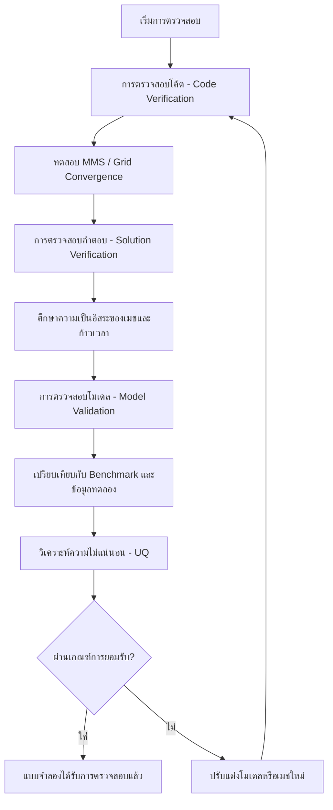

# กรณีการตรวจสอบความถูกต้องของการไหลหลายเฟส (Multiphase Validation Cases)

## 1. บทนำ (Overview)

บทนี้จัดทำขึ้นเพื่อเป็นกรอบงานมาตรฐานในการตรวจสอบความถูกต้อง (Validation) ของการจำลอง CFD สำหรับการไหลหลายเฟสใน OpenFOAM โดยครอบคลุมตั้งแต่ระเบียบวิธีที่เป็นระบบ, ปัญหาเบนช์มาร์กมาตรฐาน, การศึกษาการลู่เข้าของกริด (Grid Convergence), และการหาปริมาณความไม่แน่นอน (Uncertainty Quantification) เพื่อให้มั่นใจว่าผลการคำนวณมีความน่าเชื่อถือและแม่นยำ

> [!IMPORTANT] ปรัชญาการตรวจสอบความถูกต้อง
> - **Verification**: "เราแก้สมการได้ถูกต้องหรือไม่?" (ความถูกต้องทางคณิตศาสตร์และอัลกอริทึม)
> - **Validation**: "เราแก้สมการที่ถูกต้องหรือไม่?" (ความถูกต้องทางฟิสิกส์เมื่อเทียบกับความเป็นจริง)

---

## 2. ลำดับชั้นการตรวจสอบความถูกต้อง (Validation Hierarchy)

### 2.1 การตรวจสอบโค้ด (Code Verification)
เพื่อให้มั่นใจว่าการนำอัลกอริทึมไปใช้งานในซอฟต์แวร์นั้นถูกต้องตามหลักคณิตศาสตร์:
- **Method of Manufactured Solutions (MMS)**: การสร้างคำตอบทางคณิตศาสตร์ขึ้นมาเพื่อทดสอบว่า Solver สามารถคำนวณได้ตรงตามนั้นหรือไม่
- **Grid Convergence Index (GCI)**: ใช้ประเมินความผิดพลาดจากขนาดของเมช (Mesh size)
$$\text{GCI} = F_s \frac{|\epsilon_{12}|}{r^p - 1}$$
โดย $F_s$ คือปัจจัยความปลอดภัย, $\epsilon_{12}$ คือความผิดพลาดสัมพัทธ์ระหว่างเมชสองชุด, $r$ คืออัตราส่วนการทำให้เมชละเอียดขึ้น และ $p$ คืออันดับความแม่นยำ (Order of accuracy)

### 2.2 การตรวจสอบความถูกต้องของคำตอบ (Solution Verification)
จัดการกับความคลาดเคลื่อนเชิงตัวเลขในแต่ละเคสผ่านการทำ **Richardson Extrapolation**:
$$\phi_{exact} \approx \phi_h + \frac{\phi_h - \phi_{2h}}{2^p - 1}$$

### 2.3 การตรวจสอบความถูกต้องของโมเดล (Model Validation)
เป็นการยืนยันว่าโมเดลทางคณิตศาสตร์สามารถแทนฟิสิกส์ของการไหลหลายเฟสได้อย่างถูกต้องผ่านการเปรียบเทียบกับผลการทดลอง (Experimental Data)

---

## 3. ปัญหาเบนช์มาร์กหลัก (Key Benchmark Problems)

### 3.1 การลอยตัวของฟองเดี่ยว (Single Bubble Rise)
ใช้ตรวจสอบความถูกต้องของแรง Drag, Lift และ Virtual Mass:
- **Eötvös Number**: $Eo = \frac{\rho_l g d_b^2}{\sigma}$
- **Reynolds Number**: $Re_b = \frac{\rho_l u_t d_b}{\mu_l}$
- **Morton Number**: $Mo = \frac{g \mu_l^4 (\rho_l - \rho_g)}{\rho_l^2 \sigma^3}$

**ความเร็วปลาย (Terminal Velocity) สำหรับฟองทรงกลม ($Eo < 1$):**
$$u_t = \frac{g d_b^2 (\rho_l - \rho_g)}{18 \mu_l}$$

### 3.2 การไหลแบบแยกชั้นในท่อแนวนอน (Stratified Flow in Horizontal Pipes)
ใช้ตรวจสอบการถ่ายโอนโมเมนตัมที่อินเตอร์เฟซและพยากรณ์รูปแบบการไหล (Flow Pattern):
- **Lockhart-Martinelli Parameter**: $X = \sqrt{\frac{(dP/dx)_l}{(dP/dx)_g}}$
- **Taitel-Dukler Model**: ใช้พยากรณ์ความสูงของของเหลว ($h_l$) และการเปลี่ยนรูปแบบการไหล

### 3.3 เตียงไหลฟลูอิดไดซ์ (Fluidized Bed)
ตรวจสอบแรง Drag ระหว่างแก๊สและของแข็ง:
- **Ergun Equation**: ใช้คำนวณการลดลงของความดัน ($\Delta P$) ผ่าน Bed
- **Minimum Fluidization Velocity ($U_{mf}$)**: ความเร็วต่ำสุดที่ทำให้อนุภาคเริ่มลอยตัว

---

## 4. การหาปริมาณความไม่แน่นอน (Uncertainty Quantification)

### 4.1 Sobol Sensitivity Analysis
ใช้เพื่อวิเคราะห์ว่าตัวแปรใดในโมเดลมีผลกระทบต่อผลลัพธ์มากที่สุด ผ่านการแยกแยะความแปรปรวน (Variance Decomposition):
$$\text{Var}(Y) = \sum_{i} V_i + \sum_{i<j} V_{ij} + \cdots + V_{12...k}$$

### 4.2 Monte Carlo Methods
ใช้สุ่มพารามิเตอร์เพื่อหาช่วงความเชื่อมั่นของผลลัพธ์ โดยความคลาดเคลื่อนจะลดลงตามอัตราส่วน $1/\sqrt{N}$ เมื่อ $N$ คือจำนวนตัวอย่าง

---

## 5. เกณฑ์การยอมรับ (Acceptance Criteria)

| ตัวชี้วัด (Metric) | ข้อกำหนด (Requirement) | การประยุกต์ใช้ |
|--------|-------------|-------------|
| **Global Parameters** | Error < 5% | Pressure drop, Void fraction |
| **Local Profiles** | RMS error < 0.05 | Phase fraction, Velocity profiles |
| **Conservation** | Imbalance < 1% | Mass and Energy balance |
| **Grid Convergence** | GCI < 2% | Finest mesh resolution |

---

## 6. รายการตรวจสอบ (Validation Checklist)

1. **Mesh Quality**: ตรวจสอบคุณภาพเมชผ่านคำสั่ง `checkMesh` (Non-orthogonality < 70, Aspect ratio < 1000)
2. **Boundary Conditions**: ตรวจสอบความสอดคล้องทางฟิสิกส์และคณิตศาสตร์ของเงื่อนไขขอบเขต
3. **CFL Condition**: ควบคุมเลข Courant ให้อยู่ในเกณฑ์ที่เหมาะสม (โดยทั่วไป Co < 1.0 สำหรับ PISO)
4. **Residual Reduction**: ส่วนที่เหลือของสมการ (Residuals) ควรลดลงถึงระดับ $10^{-6}$ ถึง $10^{-8}$

---

## 7. แผนผังขั้นตอนการทำงาน (Workflow)

การปฏิบัติตามกรอบงานนี้จะช่วยให้การจำลองการไหลหลายเฟสด้วย OpenFOAM มีความน่าเชื่อถือและสามารถนำไปใช้ในงานวิศวกรรมจริงได้อย่างมั่นใจ

*อ้างอิง: วิเคราะห์ตามมาตรฐาน ASME V&V 20 และระเบียบวิธีสากลสำหรับการตรวจสอบความถูกต้องของ CFD*
