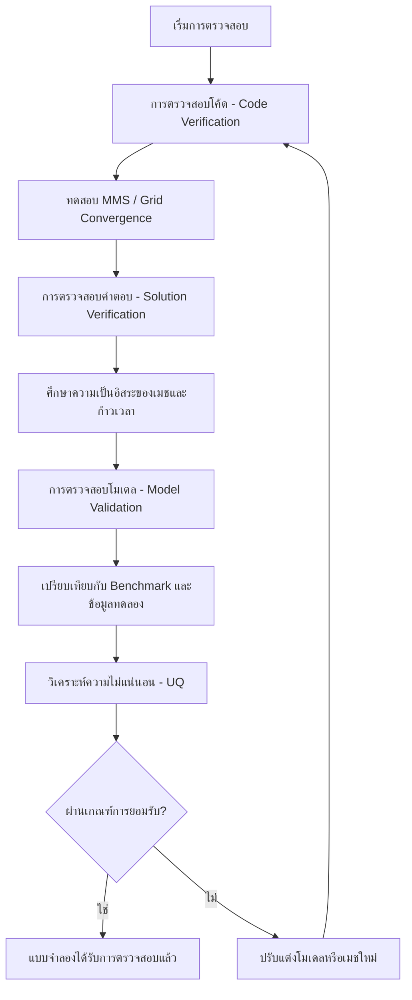

# กรณีการตรวจสอบความถูกต้องของการไหลหลายเฟส (Multiphase Validation Cases)

## ภาพรวม (Overview)

บทนี้จัดทำขึ้นเพื่อเป็นกรอบงานมาตรฐานในการตรวจสอบความถูกต้อง (Validation) ของการจำลอง CFD สำหรับการไหลหลายเฟสใน OpenFOAM โดยครอบคลุมตั้งแต่ระเบียบวิธีที่เป็นระบบ, ปัญหาเบนช์มาร์กมาตรฐาน, การศึกษาการลู่เข้าของกริด (Grid Convergence), และการหาปริมาณความไม่แน่นอน (Uncertainty Quantification) เพื่อให้มั่นใจว่าผลการคำนวณมีความน่าเชื่อถือและแม่นยำ

> [!IMPORTANT] ปรัชญาการตรวจสอบความถูกต้อง
> - **Verification**: "เราแก้สมการได้ถูกต้องหรือไม่?" (ความถูกต้องทางคณิตศาสตร์และอัลกอริทึม)
> - **Validation**: "เราแก้สมการที่ถูกต้องหรือไม่?" (ความถูกต้องทางฟิสิกส์เมื่อเปรียบเทียบกับความเป็นจริง)

---

## ลำดับชั้นการตรวจสอบความถูกต้อง (Validation Hierarchy)



### 1. การตรวจสอบโค้ด (Code Verification)

เพื่อให้มั่นใจว่าการนำอัลกอริทึมไปใช้งานในซอฟต์แวร์นั้นถูกต้องตามหลักคณิตศาสตร์:

#### Method of Manufactured Solutions (MMS)

การสร้างคำตอบทางคณิตศาสตร์ขึ้นมาเพื่อทดสอบว่า Solver สามารถคำนวณได้ตรงตามนั้นหรือไม่

**สำหรับสัดส่วนเฟส** $\alpha_k$:
$$\frac{\partial \alpha_k}{\partial t} + \nabla \cdot (\alpha_k \mathbf{u}_k) = S_{\alpha_k}^{\text{manufactured}}$$

**สำหรับโมเมนตัมของเฟส $k$**:
$$\rho_k \alpha_k \frac{\partial \mathbf{u}_k}{\partial t} + \rho_k \alpha_k (\mathbf{u}_k \cdot \nabla)\mathbf{u}_k = -\alpha_k \nabla p + \mathbf{M}_k^{\text{manufactured}}$$

#### Grid Convergence Index (GCI)

ใช้ประเมินความผิดพลาดจากขนาดของเมช (Mesh size):

$$\text{GCI} = F_s \frac{|\epsilon_{12}|}{r^p - 1}$$

โดยที่:
- $F_s$ คือปัจจัยความปลอดภัย (safety factor, โดยทั่วไปคือ 1.25)
- $\epsilon_{12}$ คือความผิดพลาดสัมพัทธ์ระหว่างเมชสองชุดที่ติดกัน
- $r$ คืออัตราส่วนการทำให้เมชละเอียดขึ้น
- $p$ คืออันดับความแม่นยำ (Order of accuracy)

#### Richardson Extrapolation

จัดการกับความคลาดเคลื่อนเชิงตัวเลขในแต่ละเคส:

$$\phi_{exact} \approx \phi_h + \frac{\phi_h - \phi_{2h}}{2^p - 1}$$

โดยที่:
- $\phi_h$ คือค่าที่คำนวณได้บนกริดขนาด $h$
- $\phi_{2h}$ คือค่าที่คำนวณได้บนกริดขนาด $2h$
- $p$ คืออันดับความแม่นยำที่สังเกตได้

### 2. การตรวจสอบความถูกต้องของคำตอบ (Solution Verification)

#### การตรวจสอบการอนุรักษ์ (Conservation Checks)

ตรวจสอบคุณสมบัติการอนุรักษ์ทั่วโลก:

**การอนุรักษ์มวล**:
$$\sum_{k} \frac{\partial}{\partial t} \int_V \rho_k \alpha_k \, \mathrm{d}V = 0$$

**การอนุรักษ์โมเมนตัม**:
$$\frac{\partial}{\partial t} \int_V \sum_k \rho_k \alpha_k \mathbf{u}_k \, \mathrm{d}V = \mathbf{F}_{\text{external}}$$

**การอนุรักษ์พลังงาน**:
$$\frac{\partial}{\partial t} \int_V \sum_k \rho_k \alpha_k e_k \, \mathrm{d}V = \dot{Q}_{\text{external}}$$

### 3. การตรวจสอบความถูกต้องของโมเดล (Model Validation)

เป็นการยืนยันว่าโมเดลทางคณิตศาสตร์สามารถแทนฟิสิกส์ของการไหลหลายเฟสได้อย่างถูกต้องผ่านการเปรียบเทียบกับผลการทดลอง

> [!INFO] ลำดับความซับซ้อนของการตรวจสอบ
> 1. **การตรวจสอบองค์ประกอบเดียว**: พฤติกรรมฟอง/หยดแยก, การตกตะกอนของอนุภาคในของไหลสงบ
> 2. **การตรวจสอบระบบที่เรียบง่าย**: การไหลแบบฟองในท่อ, การไหลแบบแยกชั้นในท่อแนวนอน
> 3. **การตรวจสอบระบบที่ซับซ้อน**: คอลัมน์ฟองระดับอุตสาหกรรม, ระบบปั๊มแบบหลายเฟส

---

## ปัญหาเบนช์มาร์กหลัก (Key Benchmark Problems)

### 1. การลอยตัวของฟองเดี่ยว (Single Bubble Rise)

ใช้ตรวจสอบความถูกต้องของแรง Drag, Lift และ Virtual Mass

#### การกำหนดค่าทางฟิสิกส์

| พารามิเตอร์ | ค่า | หน่วย |
|---|---|---|
| โดเมน (คอลัมน์) | D = 0.1, H = 0.3 | ม. |
| เส้นผ่านศูนย์กลางฟอง | 3-8 | มม. |
| ระบบของไหล | อากาศ-น้ำ | - |
| สภาวะ | 1 บรรยากาศ | - |
| ตำแหน่งเริ่มต้นฟอง | z = 0.05 | ม. |

#### พารามิเตอร์ไร้มิติที่สำคัญ

**จำนวน Eötvös**:
$$Eo = \frac{\rho_l g d_b^2}{\sigma}$$

**จำนวน Reynolds**:
$$Re_b = \frac{\rho_l u_t d_b}{\mu_l}$$

**จำนวน Morton**:
$$Mo = \frac{g \mu_l^4 (\rho_l - \rho_g)}{\rho_l^2 \sigma^3}$$

#### ความเร็วปลายทาง (Terminal Velocity)

**สำหรับฟองทรงกลม ($Eo < 1$)**:
$$u_t = \frac{g d_b^2 (\rho_l - \rho_g)}{18 \mu_l}$$

**สำหรับฟองที่ผิดรูป ($1 < Eo < 40$)**:
$$u_t = \sqrt{\frac{2 g d_b (\rho_l - \rho_g)}{C_D \rho_l}}$$

โดยที่ $C_D$ ขึ้นอยู่กับ $Eo$ และ $Re$

#### การใช้งานใน OpenFOAM

```cpp
// 0/alpha.gas - สัดส่วนเฟสเริ่มต้น
dimensions      [0 0 0 0 0 0 0];
internalField   uniform 0;

// สร้างการเริ่มต้นฟองทรงกลม
const Vector<double> bubbleCenter(0.05, 0.05, 0.05);
const scalar bubbleRadius = 0.004;  // 4 มม.

forAll(alphaGas, celli)
{
    const Vector<double>& cellCenter = mesh.C()[celli];
    scalar r = mag(cellCenter - bubbleCenter);

    // การเริ่มต้นที่ราบรื่นโดยใช้ hyperbolic tangent
    scalar alpha = 0.5 * (1 - tanh((r - bubbleRadius) / (0.5 * mesh.V()[celli]^(1.0/3.0))));
    alphaGas[celli] = alpha;
}

// constant/transportProperties
phases (gas liquid);

gas
{
    transportModel  Newtonian;
    nu              [0 2 -1 0 0 0 0] 1.5e-5;
    rho             [1 -3 0 0 0 0 0] 1.2;
}

liquid
{
    transportModel  Newtonian;
    nu              [0 2 -1 0 0 0 0] 1.0e-6;
    rho             [1 -3 0 0 0 0 0] 1000;
    sigma           [1 0 -2 0 0 0 0] 0.072;
}
```

#### ฟังก์ชันตรวจสอบความถูกต้อง

```cpp
// ฟังก์ชันสำหรับดึงคุณสมบัติฟอง
void extractBubbleProperties()
{
    // คำนวณจุดศูนย์กลางมวลฟอง
    scalar V_bubble = 0.0;
    Vector<double> r_centroid(0, 0, 0);

    forAll(alphaGas, celli)
    {
        if (alphaGas[celli] > 0.5)
        {
            V_bubble += mesh.V()[celli] * alphaGas[celli];
            r_centroid += mesh.C()[celli] * mesh.V()[celli] * alphaGas[celli];
        }
    }

    r_centroid /= V_bubble;

    // คำนวณความเร็วการขึ้น
    scalar z_velocity = U_gas.component(2).weightedAverage(alphaGas);

    // คำนวณพารามิเตอร์รูปร่างฟอง
    scalar aspectRatio = calculateAspectRatio(alphaGas);

    Info << "คุณสมบัติฟอง:" << nl
         << "  ปริมาตร: " << V_bubble << " ลบ.ม." << nl
         << "  จุดศูนย์กลาง: " << r_centroid << " ม." << nl
         << "  ความเร็วการขึ้น: " << z_velocity << " ม./วิ." << nl
         << "  อัตราส่วนภาพ: " << aspectRatio << endl;
}
```

#### เกณฑ์การยอมรับ

- ความคลาดเคลื่อนความเร็วปลายทาง < 10% เทียบกับสหสัมพันธ์การทดลอง
- พารามิเตอร์รูปร่างอยู่ในช่วงที่คาดหวังสำหรับ $Eo$ และ $Re$
- การอนุรักษ์มวล: $\frac{\Delta m}{m_0} < 0.1\%$ ในช่วงเวลาจำลอง

### 2. การไหลแบบแยกชั้นในท่อแนวนอน (Stratified Flow in Horizontal Pipes)

ใช้ตรวจสอบการถ่ายโอนโมเมนตัมที่อินเตอร์เฟซและพยากรณ์รูปแบบการไหล (Flow Pattern)

#### พารามิเตอร์เรขาคณิตและการดำเนินงาน

| พารามิเตอร์ | ช่วงค่า | หน่วย |
|---|---|---|
| เส้นผ่านศูนย์กลางท่อ | 0.05 | ม. |
| ความยาวท่อ | 10.0 | ม. |
| ความเร็วแก๊ส | 0.1-5.0 | ม./วิ. |
| ความเร็วของเหลว | 0.01-1.0 | ม./วิ. |

#### พารามิเตอร์ไร้มิติ

**จำนวน Froude**:
$$Fr = \frac{U_g}{\sqrt{gD}}$$

**พารามิเตอร์ Lockhart-Martinelli**:
$$X = \sqrt{\frac{(dP/dx)_l}{(dP/dx)_g}}$$

#### โมเดล Taitel-Dukler

สำหรับความสูงของเหลว $h_l$:
$$h_l^* = \frac{h_l}{D} = f\left(X, \frac{U_{sg}}{U_{sl}}, \frac{\rho_g}{\rho_l}\right)$$

#### เกณฑ์การเกิดคลื่น (Kelvin-Helmholtz instability)

$$U_{sg,crit} = \sqrt{\frac{(\rho_l - \rho_g) g \cos \beta \, h_l}{\rho_g}}$$

#### แผนที่รูปแบบการไหล

1. **แยกชั้นเรียบ**: ความเร็วแก๊สต่ำ ไม่มีคลื่นผิวสัมผัส
2. **แยกชั้นเป็นคลื่น**: ความเร็วแก๊สปานกลาง ความไม่เสถียร Kelvin-Helmholtz
3. **การไหลสลัก**: ความเร็วแก๊สสูง การเติบโตของคลื่นไปสู่การเชื่อมท่อ

#### เกณฑ์การยอมรับ

- ความถูกต้องของการเปลี่ยนผ่านรูปแบบการไหล > 90%
- ความคลาดเคลื่อนการพยากรณ์ความสูงของเหลว < 10%
- ความคลาดเคลื่อนการพยากรณ์การลดความดัน < 15%

### 3. เตียงไหลฟลูอิดไดซ์ (Fluidized Bed)

ตรวจสอบแรง Drag ระหว่างแก๊สและของแข็ง

#### การกำหนดค่าทางฟิสิกส์

| พารามิเตอร์ | ค่า | หน่วย |
|---|---|---|
| มิติเตียง | 0.3 × 0.025 × 1.0 | ม. |
| ความสูงเตียงเริ่มต้น | 0.5 | ม. |
| เส้นผ่านศูนย์กลางอนุภาค | 500 | ไมโครเมตร |
| ความหนาแน่นอนุภาค | 2500 | กก./ลบ.ม. |
| ความเร็วแก๊สต่อผิว | 0.25 | ม./วิ. |

#### สมการ Ergun

สำหรับการลดความดันผ่านเตียงบรรจุ:
$$\frac{\Delta P}{L} = \frac{150(1-\alpha_s)^2 \mu_g U_{mf}}{\alpha_s^3 d_p^2} + \frac{1.75(1-\alpha_s) \rho_g U_{mf}^2}{\alpha_s^3 d_p}$$

ที่การไหลฟลูอิดไดซ์ขั้นต่ำ: $\Delta P = (\rho_s - \rho_g)(1-\alpha_s)gH$

#### การใช้งานใน OpenFOAM

```cpp
// constant/phaseProperties - คุณสมบัติเฟสของแข็ง
phaseModel solid
{
    type            incompressible;
    diameterModel   constant;
    d               5e-4;         // 500 ไมโครเมตร
    residualAlpha   1e-6;
    rho             2500;         // กก./ลบ.ม.

    // คุณสมบัติอนุภาค
    maxAlpha        0.64;         // การบรรจงสูงสุด
    e               0.9;          // สัมประสิทธิ์การชน

    // แบบจำลองแรงลากสำหรับเตียงไหลฟลูอิดไดซ์
    drag
    {
        type            SyamlalOBrien;
        voidfractionModel  constant;
        residualAlpha   1e-6;
    }
}
```

#### เกณฑ์การยอมรับ

- ความคลาดเคลื่อนอัตราส่วนการขยายเตียง < 10%
- ความคลาดเคลื่อนการลดความดัน < 5%
- การพยากรณ์ความถี่ฟองภายใน ±25%

---

## การหาปริมาณความไม่แน่นอน (Uncertainty Quantification)

### Sobol Sensitivity Analysis

ใช้เพื่อวิเคราะห์ว่าตัวแปรใดในโมเดลมีผลกระทบต่อผลลัพธ์มากที่สุด ผ่านการแยกแยะความแปรปรวน (Variance Decomposition):

$$\text{Var}(Y) = \sum_{i} V_i + \sum_{i<j} V_{ij} + \cdots + V_{12...k}$$

**ดัชนี Sobol ที่สำคัญ:**
- **ดัชนีลำดับแรก** $S_i = V_i/\text{Var}(Y)$ → แสดงถึงส่วนของผลหลัก
- **ดัชนีรวม** $S_{Ti}$ → รวมถึงผลของปฏิสัมพันธ์ทั้งหมด

### Monte Carlo Methods

ใช้สุ่มพารามิเตอร์เพื่อหาช่วงความเชื่อมั่นของผลลัพธ์ โดยความคลาดเคลื่อนจะลดลงตามอัตราส่วน $1/\sqrt{N}$ เมื่อ $N$ คือจำนวนตัวอย่าง

#### เทคนิคการปรับปรุงความเร็ว

| เทคนิค | ประสิทธิภาพ | กรณีที่เหมาะสม |
|----------|-------------|------------------|
| **Latin hypercube sampling** | ดีกว่าแบบง่าย | กรณีทั่วไป |
| **Importance sampling** | ดีมาก | บริเวณความน่าจะเป็นสูง |
| **Quasi-Monte Carlo** | ดีมาก | ฟังก์ชันราบเรียบ |

#### การ Implement ใน OpenFOAM

```cpp
// Monte Carlo uncertainty analysis
class monteCarloAnalysis
{
private:
    scalarField meanParameters_;
    scalarField stdParameters_;
    label nMonteCarlo_;

public:
    void runAnalysis()
    {
        scalarField results(nMonteCarlo_);

        for (int i = 0; i < nMonteCarlo_; i++)
        {
            // Generate random parameter set
            scalarField randomParams = generateRandomParameters();

            // Run simulation
            results[i] = runSingleSimulation(randomParams);
        }

        // Calculate statistics
        scalar meanResult = average(results);
        scalar stdResult = stdDeviation(results);
        scalar confidenceInterval = 1.96 * stdResult / sqrt(nMonteCarlo_);

        Info << "Monte Carlo Results:" << endl;
        Info << "Mean: " << meanResult << endl;
        Info << "Std dev: " << stdResult << endl;
        Info << "95% CI: [" << meanResult - confidenceInterval
             << ", " << meanResult + confidenceInterval << "]" << endl;
    }
};
```

---

## เกณฑ์การยอมรับ (Acceptance Criteria)

| ตัวชี้วัด (Metric) | ข้อกำหนด (Requirement) | การประยุกต์ใช้ |
|--------|-------------|-------------|
| **Global Parameters** | Error < 5% | Pressure drop, Void fraction |
| **Local Profiles** | RMS error < 0.05 | Phase fraction, Velocity profiles |
| **Conservation** | Imbalance < 1% | Mass and Energy balance |
| **Grid Convergence** | GCI < 2% | Finest mesh resolution |

---

## รายการตรวจสอบ (Validation Checklist)

### ข้อกำหนดก่อนการตรวจสอบความถูกต้อง

#### การตรวจสอบคุณภาพ Mesh

```cpp
// การประเมินคุณภาพกริด
void assessMeshQuality()
{
    scalar maxAspectRatio = max(mesh.aspectRatio());
    scalar minOrthogonality = min(mesh.orthogonality());
    scalar maxNonOrthogonality = max(mesh.nonOrthogonality());
    scalar maxSkewness = max(mesh.skewness());

    Info << "ตัวชี้วัดคุณภาพกริด:" << nl
         << "  อัตราส่วนภาพสูงสุด: " << maxAspectRatio << nl
         << "  ความตั้งฉากขั้นต่ำ: " << minOrthogonality << nl
         << "  ความไม่ตั้งฉากสูงสุด: " << maxNonOrthogonality << nl
         << "  ความเบ้สูงสุด: " << maxSkewness << nl;

    // เกณฑ์คุณภาพ
    bool meshOK = true;
    if (maxAspectRatio > 1000)
    {
        WarningIn("assessMeshQuality") << "ตรวจพบอัตราส่วนภาพสูง: " << maxAspectRatio;
        meshOK = false;
    }

    if (maxNonOrthogonality > 70)
    {
        WarningIn("assessMeshQuality") << "ความไม่ตั้งฉากสูง: " << maxNonOrthogonality;
        meshOK = false;
    }

    if (maxSkewness > 4)
    {
        WarningIn("assessMeshQuality") << "ความเบ้สูง: " << maxSkewness;
        meshOK = false;
    }

    Info << "คุณภาพกริด: " << (meshOK ? "ผ่าน" : "ไม่ผ่าน") << endl;
}
```

### เกณฑ์การยอมรับการตรวจสอบความถูกต้องสุดท้าย

**ข้อกำหนดเชิงปริมาณ:**

- **พารามิเตอร์ทั่วโลก**: ความคลาดเคลื่อนการพยากรณ์ < 5% สำหรับปริมาณสำคัญ (การลดความดัน, สัดส่วนช่องว่าง)
- **โปรไฟล์ในพื้นที่**: ความคลาดเคลื่อน RMS < 0.05 สำหรับโปรไฟล์สัดส่วนเฟสและความเร็ว
- **พฤติกรรมไดนามิก**: การแปรเปลี่ยนตามเวลาอยู่ภายใน ±10% ของข้อมูลทดลอง
- **การอนุรักษ์**: ความไม่สมดุลมวล/พลังงาน < 1% ในช่วงเวลาจำลอง
- **การลู่เข้าของกริด**: GCI < 2% บนกริดที่ละเอียดที่สุด
- **ขอบเขตความไม่แน่นอน**: การพยากรณ์แบบจำลองอยู่ภายในช่วงความไม่แน่นอนของการทดลอง

**ข้อกำหนดเชิงคุณภาต:**

- พฤติกรรมทางกายภาพสอดคล้องกับรูปแบบการไหลที่คาดหวัง
- ไม่มีความไม่เสถียรเชิงตัวเลขหรือค่าที่ไม่ใช่ทางกายภาพ
- การลู่เข้าที่ราบรื่นด้วยระดับส่วนที่เหลือที่เหมาะสม
- ความไวต่อการแปรผันของพารามิเตอร์ที่เหมาะสม

---

## แหล่งข้อมูลทดลองที่สำคัญ

### 1. ฐานข้อมูลคอลัมน์ฟอง (Deckwer, 1992)

**การอ้างอิงการทดลอง**: ข้อมูลทดลองจาก Deckwer (1992) ให้ข้อมูลการตรวจสอบความถูกต้องที่ครอบคลุมสำหรับเครื่องปฏิกรณ์คอลัมน์ฟองแก๊ส-ของเหลว

**ความสัมพันธ์การกักเก็บแก๊ส**:
$$\epsilon_g = 0.672 \left( \frac{U_g \mu_l}{\sigma} \right)^{0.578} \left( \frac{\mu_l^4 g}{\rho_l \sigma^3} \right)^{-0.131} \left( \frac{\rho_l}{\rho_g} \right)^{0.062}$$

### 2. ระบบการจำแนกอนุภาคของ Geldart (1973)

**จำนวนเรย์โนลด์ที่จำเป็นสำหรับการไหลตัวแข็งขั้นต่ำ**:
$$Re_{mf} = \frac{\rho_g U_{mf} d_p}{\mu_g}$$

**ความสัมพันธ์ Wen & Yu สำหรับความเร็วไหลตัวแข็งขั้นต่ำ**:
$$U_{mf} = \frac{\mu_g}{d_p \rho_g} \left[ \sqrt{33.7^2 + 0.0408 Ar} - 33.7 \right]$$

### 3. แผนที่รูปแบบการไหลของ Mandhane et al. (1974)

**เกณฑ์การเปลี่ยนผ่านหลัก**:
- **ฟอง → สลัก**: $U_{sg,c} \approx 0.5$ ม./วินาที (การรวมตัวของฟอง)
- **สลัก → ปั่นป่วน**: $U_{sg,c} \approx 3.0$ ม./วินาที (ความไม่เสถียร Kelvin-Helmholtz)
- **ปั่นป่วน → วงแหวน**: $U_{sg,c} \approx 10.0$ ม./วินาที (การทำลายเสถียรภาพฟิล์ม)

---

## สรุป

การปฏิบัติตามกรอบงานนี้จะช่วยให้การจำลองการไหลหลายเฟสด้วย OpenFOAM มีความน่าเชื่อถือและสามารถนำไปใช้ในงานวิศวกรรมจริงได้อย่างมั่นใจ

> [!TIP] แหล่งอ้างอิงเพิ่มเติม
> - วิเคราะห์ตามมาตรฐาน ASME V&V 20
> - ระเบียบวิธีสากลสำหรับการตรวจสอบความถูกต้องของ CFD
> - ฐานข้อมูลการทดลองมาตรฐานสากล
