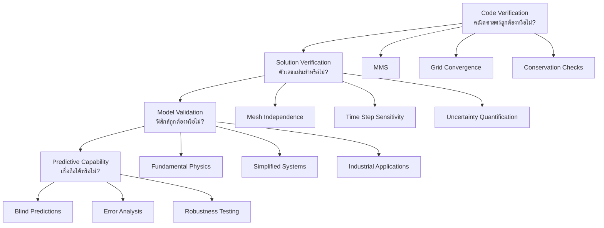
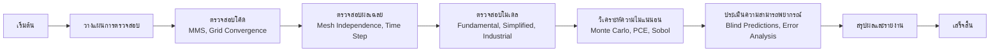

# ระเบียบวิธีการตรวจสอบความถูกต้อง (Validation Methodology)

## 1. บทนำ (Introduction)

**การตรวจสอบความถูกต้อง (Validation)** คือกระบวนการเป็นระบบเพื่อให้แน่ใจว่าแบบจำลองทางคอมพิวเตอร์สามารถแทนปรากฏการณ์ทางฟิสิกส์ในโลกแห่งความเป็นจริงได้อย่างแม่นยำ สำหรับการไหลหลายเฟสแบบ Eulerian-Eulerian การตรวจสอบความถูกต้องช่วยสร้างความเชื่อมั่นในผลการพยากรณ์ของ CFD ผ่านการเปรียบเทียบอย่างเข้มงวดกับผลเฉลยเชิงวิเคราะห์ (Analytical solutions), ข้อมูลการทดลอง (Experimental data) และปัญหาเบนช์มาร์ก (Benchmark problems)

### 1.1 ความสำคัญของการตรวจสอบความถูกต้อง

ในการสร้างแบบจำลองการไหลแบบหลายเฟส การตรวจสอบความถูกต้องมีบทบาทเป็นสะพานที่สำคัญระหว่างการกำหนดสูตรทางทฤษฎีกับการประยุกต์ใช้ทางวิศวกรรมจริง โดยมีวัตถุประสงค์เพื่อ:

- ยืนยันความถูกต้องของการ implement เชิงตัวเลข (Code verification)
- ตรวจสอบความแม่นยำของการแก้สมการคณิตศาสตร์ (Solution verification)
- ทำให้มั่นใจในความถูกต้องของโมเดลฟิสิกส์ (Model validation)
- ประเมินความสามารถในการพยากรณ์ (Predictive capability)

### 1.2 ลักษณะเฉพาะของการไหลหลายเฟส

การตรวจสอบความถูกต้องสำหรับระบบหลายเฟสมีความท้าทายเพิ่มเติมเมื่อเปรียบเทียบกับการไหลเฟสเดียว:

- **การกระจายของสัดส่วนปริมาณเฟส** (Phase fraction distribution)
- **ความเข้มข้นของพื้นที่อินเตอร์เฟส** (Interfacial area concentration)
- **โปรไฟล์ความเร็วเฉพาะเฟส** (Phase-specific velocity profiles)
- **การโต้ตอบระหว่างเฟส** (Interphase interactions)

---

## 2. ลำดับชั้นของการตรวจสอบความถูกต้อง (Validation Hierarchy)

กระบวนการตรวจสอบความถูกต้องจะดำเนินการตามลำดับขั้นจากพื้นฐานไปสู่ระบบที่ซับซ้อน:



### 2.1 การตรวจสอบโค้ด (Code Verification)

เพื่อให้แน่ใจว่าการเขียนโปรแกรมและอัลกอริทึมแก้สมการคณิตศาสตร์ได้อย่างถูกต้อง:

#### 2.1.1 Method of Manufactured Solutions (MMS)

การกำหนดผลเฉลยเชิงวิเคราะห์และคำนวณเทอมแหล่งกำเนิด (Source terms) เพื่อทดสอบ Solver:

**สำหรับสัดส่วนเฟส** $\alpha_k$:
$$\frac{\partial \alpha_k}{\partial t} + \nabla \cdot (\alpha_k \mathbf{u}_k) = S_{\alpha_k}^{\text{manufactured}}$$

**สำหรับโมเมนตัมของเฟส $k$**:
$$\rho_k \alpha_k \frac{\partial \mathbf{u}_k}{\partial t} + \rho_k \alpha_k (\mathbf{u}_k \cdot \nabla)\mathbf{u}_k = -\alpha_k \nabla p + \mathbf{M}_k^{\text{manufactured}}$$

**ตัวอย่างโค้ด OpenFOAM สำหรับ MMS:**

```cpp
// การสร้างเทอมต้นทางสำหรับ MMS
volScalarField Salpha1
(
    IOobject("Salpha1", runTime.timeName(), mesh),
    mesh,
    dimensionedScalar("zero", dimensionSet(0,-3,0,0,0,0,0), 0.0)
);

// คำนวณเทอมต้นทางจากผลเฉลยเชิงวิเคราะห์
const volScalarField alpha1Exact = 0.5 * (1.0 + tanh((mesh.C().component(1) - 0.5 - 0.1*sin(2.0*pi*mesh.C().component(0)))/0.05));

const volVectorField U1Exact
(
    U0.value() * (vector(1,0,0) * (1.0 + sin(2.0*pi*mesh.C().component(0)/Lx.value()) * cos(2.0*pi*runTime.time().value()/T.value())) +
    vector(0,1,0) * (1.0 + cos(2.0*pi*mesh.C().component(1)/Ly.value()) * sin(2.0*pi*runTime.time().value()/T.value())))
);

// คำนวณเทอมต้นทางสมการต่อเนื่อง
Salpha1 = -(fvc::ddt(alpha1Exact, rho1) + fvc::div(alpha1Exact * rho1 * U1Exact));
```

#### 2.1.2 Grid Convergence Studies

ประเมินความแม่นยำของการ Discretization ผ่าน **Grid Convergence Index (GCI)**:

$$\text{GCI} = F_s \frac{|\epsilon_{12}|}{r^p - 1}$$

โดย:
- $F_s$ คือปัจจัยความปลอดภัย (มักใช้ 1.25)
- $\epsilon_{12}$ คือ Error สัมพัทธ์ระหว่างเมช
- $r$ คืออัตราส่วนการละเอียดของเมช
- $p$ คืออันดับความแม่นยำที่สังเกตได้ (Observed order of accuracy)

**ขั้นตอนการคำนวณ GCI:**

```cpp
// ฟังก์ชันสำหรับคำนวณ GCI
scalar calculateGCI(scalar f1, scalar f2, scalar f3, scalar r)
{
    // ข้อผิดพลาดสัมพัทธ์
    scalar epsilon21 = fabs((f2 - f1)/f1);
    scalar epsilon32 = fabs((f3 - f2)/f2);

    // ลำดับความแม่นยำที่ปรากฏ
    scalar p = log(fabs(epsilon32/epsilon21))/log(r);

    // ค่าที่ extrapolate
    scalar f_ext = (pow(r,p) * f2 - f1)/(pow(r,p) - 1.0);

    // ค่าคลาดเคลื่อน extrapolate
    scalar e_ext = fabs((f_ext - f1)/f_ext);

    // GCI สำหรับกริดละเอียด
    scalar GCI_fine = 1.25 * e_ext/(pow(r,p) - 1.0);

    return GCI_fine;
}
```

#### 2.1.3 Conservation Checks

ตรวจสอบการอนุรักษ์มวลและพลังงานในระดับ Global:

**การอนุรักษ์มวล**:
$$\sum_{k} \frac{\partial}{\partial t} \int_V \rho_k \alpha_k \, \mathrm{d}V = 0$$

**การอนุรักษ์โมเมนตัม**:
$$\frac{\partial}{\partial t} \int_V \sum_k \rho_k \alpha_k \mathbf{u}_k \, \mathrm{d}V = \mathbf{F}_{\text{external}}$$

**การอนุรักษ์พลังงาน**:
$$\frac{\partial}{\partial t} \int_V \sum_k \rho_k \alpha_k e_k \, \mathrm{d}V = \dot{Q}_{\text{external}}$$

**ตัวอย่างโค้ด OpenFOAM สำหรับตรวจสอบ Mass Balance:**

```cpp
// การตรวจสอบการอนุรักษ์มวลสำหรับ multiphase flow
forAll(phases, phasei)
{
    const volScalarField& alpha = phases[phasei];
    const volVectorField& U = phases[phasei].U();

    // คำนวณ flux ผ่าน boundaries
    scalar massIn = fvc::domainIntegrate(alpha*U & mesh.Sf()).value();
    scalar massOut = -massIn; // จากการอนุรักษ์

    // ตรวจสอบความสมดุล
    Info<< "Phase " << phases[phasei].name()
        << " mass balance error: " << mag(massIn + massOut)
        << " kg/s" << endl;
}
```

---

### 2.2 การตรวจสอบความถูกต้องของโมเดล (Model Validation)

ประเมินว่าโมเดลทางคณิตศาสตร์แทนปรากฏการณ์ทางฟิสิกส์ได้ถูกต้องเพียงใด:

#### 2.2.1 Fundamental Physics

เปรียบเทียบความเร็วลอยตัวของฟองเดี่ยว (Single bubble rise velocity) กับสูตรสหสัมพันธ์:

$$v_t = \sqrt{\frac{4g d_b (\rho_l - \rho_g)}{3C_d \rho_l}}$$

โดยที่ $C_d$ คือสัมประสิทธิ์แรงลากซึ่งขึ้นอยู่กับจำนวน Reynolds:
$$Re_b = \frac{\rho_l v_t d_b}{\mu_l}$$

**การตรวจสอบความถี่ของการสั่น**:
$$f = \frac{1}{2\pi} \sqrt{\frac{8\sigma}{\rho_l d_b^3}}$$

**การตรวจสอบการถ่ายเทความร้อน** (สหสัมพันธ์จำนวน Nusselt ของอนุภาคเดี่ยว):
$$Nu = 2 + 0.6 Re^{1/2} Pr^{1/3}$$

#### 2.2.2 Simplified Systems

ทดสอบกับระบบที่ควบคุมสภาวะได้ง่าย เช่น Bubble columns หรือการไหลในท่อ (Pipe flows) เพื่อวัดค่า Pressure drop ($\Delta P$) และสัดส่วนปริมาตรแก๊ส ($\alpha_g$):

| ระบบทดสอบ | ปริมาณที่ตรวจสอบ | การวัดที่เกี่ยวข้อง |
|---|---|---|
| **Bubble columns** | Gas holdup, การกระจายขนาดฟอง, โปรไฟล์ความเร็ว | $\alpha_g = \frac{V_g}{V_{total}}$, $PDF(d_b)$, $\mathbf{u}_l(r,z)$ |
| **การไหลในท่อ** | การลดความดัน, รูปแบบการไหล, แผนภูมิช่วง | $\Delta P = f \frac{L}{D} \frac{\rho v^2}{2}$, Baker/Taitel-Dukler |
| **พลวัตของหยด** | การกระจายขนาดหยด, ความยาวการแตกหัก, ความลึกการเจาะ | การกระจายขนาด, เวลาการแตกหัก, ความลึก |

#### 2.2.3 Industrial Applications

ทดสอบกับระบบจริง เช่น Fluidized beds เพื่อวัด:

- อัตราการขยายตัวของชั้นอนุภาค (Bed expansion ratio)
- สเกลเวลาการผสม (Mixing time scale)
- สัมประสิทธิ์การถ่ายเทความร้อน (Heat transfer coefficient)
- อัตราการเปลี่ยนแปลงทางเคมี (Chemical reaction rate)

---

### 2.3 การประเมินความสามารถในการพยากรณ์ (Predictive Capability Assessment)

ประเมินประสิทธิภาพของแบบจำลองในสภาวะที่ไม่ได้ใช้ในการปรับแต่ง (Calibration) โมเดล:

#### 2.3.1 Blind Predictions

การทำนายผลโดยที่ผู้คำนวณไม่ทราบผลการทดลองล่วงหน้า เพื่อความโปร่งใสสูงสุด

| ประเภทการทดสอบ | ตัวอย่าง | วัตถุประสงค์ |
|---|---|---|
| **International benchmarks** | CSNI International Standard Problems, OECD/NEA studies, ERCOFTAC groups | การเปรียบเทียบมาตรฐานระดับนานาชาติ |
| **กรณีอุตสาหกรรม** | การเปลี่ยนแปลงชั่วคราว, การพยากรณ์ฉุกเฉิน, การขยายขนาด | การทดสอบสถานการณ์จริง |
| **การปรับเหมาะสมกับการออกแบบ** | จุดประสิทธิภาพสูงสุด, ขอบเขตความเสถียร | การหาเงื่อนไขการทำงานที่เหมาะสมที่สุด |

#### 2.3.2 Error Analysis

การวิเคราะห์ความคลาดเคลื่อนทางสถิติ:

**RMSE** (Root Mean Square Error):
$$\text{RMSE} = \sqrt{\frac{1}{N}\sum_{i=1}^{N}(y_i^{pred} - y_i^{exp})^2}$$

**MAPE** (Mean Absolute Percentage Error):
$$\text{MAPE} = \frac{100\%}{N}\sum_{i=1}^{N}\left|\frac{y_i^{pred} - y_i^{exp}}{y_i^{exp}}\right|$$

**R²** (สัมประสิทธิ์การตัดสินใจ):
$$R^2 = 1 - \frac{\sum_{i=1}^{N}(y_i^{exp} - y_i^{pred})^2}{\sum_{i=1}^{N}(y_i^{exp} - \bar{y}^{exp})^2}$$

---

## 3. การหาปริมาณความไม่แน่นอน (Uncertainty Quantification)

ใช้ประเมินความน่าเชื่อถือของแบบจำลองเมื่อปัจจัยนำเข้ามีความแปรปรวน:

### 3.1 แหล่งความไม่แน่นอนหลัก

| ประเภท | คำอธิบาย | ตัวอย่าง |
|---|---|---|
| **Input Uncertainty** | การส่งผ่านความคลาดเคลื่อนจากข้อมูลดิบ | $\sigma_{output}^2 = \sum (\partial f / \partial x_i)^2 \sigma_{x_i}^2$ |
| **Parameter Uncertainty** | ความแปรปรวนของค่าพารามิเตอร์โมเดล | $C_D \pm \Delta C_D$, $C_L \pm \Delta C_L$ |
| **Model Form Uncertainty** | ข้อจำกัดของโมเดลฟิสิกส์ | การประมาณค่าการกระจายแรง |
| **Experimental Uncertainty** | ความไม่แน่นอนในข้อมูลทดลอง | ความคลาดเคลื่อนการวัด, ความละเอียดเซ็นเซอร์ |

### 3.2 Sensitivity Analysis

ใช้ **Sobol Indices** เพื่อระบุว่าพารามิเตอร์ใดส่งผลต่อความแม่นยำมากที่สุด:

$$S_i = \frac{\text{Var}_{x_i}(\mathbb{E}[f|x_i])}{\text{Var}(f)}$$

**ดัชนี Sobol ที่สำคัญ:**
- **ดัชนีลำดับแรก** $S_i$ → แสดงถึงส่วนของผลหลัก
- **ดัชนีรวม** $S_{Ti}$ → รวมถึงผลของปฏิสัมพันธ์ทั้งหมด

### 3.3 Monte Carlo Analysis

**ตัวอย่างโครงสร้างโค้ด Monte Carlo Analysis:**

```cpp
class monteCarloAnalysis
{
private:
    scalarField meanParameters_;
    scalarField stdParameters_;
    label nMonteCarlo_;

public:
    monteCarloAnalysis(const scalarField& meanParams, const scalarField& stdParams, label nMC)
    : meanParameters_(meanParams), stdParameters_(stdParams), nMonteCarlo_(nMC)
    {}

    void runAnalysis()
    {
        scalarField results(nMonteCarlo_);

        for (int i = 0; i < nMonteCarlo_; i++)
        {
            // Generate random parameter set
            scalarField randomParams = generateRandomParameters();

            // Run simulation
            results[i] = runSingleSimulation(randomParams);
        }

        // Calculate statistics
        scalar meanResult = average(results);
        scalar stdResult = stdDeviation(results);
        scalar confidenceInterval = 1.96 * stdResult / sqrt(nMonteCarlo_);

        Info << "Monte Carlo Results:" << endl;
        Info << "Mean: " << meanResult << endl;
        Info << "Std dev: " << stdResult << endl;
        Info << "95% CI: [" << meanResult - confidenceInterval
             << ", " << meanResult + confidenceInterval << "]" << endl;
    }
};
```

### 3.4 Polynomial Chaos Expansion (PCE)

การขยาย Polynomial Chaos ให้ทางเลือกที่มีประสิทธิภาพกว่าวิธี Monte Carlo:

$$Y(\mathbf{p}) = \sum_{\boldsymbol{\alpha} \in \mathcal{A}} c_{\boldsymbol{\alpha}} \Psi_{\boldsymbol{\alpha}}(\mathbf{p})$$

โดยที่:
- $\Psi_{\boldsymbol{\alpha}}$ = พหุนามมุมฉากหลายตัวแปร
- $c_{\boldsymbol{\alpha}}$ = สัมประสิทธิ์การขยาย
- $\mathcal{A}$ = เซตของดัชนีหลายตัวแปร

**ข้อดีของ PCE:**
- คำนวณโมเมนต์ทางสถิติแบบวิเคราะห์
- คำนวณดัชนี Sobol แบบวิเคราะห์
- ต้นทุนการคำนวณขั้นต่ำ

**การเลือกครอบครัวพหุนาม:**

| การกระจายพารามิเตอร์ | ครอบครัวพหุนาม | ลักษณะเฉพาะ |
|---|---|---|
| **Gaussian** | Hermite | เหมาะกับข้อมูลปกติ |
| **Uniform** | Legendre | ช่วงค่าคงที่ |
| **Beta** | Jacobi | ช่วงค่าจำกัด |
| **Exponential** | Laguerre | ค่าเอ็กซ์โพเนนเชียล |

---

## 4. รายการตรวจสอบคุณภาพ (Quality Assurance Checklist)

เพื่อให้งานตรวจสอบความถูกต้องมีคุณภาพระดับมาตรฐาน:

### 4.1 การตรวจสอบคุณภาพกริด

**ตัวอย่างโค้ดสำหรับประเมินคุณภาพกริด:**

```cpp
// การประเมินคุณภาพกริด
void assessMeshQuality()
{
    scalar maxAspectRatio = max(mesh.aspectRatio());
    scalar minOrthogonality = min(mesh.orthogonality());
    scalar maxNonOrthogonality = max(mesh.nonOrthogonality());
    scalar maxSkewness = max(mesh.skewness());

    Info << "ตัวชี้วัดคุณภาพกริด:" << nl
         << "  อัตราส่วนภาพสูงสุด: " << maxAspectRatio << nl
         << "  ความตั้งฉากขั้นต่ำ: " << minOrthogonality << nl
         << "  ความไม่ตั้งฉากสูงสุด: " << maxNonOrthogonality << nl
         << "  ความเบ้สูงสุด: " << maxSkewness << nl;

    // เกณฑ์คุณภาพ
    bool meshOK = true;
    if (maxAspectRatio > 1000)
    {
        WarningIn("assessMeshQuality") << "ตรวจพบอัตราส่วนภาพสูง: " << maxAspectRatio;
        meshOK = false;
    }

    if (minOrthogonality < 0.1)
    {
        WarningIn("assessMeshQuality") << "ความตั้งฉากต่ำ: " << minOrthogonality;
        meshOK = false;
    }

    if (maxNonOrthogonality > 70)
    {
        WarningIn("assessMeshQuality") << "ความไม่ตั้งฉากสูง: " << maxNonOrthogonality;
        meshOK = false;
    }

    if (maxSkewness > 4)
    {
        WarningIn("assessMeshQuality") << "ความเบ้สูง: " << maxSkewness;
        meshOK = false;
    }

    Info << "คุณภาพกริด: " << (meshOK ? "ผ่าน" : "ไม่ผ่าน") << endl;
}
```

### 4.2 เกณฑ์การยอมรับ

> [!INFO] ข้อกำหนดคุณภาพ
>
> 1. **Mesh Quality**: Non-orthogonality < 70°, Skewness < 4, Aspect ratio < 1000
> 2. **Temporal Resolution**: เลข Courant (CFL) < 1.0 สำหรับอัลกอริทึม PISO
> 3. **Convergence**: ส่วนที่เหลือ (Residuals) ลดลงอย่างน้อย 6 อันดับ (Residual reduction < $10^{-6}$)
> 4. **Conservation**: ความไม่สมดุลของมวลและพลังงานรวมต้องน้อยกว่า 1%

### 4.3 เกณฑ์การยอมรับการตรวจสอบความถูกต้อง

**ข้อกำหนดเชิงปริมาณ:**

| ระดับ | ชนิด | เกณฑ์การยอมรับ |
|---|---|---|
| **ระดับ 1** (การตรวจสอบโค้ด) | ความแม่นยำ | $\|p_{numerical} - p_{theoretical}\| < 0.1$ |
| | การอนุรักษ์ | $\|\text{mass/volume/energy balance}\| < 10^{-10}$ |
| **ระดับ 2** (การตรวจสอบผลเฉลย) | GCI ปริมาณเฉลี่ยตามเฟส | GCI < 5% |
| | GCI สัดส่วนปริมาณเฟสในพื้นที่ | GCI < 10% |
| | การบรรจบกันเชิงซ้ำ | $r/r_0 < 10^{-8}$ |
| **ระดับ 3** (การตรวจสอบแบบจำลอง) | NRMSE วิศวกรรม | NRMSE < 15% |
| | NRMSE วิจัย | NRMSE < 5% |
| | สัมประสิทธิ์การกำหนด | $R^2 > 0.8$ |
| | การตรวจสอบเฉพาะเฟส | $\epsilon_{\alpha,k} < 20\%$, $\epsilon_{u,k} < 15\%$ |

**ข้อกำหนดเชิงคุณภาะ:**

- พฤติกรรมทางกายภาพสอดคล้องกับรูปแบบการไหลที่คาดหวัง
- ไม่มีความไม่เสถียรเชิงตัวเลขหรือค่าที่ไม่ใช่ทางกายภาพ
- การลู่เข้าที่ราบรื่นด้วยระดับส่วนที่เหลือที่เหมาะสม
- ความไวต่อการแปรผันของพารามิเตอร์ที่เหมาะสม

---

## 5. สรุป (Summary)

ระเบียบวิธีการตรวจสอบความถูกต้องที่เข้มงวดนี้จะช่วยให้การใช้งาน `multiphaseEulerFoam` ใน OpenFOAM เป็นไปอย่างมีประสิทธิภาพและให้ผลลัพธ์ที่นำไปใช้งานต่อในทางวิศวกรรมได้อย่างปลอดภัย

### 5.1 ขั้นตอนสำคัญในการตรวจสอบความถูกต้อง



### 5.2 แหล่งอ้างอิง

ระเบียบวิธีนี้วิเคราะห์ตามมาตรฐาน:
- **ASME V&V 20**: มาตรฐานการตรวจสอบและยืนยันสำหรับ CFD
- **ERCOFTAC**: แนวทางปฏิบัติที่ดีที่สุดสำหรับการจัดการ CFD อุตสาหกรรม
- **OECD/NEA**: มาตรฐานการตรวจสอบความถูกต้องระดับนานาชาติ
- **Best Practice Guidelines**: ระเบียบวิธีสากลสำหรับการตรวจสอบความถูกต้องของ CFD ในระบบหลายเฟส

---

> [!TIP] คำแนะนำในการปฏิบัติ
>
> - เริ่มต้นด้วยปัญหาที่เรียบง่ายก่อน แล้วค่อยๆ เพิ่มความซับซ้อน
> - บันทึกข้อมูลทั้งหมดอย่างละเอียดตลอดกระบวนการ
> - ใช้เครื่องมืออัตโนมัติเพื่อลดข้อผิดพลาดของมนุษย์
> - ตรวจสอบความถูกต้องอย่างสม่ำเสมอเมื่อมีการเปลี่ยนแปลงโค้ดหรือพารามิเตอร์
> - เปรียบเทียบกับข้อมูลการทดลองหลายชุดเพื่อความมั่นใจ
