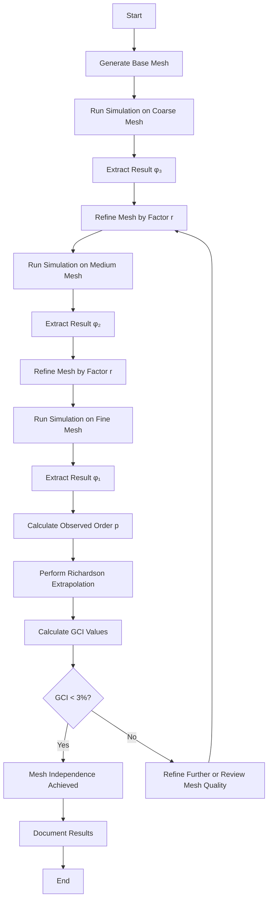
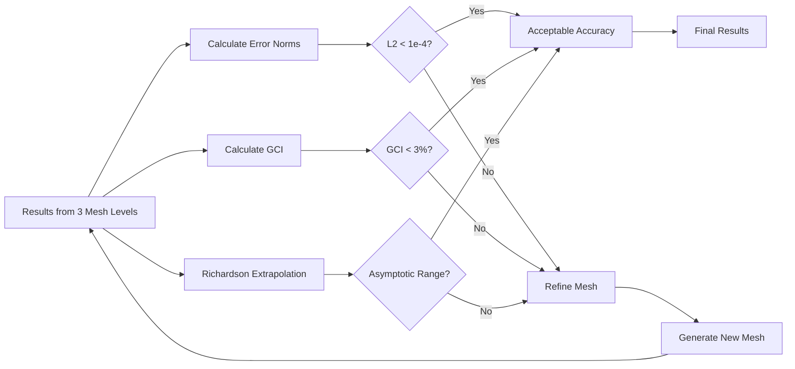

# การศึกษาการลู่เข้าของกริด (Grid Convergence Study)

## 1. บทนำ (Introduction)

การศึกษาการลู่เข้าของกริด (Grid Convergence Study) เป็นขั้นตอนสำคัญในกระบวนการ **Code Verification** เพื่อให้แน่ใจว่าผลเฉลยเชิงตัวเลข (Numerical Solution) ไม่ขึ้นอยู่กับความละเอียดของเมช (Mesh Independent) การศึกษาเชิงระบบนี้ช่วยให้เราสามารถประเมินความไม่แน่นอนเชิงตัวเลข (Numerical Uncertainty) และหาค่าที่ใกล้เคียงกับผลเฉลยที่แท้จริงได้แม่นยำยิ่งขึ้น

> [!INFO] ความสำคัญของการศึกษาการลู่เข้าของกริด
> การศึกษาการลู่เข้าของกริดเป็นส่วนสำคัญของกระบวนการ **Verification & Validation (V&V)** ตามมาตรฐาน ASME V&V 20 ซึ่งให้แนวทางสำหรับการประเมินความแม่นยำของการจำลอง CFD

---

## 2. พื้นฐานทางทฤษฎี (Theoretical Foundation)

### 2.1 การละเอียดเมชอย่างเป็นระบบ (Systematic Mesh Refinement)

การศึกษาต้องรันบนเมชอย่างน้อย 3 ชุดที่มีความละเอียดต่างกันตามอัตราส่วนคงที่ $r$ (มักใช้ $r=2$):

| เมช | ระดับ | ขนาดเซลล์ลักษณะเฉพาะ | จำนวนเซลล์ |
|------|--------|-------------------------|--------------|
| เมชหยาบ | $h_3$ | $h$ | $N$ |
| เมชกลาง | $h_2$ | $h/2$ | $8N$ |
| เมชละเอียด | $h_1$ | $h/4$ | $64N$ |

เงื่อนไขสำคัญ:
- **อัตราส่วนการละเอียดคงที่**: $r = h_{coarse}/h_{fine} = \text{constant}$
- **คุณภาพเมชสม่ำเสมอ**: รักษา aspect ratio, orthogonality, และ skewness ให้ใกล้เคียงกันทุกชุด
- **การละเอียดสม่ำเสมอ**: ละเอียดทั่วทั้งโดเมน ไม่เฉพาะบางบริเวณ

### 2.2 Richardson Extrapolation

ใช้สำหรับประมาณค่าผลเฉลยในอุดมคติที่ขนาดเมชเป็นศูนย์ ($h \to 0$):

$$\phi_{exact} \approx \phi_1 + \frac{\phi_1 - \phi_2}{r^p - 1} \tag{2.1}$$

โดยที่:
- $\phi_{exact}$ คือ ค่าที่ extrapolate ได้ (ค่าใกล้เคียงผลเฉลยแท้จริง)
- $\phi_1$ คือ ผลเฉลยบนเมชละเอียดที่สุด ($h_1$)
- $\phi_2$ คือ ผลเฉลยบนเมชกลาง ($h_2$)
- $r$ คือ อัตราส่วนการละเอียด ($r = h_2/h_1$)
- $p$ คือ อันดับความแม่นยำที่สังเกตได้ (Observed order of accuracy)

**อันดับความแม่นยำที่สังเกตได้** $p$ คำนวณได้จาก:

$$p = \frac{\ln\left(\frac{\phi_3 - \phi_2}{\phi_2 - \phi_1}\right)}{\ln(r)} \tag{2.2}$$

> [!TIP] เงื่อนไขการใช้ Richardson Extrapolation
> การใช้สูตร (2.2) ต้องมั่นใจว่า:
> 1. อยู่ในช่วง asymptotic convergence (ค่าคลาดเคลื่อนลดลงอย่างสม่ำเสมอ)
> 2. อัตราส่วนการละเอียด $r$ คงที่
> 3. ไม่มีความคลาดเคลื่อนจากแหล่งอื่นปนป่วน

---

## 3. ดัชนีการลู่เข้าของกริด (Grid Convergence Index - GCI)

ดัชนี GCI ตามวิธีของ Roache (1998) เป็นตัวชี้วัดความแปรปรวนเชิงตัวเลขในรูปแบบเปอร์เซ็นต์:

$$\text{GCI}_{12} = F_s \frac{|\epsilon_{12}|}{r^p - 1} \tag{3.1}$$

โดยที่:
- $F_s$: ปัจจัยความปลอดภัย (Safety Factor)
  - ใช้ $F_s = 1.25$ สำหรับการศึกษาด้วยเมช 3 ระดับ
  - ใช้ $F_s = 3.0$ สำหรับการศึกษาด้วยเมช 2 ระดับ
- $\epsilon_{12}$: ความคลาดเคลื่อนสัมพัทธ์ระหว่างเมชละเอียดและเมชกลาง
  $$\epsilon_{12} = \frac{\phi_1 - \phi_2}{\phi_1}$$

### การคำนวณ GCI สำหรับเมชหลายระดับ

สำหรับเมช 3 ระดับ คำนวณ GCI ได้ 2 ค่า:

$$\text{GCI}_{21}^{fine} = F_s \frac{|\phi_2 - \phi_1|/|\phi_2|}{r^{p}_{21} - 1}$$

$$\text{GCI}_{32}^{coarse} = F_s \frac{|\phi_3 - \phi_2|/|\phi_3|}{r^{p}_{32} - 1}$$

### เกณฑ์การยอมรับ GCI

| ประเภทการวิเคราะห์ | GCI ที่ยอมรับได้ |
|---------------------|---------------------|
| งานวิจัย (Research) | < 1% |
| วิศวกรรม (Engineering) | < 3% |
| การตรวจสอบเบื้องต้น (Screening) | < 5% |

> [!WARNING] การตรวจสอบ Asymptotic Range
> ต้องตรวจสอบว่าอยู่ในช่วง asymptotic โดยตรวจสอบ:
> $$\frac{\text{GCI}_{32}}{r^p \cdot \text{GCI}_{21}} \approx 1$$
> ค่านี้ควรอยู่ในช่วง 0.8 - 1.2 สำหรับการลู่เข้าที่เหมาะสม

---

## 4. การประเมินคุณภาพด้วย Error Norms

เราใช้ Norm รูปแบบต่างๆ เพื่อประเมินความแม่นยำทั่วทั้งโดเมน:

### 4.1 L2 Norm (Root Mean Square Error)

ประเมินความแม่นยำโดยรวม:

$$\epsilon_{L2} = \sqrt{\frac{1}{N} \sum_{i=1}^{N} \left( \frac{\phi_i - \phi_{exact,i}}{\phi_{ref}} \right)^2 } \tag{4.1}$$

โดยที่:
- $N$: จำนวนจุดในโดเมน
- $\phi_i$: ค่าที่คำนวณได้ที่จุด $i$
- $\phi_{exact,i}$: ค่าอ้างอิงที่แน่นอนหรือค่าที่ extrapolate
- $\phi_{ref}$: ค่าอ้างอิงสำหรับการทำให้เป็นมิติเดียว (มักใช้ค่าสูงสุด)

### 4.2 Maximum Norm (L∞)

ระบุจุดที่เกิดความคลาดเคลื่อนสูงสุด:

$$\epsilon_{max} = \max_{i} \left| \frac{\phi_i - \phi_{exact,i}}{\phi_{ref}} \right| \tag{4.2}$$

Maximum norm มีประโยชน์สำหรับ:
- ระบุบริเวณที่ต้องการเมชละเอียดขึ้น
- ตรวจสอบความเสถียรเชิงตัวเลข
- หาจุดที่มีปัญหาการกระจายตัว

### 4.3 L1 Norm (Average Error)

ความคลาดเคลื่อนเฉลี่ย:

$$\epsilon_{L1} = \frac{1}{N} \sum_{i=1}^{N} \left| \frac{\phi_i - \phi_{exact,i}}{\phi_{ref}} \right| \tag{4.3}$$

### การเปรียบเทียบ Error Norms

| Norm | การใช้งาน | ความไวต่อค่าผิดปกติ |
|------|-------------|-------------------------|
| **L1** | ค่าเฉลี่ยโดยรวม | ต่ำ |
| **L2** | RMS error | ปานกลาง |
| **L∞** | จุดคลาดเคลื่อนสูงสุด | สูง |

---

## 5. การนำไปใช้งานใน OpenFOAM (C++ Implementation)

### 5.1 คลาสสำหรับคำนวณการลู่เข้า

```cpp
// คลาสสำหรับการศึกษาการลู่เข้าของกริด
class gridConvergenceStudy
{
private:
    List<label> nCellsList_;      // จำนวนเซลล์ในแต่ละเมช
    List<scalar> meshSizes_;     // ขนาดเมชลักษณะเฉพาะ
    List<scalar> results_;       // ผลลัพธ์สำหรับปริมาณที่สนใจ
    word quantityName_;          // ชื่อของปริมาณที่ตรวจสอบ
    scalar observedOrder_;       // อันดับความแม่นยำที่สังเกตได้

public:
    // Constructor
    gridConvergenceStudy(const labelList& nCells, const word& quantityName)
    : nCellsList_(nCells),
      quantityName_(quantityName)
    {
        meshSizes_.setSize(nCells_.size());
        results_.setSize(nCells_.size());

        // คำนวณขนาดเมชลักษณะเฉพาะ (characteristic mesh size)
        forAll(nCells_, i)
        {
            meshSizes_[i] = 1.0 / cbrt(scalar(nCells_[i]));
        }
    }

    // รันการศึกษาการลู่เข้า
    void runStudy()
    {
        forAll(nCells_, i)
        {
            Info << "Running simulation on mesh level " << i
                 << " with " << nCells_[i] << " cells..." << endl;

            // สร้างเมช
            createMesh(nCells_[i]);

            // รันการจำลอง
            runSimulation();

            // ดึงผลลัพธ์ (เช่น gas holdup, pressure drop, velocity)
            results_[i] = extractResult();
        }

        calculateConvergence();
    }

    // คำนวณเมตริกการลู่เข้า
    void calculateConvergence()
    {
        if (nCells_.size() < 3)
        {
            WarningIn("gridConvergenceStudy::calculateConvergence()")
                << "Need at least 3 mesh refinements for Richardson extrapolation"
                << endl;
            return;
        }

        // คำนวณอัตราส่วนการละเอียด
        scalar r = meshSizes_[1] / meshSizes_[0];

        // คำนวณอันดับความแม่นยำที่สังเกตได้
        observedOrder_ = log((results_[2] - results_[1]) / (results_[1] - results_[0])) /
                         log(r);

        // Richardson extrapolation สำหรับค่าที่ไม่ขึ้นอยู่กับกริด
        scalar phi_exact = results_[2] + (results_[2] - results_[1]) / (pow(r, observedOrder_) - 1);

        // คำนวณ GCI สำหรับเมชละเอียด
        scalar epsilon_12 = mag(results_[1] - results_[0]) / mag(results_[0]);
        scalar GCI_fine = 1.25 * epsilon_12 / (pow(r, observedOrder_) - 1);

        // แสดงผลลัพธ์
        Info << nl << "=== Grid Convergence Study Results ===" << nl
             << "Quantity: " << quantityName_ << nl
             << "Mesh refinements: " << nCells_.size() << nl
             << "Refinement ratio: " << r << nl
             << "Observed order of accuracy: " << observedOrder_ << nl
             << "Extrapolated exact value: " << phi_exact << nl
             << "GCI on finest mesh: " << GCI_fine * 100 << "%" << nl
             << "--------------------------------------" << endl;
    }
};
```

### 5.2 คลาสสำหรับวิเคราะห์ความคลาดเคลื่อน

```cpp
// คลาสสำหรับคำนวณ error norms
class errorAnalysis
{
private:
    scalar phiRef_;  // Reference magnitude for normalization

public:
    errorAnalysis(const scalar phiRef) : phiRef_(phiRef) {}

    // คำนวณ L1 norm error (average error)
    scalar calculateL1Error(const volScalarField& phi, const volScalarField& phiExact)
    {
        scalar errorSum = 0.0;
        scalar phiRef = max(mag(phiExact));

        forAll(phi, celli)
        {
            scalar localError = mag(phi[celli] - phiExact[celli]) / phiRef;
            errorSum += localError;
        }

        return errorSum / phi.size();
    }

    // คำนวณ L2 norm error (RMS error)
    scalar calculateL2Error(const volScalarField& phi, const volScalarField& phiExact)
    {
        scalar errorSum = 0.0;
        scalar phiRef = max(mag(phiExact));

        forAll(phi, celli)
        {
            scalar localError = mag(phi[celli] - phiExact[celli]) / phiRef;
            errorSum += localError * localError;
        }

        return sqrt(errorSum / phi.size());
    }

    // คำนวณ maximum norm error
    scalar calculateMaxError(const volScalarField& phi, const volScalarField& phiExact)
    {
        scalar phiRef = max(mag(phiExact));
        scalar maxError = 0.0;
        label maxErrorCell = -1;

        forAll(phi, celli)
        {
            scalar localError = mag(phi[celli] - phiExact[celli]) / phiRef;

            if (localError > maxError)
            {
                maxError = localError;
                maxErrorCell = celli;
            }
        }

        Info << "Maximum error location: cell " << maxErrorCell
             << " at coordinates " << mesh.C()[maxErrorCell] << endl;
        return maxError;
    }

    // คำนวณ metrics การลู่เข้าตาม field
    void fieldConvergenceAnalysis(
        const List<volScalarField*>& fields,
        const List<volScalarField*>& referenceFields
    )
    {
        if (fields.size() != referenceFields.size())
        {
            FatalErrorIn("errorAnalysis::fieldConvergenceAnalysis")
                << "Field lists must have same size" << abort(FatalError);
        }

        Info << nl << "=== Field Convergence Analysis ===" << nl;
        Info << setw(20) << "Field Name"
             << setw(15) << "L1 Error"
             << setw(15) << "L2 Error"
             << setw(15) << "Max Error" << nl;
        Info << setw(20) << "---------"
             << setw(15) << "--------"
             << setw(15) << "--------"
             << setw(15) << "--------" << nl;

        forAll(fields, fieldi)
        {
            scalar l1Error = calculateL1Error(*fields[fieldi], *referenceFields[fieldi]);
            scalar l2Error = calculateL2Error(*fields[fieldi], *referenceFields[fieldi]);
            scalar maxError = calculateMaxError(*fields[fieldi], *referenceFields[fieldi]);

            Info << setw(20) << fields[fieldi]->name()
                 << setw(15) << l1Error
                 << setw(15) << l2Error
                 << setw(15) << maxError << nl;
        }
    }
};
```

### 5.3 ระบบอัตโนมัติสำหรับการศึกษาการลู่เข้า

```cpp
// ระบบอัตโนมัติสำหรับการศึกษาการลู่เข้า
class automatedConvergenceStudy
{
private:
    gridConvergenceStudy convergenceAnalyzer_;
    errorAnalysis errorAnalyzer_;

public:
    automatedConvergenceStudy(const labelList& nCells, const word& quantityName)
    : convergenceAnalyzer_(nCells, quantityName),
      errorAnalyzer_(1.0)  // Normalize by unity
    {}

    void runCompleteStudy()
    {
        // Phase 1: รันการศึกษาการลู่เข้า
        convergenceAnalyzer_.runStudy();

        // Phase 2: วิเคราะห์ความคลาดเคลื่อนอย่างละเอียด
        if (nCells_.size() >= 3)
        {
            performDetailedAnalysis();
        }
    }

    void performDetailedAnalysis()
    {
        // เปรียบเทียบ fields ระหว่างเมชสองระดับที่ละเอียดที่สุด
        const volScalarField& phi_fine = getField("phi_fine");
        const volScalarField& phi_ref = getField("phi_reference");

        List<volScalarField*> fields = {const_cast<volScalarField*>(&phi_fine)};
        List<volScalarField*> reference = {const_cast<volScalarField*>(&phi_ref)};

        errorAnalyzer_.fieldConvergenceAnalysis(fields, reference);
    }
};
```

---

## 6. แนวทางปฏิบัติสำหรับการไหลหลายเฟส (Multiphase Specifics)

การศึกษาการลู่เข้าในระบบหลายเฟสมีความท้าทายเพิ่มเติมดังนี้:

### 6.1 ความท้าทายเฉพาะของ Multiphase Flow

| ความท้าทาย | คำอธิบาย | กลยุทธ์แก้ไข |
|-------------|-----------|---------------|
| **Interface Tracking** | ต้องละเอียดเมชเป็นพิเศษบริเวณอินเตอร์เฟซ | ใช้ adaptive mesh refinement (AMR) |
| **Phase Fraction Convergence** | สนามสัดส่วนปริมาตร ($\alpha$) ลู่เข้าช้ากว่าความเร็ว | ตรวจสอบ GCI แยกตามแต่ละเฟส |
| **Sharp Interface Gradients** | Gradient สูงบริเวณอินเตอร์เฟซ | ใช้ interface compression schemes |
| **Coupling Between Phases** | ความผิดพลาดในเฟสหนึ่งส่งผลต่ออีกเฟสหนึ่ง | ตรวจสอบ residuals ทั้งหมด |

### 6.2 กลยุทธ์การละเอียดเมช

```cpp
// กลยุทธ์การละเอียดเมชสำหรับ multiphase flow
// ใช้ใน blockMeshDict หรือ snappyHexMeshDict

// 1. การละเอียดรอบอินเตอร์เฟซ
refinementRegions
{
    interfaceRegion
    {
        mode distance;
        levels ((0.001 4)(0.01 3)(0.1 2));
    }
}

// 2. การละเอียดตาม gradient ของสัดส่วนเฟส
// ใช้ dynamicRefineFvMesh สำหรับ AMR
dynamicRefineFvMeshCoeffs
{
    // กำหนดเกณฑ์การละเอียดตาม alpha field
    alphaField
    {
        lowerRefineLevel 0.3;
        upperRefineLevel 0.7;
        refineInterval 1;
    }
}
```

### 6.3 การตรวจสอบการอนุรักษ์สำหรับ Multiphase

```cpp
// ตรวจสอบการอนุรักษ์มวลสำหรับแต่ละเฟส
void checkPhaseConservation(const PtrList<volScalarField>& alphas)
{
    scalar totalAlpha = 0.0;

    forAll(alphas, phasei)
    {
        scalar phaseVolume = sum(alphas[phasei] * mesh.V());
        totalAlpha += phaseVolume;

        Info << "Phase " << phasei << " volume fraction: "
             << phaseVolume / sum(mesh.V()) << endl;
    }

    scalar unityError = mag(totalAlpha / sum(mesh.V()) - 1.0);

    if (unityError > 1e-6)
    {
        WarningIn("checkPhaseConservation")
            << "Phase fractions do not sum to unity. Error: " << unityError;
    }
}
```

### 6.4 เกณฑ์การยอมรับ (Acceptance Criteria)

สำหรับการไหลหลายเฟส ใช้เกณฑ์ต่อไปนี้:

| ปริมาณ | เกณฑ์การยอมรับ | หมายเหตุ |
|---------|-------------------|-----------|
| **Gas Holdup ($\alpha_g$)** | GCI < 3% | ต้องตรวจสอบทั้งเฉลี่ยและโปรไฟล์ |
| **Terminal Velocity** | GCI < 5% | อาจมีความแปรผันตามเวลา |
| **Pressure Drop** | GCI < 2% | ความไวต่อการละเอียดเมชสูง |
| **Mass Conservation Error** | < $10^{-10}$ | สำหรับการตรวจสอบความถูกต้องโค้ด |
| **Phase Sum ($\sum \alpha_k$)** | 1.0 ± $10^{-6}$ | ต้องเป็น 1 ทุกจุด |

> [!TIP] การตรวจสอบเพิ่มเติมสำหรับ Multiphase
> - ตรวจสอบ **interface sharpness**: ความกว้างของอินเตอร์เฟซควรอยู่ใน 2-3 เซลล์
> - วิเคราะห์ **bubble size distribution** ถ้ามีการใช้ population balance models
> - ตรวจสอบ **force balance**: drag, lift, virtual mass forces

---

## 7. กระบวนการทำงานและแผนภูมิ

### 7.1 ขั้นตอนการศึกษาการลู่เข้าของกริด



### 7.2 การวิเคราะห์ผลลัพธ์



---

## 8. สรุปและแนวทางปฏิบัติที่ดีที่สุด

### 8.1 แนวทางปฏิบัติที่ดีที่สุด

> [!INFO] Best Practices for Grid Convergence Studies
>
> 1. **เริ่มต้นด้วยเมชคุณภาพสูง**: ตรวจสอบคุณภาพเมชก่อนเริ่มการศึกษา
>    - Aspect ratio < 100 (สำหรับชั้นขอบเขต) หรือ < 10 (สำหรับการไหลทั่วไป)
>    - Non-orthogonality < 70°
>    - Skewness < 0.85
>
> 2. **ใช้อัตราส่วนการละเอียดคงที่**: $r = 2$ เป็นค่าที่แนะนำ
>
> 3. **ตรวจสอบ asymptotic range**: ต้องมั่นใจว่าอยู่ในช่วงที่ความคลาดเคลื่อนลดลงอย่างสม่ำเสมอ
>
> 4. **เก็บบันทึกข้อมูลทั้งหมด**: เกณฑ์การลู่เข้า, residuals, เวลาคำนวณ
>
> 5. **ตรวจสอบการอนุรักษ์**: มวล, โมเมนตัม, พลังงานสำหรับทุกชุดเมช

### 8.2 สิ่งที่ควรหลีกเลี่ยง

| ปัญหา | ผลกระทบ | วิธีแก้ไข |
|--------|----------|-------------|
| เปลี่ยนรูปแบบการกระจายเมช | ความคลาดเคลื่อนจากเรขาคณิต | ใช้ uniform refinement |
| ไม่ตรวจสอบคุณภาพเมช | ผลลัพธ์ไม่น่าเชื่อถือ | ใช้ `checkMesh` ทุกครั้ง |
| ใช้เพียง 2 ระดับเมช | ไม่สามารถคำนวณ $p$ ได้ | ใช้อย่างน้อย 3 ระดับ |
| ไม่ทำการทดสอบ asymptotic | GCI ไม่ถูกต้อง | ตรวจสอบอัตราส่วน GCI |
| ละเลยเงื่อนไขขอบเขต | ผลกระทบจากผนัง | ใช้เมชที่ใหญ่พอ |

### 8.3 เกณฑ์การตัดสินใจ

ตัดสินใจว่าการลู่เข้าของกริดเพียงพอเมื่อ:

1. **GCI < 3%** สำหรับปริมาณหลักทั้งหมด
2. **อันดับความแม่นยำที่สังเกตได้** ($p$) ใกล้เคียงกับค่าทางทฤษฎี
3. **Asymptotic range** ถูกตรวจสอบและยอมรับได้
4. **การอนุรักษ์** อยู่ในเกณฑ์ที่เหมาะสม
5. **Error norms** ลดลงตามที่คาดหวัง

---

## 9. อ้างอิง

- Roache, P. J. (1998). *Verification of codes and calculations*. AIAA Journal, 36(5), 696-702.
- ASME V&V 20 Standard (2009). *Standard for Verification and Validation in Computational Fluid Dynamics and Heat Transfer*.
- Celik, I. B., et al. (2008). *Procedure for estimation and reporting of uncertainty due to discretization in CFD applications*. Journal of Fluids Engineering, 130(7).

---

**การทำ Grid Convergence Study อย่างเป็นระบบช่วยเปลี่ยนจากการจำลองที่ "ดูเหมือนจริง" ให้กลายเป็นการคำนวณทางวิศวกรรมที่ "เชื่อถือได้"**
