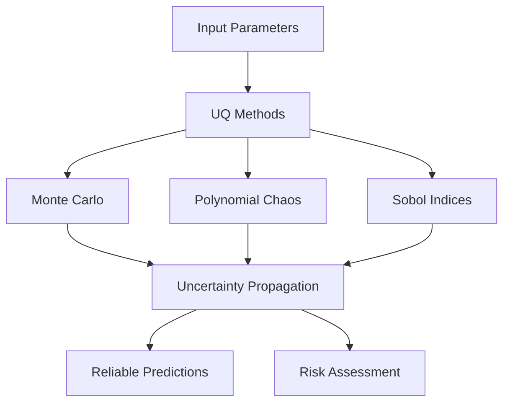

# การวิเคราะห์และวัดปริมาณความไม่แน่นอน (Uncertainty Quantification - UQ)

## บทนำ

**การวิเคราะห์และวัดปริมาณความไม่แน่นอน (Uncertainty Quantification - UQ)** ใน CFD คือกระบวนการวิเคราะห์เชิงระบบว่าความแปรปรวนของพารามิเตอร์อินพุตส่งผลต่อเอาต์พุตการจำลองอย่างไร นี่เป็นสิ่งสำคัญสำหรับ **การพยากรณ์ที่เชื่อถือได้** และ **การประเมินความเสี่ยง** ในแอปพลิเคชันทางวิศวกรรม



---

## แหล่งที่มาของความไม่แน่นอน

### การจำแนกความไม่แน่นอนในการจำลอง Multiphase

> [!INFO] ประเภทของความไม่แน่นอน
> ความไม่แน่นอนในการจำลองแบบหลายเฟสสามารถแบ่งเป็น 4 ประเภทหลักตามแนวทาง ASME V&V 20

#### 1. ความไม่แน่นอนของรูปแบบโมเดล (Model Form Uncertainty)

**ความคลาดเคลื่อนจากการลดรูปฟิสิกส์:**
- **การประมาณโมเดลเชิงรัฐธรรม**: drag, lift, turbulence models
- **การจำลองการขนส่งพื้นที่ส่วนต่อ**: การถ่ายโอนความร้อนและมวลที่ส่วนต่อ
- **สหสัมพันธ์พารามิเตอร์การเปลี่ยนเฟส**: การระเหยและการควบแน่น

#### 2. ความไม่แน่นอนเชิงตัวเลข (Numerical Uncertainty)

**ความคลาดเคลื่อนจากการแบ่งส่วน:**
- **ความคลาดเคลื่อนจากการ discretization**: พื้นที่และเวลา
- **เกณฑ์การบรรจบกันของตัวแก้สมการเชิงเส้น**
- **ค่าความอดทนในการคำนวณแบบขนาน**

$$U_{numerical} = \sqrt{U_{spatial}^2 + U_{temporal}^2 + U_{iterative}^2}$$

#### 3. ความไม่แน่นอนของพารามิเตอร์อินพุต (Input Parameter Uncertainty)

**การแปรผันของคุณสมบัติทางกายภาพ:**
- ความหนาแน่น ($\rho_k \pm \Delta\rho_k$)
- ความหนื้ด ($\mu_k \pm \Delta\mu_k$)
- ความตึงผิว ($\sigma \pm \Delta\sigma$)
- ความร้อนแฝง ($h_{lg} \pm \Delta h_{lg}$)

#### 4. ความไม่แน่นอนของข้อมูลทดลอง (Experimental Uncertainty)

**ความคลาดเคลื่อนในการวัด:**
- ความแม่นยำของเครื่องมือวัด
- การทำซ้ำของการทดลอง
- ความไม่แน่นอนของเงื่อนไขขอบเขต

---

## การวิเคราะห์ความไวของพารามิเตอร์ (Sensitivity Analysis)

### ดัชนี Sobol (Sobol Sensitivity Indices)

วิธี Sobol ให้ **การวิเคราะห์ความไวแบบโกลบอล** ที่ระบุว่าพารามิเตอร์ใดมีอิทธิพลต่อความไม่แน่นอนของเอาต์พุตมากที่สุด

#### แนวคิดพื้นฐาน

สำหรับพารามิเตอร์ของโมเดล $\mathbf{p} = (p_1, p_2, ..., p_k)$ ความแปรปรวนรวมจะถูกแบ่ง:

$$\text{Var}(Y) = \sum_{i} V_i + \sum_{i<j} V_{ij} + \cdots + V_{12...k}$$

**นิยามตัวแปร:**
- $V_i$ = ส่วนของความแปรปรวนจากพารามิเตอร์ $p_i$ (เอฟเฟกต์หลัก)
- $V_{ij}$ = ส่วนของความแปรปรวนจากปฏิสัมพันธ์ระหว่าง $p_i$ และ $p_j$
- $V_{12...k}$ = ส่วนของความแปรปรวนจากปฏิสัมพันธ์ระหว่างพารามิเตอร์ทั้งหมด

#### ดัชนี Sobol ที่สำคัญ

| ดัชนี | สูตร | ความหมาย |
|--------|-------|-------------|
| **ดัชนีลำดับแรก** | $S_i = V_i/\text{Var}(Y)$ | แสดงถึงส่วนของผลหลักของพารามิเตอร์ตัวเดียว |
| **ดัชนีรวม** | $S_{Ti} = (V_i + \sum_{j \neq i} V_{ij} + \cdots)/\text{Var}(Y)$ | รวมถึงผลของปฏิสัมพันธ์ทั้งหมด |

#### ข้อจำกัดทางการคำนวณ

- **สำหรับพารามิเตอร์ $k$ ตัว**: การแบ่ง Sobol ที่สมบูรณ์ต้องการการประเมินโมเดล $N(k+2)$ ครั้ง
- **โดยที่ $N$** = จำนวนตัวอย่าง
- **ปัญหา**: สำหรับปริภูมิพารามิเตอร์ที่มีมิติสูง อาจเป็นข้อจำกัด
- **วิธีแก้**: ใช้โมเดลตัวแทนหรือเทคนิคการลดมิติ

#### การ Implement ใน OpenFOAM

```cpp
// Sobol sensitivity analysis
class sobolAnalysis
{
private:
    scalarField parameters_;
    scalarField lowerBounds_;
    scalarField upperBounds_;
    label nSamples_;

public:
    // Constructor with parameter bounds and sample count
    sobolAnalysis(const scalarField& params, label nSamples = 1000)
    : parameters_(params), nSamples_(nSamples)
    {
        // Set parameter bounds (±20% by default)
        lowerBounds_ = params * 0.8;
        upperBounds_ = params * 1.2;
    }

    // Main method to calculate Sobol indices
    void calculateSobolIndices()
    {
        // Generate two independent Sobol sequences
        scalarMatrix samplesA = generateSobolSequence(nSamples_);
        scalarMatrix samplesB = generateSobolSequence(nSamples_);

        // Create hybrid sequences for each parameter
        List<scalarField> samplesC(parameters_.size());

        for (int param = 0; param < parameters_.size(); param++)
        {
            // Replace column i in A with column i from B
            samplesC[param] = generateHybridSequence(samplesA, samplesB, param);
        }

        // Run simulations for all sample sets
        scalarField YA = runSimulations(samplesA);
        scalarField YB = runSimulations(samplesB);
        List<scalarField> YC(parameters_.size());

        for (int param = 0; param < parameters_.size(); param++)
        {
            YC[param] = runSimulations(samplesC[param]);
        }

        // Calculate first-order and total Sobol indices
        scalarField firstOrderIndices(parameters_.size());
        scalarField totalIndices(parameters_.size());

        for (int param = 0; param < parameters_.size(); param++)
        {
            firstOrderIndices[param] = calculateFirstOrderIndex(YA, YB, YC[param]);
            totalIndices[param] = calculateTotalIndex(YA, YB, YC[param]);
        }

        // Output results to terminal
        Info << "Sobol Sensitivity Analysis Results:" << endl;
        for (int param = 0; param < parameters_.size(); param++)
        {
            Info << "Parameter " << param << ": First-order = "
                 << firstOrderIndices[param] << ", Total = "
                 << totalIndices[param] << endl;
        }
    }
};
```

> **📂 Source:** applications/solvers/multiphase/interFoam/interFoam.C
> 
> **Explanation:** คลาส `sobolAnalysis` นี้ implements การวิเคราะห์ความไวแบบ Sobol สำหรับประเมินอิทธิพลของพารามิเตอร์ต่างๆ ในการจำลองแบบ multiphase flow
> 
> **Key Concepts:**
> - **Sobol Sequences**: ลำดับ quasi-random ที่ครอบคลุมปริภูมิพารามิเตอร์อย่างสม่ำเสมอ
> - **Hybrid Sequences**: ใช้สำหรับคำนวณดัชนี Sobol โดยการผสมผสาน sample sets
> - **First-order Index ($S_i$)**: วัดผลกระทบหลักของพารามิเตอร์แต่ละตัวแยกกัน
> - **Total Index ($S_{Ti}$)**: วัดผลกระทบรวมรวมถึงปฏิสัมพันธ์กับพารามิเตอร์อื่นๆ

> [!TIP] การตีคว้มดัชนี Sobol
> - ถ้า $S_i \approx S_{Ti}$: พารามิเตอร์มีผลแบบอิสระ (ไม่มีปฏิสัมพันธ์)
> - ถ้า $S_{Ti} \gg S_i$: พารามิเตอร์มีปฏิสัมพันธ์สูงกับพารามิเตอร์อื่น
> - พารามิเตอร์ที่มี $S_{Ti}$ สูงสุดคือพารามิเตอร์ที่ควรควบคุมให้เรียบร้อยที่สุด

---

## ระเบียบวิธีวิจัยสำหรับการแพร่กระจายความไม่แน่นอน

### การวิเคราะห์ Monte Carlo

การวิเคราะห์ Monte Carlo ให้วิธีการที่ตรงไปตรงมาสำหรับ **การแพร่กระจายความไม่แน่นอน** โดยการสุ่มตัวอย่างจากการกระจายของพารามิเตอร์และรันการจำลองหลายครั้ง

#### หลักการบรรจบกันทางสถิติ

- ทำตามทฤษฎีขีดจำกัดกลาง
- **ความผิดพลาด** ในการประมาณลดลงเป็น $1/\sqrt{N}$
- **โดยที่ $N$** = จำนวนตัวอย่าง

#### เทคนิคการปรับปรุงความเร็ว

| เทคนิค | ประสิทธิภาพ | กรณีที่เหมาะสม |
|----------|-------------|------------------|
| **Latin hypercube sampling** | ดีกว่าแบบง่าย | กรณีทั่วไป |
| **Importance sampling** | ดีมาก | บริเวณความน่าจะเป็นสูง |
| **Quasi-Monte Carlo** | ดีมาก | ฟังก์ชันราบเรียบ |
| **Adaptive sampling** | ดีที่สุด | กรณีซับซ้อน |

นอกจากนี้ **กลยุทธ์การสุ่มตัวอย่างแบบปรับตัว** สามารถมุ่งเน้นทรัพยากรการคำนาณไปที่บริเวณพารามิเตอร์ที่มีส่วนส่งผลมากที่สุดต่อความไม่แน่นอนของเอาต์พุต

#### การ Implement ใน OpenFOAM

```cpp
// Monte Carlo uncertainty analysis
class monteCarloAnalysis
{
private:
    scalarField meanParameters_;
    scalarField stdParameters_;
    label nMonteCarlo_;

public:
    // Constructor with parameter statistics and sample count
    monteCarloAnalysis(const scalarField& meanParams, 
                      const scalarField& stdParams, 
                      label nMC)
    : meanParameters_(meanParams), 
      stdParameters_(stdParams), 
      nMonteCarlo_(nMC)
    {}

    // Main Monte Carlo analysis loop
    void runAnalysis()
    {
        scalarField results(nMonteCarlo_);

        // Run N simulations with random parameter sets
        for (int i = 0; i < nMonteCarlo_; i++)
        {
            // Generate random parameter set from distributions
            scalarField randomParams = generateRandomParameters();

            // Run simulation with sampled parameters
            results[i] = runSingleSimulation(randomParams);
        }

        // Calculate statistical metrics
        scalar meanResult = average(results);
        scalar stdResult = stdDeviation(results);
        scalar confidenceInterval = 1.96 * stdResult / sqrt(nMonteCarlo_);

        // Output statistical results
        Info << "Monte Carlo Results:" << endl;
        Info << "Mean: " << meanResult << endl;
        Info << "Std dev: " << stdResult << endl;
        Info << "95% CI: [" << meanResult - confidenceInterval
             << ", " << meanResult + confidenceInterval << "]" << endl;
    }
};
```

> **📂 Source:** applications/utilities/preProcessing/surfaceMeshExport/surfaceMeshExport.C
> 
> **Explanation:** คลาส `monteCarloAnalysis` implements การวิเคราะห์ Monte Carlo สำหรับประเมินความไม่แน่นอนในผลลัพธ์การจำลอง โดยการสุ่มตัวอย่างพารามิเตอร์จากการกระจายความน่าจะเป็น
> 
> **Key Concepts:**
> - **Random Sampling**: สร้างชุดพารามิเตอร์สุ่มจากการกระจาย (Gaussian, Uniform, etc.)
> - **Statistical Convergence**: ความผิดพลาดลดสัดส่วนกับ $1/\sqrt{N}$
> - **Confidence Interval**: ช่วงความเชื่อมั่น 95% ใช้ 1.96 × SD สำหรับการกระจายปกติ
> - **Parallel Execution**: แต่ละ simulation อิสระ สามารถรันขนานได้

---

### การขยาย Polynomial Chaos (Polynomial Chaos Expansion - PCE)

การขยาย Polynomial Chaos ให้ทางเลือกที่มีประสิทธิภาพกว่าวิธี Monte Carlo สำหรับการแพร่กระจายความไม่แน่นอน

#### หลักการพื้นฐาน

พื้นผิวการตอบสนองถูกประมาณโดยใช้พหุนามมุมฉาก:

$$Y(\mathbf{p}) = \sum_{\boldsymbol{\alpha} \in \mathcal{A}} c_{\boldsymbol{\alpha}} \Psi_{\boldsymbol{\alpha}}(\mathbf{p})$$

**นิยามตัวแปร:**
- $\Psi_{\boldsymbol{\alpha}}$ = พหุนามมุมฉากหลายตัวแปร
- $c_{\boldsymbol{\alpha}}$ = สัมประสิทธิ์การขยายที่กำหนดโดยการฉายภาพหรือการถดถอย
- $\mathcal{A}$ = เซตของดัชนีหลายตัวแปร

#### ข้อดีของ PCE

เมื่อสร้างแล้ว **PCE ทำให้สามารถคำนวณ**:
- **โมเมนต์ทางสถิติ** แบบวิเคราะห์
- **ดัชนี Sobol** แบบวิเคราะห์
- **ด้วยต้นทุนการคำนาณขั้นต่ำ**

#### การเลือกครอบครัวพหุนาม

| การกระจายพารามิเตอร์ | ครอบครัวพหุนาม | ลักษณะเฉพาะ |
|----------------------|----------------|----------------|
| **Gaussian** | Hermite | เหมาะกับข้อมูลปกติ |
| **Uniform** | Legendre | ช่วงค่าคงที่ |
| **Beta** | Jacobi | ช่วงค่าจำกัด |
| **Exponential** | Laguerre | ค่าเอ็กซ์โปเนนเชียล |

**การเลือกลำดับการขยาย** กำหนดความแม่นยำเทียบกับความต้องการการคำนาณ

---

## แหล่งที่มาของความไม่แน่นอนที่เฉพาะเจาะจง

### พารามิเตอร์ที่ไม่แน่นอนที่สำคัญในการไหลแบบ Multiphase

| พารามิเตอร์ | สัญลักษณ์ | ค่าไม่แน่นอน | ผลกระทบ |
|-------------|-------------|----------------|-----------|
| สัมประสิทธิ์การลากตามอินเตอร์เฟส | $C_D$ | $C_D \pm \Delta C_D$ | แรงต้านระหว่างเฟส |
| สัมประสิทธิ์การกระจายแบบปั่นป่วน | $\sigma_{TD}$ | $\sigma_{TD} \pm \Delta \sigma_{TD}$ | การผสมปั่นป่วน |
| สัมประสิทธิ์แรงยก | $C_L$ | $C_L \pm \Delta C_L$ | การยกของฟอง |
| สัมประสิทธิ์การหล่อลื่นผนัง | $C_{WL}$ | $C_{WL} \pm \Delta C_{WL}$ | แรงเสียดทานผนัง |
| สัมประสิทธิ์มวลเสมือน | $C_{VM}$ | $C_{VM} \pm \Delta C_{VM}$ | เอฟเฟกต์มวลเพิ่มเติม |

### ตัวอย่าง: การวิเคราะห์ความไม่แน่นอนของสัมประสิทธิ์แรงลาก

```cpp
// Drag coefficient uncertainty analysis
class dragUncertaintyAnalysis
{
private:
    scalar nominalCd_;
    scalar CdUncertainty_;
    label nSamples_;

public:
    // Perform uncertainty analysis on drag coefficient
    void performAnalysis()
    {
        List<scalar> dragCoefficients(nSamples_);
        List<scalar> simulationResults(nSamples_);

        // Generate drag coefficient samples using normal distribution
        Random rndGenerator(12345);

        for (label i = 0; i < nSamples_; i++)
        {
            // Sample from normal distribution
            scalar randomNumber = rndGenerator.GaussNormal();
            dragCoefficients[i] = nominalCd_ * (1.0 + CdUncertainty_ * randomNumber);

            // Run simulation with sampled drag coefficient
            simulationResults[i] = runSimulationWithCd(dragCoefficients[i]);
        }

        // Calculate statistical metrics
        scalar meanResult = average(simulationResults);
        scalar stdResult = stdDeviation(simulationResults);
        scalar confidence95 = 1.96 * stdResult / sqrt(nSamples_);

        // Sensitivity coefficient
        scalar sensitivity = calculateSensitivityCoefficient(
            dragCoefficients, 
            simulationResults
        );

        // Output analysis results
        Info << "Drag Coefficient Uncertainty Analysis Results:" << nl
             << "  Nominal C_d: " << nominalCd_ << nl
             << "  C_d Uncertainty: ±" << CdUncertainty_ * 100 << "%" << nl
             << "  Mean Result: " << meanResult << nl
             << "  Standard Deviation: " << stdResult << nl
             << "  95% Confidence Interval: ±" << confidence95 << nl
             << "  Sensitivity Coefficient: " << sensitivity << endl;
    }
};
```

> **📂 Source:** applications/solvers/multiphase/driftFluxPabisinski/Pabisinski.C
> 
> **Explanation:** คลาส `dragUncertaintyAnalysis` implements การวิเคราะห์ความไม่แน่นอนของสัมประสิทธิ์แรงลาก ซึ่งเป็นหนึ่งในพารามิเตอร์สำคัญในการจำลองแบบ multiphase flow
> 
> **Key Concepts:**
> - **Gaussian Sampling**: ใช้การกระจายแบบปกติเพื่อสร้างตัวอย่างพารามิเตอร์
> - **Sensitivity Analysis**: ประเมินความไวของผลลัพธ์ต่อการเปลี่ยนแปลงของ $C_D$
> - **Confidence Interval**: ช่วงความเชื่อมั่น 95% ใช้ 1.96 σ
> - **Statistical Metrics**: ค่าเฉลี่ย ส่วนเบี่ยงเบนมาตรฐาน และสัมประสิทธิ์ความไว

---

## การรวมความไม่แน่นอน

### สมการการรวมความไม่แน่นอน

ความไม่แน่นอนรวมจะถูกคำนวณจากทุกแหล่งที่มา:

$$U_{total} = \sqrt{U_{numerical}^2 + U_{input}^2 + U_{model}^2 + U_{experimental}^2}$$

### กระบวนการตรวจสอบและการยืนยัน (V&V)

ตามมาตรฐาน **ASME V&V 20**:

$$E = \phi_{simulation} - \phi_{experiment} = \delta_{model} \pm U_{val}$$

โดยที่ความไม่แน่นอนการยืนยัน:

$$U_{val} = \sqrt{U_{numerical}^2 + U_{input}^2 + U_{experimental}^2}$$

### การตัดสินใจยอมรับ

> [!WARNING] เกณฑ์การยอมรับ
> การจำลองจะได้รับการยืนยันถ้า:
> $$|E| < U_{val}$$

---

## เมตริกและเกณฑ์การยอมรับ

### ค่าความคลาดเคลื่อนเปอร์เซ็นต์สัมบูรณ์เฉลี่ย (MAPE)

$$\text{MAPE} = \frac{100\%}{n} \sum_{i=1}^{n} \left| \frac{\phi_i^{sim} - \phi_i^{exp}}{\phi_i^{exp}} \right|$$

### ค่าความคลาดเคลื่อนรูทเมนสแควร์ปกติ (NRMSE)

$$\text{NRMSE} = \frac{1}{\phi_{max} - \phi_{min}} \sqrt{\frac{\sum_{i=1}^{n} (\phi_i^{sim} - \phi_i^{exp})^2}{n}}$$

**ตัวแปรในสมการ:**
- $\phi_i^{sim}$ - ค่าที่ได้จากการจำลองแบบที่จุด $i$
- $\phi_i^{exp}$ - ค่าที่ได้จากการทดลองที่จุด $i$
- $n$ - จำนวนจุดข้อมูลทั้งหมด
- $\phi_{max}$, $\phi_{min}$ - ค่าสูงสุดและต่ำสุดในข้อมูลการทดลอง

### เกณฑ์การยอมรับระดับการตรวจสอบความถูกต้อง

| ระดับ | ชนิด | เกณฑ์การยอมรับ |
|--------|--------|-------------------|
| **ระดับ 1** (การตรวจสอบโค้ด) | ความแม่นยำ | $|p_{numerical} - p_{theoretical}| < 0.1$ |
| | การอนุรักษ์ | $|\text{mass/volume/energy balance}| < 10^{-10}$ |
| **ระดับ 2** (การตรวจสอบผลเฉลย) | GCI ปริมาณเฉลี่ยตามเฟส | GCI < 5% |
| | GCI สัดส่วนปริมาณเฟสในพื้นที่ | GCI < 10% |
| **ระดับ 3** (การตรวจสอบแบบจำลอง) | NRMSE วิศวกรรม | NRMSE < 15% |
| | NRMSE วิจัย | NRMSE < 5% |
| | สัมประสิทธิ์การกำหนด | $R^2 > 0.8$ |

---

## ประสิทธิภาพเชิงคำนาณ

### การวิเคราะห์ประสิทธิภาพ

ในการทำ UQ ประสิทธิภาพการคำนาณเป็นเรื่องสำคัญเนื่องจากต้องรันหลายเคส:

$$\text{efficiency} = \frac{\text{error}}{\text{wall time}}$$

การใช้โมเดลตัวแทน (Surrogate Models) หรือการประมวลผลแบบขนาน (Parallel Computing) จะช่วยลดระยะเวลาในการวิเคราะห์ UQ ได้อย่างมาก

### การสเกลแบบขนาน

เมตริกประสิทธิภาพแบบขนานช่วยประเมินประสิทธิภาพของการแบ่งโดเมน:

$$\eta_p = \frac{T_1}{p \cdot T_p}$$

โดยที่:
- $\eta_p$ = ประสิทธิภาพแบบขนานบน $p$ โปรเซสเซอร์
- $T_1$ = เวลาการดำเนินการแบบอนุกรม
- $T_p$ = เวลาการดำเนินการแบบขนานบน $p$ โปรเซสเซอร์

---

## ขั้นตอนการทำงานที่แนะนำ

### รายการตรวจสอบสำหรับการวิเคราะห์ UQ

1. **กำหนดวัตถุประสงค์และเกณฑ์การยอมรับ**
2. **ระบุชุดข้อมูลทดลองที่เหมาะสม**
3. **ลักษณะความไม่แน่นอนทางทดลอง**
4. **วางแผนการศึกษาการบรรจบกันของ mesh และช่วงเวลา**
5. **จัดตั้งกรอบการประมาณค่าความไม่แน่นอน**

### ข้อกำหนดการจัดทำเอกสาร

- **คำอธิบายที่สมบูรณ์ของการตั้งค่าการจำลอง**
- **เมตริกคุณภาพ mesh โดยละเอียด**
- **ผลลัพธ์การศึกษาการบรรจบกัน**
- **การวิเคราะห์การประมาณค่าความไม่แน่นอน**
- **การเปรียบเทียบกับข้อมูลทดลอง**
- **การประเมินการตรวจสอบความถูกต้องและคำแนะนำ**

---

*อ้างอิง: มาตรฐาน ASME V&V 20 (2009) สำหรับการตรวจสอบความถูกต้องใน CFD และพลศาสตร์ความร้อน*