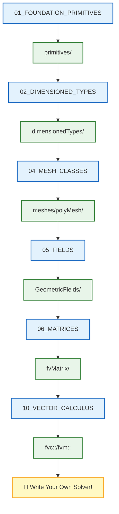

# 🗺️ Learning Navigator: Modern C++ for Custom CFD Solver Development

> [!TIP] ทำไมต้องเรียนรู้ Modern C++ สำหรับ Custom CFD Solver?
> การเข้าใจ Modern C++ (C++17/20) เป็นพื้นฐานสำคัญในการ:
> - **สร้าง Custom Solvers** สำหรับปัญหาทางวิศวกรรมเฉพาะทาง (R410A evaporator, two-phase flow)
> - **ใช้ Smart Pointers** (`std::unique_ptr`, `std::shared_ptr`) สำหรับ memory safety
> - **ออกแบบ Class Hierarchies** สำหรับ Mesh, Fields, และ Solvers
> - **สร้าง CMake Build System** สำหรับ cross-platform compilation
> - **ปรับปรุง Performance** ผ่าน Move Semantics, Template Metaprogramming, และ Expression Templates

> **วัตถุประสงค์**: เอกสารนี้เป็น **เส้นทางการเรียนรู้** สำหรับพัฒนา Custom CFD Engine สำหรับ Refrigerant Two-Phase Flow โดยใช้ Modern C++ Best Practices

---

## 📋 สารบัญ

1. [Modern C++ Fundamentals](#1-modern-c-fundamentals-c17c20-สำหรับ-cfd)
2. [Smart Pointers & Memory](#2-smart-pointers--memory-management-การจัดการหน่วยความจำ)
3. [RAII Patterns](#3-raii-patterns-รูปแบบการจัดการทรัพยากร)
4. [Custom Mesh Classes](#4-custom-mesh-class-hierarchies-ลำดับชั้นคลาสเมชแบบกำหนดเอง)
5. [Field Classes](#5-field-classes-with-value-semantics-คลาสฟิลด์ด้วย-value-semantics)
6. [Linear Algebra](#6-linear-algebra-with-standard-libraries-พีชคณิตเชิงเส้นด้วย-standard-libraries)
7. [IO & Serialization](#7-io--serialization-with-modern-c-การจัดการข้อมูล)
8. [Expression Templates](#8-expression-templates-for-field-algebra-เทมเพลตนิพจน์สำหรับพีชคณิตฟิลด์)
9. [Vector/Tensor Calculus](#9-vectortensor-calculus-libraries-ไลบรารีแคลคูลัสเวกเตอร์เทนเซอร์)
10. [Dimensional Analysis](#10-dimensional-analysis-at-compile-time-การวิเคราะห์มิติ-compile-time)
11. [CMake Build System](#11-cmake-build-system-for-cfd-solvers-ระบบ-build-cmake)
12. [Solver Class Design](#12-solver-class-design-and-composition-การออกแบบคลาส-solver)

---

## 🔄 Module Transformation

**From:** OpenFOAM Programming (usage-focused, wmake compilation)
**To:** Modern C++ for Custom CFD Solver Development (implementation-focused, CMake build)

### Key Changes

| Aspect | Old (OpenFOAM Usage) | New (Modern C++) |
|--------|---------------------|------------------|
| Smart Pointers | `autoPtr`, `tmp` | `std::unique_ptr`, `std::shared_ptr` |
| Memory Management | OpenFOAM RAII | Standard RAII + Move Semantics |
| Build System | `wmake` | `CMake` |
| Field Types | OpenFOAM `Field<T>` | Custom `Field<T>` with STL |
| Linear Algebra | `lduMatrix`, `fvMatrix` | Eigen, Blaze, or custom |
| Mesh Classes | `polyMesh`, `fvMesh` | Custom hierarchy |
| Solver Design | OpenFOAM patterns | Modern design patterns |
| IO System | `IOobject`, `Time` | HDF5, JSON, std::filesystem |

---

## 1. Foundation Primitives (ประเภทข้อมูลพื้นฐาน)

> [!NOTE] **📂 OpenFOAM Context**
> **Domain:** Source Code Structure (`src/OpenFOAM/`)
> **Location:** `src/OpenFOAM/primitives/`
> **Key Files:**
> - `Scalar/` → ประเภทข้อมูล `double` พื้นฐานที่ใช้ใน Field Calculations
> - `Vector/` → `vector`, `label` สำหรับพิกัดและการจำแนก Cell
> - `Tensor/` → `tensor`, `symmTensor` สำหรับ Stress/Strain
> - **Application:** เมื่อเขียน Custom Code คุณจะใช้ Primitives เหล่านี้โดยตรงในการคำนวณ

| 📖 เนื้อหา | 📝 คำอธิบาย | 🔧 Source Code ที่เกี่ยวข้อง |
|-----------|------------|---------------------------|
| [[01_FOUNDATION_PRIMITIVES/00_Overview]] | ภาพรวม Primitives | `src/OpenFOAM/primitives/` |
| [[01_FOUNDATION_PRIMITIVES/01_Introduction]] | แนะนำ Primitives | `src/OpenFOAM/primitives/Scalar/` |
| [[01_FOUNDATION_PRIMITIVES/02_Basic_Primitives]] | Primitives พื้นฐาน | `src/OpenFOAM/primitives/` |
| [[01_FOUNDATION_PRIMITIVES/03_Dimensioned_Types_Intro]] | แนะนำ Dimensioned Types | `src/OpenFOAM/dimensionedTypes/` |
| [[01_FOUNDATION_PRIMITIVES/04_Smart_Pointers]] | Smart Pointers | `src/OpenFOAM/memory/autoPtr/` |
| [[01_FOUNDATION_PRIMITIVES/05_Containers]] | Containers | `src/OpenFOAM/containers/` |
| [[01_FOUNDATION_PRIMITIVES/06_Summary]] | สรุป | - |
| [[01_FOUNDATION_PRIMITIVES/07_Exercises]] | แบบฝึกหัด | - |

---

## 2. Dimensioned Types (ประเภทที่มีมิติ)

> [!NOTE] **📂 OpenFOAM Context**
> **Domain:** Physics-Aware Type System (`src/OpenFOAM/`)
> **Location:** `src/OpenFOAM/dimensionedTypes/`
> **Key Files:**
> - `dimensionedScalar/` → ใช้ใน `constant/transportProperties` (nu, rho)
> - `dimensionedVector/` → ใช้ใน Gravity definition
> - `dimensionSet/` → ตรวจสอบความสมดุลของหน่วยในสมการ (Unit Consistency)
> - **Application:** เมื่อกำหนด Physical Properties ใน Solver หรือ Boundary Conditions

| 📖 เนื้อหา | 📝 คำอธิบาย | 🔧 Source Code ที่เกี่ยวข้อง |
|-----------|------------|---------------------------|
| [[02_DIMENSIONED_TYPES/00_Overview]] | ภาพรวม | `src/OpenFOAM/dimensionedTypes/` |
| [[02_DIMENSIONED_TYPES/01_Introduction]] | แนะนำ Dimensioned Types | `src/OpenFOAM/dimensionedTypes/dimensionedScalar/` |
| [[02_DIMENSIONED_TYPES/02_Physics_Aware_Type_System]] | ระบบ Type รู้ฟิสิกส์ | `src/OpenFOAM/dimensionSet/` |
| [[02_DIMENSIONED_TYPES/03_Implementation_Mechanisms]] | กลไกการ Implement | `src/OpenFOAM/dimensionedTypes/` |
| [[02_DIMENSIONED_TYPES/04_Template_Metaprogramming]] | Template Metaprogramming | `src/OpenFOAM/` |
| [[02_DIMENSIONED_TYPES/05_Pitfalls_and_Solutions]] | ปัญหาและแนวทางแก้ | - |
| [[02_DIMENSIONED_TYPES/06_Engineering_Benefits]] | ประโยชน์ทางวิศวกรรม | - |

---

## 3. Containers & Memory (คอนเทนเนอร์และหน่วยความจำ)

> [!NOTE] **📂 OpenFOAM Context**
> **Domain:** Memory Management (`src/OpenFOAM/`)
> **Location:** `src/OpenFOAM/containers/` และ `src/OpenFOAM/memory/`
> **Key Files:**
> - `List/`, `UList/` → พื้นฐานของ Field Storage
> - `autoPtr/`, `refPtr/` → Smart Pointers สำหรับ Dynamic Memory
> - **Application:** เมื่อจัดการ Large Arrays ของ Field Data และ Mesh Connectivity

| 📖 เนื้อหา | 📝 คำอธิบาย | 🔧 Source Code ที่เกี่ยวข้อง |
|-----------|------------|---------------------------|
| [[03_CONTAINERS_MEMORY/00_Overview]] | ภาพรวม | `src/OpenFOAM/containers/` |
| [[03_CONTAINERS_MEMORY/01_Introduction]] | แนะนำ | `src/OpenFOAM/containers/Lists/` |
| [[03_CONTAINERS_MEMORY/02_Memory_Management_Fundamentals]] | พื้นฐานการจัดการหน่วยความจำ | `src/OpenFOAM/memory/` |
| [[03_CONTAINERS_MEMORY/03_Container_System]] | ระบบ Container | `src/OpenFOAM/containers/` |
| [[03_CONTAINERS_MEMORY/04_Integration_and_Best_Practices]] | แนวปฏิบัติที่ดี | - |

---

## 4. Mesh Classes (คลาสเมช)

> [!NOTE] **📂 OpenFOAM Context**
> **Domain:** Mesh Infrastructure (`src/OpenFOAM/` และ `src/finiteVolume/`)
> **Location:** `src/OpenFOAM/meshes/` และ `src/finiteVolume/fvMesh/`
> **Key Files:**
> - `primitiveMesh/` → Topology พื้นฐาน (points, faces, cells)
> - `polyMesh/` → General Mesh Structure ที่ใช้ใน Pre-processing
> - `fvMesh/` → Finite Volume Mesh ที่ Solver ใช้งานจริง
> - **Application:** เมื่อเขียน Function Objects ที่ต้อง Access Cell/Face Data หรือ Custom Boundary Conditions

| 📖 เนื้อหา | 📝 คำอธิบาย | 🔧 Source Code ที่เกี่ยวข้อง |
|-----------|------------|---------------------------|
| [[04_MESH_CLASSES/00_Overview]] | ภาพรวม Mesh Classes | `src/OpenFOAM/meshes/` |
| [[04_MESH_CLASSES/01_Introduction]] | แนะนำ | `src/OpenFOAM/meshes/primitiveMesh/` |
| [[04_MESH_CLASSES/02_Mesh_Hierarchy]] | ลำดับชั้นของ Mesh | `src/OpenFOAM/meshes/` |
| [[04_MESH_CLASSES/03_primitiveMesh]] | primitiveMesh | `src/OpenFOAM/meshes/primitiveMesh/` |
| [[04_MESH_CLASSES/04_polyMesh]] | polyMesh | `src/OpenFOAM/meshes/polyMesh/` |
| [[04_MESH_CLASSES/05_fvMesh]] | fvMesh | `src/finiteVolume/fvMesh/` |
| [[04_MESH_CLASSES/06_Common_Pitfalls]] | ปัญหาที่พบบ่อย | - |

---

## 5. Fields & GeometricFields (ฟิลด์)

> [!NOTE] **📂 OpenFOAM Context**
> **Domain:** Field System (`src/OpenFOAM/fields/` และ `src/finiteVolume/`)
> **Location:** `src/OpenFOAM/fields/` และ `src/finiteVolume/fields/`
> **Key Files:**
> - `Fields/Field/` → Base Class สำหรับ Field Storage
> - `GeometricFields/` → Field ที่ผูกกับ Mesh (มี Internal Field + Boundary Field)
> - **Application:** **สำคัญที่สุด** เมื่อเขียน Solver คุณจะใช้ `volScalarField`, `volVectorField` ทุกวัน
> - **Connection:** Fields ใน `0/` directory ถูก Read/Write ผ่าน Class เหล่านี้

| 📖 เนื้อหา | 📝 คำอธิบาย | 🔧 Source Code ที่เกี่ยวข้อง |
|-----------|------------|---------------------------|
| [[05_FIELDS_GEOMETRICFIELDS/00_Overview]] | ภาพรวม Fields | `src/OpenFOAM/fields/` |
| [[05_FIELDS_GEOMETRICFIELDS/01_Introduction]] | แนะนำ | `src/OpenFOAM/fields/Fields/` |
| [[05_FIELDS_GEOMETRICFIELDS/02_Design_Philosophy]] | ปรัชญาการออกแบบ | `src/OpenFOAM/fields/GeometricFields/` |
| [[05_FIELDS_GEOMETRICFIELDS/03_Inheritance_Hierarchy]] | ลำดับชั้นการสืบทอด | `src/finiteVolume/fields/` |
| [[05_FIELDS_GEOMETRICFIELDS/04_Field_Lifecycle]] | วงจรชีวิตของ Field | `src/OpenFOAM/fields/` |
| [[05_FIELDS_GEOMETRICFIELDS/05_Mathematical_Type_Theory]] | ทฤษฎี Type ทางคณิตศาสตร์ | - |
| [[05_FIELDS_GEOMETRICFIELDS/06_Common_Pitfalls]] | ปัญหาที่พบบ่อย | - |

---

## 6. Matrices & Linear Algebra (เมทริกซ์และพีชคณิตเชิงเส้น)

> [!NOTE] **📂 OpenFOAM Context**
> **Domain:** Linear Solvers (`system/fvSolution` + `src/`)
> **Location:** `src/OpenFOAM/matrices/lduMatrix/` และ `src/finiteVolume/fvMatrices/`
> **Key Files:**
> - `lduMatrix/` → Sparse Matrix Storage ที่ใช้ใน FVM
> - `fvMatrix/` → Matrix ที่เกิดจาก Discretization ของ PDE
> - `solvers/` → Linear Solvers (GAMG, PCG, PBiCGStab)
> - **Application:** เมื่อปรับแต่ง Solver Settings ใน `system/fvSolution` หรือเขียน Custom Equation
> - **Connection:** Keywords ใน `system/fvSolution` เช่น `solver`, `tolerance`, `relTol` มาจาก Class เหล่านี้

| 📖 เนื้อหา | 📝 คำอธิบาย | 🔧 Source Code ที่เกี่ยวข้อง |
|-----------|------------|---------------------------|
| [[06_MATRICES_LINEARALGEBRA/00_Overview]] | ภาพรวม | `src/OpenFOAM/matrices/` |
| [[06_MATRICES_LINEARALGEBRA/01_Introduction]] | แนะนำ | `src/OpenFOAM/matrices/lduMatrix/` |
| [[06_MATRICES_LINEARALGEBRA/02_Dense_vs_Sparse_Matrices]] | Dense vs Sparse | `src/OpenFOAM/matrices/` |
| [[06_MATRICES_LINEARALGEBRA/03_fvMatrix_Architecture]] | สถาปัตยกรรม fvMatrix | `src/finiteVolume/fvMatrices/` |
| [[06_MATRICES_LINEARALGEBRA/04_Linear_Solvers_Hierarchy]] | ลำดับชั้น Linear Solvers | `src/OpenFOAM/matrices/lduMatrix/solvers/` |
| [[06_MATRICES_LINEARALGEBRA/05_Parallel_Linear_Algebra]] | พีชคณิตเชิงเส้นแบบขนาน | `src/OpenFOAM/matrices/lduMatrix/` |
| [[06_MATRICES_LINEARALGEBRA/06_Common_Pitfalls]] | ปัญหาที่พบบ่อย | - |

---

## 7. Time & Databases (เวลาและฐานข้อมูล)

> [!NOTE] **📂 OpenFOAM Context**
> **Domain:** Simulation Control (`system/controlDict` + `src/`)
> **Location:** `src/OpenFOAM/db/Time/`
> **Key Files:**
> - `Time/` → Time Management (startTime, endTime, deltaT)
> - `IOobjects/` → File I/O System (การอ่าน/เขียน Fields)
> - **Application:** เมื่อเขียน Function Objects ที่ต้อง Access Time Data หรือ Custom Output
> - **Connection:** Settings ใน `system/controlDict` เช่น `startTime`, `endTime`, `writeControl` ถูกควบคุมโดย Class นี้

| 📖 เนื้อหา | 📝 คำอธิบาย | 🔧 Source Code ที่เกี่ยวข้อง |
|-----------|------------|---------------------------|
| [[07_TIME_DATABASES/00_Overview]] | ภาพรวม | `src/OpenFOAM/db/Time/` |
| [[07_TIME_DATABASES/01_Introduction]] | แนะนำ | `src/OpenFOAM/db/` |
| [[07_TIME_DATABASES/02_Time_Architecture]] | สถาปัตยกรรม Time | `src/OpenFOAM/db/Time/` |

---

## 8. Field Types (ประเภทฟิลด์)

> [!NOTE] **📂 OpenFOAM Context**
> **Domain:** Field Definitions (`0/` directory + `src/`)
> **Location:** `src/finiteVolume/fields/`
> **Key Files:**
> - `volFields/` → Field บน Cell Centers (U, p, T) → เก็บใน `0/` directory
> - `surfaceFields/` → Field บน Face Centers (flux, phi)
> - **Application:** **ใช้งานทุกวัน** เมื่อเขียน Solver คุณจะ Declare Fields เหล่านี้ใน `createFields.H`
> - **Connection:** Files ใน `0/U`, `0/p`, `0/T` คือ Serialization ของ Class เหล่านี้

| 📖 เนื้อหา | 📝 คำอธิบาย | 🔧 Source Code ที่เกี่ยวข้อง |
|-----------|------------|---------------------------|
| [[08_FIELD_TYPES/00_Overview]] | ภาพรวม | `src/finiteVolume/fields/volFields/` |
| volScalarField | สนามสเกลาร์ | `src/finiteVolume/fields/volFields/` |
| volVectorField | สนามเวกเตอร์ | `src/finiteVolume/fields/volFields/` |
| surfaceScalarField | สนามบนพื้นผิว | `src/finiteVolume/fields/surfaceFields/` |

---

## 9. Field Algebra (พีชคณิตฟิลด์)

> [!NOTE] **📂 OpenFOAM Context**
> **Domain:** Field Operations (Solver Code)
> **Location:** `src/finiteVolume/` และ `src/OpenFOAM/fields/`
> **Key Files:**
> - Operator Overloading → `+`, `-`, `*`, `/` สำหรับ Field Operations
> - **Application:** เมื่อเขียน PDE เช่น `solve(fvm::ddt(T) - fvm::laplacian(k, T))`
> - **Connection:** Algebra ที่คุณเขียนใน Solver จะถูกแปลงเป็น Matrix Operations ผ่าน Class เหล่านี้

| 📖 เนื้อหา | 📝 คำอธิบาย | 🔧 Source Code ที่เกี่ยวข้อง |
|-----------|------------|---------------------------|
| [[09_FIELD_ALGEBRA/00_Overview]] | ภาพรวม | `src/OpenFOAM/fields/` |
| Field Operations | การดำเนินการกับฟิลด์ | `src/finiteVolume/` |

---

## 10. Vector Calculus (แคลคูลัสเวกเตอร์)

> [!NOTE] **📂 OpenFOAM Context**
> **Domain:** Discretization Schemes (`system/fvSchemes` + `src/`)
> **Location:** `src/finiteVolume/finiteVolume/fvc/` และ `fvm/`
> **Key Files:**
> - `fvc/` → Explicit Calculus (grad, div, laplacian) → ใช้ใน `system/fvSchemes`
> - `fvm/` → Implicit Calculus → สร้าง Matrix สำหรับ Solver
> - **Application:** **ใจกลางของ Solver** เมื่อ Discretize PDE เช่น1$\nabla \cdot (\rho \mathbf{U})$
> - **Connection:** Keywords ใน `system/fvSchemes` เช่น `gradSchemes`, `divSchemes`, `laplacianSchemes` คือการเลือก Numerical Schemes สำหรับ Operations เหล่านี้

| 📖 เนื้อหา | 📝 คำอธิบาย | 🔧 Source Code ที่เกี่ยวข้อง |
|-----------|------------|---------------------------|
| [[10_VECTOR_CALCULUS/00_Overview]] | ภาพรวม | `src/finiteVolume/finiteVolume/` |
| fvc::grad | Gradient | `src/finiteVolume/finiteVolume/fvc/` |
| fvc::div | Divergence | `src/finiteVolume/finiteVolume/fvc/` |
| fvc::laplacian | Laplacian | `src/finiteVolume/finiteVolume/fvc/` |

---

## 11. Tensor Algebra (พีชคณิตเทนเซอร์)

> [!NOTE] **📂 OpenFOAM Context**
> **Domain:** Tensor Operations (`src/OpenFOAM/primitives/`)
> **Location:** `src/OpenFOAM/primitives/Tensor/` และ `SymmTensor/`
> **Key Files:**
> - `tensor/` → General 3x3 Tensor (สำหรับ Velocity Gradient, Stress)
> - `symmTensor/` → Symmetric Tensor (สำหรับ Strain Rate, Reynolds Stress)
> - **Application:** เมื่อทำ Turbulence Modeling, Stress Analysis, หรือ Rheology
> - **Connection:** ใช้ใน RANS Models ($\tau_{ij} = 2\mu_t S_{ij}$) และ Constitutive Equations

| 📖 เนื้อหา | 📝 คำอธิบาย | 🔧 Source Code ที่เกี่ยวข้อง |
|-----------|------------|---------------------------|
| [[11_TENSOR_ALGEBRA/00_Overview]] | ภาพรวม | `src/OpenFOAM/primitives/Tensor/` |
| tensor | Tensor Class | `src/OpenFOAM/primitives/Tensor/` |
| symmTensor | Symmetric Tensor | `src/OpenFOAM/primitives/SymmTensor/` |

---

## 12. Dimensional Analysis (การวิเคราะห์มิติ)

> [!NOTE] **📂 OpenFOAM Context**
> **Domain:** Unit Consistency (`src/OpenFOAM/dimensionSet/`)
> **Location:** `src/OpenFOAM/dimensionSet/` และ `dimensionedTypes/`
> **Key Files:**
> - `dimensionSet/` → ระบบตรวจสอบหน่วย (Mass [kg], Length [m], Time [s], ...)
> - **Application:** **Compile-time Safety** ป้องกันการเขียนสมการที่มีหน่วยไม่ตรง
> - **Connection:** Properties ใน `constant/transportProperties` ต้องระบุ dimensions ผ่านระบบนี้
> - **Example:** `nu [0 2 -1 0 0 0 0]` → kinematic viscosity (m²/s)

| 📖 เนื้อหา | 📝 คำอธิบาย | 🔧 Source Code ที่เกี่ยวข้อง |
|-----------|------------|---------------------------|
| [[12_DIMENSIONAL_ANALYSIS/00_Overview]] | ภาพรวม | `src/OpenFOAM/dimensionSet/` |
| dimensionSet | ระบบมิติ | `src/OpenFOAM/dimensionSet/` |
| dimensionedScalar | สเกลาร์ที่มีมิติ | `src/OpenFOAM/dimensionedTypes/` |

---

## 📁 OpenFOAM Source Code Structure

```
src/
├── OpenFOAM/
│   ├── primitives/           ← 🌟 ประเภทข้อมูลพื้นฐาน
│   │   ├── Scalar/
│   │   ├── Vector/
│   │   └── Tensor/
│   │
│   ├── dimensionedTypes/     ← 🌟 ประเภทที่มีมิติ
│   │   ├── dimensionedScalar/
│   │   └── dimensionedVector/
│   │
│   ├── containers/           ← 🌟 Containers
│   │   └── Lists/
│   │
│   ├── meshes/               ← 🌟 Mesh Classes
│   │   ├── primitiveMesh/
│   │   └── polyMesh/
│   │
│   ├── fields/               ← 🌟 Field Classes
│   │   ├── Fields/
│   │   └── GeometricFields/
│   │
│   ├── matrices/             ← 🌟 Matrix Classes
│   │   └── lduMatrix/
│   │
│   ├── memory/               ← Memory Management
│   │   └── autoPtr/
│   │
│   └── db/                   ← Databases
│       └── Time/
│
└── finiteVolume/
    ├── fvMesh/               ← Finite Volume Mesh
    ├── fields/               ← FV Fields
    │   ├── volFields/
    │   └── surfaceFields/
    ├── fvMatrices/           ← FV Matrices
    └── finiteVolume/
        └── fvc/              ← 🌟 Calculus Operations
```

---

## 🎓 Learning Path



---

## 🔗 Quick Links

| ต้องการทำ | เนื้อหา | Source Code |
|----------|--------|-------------|
| **สร้าง Field ใหม่** | [[05_FIELDS_GEOMETRICFIELDS]] | `fields/GeometricFields/` |
| **ใช้ fvm/fvc** | [[10_VECTOR_CALCULUS]] | `finiteVolume/fvc/` |
| **สร้าง Matrix** | [[06_MATRICES_LINEARALGEBRA]] | `fvMatrices/` |
| **เข้าใจ Mesh** | [[04_MESH_CLASSES]] | `meshes/polyMesh/` |

---

*Last Updated: 2025-12-26*
